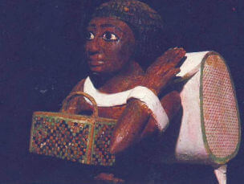
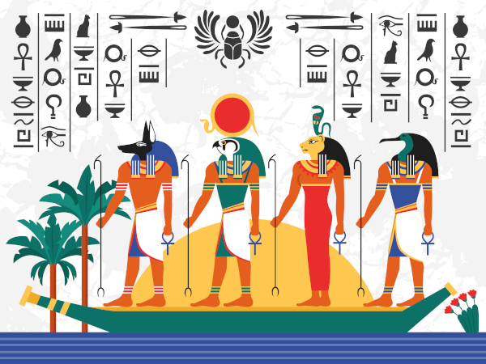

\sinc

## System 

&nbsp;

\conc

«Bandageless, revive, curse, escape» uses the [Breathless](https://fari-rpgs.itch.io/breathless-srd) system, modifying and expanding its rules to capture the adventures your mummies will take part in to escape the museum.

### Checks

When there's a challenge to overcome, you roll to see how it plays out. You only need to roll if what you want to do is risky.

The GM announces that your action may be risky and dangerous; you then choose a skill and roll the corresponding die. If a fellow mummy helps you, they also roll, and you both run the same risks. The GM takes the highest roll and interprets the result.

|Check|Results|
|---|---|
|1-2|You fail, and something wrong happens.|
|3-4|You succeed, but at a cost.|
|5+|You succeed. The higher the result, the better the effect.|

Being a reanimated mummy 3,000 years after its death is difficult. Each roll reduces the skill score used by one level to a minimum of d4:

> **d12 ⇾ d10 ⇾ d8 → d6 → d4**

If desired, the GM can leave a starting decision up to chance. Simply choose a die based on the probability of something happening, roll, and interpret the result.

### Reset the bandages (Catch Your Breath)

To regain all your skills, you must "catch your breath." This is a short rest so you can tie, braid, and adjust your bandages, the only thing holding your tattered remains together.

To catch your breath, you must first be **out of danger in a quiet place, away from the watchful eyes of guards and security cameras**. Second, and most importantly, you must have a piece of cloth** (shirts, rugs, tunics, etc.) of any material (linen, cotton, polyester, wool, etc.) in your gear to patch your bandages.

A mummy in the group only needs to spend one die level on the cloth piece to allow all mummies to catch their bandages.

\sp

Like the rest of the equipment, the piece of cloth is destroyed when it reaches d4.

When a mummy rewraps its bandages, the GM observes the situation and presents a new complication to the group.

### Loot Checks

Ironically, you'll have to loot the museum you're trapped in to escape; something museums have been doing for centuries with the riches of your culture.

When the plot allows, you can make a looting roll to search for equipment that will aid you in your escape.

Be careful because you might come across things you didn't want to, such as an inattentive security guard coming from the restroom or grabbing a coffee from the staff lounge.

The equipment you can search for is mainly items from the museum's display cases and utility cabinets, from **bronze axes** to **dinosaur femurs**, including **cleaning products** and **restoration tools**.

To make a looting roll you must roll a d20 and consult the following table.

|1d20|Equipo|
|---|---|
|1|Doomed item|
|2|Trouble is here.|
|3-14|There is nothing.|
|15-16|Add a d6 item.|
|17-18|Add a d8 item.|
|19-20|Add a d10 item or a bottle of embalsing chemicals.|

If you're not sure what you'll get with the looting roll, you can roll a d20 on the following table.

There are no cursed items in all museum rooms, only those containing relics, marked with an ankh (&#9765;) on the "Room Theme or Function Table."

If you roll a 1 in a room without relics, roll again.

\sinc

&nbsp;

|1d20|Equip|
|---|---|
|1|Museum map|
|2|Cotton T-shirt or sweatshirt from the museum store|
|3|Flint-tipped spear, javelin, etc.|
|4|Whistle, Viking horn, Roman tuba, etc.|
|5|Torch, lantern, oil lamp, etc.|

\conc

\sp

\sinc

|1d20|Equip|
|---|---|
|6|Bronze axe, bronze khopesh, etc.|
|7|Etruscan sling, recurve bow, etc.|
|8|Roman bust, Paleolithic Venus, etc.|
|9|Toolbox, repair kit, etc.|
|10|Tote bag with museum logo, wicker basket, etc.|
|11|Tyrannosaurus femur, whale rib, etc.|
|12|Rug, animal skins, etc.|
|13|Paint can, spray paint can, etc.|
|14|Rubbing alcohol, kerosene, etc.|
|15|WWII helmet, Viking helmet, etc.|
|16|Ming vase, Roman amphora, etc.|
|17|Ceremonial robe, shroud, ermine cloak, etc.|
|18|Metal marbles, marble balls, etc.|
|19|Fire extinguisher, sand bucket, fire blanket, etc.|
|20|Museum map|

&nbsp;

\conc

### Backpack

The items in your backpack can be used in place of your skills. They start with a die level that decreases after each use.

When reduced to a d4, the item breaks, is lost, or simply disappears from history.

Only **3 items and 1 bottle of embalming fluid** can be carried in your backpack.

### Doomed Items

The museum staff may not know it, but the display cases are filled with items of great magical power and ominous curses that will aid you in your escape.

\sp

\sinc

|1d10|Doomed Items|
|---|---|
|1|**Neanderthal Skull with Strange Symbols:** Summons a horde of rats that follow you and blindly obey your commands.|
|2|**Crystal Skull:** Allows you to speak telepathically with humans.|
|3|**Canopic Jars with Mummy Organs:** Cures 2 points of degradation by consuming part of the stored organs.|
|4|**Censer with Demonic Symbols:** Creates a dense fog that fills the entire room, making it impossible to see anything.|
|5|**Ancient Tome in a Dead Language Bound with Human Skin:** Allows you to raise zombies from the remains of any animal (from small stuffed rodents to dinosaur skeletons). Each zombie can make a d6 roll to help you.|
|6|**Executioner's Axe:** It thirsts for blood, and if you attack with it, it always severs the head.|
|7|**Black-Bladed Cavalry Saber:** Its edge is so sharp it cuts through any material, no matter how hard.|
|8|**Iron Mask:** Its intimidating presence strikes fear into the minds of humans.|
|9|**WWI Gas Mask:** Makes you immune to all types of gas, poisons, smoke, etc.|
|10|**Nazi Officer's Luger Pistol:** Used to execute people; if you shoot, it always kills.|

&nbsp;

\conc

Doomed items start with a 1d10. Each use causes them to lose one die level until they reach a d4 and lose their magical power. To use their magical abilities, you must pass the item roll.

Each mummy can only have one cursed item, and they do not take up space in your backpack. These are items you wear on your head like tiaras and helmets, around your neck like necklaces, or even between your bandages or on your hands and feet.

There may be items or situations, at the GM's discretion, that replenish your items with energy, so a cursed item can be kept as equipment while waiting to recharge its power.

\sp

### Praying to the Gods (Stunts)

When things get tough, you can try calling on the ancient gods of Egypt and roll a **d12** instead of a roll at your current skill rank.

Once you spend the prayer to your patron deity, you can't use it again until you **reapply your bandages**.

### Degradation (Stress)

When you face a consequence as a result of one of your actions, the GM may decide that you receive 1 level of bodily degradation.

If your mummy reaches 4 levels of degradation, you are severely degraded, meaning you are in a very poor state of preservation.

When you are degraded, failing a dangerous action means your body collapses, leaving only a pile of dried human remains and old, dirty bandages.

Perhaps the conservators will be able to do something with your remains in a few years, and you will return to life to try to escape the museum again.

### Embalming Chemicals (Medikits)

You can pour a bottle of embalming chemicals over yourself at any time to remove 2 degradation points. Alternatively, take cover in a safe place for a few seconds to tighten your bandages and remove 1 degradation point.

### Your Mummy

On your mummy sheet, write your name, your dynasty, the patron deity you commend yourself to, and your character's pronouns.

All skills are scored on d4, and you must assign a d10, a d8, and a d6 to three skills you think your character excels at.

Characters have a total of 6 skills:

* **Bash:** wreck, move, force.
* **Dash:** run, jump, climb.
* **Sneak:** hide, skulk, lurk.

\sp

* **Shoot:** track, throw, fire.
* **Think:** perceive, analyze, repair.
* **Sway:** charm, manipulate, intimidate.

At the start of each night of escape, you will also carry in your bandolier a random piece of equipment (d10) that you were buried with and that was among your bandages.

\sinc

&nbsp;

|1d20|Starting Equipment Piece|
|---|---|
|1|**[Sekhem scepter](https://en.wikipedia.org/wiki/Sekhem_scepter):** You can use it as a weapon|
|2|**[Khepresh Crown](https://en.wikipedia.org/wiki/Khepresh):** You can use it for protection|
|3|**Funerary Mask:** You can use it for protection|
|4|**Statuette of your favorite deity:** Allows you to "Praying to the Gods" once|
|5|**[Khopesh](https://en.wikipedia.org/wiki/Khopesh):** You can use it as a weapon|
|6|**Bronze Axe:** You can use it as a weapon|

\conc
