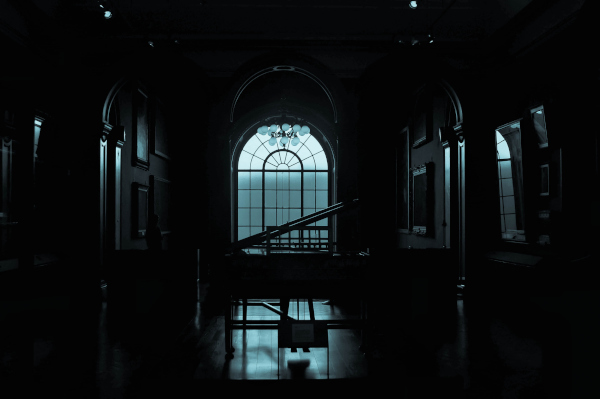
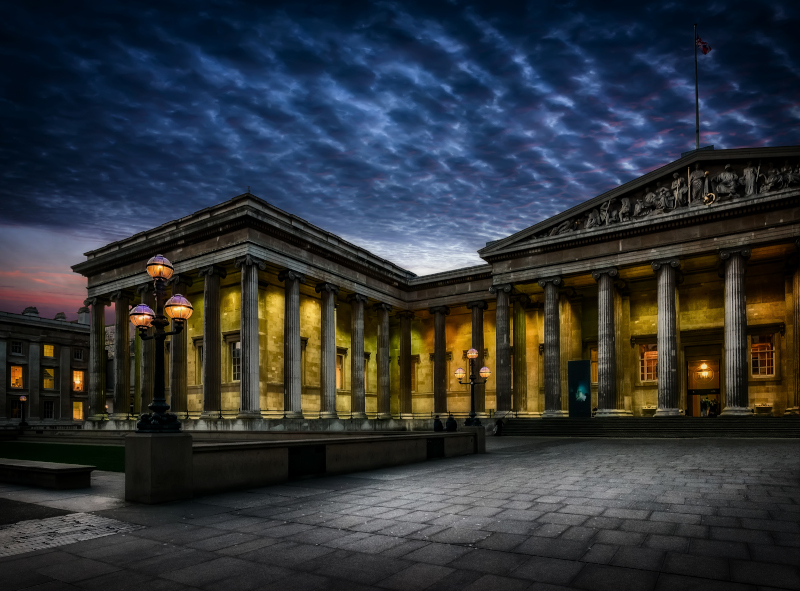

\sinc

## The Museum

&nbsp;

\conc

Museums are calm, peaceful, quiet, and safe places. But imagine waking up from a 3,000-year sleep in an unknown, dark, and lonely place, filled with objects you recognize and many others you do not, with strange shapes, strange lights, and surely even stranger functions.

Imagine people in strange clothing screaming at the sight of you or attacking you with strange, extremely loud weapons.

> If you are a mummy, a museum is not a good place to wake up.

### The Museum's Security Staff

While during the day thousands of people stroll through the halls learning about and admiring the pieces on display, everything changes at night.

The hallways empty out, leaving only the security staff and a few cleaners finishing their work.

The security guards are not tough ex-military men risking their lives to defend the Mona Lisa. They are ordinary people working their hours, and when faced with horrors like mummies, they will try to save their lives and then protect the museum's pieces.

Some will flee, and others will try to confront your mummies, but both always think about saving their own skins.

#### Fighting or flying the Guards

To begin with, an ordinary human is no match for a mummy. At most, they might inflict some damage before fleeing in terror or falling unconscious and/or dead from a mummy's attacks.

Faced with one or more guards, your mummy can rush into combat, brandishing its weapons, or it can try to evade them with stealth or by creating distractions. However, they can also frighten them and cause them to flee in terror.

#### Scare the Security Guards

Your mummies are just that, mummies, and we have been telling horror stories for centuries about these beings who are reborn through ancient and powerful magic, spreading terror wherever they appear.

This is why it is very easy for your mummies to scare the museum's night staff and make them flee.

\sp

There are many ways to scare the security staff, so the mummy must describe how they do it, and the GM will decide which of the six skills they should roll to try to scare the humans.

If they succeed, the group of mummies will make the museum security staff flee, but they will likely raise the alarm.

If they fail, the guards will likely pull out their service weapons and start shooting and beating the mummies. The mummies will receive degradation points in the form of bullet holes, at the GM's discretion.

### Museum Rooms

Museums are usually gigantic buildings with multiple floors, basements, hallways, storage rooms, and countless rooms of all shapes and sizes for all kinds of uses. They are veritable labyrinths that are very difficult to escape from if you do not know the way.

They usually do not have windows, and the ones they do have are security windows and/or have bars, so there are usually only a few viable exits: the main entrance or the loading and unloading dock.

To represent the **size of a museum, they have clocks with 4, 6, or 8 squares.** The more squares, the larger the museum, and the greater the distance from your starting room to an outside door and your freedom. When creating your adventure, keep in mind that each square represents a room you will traverse.

When your group of mummies enters a new room, they can take a quick look and decide whether to continue or look for another way. They can do this as many times as they want, but it has repercussions, as we will see later in the «Alarms» section.

Once inside, they must find a way to cross the room, avoiding the guards and without setting off the alarms.

#### Creating Rooms

When your mummies enter a new room, roll, if desired, on the «Table of the room's theme or function» to define its function and content.

#### Customizing Rooms

A lot happens in museums, and even if you visit rooms with the same content or function, they are never the same.

For each new room, you can choose the customization option from the «Table of room personalization» or roll 1d12.

\sp

\sinc

### Table of the room's theme or function

&nbsp;

\conc

|1d66|Theme or function|
|---|---|
|11|Broom Room|
|12|Renaissance Painters|
|13|Archives and Documentation|
|14|Storage Room for Uncataloged or Quarantined Objects|
|15|Break Area for workers with coffee and vending machines|
|16|Cafeteria|
|21|Great Central Hall|
|22|Audio Guide Collection and Delivery Room|
|23|Roman and Greek Statue Room|
|24|Abstract Art Room|
|25|Impressionist Painting Room|
|26|Interior Garden|
|31|Boiler Room|
|32|Invited Exhibition of Terracotta Warriors|
|33|&#9765; Cold storage for special objects|
|34|Tightly sealed loading and unloading dock|
|35|&#9765; Library|
|36|&#9765; Lost and found room|

&#9765; there may be doomed items

\sc

|1d66|Theme or function|
|---|---|
|41|&#9765; Restoration Room|
|42|Cloakroom|
|43|&#9765; Edo Period Japanese Exhibition|
|44|Movie Theater|
|45|&#9765; World War I Hall|
|46|Modern Art Gallery|
|51|Nursing Room|
|52|&#9765; Saloon filled with medieval armor|
|53|Gift Shop|
|54|&#9765; Collections of shells and carapaces of extinct animals|
|55|&#9765; Jurassic Room with dinosaur skeletons|
|56|&#9765; Large room with the museum's most iconic piece (Mona Lisa, Rosetta Stone, Mask of Tutankhamun, etc.)|
|61|&#9765; World War II Exhibition|
|63|&#9765; Bronze Age Objects|
|62|Administration Area|
|64|&#9765; Hall of Great Explorers|
|65|&#9765; New museum installation with everything wrapped in cardboard and bubble wrap|
|66|&#9765; Travelling Exhibit|

\sp

\sinc

### Table of room customizations

&nbsp;

|1d12|Room customizations|
|---|---|
|1|**Special Decoration:** The room is highly decorated, reminiscent of a caveman's cavern, a jungle, a castle hall, or a Roman house.|
|2|**Cleaning Cart:** Someone left a cleaning cart behind. The cart can only be used in this room and has a d8.|
|3|**Interactive Experiences:** It is full of interactive screens that allow you to play and interact with the pieces in the room.|
|4|**Skylight:** There is a skylight that lets you see the sky. But it is too high to climb out.|
|5|**Under Construction:** The room is full of construction materials, tools, and heavy machinery. If it had any relics, it no longer has them.|
|6|**Freshly Polished Floor:** The floor is very slippery and highly reflective.|
|7|**Old building:** The room uses remains from the museum's old building, ruins found while excavating the foundations, or even a structure brought stone by stone from its original location.|
|8|**Temporarily closed room:** It is locked, or they have put something large and heavy in the room to prevent people from entering.|
|9|**Fountain:** Depending on the size of the room, this could be anything from a cold water dispenser to a fountain with koi carp.|
|10|**Small Shop:** Only in rooms with relics; otherwise, roll again. There is a small shop with souvenirs specific to the room's contents. You may reroll the looting roll, but you must keep the second result.|
|11|**Party or Anniversary:** Some kind of party has been held, and there are remnants of it, from balloons to birthday cake.|
|12|**Ventilation Shaft:** A large duct or shaft runs from one side of the room to the other. Your mummies can crawl inside to cross the room or hide.|

&nbsp;

\conc

\sp

#### Museum Map

The **museum map** is a very useful object for navigating through the rooms, but it is not easy to interpret. They have strange drawings and you do not know their hieroglyphics.

If you pass the roll, the map allows you to reroll on the «Table of the room's theme or function» and keep the best roll.

The map can be used after you know what is in the room and how many guards there are.

When the Map die reaches d4, it becomes unusable; it is torn, bent, stained, etc.

#### Split the party

The basic rule is that you do not have to split the party, but if you do, you will have to create new room clocks for each group with as many filled-in cubes as there were before you broke up.

When a party changes rooms, there is a chance they will meet again if they roll the same number of times when using the «Table of room customizations» roll.

### Alarms

The museum's alarms can go off at any time, and if that happens, you will have to return to your display case or try to escape. Alarms do not go off for no reason, but rather due to a series of actions. While the alarms are deactivated, moving around the museum is relatively easy; once they are activated, everything gets more complicated.

Alarms are a way to **complicate escapes** and put more pressure on the mummies. Alarms are **clocks you create at the beginning of the delivery with 4, 6, 8, 10, or 12 little cheeses** depending on the museum's security.

This clock summarizes a number of elements of the museum's security system, such as guard response time, the number of guards and patrols, the sensitivity and quality of the sensors, etc.

* When they catch their breath, you refill another one.
* Every other time they enter a new room and decide not to enter and look for another exit.
* When you acquire a cursed object. Even if they do not know why, people notice the magic of these objects and place more security on them than on the rest of the museum's objects.
* By successfully scaring and making security personnel flee, you fill in another piece of cheese.

> It is important that your mummies do not know exactly when the alarm dots are filled, just a brief idea.

\sp

As long as you have dots to fill, the alarms have not gone off. The moment you have to **fill a dot and there is no free space, the alarms will go off** and you will have to return to your sarcophagus to escape another day or run for the exit and let Anubis do what he wants.

A timer with 4 slots is a very difficult security system to bypass; with 12, there is no time constraints unless the escape goes seriously awry. If not specified, the alarm clock is considered to have 12 dots, which is almost as if there were no limit.

If the groups split up, the alarm clock remains the same, and both groups put dots into the clock.

#### When the alarms go gff

When the alarms go off, things are going to get very difficult for your mummies. Your mummies will have to decide whether to make a mad dash for the exit or return to their sarcophagi to wait for the next night.

If the alarms have not gone off and there are relics in the room (they have a &#9765; in their name), with a 1 in 1d4 (25%), there is only one guard in the room. If there are no relics, there is no guard, unless you, as the GM, decide otherwise.

When the alarms go off, there is a chance that there will be 1d6 guards. If the room has relics or valuables, with a 1-2 in 1d4 (50%), there are guards. If there are no relics, there are only guards, with a 1 in 1d4.

&nbsp;

|¿Does the alarms go off?|&#9765; Are there relics?|1d4|Guards|
|---|---|---|---|
|No|No| — | — |
|No|Yes|1|1|
|Yes|No|1|1d6|
|Yes|Yes|1-2|1d6|

Returning to the sarcophagus has its advantages, as you can attempt your escape again the following night. This means several things for the following night:

* The room route from the previous night can be retained, if desired. What does reset is the number of guards in each room.
* You can store one of your items (even cursed ones) in your bandages for the following night.
* Your alarms and clock are reset.

Returning to the sarcophagus, if there are jackals nearby, is useless. They will trap you in your sarcophagus or display case and drag your soul to the depths of the afterlife.

\sp

\sinc

&nbsp;

\conc

### Conflicts

In addition to all of the above, if possible, you can add more elements of conflict to increase the tension of the situation. You can use this table to help you come up with ideas for your adventure.

1. **There is a group of white-collar thieves:** You must avoid the guards and the thieves, and the alarms could go off at any moment.
2. **Hostage Situation:** You wake up in the middle of a hostage situation. There are no guards, but there are trained ex-military personnel with powerful firearms.
3. **Fire:** A terrible fire is devouring the museum. You must avoid the smoke, the fire, and the firefighters. Remember, it is escape or burn to death.
4. **Seriously Wounded:** You must flee, taking with you a fellow mummy who has been severely damaged by time or seriously injured by a jackal.
5. **Strikes and Pickets:** The museum workers are on strike and have taken over the museum. There are pickets everywhere, people sleeping in sleeping bags, etc.

\sp

6. **The room has no exit:** You reach a room with no exit and must return the way you came. You will have to face what was in the previous room again and you will have to erase the last checkmark from the room clock.

### Missions

A priori, the main mission is to escape the museum, but there may be other options if you wish to modify this.

1. **Obtain the «Book of Life and Death»:** With it, you can free yourself from Anubis and his jackals, and even restore your body to human form.
2. **Another mummy is being stalked by a jackal:** You must help another awakened mummy, who for some reason is being chased by a jackal.
3. **Talk to someone in the Egyptology department:** Perhaps someone in the Egyptology department will know what to do with you.