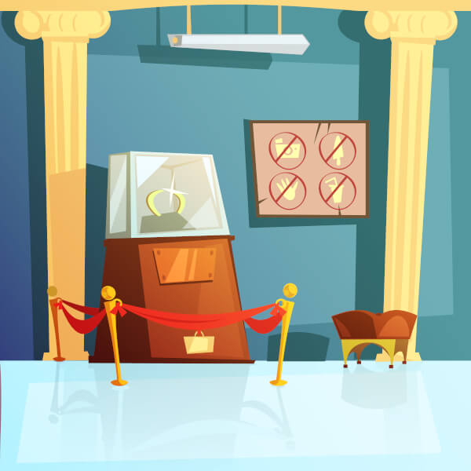
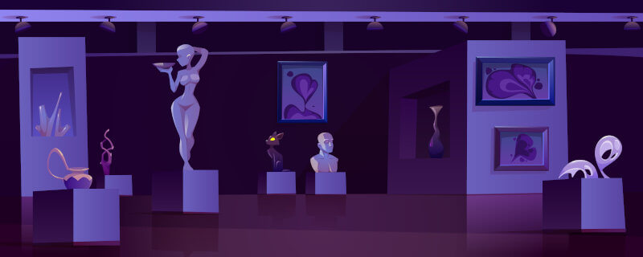

\sinc

## The Museum

&nbsp;

\conc

Museums are calm, peaceful, quiet, and safe places. But imagine waking up from a 3,000-year sleep in an unknown, dark, and lonely place, filled with objects you recognize and many others you do not, with strange shapes, strange lights, and surely even stranger functions.

Imagine people in strange clothing screaming at the sight of you or attacking you with strange, extremely loud weapons.

> If you are a mummy, a museum is not a good place to wake up.

### The Museum's Security Staff

While during the day thousands of people stroll through the halls learning about and admiring the pieces on display, everything changes at night.

The hallways empty out, leaving only the security staff and a few cleaners finishing their work.

The security guards are not tough ex-military men risking their lives to defend the Mona Lisa. They are ordinary people working their hours, and when faced with horrors like mummies, they will try to save their lives and then protect the museum's pieces.

Some will flee, and others will try to confront your mummies, but both always think about saving their own skins.

#### Fighting or flying the Guards

To begin with, an ordinary human is no match for a mummy. At most, they might inflict some damage before fleeing in terror or falling unconscious and/or dead from a mummy's attacks.

Faced with one or more guards, your mummy can rush into combat, brandishing its weapons, or it can try to evade them with stealth or by creating distractions. However, they can also frighten them and cause them to flee in terror.

\sp

#### Asustar a los vigilantes

Tus momias son eso, momias, y llevamos siglos contando historias de terror sobre estos seres que renacen por medio de magia antigua y poderosa y que siembran el terror allá donde aparecen.

Es por ello que a tus momias les es muy fácil asustar y hacer huir al personal nocturno del museo.

Hay muchas maneras de asustar al personal de seguridad, con lo que la momia deberá describir cómo lo hace y el DJ dirá que habilidad, de las 6 que hay, debe tirar para intentar asustar a los humanos. 

Si tienen éxito, el grupo de momias hará huir a la seguridad del museo, pero seguramente hará que den las alarmas.

En caso de fallo, seguramente, los vigilantes sacarán su arma reglamentaria y se liarán a tiros y a porrazos con las momias. Estas recibirán puntos de degradación en forma de agujeros de bala, a discreción del DJ.

### Las salas del museo

Los museos suelen ser edificios de tamaño gigantesco con varios pisos, sótanos, pasillos, almacenes e infinidad de salas de todos las formas y tamaños para todo tipo de usos. Son auténticos laberintos de los que es muy difícil salir si no conoces el camino.

No suelen tener ventanas y las que tienen son de seguridad y/o tienen rejas, con lo que solo suele haber unas pocas salidas viables, la entrada principal o el muelle de carga y descarga.

Para representar el **tamaño de un museo, tienen relojes de 4, 6, 8 quesitos**. Cuantos más quesitos, más grande es el museo y mayor es la distancia desde tu sala inicial hasta una puerta al exterior y tu libertad. A la hora de crear tu aventura piensa que cada quesito va a suponer una sala que vas a atravesar.

Cuando tu grupo de momias entra en una nueva sala, puede echar un vistazo rápido y decidir si continúa o busca otro camino. Esto pueden hacerlo las veces que sean, pero tiene su repercusión, como veremos más adelante en el apartado de «Alarmas».

\sp

\sinc

### Tabla de temática o función de la sala

\conc

|1d66|Temática o función|
|---|---|
|11|Sala de las escobas|
|12|&#9765; Pintores renacentistas|
|13|&#9765; Archivos y documentación|
|14|&#9765; Sala de almacenamiento de objetos sin catalogar o en cuarentena|
|15|Zona de descanso de los trabajadores con café y máquinas de vending|
|16|Cafetería|
|21|Gran salón central|
|22|Sala de recogida y entrega de audioguías|
|23|&#9765; Sala de estatuas romanas y griegas|
|24|Sala de arte abstracto|
|25|Sala de cuadros impresionistas|
|26|Jardín interior|
|31|Sala de calderas|
|32|&#9765; Exposición invitada de los guerreros de terracota|
|33|&#9765; Cámara frigorífica para conservación de objetos especiales|
|34|Muelle de carga y descarga cerrado a cal y canto|
|35|&#9765; Biblioteca|
|36|&#9765; Cuarto de objetos perdidos|

&#9765; puede haber objetos malditos

\sc

|1d66|Temática o función|
|---|---|
|41|&#9765; Sala de restauraciones|
|42|Guardarropas|
|43|&#9765; Exposición japonesa del periodo Edo|
|44|Sala de cine|
|45|&#9765; Sala de la I GM|
|46|Pinacoteca moderna|
|51|Sala de lactancia|
|52|&#9765; Salsa llena de armaduras medievales|
|53|Tienda de regalos|
|54|&#9765; Colecciones de conchas y caparazones de animales extintos|
|55|&#9765; Sala jurásica con esqueletos de dinosaurios|
|56|&#9765; Gran estancia con la pieza más icónica del museo (Mona Lisa, Piedra Roseta, Mascara de Tutankamon, etc.)|
|61|&#9765; Exposición de la II GM|
|63|&#9765; Objetos de la edad de bronce|
|62|Zona de administración|
|64|&#9765; Sala de las grandes exploraciones|
|65|&#9765; Nueva instalación del museo con todo envuelto en cartón y plástico de burbujas|
|66|&#9765; Exposición itinerante|

\sp

\sinc

### Tabla de personalización de la sala

|1d12|Personalización de la sala|
|---|---|
|1|**Decoración especial:** La sala está muy decorada, igual como una cueva de cavernícolas, una selva, un salón de un castillo, una casa romana.|
|2|**Carrito de limpieza:** Alguien se ha dejado un carro de la limpieza abandonado. El carrito puede usarse solo en esta sala y tiene un d8.|
|3|**Experiencias interactivas:** Está lleno de pantallas interactivas que permiten jugar e interactuar con las piezas de la sala.|
|4|**Claraboya:** Hay una claraboya que permite ver el cielo. Pero está altísima para salir por ella.|
|5|**En obras:** La sala está llena de material de obra, herramientas y maquinaria pesada. Si tenía reliquias, ya no los tiene.|
|6|**Suelo recién pulido:** El suelo está muy resbaladizo y refleja mucho.|
|7|**Antiguo edificio:** La sala aprovecha restos del edificio antiguo del museo, de unas ruinas encontradas al excavar los cimientos o incluso alguna estructura traída piedra a piedra de su localización de origen.|
|8|**Sala cerrada temporalmente:** Está cerrado con llaves, o han puesto algo grande y pesado que no permite entrar, para evitar que la gente entre.|
|9|**Fuente:** Según el tamaño de la sala, puede ser desde un dispensador de agua fría, hasta una fuente como carpas koi.|
|10|**Pequeña tienda:** Solo en salas con reliquias, si no, vuelve a tirar. Hay una pequeña tienda con recuerdos específicos del contenido de esa sala. Puedes repetir la tirada de saqueo, pero debes quedarte el segundo resultado.|
|11|**Fiesta o aniversario:** Se ha celebrado algún tipo de fiesta y hay restos de ellas, desde globos a tarta de cumpleaños.|
|12|**Conducto de ventilación:** Una gran tubería o conducto recorre la sala de un lado a otro. Tus momias puede meterse dentro para cruzar la sala o para esconderse.|

&nbsp;

\conc

\sp

Una vez dentro deberán buscar la manera de atravesar la sala, evitando a los guardas y sin activar las alarmas.

#### Creando las salas

Cuando tus momias entren en una nueva sala, tira, si quieres, en la «Tabla de temática o función de la sala» para definir su función y contenido.

#### Personalizando las salas

En los museos pasan muchas cosas y aunque visites salas con el mismo contenido o función, nunca son iguales.

Por cada nueva sala puedes escoger la personalización de «Tabla de personalización de la sala» o tirar 1d12.

#### Mapa del museo

El **mapa del museo** es un objeto muy útil para moverte por sus salas, pero no es fácil de interpretarlo. Son tienen dibujos raros y no conoces sus jeroglíficos.

El mapa, si pasas la tirada, te permite volver a tirar en la «Tabla de temática o función de la sala» y quedarte con la mejor tirada.

El mapa puede usarse después de saber qué hay en la sala y cuántos vigilantes hay.

Cuando el dado de Mapa llega a d4 se vuelve inservible, está roto, doblado, manchado, etc.

#### Separar el grupo

La regla fundamental es que no hay que separar el grupo, pero si se da el caso, tendrás que generar nuevos relojes de salas para cada grupo con tantos quesitos rellenados como había antes de separarse.

Cuando un grupo cambia de habitación, hay posibilidad de que vuelvan a encontrarse si sacan la misma tirada a la hora de tirar «Tabla de temática o función de la sala».

### Alarmas

Las alarmas del museo pueden activarse en cualquier momento y si eso pasa, tendrás que volver a tu vitrina o intentar salir corriendo. Las alarmas no saltan porque sí, sino que lo hacen por una acumulación de muchas acciones. Mientras las alarmas están desactivadas, moverse por el museo es relativamente fácil, en cuanto se activan todo se complica.

Las alarmas son una forma de **complicar las evasiones** y meter más presión a las momias. Las alarmas son **relojes que creas al principio de la entrega con 4, 6, 8, 10 o 12 quesitos** según la seguridad del museo.

Este reloj resume un montón de elementos del sistema de seguridad del museo como el tiempo de repuesta de los vigilantes, el número de vigilantes y las rondas, la sensibilidad y calidad de los sensores, etc.  

\sp

* Cuando recuperan el resuello, rellenas otro.
* Cada dos veces que entran en una nueva sala y deciden no entrar y buscar otra salida.
* Cuando consigues un objeto maldito. Aunque no sepan por qué, las personas notan la magia de estos objetos y les ponen más seguridad que al resto de cosas del museo.
* Al asustar y hacer huir con éxito a personal de seguridad rellenas otro quesito.

> Es importante que tus momias no tengan claro cuando se rellenan los quesitos de las alarmas, solo una breve idea.

Mientras tengas quesitos que rellenar, las alarmas no han saltado. En el momento que tengas que **rellenar un quesito y haya no espacio libre, saltarán las alarmas** y deberás volver a tu sarcófago para escapar otro día o correr hacia la salida y que sea lo que Anubis quiera.

Un reloj con 4 espacios es un sistema de seguridad muy complicado evitar, con 12 no hay ningún problema de tiempo a no ser que se tuerza mucho la fuga. Si no se especifica, se considera que el reloj de las alarmas tiene 12 quesitos, que es casi como si no hubiera un límite.

Si los grupos se separan el reloj de las alarmas sigue siendo único y ambos grupos meten quesitos en el reloj.

#### Cuando suenan las alarmas

Cuando suenan las alarmas, las cosas se van a poner muy difíciles para tus momias. Tus momias deberán decidir si lanzarse a una loca carrera hacia la salida o volver a sus sarcófagos a esperar a la noche siguiente.

Si no han saltado las alarmas y hay reliquias en la sala (tienen un &#9765; en el nombre), con un 1 en 1d4 (25%), hay un solo vigilante en la sala. Si no hay reliquias, no hay vigilante, a no ser que tú, como DJ, lo decidas así.

Cuando saltan las alarmas hay posibilidades de que haya 1d6 vigilantes. Si la sala tiene reliquias u objetos de valor con 1-2 en 1d4 (50%) hay guardias. Si no tienen reliquias solo hay guardas con un 1 en 1d4.

&nbsp;

|¿Suenan alarmas?|&#9765; ¿Hay reliquias?|1d4|Guardas|
|---|---|---|---|
|No|No| — | — |
|No|Sí|1|1|
|Sí|No|1|1d6|
|Sí|Sí|1-2|1d6|

\sp

\sinc

\conc

Volver al sarcófago tiene sus ventajas, ya que puedes volver a intentar la noche siguiente tu fuga. Eso supone varias cosas para la noche siguiente:

* La ruta de salas de la noche anterior se puede conservar, si se desea. Lo que sí se resetea es el número de guardias en cada habitación. 
* Pueden guardar uno de sus objetos (incluso malditos) entre sus vendas para la noche siguiente.
* Las alarmas y su reloj se resetean.

Volver al sarcófago, si hay chacales cerca, no sirve de nada. Te atraparán en tu sarcófago o vitrina y arrastrarán tu alma a lo más profundo del más allá.

### Conflictos

A todo lo anterior puedes meter, si aún cabe, más elementos de conflicto, para aumentar la tensión de la situación. Puedes usar esta tabla como ayuda para sacar ideas para tu aventura.

1. **La sala no tiene salida:** Llegas a una sala sin salida y debe volver por donde has venido. Tendrás que volver a enfrentarte a lo que había en la sala anterior y deberás borrar el último quesito del reloj de salas.
2. **Hay un grupo de ladrones de guante blanco:** Deberéis esquivar a los vigilantes y también a los ladrones y las alarmas podrían sonar en cualquier momento.
3. **Situación de rehenes:** Os despertáis en medio de una situación de rehenes. No hay vigilantes, pero hay ex-militares entrenados con potentes armas de fuego.
4. **Incendio:** Un terrible incendio está devorando el museo, deberás esquivar el humo, el fuego y los bomberos. Recuerda que es escapar o morir calcinado.
5. **Gravemente herido:** Tienes que huir llevándote contigo alguna compañera momia gravemente deteriorada por el tiempo o herida gravemente por un chacal.

\sp

6. **Huelgas y piquetes:** Los trabajadores del museo están de huelga y han tomado el museo. Hay piquetes por todas partes, gente durmiendo en sacos de dormir, etc.

### Misiones

A priori, la misión principal es escapar del museo, pero puede haber otras opciones, si deseas modificar esto.

1. **Conseguir el «El libro de la vida y de la muerte»:** Con él podrás librarte de Anubis y sus chacales, incluso restaurar tu cuerpo a su forma humana.
2. **Otra momia está siendo acechada por un chacal:** Deberás ayudar a otra momia despertada, que por alguna razón está siendo perseguida por un chacal.
3. **Hablar con alguien del departamento de egiptología:** Quizás alguna persona del departamento de egiptología sepa qué hacer contigo.