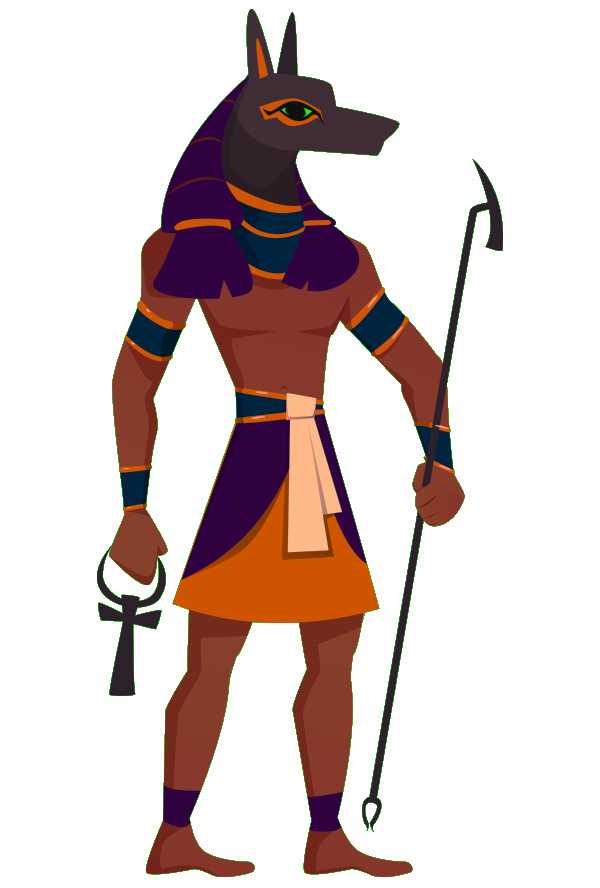

\sinc

## Los chacales de Anubis

&nbsp;

\conc

Has quebrantado las leyes de la vida y la muerte y Anubis no está contento con ellos, por lo que el dios de la muerte ha enviado a sus chacales para cazarte y traerte ante su presencia.

Los chacales de Anubis tienen el tamaño de un oso con brutales colmillos y garras, pelaje negro como la noche y ojos de fuego. Se dedican a cazar a los que han roto las leyes del más allá y han escapado al mundo de los vivos.

> Cuando un chaval acaba con una momia, su espíritu es enviado de nuevo al inframundo.

Son excepcionales cazadores, muy inteligentes y con sentidos muy desarrollados. Sin una palabra mejor para definirlos, son el depredador de ultratumba definitivo.

### Cómo usarlos

Los chacales son una **capa sobrenatural** que puedes añadir a tus partidas. Son cazadores muy poderosos de los que tus momias deben huir, no pueden enfrentarse a ellos y ganar, solo un plan muy elaborado y loco puede permitirte derrotarlo.

_Piensa en ello como ese alien de Alien³ que caza desde las sombras a los reclusos de la colonia penal y que necesitan hacer un complicadísimo plan para matarlo en la fundición._

Sobre cuando van a salir, realmente cuando tú quieras. Quizás sean lo primero que vean al salir de su sarcófago o tal vez salgan por sorpresa de entre las sombras y se interpongan entre tus momias y la libertad que supone la puerta principal del museo.

\sp

Si vas a meter chacales, aconsejo meterlos poco a poco. Tal vez unos ojos de fuego que te miran desde la sala que acabas de abandonar. Quizás unos zarpazos en una estatua o unos telares de la sala en la que acabas de entrar. Para finalmente verlos en todo su terrible esplendor entre ti y la libertad.

### Poderes y capacidades de los chacales

Sus brutales garras y colmillos hacen **heridas terribles**, no solo en tus vendas y en tu carne, también en tu alma inmortal.

Las heridas que hacen son muy graves y la degradación que suponen no pueden quitarse recolocándote las vendas, solo por medios mágicos. Piensa que no han dañado tus vendas y tu carne reseca, sino que han atacado directamente tu espíritu.

A pesar de venir del mundo espiritual del inframundo, son muy reales y de hecho tienen una gran fuerza física. No vale con cruzar una mesa delante de una puerta para que no puedan entrar, igual tienes que poner una pesada estatua romana de cuerpo entero.

Además de muy inteligentes, tienen unos sentidos muy desarrollados, lo que hace que sea **muy difícil engañarles y hacerles caer en trampas**.

Los chacales pueden **oler la energía que se desprenden cuando se usan objetos malditos**, de forma que si usas estos objetos pueden detectarte y encontrarte. Si hay chacales en el museo, debes estar muy segura a la hora de usar tus objetos malditos, porque puede ser tu perdición.

### Mecanizar los chacales

Los chacales a priori no tienen mecánicas, son algo narrativo, el monstruo que persigue a tus momias y que no puede ser detenido ni destruido, solo se puede escapar de ello.

Si necesitas mecanizarlo, cuando tus momias interactúen contra chacales, la tabla de éxito cambia radicalmente y es mucho más difícil y con más consecuencias negativas que positivas. 

|Tirada|Resultado|
|---|---|
|1-4|Fallas y algo malo sucede.|
|5-6|Lo logras, pero tiene algún tipo de coste.|
|7+|Tienes éxito. Cuánto mayor es el resultado, el efecto es mejor.|

\sp

> Si no te quieres liar, puedes meterle un penalizador de -2 a las tiradas y usar la tabla de tiradas básica.

Si te fijas bien, por ejemplo, hacer una tirada de una habilidad que está a un d4 es fallo siempre. En caso de un d6, puede tener éxito, pero siempre con consecuencias. La idea es que solo puedas ganar a un chacal en algo en lo que seas realmente bueno, tengas armas mágicas o te encomiendes a tu divinidad.

También puedes hacer que no puedan tomarse unos segundos para curarse un punto de degradación, cuando un chaval está presente en la sala. Esos segundos de respiro, los puede usar un chacal para extraer tu alma de tus restos mortales revividos y devolverlo al inframundo.
