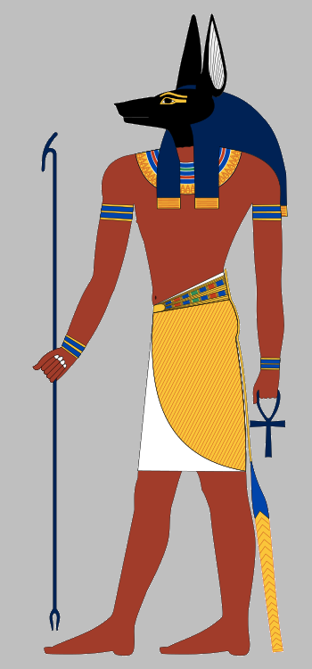
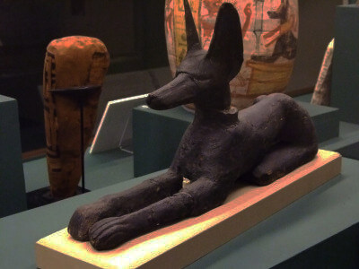

\sinc

## The jackals of Anubis

&nbsp;

\conc

You have broken the laws of life and death, and Anubis is not happy with them, so the god of death has sent his jackals to hunt you down and bring you before him.

Anubis's jackals are the size of bears with brutal fangs and claws, fur as black as night, and eyes of fire. They hunt those who have broken the laws of the afterlife and escaped to the world of the living.

> When a child kills a mummy, its spirit is sent back to the underworld.

They are exceptional hunters, highly intelligent and with highly developed senses. Without a better word to define them, they are the ultimate predator of the afterlife.

### How to Use Them

Jackals are a **supernatural layer** you can add to your games. They are very powerful hunters that your mummies must flee from. They can not face them and win; only a very elaborate and crazy plan can allow you to defeat them.

_Think of it like that alien in Alien³ who hunts the inmates of the penal colony from the shadows, and they need to come up with a very complicated plan to kill him in the foundry._

\sp

As for when they will come out, really, whenever you want. Perhaps they will be the first thing you see when you leave their sarcophagus, or perhaps they will suddenly emerge from the shadows and stand between your mummies and the freedom that is the museum's main entrance.

If you are going to introduce jackals, I advise introducing them gradually. Perhaps fiery eyes staring at you from the room you just left. Perhaps claws on a statue or looms from the room you just entered. To finally see them in all their terrible splendor standing between you and freedom.

### Jackal Powers and Abilities

Their brutal claws and fangs inflict **terrible wounds**, not only on your bandages and flesh, but also on your immortal soul.

The wounds they inflict are very serious, and the degradation they cause cannot be removed by re-bandaging, only by magical means. Bear in mind that they have not damaged your bandages and parched flesh, but rather have directly attacked your spirit.

Despite coming from the spiritual realm of the underworld, they are very real and indeed possess great physical strength. It is not enough to simply place a table in front of a door to prevent them from entering; you might as well put a heavy, full-length Roman statue in front of them.

In addition to being highly intelligent, they have highly developed senses, which makes it **very difficult to deceive them and lure them into traps**.

Jackals can **smell the energy released when cursed objects are used**, so if you use these objects, they can detect and find you. If there are jackals in the museum, you must be very careful when using your cursed objects, because it could be your downfall.

### Mechanizing Jackals

Jackals do not have any mechanics at all; they are a narrative-driven monster that chases your mummies and can not be stopped or destroyed; you can only escape from them.

If you need to mechanize them, when your mummies interact with jackals, the success rate changes radically, making them much more difficult and with more negative consequences than positive.

\sp

|Check|Results|
|---|---|
|1-4|You fail, and something wrong happens.|
|5-6|You succeed, but at a cost.|
|7+|You succeed. The higher the result, the better the effect.|

If you look closely, for example, rolling a skill that's a d4 is always a failure. Rolling a d6 can succeed, but always with consequences. The idea is that you can only beat a jackal at something you are really good at, whether you have magical weapons or rely on your divinity.

You can also make it so they can not take a few seconds to heal a point of degradation when a kid is present in the room. A jackal can use those seconds of respite to extract your soul from your revived mortal remains and return it to the underworld.

> If you do not want to get too complicated, you can apply a -2 penalty to the rolls and use the basic roll table.