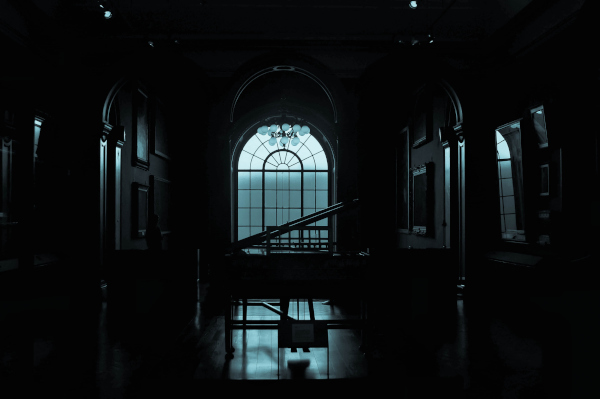
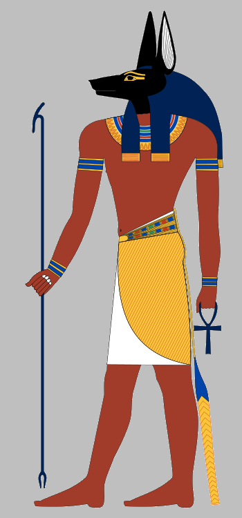

# Bandageless, revive, curse, escape [by Gwannon](https://gwannon.com/)

**Bandageless is a mini-setting for [Breathless](https://farirpgs.com/breathless/creator-kit) about Egyptian mummies trying to escape from a museum.**## You open your eyes and everything is dark…

It seems like you are inside your sarcophagus, but when you try to get up, you crash into an invisible wall.

You hit it with all your might, and it shatters like shards of salt. You get up as best you can, and your vision begins to adjust to the darkness. You look around in amazement.

You do not know where you are, but it is clear this is not the promised afterlife.

### Why have you woken up?

You do not know it, but someone at the museum has been playing with a cursed object from the museum’s collection, The Book of Life and Death.

They have been reading passages with powerful spells, and here you are, awakening from death 3,000 years after dying and being mummified.
[, Deir el-Medina, Tombeau d'un ouvrier, Amennakht ou Nebenmaat - Marie Thérèse Hébert & Jean Robert Thibault")](https://www.flickr.com/photos/jrthibault/49992702476/in/album-72157714654737082/ "Égypte, Al Qarana (nécropole thébaine), Deir el-Medina, Tombeau d'un ouvrier, Amennakht ou Nebenmaat - Marie Thérèse Hébert & Jean Robert Thibault")

### You are not alone

Luckily, you are not alone. Other mummies in the museum have risen with you, and if you organize yourselves, you can escape this horrible place you are imprisoned in.

And although it is not your world, you were pharaohs, priestesses, counselors, etc., and you still have the resources and skills necessary to escape from the hell you are in just now.## System 

«Bandageless, revive, curse, escape» uses the [Breathless](https://farirpgs.com/breathless/creator-kit) system, modifying and expanding its rules to capture the adventures your mummies will take part in to escape the museum.

### Checks

When there is a challenge to overcome, you roll to see how it plays out. You only need to roll if what you want to do is risky.

The GM announces that your action may be risky and dangerous; you then choose a skill and roll the corresponding die. If a fellow mummy helps you, they also roll, and you both run the same risks. The GM takes the highest roll and interprets the result.

|Check|Results|
|---|---|
|1-2|You fail, and something wrong happens.|
|3-4|You succeed, but at a cost.|
|5+|You succeed. The higher the result, the better the effect.|

Being a reanimated mummy 3,000 years after its death is difficult. Each roll reduces the skill score used by one level to a minimum of d4:

> **d12 ⇾ d10 ⇾ d8 → d6 → d4**

If desired, the GM can leave a starting decision up to chance. Simply choose a die based on the probability of something happening, roll, and interpret the result.

### Reset the bandages (Catch Your Breath)

To regain all your skills, you must "catch your breath." This is a short rest so you can tie, braid, and adjust your bandages, the only thing holding your tattered remains together.

To catch your breath, you must first be **out of danger in a quiet place, away from the watchful eyes of guards and security cameras**. Second, and most importantly, you must have a piece of cloth** (shirts, rugs, tunics, etc.) of any material (linen, cotton, polyester, wool, etc.) in your gear to patch your bandages.

A mummy in the group only needs to spend one die level on the cloth piece to allow all mummies to catch their bandages.
Like the rest of the equipment, the piece of cloth is destroyed when it reaches d4.

When a mummy rewraps its bandages, the GM observes the situation and presents a new complication to the group.

### Loot Checks

Ironically, you will have to loot the museum you are trapped in to escape; something museums have been doing for centuries with the riches of your culture.

When the plot allows, you can make a looting roll to search for equipment that will aid you in your escape.

Be careful because you might come across things you did not want to, such as an inattentive security guard coming from the restroom or grabbing a coffee from the staff lounge.

The equipment you can search for is mainly items from the museum's display cases and utility cabinets, from **bronze axes** to **dinosaur femurs**, including **cleaning products** and **restoration tools**.

To make a looting roll you must roll a d12 and consult the following table.

|1d12|Loot|
|---|---|
|1-2|Trouble is here…|
|3-4|There’s trouble ahead…|
|5-6|Add a d6 item.|
|7-8|Add a d8 item.|
|9-10|Add a d10 item or a bottle of embalsing chemicals.|
|11-12|Add a d10 doomed object or a bottle of embalsing chemicals.|

If you are not sure what you will get with the looting roll, you can roll a d20 on the following table.

There are no cursed items in all museum rooms, only those containing relics, marked with an ankh (&#9765;) on the "Room Theme or Function Table."

If you roll a 1 in a room without relics, roll again.

|1d20|Equip|
|---|---|
|1|Museum map|
|2|Cotton T-shirt or sweatshirt from the museum store|
|3|Flint-tipped spear, javelin, etc.|
|4|Whistle, Viking horn, Roman tuba, etc.|
|5|Torch, lantern, oil lamp, etc.|

|1d20|Equip|
|---|---|
|6|Bronze axe, bronze khopesh, etc.|
|7|Etruscan sling, recurve bow, etc.|
|8|Roman bust, Paleolithic Venus, etc.|
|9|Toolbox, repair kit, etc.|
|10|Tote bag with museum logo, wicker basket, etc.|
|11|Tyrannosaurus femur, whale rib, etc.|
|12|Rug, animal skins, etc.|
|13|Paint can, spray paint can, etc.|
|14|Rubbing alcohol, kerosene, etc.|
|15|WWII helmet, Viking helmet, etc.|
|16|Ming vase, Roman amphora, etc.|
|17|Ceremonial robe, shroud, ermine cloak, etc.|
|18|Metal marbles, marble balls, etc.|
|19|Fire extinguisher, sand bucket, fire blanket, etc.|
|20|Museum map|

### Backpack

The items in your backpack can be used in place of your skills. They start with a die level that decreases after each use.

When reduced to a d4, the item breaks, is lost, or simply disappears from history.

Only **3 items and 1 bottle of embalming fluid** can be carried in your backpack.

### Doomed Items

The museum staff may not know it, but the display cases are filled with items of great magical power and ominous curses that will aid you in your escape.|1d10|Doomed Items|
|---|---|
|1|**Neanderthal Skull with Strange Symbols:** Summons a horde of rats that follow you and blindly obey your commands.|
|2|**Crystal Skull:** Allows you to speak telepathically with humans.|
|3|**Canopic Jars with Mummy Organs:** Cures 2 points of degradation by consuming part of the stored organs.|
|4|**Censer with Demonic Symbols:** Creates a dense fog that fills the entire room, making it impossible to see anything.|
|5|**Ancient Tome in a Dead Language Bound with Human Skin:** Allows you to raise zombies from the remains of any animal (from small stuffed rodents to dinosaur skeletons). Each zombie can make a d6 roll to help you.|
|6|**Executioner's Axe:** It thirsts for blood, and if you attack with it, it always severs the head.|
|7|**Black-Bladed Cavalry Saber:** Its edge is so sharp it cuts through any material, no matter how hard.|
|8|**Iron Mask:** Its intimidating presence strikes fear into the minds of humans.|
|9|**WWI Gas Mask:** Makes you immune to all types of gas, poisons, smoke, etc.|
|10|**Nazi Officer's Luger Pistol:** Used to execute people; if you shoot, it always kills.|

Doomed items start with a 1d10. Each use causes them to lose one die level until they reach a d4 and lose their magical power. To use their magical abilities, you must pass the item roll.

Each mummy can only have one cursed item, and they do not take up space in your backpack. These are items you wear on your head like tiaras and helmets, around your neck like necklaces, or even between your bandages or on your hands and feet.

There may be items or situations, at the GM's discretion, that replenish your items with energy, so a cursed item can be kept as equipment while waiting to recharge its power.

### Praying to the Gods (Stunts)

When things get tough, you can try calling on the ancient gods of Egypt and roll a **d12** instead of a roll at your current skill rank.

Once you spend the prayer to your patron deity, you can not use it again until you **reapply your bandages**.

### Degradation (Stress)

When you face a consequence as a result of one of your actions, the GM may decide that you receive 1 level of bodily degradation.

If your mummy reaches 4 levels of degradation, you are severely degraded, meaning you are in a very poor state of preservation.

When you are degraded, failing a dangerous action means your body collapses, leaving only a pile of dried human remains and old, dirty bandages.

Perhaps the conservators will be able to do something with your remains in a few years, and you will return to life to try to escape the museum again.

### Embalming Chemicals (Medikits)

You can pour a bottle of embalming chemicals over yourself at any time to remove 2 degradation points. Alternatively, take cover in a safe place for a few seconds to tighten your bandages and remove 1 degradation point.

### Your Mummy

On your mummy sheet, write your name, your dynasty, the patron deity you commend yourself to, and your character's pronouns.

All skills are scored on d4, and you must assign a d10, a d8, and a d6 to three skills you think your character excels at.

Characters have a total of 6 skills:

* **Bash:** wreck, move, force.
* **Dash:** run, jump, climb.
* **Sneak:** hide, skulk, lurk.
* **Shoot:** track, throw, fire.
* **Think:** perceive, analyze, repair.
* **Sway:** charm, manipulate, intimidate.

At the start of each night of escape, you will also carry in your bandolier a random piece of equipment (d10) that you were buried with and that was among your bandages.

|1d20|Starting Equipment Piece|
|---|---|
|1|**[Sekhem scepter](https://en.wikipedia.org/wiki/Sekhem_scepter):** You can use it as a weapon|
|2|**[Khepresh Crown](https://en.wikipedia.org/wiki/Khepresh):** You can use it for protection|
|3|**Funerary Mask:** You can use it for protection|
|4|**Statuette of your favorite deity:** Allows you to "Praying to the Gods" once|
|5|**[Khopesh](https://en.wikipedia.org/wiki/Khopesh):** You can use it as a weapon|
|6|**Bronze Axe:** You can use it as a weapon|## The Museum

Museums are calm, peaceful, quiet, and safe places. But imagine waking up from a 3,000-year sleep in an unknown, dark, and lonely place, filled with objects you recognize and many others you do not, with strange shapes, strange lights, and surely even stranger functions.

Imagine people in strange clothing screaming at the sight of you or attacking you with strange, extremely loud weapons.

> If you are a mummy, a museum is not a good place to wake up.

### The Museum's Security Staff

While during the day thousands of people stroll through the halls learning about and admiring the pieces on display, everything changes at night.

The hallways empty out, leaving only the security staff and a few cleaners finishing their work.

The security guards are not tough ex-military men risking their lives to defend the Mona Lisa. They are ordinary people working their hours, and when faced with horrors like mummies, they will try to save their lives and then protect the museum's pieces.

Some will flee, and others will try to confront your mummies, but both always think about saving their own skins.

#### Fighting or flying the Guards

To begin with, an ordinary human is no match for a mummy. At most, they might inflict some damage before fleeing in terror or falling unconscious and/or dead from a mummy's attacks.

Faced with one or more guards, your mummy can rush into combat, brandishing its weapons, or it can try to evade them with stealth or by creating distractions. However, they can also frighten them and cause them to flee in terror.

#### Scare the Security Guards

Your mummies are just that, mummies, and we have been telling horror stories for centuries about these beings who are reborn through ancient and powerful magic, spreading terror wherever they appear.

This is why it is very easy for your mummies to scare the museum's night staff and make them flee.
There are many ways to scare the security staff, so the mummy must describe how they do it, and the GM will decide which of the six skills they should roll to try to scare the humans.

If they succeed, the group of mummies will make the museum security staff flee, but they will likely raise the alarm.

If they fail, the guards will likely pull out their service weapons and start shooting and beating the mummies. The mummies will receive degradation points in the form of bullet holes, at the GM's discretion.

### Museum Rooms

Museums are usually gigantic buildings with multiple floors, basements, hallways, storage rooms, and countless rooms of all shapes and sizes for all kinds of uses. They are veritable labyrinths that are very difficult to escape from if you do not know the way.

They usually do not have windows, and the ones they do have are security windows and/or have bars, so there are usually only a few viable exits: the main entrance or the loading and unloading dock.

To represent the **size of a museum, they have clocks with 4, 6, or 8 squares.** The more squares, the larger the museum, and the greater the distance from your starting room to an outside door and your freedom. When creating your adventure, keep in mind that each square represents a room you will traverse.

When your group of mummies enters a new room, they can take a quick look and decide whether to continue or look for another way. They can do this as many times as they want, but it has repercussions, as we will see later in the «Alarms» section.

Once inside, they must find a way to cross the room, avoiding the guards and without setting off the alarms.

#### Creating Rooms

When your mummies enter a new room, roll, if desired, on the «Table of the room's theme or function» to define its function and content.

#### Customizing Rooms

A lot happens in museums, and even if you visit rooms with the same content or function, they are never the same.

For each new room, you can choose the customization option from the «Table of room personalization» or roll 1d12.### Table of the room's theme or function

|1d66|Theme or function|
|---|---|
|11|Broom Room|
|12|Renaissance Painters|
|13|Archives and Documentation|
|14|Storage Room for Uncataloged or Quarantined Objects|
|15|Break Area for workers with coffee and vending machines|
|16|Cafeteria|
|21|Great Central Hall|
|22|Audio Guide Collection and Delivery Room|
|23|Roman and Greek Statue Room|
|24|Abstract Art Room|
|25|Impressionist Painting Room|
|26|Interior Garden|
|31|Boiler Room|
|32|Invited Exhibition of Terracotta Warriors|
|33|&#9765; Cold storage for special objects|
|34|Tightly sealed loading and unloading dock|
|35|&#9765; Library|
|36|&#9765; Lost and found room|

&#9765; there may be doomed items
|1d66|Theme or function|
|---|---|
|41|&#9765; Restoration Room|
|42|Cloakroom|
|43|&#9765; Edo Period Japanese Exhibition|
|44|Movie Theater|
|45|&#9765; World War I Hall|
|46|Modern Art Gallery|
|51|Nursing Room|
|52|&#9765; Saloon filled with medieval armor|
|53|Gift Shop|
|54|&#9765; Collections of shells and carapaces of extinct animals|
|55|&#9765; Jurassic Room with dinosaur skeletons|
|56|&#9765; Large room with the museum's most iconic piece (Mona Lisa, Rosetta Stone, Mask of Tutankhamun, etc.)|
|61|&#9765; World War II Exhibition|
|63|&#9765; Bronze Age Objects|
|62|Administration Area|
|64|&#9765; Hall of Great Explorers|
|65|&#9765; New museum installation with everything wrapped in cardboard and bubble wrap|
|66|&#9765; Travelling Exhibit|### Table of room customizations|1d12|Room customizations|
|---|---|
|1|**Special Decoration:** The room is highly decorated, reminiscent of a caveman's cavern, a jungle, a castle hall, or a Roman house.|
|2|**Cleaning Cart:** Someone left a cleaning cart behind. The cart can only be used in this room and has a d8.|
|3|**Interactive Experiences:** It is full of interactive screens that allow you to play and interact with the pieces in the room.|
|4|**Skylight:** There is a skylight that lets you see the sky. But it is too high to climb out.|
|5|**Under Construction:** The room is full of construction materials, tools, and heavy machinery. If it had any relics, it no longer has them.|
|6|**Freshly Polished Floor:** The floor is very slippery and highly reflective.|
|7|**Old building:** The room uses remains from the museum's old building, ruins found while excavating the foundations, or even a structure brought stone by stone from its original location.|
|8|**Temporarily closed room:** It is locked, or they have put something large and heavy in the room to prevent people from entering.|
|9|**Fountain:** Depending on the size of the room, this could be anything from a cold water dispenser to a fountain with koi carp.|
|10|**Small Shop:** Only in rooms with relics; otherwise, roll again. There is a small shop with souvenirs specific to the room's contents. You may reroll the looting roll, but you must keep the second result.|
|11|**Party or Anniversary:** Some kind of party has been held, and there are remnants of it, from balloons to birthday cake.|
|12|**Ventilation Shaft:** A large duct or shaft runs from one side of the room to the other. Your mummies can crawl inside to cross the room or hide.|
#### Museum Map

The **museum map** is a very useful object for navigating through the rooms, but it is not easy to interpret. They have strange drawings and you do not know their hieroglyphics.

If you pass the roll, the map allows you to reroll on the «Table of the room's theme or function» and keep the best roll.

The map can be used after you know what is in the room and how many guards there are.

When the Map die reaches d4, it becomes unusable; it is torn, bent, stained, etc.

#### Split the party

The basic rule is that you do not have to split the party, but if you do, you will have to create new room clocks for each group with as many filled-in cubes as there were before you broke up.

When a party changes rooms, there is a chance they will meet again if they roll the same number of times when using the «Table of room customizations» roll.

### Alarms

The museum's alarms can go off at any time, and if that happens, you will have to return to your display case or try to escape. Alarms do not go off for no reason, but rather due to a series of actions. While the alarms are deactivated, moving around the museum is relatively easy; once they are activated, everything gets more complicated.

Alarms are a way to **complicate escapes** and put more pressure on the mummies. Alarms are **clocks you create at the beginning of the delivery with 4, 6, 8, 10, or 12 little cheeses** depending on the museum's security.

This clock summarizes a number of elements of the museum's security system, such as guard response time, the number of guards and patrols, the sensitivity and quality of the sensors, etc.

* When they catch their breath, you refill another one.
* Every other time they enter a new room and decide not to enter and look for another exit.
* When you acquire a cursed object. Even if they do not know why, people notice the magic of these objects and place more security on them than on the rest of the museum's objects.
* By successfully scaring and making security personnel flee, you fill in another piece of cheese.

> It is important that your mummies do not know exactly when the alarm dots are filled, just a brief idea.
As long as you have dots to fill, the alarms have not gone off. The moment you have to **fill a dot and there is no free space, the alarms will go off** and you will have to return to your sarcophagus to escape another day or run for the exit and let Anubis do what he wants.

A timer with 4 slots is a very difficult security system to bypass; with 12, there is no time constraints unless the escape goes seriously awry. If not specified, the alarm clock is considered to have 12 dots, which is almost as if there were no limit.

If the groups split up, the alarm clock remains the same, and both groups put dots into the clock.

#### When the alarms go gff

When the alarms go off, things are going to get very difficult for your mummies. Your mummies will have to decide whether to make a mad dash for the exit or return to their sarcophagi to wait for the next night.

If the alarms have not gone off and there are relics in the room (they have a &#9765; in their name), with a 1 in 1d4 (25%), there is only one guard in the room. If there are no relics, there is no guard, unless you, as the GM, decide otherwise.

When the alarms go off, there is a chance that there will be 1d6 guards. If the room has relics or valuables, with a 1-2 in 1d4 (50%), there are guards. If there are no relics, there are only guards, with a 1 in 1d4.|¿Does the alarms go off?|&#9765; Are there relics?|1d4|Guards|
|---|---|---|---|
|No|No| — | — |
|No|Yes|1|1|
|Yes|No|1|1d6|
|Yes|Yes|1-2|1d6|

Returning to the sarcophagus has its advantages, as you can attempt your escape again the following night. This means several things for the following night:

* The room route from the previous night can be retained, if desired. What does reset is the number of guards in each room.
* You can store one of your items (even cursed ones) in your bandages for the following night.
* Your alarms and clock are reset.

Returning to the sarcophagus, if there are jackals nearby, is useless. They will trap you in your sarcophagus or display case and drag your soul to the depths of the afterlife.

### Conflicts

In addition to all of the above, if possible, you can add more elements of conflict to increase the tension of the situation. You can use this table to help you come up with ideas for your adventure.

1. **There is a group of white-collar thieves:** You must avoid the guards and the thieves, and the alarms could go off at any moment.
2. **Hostage Situation:** You wake up in the middle of a hostage situation. There are no guards, but there are trained ex-military personnel with powerful firearms.
3. **Fire:** A terrible fire is devouring the museum. You must avoid the smoke, the fire, and the firefighters. Remember, it is escape or burn to death.
4. **Seriously Wounded:** You must flee, taking with you a fellow mummy who has been severely damaged by time or seriously injured by a jackal.
5. **Strikes and Pickets:** The museum workers are on strike and have taken over the museum. There are pickets everywhere, people sleeping in sleeping bags, etc.
6. **The room has no exit:** You reach a room with no exit and must return the way you came. You will have to face what was in the previous room again and you will have to erase the last checkmark from the room clock.

### Missions

A priori, the main mission is to escape the museum, but there may be other options if you wish to modify this.

1. **Obtain the «Book of Life and Death»:** With it, you can free yourself from Anubis and his jackals, and even restore your body to human form.
2. **Another mummy is being stalked by a jackal:** You must help another awakened mummy, who for some reason is being chased by a jackal.
3. **Talk to someone in the Egyptology department:** Perhaps someone in the Egyptology department will know what to do with you.## The jackals of Anubis

You have broken the laws of life and death, and Anubis is not happy with them, so the god of death has sent his jackals to hunt you down and bring you before him.

Anubis's jackals are the size of bears with brutal fangs and claws, fur as black as night and eyes of fire. They hunt those who have broken the laws of the afterlife and escaped to the world of the living.

> When a jackal kills a mummy, their spirit is sent back to the underworld.

They are exceptional hunters, highly intelligent and with highly developed senses. Without a better word to define them, they are the ultimate predator of the afterlife.

### How to Use Them

Jackals are a **supernatural layer** you can add to your adventures. They are very powerful hunters that your mummies must flee from. They can not face them and win; only a very elaborate and crazy plan can allow you to defeat them.

_Think of it like that alien in Alien³ who hunts the inmates of the penal colony from the shadows, and they need to come up with a very complicated plan to kill him in the foundry._

As for when they will come out, really, whenever you want. Perhaps they will be the first thing you see when you leave their sarcophagus, or perhaps they will suddenly emerge from the shadows and stand between your mummies and the freedom that is the museum's main entrance.

If you are going to introduce jackals, you must introduce them gradually. Perhaps fiery eyes staring at you from the room you just left. Perhaps claws on a statue or tapestry from the room you just entered. To finally see them in all their terrible splendor standing between you and freedom.

### Jackal Powers and Abilities

Their brutal claws and fangs inflict **terrible wounds**, not only on your bandages and flesh, but also on your immortal soul.

The wounds they inflict are very serious, and the degradation they cause cannot be healed by re-bandaging, only by magical methods. Think that they have not damaged your bandages and parched flesh, but rather have directly attacked your spirit.

Despite coming from the spiritual realm of the underworld, they are very real and indeed possess great physical strength. It is not enough to simply place a table in front of a door to prevent them from entering; you might as well put a heavy, full-length Roman statue in front of them.

In addition to being highly intelligent, they have highly developed senses, which makes it **very difficult to deceive them and lure them into traps**.

Jackals can **smell the energy released when cursed objects are used**, so if you use these items, they can detect and find you. If there are jackals in the museum, you must be very careful when using your cursed objects, because it could be your doom.

### Mechanizing Jackals

Jackals do not have any mechanics at all; they are a narrative-driven monster that chases your mummies and can not be stopped or destroyed; you can only escape from them.

If you need to mechanize them, when your mummies interact with jackals, the success rate changes radically, making them much more difficult and with more negative consequences than positive.
|Check|Results|
|---|---|
|1-4|You fail, and something wrong happens.|
|5-6|You succeed, but at a cost.|
|7+|You succeed. The higher the result, the better the effect.|

If you look closely, for example, rolling a skill that is a d4 is always a failure. Rolling a d6 can succeed, but always with consequences. The idea is that you can only beat a jackal at something you are really good at, whether you have magical weapons or rely on your divinity.

You can also make it so they can not take a few seconds to heal a point of degradation when a jackal is present in the room. A jackal can use those seconds of respite to extract your soul from your revived mortal remains and return it to the underworld.

> If you do not want to get too complicated, you can apply a -2 penalty to the rolls and use the basic checks table.|CharacterSheet.html|## License

This work is based on Breathless, product of [Fari RPGs](https://farirpgs.com), developed and authored by René-Pier Deshaies-Gélinas, and licensed for our use under the [Creative Commons Attribution 4.0 License](https://creativecommons.org/licenses/by/4.0/).

"Bandageless, revive, curse, escape» is developed under the [CC BY 4.0](https://creativecommons.org/licenses/by/4.0/legalcode.es) license. All the source code can be found at [GitHub/ideasRoleras/Bandageless](https://github.com/gwannon/ideasRoleras/tree/main/Bandageless).
Royalty-free images from [freepik](https://www.freepik.com/) and [other sources](https://github.com/gwannon/ideasRoleras/blob/main/Bandageless/README.md).

