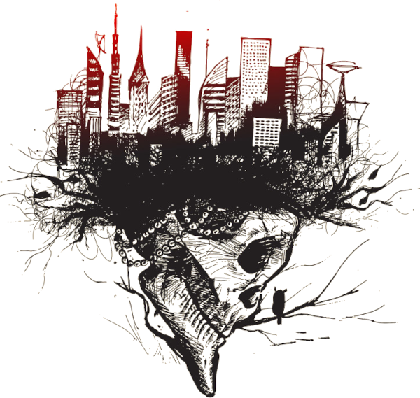

# El río, una historia de Breathless [por Gwannon](https://gwannon.itch.io/breathless-histories)

Los días se alargan y las noches se acortan lo cual es bueno, ya que los horrores sobre todo atacan de noche.

El frescor del río os recuerda a cuando disfrutabais de vuestro aire acondicionado en vuestras casas y trabajos.

En vuestra última aventura conseguisteis una barcaza de río y os habéis estado moviendo con ella. Podéis dormir en ella, es fácil de defender y puede llevaros a todos con vuestro equipo.

Tu grupo se acerca a una nueva parte del río, con suerte habrá pocos «crawlers» y mucho que saquear.

## La barcaza

Vuestra vieja barcaza está oxidada y vieja, pero su funcionamiento es muy básico con lo que el mantenimiento es muy sencillo. Un motor de combustión muy simple y un timón mecánico. Nada de ordenadores, nada de electricidad, solo gasolina y parchear las fugas en el casco.

La barcaza puede llevar a unas 20 personas, con su equipo y sus enseres de cada día. 

El espacio de carga bajo cubierta se ha dividido con paneles y telas en cubículos donde vive cada superviviente. No es muy íntimo, pero es un lujo en este mundo.

En el centro hay una zona libre donde todos se reúnen cuando hace mal tiempo. Si hace buen tiempo toda la vida se traslada a la cubierta.

Defensivamente, el río actúa como el foso de un castillo y hay repartidas hachas de abordaje y machetes por toda la cubierta para rechazar ataques y cortar cuerdas que pudieran usarse en abordajes.

En caso de armas de fuego te puedes proteger bajo cubierta o detrás de las barandas metálicas que forman la borda.

El timón está en un pequeño habitáculo en la popa del barco y tenéis una pequeña lancha neumática que usáis en vuestros desembarcos.

## El puerto

El puerto parece desierto, pero nunca lo están. Es fácil veros llegar desde lejos y no es la primera vez que quieren daros la «bienvenida» cuando atracáis en los muelles. Ese es el momento en que sois más vulnerables.

Así que habéis cogido la costumbre de desembarcar a un grupo medio kilometro antes del punto de atraque para que busquen posibles problemas.

Si todo está bien, hacéis una señal desde el muelle y la barcaza desembarca.

### Ribereños

Curiosamente, tu grupo de supervivientes son los que está vez van a explorar la ribera antes de que la barcaza atraque.

No es fácil ser los «ribereños», arriesgas tu vida y si algo va mal la barcaza no se acercará a salvarte. Estará un día en el centro del río y si no aparecéis, se irá sin vosotros.

Si tenéis problemas, tendréis que buscar la manera de llegar hasta la barcaza mientras evitáis a «crawlers» y los piratas del río.

> Es duro, pero así es la supervivencia en este mundo.

### Por la ribera

Según desembarcáis y se aleja la lancha neumática, empiezan los problemas.
 
\sinc

|1d6|Complicación por la ribera del río|
|---|---|
|1|**¡¡¡Crawlers!!!** Una horda de crawlers viene por una calle lateral a hacia vosotros, son demasiados para acabar con ellos.|
|2|**¡¡Crawlers!!** Una docena de crawlers enredados en aparejos de barco, os cierran el paso. Son lentos y desorganizados porque unos tiran de las cuerdas y redes donde están enganchados otros, pero son muchos y todos juntos.|
|3|**¡Crawler!** Hay un «crawler» colgado de una cuerda, parece que ha caído en algún **tipo de trampa**. Deberíais tener cuidado, tal vez haya más trampas sin saltar.|
|4|**El puente que necesitáis pasar está en muy malas condiciones.** Hay partes caídas y otras se mantienen como pueden. Si no lo cruzáis, tendréis que dejar la ribera del río y adentraros en la ciudad. Eso supondría nuevas complicaciones lejos de vuestro objetivo.|
|5|**Ruidos metálicos** se acercan a vosotros. No sabéis qué puede ser, pero no suena bien. Os preparáis para lo peor, para ver que algún gracioso ha atado latas a un «crawler» y este las hace sonar al moverse.|
|6|Hay **un contenedor marítimo con las puertas soldadas**, quizás haya algo muy bueno o muy malo. No hay ni mensajes escritos ni pintadas en su superficie y no parece que salgan sonidos.|
 
\conc

### Problemas en los muelles
 
Una vez conseguís llegar a los muelles toca explorar si el sitio es seguro. Si es seguro, podréis hacer señales a la barcaza para que atraque. Si hay problemas, tendréis enfrentaros al problema (crawlers, bandidos, residuos tóxicos, etc.) o darle esquinazo a lo que hayáis encontrado y buscar algo que flote para huir de los muelles y alcanzar la barcaza.
 
|1d6|Complicación en los muelles|
|---|---|
|1|**¡¡¡Crawlers!!!** Una gran manada de «crawlers» se quedó encerrada en un dique seco de los muelles. Están todos parados en su sitio, pero si os detectan, se volverán agresivos y podrían intentar salir y atacaros. Habrá que buscar la forma de acabar con todos ellos, quizás quemarlos, quizás dejar que el río entre al dique abriendo las esclusas.|
|2|**¡¡Crawlers!!** A pesar de estar completos y sanos, esta manada de 5 «crawlers» van a 4 patas y enseñando los colmillos como perros.|
|3|**¡Crawler!** Un crawler disfrazado de pollo de una famosa cadena de pollo frito, se mueve sin sentido y el disfraz no le deja corre, pero le da cierta protección. Arrastra de una mano un pesado hacha de bombero que hace un ruido horrible al rozar con el cemento.|
|4|Un grupo de **mapaches rabiosos y enfermos** por comer carne de «crawlers» ha tomado el muelle como su refugio. Parecen muy agresivos y hambrientos.|
|5|Una de las **cápsulas de gas** con las que le ejercito bombardeo la ciudad flota está intacta entre los restos de basura que se acumulan en el muelle. Si la barcaza se acerca podrían activarla y hacerla explotar. Habría que sacarla de alguna manera del muelle y que la corriente se la lleve.|
|6|Es vuestro día de suerte, el muelle está limpio.|

Está oscureciendo y tanto si la barcaza atraca como si se queda en mitad del río, tendréis que hacer noche en la zona.  

## La luz

Cuando anochece veis, algo que no habíais visto en años, luz eléctrica. El lado de la azotea que mira hacia vuestra parte del río de uno de los edificios de la ciudad está completamente iluminada.

No sabéis que significa, pero merece la pena investigarlo. Si hay más personas podrían unirse a la comunidad. Si hay algún tipo de generador funcionando, sería un buen hallazgo. 

No debería ser una trampa, nadie gastaría preciada electricidad para atraer a incautos a los que robar y matar.

Como ribereños que sois, os toca investigar las luces. El plan el sencillo, mientras la barcaza avanza por el meandro del río, vosotros atravesaréis la ciudad, pasando por el edificio iluminado, y os recogerán al otro lado de la curva que da el río.

_**Línea roja:** Ruta de la barcaza_

_**Línea verde:** Ruta de tus exploradores_

### Camino al rascacielos

XXX

Hay muchas formas de llegar al rascacielos y todas tienen ventajas y desventajas.

* **Calles principales.** XXX
* **Calles secundarias.** XXX
* **Alcantarillado y túneles del metro.** Habrá «crawlers» y ratas, eso es seguro, pero no esperéis nada más.
* **Tren elevado.** Seguir las vías del tren elevado no sería mala opción, si no fuera porque os deja sin opciones. Solo podéis seguir adelante o retroceder. Además, montaros una trampa sería muy fácil.

### La ascensión

XXX

### La azotea

XXX

## Regreso al río

XXX

### Piratas de río

XXX

|Licencia.md|