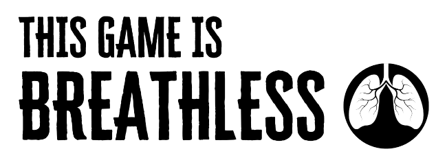

## Licencia

This work is based on Breathless, product of [Fari RPGs](https://farirpgs.com), developed and authored by René-Pier Deshaies-Gélinas, and licensed for our use under the [Creative Commons Attribution 4.0 License](https://creativecommons.org/licenses/by/4.0/).

Esta aventura está hecha bajo licencia [CC BY 4.0](https://creativecommons.org/licenses/by/4.0/legalcode.es). Todo el código fuente puedes encontrarlo en [GitHub/ideasRoleras/BreathlessHistories](https://github.com/gwannon/ideasRoleras/tree/main/BreathlessHistories)

* Fuente [Cheddar Gothic Stencil](https://es.fontriver.com/font/cheddar_gothic_stencil/)
* Skech of Skull isolated on white background with urban city skyline Vector Illustration by [Rochak Shukla](https://www.freepik.com/free-vector/skech-skull-isolated-white-background-with-urban-city-skyline-vector-illustration_31348226.htm)
* By Copernicus Sentinel-2, ESA - https://scihub.copernicus.eu/dhus/#/home - [Wikimedia](https://commons.wikimedia.org/w/index.php?curid=78147515) [CC BY-SA 3.0 igo](https://creativecommons.org/licenses/by-sa/3.0/igo/deed.es)

