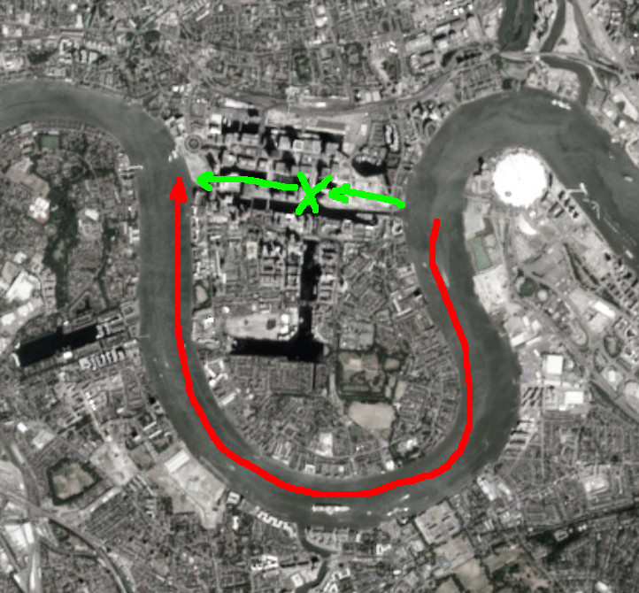

# Down to the river, a Breathless story [|AUTHOR|](https://gwannon.itch.io/down-to-the-river-hasta-el-rio)

The days are longer and the nights are shorter, which is a good thing, since the horrors mostly attack at night.

The fresh breeze of the river reminds you of when you used to enjoy air conditioning in your homes and workplaces.

On your last adventure, you acquired a river barge and have been traveling around on it. You can sleep on it, it's easy to defend, and it can carry you and your gear.

You're approaching a new part of the river. Hopefully, there will be few crawlers and hopefully plenty to loot, because supplies are running out.

## The barge

Your old barge is rusty and old, but its operation is very basic, making maintenance very simple. A very simple combustion engine and a mechanical helm. No computers, no electricity, just gasoline and patching the hull.

The barge can carry about 20 people, with their equipment and belongings.

The cargo space below deck has been divided with panels and cloths into cubicles where each survivor sleeps. It's not very private, but it's a luxury in this world.

In the center, there's a free area where everyone shelters during bad weather. If the weather is good, everyone moves to the upper deck.

Defensively, the river acts like a castle moat, and boarding axes and machetes are scattered throughout the deck to repel attacks and cut ropes that could be used during boardings.

If the enemies have firearms, you can cover under deck or behind the bulwarks.

The helm is in a small cabin in the stern of the barge, and you have an inflatable boat to disembark. 

## The docks

The dock seems deserted, but it's never true. It's easy to spot your barge arriving, and it's not the first time someone has tried to «welcome» you when you disembark at the piers. That's when you're most vulnerable.

So you've gotten into the habit of disembarking a group half a kilometer before the docking point to look for potential trouble.

If everything is OK, you wave up from the dock and the barge disembarks.

### Riparians

Interestingly, you are the ones who will explore the riverbank this time before the barge docks.

It's not easy to be a riparian, you risk your life and, if something goes bad, the barge doesn't try to save you. It will wait a day in the middle of the river and if you don't appear, it will depart without you.

If you run into trouble, you'll have to find a way to reach the barge while dodging crawlers and river pirates. It's hard, but the survival in this world is it.

### Along the riverbank

As soon as you disembark and the inflatable boat moves away, the problems begin.

\sp

|1d6|Complication along the riverbank|
|---|---|
|1|**Crawlers!!!** A horde of crawlers is coming down from a side street toward you. There are too many of them to take out.|
|2|**Crawlers!!** A dozen of crawlers tangled in ship's rigging block your way. They're slows and clumsies, some pulling at the ropes and nets to which others are snagged, but there are many of them.|
|3|**Crawler!** There's a crawler hanging from a rope; it looks like it's fallen into a trap. You should be careful; there might be more hidden traps.|
|4|**The bridge you need to cross is in very poor condition.** Some parts have collapsed, while others are holding up as best they can. If you don't cross it, you'll have to leave the riverbank and go deeper into the city. That would mean further complications, far from your objective.|
|5|**Metallic noises** come to you. You don't know what it could be, but it doesn't sound good. You prepare for the worst, but some joker has attached cans to a crawler, and it rattles them as it moves.|
|6|There's a **container with its doors welded**. Perhaps there is something very good or very bad inside. No written or painted messages on its surface, and you don't listen anything inside it.|
 
### Problems at the docks
 
Once you reach the docks, it's time to explore to know if the place is safe. If it is, you can wave up the barge to dock.

If there are troubles, you'll have to overcome them (crawlers, bandits, toxic waste, etc.) or dodge them and look for a vessel to reach the barge.

|1d6|Complication at the docks|
|---|---|
|1|**Crawlers!!!** A large mass of crawlers has become trapped in a dry dock. They're all standing still, but if they detect you, they'll become aggressive and might try to break out and attack you. You'll have to find a way to exterminate them. Some options can be scorch them or opening the locks to allow the water to enter the dock.|
|2|**Crawlers!!** Despite being whole and well-preserved, this pack of five crawlers walk on all fours, baring their fangs like dogs.|
|3|**Crawler!** A crawler disguised as a chicken from a famous fried chicken franchise moves randomly. The costume doesn't let him run, but it provides protection. He drags a heavy hatchet in one hand, which makes a horrible noise as it scrapes against the floor.|
|4|A **group of raccoons with rabies**, sickened by eating crawler meat, have taken over the pier. They are aggressive and hungry.|
|5|One of the **gas capsules** used to bomb the city floats intact in the water among the garbage on the dock. If the barge gets close, it could activate it and explode. It would have to be somehow pulled from the dock to the current take it away.|
|6|It's your lucky day, the docks are clear.|

It's getting dark, and whether the barge docks or stays in the middle of the river, you'll have to pass the night here.

## The light

When night falls, you see something you haven't seen in years: electric light. The side of the rooftop facing your side of the river on one of the city's buildings is completely illuminated.

You don't know can be this electric light, but it can be interesting to investigate it. If there are more people, they might join the community. If there's some kind of generator working, that would be a good find.

It can be a trap; but no one would waste precious electricity to attract people to rob and kill them.

As riparians, it's your duty to investigate the lights. The plan is simple: as the barge navigates the meander, you'll cross the city, exploring the illuminated building, and be picked up on the other side of the bend in the river.

\sp

They estimate it will take them all morning to reach the other side of the bend. They'll wait for you there until the next morning, and if you haven't reached it, they'll go away without you.

> **One day is enough time to complete the mission**, but if you want to pressure your survivors, pretend to keep track of the hours each time they catch the breath. It's important that they think there's a time limit.

[](https://commons.wikimedia.org/w/index.php?curid=78147515 "By Copernicus Sentinel-2, ESA - https://scihub.copernicus.eu/dhus/#/home, CC BY-SA 3.0 igo")

_**Red line:** Barge route_

_**Green line:** Your route_

### Walk to the skyscraper

There are many ways to reach the skyscraper, and each one has its pros and cons.

* **Main streets.** It's the fastest route, but it's also the most risky road.
* **Secondary streets.** It can be the option with the best time/security ratio, but you can lose and time is important.
* **Sewer system and underground tunnels.** There may be crawlers and certainly lots of rats, but don't expect anything else, and the route is very fast.
* **Elevated trains.** Following the train tracks wouldn't be a bad option, if it weren't for the fact that it leaves you with no options. You can only go forward or backward, and setting you a trap is very easy.

|1d6|Complication in the city|
|---|---|
|1|**Crawlers!!!** You pass by a multi-story public parking garage and crawlers start falling from the floors, some dying on impact with the ground, but others get up and run towards you.|
|2|**Crawlers!!** Half a dozen crawlers emerge from a revolving door in a large retail store, from some public works project on the road, or from some ground access to the underground.|
|3|**Crawler!** There's a crawler trapped in a phone booth that can't get out. What you don't see is that someone has put up a paracord, which, if someone steps on it, opens the booth door and releases the crawler. It's not a problematic trap, but there could be more. In fact, you may have seen similar things before.|
|4|A **group of survivors** advances in your direction, but they stop when they spot you. You must not look trustworthy, or they're plotting something.|
|5|A **vehicle is driving very fast toward you** and doesn't seem to be braking or avoiding you. If you're in the sewers or the subway, a huge mass of water is advancing through the tunnel.|
|6|It's your lucky day, the route is clear.|

&nbsp;

> **Adventure seed:** There's a trapper who sets traps in the city using crawlers. You should investigate because it can be a problem in the future.

### Going up

As you arrive to the building, you see the logos of a megacorporation called BrainTech, and viewing the signs on the facade, it appears they were dedicated to medicine and cybernetics. It seems their headquarters were on the upper floors.

The large glass doors are broken and the main hall has been looted, but you never know.

\sp

The building is divided in 4 zones:

* **Main hall:** Security and access control for the rest of the building. In addition, there are a food court, newsstands, gift shops, fashion boutiques, etc.
* **Lower floors** Offices and spare zones for employees.
* **Middle floors** Laboratories and dinning rooms.
* **Upper floors:** Super-luxury apartments for company executives.

In each zone you can rest and loot. The things that you loot must be adequate to the characteristics of the zone.

The only way to get to the roof is by stairs. The elevators in the main hall are broken. They must have had some kind of accident, and the elevator shaft is inaccessible.

|1d6|Complication in BrainTech|
|---|---|
|1|**Crawlers!!!** You arrive at a floor where a gym has been set up. It's full of crawlers in gym clothes wandering among the exercise machines. They activate as soon as they detect you.|
|2|**Crawlers!!** In a elevator stuck between floors, there are half a dozen crawlers. They stick their limbs out through the narrow space between the elevator floor and the door frame. As you approach, the elevator cracks and drops a few meters, so the crawlers can now exit the elevator.|
|3|**Crawler!** No one knows how, but there's a crawler inside a vending machine. You'd walk right past it if it weren't for the fact that the machine contains cream pastries, which, thanks to the preservatives, will still be fresh and delicious.|
|4|Someone placed something large, like a metal cabinet, in the middle of the stairs **as a improvised barricade**. It's not easy to move due to its heavy weight. Another option is to get around it by climbing up the stairwell.|
|5|When you open an apartment, you'll find **camping gear and supplies for weeks**. Viewing the maps and guidebooks over the table, it seems the owners were away for several weeks camping in different national parks. You can dump the contents of your backpacks and pack canned food, which will be very useful for the low supplies on the barge.|
|6|A **security door** is blocking your way; the lock looks complicated and could take a lot of lockpicking. Destroying the door would make a lot of noise and could bring crawlers.|

### The roof

The rooftop is a single room that occupies two floors and the entire floor of the building. Large windows cover the entire room, and only one side is uncovered by curtains that block out light.

In the center of the large room, from floor to ceiling, there is a tower that looks like a huge supercomputer, with LED lights, cables and switches. Thick cables extend from the tower and end up plugged-in the heads of six crawlers.

The glass in the windows through which light was coming out is broken by the impact of a flying drone that landed in the middle of the room, surrounded by shards of glass.

It looks like some kind of military drone with one of its rockets still unlaunched. It doesn't look badly damaged, but it's too big to carry. If its battery has power, you might be able to turn it on and control it. It's unclear whether the drone is part of an attack or part of the building's defenses.

When you enter the room, the crawlers activate, spot you and launch to the attack. Meanwhile, all the lights on the electronic tower begin to glow brightly.

Sparks and electric arcs fly from the hands of the crawlers. Their punches are like being shocked by a taser.

If you cut the plugged-in cables, the crawlers will no longer be controlled by the supercomputer and will no longer give electric shocks with every attack, but they will still be aggressive and will attack you.

\sp

If you defeat the crawlers, a pixelated face will appear on a LED screen, and it begins to shout out.

```
- I need my bodies. I will die without my bodies. You have sentenced me to disappear!!!
```

All the electronic structure will begin to overheat and smoke. You better get out of the building quickly.

Once you're outside the building, you see that the roof is on fire. Suddenly, the drone flies off with difficulty, unless it has been destroyed or looted.

> **Adventure seed:** Now an angry, crazy AI that controls a military drone with an unlaunched missile chases your survivors all over the city.

## Return to the river

You don't always win, and this time you haven't gained anything valuable from your incursion, but you're still alive, and that's a lot in this world.

This part of the adventure is essentially the same as the stretch from the riverbank to the BrainTech building. The routes are the same (main streets, side streets, etc.), and the complications can be the same.

> As the GM, in this part you can play with the time limit to pressure them and force them to take the fastest and least safe paths.

### River pirates

As you approach the meeting point, you see another barge rounding the meander and speeding up, likely to ram your vessel.

Their vessel carries a harpoon-shaped naval ram and, if they stick it in your barge, it will be impossible to separate and escape the river up or down.

You have to act quickly, or your friends will be killed by the pirates. Your advantage is that no one knows you're there; the pirates are too focused on their target to detect you.

You can try to **collapse one of the giant cranes at the port** over the pirate ship.

There are **large waste deposits** on the riverbank; perhaps you could empty them into the water and slow the pirates' advance. With a bit of luck, it might be something flammable and/or toxic.

You can **get a boat and crash it against their naval ram**. You wouldn't stop their advance, but you would disable their main weapon.

Perhaps a **column of cargo containers could be collapse over the water**, forcing the pirate barge to dodge them and lose speed and precious time.

What if you ran a **steel cable to the other side** so the pirates would get caught in it? Or they tied it to the dock and wrapped it around the enemy barge like an AT-AT.

If you had time to loot the **drone missile**, you might be able to program it and launch it at the river pirates.

> Think about huge items that might be in a port/shipyard and let them use them against the pirates.

If you stop the attack, you can reunite with your group and tell them about your adventure. Your history will be told for years around the fire bin you use to warm yourselves on cold nights.

If the pirates take the barge, you'll have to flee as fast as possible. You'll have to start over and find a new community of survivors.

\sp

|License.md|