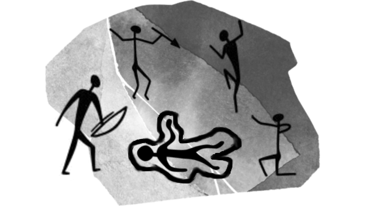

# Murder, she painted in the walls of the cave

“Murder, she painted in the walls of the cave" is a hack for **[100 Million B.C.](https://goldenachiever.github.io/year100millionbc/)** created by **[Golden Achiever](https://golden-achiever.itch.io/)** and translated into **[Spanish](https://roque-romero.itch.io/year-100-million-bc-reglas-gratuitas)** by **[Roque Romero](https://roque-romero.itch.io/)** that lets you turn your cavemen into detectives who must solve a crime and catch the killer, all while dodging the dangers that want to eat them.

The idea behind the hack is that **there is no predefined case; instead, your cavemen create it themselves through their evidence and investigations**. This hack gives you the tools to provide your cavemen with clues that lead them to whatever mystery they choose.

For example, if you compare the wounds on the body with those caused by the fangs of a _man-eater_ and find it interesting, then the wounds are from a _man-eater_. Keep in mind that this doesn’t mean much, because the killer could be a _man-eater_ or someone who uses their teeth as a weapon.

---

## The Wall of the Case

Let’s say a caveman’s brain isn’t very developed, so to keep information from one session to the next, they have to draw everything on the cave walls. Anything not in the drawing won’t be remembered from one session to the next, and they’ll have to investigate it all over again.

As the Referee, give them a blank sheet of paper and a pencil so they can draw whatever information they discover. If you want something more authentic, print out a photo of some cave paintings and give them brown and red paints so they can draw their stick figures.

> The first one to draw something obscene will receive a bonus. That’s just the way it is, and it’s not up for debate. The history of cave art is full of genitals, and this artistic innovation must be rewarded.

## Murder by Death

When your cavemen wake up after a strangely quiet night, Grogui doesn’t get up to drink water or finish off the remains of the _longsnout_ you hunted yesterday.

After poking him a few times in the eyes with a stick, you can confirm he’s dead. You need to find out who or what killed him, because it might strike again tonight.

If you don’t care, Brubo will die the next night, and Kruka the night after that, and so on until you’re alone in the cave. The good thing about this approach is that you’ll have crossed out many suspects; the bad thing is that you’ll be the next victims.

## Examining the Corpse

 Performing an autopsy on a corpse is difficult if you’re a caveman. You only have a sharp piece of obsidian and you don’t know how to master fire, but if you’re resourceful, you can find out some stuff. Let’s look at some possible examples.

At first glance, when they move the body, they’ll see a large wound on it (Perhaps a severe head injury or deep lacerations on the back). Even a caveman knows that’s the cause of death. That’s because if he had been poisoned or suffocated, there would not be no way to find it. That’s what happens when you don’t have forensic science.

You’ll also have to count the body parts to make sure none are missing. Obviously, if his legs are missing, he didn’t die of indigestion. 

They can **look for objects that could have been used to kill Grogui** and strike the corpse with them, or other animals (which they’ll have to hunt), or even on themselves (taking damage) to see if the wounds match.

You can use clubs, flint knives, and the teeth and claws of animals you’ve eaten, etc.

The next step would be to **go through his belongings**. Maybe there’s something among his things that might give you a clue. There might be dried meat whose smell could attract things that want to eat you. Maybe there was an object that belonged to other cavemen.

Maybe they might have been holding a lock of hair from another caveperson or from something that wants to eat you, or perhaps a piece of a loincloth, likely from their killer. Then you’ll have to check every troglodyte in the cave, one by one, to see who’s missing that piece of loincloth.

> Needless to say, once the examination of the body is complete, they’ll have to decide how to divide Grogui’s gear (After all, he won’t be using it anymore). Roll on the starting loadout table to determine his possessions.

 As raw meat eaters and, when necessary, cannibals, they could **try a small piece and know that his death is recent** (Two hours ago). Also, by asking the cave dwellers during the interrogation, they might learn that the victim was alive a few hours ago because he got up to pee and woke up a couple of cavemen. That’s how they solved their lunch problem...

Grogui probably bled, and they could **look for people covered in blood**, but honestly, with the slaughter your cavemen engage in every day and their poor hygiene, it isn’t of much help. It must also be said that fresh blood isn’t the same as blood that’s been dry for several days.

## Investigating the Crime Scene

The first option is to look for footprints, but just footprints, no fancy fingerprints. If there are recent footprints leading out of the cave, it means the killer went in and came out.

If there are no footprints, it means the killer is in the cave (Ta-dah! Everyone looks at each other suspiciously, searching for suspects) or was flying. Another possibility is they have gone deep into the cave and are waiting for your cavemen in the shadows.

Aside from the footprints, you might want to search through the belongings of your fellow cave dwellers to see if you find any clues, the murder weapon, or other curious items.

 Here are some examples of oddities you might come across:

* A piece of leather with obscene drawings and phallic shapes.
* A small leather pouch containing nail clippings from everyone in the cave.
* A hollow rock filled with berries fermented in saliva.

## Interrogating Potential Witnesses

And at this point, we move on to questioning witnesses and suspects, and questioning doesn’t mean beating them with a club until they confess; it means asking three-word questions and receiving three-word answers, mixing it all up with three-word threats and three-word pleas. Here are some possible questions your cavemen can ask and what the witnesses might tell them.

|Question|Answer|Answer with clue|
|---|---|---|
|You killed Grogui?|I didn’t kill|I did kill *|
|Where you not-day?|Sleeping / Pooping / Eating / Peeing|Don’t remember / Don’t know / Won’t say|
|Saw anything night?|Something enter cave / Something leave cave / Udu leave cave / Udu enter cave|I sleep / See nothing|
|You liked Grogui?|Yes, doesn’t snore / Yes, smells good|No, snores a lot / No, smells bad|
|Had Grogui enemies?|I don’t know / Everyone has enemies / None hates Grogui|Everyone hates Grogui / Yes, many enemies / Yes, he’s delicious|
|Did Grogui owe?|Owes nothing / Gived things free|Owes a lot / I owe things|

_&ast; If they answer this, they’ll have solved the case, and your cavemen are the best detectives in prehistory._

Your cavemen can try playing “good caveman, bad caveman." The best way to do this is for the good caveman to offer food and water, and the bad one to offer a club blow. Tbh, this technique doesn’t give you any advantage, but it can be a lot of fun to watch your group trying.

### Questioning Things to Eat (or Get Eaten by)

Truth is, you can’t get that much information from things to eat (or get eaten by), but investigating makes you hungry, and it’s a good excuse to go out and throw some punches, and maybe you’ll pick up a few clues and, above all, score plenty of food.

|Things to eat|Clues|
|---|---|
|Fatclaw|You didn’t want to interrogate it, just grab a quick lunch.|
|Bigmouth|Despite its big mouth, it only says “Croak, croak."|
|Bigsnout|They have a good sense of smell; maybe they’ll dig up something interesting if you follow them.|
|Rockback|Maybe if it lets you climb onto its shell, you’ll see something.|
|Man-eater|Since it’s a man-eater, it’s always suspicious.|
|Bonehorn|They’re just good steaks.|
|Gorejaw|They don’t usually go into caves to eat cavemen, but maybe it ate the killer and you don’t have to look for it.|
|Skymaw|Maybe if you latch on, you’ll see something from above.|
|Tuskwalker|A piece of Grogui’s loincloth hangs from one of its horns.|
|Bigslow|Maybe you can climb on top of it to reach places you can’t normally reach.|
|Tree-grabber|They’re as smart as you are, and you can communicate with them through gestures.|

&nbsp;

## Examining the Evidence

According to Agatha Christie, the motives for committing a crime are love, money, or revenge (and in some cases, to cover up another murder). This theory applies to your cavemen, and all you have to do is look at the clues and piece them together so they fit one of these scenarios.

From there, your cavemen must develop a theory and try to prove it with what they have. If something in your theory doesn’t hold up, or if your theory falls apart after re-interviewing a suspect, you’ll need to repeat the previous steps to uncover new clues that allow you to develop another theory.

> It’s up to you, the Referee, to let your players speak normally during this part or require them to discuss theories using only three-word sentences.

## The murderer is someone in this cave!

Once you figure out the who, how, and why (the where is the cave, and the when was tonight), you’ll have to **gather all the suspects and the rest of the cave**, who don’t want to leave the cave because they’re such busybodies. 

They’ll have to explain the entire murder plot using **3 three-word sentences for each question (who, how, and why)**. If they go on any longer, people will lose interest and start staring at the fire, picking lice off their companions, or going out to pee at the cave entrance.

To help, while one of your cavemen speaks, others **can make noises, animal sounds, or pull out and show the evidence of the crime**. Nothing livens things up more than pulling out a _man-eater_ head and holding it up to the children so they scream in terror.

## Action Scenes

Action scenes aren’t very common in this type of story, but a chase, a small fight, or even an assassination attempt against the investigators are fairly common. So, as they get closer to the person responsible for Grogui’s death, we should include a scene like this. Let’s look at some options and how to handle them.

A classic element of detective stories is the chase where the criminal has tried to steal clues and gets caught, or has tried to kill your cavemen and is caught red-handed.

As we’ve already mentioned, certain crimes are committed to cover up other crimes. So you can set deadly traps for your cavemen, like dropping a boulder on them or staging a stampede of _bonehorns_ to crush them. Attempted murders while they’re sleeping are also possible.

Finally, after the killer is identified, they usually run away and are either caught by the detectives or something serious happens to them, like getting run over by a _tuskwalker_ during their escape.

## License

Released under the **[CC BY 4.0](https://creativecommons.org/licenses/by/4.0/legalcode.es)** license. The font used is [Jello Stone](https://www.fontspace.com/jello-stone-font-f135313). The background of the main image is by [tonytranRPG](https://tonytranrpg.com). This hack was developed for [CAVE JAM!](https://itch.io/jam/cave-jam).

The translation from spanish into english has been made by **[Roque Romero](https://roque-romero.itch.io/)**.
