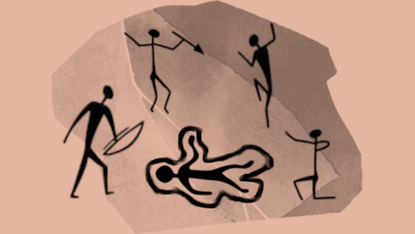

# Se ha pintado un crimen en las paredes

«Se ha pintado un crimen en las paredes» es un hack para **[100 Million B.C.](https://goldenachiever.github.io/year100millionbc/)** creado por **[Golden Achiever](https://golden-achiever.itch.io/)** y traducido al **[castellano](https://roque-romero.itch.io/year-100-million-bc-reglas-gratuitas)** por **[Roque Romero](https://roque-romero.itch.io/)** que te permite convertir a tus cavernícolas en detectives que deberán resolver un crimen y detener al asesino, mientras esquivan todos los peligros que quieren comérseles.

La idea del hack es que **no hay un caso definido, sino que lo van creando tus cavernícolas con sus pruebas y sus investigaciones**. Este hack te da las herramientas para que vayas dándoles a tus cavernícolas pistas que les lleven al misterio que ellos quieran.

Por ejemplo, si se ponen a comparar las heridas del cadáver con las que hacen los colmillos de un _come-hombres_ y te parece interesante, pues las heridas son de un «come-hombres». Piensa que esto no significa mucho, porque el asesino puede ser un _come-hombres_ o alguien que usa sus dientes como arma.

## La pared del caso

Digamos que el cerebro de un cavernícola no está muy desarrollado así que para mantener la información guardada entre sesión y sesión deberán dibujarla toda en las paredes de la cueva. Lo que no esté en el dibujo no lo recordarán de una sesión a otra y tendrán que investigarlo de nuevo.

Cómo DJ dales una hoja en blanco y un lápiz donde deberán dibujar la información que vayan descubriendo. Si quieres algo más auténtico imprime una foto de unas pinturas rupestres y dales pinturas marrones y rojas para que hagan sus monigotes.

> El primero que dibuje una obscenidad recibirá una mejora. Esto es así y no es discutible. La historia del arte rupestre está lleno de genitales y esta innovación artística debe ser recompensada.

## Un cadáver a los postres

Cuando tus cavernícolas despiertan, después de una noche extrañamente tranquila, Grogui no se levanta a beber agua y terminarse los restos del _reptalargo_ que cazasteis ayer.

Tras darle varios golpecitos con un palo en los ojos, pueden comprobar que está muerto. Hay que saber quién o qué lo ha matado, porque está noche podría volver a atacar.

Si les da igual, a la noche siguiente morirá Brubo y la siguiente Kruka y así hasta que se queden solos en la cueva. Lo bueno de esta técnica es que se habrán quitado muchos sospechosos, lo malo es que ellos son las próximas víctimas.

## Investigando el cadáver

Hacerle una autopsia a un cadáver es difícil si eres un cavernícola, solo tienes un trozo de obsidiana afilada y no controlas el fuego, pero, si son ingeniosos, se pueden hacer cosas. Veamos algunos ejemplos posibles.

De primeras, al moverlo, verán una gran herida en alguna parte de cuerpo, tal vez un gran traumatismo en el cráneo o unas grandes laceraciones en la espalda. 

Hasta un cavernícola sabe que esa es la causa de la muerte. Esto es así porque si lo hubiese envenenado o asfixiado, no podrían saberlo de ninguna manera. Cosas de no tener ciencia criminológica.

También tendrán que hacer el recuento de partes del cuerpo para comprobar que no le falta ninguna. Está claro que si le faltan las piernas, pues no ha muerto de una indigestión. 

Pueden **buscar cosas con las que hayan podido matar a Grogui** y golpear con ellas al cadáver, a otros bichos (que tendrán que cazar) o a ellos mismos (recibiendo daño) a ver si se parecen las heridas.
Pueden usar porras, cuchillos de sílex y dentaduras y garras de animales que se hayan comido, etc.

Lo siguiente sería **revisar sus cosas**. Tal vez haya algo entre sus cosas que pueda darle una pista. Puede que haya carne seca cuyo olor puedo atraer a cosas que te quieren comer. Igual había algún objeto que pertenecía a otros cavernícolas.

Sin olvidar que igual tenía en la mano un mechón de pelo de otro cavernícola o de algo que quiere comerte o tal vez un trozo de taparrabos, seguramente de su asesino, y luego tengan que ir uno por uno todos los trogloditas de la cueva mirando a quien le falta ese trozo de taparrabos.

> Ni que decir que una vez acaba la investigación de cadáver tendrán que decidir cómo repartirse el equipo de Grogui, total no lo va a usar más. Haz una tirada en la tabla de equipo inicial para determinar su contenido.

 Como comedores de carne cruda y, en casos de necesidad, antropófagos, podrían **probar un trocito y sabrán que la muerte es reciente**, un par de horas. También, preguntando más tarde en el interrogatorio a la gente de la cueva, podrían saber qué estaba vivo hace unas horas porque se levantó a mear y despertó a un par de cavernícolas. 

Pero claro, así se han solucionado el almuerzo.

Seguramente Grogui ha sangrado y podrían **buscar personas llenas de sangre**, pero la verdad, con las matanzas que hacen todos los días tus cavernícolas y la poca higiene que tienen, esto no es de mucha ayuda.

También hay que decir que no es lo mismo sangre fresca que sangre seca de varios días.

## Investigando la escena del crimen

La primera opción es buscar huellas, pero huellas huellas, nada de modernidades de huellas digitales. Si hay huellas recientes que salgan de la caverna, es que el asesino entro y salió.

Si no hay huellas, es que el asesino está en la cueva (tan-tan-chan todos se miran aviesamente buscando sospechosos) o volaba. Otra opción es que se haya adentrado en lo más profundo de la cueva y espere a tus cavernícolas entre las sombras.
 Aparte de las huellas quizás puedan buscar en los enseres de otros compañeros de cueva a ver si encuentras alguna pista, el arma homicida u otras cosas curiosas. Veamos algunos ejemplos de rarezas que pueden encontrar:

* Un trozo de cueros con dibujos obscenos y cosas de formas fálicas.
* Un saquito de piel con recortes de uñas de toda la cueva.
* Una roca hueca llena de bayas fermentadas en saliva.

## Interrogar a posibles testigos

Yen este punto pasamos a interrogar a los testigos y sospechosos e interrogar no es golpear con la cachiporra hasta que confiese, es hacer preguntas de 3 palabras y recibir respuestas de 3 palabras mezclándolo todo con amenazas de 3 palabras y súplicas de 3 palabras. Estas son posibles preguntas que tus cavernícolas pueden hacer y lo que los testigos podrán decirles.

|Pregunta|Respuesta|Respuesta con pista|
|---|---|---|
|¿Tú matar Grogui?|Yo no matar|Yo sí matar *|
|¿Dónde estar no-día?|Dormir / Cagar / Comer / Mear|No recordar / No saber / No decir|
|¿Ver algo no-día?|Algo entrar cueva / Algo salir cueva / Udu salir cueva / Udu entrar cueva|Yo dormir / No ver nada|
|¿Caer bien Grogui?|Sí, no roncar / Sí, oler bien|No, roncar mucho / No, oler mal|
|¿Tener Grogui enemigos?|Yo no saber / Todos tener enemigos / Nadie odiar Grogui|Todos odiar Grogui / Sí, muchos enemigos / Sí, ser delicioso|
|¿Grogui debes cosas?|No deber nada / Dar cosas gratis|Deber mucha cosa / Deber yo cosas|

_&ast; Si responden esto, habrán solucionado el caso y tus cavernícolas son los mejores detectives de la prehistoria._

Tus cavernícolas pueden intentar hacer un «cavernícola bueno, cavernícola malo». La verdad es que la mejor manera es que el cavernícola bueno ofrezca comida y agua y el malo cachiporra.

La verdad es que esta técnica no da ninguna ventaja, pero puede ser muy divertido ver a tu mesa intentándolo.
### Interrogando a cosas para comer (o que te comen)

La verdad es que poca información pueden sacar a las cosas para comer (o que te comen), pero investigar da hambre y es una buena excusa para salir a dar mamporros y tal vez obtengan algunas pistas y sobre todo manduca en cantidad.

|Cosas para comer|Pistas|
|---|---|
|Garragorda|No querías interrogarlo, solo conseguir un almuerzo rápido.|
|Bocaza|A pesar de su bocaza, solo dice «Croac, croac»|
|Morrolargo|Tienen buen olfato, igual desentierran algo interesante, si le sigues.|
|Espalroca|Quizás si te sube a su caparazón ves algo.|
|Come-hombres|Siempre es uno de los sospechosos principales, ya que come-hombres|
|Cuernohueso|Solo son buenos filetes.|
|Desgarrapiños|No suelen meterse en las cuevas a comer cavernícolas, pero igual se ha comida al asesino y no tienes que buscarlo.|
|Fauzaéreas|Quizás si te enganchas ves algo desde arriba.|
|Cuernerrante|De uno de sus cuernos cuelga un trozo de taparrabos de Grogui|
|Grandelento|Igual puedes subirte encima para llegar a sitio a los que no llegas de normal.|
|Ciervozumbador|Como el cuernohueso, solo son buenos filetes.|
|Agarrárbol|Son tan listos como tú y puedes hablar con ellos con mímica.|

## Estudiando las pruebas

 Según Agatha Christie, las razones para cometer un crimen son el amor, el dinero o la venganza (y en algunos casos para ocultar otro asesinato). Está teoría se aplica a tus cavernícolas, pero con una adaptación prehistórica.

XXX
## Reuniendo a las testigos y resolviendo el crimen

Cuando consigan el quién, cómo y por qué (el dónde es la cueva y el cuándo fue esta noche), tendrán que reunir a todo los sospechosos y al resto de la cueva que no se quiere ir de la cueva porque son unos cotillas. 

Tendrán que explicar toda la trama del asesinato usando 3 frases de 3 palabras para cada pregunta (quién, cómo y por qué). Si se alargan más, la gente perderá interés y empezarán a mirar el fuego, comerse los piojos de sus compañeros o salir a mear a la entrada de la caverna.

Para ayudar, mientras uno de tus cavernícolas hablan, otros pueden hacer ruidos, sonidos de animales o sacar y mostrar las pruebas del crimen. Nadaa anima más estas cosas que sacar una cabeza de _como-hombres_ y acercarla a los niños para que griten aterrados.

## Escenas de acción

Las escenas de acción no son muy comunes en este tipo de relatos, pero alguna persecución, una pequeña pelea o incluso un intento de asesinato contra los investigadores son bastante comunes. Así que cuando se estén acercando al responsable de la muerte de Grogui, deberíamos meter alguna escena de este tipo. Veamos algunas opciones y como solventarlas.

Un clásico de las historias detectivescas son las persecuciones en las que el criminal ha intentado robar pistas y le pillan o ha intentado matar a tus cavernícolas y le descubren con las manos en la masa.

Como ya hemos dicho hay ciertos crímenes que se hacen para tapar otros crímenes. Así que puedes poner trampas mortales a tus cavernícolas como dejar caer un pedrusco encima o montar una estampida de _cuernohuesos_ para que los aplasten. También es posible los intentos de asesinatos mientras duermen.

Por último, tras decir quién es el asesino, este suele salir corriendo y bien es atrapado por los detectives o bien le pasa algo grave como que lo en su fuga atropelle un _cuerneerrante_.

## Licencia

Hecho bajo licencia **[CC BY 4.0](https://creativecommons.org/licenses/by/4.0/legalcode.es)**. La fuente usada es [Jello Stone](https://www.fontspace.com/jello-stone-font-f135313). El fondo de la imagen principal es de [tonytranRPG](https://tonytranrpg.com). Esta aventura fue desarrollada para la [CAVE JAM!](https://itch.io/jam/cave-jam).
