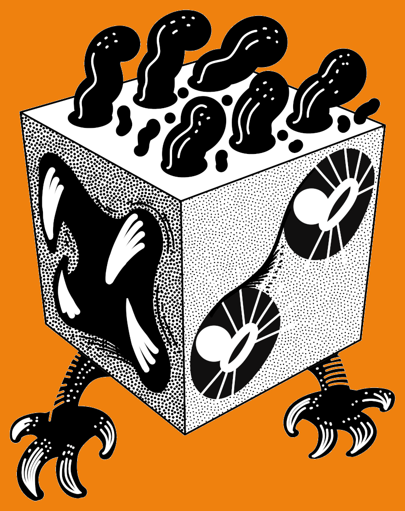
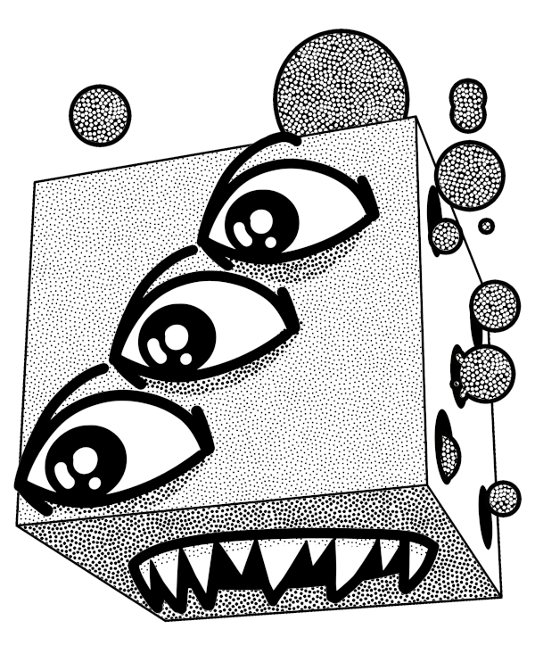
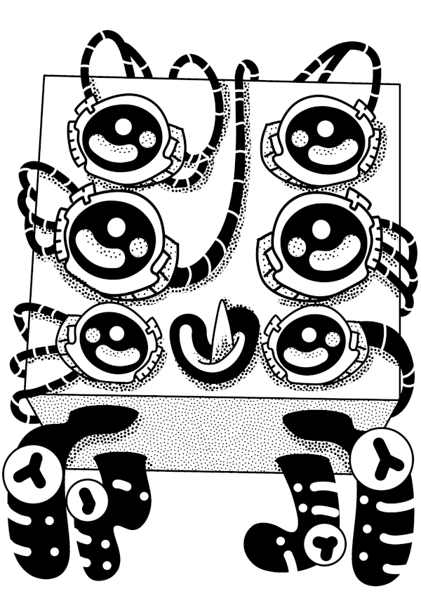
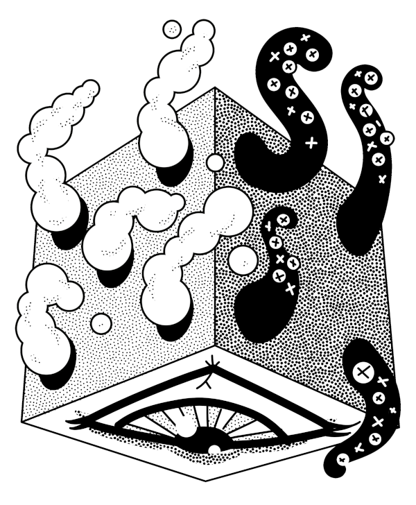
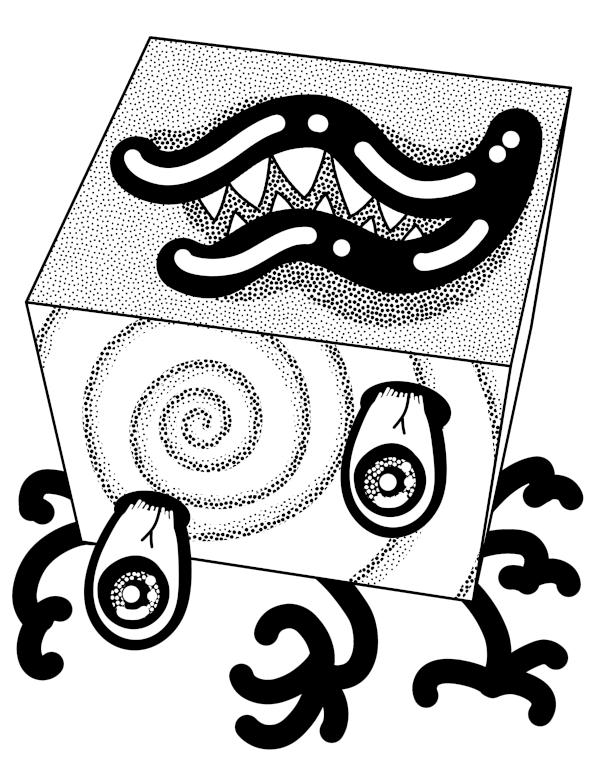
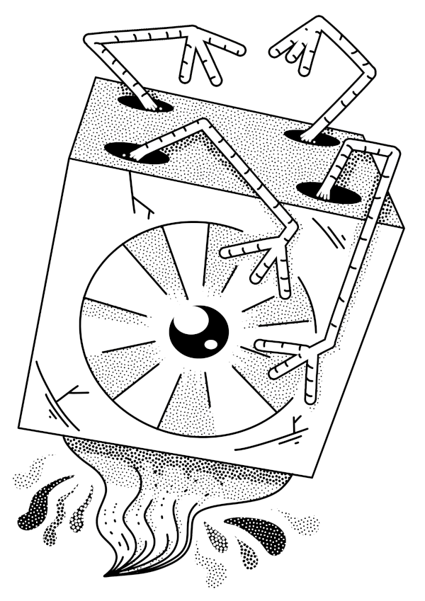
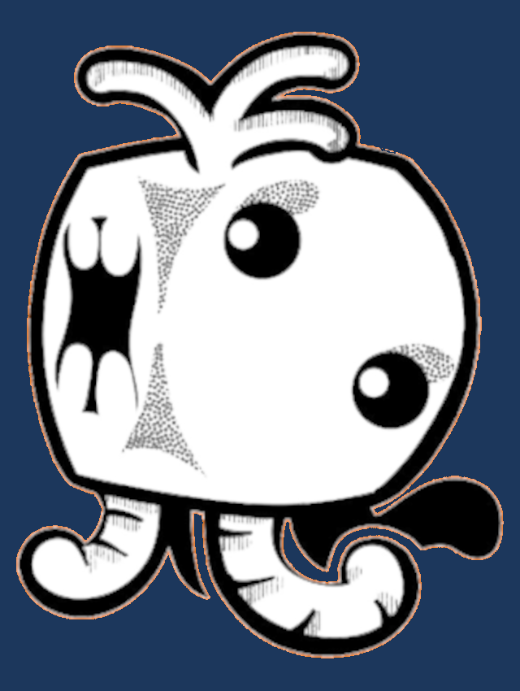

\sinc

# ¡Dadómones!

\conc

**¡Dadómones!** es un minijuego de rol donde llevas a una entrenadora de dadómones, unos simpáticos animales de tu mundo de formas y habilidades graciosas que entrenas para hacer combates contra los dadómones de otras entrenadoras y ganar la «Liga Dadomon». Para representar los dadómones usaremos los diferentes dados de rol que tenemos.

Para jugar necesitarás **papel, lápiz, montones de dados de diferentes caras y una bolsa** o similar donde meterlos y que no se pueda ver dentro.

En realidad es un juego para dar salida a los kilos y kilos de dados feos y deslustrados que tenemos en nuestra casa y que nunca vamos a usar, pero nos da pena tirarlos.

\sinc

## Creación de tu entrenadora

\conc

Para crear una entrenadora debes darle un **nombre**, unos **pronombres** y **repartir +2, 0 y -1 entre 3** características: 

* **Cuerpo:** Fuerza, resistencia, correr, saltar, esquivar, hacer acrobacias, …
* **Mente:** Inteligencia, sabiduría, investigar, resolver acertijos, …
* **Encanto:** Animar, ordenar, intimidar, seducir, persuadir, …

Es importante elegir bien a la hora de repartir los bonos porque los dadómones exigen tiradas de una y otra característica para ser domesticados.

Por último, apunta su **equipo de entrenadora** con un saco de dormir, una tienda de campaña, un hornillo, una mesa plegable, una nevera llena de comida, una nevera llena de comida, una pequeña mochila donde cabe todo eso sin problema y ninguna muda. De hecho, la ropa con la que salgan el primer día tras coger su dadomon inicial será la que tengan para el resto de la aventura. Por último, déjales **elegir un objeto útil de verdad** como una cuerda, una pala o una linterna.

### Dadómones iniciales

En los tiempos de antaño, viejas científicas chochas de dudosa reputación en la comunidad dadomon entregaban en oscuros laboratorios a las entrenadoras su primer dadomon, dejándoles escoger entre tres posibles dadómones.

\sp

[](https://bsky.app/profile/roqueromero.bsky.social "Dadomon por Roque Romero")

Lo curioso es que, aunque todas las entrenadoras empezaban con los 3 mismos dadómones, luego no las veías ir a los combates de la Liga con alguno de esos dadómones en su equipo.

La Liga descubrió que la tasa de abandono de dadómones iniciales era muy alta y de ahí que la Liga cambiará el sistema de entrega de dadómones iniciales.

Hoy en día, tras rellenar el formulario online para ser entrenadora, una IA selecciona tú dadomon ideal. Unos días más tarde puedes recogerlo en tu Centro Dadomon más cercano con todas las vacunas puestas, un saco de comida dadomon y una estúpida gorra promocional de la Liga Dadomon, que solo las entrenadoras más pringadas se ponen.

Para simular esa IA que tiene en cuenta miles de factores y hace millones de cálculos por segundo, simplemente **mete en una bolsa todos los d4** que tengas y **saca uno** al azar. Puedes volver a meterlo y sacar otro hasta **dos veces más**.

\sinc

## Creación del pozo

\conc

El pozo es el cuenco, bolsa, caja o lo que sea donde vas a meter un montón de dados para sacarlos al azar a la hora de generar encuentros aleatorios con dadómones.

1. Mete tantos **d4 como entrenadoras x2**.
2. Mete tantos **d6 como entrenadoras x3**.
3. Mete tantos **d8 como entrenadoras x4**.
4. Mete tantos **d10 como entrenadoras x3**.
5. Mete tantos **d12 como entrenadoras x2**.
6. También debes meter **un buen puñado de dados d6 blancos con puntos negros**, los del parchís de toda la vida. Esas serán las denominadas galletas dadomon.
7. Por último, debes **meter en tu pozo un d20** o más grande y será el dadomon legendario del que hablan las leyendas de la zona. Trata de hacerle una historia acorde con sus características.

Eso quiere decir que, si vas a dirigir una partida a 3 entrenadoras, tendrías un pozo de 40 dados (6 + 9 + 12 + 9 + 6 + 1) más un buen puñado de dados de 6 blancos y con puntos en vez de números. En caso de no tener tantos dados. Puedes usar el generador de dadómones que hay al final.

Como ya has visto solo hay un legendario por cada 40 dadómones. Eso es así para representar que hace siglos que nadie los ve y/o solo se les conoce por leyendas e inscripciones en antiguas ruinas, pero tus entrenadoras los van a ver montones de veces en sus viajes.

\sp

Estamos seguros de que no tiene nada que ver con que, cuando tus entrenadoras meten la mano en el pozo, el d20 es muy fácil de detectar entre los otros datos. No queremos ser mal pensados y decir que las entrenadoras hacen trampas.

\sinc

## Sistema

\conc

En general, cualquier tirada que **supere o igual 4 es exitosa**. Si **saca un 1 es un fracaso estrepitoso** que debería tener alguna consecuencia. 

Si un dadomon de d8 quiere escalar una pared, tira un d8 y si saca o 4 o más, la escala sin problema. Si saca un 1 en su d8, se estampa contra el muro y se queda inconsciente unos minutos.

Puedes pensar que entonces todos los dadómones tienen una única habilidad que es su dado, pero piensa que en realidad simplemente están aplicando sus habilidades fantásticas propias de maneras diferentes para conseguir el mismo objetivo.

Por ejemplo, un dadomon fuerte escalará sin más usando su fortaleza física, pero quizás uno de aire simplemente vuele por encima de la pared o uno tipo tierra use sus zarpas para excavar por debajo de la pared. 

### Tiradas de los dadómones

Fuera de los combates, los dadómones pueden hacer cosas y ser útiles para sus dueños. Sin embargo, sus capacidades son limitadas. Por ejemplo, pueden vigilar una zona, buscar comida y agua, rastrear dadómones salvajes, empujar cosas pesadas y otras cosas simples como estas. 

Para ver si tienen éxito tendrán que lanzar su dado siguiendo las reglas anteriores de tiradas. En principio no hay bonificadores ni penalizadores, pero quizas en cosas muy obvias como un dadomon tipo agua que tiene que bucear puedas dar algún positivo o incluso considerar que pasan automáticamente la tirada.

[](https://bsky.app/profile/roqueromero.bsky.social "Dadomon por Roque Romero")

Los dadómones pueden entender órdenes sencillas y hacer ciertos gestos para dar información muy básica, pero no puede hablar ni comunicarse por otros métodos. Si la orden es muy compleja y con muchos detalles es difícil de entender y puedes ponerle un penalizador a la tirada del dadomon al pedirle cosas muy complicadas.

### Tiradas de las entrenadoras

Como regla general, **las entrenadoras son como dadómones de d8**. Es decir, tiran siempre un d8, pero a diferencia de los dadómones suman la característica que mejor se ajuste a lo que quieren hacer.

\sp

Los dados de las entrenadoras y en general de todos los humanos que se encuentren, **no tienen ninguna capacidad especial**. No importa su color o diseño, el color de sus números y sus símbolos, no afectan a la tirada para nada. Tampoco deben ser más grandes o pequeños de lo normal. Pero tener domesticado a ciertos dadómones puede darte ciertos bonos en las tiradas en determinadas situaciones.

### Tiradas enfrentadas

Las tiradas enfrentadas se dan cuando dadómones y/o entrenadoras hacen **acciones enfrentadas**. En ese caso decidimos quién es la defensora y quién la atacante. Entonces tira la defensora y luego la atacante con la ventaja de poder chocar el dado del defensor. Gana la tirada la que más saque y en caso de empate, para compensar, gana la defensora.

En las tiradas enfrentadas el mayor problema es **decidir quién es la defensora y quién la atacante**. En estos casos, el más activo será la defensora y el más pasivo la atacante. Por ejemplo, si una entrenadora quiere colarse en unas instalaciones de la Liga Dadomon custodiada por varios dadómones, la entrenadora será la atacante y los dadómones los defensores.

Si hay varios elementos por cada lado (defensor o atacante), se tiran todos los dados de los elementos implicados. En el ejemplo anterior, si hay 3 dadómones guardianes se tiran tres dados por el dado de la defensa y luego un dado atacante por la atacante. 

Pueden darse situaciones en que no haya defensores, por ejemplo, en un típico concurso de quien aguanta más bebidas entre dos entrenadoras en un Centro Dadomon. En ese caso las dos entrenadoras son atacantes y se harán dos rondas seguidas.

En una serás atacante y en otra defensora. La que gane las dos rondas es la ganadora. Si empata porque cada una gana una ronda, se vuelve a repetir las dos rondas hasta que alguien gane definitivamente. Esto suele acabar en las dos entrenadoras tiradas en el suelo borrachas, exaltando la amistad entre ellas.

### Combates de dadómones

Los combate de dadómones son enfrenamiento 1 a 1 entre dos dadómones normalmente dirigidos por sus entrenadoras. Normalmente, no son mortales y en cuanto los dadómones llegan al límite de sus heridas se acaban.

#### Zonas de combate

Lo primero es establecer la zona de combate. Las zonas de combate pueden ser cualquier cosa medianamente plana, desde folios recortados o dibujado en un papel hasta tapas de cajas de zapatos y platos. 

Así pues, pueden tener cualquier forma (cuadrados, rectangulares, redondos, en estrella, …) y ser de cualquier material (papel, cartón, plástico, tela, …). Pueden, por ejemplo, tener bordes altos que impidan que los dados se salgan. Piensa que una jarra de cristal, nos asegura que no se saldrán del campo de batalla y, por tanto, no se podrán escapar, pero también que casi siempre chocarán. 

> No pongas simplemente la zona de combate en la mesa. Descríbela un poco y que las características propias del campo de batalla tengan sentido en lo que describes. Por ejemplo, la tapa de una caja de zapatos puedes describirlo como que la zona de combate esta excavaba en la tierra o si es un plato podría ser que es el cráter de un volcán extinto.

\sp

[](https://bsky.app/profile/roqueromero.bsky.social "Dadomon por Roque Romero")

#### Ronda de combate

El combate es una sucesión de rondas en las que uno de los dadómones es el atacante y el otro defensor. Tira al azar (cara o cruz), quién es el atacante y quién es el defensor. A partir de ahí, cada ronda el defensor, del ataque anterior se convierte en atacante y lanza el dado contra el atacante de la ronda anterior que ahora es defensor.

Puedes chocar tu dado contra el dado de tu contrario y el nuevo resultado del dado defensor es el resultado contra el que hay que calcular quien ha ganado la ronda y si hay heridas. También puedes elegir no impactar contra el dado de defensor si te interesa el valor actual del defensor.

* Si el atacante consigue un valor más alto, el defensor recibe una herida. 
* Si el defensor gana, no pasa nada.
* Si empatan, ambos consiguen una herida.

Ciertos dadómones tiene poderes especiales que hacen que no puedan chocar contra ellos o que hagan perder su turno al contrario.

Un dadomon aguanta tantas heridas como su número de caras entre dos. Es decir, que un d4 aguanta 2 heridas y un d12 6 heridas, pero hay tipos que pueden aguantar alguna herida más.

Si algún dadomon recibe tantas heridas como las que puede soportar, cae inconsciente y pierde el combate. En caso de que ambos reciban heridas en el mismo turno y no puedan recibir más, ambos caen inconscientes y el combate queda en empate.

> Los combates dadomon no tienen reglas de sorpresa, porque lo normal es presentarse y presentar al dadomon que vas a usar. Incluso algunas situaciones se da un discursito como suelen hacer los miembros del «Equipo Misil».

Si se enfrentan a un ser poderoso como un dadomon legendario (o una fortaleza voladora), puedes participar varios dadómones contra el legendario. Cada turno el legendario o el grupo de dadómones serán atacantes o defensores, como se hace normalmente. Cada turno se comparará el valor actual (y último, ya que pueden ser chocados en cada tirada) del legendario con todos los dadómones contrincantes y se calculará las heridas que hace o recibe por cada contrincante. 

#### Curar heridas

Un dadomon se **recupera de tantas heridas cada 24 horas igual a una tirada de su propio dado**. De manera que al día siguiente de un combate donde un dadomon de d6 ha recibido 3 heridas, tira ese d6 y si recupera tantas heridas como el resultado del dado. Con un poco de suerte, un dadomon puede recuperarse totalmente en 24 horas. 

\sp

Otra opción es acudir a un Centro Dadomon donde se recuperará de todas las heridas en pocos minutos tras ser atendido por el personal veterinario del centro.

#### Salirse de la zona de combate

Un dadomon está fuera del campo de batalla cuando la cara que hace de base no toca la zona de combate. Pero no estás fuera del campo hasta que no termina el turno y podrías usar tus dados de galletas dadomon para empujar el dado de vuelta dentro del campo de batalla.

Si no hay campo de batalla específico, el campo es la mesa de juego y te sales al caerte de la mesa. Por ejemplo, un combate en un bosque para domesticar un «Verrojido», no tiene una zona de combate predefinida, es toda la mesa con todo lo que haya encima.

Salirse de la zona de combate puede interpretarse de muchas maneras según la situación y el lugar.

* En un combate oficial de la Copa Dadomon y contra una jefa de gimnasio, supone perder el combate. De hecho, muchas entrenadoras se especializan en sacar a sus contrincantes fuera del campo de batalla. Si se salen ambos dadómones, pierde el primero en salir de la zona de combate, así que cuando salen ambos, el atacante durante ese turno se considera que sale antes. 
* En un combate entre entrenadores, también supone perder, pero muchas veces las entrenadoras obvian esta regla y siguen combatiendo en un nuevo campo de batalla.
* Durante los combates para domesticar a un dadomon salvaje, supone que el dadomon escapa, bien porque el defensor consigue irse fuera de la zona de combate y buscar un escondite o bien porque el atacante para cuando vuelva ya no está el dadomon salvaje.

#### Cuando combaten entrenadoras

En este caso estamos hablando de algo bastante atípico, pero puede que una entrenadora tenga que enfrentarse contra una sicaria de la villana de la aventura, en este caso el combate es igual que entre dadómones, pero claro, no tienen sus habilidades especiales. Como hemos dicho una entrenadora es un dado de 8 caras sin nada especial, eso suponen 4 heridas también. Pueden dar algún bono al ataque si están armados adecuadamente o si les acompaña algún dadomon que de bonos al combate.

#### Trucos e ideas para los combates

* Los dados montados (que no están totalmente planos) se vuelven a tirar. Si por chocar el dado defensor queda montado, puedes cogerlo y tirarlo.
* A la hora de lanzar dados y chocarlos piensa que cuantas menos caras, más difícil será hacerlo rodar. Un d6 con un 6, si tratas de chocarlo, podrás moverlo, pero no podrás hacer que cambie de cara y según el campo de batalla puede que te salgas de él por tirar con mucha fuerza.
* Puedes poner reglas especiales a los campos de batalla sobre como tirar los dados. Quizás solo puedan dejarse caer desde arriba o tengas que usar un cubilete o una torre de dados improvisada.
* Ninguna regla impide que los campos de batalla estén inclinados, sean elásticos, vibren, estén acolchados, … Sé creativo en este tema. Por ejemplo, una zona de combate inclinada, puede hacer que los d4 y d6 no rueden, pero dados de más caras rueden y se salgan, quedando descalificados. Quizás una jarra llena de agua haga efectos raros al lanzar los dados.

\sp

* Hay situaciones y tipos de dadómones que hacen que no puedan ser chocados. Puedes poner un vasito encima de ese dado para que aunque choquen no lo muevan.

### Galletas dadomon

Cuando sacas del pozo de dadómones tanto DJ como entrenadoras un **d6 blanco con puntos negros**, en vez de salir un dadomon, has encontrado una **galleta dadomon**. Estas galletas te las guardas y se las puedes dar cuando quieras a los dadómones que controlas.

Si tu dadomon se come la galleta, pueden sumar a su tirada el resultado de ese d6. Puedes usar ese d6 después de saber si has fallado una tirada y puedes chocarlo contra el dado de contrincante o tu propio dado para moverlo y conseguir otro resultado. 

Como siempre, si la galleta dadomon sale del campo de batalla, tu dadomon no la ha atrapado y no se la ha podido comer.

El único productor de galletas dadomon es la Liga Dadomon y su fórmula es uno de los secretos mejor guardados. Nadie sabe como un mismo producto puede dar esas capacidades estimulantes a tan gran variedad de seres vivos y, sin embargo, no tengan efecto en las entrenadoras, excepto, quizás, un poco de diarrea, si comes muchas.

> **Semilla de aventura:** Los conspiranoicos dicen que el componente activo de las galletas son otros dadómones y los superconspiranoicos creen que son humanos. Quizás tus entrenadoras deberían entrar en una de las factorías e investigarlo. 

\sinc

## Dadómones

\conc

Nuestro mundo está poblado de miles de dadómones que corren por sus praderas, escalan sus montañas, surcan sus cielos y atraviesan sus mares. Hay catalogadas miles de especies y las científicas dadomon encuentran nuevas especies de dadómones cada día.

Los dadómones no son simples mascotas que acompañan a las entrenadoras, son la fauna que puebla los bosques, montañas, mares y desiertos del mundo. Es decir, que pueden ser peligrosos en su estado natural y atacar si se ven en peligro, para conseguir alimento o proteger a sus crías. Y también son alimento, materia prima y fuerza de trabajo. Por ejemplo, se crían en granjas por su carne y leche. 

La ficha del dadomon es el propio dado, ya que con su número de caras y sus colores marca su tipo y su nivel de poder.

### Tipos de dadómones

Hay 4 elementos que marcan un dadomon, número de caras, color/diseño, color de los números y tamaño y cada uno de estos elementos marca un aspecto del dadomon.

* **Número de caras:** El número de caras marca su evolución y poder, cuantas más caras, más poderoso. El nivel por defecto más bajo es d4 y d12, en condiciones normales, es lo máximo.
* **Color/Diseño:** El color/diseño marca su tipo. El diseño (marmoleado, transparente, moteado, metálico, …) tiene preferencia sobre el color a la hora de mirar el tipo.
* **Color de los números:** El color de los números da habilidades especiales que pueden hacer que el dado sea un poco diferente. Quizás una herida más o que las galletas dadomon le afecten más.

\sp

* **Tamaño/Peso:** El tamaño simplemente es un elemento que afecta a las tiradas. Si sacas un d20 gigante o de metal que pesa mucho como el dadomon final de la aventura puede quedar muy impactante y será muy difícil lanzar tu dadomon y que ruede el megadado.

La ciencia lleva años tratando de desmentir sin éxito que los dadómones son más fuertes o más débiles según su tipo y el tipo de su dadomon contrincante. 

Se han hecho todo tipo de estudios para desmentirlo, pero la gente sigue creyendo que un dadomon eléctrico es fuerte contra los de agua y débil contra los de tierra. Por favor, es un animal vivo, no un pararrayos con toma de tierra. Pero bueno, si la gente sigue leyendo el horóscopo, pues que se puede esperar.

\sinc

#### Tabla de colores

|Color|Tipo|Característica|
|---|---|---|
|Amarillo|Urbano|Conoce las calles y lo que pasa en ellas, así que recibes +1 cualquier tirada de Mente o Encanto que hagas en entornos urbanos (solo ciudades).|
|Azul|Agua|Gracias a ellos puedes nadar muy rápido y respiras bajo el agua. Si son grandes, incluso podrías hacer surf encima.|
|Blanco|Aire|Puede volar con lo que no puede ser echado fuera de la zona de combate a no ser que sea derrotado.|
|Gris|Normal|Son fáciles de domesticar y no le importa cómo seas. Puedes hacer la tirada de domesticar aplicando la característica que quieras.|
|Marrón|Tierra|Su conexión con la tierra te permite buscar rutas seguras en las montañas, recorrer cuevas, moverte más rápido por conocer el terreno, etc. Obtienes +1 a Cuerpo Y mente en entornos naturales sin nada de civilización cerca.|
|Morado|Glamour|Son tan glamurosos, bonitos y cuquis que, si van contigo, te dan +1 a tus tiradas de Encanto al seducir, encandilar y coquetear.|
|Naranja|Combate|Son grandes combatientes y saben montones de movimientos de artes marciales, de manera que, si van contigo, te dan +1 a tus tiradas de Cuerpo al pelearte.|
|Negro|Sombra|Su oscuridad te rodea siempre, de manera que te otorgan +1 a las tiradas de Cuerpo al esconderte, moverte en las sombras y perseguir sigilosamente a un objetivo.|
|Rojo|Fuego|Te hacen inmune al calor y al fuego normales, pudiendo andar incluso sobre lava de un volcán.|
|Rosa|Mente|Sus poderosas ondas cerebrales interfieren en los intentos de controlarte mentalmente, dándote un +1 a Mente.|
|Verde|Planta|Los conocimientos de herbología que te pueden dar, suponen un +1 a las tiradas de Mente a la hora de diagnosticar y curar heridas y enfermedades.|

\conc

\sp

\sinc

#### Tabla de diseños

|Diseño|Tipo|Característica|
|---|---|---|
|Ciberpunk|Internet|Con sus conectores y wifis la tecnología no tienen secretos, te dan +1 a tus tiradas de Mente al usar computadoras y hackear.|
|Élfico|Hada|Destilan belleza y gracilidad y brillan y relucen mágicamente. Si van contigo, te dan +1 a tus tiradas de Encanto al interpretar, bailar y cantar.|
|Enano|Gema|Eructan, escupen o defecan gemas con lo que puedes comprar cosas de mayor precio y calidad de lo normal. Podrías, por ejemplo, irte a un hotel en vez de dormir con otras entrenadoras en el Centro dadomon local.|
|Marmoleado|Vampiro|Si bebes de su sangre, obtienes durante 24 horas un +2 a Cuerpo y -1 a Mente. Si reciben luz solar intensa, como el que produce el símbolo «Sol», reciben 1 herida.|
|Metálico|Metal|Son muy resistentes y duros y con puntas y aristas afiladas, de manera que, si van contigo, te dan +1 a tus tiradas de Cuerpo al pelearte.|
|Transparente|Fantasma|Son intangibles, ni pueden ser chocados ni pueden chocarse contra otros dados. Si lo hacen, el choque no vale y no modifica el valor del dado chocado.|
|Steampunk|Vapor|Pueden sobrecalentar sus calderas y, tomando 1 herida, llenar todo de vapor para poder escapar sin ser visto.|

#### Tabla de colores de los números

|Color del número|Extra|
|---|---|
|Amarillo|La suerte está de su parte y puede repetir una tirada por sesión de juego.|
|Azul|Sus ataques están relacionados con el lanzamiento de líquidos como el agua, pero no tienen que ser siempre de agua, podría, por ejemplo, beber gasolina y lanzar gasolina.|
|Blanco|Sus ancestros guardaban comida para el invierno, así que ahora cuando le das una galleta dadomon solo se come la mitad y guarda la otra mitad. Así que puedes darle una galleta entera y conseguir un d6 extra o media galleta y conseguir un d3 extra.|
|Gris|Cuando le lanzas una galleta dadomon tiras un 2d6 y te quedas con el que quieras.|
|Marrón|Puede usar tierra, plantas, energía mental o lo que sea para crear una zona extra en el campo de juego. Así que cuando entra en una zona de combate, su entrenador pone un post-it pegado al campo de batalla donde quiera. El espacio del post-it se convierte en zona de combate.|
|Morado|Su sentido radar le permite detectar a otros dadómones y anula cualquier tipo de truco que le ciegue, le deje deslumbrado o similar. Puede darte +1 a buscar dadómones salvajes para domesticarlos.|

\conc

\sp

\sinc

|Color del número|Extra|
|---|---|
|Naranja|Cada vez que le toca tirar en un combate puede girar la zona de combate. Si los dados se mueven al girar, se vuelven a dejar como estaban. Puedes hacerlo antes o después de tirar.|
|Negro|Cuando le lanzas una galleta dadomon tiras un d8 en vez de un d6.|
|Rojo|Más 2 herida|
|Rosa|Es tan cuqui que todos se quedan atontados viéndolo. Eso hace que el primer turno, en vez de empezar al azar, empieza él.|
|Verde|Sus poderes le permiten en el campo de juego hacer crecer plantas, inundar zonas, crear barreras telekinéticas, etc. Cuando empieza un combate puede coger 3 piezas de aperitivos de la mesa y ponerlos en el campo.|
|Desgastado|Como si fuera un dadomon tipo fantasma|

&nbsp;

\conc

### Dados con símbolos

Si el dado tiene símbolos en vez de números, por ejemplo un d6 con una calavera en vez de un 1, tienen habilidades especiales.

Estas habilidades se activan cuando al tirar el dado o al chocar un dado sale el símbolo. En este turno, podrá usar su habilidad especial o volver a tirar, ya que no te interesa en ese momento usar la habilidad. Tal vez sale una gota de sangre y como no tienes heridas no te interesa regenerarla.

\sinc

|Símbolo|Habilidad|
|---|---|
|Ankh|El dadomon tiene sed de sangre vampírica y cuando sale el ankh debes volver a lanzar de nuevo el dado y chocarlo contra el otro dado para que pueda darle un mordisco y chuparle algo de sangre, incluso si es el dado defensor.|
|Calavera|Su energía interdimensional niega todos los efectos activos de otros símbolos.|
|Dragón|Puede volar con lo que no puede ser echado fuera de la zona de combate a no ser que sea derrotado.|
|Estrella|La suerte está de parte de tu Dadomon. Puedes volver a tirar tu dado sin chocarlo como si hubiera recibido una galleta dadomon.|
|Exclamación|El dadomon crea un golpe sónico tan potente que lanza a sus contrincantes lejos. Puedes coger cualquier dado de la mesa y lanzarlo contra tu contrincante para intentar sacarlo del campo de batalla, pero su valor y sus consecuencias no cambian.|
|Explosión|Explotan haciendo una herida a sí mismo y dos al contrario.|
|Gota|Regenera una herida|
|Luna|Produce oscuridad en la zona de combate. No puedes lanzar tu dado a chocar, porque no lo ves. Aunque choques sin querer el dado el valor no cambia.|

\conc

\sp

\sinc

|Símbolo|Habilidad|
|---|---|
|Minus|Usando su energía negativa quitan un nivel de dado a tu dadomon hasta final de combate. No pueden bajarse de d4 con este sistema.|
|Ondas|El dadomon produce terremotos y puedes darle un golpe a la mesa fuera del campo de batalla para hacerla temblar y quizás mover los dados.|
|Plus|Usando su energía positiva, tu dadomon sube un nivel de dado hasta final de combate. No pueden superar d12 con este sistema.|
|Símbolo arcano|Unos tentáculos de otra dimensión sujetan al dadomon al suelo de manera que no se puede coger y tirar y aunque choquen con él no cambia de resultado. Tienes que volver a tirar el dado y ese es el resultado del dado hasta el final del combate.|
|Sol|Deslumbra a su enemigo y este no actúa hasta el final del siguiente turno que le toque ser atacante.|

\conc

Si sacan un dado con un símbolo que no sale en esta lista, puede usar una que te guste de la tabla anterior o crear una nueva habilidad usando estas reglas:

* El símbolo puede curar una herida o hacer una herida extra.
* El símbolo puede hacer que sea imposible de chocar o que tenga una nueva oportunidad de volver a chocar.
* Puedes dar un efecto parecido a una galleta dadomon a la siguiente tirada.
* Puedes hacer perder el turno al contrincante.

No deberías meter en el pozo los dados que tengan más de dos símbolos, como dados de wargames o juegos de tablero. Puedes usar estos dados en determinadas circunstancias, por ejemplo, se enfrentan contra dadómones creados genéticamente en unos laboratorios, ciber-dadómones o, tal vez, venga de otra dimensión o de otro tiempo como el futuro o la prehistoria.

### Atrapar dadómones y domesticarlos

**Antes de poder domesticar** un dadomon, **tienes que encontrarlo**. Eso supone que tendrás que **salir de las zonas urbanas** y adentrarte en campos, montañas, ríos, mares y lagos y ponerte a buscarlos.

Lo primero es que **la entrenadora saque un dadomon del pozo y lo entregue a la DJ sin verlo**. Tendrá alguna idea de que ha sacado, pero no sabrá que colores ni si hay símbolos.

A partir de ese momento, tendrá que rastrearlo, encontrarlo y hacerlo salir. Quizás hacer que tus dadómones voladores sobrevuelen la zona para buscarlo o dejando un cebo de comida o de galletas dadomon.

En ese momento **la DJ podrá pedir una tirada a la entrenadora para ver si descubre al dadomon salvaje** escondido. Si tratan de hacer trampas o usar trucos podrán sumar Mente, tal vez Cuerpo si ha estado subiéndose a los árboles o corriendo o Encanto si ha intentado llamarle y atraerlo con comida.

Si te acompaña un dadomon del mismo tipo del que ha sacado la DJ, debe sumar, sin decírselo a la entrenadora, +1 a la tirada de buscarlo.

Una vez descubres un dadomon salvaje, puedes domesticarlo para que luche para ti. El proceso de domesticación es rápido y sencillo, pero no deja de tener su estrategia. 

\sp

Los pasos a seguir son:

1. Combatir con uno de tus dadómones hasta **hacerle más de la mitad de sus heridas**.
2. En ese momento debes elegir si **tratas de domesticarlo o sigues atacándole** normalmente.
3. Si quieres domesticarlo tendrás que **tirar un dado igual al dado del dadomon menos tantos niveles de caras como heridas le quedan**. Si un dadomon tiene un d10 y le quedan 3 heridas puedes tirar un d6 (d10 > d8 > d6).
4. A ese dado le **sumas restas la característica de tu entrenadora que marque el tipo de dadomon** para ser domado. Si el dadomon le gustan las entrenadoras fuertes sumarán Cuerpo y si le gustan encantadoras y simpáticas sumarán Encanto.
5. Si al tirar su dado de domesticar **superan o igualan el valor actual del dado del dadomon** o el nuevo valor que saldrá al lanzar el dado de domesticar contra el dado del dadomon, consigues domesticarlo.
6. Si el **dado de domesticar se sale del campo de batalla, falla directamente**. Si el **dado del dadomon se sale de la zona de combate** al tratar de domesticarlo, este **escapa para no volver** en bastante tiempo.

Lo curioso de todo esto es que a nadie en miles de años, desde que los humanos pisan la tierra, se le ha ocurrido montar criaderos de dadómones para que ya estén domesticados y poder venderlos a las entrenadoras. Sin embargo, tu dadomon inicial sí está domesticado cuando te lo entregan, con lo que sí debe haber instalaciones de la Liga Dadomon donde se domestican los dadómones iniciales.

|Característica|Tipo|
|---|---|
|Cuerpo|Agua, Combate, Fuego, Metal, Sombra, Tierra,|
|Mente|Aire, Fantasma, Internet, Mente, Planta, Vapor|
|Encanto|Gema, Glamour, Hada, Urbano, Vampiro|

#### Dadómones por entrenador

No hay límite de dadómones domesticados por entrenadora, pero pensad que hay que cuidarlos a todos y si vas a intentar infiltrarte en una secreta instalación de la Liga Dadomon con 20 dadómones no va a ser muy sigiloso. Lo normal es que salgan de viaje de entrenamiento con todos tus dadómones, pero solo lleve 3 a las aventuras y deje el resto en la guardería del Centro Dadomon.

### Evolución de tus dadómones

La evolución de un dadomon simplemente se consigue aumentando el número de caras y ese aumento es una elección que debe tomar tú como DJ.

Cuando creas que puede **quedar bien en la trama**, puedes darle la oportunidad a su entrenadora de **evolucionar su dadomon** y coger un dado de las mismas características, pero con más caras.

Estas pueden ser algunas situaciones en que dar una evolución:

* En mitad de un combate complicado contra una jefa de gimnasio dadomon.
* Al enfrentarse a algún dadomon legendario o de gran poder.
* En mitad de un combate importante de la Liga Dadomon.
* Quizás encuentren algún objeto/sustancia que le haga evolucionar.
* Puede que se someta a algún experimento o ritual que le evolucione.

\sp

[](https://bsky.app/profile/roqueromero.bsky.social "Dadomon por Roque Romero")

Otra manera de evolucionar es darle otro dado con el mismo número de caras, pero algún tipo de cambio, igual el color de los números es diferente, tiene un tamaño diferente o quizás uno de sus números es, en realidad, ahora un símbolo que da una nueva habilidad.

> Los dadómones no pueden evolucionar más allá de un d12. Para evolucionar a dados de mayor valor como un d20 debería haber una explicación dentro de la historia, como fusionarse con su entrenador o aprender mega movimientos o cosas así. Además, debería ser algo temporal y cuando termine la sesión deberían volver a la normalidad.

Al evolucionar un dadomon, su entrenadora podrá buscar dentro del pozo o en otras bolsas de dados un dado con las mismas características pero un rango mayor de caras.

En caso de encontrar varios, podrá elegir el que más le guste, pudiendo por ejemplo ganar o perder tamaño y/o conservar sus símbolos, perderlos o ganar otros nuevos.

> Puedes darse la situación que una entrenadora se traiga un dado de casa para sacarlo a la hora de la evolución. Como DJ no deberías permitirlo, quieres deshacerte de dados, no que te traigan más.

### Dadómones legendarios

Los d20 debido al salto de valor que hay con el resto de dadómones no son dadómones normales, son **dadómones legendarios** y, como ya hemos dicho, habría que meter en la bolsa solo 1 un d20.

Los dadómones legendarios tienen reglas especiales:

* Un dadomon legendario no puede ser domesticado normalmente, debes establecer algún tipo de disparador como que sacrifiques todos tus dadómones en su honor o que pases 3 años en una cueva sin hablar.
* Deberías tratar de que los legendarios tengan varios símbolos. Si no tienes d20 con símbolos, píntalos con rotulador o ponle pegatinas.
* Normalmente, no tienen campo de batalla, con lo que toda la mesa de juego es su campo de batalla.

### Otros tipos de dados

Puedes usar cualquier otro tipo de dados que tengas, d30, d16, d2, etc. Simplemente, asignadles un nuevo rol, quizás un d30 sea un dadomon legendario único y un d2 es una preevolución o una cría.

\sp

Incluso, puedes meter combinaciones de dados como un d100 o un d66 y usarlos para ultra-super- dadómones legendarios o para simular una gran plataforma voladora armada hasta arriba de cañones que usa la villana de la aventura para imponer su ley.

### Cuidado de tus dadómones

Los cuidados básicos de los dadómones son los mismos que una mascota: darle de comer, de beber, mimos, cariño, sacarlos a pasear y hacer sus cositas y llevarlos a un Centro Dadomon cuando están heridos o enfermos. Si una niña de 10 años puede hacerlo, cualquiera puede hacerlo.

Aunque la Liga Dadomon patento la tecnología que permite meter a los dadómones en pequeñas cápsulas donde quedan en estado de éxtasis para transportarlos fácilmente, la mayoría de las entrenadoras prefieren no usarlas por la crueldad que supone meter a sus «mascotas» en estas pequeñas jaulas de tortura. Solo las entrenadoras más sádicas las usan con sus dadómones.

> **Regla opcional:** Al final de cada sesión de juego, cada entrenadora deberá cuidar sus Dadómones y llevárselos en su bolsa de dados y cuidarlos hasta la próxima sesión de juego. Así das salida a esos dados que no quieres y si los pierden, pues mejor.

### Nombres de los dadómones

Pueden ponerles el nombre que quieras, pero si no quieres complicarte puedes seguir esta regla.

> Primeras 3 letras del color + Primeras 3 letras del color de los números o las 3 primeras letras del color secundario + Últimas 3 letras del diseño.

Así, un típico dado de vampiro rojo marmoleado con números negros, sería un «Rojnegado». Un dado naranja con números blancos transparente sería un «Narblante».

\sinc

## Liga Dadomon

\conc

La Liga Dadomon es una gigantesca organización que controla el deporte/espectáculo más famoso del mundo, los combates dadómones y la gran competición que supone la Copa Dadomon. Ellos dan soporte al entramado de Centros Dadomon, Gimnasios Dadomon, entrega de dadómones iniciales, app educativas, etc.

La Liga está dirigida por un comité administrativo cuyos miembros no son conocidos, así que sus caras visibles suelen ser personajes públicos como jefas de gimnasio, comentaristas deportivos, árbitros, presentadoras, etc. que la Liga tiene trabajando para ellos. 

La mayoría de los ingresos de la Liga Dadomon viene del merchandising de su marca y los derechos de emisión de los combates casuales y de la Copa Dadomon. Las entrenadoras no pagan nada, ni una cuota anual, ni gastos extras, como dormir en un centro Dadomon o curar a sus dadómones.

La gran mayoría de aventuras de tus entrenadoras se centrarán en sus andanzas por el mundo, compitiendo en la Liga Dadomon, combatiendo contra otras entrenadoras y jefas de gimnasio, consiguiendo pines de batallas y evolucionando sus dadómones. 

\sp

Es por ello que es importante explicar que es la Liga Dadomon.

A pesar de todo lo anterior, no queremos decir que tus aventuras siempre tengan que ver con la Liga Dadomon. Tus entrenadoras podrían visitar unas ruinas perdidas donde se sacrificaban personas a dadómones legendarios o rescates a unos dadómones que han sido secuestrados por el Equipo Misil o encuentres. Quizás una científica loca que jura y perjura que una enigmática corporación con un nombre estúpido como Luna, Sombra o Zafiro le ha robado sus estudios para evolucionar dadómones.

### Inscripción en la Liga Dadomon

Necesitas ser mayor de 14 años para poder apuntarte a la Liga Dadomon y normalmente con esa edad muchas adolescentes dejan sus estudios y sus familias para hacerse entrenadoras dadomon.

Como ya hemos explicado, rellenas un test online larguísimo con preguntas, a veces muy personales, y en unos días te llega tu dadomon más compatible con tu personalidad al Centro Dadomon más cercano donde podrás recogerlo.

Muchas organizaciones sociales tratan de evitar que las entrenadoras dejen el colegio y se pongan a entrenar dadómones, pero la Liga gasta mucho dinero en campañas de publicidad e «influencers» de las redes para convencer a las jóvenes de que se lancen a la aventura.

Debido a la corta edad en que las entrenadoras empiezan sus viajes, la Liga Dadomon tiene montado un sistema de educación a distancia mediante webs y apps, para que las entrenadoras en edad escolar puedan formarse mientras viajan combatiendo con sus dadómones. Los estudios que da la Liga Dadomon son oficiales, pero normalmente solo la propia Liga y empresas patrocinadoras los toma en serio a la hora de contratar a las entrenadoras cuando dejan de participar en los combates dadomon y quieren integrarse en la vida laboral. Personas mal pensadas podrían llegar a la conclusión de que la Liga consigue mano de obra barata y secuestrada de todo este sistema.

#### Dadodex

En los primeros años de la Liga Dadomon, cuando te apuntabas, te daban una «Dadodex», un extraño miniordenador portátil que registraba tu actividad en la Liga Dadomon. Las «dadodex» duraron duro hasta que un genio de contabilidad, decidió que eso era un gasto inútil y pasaron a crear una app «Dadodex» que instalas en tu móvil.

Los conspiranoicos dadomon están convencidos de que la app está llena de «spyware» que registra toda tu actividad y tus datos y lo vende a grandes corporaciones. De hecho, si te fijas al encontrar un «azunegido» no dejan de llegarte spam de tiendas online vendiéndote comida, abriguitos, collares, etc. para tu recién domesticado «azunegido».

### Pandas de entrenadoras

Antiguamente, las entrenadoras salían solas al mundo con 14 años y era bastante normal que una persona que nunca había vivido en la naturaleza acabará perdida, herida o incluso muerta, sobre todo tratando de domesticar dadómones salvajes en cimas de montañas o en perdidos desiertos.

Ante el aluvión de demandas que la Liga fue acumulando por estos hechos, decidió que era mejor montar pandas de entrenadoras. Si varias entrenadoras iban juntas podían ayudarse en situaciones de peligro o las que estuvieran mejor buscar ayuda. También es más fácil recuperar cadáveres si van en grupo que están separados.

\sp

Una de las razones de que los cuestionarios para ser entrenadora dadomon sean tan largos es que en parte son test de personalidad que usa la Liga para crear esos grupos. Entrenadoras afines son llamadas a recoger sus dadómones iniciales el mismo día y a la misma hora para que se conozcan y creen lazos y seguramente una panda que vaya junta.

Normalmente, crean grupos con personalidades afines, pero con diferentes roles, la líder, la animosa, la lista y la justa. Con esto suelen tener una panda equilibrada que se meterá lo justo en problemas para conseguir mejores dadómones, pero sin ser molesto para la Liga, ni hacerse preguntas indiscretas sobre cómo y por qué de la Liga Dadomon.

### Centros Dadomon

Estas impresionantes instalaciones, que hay desde en grandes ciudades como en pequeños pueblos, son lugares donde las entrenadoras, pueden descansar de sus aventuras. Hay habitaciones gratis, comida gratis y entretenimiento gratis. Son sitios perfectos para conocer a otras entrenadoras e intercambiar experiencias y trucos de entrenamiento.

También se encargan de cuidar de tus dadómones. Los veterinarios se dedican a curar las heridas de tus dadómones y a hacer analíticas varias, quizás demasiadas, para saber como van de salud y como van sus evoluciones.

Lo normal es que todos los Centros Dadomon tengan:

* Una gran sala de reunión y esparcimiento.
* Zona de camas donde dormir.
* Cocina comunitaria.
* Zona de aseo con duchas e incluso una pequeña zona de SPA.
* Enfermería para dadómones.

[](https://bsky.app/profile/roqueromero.bsky.social "Dadomon por Roque Romero")

Una cosa que puede terminar llamando la atención a tus entrenadoras es que los Centros dadomon siempre tienen una zona restringida con sistemas de seguridad y videovigilancia, puertas blindadas, escáneres de retina, etc. Normalmente, entran camiones y cajas gigantes con el logo de la Liga Dadomon en estas zonas.

Sin embargo, si vigilas estas zonas casi nunca sale nada de ellas y cuando sale normalmente son cantidades ingentes de material, como si estuvieran vaciando esa parte de las instalaciones.  

La teoría principal entre los conspiranoicos dadomon es que estas instalaciones se usan para qué la Liga Dadomon blanquee dinero, porque realmente, las entrenadoras no pagan nada en los centros y tampoco hay cuotas mensuales con lo que las cuentas no salen.

En los centros dadomon puedes curar a todos tus dadómones de sus heridas y sus enfermedades, siempre que sean normales. 

\sp

Si la trama de tu aventura es que una extraña diarrea dadomon está haciendo que los dadómones no puedan combatir porque tienen apretones en mitad de las peleas y salen corriendo al «pipi-dadomon» a hacer sus cositas, pues esa diarrea no la curan en un centro Dadomon.

### Combates de entrenadores

Debido a que las entrenadoras se mueven por toda las regiones y un día están en un sitio atrapando dadómones y al día siguiente en la otra punta es imposible montar un calendario de combates, es por ello que la Liga monto un sistema de combates libres.

Cuando te mueves por el mundo, tu app «Dadodex» envía tus datos y tu localización y da datos de combatientes cercanos de tu nivel. Es por ello que andas por mitad del bosque y se te aparece una entrenadora de la nada que quiere combatir contigo.

Los datos de los combates se registran en la «Dadodex» y según vas mejorando te saca contrincantes más interesantes y adecuados a tus habilidades. Aun así, siempre puedes encontrarte de casualidad a otras entrenadoras que tengan mucho más o mucho menos nivel al que le des una paliza o te la dé.

Las «Dadodex» de las entrenadoras implicadas en el combate y las que estén cerca registran infinidad de datos y si se considera buena se hace una recreación del combate que se sube a las redes de la Liga, para ir calentando motores para la Copa.

Debes hacer bastantes combates en la calle para que cuando llegues a los gimnasios las jefas de gimnasio te tengan en cuenta y acepte tu reto.

\sc

### Gimnasios Dadomon

Repartidos por toda las regiones, hay lo que se llaman Gimnasios Dadomon. Estás instalaciones que monta la Liga Dadomon casi siempre en grandes ciudades y algunas veces perdidas en la naturaleza, son regidas por una jefa de gimnasio que son una mezcla de campeones/subcampeones de la Copa Dadomon e «influencers» del mundo dadomon.

Cada gimnasio tiene una estructura diferente y suelen tener diseños extravagantes y llamativos. Pueden tener cualquier tipo de arquitectura, desde altas torres y polideportivos, hasta piscinas, granjas o cuevas. Normalmente, la Liga aprovecha, para ahorrar, instalaciones abandonadas y las compra, las arregla y las decora adecuadamente en función de la jefa de gimnasio que va a colocar en ese gimnasio.

Lo mismo que los gimnasios tienen su personalidad, lo mismo pasan a las jefas de gimnasio que también suelen ser muy pintorescos. De hecho, mucha gente cree que son personajes creados por la Liga para hacer más interesantes estos encuentros, muy parecidos a los personajes que se crean a las luchadoras de lucha libre.

Estos gimnasios, aparte de ser una herramienta de marketing de la Liga Dadomon donde se autopromociona, se supone que son parte fundamental para poder participar en la Copa Dadomon, ya que debes visitar un número mínimo de ellos y por lo menos derrotar a un número mínimo de jefas de gimnasio.

Los combates contra las jefas de gimnasio son como la lucha libre, solo los más pequeños creen que son de verdad. El resto de personas saben que son una pantomima y en un momento dado si has dado unos mínimos la jefa de gimnasio se deja ganar para darte el pin de gimnasio.

\sp

Esto no quiere decir que sea fácil conseguir el pin, solamente que si la jefa luchará al 100% muy pocas entrenadoras realmente accederían a la Copa Dadomon, porque no serían capaces de derrotar a las jefas de gimnasio y sus dadómones.

Como siempre, los conspiranoicos tiene su propia teoría: la Liga Dadomon entrega los gimnasios a «influencers» con millones de seguidores, no realmente grandes maestras dadomon con gran experiencia en los combates/entrenamiento dadomon.

Pocas jefas de gimnasio tienen menos de dos millones de seguidoras en las redes sociales. Pero la Liga ha contestado siempre que es al revés son «influencers» porque son jefas de gimnasio. Sea como sea, es sabido que si caes en seguidoras pierdes tu gimnasio.

### Copa Dadomon

Cada temporada la Liga Dadomon organiza la Copa Dadomon, un gran campeonato de combates dadomon al que solo pueden entrar las entrenadoras que han cumplido unos ciertos requisitos.

Normalmente, suele ser conseguir un número determinado de pines de jefa de gimnasio. Pero ha habido años con otros procesos de selección, como tener un nivel mínimo de dadómones evolucionados o haber ganado cierto número de combates con otras entrenadoras.

Si cumplen los requisitos, las entrenadoras deben reclamar su puesto en el coliseo dadomon donde se va a celebrar antes de determinada fecha.

A partir de ahí, empiezan los combates eliminatorios televisados. Se sortean los cruces por cada ronda eliminatoria hasta llegar a la gran final.

Las reglas de estos combates son los mismos que los del resto de combates dadomon y como no se pueden tocar esas reglas la Liga trabaja un elemento que si pueden modificar, el terreno de combate.

Los campos de batalla de estos eventos son obras de ingeniería increíbles y cada año son más impresionantes con más trucos, cambios, ingenios, etc. Todo está al servicio del espectáculo.

La Copa Dadomon es el evento deportivo más importante con millones de espectadores y el día de la gran final se para el mundo para ver ese combate. Las apuestas son muy grandes. 

Ganar una Copa Dadomon te puede cambiar la vida, no solo por la fama y el impresionante premio, también por los patrocinadores y porque suele ser el primer paso a convertirte en jefa de gimnasio.

### Ladrones de dadómones

Los dadómones pueden llegar a ser muy valiosos, con lo que siempre habrá gente que quiera robarlos, como el «Equipo Misil». Un grupo mafioso que se dedica a robar dadómones para venderlos al mejor postor. Los crímenes son famosos y salen en las noticias. La propia Liga ha puesto precio a la cabeza de sus miembros y pagaría una fortuna por pistas que llevaran a desmantelar esta organización criminal.

Lo curioso es que cuando cometen sus crimines suelen dejar pintadas reivindicativas y normalmente suelen soltar discursitos cuando hacen sus fechorías y lanzan panfletos políticos que nadie suele leer.

\sinc

&nbsp;

```
CONTINUAR SOLO SI VAS A DIRIGIR A ESTE JUEGO
```

\conc

\sp

\sinc

## La verdad de la Liga Dadomon

\conc

En este apartado se detallan todos los sucios secretos que esconde la Liga Dadomon y a los que deberán enfrentarse tus entrenadoras.

### Industria armamentista

La Liga Dadomon fue montada por un conglomerado de empresas armamentísticas que la subvencionan para mejorar las especies dadomon y poder usarlos como armas.

Esto explicaría la Liga Dadomon pueda gastar ingentes cantidades de dinero sin tener unos beneficios claros. Pero nunca ha salido a la luz, porque toda aquella persona que ha investigado esta trama ha muerto en extrañas circunstancias o ha desaparecido.

Esto también explicaría por qué casi todas las villanas a las que se enfrentarán tus entrenadoras tengan gigantescas plataformas voladoras llenan de armamento y de que haya laboratorios clandestinos por todas partes donde se tortura y vivisecciona a los especímenes más raros y poderosos de dadómones.

> **Semilla de aventura:** Una amiga periodista de una de las entrenadoras, quiere quedar para hablar de un notición que ha descubierto que podría acabar con la Liga Dadomon. Sin embargo, no acude a la cita y no contesta a las llamadas. Quizás deban investigar su desaparición.

### Equipo Misil

El Equipo Misil es una organización terrorista que se dedica a robar dadómones a las entrenadoras inscritas en la Liga Dadomon, o eso dicen los medios afines y pagados por la Liga Dadomon.

[](https://bsky.app/profile/roqueromero.bsky.social "Dadomon por Roque Romero")

Si la gente perdiera 5 minutos leyendo su página web, verían que es un grupo radical de defensores de los dadómones que consideran que son seres sintientes e inteligentes y, por tanto, con derechos. Es por eso que se dedican a robar dadómones y liberarlos de nuevo en la naturaleza, ya que consideran que la Liga Dadomon y las entrenadoras se dedican a esclavizarlos y maltratarlos.

El equipo Misil es un reducto de libertad donde todas las personas tienen cabida siempre que quieran acabar con la Liga Dadomon y todo lo que esconde. Es por ello que una parte importante del equipo son personas queer que son aceptadas sin ningún tipo de problema o discriminación.

\sp

[](https://bsky.app/profile/roqueromero.bsky.social "Dadomon por Roque Romero")

> Lo normal, si tus jugadoras son buena gente, es que tras unos encuentros con el Equipo Misil, terminen descubriendo la verdad sobre este grupo y acaben uniéndose a ellos ayudando a liberar dadómones de las garras de la Liga Dadomon.

\sc

### Copas guionizadas

Cada año durante la copa siempre hay una gran entrenadora, un tapado por el que nadie da nada, una villana y toda una serie de personajes menores divertidos que llegan lejos, pero nunca ganan. Eso es porque un equipo de guionistas se dedica a montar todas esas tramas y presiona a las jefas de gimnasios para que fuercen ciertas situaciones, como que alguien gane en el último momento, u otro sea arrolladora y prepotente en todos sus combates.

Además, el montaje y la voz en «off» de los reportajes de la Liga Dadomon manipula las aventuras de las entrenadoras para reforzar el guion que han montado para cada temporada.

De hecho, ha habido situaciones en las que la propia Liga Dadomon ha usado gran cantidad de recursos para que las entrenadoras acaben en zonas de guerra y de desastres donde ayudan con sus dadómones. También ha habido temporadas en que han contratado a actrices para meter tramas románticas en las aventuras de las entrenadoras que querían resaltar.

No hay pruebas, pero no sería de extrañar que ciertas enfermedades dadomon extrañas fueran creadas por la propia Liga Dadomon para probarlas en campo y de paso meter drama a las historias.

\sp

\sinc

# Primeras Andanzas

\conc

|Aventura.md|

\sp

## Notas

El texto está escrito en **femenino genérico**. Si no te gusta esta decisión, pues te vas por donde has venido.

## Créditos

* Escrito y diseñado por [Gwannon](https://gwannon.com).
* Arte de [Roque Romero](https://bsky.app/profile/roqueromero.bsky.social). 

Este juego no sería tal como es sin la ayuda de:

* [Asaltadora del Rol](https://bsky.app/profile/cuchi.bsky.social) con su idea de chocar los dados durante los combates.
* [Shoru](https://bsky.app/profile/shorutsha.bsky.social) con sus correcciones y sus ideas de zonas de combate.

&nbsp;

&nbsp;

[](https://bsky.app/profile/angelgropero.bsky.social "Pergeñado con Inteligencia humana por Ángel G. Ropero")

\sc

## Licencia

Hecho bajo licencia [CC BY 4.0](https://creativecommons.org/licenses/by/4.0/legalcode.es). El código fuente puedes encontrarlo en [GitHub/IdeasRoleras](https://github.com/gwannon/ideasRoleras/tree/main/DadoMon). Las imágenes y las fuentes usadas son libres de derecho y como tal pasamos a atribuirlas.

* Fuente [Korataki](https://online-fonts.com/fonts/korataki)
* Gradient zoom effect background by [freepik](https://www.freepik.com/free-vector/gradient-zoom-effect-background_32213203.htm)
* Gradient zoom effect background by [freepik](https://www.freepik.com/free-vector/gradient-zoom-effect-background_32476733.htm)
* Pergeñado con Inteligencia humana por [Ángel G. Ropero](https://bsky.app/profile/angelgropero.bsky.social)

\sp

\sinc

## Generador de dadómones

\conc

### Número de caras

|d12|Número de caras|
|---|---|
|1-2|4 caras|
|3-6|6 caras|
|7-8|8 caras|
|9-10|10 caras|
|11-12|12 caras|

### Tamaño

|d6|Tamaño|
|---|---|
|1|Pequeño|
|2-5|Normal|
|6|Grande|

### Diseño

|d20|Diseño|
|---|---|
|1-9|Color sólido: tira en la tabla de color.|
|10-12|Transparente|
|13-14|Marmoleado|
|15-16|Metálico|
|17|Enano|
|18|Ciberpunk|
|19|Élfico|
|20|Steampunk|

### Color

|d12|Color|
|---|---|
|1|Amarillo|
|2|Azul|
|3|Blanco|
|4|Gris|
|5|Marrón|
|6|Morado|
|7|Naranja|
|8-9|Negro|
|10|Rojo|
|11|Rosa|
|12|Verde|

### Color de los números

|d12|Color de los números|
|---|---|
|1|Amarillo|
|2|Azul|
|3|Blanco|
|4|Gris|
|5|Marrón|
|6|Morado|
|7|Naranja|
|8|Negro|
|9|Rojo|
|10|Rosa|
|11|Verde|
|12|Desgastado|

### Símbolos

|d66|Símbolo|
|---|---|
|11-45|No tiene|
|46|Ankh|
|51|Calavera|
|52|Dragón|
|53|Estrella|
|54|Exclamación|
|55|Explosión|
|56|Gota|
|61|Luna|
|62|Minus|
|63|Ondas|
|64|Plus|
|65|Símbolo arcano|
|66|Sol|

Luego tira un dado: par el símbolo está en el 1, impar está en valor mayor del dado.
