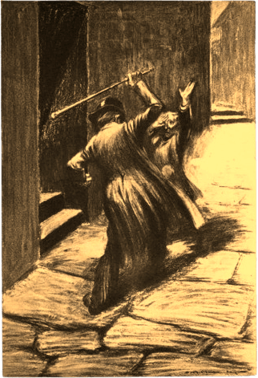
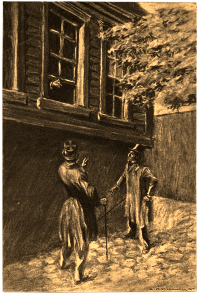
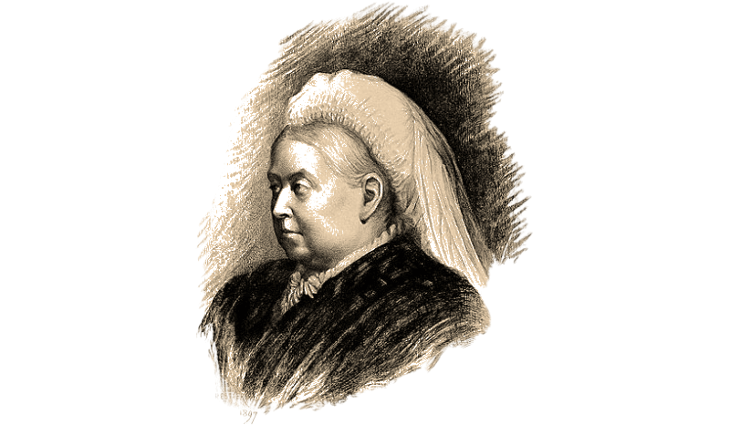

# Doctor Jekyll y Mister Hyde: Investigadores privados

«Doctor Jekyll y Mister Hyde: Investigadores privados» es un suplemento para _Fate Acelerado_ para un director de juego y dos jugadores, pero con solo un jugador en mesa al mismo tiempo. 

Tras solventar sus diferencias y problemas, el Doctor Jekyll y Mister Hyde han montado una agencia de investigación y se dedican a resolver crímenes en un Londres victoriano con la ayuda del abogado y amigo del Doctor Jekyll, Gabriel John Utterson.

Mientras hacen su trabajo, el inspector Newcomen de Scotland Yard no les quitará el ojo del encima, buscando que cometan un error para meter a Hyde en la cárcel.

Investigar casos no es fácil cuando dos personalidades tan diferentes habitan el mismo cuerpo, pero han encontrado la forma de hacerlo. Tus jugadores tendrán que trabajar en los casos dejándose en un diario notas y mensajes con los avances que hayan hecho en la investigación. De hecho, la única comunicación entre jugadores sobre la partida deberían ser esas notas. 

***

# La historia de la agencia Hyde & Jekyll

Originalmente, el Extraño caso de Dr. Jekyll y Mr. Hyde acaba el suicidio del doctor dejando una nota que acaba con la frase: «Pongo fin a la vida del infeliz Henry Jekyll». 

En la novela, Jekyll cada vez tiene menos control de su otro yo y pasa de una personalidad a otra involuntariamente sin necesidad de la fórmula secreta. Tras descubrir que no puede replicar el compuesto químico que despertó a Hyde y que no puede controlar sus apariciones, decide suicidarse para acabar con sus problemas y castigar a Hyde que es perseguido por el asesinato sin sentido de Sir Danvers Carew y por el que acabará en el patíbulo si es atrapado.  

Lo que poca gente sabe es que su relato tuvo una continuación escrita por su hijo, Robert Louis Stevenson junior. El hijo borracho y pendenciero del maestro Stevenson decidió escribir una secuela del libro de su padre para poder pagar sus deudas de juego. A Robert junior se le ocurrió la brillante idea de convertir a los personajes de su padre en detectives privados, tratando de seguir la estela de Sir Arthur Conan Doyle y su Sherlock Holmes.

En la novela de Robert junior se desmonta el final de su padre haciendo que Jekyll sobreviva a su intento de suicidio y descubriéndose que Sir Danvers Carew, miembro eminente del parlamento inglés, planeaba matar a la Reina Victoria e imponer una república en el Reino Unido. Esto hace que Hyde sea indultado del delito de asesinato por acabar con un enemigo del país.

La historia continua con Jekyll y Hyde se veían involucrados en un misterioso asesinato y al final del libro ambos montaban una agencia de detectives con la ayuda del abogado y amigo del Doctor Jekyll, Gabriel John Utterson. La idea era seguir escribiendo casos y ordeñando la vaca de los personajes de su padre, pero el libro fue tal fracaso que no se publicaron más continuaciones.
Y de ahí salió la obra que tienes en tus manos «Doctor Jekyll y Mister Hyde: Investigadores privados».

## Preludio

El libro de Robert junior tiene un preludio de unas pocas hijas en las que arregla el final de la novel de su padre para sus intereses.

Hyde se despierta en la fría morgue de Scotland Yard tras haber estado al filo de la muerte durante unas horas. Parece ser que la dosis de veneno que tomo Jekyll solo lo dejo cerca de la muerte, suficiente para que Utterson creyera que había muerto.

Hyde entrará en shock al darse cuenta de que ha estado a punto de morir y que Jekyll tiene un control total sobre su vida y su muerte. Si se ha suicidado una vez y podría hacerlo más veces, mientras que él sería incapaz de tomar esa decisión.

Consigue huir de Scotland Yard y busca un sitio seguro donde quedarse y empieza a escribir y dejar notas para cuando se despierte Jekyll con las que llega a un acuerdo para que ambos sigan vivos. Tras varios días, consiguen llegar un acuerdo en que Hyde promete no matar bajo ningún concepto, pena de que Jekyll acabe con la vida de los dos.

Pero todavía hay un problema, Hyde es un fugitivo de la justicia. Por suerte, la policía descubre el plan de Sir Danvers Carew de matar a la reina e imponer una república en la monárquica Inglaterra. Esto hizo que Hyde pasara de ser un fugitivo buscado por asesinato a casi un héroe de la reina.

A pesar de todo esto, al final del capítulo el inspector Newcomen sigue sospechando de Hyde y le asegura a Jekyll que no le quitará ojo a su amigo Hyde y terminará con sus huesos en el patíbulo. Newcomen fue el intento de Robert junior de tener su propio Lestrade y por eso lo metió con calzarlo en el libro.
## El primer caso

El resto de la novela trata de un misterio que era un pastiche de un montón de casos de Sherlock Holmes, muy malamente hilvanados y a veces sin ningún tipo de sentido. Todo empieza cuando Gabriel Utterson pide ayuda a Jekyll con unas pruebas médicas para defender a un cliente suyo de acabar ahorcado.

La trama se va enrollando rápidamente y Hyde y Jekyll terminan investigando una trama criminal muy loca y extravagante por todo Londres. Hay persecuciones en carruaje, carreras por tejados, peleas de taberna, autopsias ilegales, pruebas científicas fantasiosas y mensajes con extraños símbolos hindúes. Todos los tropos de las novelas de detectives apretujados en 200 páginas.

Lo interesante en la trama es que Mr. Utterson descubre que investigar crímenes hace que Jekyll y Hyde se centren y las personalidades sean más estables y puedan funcionar mejor.

La novela acaba con la extraña pareja resolviendo el caso y librando de la cárcel al cliente de Utterson.

Con ello dejan en ridículo al inspector Newcomen y con él a Scotland Yard, ya que había detenido y encarcelado a una persona inocente. Newcomen jura vengarse de Jekyll y Hyde y desde entonces será uno de sus mayores detractores.

En el epílogo de la novela, Utterson convence a Jekyll y Hyde de montar su propia agencia de detectives en un intento de Robert junior de hacer más novelas y explotar una posible saga de libros de misterios que nunca llegaron a escribirse.

Es interesante descartar que al final de la novela sigue habiendo solo había 2 personas que saben el secreto de Jekyll y Hyde.

* **Gabriel John Utterson** que ya lo sabía desde la novela anterior.
* **Mister Poole**, el ayuda de cámara de Jekyll, tiene un extraño honor de mayordomo le impide hablar de su amo y contar su secreto.

## La creación de la agencia

Tras la exitosa resolución de su primer caso, que salió en las portadas de todos los periódicos de Londres, Utterson propuso a la extraña pareja, usando sus mejores técnicas de abogado,
crear una agencia de detectives.

Gabriel consideraba que esta nueva actividad podría mantener a Hyde en este lado de la ley al ser uno de sus protectores y a Jekyll lejos de sus peligrosos experimentos.

Cómo puedes comprobarse, no se equivocaba, ya que parece que hasta el día de hoy esta treta ha funcionado como un reloj de cuco. Además, esperaba tener a un buen equipo de investigadores que le ayudara en sus pleitos y demandas a un coste muy barato.

Jekyll alquiló un local en Belgravia y empezaron a montar el local de la agencia. A nadie le puede extrañar que el mayor punto de conflicto fue el orden de los apellidos en el cartel de la agencia. Tras una larga discusión que ocupo montones de notas, decidieron dejarlo al azar y la agencia se terminó llamando Hyde & Jekyll. 

El día de la inauguración, Utterson les regaló un cuadro pintado por el mismo en que se les ve a los dos investigando una escena de un crimen. Jekyll aparece mirando un mechón de pelo con una lupa, mientras que Hyde tan encorvado olisqueando unos restos de sangre como si fuera un sabueso de caza siguiendo el rastro de un zorro.

Jekyll odia ese cuadro y trata de hacerlo desaparecer siempre que puede. Hyde, sin embargo, lo adora y muchas veces imita la pose de perro rastreador, sobre todo cuando está con Utterson. Cada vez que Jekyll lo quita, ahí está Hyde para volver a ponerlo en la pared de la agencia.

***

# Las reglas

Este suplemento trae unas series de reglas extras presentadas en el manual de _Fate Acelerado_ ([reglas completas](https://goo.gl/9wF9SL)) que tienen como objetivo establecer las interacciones entre los dos personajes principales, Jekyll y Hyde.

## Dos personajes, un cuerpo

Como DJ, tus dos personajes van a habitar el mismo cuerpo y, por tanto, cuando Jekyll o Hyde están despiertos, su contrapartida está encerrado en lo más profundo de su mente sin saber nada de lo que pasa en el exterior. Para ello cada sesión deberás llevarla a uno solo de tus jugadores, mientras que el otro está fuera de la mesa, en su casa, viendo una peli, … en cualquier sitio menos en la partida.

### Paso de una personalidad a otra

Cuando el **personaje activo se duerma o se «deje caer», su jugador abandonará la mesa, y entrará el otro jugador** apareciendo la otra personalidad.

En principio el cambio se da al irse a dormir, digamos que Jekyll es el sueño de Hyde y Hyde la pesadilla de Jekyll.

Los personajes pueden tratar de estar varios días sin dormir para no entregar el control a su otro yo. Pero cada 24 horas de privación del sueño a partir de las 48 primeras sube un nivel todas las dificultades y tiene el aspecto «muerto de sueño».

#### Dejarse caer

Un jugador puede dejar deliberadamente salir a su otro yo al final de una escena. Simplemente, cierra los ojos, pone la mente en blanco y deja que entre su «alter ego».
Si desea hacerlo **dentro de una escena**, puede hacerlo, pero psicológicamente tiene efectos en ellos. Al hacer la transformación de una forma tan brusca están reconociendo que necesitan a su otro yo más de lo que les gustaría reconocer.

Si Jekyll deja salir a Hyde de esta manera, está reconociendo que necesita a Hyde, su instinto animal, su brutalidad y su falta de ética y valores. **Hyde aparece entonces con el aspecto temporal «desatado». Jekyll, por su parte, aparece con el aspecto «todo controlado»** sabiendo que es mucho mejor que su brutal contrapartida y con mucha más confianza de la normal al saber que está al mando en esta extraña sociedad de dos.

Esto representa el hecho de que en esta forma de ceder el control el otro recién activado tiene cierta mano ancha para hacer lo que desee sin pensar en las consecuencias. 

Imaginemos que Jekyll se ha metido en una pelea de taberna en White Chapel, puede interesarle invocar a Hyde para que le saque del apuro. Al primer puñetazo que recibe en el rostro, se «deja caer» y, cuando vuelve la cara, ahí está la maliciosa mirada de Hyde preparado para la bronca.

Pero recuerda que muy posiblemente Hyde se despertará sin saber muy bien qué pasa y por qué le golpean, aunque eso nunca le ha preocupado mucho.

#### Regla opcional: Disparadores de cambio

Normalmente, los cambios suponen cortar la partida y quedar otro día con el siguiente jugador. Si tus jugadores pueden estar entrando y saliendo de la partida sin problema, puede ser muy divertido que el jugador inactivo pueda interferir en la historia del jugador activo. Para ello, el jugador que se va puede poner disparadores que le permitirán volver a estar activo.
Los disparadores pueden de muy diversa índole, pero deben ser bastante específicos. El director de juego tendrá que darles el visto bueno. Veamos algunos ejemplos.

* Hyde lleva días sin meterse en problemas y saldrá siempre que Jekyll reciba daño de una pelea.
* Jekyll aparecerá si entra en escena Miss Daisy, de la que está perdidamente enamorado y a la que no quiere que Hyde la incomode con sus palabras soeces.

Poner un disparador tiene **1 coste de un punto de destino** y puedes poner **hasta 3 disparadores**. La perdida del punto de destino se aplicará si se activa alguno de los disparadores y perderás tantos puntos como disparadores pusiste. En cuanto tu personaje está activo de nuevo tanto porque su otro yo le ha dado paso como porque se ha activado el disparador, estos desaparecen.

### Consecuencias

Las **consecuencias y aspectos físicos como heridas y golpes pasan de un personaje a otro**. Si Jekyll recibe una herida escapando de unos maleantes, cuando Hyde se despierte, se encontrará con la herida limpiada y suturada por el doctor. Si Hyde se pasa con la bebida, al caer inconsciente, Jekyll se levantará con el aspecto «borracho» o con una «resaca de mil demonios».

Las **consecuencias mentales o sociales no se mueven entre Hyde y Jekyll**. Imaginemos que Jekyll adquiere una severa aracnofobia. Al despertar, Hyde podría juguetear con una tarántula sin ningún temor.

Lo que sí has de tener cuenta es que Jekyll tiene moral y ética y los actos de Hyde le pueden afectar y provocarle consecuencias mentales. Hyde tiende a crear situaciones que traumatizan a Jekyll cuando se despierta. 
De hecho, la complicación principal de Jekyll es su «alter ego» y las fechorías y felonías que hace Hyde mientras controla su cuerpo.

Eso no se da la contra, es muy difícil que Jekyll haga algo que pueda influir social o mentalmente a Hyde de forma grave.

Pensemos, por ejemplo, que Hyde ha secuestrado y ha torturado a un ladronzuelo para sacarle información. Al día siguiente Jekyll se despierta y ve al criminal atado a una silla, inconsciente, herido, ensangrentado y lleno de moratones. A discreción del máster, Jekyll tendrá que defenderse del shock de la brutalidad que ha hecho su contrapartida animal.

### Cambios corporales

Realmente **no hay cambios físicos entre Jekyll y Hyde**. No le creen músculos o se le afilan los dientes. Su cuerpo es el mismo, pero hay sutiles cambios que los hacen diferentes, tan diferentes que muchas veces pasarán por personas distintas. Veamos algunos ejemplos:

* Mientras que Jekyll siempre va estirado, mostrando su porte de caballero, limpio y con un traje impecable, Hyde va encorvado, con ropa y sombrero que le tape la cara y sin preocuparse mucho de su higiene personal.
* Mientras que como buen inglés Jekyll tiene una dicción perfecta y un tono de voz medio y amable, Hyde trata de compensar sus complejos con un tono de voz grave y hablando muy alto, casi a gritos.
* Hyde es mejor en peleas, no porque sea más fuerte y rápido, sino porque su lado animal le hace más agresivo y decidido y su umbral del dolor es mayor que el de Jekyll.

Cualquier persona tendrá que pasar una **tirada Buena (+2) para sospechar que Hyde y Jekyll son la misma persona** y que nunca se les ve juntos.
#### Haciéndote pasar por el otro

Puede ser que en determinados momentos de los casos Hyde necesite comportarse y parecerse a Jekyll y viceversa. 

Si desean hacerse pasar por su otro yo, **deberán hacerlo al estilo de su «alter ego»**, es decir que si Hyde quiere hacerse pasar por Jekyll en un hospital deberá hacer al estilo Cauto, mientras que si Jekyll quiere dar la nota en una taberna, tendrá que ir al estilo Llamativo contra su naturaleza reservada.

En cualquier caso, el director de juego, tiene la última palabra sobre el estilo a elegir que tomaría el otro yo en esa situación. También podéis mandar un mensaje y preguntar al otro jugador.

## Compartiendo información del caso

Cuando investigan un caso, Jekyll y Hyde no pueden discutir las pistas descubiertas mientras se toman un té con pastas. Lo que hacen es **dejarse notas y llevar un diario del caso** donde escriben las cosas que han hecho y la nueva información obtenida para que la lea su otro yo al salir. 

Los jugadores deben ir escribiendo las notas mientras juegan y lo que haya en las notas y el diario real es lo que habrá en partida. Tampoco deben extenderse mucho, apuntes rápidos de una frase como mucho. El director de juego puede extender esas frases con más información, como si el autor hubiera escrito mucho más y con más detalle, pero no puede contar cosas que no estén escritas.

Si en partida **no hubiera tiempo o posibilidad para escribir el diario, la personalidad que salga a la luz no tendrá ninguna información** de lo que la otra personalidad ha estado haciendo. Por ejemplo, si Mister Hyde es atrapado y encerrado en una celda sin forma de dejar un mensaje al Doctor Jekyll, cuando este se despierte se encontrará en esa celda sin saber como ni porque. 
Tendrá que seguir a partir de lo que él mismo sabía y de los últimos apuntes escritos por Hyde. Jekyll no contará con la ventaja de saber que es lo que pudo averiguar desde la última nota hasta ahora.

### El diario del caso

El diario del caso es **un objeto real dentro de las aventuras** que normalmente irá con ellos y que puede ser usado en su contra. Un criminal podría encontrarlo al registrar a Jekyll o podrían robárselo a Hyde durante una de sus borracheras.

Si algún PNJ tiene acceso al diario o alguna de las notas sueltas, podrá leerlas y hacer uso de esa información para su provecho.

Si ellos lo pierden, ya no podrán acceder a su contenido y tendrán que empezar un nuevo diario, con la info que recuerden.

Podrían tratar de hacer copias de seguridad o encriptarlo, pero entonces deberían hacerlas ellos mismos como jugadores sobre sus notas.

### Otras formas de comunicarse

En este punto entra ya la creatividad de tus jugadores, quizás Jekyll se pinte en la frente con carboncillo el nombre del asesino o Hyde pague a un pilluelo una libra para que le pegue una patada la próxima vez que le vea y le grite una hora y un lugar.

Puede ser un punto divertido que se fastidien de esa manera, pero deberás controlar que no se les vaya de las manos.

## Compartiendo puntos de destino

Cuando sale una nueva personalidad a la palestra, esta **recibe todos los puntos Fate de su anterior yo que tuviera por encima de su capacidad de recuperación**.
Pongamos que Jekyll tiene 5 puntos Fate y una capacidad de recuperación 3. Se va a dormir para de salga Hyde, que tiene una capacidad de recuperación de 3. Eso supone que Hyde empieza con 5 puntos Fate, 3 normales por su capacidad de recuperación más 2 heredados de Jekyll.

Esto trata de reflejar que el trabajo llevado a cabo y las ventajas conseguidas por un jugador investigando permanece de cierta forma en la nueva personalidad.

## Cómo resolver conflicto entre personajes

Jekyll y Hyde por la misma naturaleza de su historia van a tener conflictos. Las formas de abordar los casos deberían ser diametralmente distintas, mientras que Jekyll tiene un punto de vista científico y analítico, Hyde saldrá a la calle a sacar respuestas rompiendo dientes.

Puede pasar que algún momento una acción de uno interfiera en las de otro, sobre todo si hay fallos en la transmisión de la información entre personalidades.

Tal vez hayan interrogado al mismo testigo cada uno a su estilo. Primero le interrogo Jekyll y fue bastante agradable prometiéndole protección policial y algo de dinero. Tras un buen rato le saco un nombre y una dirección. Más tarde apareció Hyde gritando y amenazando al testigo de que va a hacer su vida un infierno. Hyde no solo se enfrenta al aguante del testigo, también a las promesas que le haya hecho Jekyll, lo cual complica el interrogatorio. 

En esta situación, si el **segundo jugador usa un estilo diferente al primero**, deberá pasar una **dificultad igual a la dificultad normal de interrogatorio más los éxitos que consiguió el primer jugador**. Si usan el mismo estilo, algo que pocas veces pasará, solo deberán pasar la dificultad normal.
Digamos que si Hyde y Jekyll interrogan a un sospechoso usando su fuerza, al usar el mismo estilo, sus acciones no entran en conflicto y la dificultad será en ambos casos solo la resistencia de interrogado.

## Hitos y su uso

A la hora de mejorar los personajes son muy distintos. Jekyll, con su personalidad completa, puede gastar los hitos como desee sin ningún tipo de restricción.

Por el contrario, Hyde, como solo es la parte más animal, instintiva y malvada de Jekyll, no podrá gastar sus hitos como desee.

* Los estilos Cauto, Ingenioso y Furtivo no podrán ser mayores que el menor del resto de estilos (Rápido, Llamativo y Vigoroso).
* No puede crearse proezas en las que intervengan los estilos Cauto, Ingenioso y Furtivo.

***

# El Londres de 1890 y sus gentes

Las aventuras de Jekyll y Hyde transcurren alrededor de 1890, en plena era victoriana, en un Londres que es centro del mundo y donde lo mejor y lo peor de la sociedad inglesa conviven como pueden.

## El Londres victoriano

El Londres de las aventuras detectivescas de Hyde y Jekyll es el Londres victoriano que conocemos de libros, series y películas. Hablamos del Londres de los caballeros con sombrero y bastón que van a su club de caballeros a hablar de sus cosas caballeros, como Phileas Fogg de La vuelta al mundo en 80 días. También es el Londres de robos famosos y asesinatos misteriosos de Sherlock Holmes y el Doctor Watson. 

Este Londres es la capital de un imperio y todos los días llegan y parten barcos de todas partes del mundo. Los mercados están llenas de productos exóticos de todas las colonias y las calles se llenan de olores a comidas de todo el mundo.

También es el Oliver Twist con pilluelos que se dedican a buscarse la vida en las calles y callejones de los peores barrios de la ciudad. Sin olvidarse del Londres donde las mujeres tienen que prostituirse para sobrevivir y son brutalmente asesinadas por el famoso asesino en serie Jack El destripador.

Solemos olvidarnos que el Londres victoriano también tiene estos elementos menos románticos y novelescos.

* Es el Londres de los ladrones de cadáveres que saquean tumbas para robar los enseres de los muertos o para vender los cuerpos a estudiantes de medicina sin escrúpulos.
* Las fábricas expulsan sus hediondos humos, convirtiendo el aire en irrespirable y creándose el famoso «smog» londinense que mata tanta gente como otras enfermedades infecciosas de la época.
* El trabajo infantil y las jornadas de trabajo interminables están a la orden del día y el alcoholismo es un problema muy grave entre la clase obrera.
* Otro punto interesante a tener en cuenta es que en estos años los primeros coches empiezan a circular, añadiendo más suciedad, ruido y polución a sus abarrotadas calles.

## La agencia Hyde & Jekyll

La agencia Hyde & Jekyll es una antigua sombrerería del barrio de Belgravia que Jekyll consiguió a muy buen precio. 

Hyde prefería algo más cercano a, como dice él, la acción, en barrios más conflictivos como White Chapel o el East End. Sin embargo, Jekyll no podía consentir que se le relacionará con barrios de baja estofa. Además, sabía que las tabernas, los casinos ilegales y las salas de variedades cercanas serían una distracción constante para Hyde y una fuente de resacas al día siguiente para él.

La sombrerería contaba con una tienda a pie de calle y luego un sótano mal ventilado donde trabajaba el sombrerero y sus ayudantes.

La planta superior tiene una sala principal con un gran escaparate a la calle y la zona de venta que se ha convertido en una recepción con sillas donde esperan los clientes.

El almacén de la tienda ha sido reconvertido en un despacho donde hacen trabajo de investigación. Hay un mullido sofá que no pocas veces ha sido usado como cama improvisada donde se ha acostado Jekyll y se ha despertado Hyde y viceversa.
Jekyll ha convertido el sótano, al que se accede por unas escaleras desde el despacho, en su laboratorio. Ha traído casi todo el equipamiento científico de su casa y así puede hacer sus investigaciones y pruebas en la agencia en vez de tener que ir hasta su casa.

## Scotland Yard

La Policía Metropolitana de Londres, más conocida por todos como Scotland Yard o The Yard, se encarga de investigar todos los crímenes en Londres y es un elemento muy importante y recurrente en estas aventuras.

Sus hombres siempre estarán vigilando las escenas de los crímenes, los cadáveres de las víctimas serán estudiados en su morgue y los sospechosos serán encerrados e interrogados en sus celdas y salas de interrogatorio.

Todo eso hará que tus jugadores estarán siempre entrando y saliendo de sus dependencias por asuntos oficiales y seguramente que Hyde también por asuntos no oficiales.

Los agentes de calle, los viejos archiveros y los médicos forenses novatos pueden ser perfectos aliados y contactos de tus personajes.

### Inspector Newcomen

El inspector Newcomen debería ser una constante en todas las aventuras, apareciendo en cualquier momento y sin dejar nunca de vigilar y perseguir a tus jugadores.

Newcomen puede en ocasiones ser un aliado de tus jugadores, pero sobre todo debería ser un rival que pondrá en duda todas las pistas y deducciones realizadas por tus jugadores. Debería ser la piedrecita en el zapato de Hyde y Jekyll, sobre todo de Hyde, al que no le quita ojo desde el asesinato de Sir Carew. 
Newcomen no cree en que la gente cambie y sabe que Hyde volverá a matar por placer y él estará allí para detenerle y que sea ajusticiado con todo el peso de la ley.

De todas formas, debes considerar que no es un gran policía y su método policial es pésimo, si no ha descubierto que Jekyll y Hyde son la misma persona.

### Técnicas de investigación forense disponibles

Las técnicas de investigación forense que Scotland Yard disponía a finales del siglo XIX podían ser las más avanzadas de su época, pero quedan muy lejos de las actuales técnicas forenses que vemos en series como CSI. Así que conocer, aunque sea superficialmente, que podía averiguarse y que no usando los conocimientos forenses de la época es interesante para el desarrollo de tus aventuras. 

* Las **huellas dactilares** tampoco era una prueba usada por la policía, pero si era conocido el concepto de huella dactilar y se jugaba con la posibilidad de que fueran únicas.
* Los primeros **perfiles psicológicos** son elaborados en esta época, por ejemplo, para tratar de detener a Jack el destripador.
* Las **pruebas genéticas* claramente no existían. Harán falta muchas décadas para que se hagan los primeros tests de ADN.
* La policía hacía **análisis microscópicos** de diferentes elementos como cabellos. Con esos análisis podían estimar el sexo y la edad del criminal. También podían estudiar las estrías de las balas y determinar que una arma de fuego había disparado o no una bala.
* Las **autopsias** están a la orden del día en caso de muertes violentas y podían determinar con bastante fiabilidad las causas de la muerte y saber la hora del fallecimiento por el rigor mortis.
* Empiezan a haber estudios para poder distinguir la **sangre y otros fluidos** de otras sustancias y se empieza a estudiar las salpicaduras de sangre para averiguar más datos de los asesinatos.
* A pesar de los avances científicos, seguían teniendo bastantes problemas en cosas como **identificar sustancias venenosas**, aunque empezaban a haber pruebas para detectar sustancias como el arsénico. De hecho, en el siglo XIX fueron muy famosos los envenenamientos porque no se detectaban en las autopsias y los venenos no estaban controlados y su acceso era muy sencillo.
* La **fotografía forense** es rara, pero no es extraña para Scotland Yard, sobre todo en casos famosos, que atraían el interés del público.
* Los **retratos robot** también son usados, aunque a veces podían hacer más mal que bien, llevando al populacho a linchar a personas inocentes.

Una vez conocidos estos puntos principales, nada impide que los personajes hayan oído a hablar de novedosas pruebas forenses y traten de utilizarlas en sus casos, sobre todo Jekyll con su gusto por la ciencia y los descubrimientos científicos. No sería de extrañar que pudiera aplicar en sus pruebas forenses los últimos hallazgos científicos y médicos publicados en la Gaceta Médica o Revista Entomológica Británica. 

## Magia y ciencia

Las aventuras de Jekyll y Hyde se encuadran en un mundo como el nuestro, pero con ciertos toques de _Ciencia extraña_. Piensa que los propios protagonistas son fruto de un experimento científico fallido. 

Mi recomendación sería que los inventos locos sean solo detalles que den color a las historias. Tal vez en determinado momento tengan que usar un coche que vaya el doble de rápido que un caballo o que un personaje explore las cloacas usando una linterna eléctrica mucho más potente que los quinqués o las antorchas. 
Otra opción que podría quedarle bien a tus aventuras sería magia negra con exóticos componentes como maldiciones egipcias o hechizos de vudú. Como hemos visto antes, la magia debería ser muy sutil y solo detalles en la trama. Me refiero a villanos con joyas con poderes hipnóticos y venenos, pócimas somníferas y sueros de la verdad hechos con plantas exóticas de la selva o sacados de antiquísimos papiros egipcios perdidos.

«El secreto de la pirámide» es un claro ejemplo de como aplicar la ciencia y magia en las aventuras. Son detalles divertidos y coloridos, pero no son el eje de las partidas. 

## Y si meto a Sherlock Holmes y al Doctor Watson

¿Y por qué no? Ambas parejas comparten época y lugar, el Londres victoriano, y todos son detectives, con lo que la cooperación o el enfrentamiento es muy factible.

Pueden ser que sus agencias estén enfrentadas y se roben los clientes. Puede que luchen por aparecer en los periódicos con los asombrosos relatos de sus casos. Quizás un rico noble haya montado un concurso para ver quién es mejor detective.  

Rizando el rizo, podría darse el caso de que Holmes y Hyde tengan que infiltrarse en la guarida del asesino o que Watson y Jekyll tengan que hacer una autopsia juntos al cadáver de una víctima. Los inspectores Newcomen y Lestrade seguro que se conocen y estarán encantados de trabajar juntos para desbancar a tus jugadores como los mejores detectives de la ciudad.

Y si te sientes creativo, también puedes hacer que tus jugadores investiguen extraños asesinatos donde las víctimas tienen dos heridas en el cuello y son desangrados hasta morir. O pueden que teman que una nueva personalidad realmente diabólica haya aparecido y haya estado cometiendo unos terribles asesinatos de mujeres en White Chapel. 

***

# Los extraños casos de Hyde & Jekyll

¿Y qué son unos detectives sin caso? Así que aquí hay 3 casos para que tus jugadores puedan disfrutar de sus andanzas detectivescas como Henry Jekyll y Edward Hyde.

No hay un orden concreto para jugar los casos. Puedes jugarlos como más te gusten.

## El extraño caso de la tigresa desaparecida del Zoo

> El pánico corre por las calles de Londres ante la noticia de que una tigresa bengalí ha escapado del zoo. Sin embargo, uno de sus cuidadores fue atacado por desconocidos la noche de la desaparición de la tigresa. Sea como sea, habrá que encontrarla, detener a su ladrón y devolverla al zoo.

### Resumen del caso

Kim ha recorrido miles y miles de kilómetros desde su Bengala natal para liberar a su amiga Ehbri Khan, una tigresa de Bengala, que está encerrada en el zoo de Londres. Ehbri Khan y Kim se conocieron de crías (de tigre y de humano) en las selvas de Bangladés y se hicieron compañeras de juego inseparables, hasta que hace unos años Ehbri Khan fue captura por un rico cazador londinense, Sir Roger Corbyn, que la trajo a Londres y la dono al zoo.

Kim no sabía que había sido de su compañera, hasta que trabajando de sirvienta para un rico terrateniente inglés descubrió en un viejo ejemplar «The National Geographic» que Ehbri Khan (o como la habían rebautizado en el zoo, Victoria, en honor a la reina) estaba viva y encerrada en un horrible zoo en el lejano Londres. 
Tras conseguir un pasaje y pasar meses trabajando en casi esclavitud en un barco inglés, Kim llegó a Londres y sin pensárselo se coló en el zoo y sacó a Ehbri de su cárcel tras dejar sin sentido a uno de los cuidadores.

Ahora mismo están refugiados en el interior del bosquecillo de Regent’s Park esperando el momento de poder escapar de Londres.

### Introducción al caso

Como abogado y amigo y benefactor del zoo de Londres, Gabriel Utterson es avisado de la fuga del tigre y este a su vez pide a sus amigos Jekyll y Hyde que ayuden al zoo a encontrar a la tigresa escapada.

Cuando lleguen a la zona de los grandes felinos se encontrarán al inspector Newcomen metido dentro de la jaula de la tigresa revisando los barrotes junto a un cartel que pone «No dar de comer a los animales». Que tus jugadores hagan el chiste es cosa suya.

La jaula en un habitáculo de 20x20 metros cuadrados con barrotes en 3 de sus lados y ladrillos con una puerta reforzada cerrada por fuera con un resistente pestillo. No hay cerradura, la puerta da una parte a la que los visitantes no tienen acceso de normal y por seguridad prefieren poder entrar y salir sin necesidad de usar una llave.

Cómo siempre Newcomen les dirá que no pueden estar allí y que solo estorban. Lo tiene todo controlado y están buscando a un experto para que atrape a Victoria, la tigresa.

Según el inspector, el ataque al cuidador y la fuga de la tigresa son pura coincidencia. La tigresa definitivamente se ha escapado.

Robar un animal depredador como ese supone un golpe muy complejo con redes, sedantes, un vehículo de transporte y mucho ruido y no hay pruebas de nada de eso.
No les quitará los ojos de encima mientras empiezan a investigar, pero enseguida se llenará de gacetilleros haciendo preguntas. Newcomen y podrán moverse más tranquilamente.

#### Inspector Newcomen

Newcomen está muy interesado en este caso, puede darle un poco de fama y ayudarle en su carrera. Sabe que el caso va a ir directo a las portadas de los periódicos sensacionalistas y su nombre aparecerá como junto a palabras como «héroe» o «protector». Además, está encantado de sacar el gran cazador que tiene dentro y poder disparar a ese gran felino.

* **Aspectos**
  * **Concepto principal:** Inspector de Scotland Yard
  * **Complicación:** Obsesionado con Hyde
  * Muchos años pateando las calles
  * Duro como un clavo en un ataúd
  * Acostumbrado a las vigilancias
* **Estilos:** Cauto Mediocre (+0), Furtivo Bueno (+2), Ingenioso Normal (+1), Llamativo Normal (+1), Rápido Bueno (+2), Vigoroso Grande (+3)
* **Proezas**
  * **Lenguaje legal:** Debido a que conoce muchos términos y precedentes legales, gana un +2 para Crear una ventaja de modo Rápido cuando conversa con sospechosos, abogados, jueces y otras gentes del sistema policial y penal.
  * **Voz intimidatoria:** Debido a su tono de voz intimidante, gana un +2 para Atacar de modo Llamativo, cuando interroga a delincuentes y criminales.
  * **Juegos de manos:** Debido a que le encantan los trucos de magia y los juegos de manos, gana un +2 a superar de modo Rápido, cuando trata de escamotear algún objeto pequeño.
* **Capacidad de recuperación:** 3
* **Estrés:** 1 | 2 | 3
* **Consecuencias:** Leve 2 | Moderado 4 | Grave 6
### La escena del crimen

Realmente no hay nada que buscar en la jaula, Kim abrió la puerta, Ehbri se despertó y al oler a su amiga se lanzó a lamerle la cara y tras unos segundos se fueron. Saltaron la verja del zoo y fueron corriendo. De casualidad encontraron el bosquecillo de Regent’s Park y ahí se establecieron.

No hay ni una pista que seguir en la jaula. Kim no tiene nada, así que no ha dejado nada olvidado. El acceso a la jaula era de baldosas con lo que no dejó pisadas.

### Pistas a seguir

Tras revisar la escena del crimen empieza la labor detectivesca que puede hacerles ir a tus jugadores desde el Museo Británico al matadero municipal.

**Si buscan pisadas** con una tirada Normal (+1) encontrarán las de Ehbri que van hasta el lugar donde saltaron la valla del zoo para perderse en las adoquinadas calles aledañas. Hay cientos de pisadas de los visitantes, así que las de una niña como Kim no se destacan. Además, cuando están juntas, Kim va montada en la grupa de Ehbri.

**Si visitan el lugar donde fue atacado el celador del zoo** encontrarán sin problema el sitio donde aterrizó el «mono». Las huellas son de algo o alguien pequeño y con una tirada Buena (+2) tendrán bastante claro que son humanas. Lo curioso es que son pies humanos descalzos (Kim se quitó los zapatos para trepar mejor al árbol).

En el árbol desde que debió saltar había ramas rotas, así que debió subirse allí y estar un rato hasta atacar al vigilante.

Si vuelven a buscar pisadas (tirada Buena +2), esta vez fijándose en las de un niño descalzo les llevará hasta la jaula de Victoria. 
Si deciden confirmarlo, no falta ningún mono del zoo y no hay constancia de que alguno se escape de su jaula y haga travesuras por las noches.

**La historia de Victoria la tigresa** es de sobra conocida y cualquier persona del zoo o un poco de trabajo en los archivos del zoo les contará la historia de como la cazó Sir Corbyn y se la regaló a la reina Victoria que la dono al zoo.

**Si quieren hablar con Bob, el cuidador del zoo agredido** está descansando en su casa del golpe. No podrá decirles mucho, estaba de ronda nocturna, no muy lejos de las jaulas de los felinos, cuando una figura más bajita que él saltó como un mono enfrente de él y le dejó inconsciente golpeándole con un palo.

Según Bob, ha habido veces en que los bribones han entrado en el zoo por la noche a robar, pero nunca habían agredido deliberadamente a un cuidador.

**Alimentar a un tigre de Bengala no es sencillo** y si consultan a algún experto en zoología les dirá que puede comer entre 20 y 40 kilos de carne fresca al día, en cautividad con unos 8 kilos podría subsistir. 

Si buscan en los mercados de abastos y carnicerías de la ciudad, no encontrarán nada. No es un consumo de carne tan grande como para que fuera significativo. Cualquier restaurante cutre compra al día esa cantidad de carne.

Pueden montar un **mapa de Londres y marcar los sitios donde se escondería un tigre**. Pero encontrarán montones de parques, incluso puedes haber salido ya de la ciudad. Aun así, cuando empiecen los ataques de la tigresa, puede serles útil para poner sus localizaciones y los lugares de los ataques.

### Los primeros ataques

Kim necesita dinero para poder alimentar a Ehbri y volver a Bengala, así que no les queda más remedio que empezar a dar golpes nocturnos. Mientras que Ehbri los asusta hasta que se desmayan o los deja inconscientes de un par de golpes, Kim les roba la cartera y los objetos de valor. Harán un ataque al día y volverán con el botín al bosque. Al día siguiente, Kim buscará vender lo que pueda y comprar comida para Ehbri.

Scotland Yard sigue con sus teorías de la fuga porque aunque falten dinero y joyas, es algo normal que la gente saquee a las víctimas antes de llamar a la policía.

Kim y Ehbri no pueden alejarse mucho del bosquecillo de Regent’s Park por miedo a ser visto, así que los asaltos se concentrarán en esa zona de Londres. Cualquiera con un poco de cabeza verá que el epicentro de todo es Regent’s Park, pero por lo menos necesitaran 5 asaltos para fijar adecuadamente la zona. Quizás 4 días si hicieron trabajo de mapear los lugares donde podía esconderse un tigre en Londres.

Si ahora buscan carnicerías de la zona, descubrirán que una niña india está comprando en las carnicerías peores y más baratas toda la carne que puede, incluso ternera que se supone sagrada para ella.

#### Ehbri Khan

Ehbri es una esbelta y poderosa tigresa de bengala nacida en libertad. Desde que era una cachorra conoce a su amiga humana Kim, por la que haría lo que fuera. Fue capturada por Sir Corbyn y enviada al zoo de Londres. Estar separada de Kim la sumió en una terrible tristeza, pero cuando vio a Kim abrir la puerta de su celda y ayudarla a escapar de su prisión, se prometió que nunca la alejarían de nuevo de su salvadora. 
* **Aspectos**
  * **Concepto principal:** Temible tigresa de Bengala
  * **Complicación:** Hambrienta y asustada
  * Amigas para siempre (Kim)
  * Buena vista y olfato
  * Acechadora
* **Estilos:** Cauto Normal (+1), Furtivo Grande (+3), Ingenioso Mediocre (+0), Llamativo Normal (+1), Rápido Grande (+3), Vigoroso Enorme (+4) 
* **Proezas**
  * **Rugido aterrador:** Debido a su rugido aterrador, gana un +2 a Atacar de forma Vigorosa, cuando se enfrenta a un solo atacante.
  * **Huida a la desesperada:** Debido a su fuerza y agilidad, una vez por partida puede huir corriendo, saltando por los tejados o perdiéndose entre callejones con Kim a la grupa sin que se le pueda seguir corriendo detrás de ella. 
  * **Entender a los humanos:** Debido a que ha pasado mucho tiempo entre humanos, empieza entender su lenguaje y sus gestos y gana un +2 para Defenderse de modo Rápido cuando quieren tenderla una trampa.
* **Capacidad de recuperación:** 3
* **Estrés:** 1 | 2 | 3
* **Consecuencias:** Leve 2 | Moderado 4 | Grave 6

#### Kim

Kim conoce a Ehbri desde que tenía 6 años y se perdió en la selva que rodeaba su casa. Se encontró con una cachorra de tigre huérfana a la que cuidó y alimento como pudo. 

Pasar tanto tiempo en el bosque con Ehbri hizo de ella fuera un poco salvaje, de hecho es una gran escaladora y ágil como un mono. También ha aprendido a hablar con su amiga tigresa y se compenetran perfectamente.
Cuando Ehbri desapareció, Kim sufrió muchísimo y cuando descubrió que seguía viva en Londres, supo que tenía que ir a buscarla, liberarla y volver juntas a Bengala.

* **Aspectos**
  * **Concepto principal:** Aventurera sin miedo
  * **Complicación:** Niña extranjera en Londres
  * Amigas para siempre (Ehbri Khan)
  * Ágil como un mono
  * Valiente como un tigre
* **Estilos:** Cauto Normal (+1), Furtivo Grande (+3), Ingenioso Bueno (+2), Llamativo Normal (+1), Rápido Bueno (+2), Vigoroso Mediocre (+0)
* **Proezas**
  * **Ataque sorpresa:** Debido a su agilidad y sigilo, una vez por partida puede deshacerse de un matón directamente tendiéndole algún tipo de trampa.
  * **Vida en el bosque:** Debido a haber crecido en el bosque, gana un +2 para Crear una ventaja de modo Cauto cuando está en bosque, selva o similar.
  * **Entender a los felinos:** Puede comunicarse con felinos como si fueran PNJ humanos, ten en cuenta que la comprensión del mundo del felino es limitada.
* **Capacidad de recuperación:** 3
* **Estrés:** 1 | 2 | 3
* **Consecuencias:** Leve 2 | Moderado 4 | Grave 6

### Entra Sir Corbyn

La cosa se complica cuando Sir Corbyn llega de su retiro en la campiña escocesa para que de caza y mate a Ehbri a petición del inspector Newcomen. Si quieres hacerlo más ridículo, diles que lleva unos meses en el lago Ness buscando un monstruo marino.

Sir Corbyn montará un equipo de caza con los peores policías de a pie de Scotland Yard y empezará a patearse las calles.
Igual que Kim y Ehbri se siente fuera de lugar, pero a diferencia de ellas no está asustado. Está disfrutando cada segundo de esta nueva caza y de cómo va a fardar en su club de caballeros de ser el cazador que dio muerte al tigre devorado-hombres de Londres.

Ya se ve recibiendo una medalla de la reina y como esta manda disecar a la tigresa y la pone en la sala de audiencias al lado de su trono.

No puede seguir muchos rastros en el duro adoquín, ni llevar un elefante por las calles de Londres desde el que disparar a su presa, pero ha empezado a estudiar los lugares de los ataques y a triangularlos para acotar su zona de caza. Además, ha montado un puesto de caza móvil encima de un carruaje para detenidos de la policía a semejanza de los elefantes que usan en la India para cazar tigres.

No hemos de olvidar que cuenta con su salsa secreta, un adobo secreto que aprendió en Kenia para echar a la carne fresca. La hace irresistible para los felinos que además pueden olerla desde grandes distancias.

Si van de safari urbano con Sir Corbyn verán que empapa siempre la carne de las trampas con un líquido verdoso que echa de una petaca. Y si le preguntan les dirá que son secretos de los grandes cazadores.

#### Sir Roger Corbyn

Sir Corbyn vive por y para la caza y como ella es cruel y sanguinaria. Mientras que otros cazadores puede tener un mínimo de respeto por sus presas. Sir Corbyn se ríe de ellas y las desprecia desde su puesto elevado y camuflado cuando ve su cadáver abatido por sus disparos a través de su mira telescópica.
Este viejo cazador está deseoso de acabar con Ehbri, a la que tuvo que atrapar viva y no tuvo el gusto de matar. Pero esta vez no escapará de su rifle de cazar elefantes y acabará decorando alguna sala del palacio de Buckingham.

* **Aspectos**
  * **Concepto principal:** Gran cazador blanco
  * **Complicación:** Cruel y sanguinario
  * Mi fusil de cazar elefantes
  * Puedes huir, pero te encontraré 
  * Modales suaves
* **Estilos:** Cauto Normal (+1), Furtivo Bueno (+3), Ingenioso Normal(+1), Llamativo Bueno (+3), Rápido Bueno (+3), Vigoroso Bueno (+3)
* **Proezas**
  * **Francotirador:** Debido a su experiencia como cazador, gana un +2 para Atacar en modo Furtivo cuando dispara desde una localización oculta.
  * **Trampero:** Debido a su experiencia cazando grandes bestias, gana un +2 para Crear ventaja en modo Furtivo cuando monta trampas.
  * **Historias de caza:** Debido a sus años contando historias de caza falsas, gana un +2 para Superar en modo Llamativo cuando tiene que mentir.
* **Capacidad de recuperación:** 3
* **Estrés:** 1 | 2 | 3
* **Consecuencias:** Leve 2 | Moderado 4 | Grave 6

**Ayudantes de Sir Corbyn:** Sir Corbyn va acompañado de 4 policías de Scotland Yard que le ayudan a cazar a Victoria.

* Escoria de la policía
* **Buenos en (+2):** Peleas, Extorsionar a la gente
* **Malos en (-2):** Hacer trabajo policial, Leyes
* **Estrés:** ninguno (el primer ataque que le alcance le elimina).

### Cacería en Regent’s Park

Si han conseguido adelantarse a Sir Corbyn en encontrar la ubicación de la guarida de Ehbri y Kim, puede empezar a peinar Regent’s Park o pueden tratar de pillar a Kim cuando vaya a buscar comida y llevársela a Ehbri. También pueden esperar a que salgan a robar a la noche y seguirle cuando entren o salgan. 

Ponerse a buscarlos por los bosques de Regent’s Park sin conocimientos de rastreo es bastante difícil y tienen el problema de que estarían en desventaja con Ehbri que sabe moverse entre los árboles y los matorrales.
Si encuentran a Kim, tendrán que convencerla de que son buenas personas y quieren ayudarlas (sea o no verdad). Esta les conducirá a Ehbri y la tranquilizará y les dirá que no son enemigos.

Si se encuentran con Ehbri, esta se lanzará al ataque y tras un par de rondas aparecerá Kim para negociar. Deberán convencer a Kim y a Ehbri que puede entenderles un poco de que no quieren hacerles daño. Si fallan, atacarán hasta derrotarlos o huirán para desaparecer para siempre o durante mucho tiempo (las secuelas son buenas semillas de aventuras).

Cuando se pongan a planear sus siguientes pasos, llegarán ruidos de fuera de la arboleda. Algo está pasando en el parque, sir Corbyn está preparándose para su cacería.

Si no consiguen adelantarse a Sir Corbyn enseguida verán todo el espectáculo y tendrán que colarse dentro del parque escalando las verjas y esquivando a los policías y soldados y juntarse con Sir Corbyn o intentar infiltrarse en el bosquecillo que está sitiando ahora mismo Sir Corbyn.

#### Sir Corbyn saca su rifle

Al cabo de 5 días con sus 5 ataques (o antes si tus jugadores descubren la ubicación de la tigresa), Sir Corbyn tendrá claro que su presa está en Regent’s Park. Así que allí irá montando un dispositivo de caza gigantesco. Todas las puertas del parque serán cerradas, se vaciará de viandantes y policías y soldados con rifles estarán vigilando que nada escape del parque.

Ha hecho montar una jaula para retener al tigre cuando sea atrapado y ha montado su puesto de caza encima, pero es pura fachada, quiere matar a su pieza, nada de capturarlo vivo. La jaula está situada casi al borde de la arboleda donde se refugian Ehbri y Kim.
Las calles adyacentes estarán llenas de mirones atraídos por el morbo y la curiosidad y la verdad que sir Corbyn está disfrutando de actuar frente a tan selecto público.

#### Empieza la cacería

Sir Corbyn ha dejado dentro de la jaula un buen pedazo de carne fresca con su salsa especial. Eso volverá loco a Ehbri que en cuanto lo huela saldrá corriendo hacia la trampa.  Es complicado parar a la tigresa, pero no imposible.

Cuando Ehbri empiece a devorar la carne, Sir Corbyn bajará y sacará su cuchillo de caza para matar con sus propias manos a la tigresa. Quiere lucirse delante de la gente que acercándose.

La carne está drogada y no deja a Ehbri durmiendo, pero muy tocada (Consecuencia leve Drogada). Kim cuando vea eso saldrá hacia la jaula para ayudar a su amiga y entrará en la jaula por los pelos porque Sir Corbyn ha activado el cierre de la jaula para chulearse de luchar contra un tigre en una jaula.

Con una tirada Buena (+2) los jugadores entrarán en la jaula por los pelos y ayudar a Kim y Ehbri en la pelea. Pueden intentar si son fuertes evitar que la trampa no llegue a cerrarse con una tirada Grande (+3).

Desde fuera, muy poco se puede hacer, pero si son creativos, igual pueden entrar dentro o ayudar a una de las partes.

En la impensable, pero posible, situación que tus jugadores estén ayudando a Sir Corbyn, les dirán que se queden fuera. No quiere que nadie le robe la fama. Pueden intentar que Kim entre en la jaula, pero poco podrán hacer después, desde fuera de la jaula. Ehbri y Kim se pondrán a pelear a muerte con Sir Corbyn dentro.
### El indulto real

Al empezar el tiroteo, los mirones y curiosos han derribado una parte de la verja y están entrando en masa al parque. Y acercándose a donde está la acción. Poco a poco la gente empezará a rodear la jaula para ver el espectáculo, jaleando a unos u otros.  

Cuando veas oportuno se abrirá un pasillo entre el público y unos soldados de la guardia de honor real dejarán pasar a la propia reina Victoria que su ropa de montar. Debía estar haciendo su paseo a caballo diario y al ver el gentío ha querido ver que pasaba. 

Ante su presencia, tus jugadores, Sir Corbyn (que hinca rodilla), Kim y Ehbri se detendrán y esperarán callados a que hable la reina.

> Me entristece ver este terrible espectáculo en el corazón de mi reino, ¡cuán bajo han caído mis súbditos! Siempre he pensado que hay un placer mayor que matar, que es dejar vivir, así al ver aquí a mis súbditos luchando hasta la muerte prefiero que vivan y es, por tanto, mi deseo y mi derecho como reina que todos mis súbditos tanto humanos como tigres dejen de pelear y de matarse entre ellos. 

Acto seguido, se da la vuelta y se va por donde ha venido. Mientras, un par de guardias se llevarán a Sir Corbyn y los otros tratarán de hablar con los jugadores y les ofrecerán las caballerizas reales para que Kim y Ehbri vivan unos días allí mientras preparan las cosas para trasladarlos a Bengala.

Como consecuencia de todo esto, no solo Ehbri, sino todos los tigres y tigresas de todos los zoos y circos de Inglaterra y sus colonias son declarados súbditos de la reina y si no han cometido delitos, deberán de ser devueltos a su lugar de origen. Además, como ciudadanos no podrán ser cazados en ninguna parte, solo detenidos y ajusticiados en caso de matar a seres humanos.

### Unas semanas más tarde

Una semana más tarde del fin del indulto de la reina, un bienhechor anónimo ha fletado un barco exclusivamente para el viaje de regreso a Bengala para Kim y Ehbri. Ha contratado a un especialista en lenguaje y a un zoólogo para que les acompañen y documenten durante el viaje todo lo que puedan sobre la capacidad de comunicarse que tienen las dos amigas.

Según «The National Geographic» esos estudios podrían ser la base de un futuro lenguaje universal hablado por hombres y bestias.

Si los jugadores se interesan por el estudio, nunca llego a publicarse. Los estudiosos que lo hicieron lo entregaron por Correo y nunca supo nada.

## El extraño caso de las palas del zapador

>  Joshua Croft estaba trabajando en las obras del nuevo Puente de Battersea cuando cayó un rayo en el hoyo de cimentación en el que trabajaba. Cuando sus compañeros se acercaron solo quedaba las palas con las que trabajaba y un montón de cenizas humeantes. Scotland Yard da por cerrado el caso, pero la compañía Stanley & Hickson Insurances, que asegura la obra, no está del todo de acuerdo con pagar a la viuda una prima por la muerte de su marido.

### Resumen del caso

Joshua Croft es un simple zapador de obra que abre zanjas y hace hoyos en las obras. Pero por las noches en el pequeño sótano de su casa se dedica a estudiar física y química tratando de sacar a su familia de la miseria. Gracias a su genio o su suerte ha descubierto una aleación de metales que desvía o atrae la electricidad según los porcentajes de metales. Si consigue patentar su descubrimiento podría darle a su familia la vida que se merece.

Su problema es que patentar su idea es muy caro y todo el mundo al que ha acudido se ha reído en su cara y no le han prestado el dinero. Ninguno cree que un simple zapador puede haber hecho el descubrimiento que dice que ha hecho.

Joshua se ha visto forzado a estafar al seguro de su actual trabajo, las obras del puente de Battersea, haciéndoles creer que está muerto para que su mujer pueda cobrar una pequeña prima y patentar su invento. Con el dinero que saquen de vender su invento, marcharán a Australia buscando una vida mejor.
Para cobrar la prima debe haber un cadáver, el suyo en concreto, y como no puede conseguirlo, su muerte debe ser inequívoca y a la vista de todos. Así que mientras trabaja en su hoyo, una tarde de tormenta con fuerte aparato eléctrico hace caer un rayo al lado suyo con una de sus palas y se protege con la otra repeliéndolo. En cuanto puede, escapa hacia el río mientras la gente se recupera de la explosión y el shock producido por el impacto del rayo.

### Introducción al caso

Un chico de los recados entrará en la agencia y entregará un mensaje esperando una propina. 

Es de Wilbur MacNichols, pasante de seguros de Stanley & Hickson Insurances. Gabriel Utterson, con el que ha trabajado en anteriores circunstancias, les pone por las nubes, así que quiere contratar sus servicios porque cree que están intentando estafar al seguro.

El mensajero entrega también una copia del informe al seguro. En él se ve a grandes rasgos que un cavador de las obras del nuevo puente de Battersea murió por la caída de un rayo. Como obra pública que es, las obras del puente tenían un seguro que incluía indemnización en caso de muerte de algún obrero. Deben indemnizar a la viuda con una prima modesta pero suficiente para sobrevivir un tiempo.

Scotland Yard lo ha declarado un accidente y ha cerrado el caso. Pero el seguro no se fía y quiere investigar y ahorrarse la indemnización.

### La escena del accidente

La escena del accidente ha sido más o menos preservada por la constructora a petición del seguro. Nadie ha trabajado en ella, pero la lluvia seguro que la ha estropeado. 

Es un hoyo de unos 5 o 6 metros de radio por de 2 y medio de hondo con una un surco que baja hasta el fondo para salir y entrar.
En un lateral donde se supone que estaba Joshua cavando, hay un gran agujero provocado por el terrible impacto del rayo con restos de materiales geológicos cristalizados por culpa del calor del impacto del rayo.

El hoyo está cerca del río y como haya una crecida se verá inundado. Lo estaban haciendo como parte de los cimientos del puente. Solo hay barro y más barro y la lluvia lo ha medio inundado todo, así que el agua definitivamente ha estropeado la escena.

En el agujero que hizo el rayo **no encuentran restos** de ningún tipo de Joshua, ni restos óseos, ni piel, ni restos de carne. Tampoco encuentran restos de ropa, solo queda sus palas un poco maltratadas. El resto del hoyo tampoco hay restos. El rayo debe haber desintegrado al pobre zapador.

En realidad Joshua pensó dejar restos de ropa quemada, pero sería raro entonces que no hubiera carne chamuscada y huesos quemados y como no podía conseguir restos humanos, prefirió jugársela a qué creyeran que no había quedado nada de él.

**Si buscan huellas de pisadas**, está todo el barro lleno de pisadas medio borradas de los compañeros de trabajo que bajaron a ver que había pasado con Joshua. Es imposible sacar alguna información.

**El testimonio de los testigos** es muy parecido entre sí. El charlatán Tony Wilson, compañero de tajo, vio a Joshua bajar a su hoyo a cavar cuando de repente cayó un rayo. Cuando se recuperaron del impacto del rayo se acercaron al hoyo y solo había un socavón humeante y sus palas tiradas al lado.

### Pistas a seguir

Tras revisar la escena del crimen, tus jugadores pueden empezar a hacer investigaciones, porque la verdad que la escena del accidente no aporta mucho.
**Si consiguen acceso a las palas y pueden estudiarlas** (tirada Buena +2) verán que pesas un poco más que otras palas del mismo fabricante. Eso es debido a que el interior del palo está relleno de una barra de metal conectada a la parte metálica de la pala.

Si analizan la aleación del metal (tirada Grande +3), es rara pero con metales normales. Parece tener propiedades magnéticas, pero no pueden saber nada más. Tendrán que buscar ayuda especializada.

**Preguntando a los compañeros** de Joshua es raro llevar dos palas iguales al mismo sitio. Es más práctico llevar una pala y un pico o palas de distintos tamaños para distintos trabajos.

**Si vistan la casa de Joshua,** no verán nada más que es una humilde casucha en un barrio pobre. La viuda, Trinity Croft, llora desconsolada la perdida y maldice a los investigadores porque el seguro le quiere quitar el poco dinero que van a recibir de esta desgracia.

Trinity no miente, ya que no sabe nada del plan de su marido y realmente cree que ha sido calcinado por un rayo.

Si bajan al sótano, lo encontrarán vacío, pero está claro que hace pocos días había muchas cosas en ese sótano. ¿Por qué está ahora vacío? ¿Por qué saco sus cosas Croft y dónde están? 

Trinity les dirá que hay estaba su taller donde hacía sus cosas raras de ciencia. A ella le hizo un soporte mágico para los cuchillos. Si la ven es una ingeniosa tira de imán clavaba a la pared que sujeta los cuchillos sin que se caigan. Es una idea muy ingeniosa que delata a una mente muy despierta.

**¿Hay un testamento?** Más o menos. Joshua dejó a su mujer unas notas en un sobre lacrado con como patentar su invento usando el dinero de la prima del seguro y los esquemas de fabricación incluidos. Con la venta de la patente podría cumplir con el sueño de la pareja, ir a Australia y comprar una granja.
Joshua le dijo que nadie debería ver esos papeles bajo ninguna circunstancia, pero Trinity miente fatal y se nota que hay algo. Se encuentra sola y desamparada y aunque quiera seguir las órdenes de su marido siendo convincente y pareciendo legal, se la puede llegar a convencer de que muestre la ultimas voluntades de Joshua.

**Consultar con un experto en electricidad y tormentas** como el Doctor en física Simón Waller, debería dejar claro que no es normal que un rayo caiga en un agujero, siempre va al punto más alto de la zona. Algo debería atraerlo poderosamente para que eso ocurriera.

Por otro lado, es totalmente imposible que un rayo fulmine a una persona y no quede nada de ella. Simón dirán a tus jugadores que es casi imposible no dejar ningún resto humano o de su ropa, pero no tiene la total certeza, porque las circunstancias son especiales.

Aprovechará a fardar delante de ellos enseñándoles sus cacharros eléctricos que ponen los pelos de punta al tocarlos y un generador de arcos voltaicos.

Si le enseñan las palas, querrá probarlas con su arco voltaico y verán que efectivamente atraen o repelen el arco voltaico. Los accidentes de laboratorio quedan a tu elección.

Si no saben que las palas son magnéticas y las llevan durante la reunión con el Doctor Simón, cuando encienda sus trastos eléctricos se llevarán un Buen (+2) impacto eléctrico al ir hacia ellos el arco voltaico.

De una forma dolorosa averiguarán los poderes de las palas y su funcionamiento. Tras unas pruebas rápidas sabrán que una atrae la electricidad y la otra la repele.

El Doctor Wilson quiere estudiarlas más en profundidad y también, pero no lo dice, patentarlas a su nombre y ganar mucho dinero.
### Como buscar a un muerto

En el momento que descubran suficientes pistas llegarán a la conclusión de que la muerte es claramente una estafa al seguro.

Entonces tendrán que dar el siguiente paso, encontrar a Joshua Croft vivito y coleando para poder demostrar sus teorías.

Joshua está escondido en casa abandonada cercana a las obras del puente. Se compró con los terrenos de la obra y se desahució a sus inquilinos. Cuando se termine el puente, será derribada y se construirán casas nuevas, pero de mientras su sótano sirve de refugio de Joshua y su laboratorio.

Joshua lleva semanas llevando su equipo tecnológico al sótano de su guarida secreta y ha hecho algunos ingenios de luz y sonido para convencer a los vecinos que está encantada.

#### Labor detectivesca

Está claro que Joshua tiene alguna guarida secreta donde se esconde y donde tiene su equipo de laboratorio. Tus jugadores deberán encontrarla y solo lo harán haciendo buena labor detectivesca. Pueden sacar a priori varias deducciones sobre donde se esconde Joshua y luego buscar lugares así y examinarlos.

* Tiene que ser un sitio abandonado. Los Croft no pueden permitirse el gasto de alquilar un local.
* Aislado para que nadie vea entrar y salir a Joshua.
* Seguramente cerca de su casa o de la obra, para no cargar con el material o para no tener que recorrer mucho terreno cuando huyó de las obras del puente.
* La rumología puede decirles sitios vacíos con actividad extraña los últimos días.

Cuando quieras, en sus visitas de sitios abandonados, llegarán a la casa abandonada donde se esconde Joshua.
#### Explorando la guarida

La casa está en una explanada llena de barro cerca de las obras del puente. Tiene dos pisos y la puerta principal está abierta. 

Cuando se acerquen tus jugadores empezará una tormenta bastante fuerte después de varios días de lluvia.

La casa está vacía. Lo que no se han llevado los antiguos inquilinos, ha sido robado. Pero si llegan al ático encontrarán los artilugios para hacer efectos sonoros y luminosos.

La entrada al sótano está cerrada dentro. Joshua la puede cerrar y abrir a voluntad y suele entrar y salir por la carbonera.

Joshua escucha desde el sótano Cuando se vea acorralado y crea que lo van a atrapar, saldrá del sótano por la antigua carbonera corriendo por el barrizal que rodea la casa, con sus dos palas nuevas que parecen más diapasones gigantes (ha ido mejorando su estos días su diseño anterior).

### El combate final

La tormenta eléctrica está en todo su apogeo y los rayos caen por todas partes. Estáis un barrizal resbaladizo y con grandes charcos y cuesta moverse con rapidez y agilidad. La visibilidad es reducida por la lluvia, así que las armas de fuego tendrán desventaja.

Joshua no piensa ir a la cárcel, su hermano murió de cólera en una de ellas y prefiere morir aquí y ahora que agonizar durante años en una sucia celda. Así que tratar de convencerle de que se rinda es casi imposible, a no ser que se le ofrezca un trato que le permita a su mujer y su hija vivir dignamente.

Seguramente ya sabrán que Joshua es un gran inventor que con dinero y equipo podría ser aún mejor. Pueden pensar en asociarse con él como socios capitalistas y tratar de negociar con el seguro que no le denuncien.
Como última acción podría atraer varios rayos y autocarbonizarse, de forma que no quede nada de él. Sin un cuerpo y sin Joshua vivo para confesar, el seguro tendrá que terminar pagando la prima.

También pueden dejarle escapar, solo ha engañado a un seguro que gana miles de soberanos al año. Que una aseguradora pierda el dinero de una pequeña prima para que una familia que no ha hecho mal a nadie pueda empezar una nueva vida en Australia, tampoco es tan malo.

El único problema que tiene esta opción es que no cobrarás este trabajo y seguramente Stanley & Hickson Insurances no vuelva a requerir tus servicios.

Si no se autoinmola, tanto si es derrotado como si termina rindiéndose, Joshua será condenado a 12 años de cárcel y un comprador anónimo se quedará con los derechos de explotación del invento, dando a señora Croft una suma de dinero que le genera una buena pensión todos los meses hasta que su marido salga de la cárcel.

Si intentan luchar contra Joshua con sus palas no serán muy eficaces, apenas entienden como funciona y seguro que se hacen ellos más daño que a Joshua.

#### Joshua Croft

Nuestro científico amateur está desesperado en este momento y puede tomar cualquier decisión y no tiene por qué tener ninguna lógica lo que haya.

Joshua puede usar su pala para controlar los rayos y que parte de las descargas del rayo impacten en Jekyll o Hyde y la otra para protegerse de esos rayos. Si pierde la que repele recibirá el mismo daño que haga a su objetivo, si pierde la que atrae los rayos no podrá atacar y tendrá que enzarzarse al cuerpo a cuerpo en el barro. Tampoco podrá autoincinerarse si no puede atraer los rayos.
* **Aspectos**
  * **Concepto principal:** Pobre inventor autodidacta
  * **Complicación:** Desesperado
  * Duras e interminables jornadas de trabajo
  * De los barrios chungos
* **Estilos:** Cauto Grande (+3), Furtivo Normal (+1), Ingenioso Grande (+3), Llamativo Mediocre (+0), Rápido Normal (+1), Vigoroso Grande (+3)
* **Proezas**
  * **Pala repele rayos:** Debido a que su pala repele rayos y crea una bóveda estática protectora, recibe un +2 para Defender de modo Rápido cuando alza su pala.
  * **Pala lanza rayos:** Debido a que su otra pala atrae rayos y los puede enviar a sus enemigos, recibe un +2 para Atacar de modo Rápido cuando te apunta con su pala.
  * **Aprendiz de todo:** Debido a que es un científico autodidacta y sabe un poco de todo, recibe un +2 para Crear una ventaja de modo Cauto cuando tiene unos pocos materiales y algunas herramientas.
* **Capacidad de recuperación:** 3
* **Estrés:** 1 | 2 | 3
* **Consecuencias:** Leve 2 | Moderado 4 | Grave 6

### Unas semanas más tarde

Unas semanas más tarde, recibirán un soplo de un contacto en Scotland Yard, *las palas han sido robadas* del lugar donde estuvieran almacenadas, menos su oficina o la casa de Jekyll. Lo curioso es que nadie parece usar la tecnología de Croft, así que el comprador anónimo se la está guardando para él y, por desgracia, las únicas muestras existentes de la aleación, las palas, han desaparecido.
## El extraño caso del lingote de oro con la rosa impresa

>  El viejo notario Stonewall ha aparecido muerto. El arma homicida es un lingote de oro con una rosa impresa en su cara superior que se ha encontrado en el suelo manchado de sangre y masa encefálica. Lo que Scotland Yard no consigue comprender es quién mataría a una persona con un lingote de oro lo dejaría en la escena del crimen.

### Resumen del caso

La oro de la Dote de la princesa Jariba son unos 40 lingotes de oro que el marajá de Kapurthala ofreció como parte de la dote de su hija la princesa Jariba. Hizo ponerles una rosa como marca, ya que era la flor preferida de su hija.

La dote fue robada durante su traslado al hogar del futuro marido de Jariba. Este lo tomó como señal de mal augurio y rechazo a la princesa y deshizo la boda.

Desde entonces, llevan como unos 80 años apareciendo y desapareciendo y cada vez que aparece uno de estos lingotes está relacionado con terribles asesinatos.

Estos lingotes están impregnados de una sustancia cerosa que al contacto con el calor como el producido por el cuerpo humano, desprende una toxina que se absorbe por la piel. Las toxinas al llegar al cerebro provocan una ira irracional y homicida en su víctima.

Esta sustancia la puso el visir del marajá, que estaba enamorado de Jariba y cuyo amor no era correspondido. Su idea es que si Jariba no era suya, no fuera de nadie y su futuro marido la matará en la noche de boda al ofrecerle ella su dote antes de consumar el matrimonio.
Su última víctima ha sido John Stonewall, notario y albacea testamentario de la rica familia Collidge.

El último cliente del día era Capitán Maximilian Collidge, último descendiente de la familia Collidge, de rancio abolengo pero en decadencia los últimos años. 

Stonewall era el albacea testamentario de Jeremy Collidge, hermano menor del padre de Maximiliano y soldado como él.

Tras leer sus últimas voluntades, Stonewall le hace entrega de unos títulos de propiedad de unas tierras de labranza y tres lingotes de oro, metidos en una caja de madera de sándalo.

Al entrar en contacto con los lingotes, la ira se apodera de él y mata de un certero golpe Stonewall en la cabeza con el lingote que había cogido.

Cuando el subidón de adrenalina y toxinas remite, se da cuenta de lo que ha pasado y huye de la notaría con los títulos, los dos lingotes metidos en la caja y el libro de citas con su nombre apuntado.

Maximilian, como muchos veteranos de guerra, tiene estrés postraumático y ha desarrollado cierta fobia a la sangre, ya que le recuerda a las carnicerías que protagonizó por todo el mundo con el ejército inglés.

Es por eso que no puede ni acercarse al lingote y huye de la escena del crimen, dejando allí el arma del delito.

Algo que hay que tener en cuenta es que los profesionales del oro no tocan los lingotes de oro directamente. Se coloca sobre toallas y **se manipula con guantes**. El oro es un metal muy blando y cualquier cosa como un anillo o un golpe puede rayarlo y hacerle perder material, que por poco que sea tiene un gran valor. Además, la suciedad de las manos pueden hacer variar su peso y estarías pagando grasa a precio de oro.
Por último, estima que un lingote estándar pesa unos 12 kilos, por si tus jugadores quieren coger 3 o 4 y salir corriendo alegremente.

### Introducción al caso

Gabriel Utterson acude a tus jugadores apenado y entristecido. Esta mañana había ido a visitar a su amigo y primer jefe John Stonewall y se lo ha encontrado muerto en su pequeña notaría. Tenía un brutal golpe en la cabeza y el arma homicida parece ser un lingote de oro.

Cuando llegan no se puede entrar en la notaría. Wilson, el armario empotrado que Newcomen ha dejado al cargo de la entrada, no les deja entrar. No es muy listo, pero sabe seguir órdenes muy bien.

* Policía gigante y tonto
* **Es Bueno (+2) en:** Usar su gran cuerpo y fuerza, Cosas atléticas
* **Es Malo (-2) en:** Usar su cerebro, Relacionarse con la gente
* **Estrés:** ◯◯

Newcomen disfrutará desde dentro viendo los intentos de tus jugadores por entrar a la escena del crimen.

Los jugadores le caerán bien a Wilson a pesar de lo que hagan y los seguirá (si tú como DJ quieres) durante sus investigaciones a todas partes como un perrito faldero. Puede que crean que lo envía Newcomen, pero es iniciativa propia, quiere aprender sus métodos detectivescos para ser mejor policía.

### La escena del crimen

Cuando entren, si han tenido problemas en saltarse a Wilson, El inspector les mirará y les entregará unos guantes blancos, diciéndoles con sorna: _Usen esto no quiero que me ensucien la escena del crimen. Por cierto, buen chico ese Wilson. Le auguro una brillante carrera en Scotland Yard._
Si burlan a Wilson sin problemas, les dirá airado: _Usen esto no quiero que me ensucien la escena del crimen. Veo que han conocido a Wilson. Sinceramente, no le auguro una brillante carrera en Scotland Yard._

Por el _rigor mortis_, **Stonewall murió el día anterior a última hora de la tarde**, así que muy posiblemente su asesino fue su último cliente. Está claro que murió de un tremendo golpe en la cabeza que le partió el cráneo.

 El arma homicida es el lingote de oro que está caído al lado del cuerpo lleno de sangre y masa encefálica. El lingote no se lo pueden llevar, aunque Hyde seguramente lo intenté, pero siendo rápidos (Tirada Buena +2) y con papel y carboncillo del despacho pueden obtener una copia muy buena sin que Newcomen o algún policía les vea. Wilson simplemente les mirará y se quedará asombrado al ver la copia en papel de la rosa.

La **agenda de citas ha desaparecido**, con lo que es imposible saber a quién tenía que recibir ayer el viejo notario. Si preguntan en los locales de enfrente o de los lados, nadie vio nada raro o fuera de lo común. Entro la gente normal, tipos ricos que tienen algo que dejar o recibir en herencia o algún chico de recados.

Como curiosidad, nadie está tocando nada con las manos desnudas. Si lo preguntan, Newcomen está probando una nueva técnica forense, las huellas dactilares y todo el mundo lleva guantes. Espera que esta técnica le dé ventaja sobre esos aficionados de Jekyll y Hyde.

### Pistas a seguir

El caso es muy sencillo y a la vez muy difícil. Usando un diagrama de Venn, el asesino es la persona que esté en el grupo de clientes que visitaron a Stonewall ese día y la de gente relacionada con los lingotes de la dote de la princesa Jariba. El primer problema es que no saben nada del lingote y el segundo problema es que el libro de citas se lo han llevado. Así que deberán tratar de reconstruir el día de Stonewall y averiguar todo lo que sepan del lingote. 
#### El lingote de oro

Una mañana de **bancos y joyerías** preguntando por el diseño de la rosa no tendrá ningún éxito, nadie reconoce la marca.

El **Museo Británico u otra institución del conocimiento** puede ser una mejor opción para saber de donde proviene ese lingote. Según uno de los profesores, ese símbolo pertenecería a los lingotes de oro que formaban parte de la dote de la princesa Jariba de la India. Más o menos podrán explicar la historia, pero desconocen la parte del visir. Se considera que los efectos de la toxina son parte de la maldición.

En **Scotland Yard** pueden tratar de buscar casos parecidos en los archivos. Pasando un día entero en los sótanos con los archiveros pueden encontrar dos casos parecidos, alguien mata a alguien en un ataque de pura rabia y había un lingote con un dibujo de una rosa. Será igual de útil, mirar en los archivos de algún periódico de tirada nacional.

#### Los clientes de Stonewall

Puede haber varios métodos, pero quizás el más eficaz es puro trabajo de archivo. Sería cotejar las esquelas de gente rica muerta recientemente y la documentación que tenía Stonewall en sus archivos. Si ha muerto y tiene archivos, sus herederos pudiera que le visitarán el día de su muerte.

La dificultad es Enorme (+4) y cada mediodía baja un grado. Si lo superan, encuentran unos 5 posibles clientes, entre los que está la familia Collidge. Si llegan a cero no encontrarán nada. Recuerda la regla de dormir, si solo busca una de las personalidades.
### El gran robo del lingote

Tarde o temprano se darán cuenta de que solo pueden saber qué ha pasado si investigan el lingote directamente. Puede ir al despacho de Newcomen a pedirle permiso, pero a no ser que se rebajen mucho, verán como vuelve a guardar el lingote en un cajón con llave de la mesa de su despacho.

Si Newcomen les niega todo acceso a una prueba del caso, solo tienen una opción, colarse en el despacho de Newcomen y robarle el lingote.

El despacho de Newcomen está cerrado con llave y las únicas posibles entradas son por una ventana del tercer piso que da a la calle principal y la puerta de su despacho que cierra con llave (tirada Buena +2) cuando no está.

El resto de la planta está llena de policías de calle y detectives que van y vienen de sus mesas llevando y trayendo detenidos. Otro de los detectives jefe como Newcomen tiene una copia del despacho de Newcomen por si necesitan abrir su despacho.

Sea como sea, llegar al despacho y forzar la cerradura sin ser visto es casi imposible, siempre hay polis en las inmediaciones. Las opciones más sencillas serían:

* Disfrazarse de personal de limpieza y pedir entrar en el despacho de Newcomen. También pueden intentar hacerse por albañiles o carpinteros que vienen a hacer alguna obra en su despacho.
* Hacerse pasar por mensajeros que traen un paquete más o menos grande. Cuanto más grande, más posibilidades de que les abran el despacho de Newcomen para meterlo dentro.
* Si consiguen una distracción en la planta, podrían abrir las cerraduras y llevarse el lingote. Pero deberán ser muy rápidos y acabar antes de que se acabe la distracción.
[, 1914.")](https://itoldya420.getarchive.net/amp/media/north-staffordshire-regt-field-officer-5f349a "Field officer of the Prince of Wales’s (North Staffordshire Regiment), 1914.")
Sea el plan que sea, debes saber que la cerradura de la puerta de su despacho es Buena (+2) y la del cajón es Normal (+1). Los policías que ululan por la comisaría son Normales (+1) detectando mentiras y delitos.

#### Analizando el lingote

Para empezar el peso de los lingotes es muy exacto y este pesa unos gramos de más. Así que puede tener algo extra que a simple vista no se ve. Si consultan a un joyero o leen libros sobre el tema, la cera que se nota sobre la barra de oro no es algo normal. Tras analizarla (Bueno +2) está claro que es alguna sustancia o veneno que afecta al cerebro cuando se absorbe por la piel y parece que crear una ira inhumana en su víctima. Puede que les interese quedarse alguna muestra de la cera para futuros experimentos.

#### Devolver el lingote

En este momento deberán decidir si devuelven el lingote sin que Newcomen se dé cuenta, se lo devuelvan y le dejen en ridículo mostrando que lo había perdido, devolverlo de forma anónima de forma que pueda evitar que se sepa que lo ha perdido o directamente quedárselo. No trates de buscarles consecuencias legales, esta parte debería servir para marcar o reafirmar su relación con Newcomen.

### Y si Hyde o Jekyll tocan el lingote

Si se diera ese caso, Hyde no sufriría ningún cambio especial. Hyde ya era la ira irracional y asesina y ha aprendido a controlarla, con lo que no notará nada especial.

Al contrario que Hyde, Jekyll, al tocar el lingote, sentirá la ira y Hyde saldrá automáticamente aunque Jekyll no quiera.
Si Hyde quiere pasar a Jekyll tras haber tocado el lingote en la misma escena, le será imposible. Controla la ira, pero no puedes deshacerse de ella y traer a Jekyll.

Cualquier otra persona que toque con las manos desnudas un lingote de la dote obtendrá la consecuencia leve «irá homicida» directamente y actuarán como un perro rabioso en un estadillo de furia asesina.

Si se preguntan porque Stonewall no se vio afectado, es sencillo de responder. Según su Gabriel Utterson, era muy escrupuloso con a limpieza y temía a la suciedad y las enfermedades y siempre tenía puestos los guantes.

### La intersección

Ahora que saben casi todo del lingote y tienen un número reducido de sospechosos, deben buscar algo que los una el lingote con el sospechoso. Pueden llegar a dar con la familia Collidge de varias formas.

Normalmente, **los ingleses van a la India por negocios o como parte del ejército**, si preguntan en la cámara de comercio, no parece que ninguno de los sospechosos tuviera negocios en India, pero como algunos son militares, pueden consultar los archivos del ejército. Pueden descubrir con buen trabajo de investigación que un Collidge recientemente muerto sirvió en la India en las fechas adecuadas y fue licenciado con deshonor. No tiene permiso al expediente del suceso, pero igual algo de dinero lo permite. Así podrán saber que fue por una pelea con un compañero al que casi mata.

Pueden ir a la **biblioteca o la hemeroteca, y encontrarán en el Times de Bombay** que el tío de Maximilian sirvió en la India en la época del robo de la dote. Fue expulsado por agredir brutalmente a un camarada durante una partida de cartas en la que se jugaban grandes sumas de dinero. El problema es que es mucho más material a buscar que en los métodos anteriores.
Tras todas estas investigaciones, el resto de sospechosos no tendrán ninguna relación con los lingotes o tendrán relaciones con el oro de la dote mucho menos fuertes. 

También pueden ir poco a poco interrogando a los sospechosos, bien directamente como detectives o haciéndose pasar por periodistas que quieren escribir por el recientemente finado. Tarde o temprano pasarán por casa de los Collidge y verán que algo raro pasa.

### La mansión de la familia Collidge

Cuando lleguen Hyde o Jekyll a la mansión Collidge, estará totalmente en silencio y sin ningún tipo de iluminación, si llegan de noche. Tus jugadores no lo saben, pero Maximilian está dentro escondido esperando a que llegue alguien para descargar toda la ira sobre él. Lleva tanto tiempo en contacto con el lingote que ya está totalmente desquiciado, una niebla roja cubre su cerebro y solo piensa en matar y destruir al que se atreva a entrar en su casa. 

La mansión, como la familia Collidge, está en plena decadencia. No se cae a cachos, pero se nota su falta de mantenimiento, por ejemplo, los jardines de la mansión están descuidados y asalvajados o los cristales están sucios y alguno roto.

La mansión Collidge es la típica mansión victoriana de planta rectangular con dos pisos, Habitaciones en la planta superior y comedor, biblioteca, sala de estar, cocinas y estancias de la servidumbre en la inferior. Tiene unas caballerizas en un edificio adyacente, pero están vacías.

#### Maximilian Collidge

Collidge lleva consigo los dos lingotes de oro que se llevó de la notaría y los blande como armas. Ese despliegue de armamento junto con el batín de seda y las zapatillas de felpa que lleva puesto le hacen quedar totalmente ridículo.
Si no fuera por la rabia homicida de sus ojos, sería una escena bastante risible.

El contacto continuo con los lingotes ha agravado la consecuencia «Ira homicida». Maximilian es casi imposible recuperarlo. Si sale vivo del enfrentamiento, pasará el resto de sus días en una institución mental con una camisa de fuerza en una celda acolchada.

Tus jugadores pueden pensar que si consiguen que Collidge suelte los lingotes se tranquilizara, pero no vale de nada. Aunque será divertido verles intentarlo.

* **Aspectos**
  * **Concepto principal:** Veterano oficial de caballería
  * **Complicación:** Estrés postraumático 
  * Diestro combatiente
  * La caballería inglesa lucha hasta el final
  * Noble de rancio abolengo
* **Estilos:** Cauto Mediocre (+0), Furtivo Normal (+1), Ingenioso Mediocre (+0), Llamativo Bueno (+2), Rápido Grande (+3), Vigoroso Enorme (+4)
* **Proezas**
  * **La carga de la caballería ligera:** Debido a su experiencia como combatiente, gana un +2 para Atacar en modo Vigoroso cuando carga contra un enemigo.
  * **Nobleza:** Debido a que pertenece a familia noble de tiempos de los sajones y normandos, gana un +2 para Crear una ventaja de modo Llamativo cuando discute con gente de menor rango social.
  * **Buen jinete:** Debido a que es un jinete excepcional, recibo un +2 para Crear una ventaja de modo Rápido cuando se mueve a caballo.
* **Capacidad de recuperación:** 3
* **Estrés:** 1 | 2 | 3
* **Consecuencias:** Leve 2 | Moderado 4 | Grave 6 «Ira homicida»
### Unas semanas más tarde

Unas semanas más tarde, se hará público un robo en el almacén de Scotland Yard. Entre las cosas robadas está unos lingotes de oro guardados allí como pruebas de un caso de asesinato. Si quieren investigarlo, no llegarán a ninguna parte, pero les quedará claro que el objetivo eran los lingotes y el resto de robos son una tapadera. 
## ¿Cómo puedes continuar?

Estas tres aventuras son independientes, pero si las has leído todas acaban unas semanas más tarde con la desaparición de algunas cosas como las palas del zapador, el lingote envenenado o el estudio sobre el habla animal que alguien anónimo pidió.

La idea es que puedas usar estos 3 ganchos para otras aventuras independientes, por ejemplo alguien ahora puede hacer robos imposibles porque puede convencer a los animales que acaten sus órdenes. Quizás haya un nuevo opio superadictivo en las calles que lleva a una terrible violencia a su consumidor. Los tres casos dan esas y más opciones.

Estás semillas puede que caigan todas en una única aventura en la que algún tipo de villano a lo Profesor Moriarty que tiene un malvado plan delictivo en el que intervienen esos tres objetos.

Por último, creo que es fácil adaptar aventuras de misterio a Fate y a las peculiaridades de este suplemento y seguir las aventuras de Jekyll y Hyde.

Y por qué no enfrentarlos a Cultos de adoradores de los primigenios o que viajen en el tiempo con su colega H. G. Wells.

**Las posibilidades son infinitas.**

***

# Doctor Jekyll y Mister Hyde

Si quieres ponerte a jugar rápidamente, aquí tienes las hojas de personaje del Doctor Jekyll y Mister Hyde. Tus jugadores solo tendrán que rellenar cuando quieran un aspecto y una proeza que se han dejado vacías a propósito para permitir un poco de personalización.

Tus jugadores también pueden crearse su propio personaje siguiendo las reglas de _Fate_ y teniendo en cuenta la idea universal que tenemos de estos personajes.

## Doctor Henry Jekyll

El Doctor Henry Jekyll es la parte controlada y sensata de la agencia, cauto e ingenioso cuando es necesario y prefiriendo siempre actuar furtivamente, sin llamar la atención.

Jekyll es un hombre de ciencia y como tal, su modo de investigación es puro método científico, ensayo y error y pruebas y más pruebas.

Descubre más cosas en su laboratorio que pateando las calles, aunque las interacciones con Hyde han hecho que esté estirado doctor inglés sea capaz de moverse en los bajos fondos con cierta soltura y que entre buenos modales y palabras aduladoras sea capaz de meter amenazas veladas.

Como doctor, los años en la medicina les han conseguido un buen nivel de vida y el riñón bien cubierto, así que puede acceder sin problema a dinero en efectivo y a créditos si fuera necesario.

Realmente el trabajo de la agencia no lo necesita y muchas veces devuelve el dinero a los clientes sin que lo sepa Hyde.
El principal problema en la vida de Jekyll es Hyde y sus desmanes. Hyde ya no es el ser ultraviolento y salvaje de sus primeras apariciones, pero sigue metiéndose en todo tipo de problemas que luego tiene que arreglar Jekyll.

Los remordimientos que no tiene Hyde los sufre Jekyll a la noche siguiente, además de moratones, manchas de sangre en el traje y terribles resacas. No le gusta reconocerlo, pero el trabajo detectivesco ha mejorado mucho su carácter agresivo y bestial.

* **Aspectos**
  * **Concepto principal:** Respetado doctor londinense 
  * **Complicación:** «Alter ego»
  * Muy buenos modales
  * Acomodado
  * .......................................................................................................... ..........................................................................................................
* **Estilos:** Cauto Grande (+3), Furtivo Bueno (+2), Ingenioso Bueno (+2), Llamativo Normal (+1), Rápido Normal (+1), Vigoroso Mediocre (+0)
* **Proezas**
  * **Genio científico:** Debido a que es un brillante científico, gana un +2 para Superar de modo Cauto cualquier problema que carácter forense y detectivesco como investigar pisadas, estudiar manchas de sangre u otras sustancias, hacer autopsias o buscar venenos.
  * **Médico avezado:** Debido a que es un experimentado médico, una vez por partida puedo remendar a una persona o a sí mismo y quitarle una consecuencia física tipo heridas, fracturas, enfermedades, etc. sin importar su gravedad.
  * .......................................................................................................... ..........................................................................................................
* **Capacidad de recuperación:** 3
* **Estrés:** 1 | 2 | 3
* **Consecuencias:** Leve 2 | Moderado 4 | Grave 6
## Mister Edward Hyde

Definir a Hyde es difícil, ya que nació como una escisión mental del Doctor Jekyll debido al consumo de una fórmula magistral que recogió toda su parte bestial, violenta, amoral e instintiva. No tiene recuerdos del pasado, no tiene familia, no tiene mejores amigos. De hecho, es difícil decir cuántos años tiene o cuándo será su cumpleaños.

Vive en la agencia, ya que, según él, odia el olor de la casa de Jekyll. De todas formas tampoco estaría mucho, porque si no está investigando, está en garitos de mala muerte del East End, bebiendo, perdiendo dinero y metiéndose en peleas.

Edward es puro instinto animal. Los olores, los gestos, las miradas son más importantes para él que todo el buen trabajo policía. Como buen sabueso rabioso cuando capta un rastro no lo pierde y hace lo que sea, literalmente lo que sea, para seguirla hasta descubrir al culpable. Con el tiempo y la interacción con Jekyll ha aprendido a que las pistas que seguir pueden empezar en el fondo de una probeta de laboratorio.

Otra de las características del estilo detectivesco de Hyde es que es un hombre de acción y muchas veces se lanza sin pensar contra los obstáculos. Hace planes en segundos y los lleva a cabo sin pensar en las consecuencias. Si funcionan genial y si fallan pasa al siguiente plan. Lo importante es no parar de moverse.

Hyde sufre de un profundo complejo de inferioridad, debido a que se considera solo una parte de Jekyll. Este complejo dicta gran parte de su vida, ya que trata todo el tiempo de autorreafirmarse con sus actos. Por ejemplo, Hyde necesita llamar la atención todo el tiempo porque piensa que si no le miran podría desaparecer para siempre en la mente Jekyll. 
El complejo también le lleva a ser muy competitivo y no soporta que Jekyll avance más que él en las investigaciones. Que Jekyll descubra pistas importantes puede hacer que Hyde se desquicie y empiece a actuar más violentamente para conseguir más pistas.

* **Aspectos**
  * **Concepto principal:** Criatura horrible, violenta y sin remordimiento
  * **Complicación:** Complejo de inferioridad
  * Hombre de acción
  * Juerguista
  * .......................................................................................................... ..........................................................................................................
* **Estilos:** Cauto Mediocre (+0), Furtivo Normal (+1), Ingenioso Normal (+1), Llamativo Bueno (+2), Rápido Bueno (+2), Vigoroso Grande (+3) 
* **Proezas**
  * **Furia animal:** Debido a que puede recurrir a su bestia interior, gana un +2 para Atacar de modo Vigoroso cuando entra en un combate cuerpo a cuerpo.
  * **Mirada animal:** Debido a que puede mostrar su terrible bestia interior a través de sus ojos, gana un +2 para Atacar de modo Llamativo cuando trata de intimidar y amedrentar a otras personas y animales.
  * .......................................................................................................... ..........................................................................................................
* **Capacidad de recuperación:** 3
* **Estrés:** 1 | 2 | 3
* **Consecuencias:** Leve 2 | Moderado 4 | Grave 6

***

# Unas palabras del autor

Seguramente nadie llegue a leer este apartado, pero aquí os dejo información, ideas y consejos sobre este suplemento que os podrán ser de ayuda.

## Tono de las aventuras

El tono de este suplemento, a pesar de estar ambientado en época victoriana, es algo más moderno. Es principalmente _pulp_ o esa ha sido mi intención.

La acción debería estar siempre presente, con unos comienzos muy serios de investigación y trabajo detectivesco, para que rápidamente todo se torne en un torbellino de persecuciones, trampas y peleas para poder atrapar al villano.

No debemos olvidar que Hyde es un hombre de acción que habla más con sus actos (por no decir puños) que con sus palabras. Y Hyde no dejará a su vez de meter en problemas a su contrapartida Jekyll.

Los protagonistas vivirán exóticas aventuras con misterios procedentes de todo el mundo. No viajarán ellos a localizaciones lejanas y misteriosas, sino que esas localizaciones vendrán a Londres en barco desde todas las colonias de Inglaterra. Piensa que hacia 1890 Inglaterra controla India, Australia y Nueva Zelanda, una extensa franja de tierra en África, desde Egipto a Sudáfrica e islas en la Polinesia y en el Caribe, sin olvidarnos lo que puedan traer los exploradores polares.

Por último, ya hemos hablado de las opciones de meter ciencia extraña y magia oscura sutilmente en las aventuras. Estos también son elementos recurrentes en las ficciones _pulp_ que puedes y deberías explotar.
## Define los velos y herramientas de seguridad

> Antes de iniciar la aventura, todos los miembros de la mesa debéis definir las herramientas de seguridad que queráis utilizar y los temas o escenas que deben evitarse durante la partida para que nadie se sienta incómodo durante la sesión de juego. Podéis escoger los elementos que no queráis incluir durante la partida previamente o podéis utilizar un mecanismo de seguridad cuando estos aparezcan.
> No importa cuál sea la herramienta de seguridad o el tipo de mecanismo utilicéis, pero es importante recordad que el rol es un juego y todos deben pasarlo bien. En caso de que consideréis entre todos que no necesitáis una herramienta de seguridad tampoco pasa nada, pero en ese caso es necesario que el director de juego se asegure de forma más activa de que ningún miembro de la mesa se sienta incómodo o lo esté pasando mal.
> Por [FaustoRolero](https://twitter.com/FaustoRolero)

Aquí tienes algunas otras herramientas de seguridad que puedes usar: [DEVIR](https://devir.es/herramientas-seguridad-rol) y [NetCon](https://www.netconplay.com/guia-de-buenas-practicas/herramientas-en-la-mesa/)

## Gender flip

En este suplemento he sido muy clásico a la hora de determinar el género y la sexualidad de los protagonistas, pero tus jugadores son libres de dejar libre su imaginación y jugar con versiones femeninas, trans, no binarias de estos personajes clásicos.

Doctore Jekyll y Miss Hyde es, por ejemplo, una versión perfectamente jugable de este suplemento. Puede tener giros y retos muy divertidos e interesantes. Por ejemplo, el tema de solucionar los cambios de vestuario cuando cambian de personalidad de masculina a femenina en plena y retrógrada época victoriana.
## Modo un solo jugador

Este suplemento no fue pensado para jugar únicamente 1 máster y 1 jugador, porque la gracia está en el control de la información y como transmitirla de un PJ a otro y, por tanto, de un jugador a otro.

Pero está claro que la opción de un solo jugador es viable siempre que esté sepa suplir en su interpretación esa falta de información que puede darse entre Jekyll y Hyde al investigar casos.

## Conflictos entre jugadores

La propia esencia de este suplemento puede llevar a conflictos entre jugadores por la propia naturaleza de las historias. Puede ser desesperante ser Jekyll y en vez de investigar un caso tengas que arreglar los problemas que cree Hyde durante su sesión y decidas fastidiarle y dejarle una sorpresita para cuando despierte. A partir de ahí puede empezar una guerra de jugarretas que seguramente no acabará bien. 

Como director debes vigilar esto y cortarlo. Puede ser divertido hacerse pequeñas bromas para fastidiar a tu «alter ego» que se resuelven interpretando unos minutos, pero si escala a fastidiarse todo el rato la partida acabará mal.

## Especialización de los personajes

Otro de los problemas que puedes encontrarte al dirigir este suplemento es la especialización de los personajes. Está claro que Jekyll es el cerebro y Hyde los puños, pero parte de la gracia de las partidas está en que ambos salgan de su zona confort y hagan cosas que no se les dan bien.
Si cada vez que hay que analizar pruebas, sale Jekyll y cuando hay una pelea, sale Hyde, cada jugador se estará quitando una parte de la diversión de la aventura y hará que sea muy monótona. 

Además, la especialización puede hacer que los cambios de personalidad sean muy rápidos con el trastorno que eso supone para el curso de la partida.

Un truco que puede funcionarte es meter límites de tiempo en determinadas escenas que no les permitan hacer el cambio de personaje.

Puede que Jekyll prefiera que Hyde salga corriendo y persiga a un sospechoso entre la multitud, pero deberá perseguirle él mismo. Si invoca a Hyde, este se encontrará en una calle llena de gente sin saber que tiene que hacer y mientras el delincuente huye.

Tampoco les dejes que a la hora de usar sus hitos se especialicen mucho en lo que son buenos y abandonen las habilidades que se les dan mal.

Qué Jekyll reciba un par de buenas palizas en un oscuro callejón porque no es buen luchador y no quiere llamar a su otro yo, le hará replantearse sus próximos hitos.

Quizás Hyde, inmovilizado por una pierna rota y aburrido hasta la muerte, decida coger y leerse un manual científico de Jekyll y con ello ponerse el aspecto científico amateur.

## Participar en el proyecto

Si te gusta el proyecto, quieres participar y sabes de Git, puedes hacerlo a través de GitHub en este [proyecto](|GITHUB|). Si no estás familiarizado con Git, pues me mandas un DM en mis redes sociales [@Gwannon](https://gwannon.com) y hablamos.
Si juegas con este suplemento y tienes ideas y posibles mejoras, también puedes enviármelas. Estaré encantado de estudiarlas y poneros como beta-testers en los créditos. 

## Atribuciones

No soy propietario de ninguna de las imágenes de este documento. Estoy usando imágenes con licencia CC y atribuyéndola a su propietario o de dominio público. Si hay algún error en la atribución, hacédmelo saber para corregirlo.

* Hojas interiores por [aopsan](https://www.freepik.com/free-photo/old-paper-texture-background_1273381.htm)
* Textura de portada y contraportada de [archive.org](https://archive.org/details/lostworldbeingac00doylrich/page/n343/mode/1up)
* Lupa portada por [juicy_fish](https://www.freepik.com/free-vector/magnifying-glasses-outline-style_255854102.htm)
* Registro de préstamos de libro por [archive.org](https://archive.org/details/strangecaseofdr00stevuoft/strangecaseofdr00stevuoft/page/n219/mode/2up)
* Sello de la biblioteca por [archive.org](https://archive.org/details/lostworldbeingac00doylrich/page/n3/mode/1up)
* Grabados interiores por [Charles Raymond Macauley](https://archive.org/details/strangecaseofdr00stevuoft/strangecaseofdr00stevuoft/mode/2up)
* Natural History in Anecdote - ALFRED H. MILES [Project Guttenberg](https://www.gutenberg.org/files/37959/37959-h/37959-h.htm)
* Grabado de una pala por [rawpixel.com](https://www.freepik.com/free-vector/garden-set_2824792.htm)
* Portrait of Queen Victoria, 1897, by [Forestier](https://commons.wikimedia.org/wiki/File:Portrait_of_Queen_Victoria,_by_Forestier)
* Field officer of the Prince of Wales’s (North Staffordshire Regiment), 1914. [Anne S. K. Brown Military Collection](https://itoldya420.getarchive.net/amp/media/north-staffordshire-regt-field-officer-5f349a)
* Exlibris de Pergeñado con Inteligencia humana por [Ángel G. Ropero](https://bsky.app/profile/angelgropero.bsky.social)
* Print made by [John Cleghorn](https://collections.britishart.yale.edu/catalog/tms:41069), active 1840–1881, British, Plan of the Regent’s Park, 1827, Etching on moderately thick, slightly textured, beige laid paper, Yale Center for British Art, Paul Mellon Collection, B1977.14.14808.

## Agradecimientos

* A [Un Lápiz HB](https://bsky.app/profile/lapizhb.bsky.social) por sus aportaciones que llevaron a hacer la regla de disparadores de transformación.
## Otros proyectos que te pueden interesar

Si os ha gustado este suplemento podéis probar otros de mis proyectos para Fate. Animaros y dadles un poco de cariño.

[**Guía de Cazavampiros para niñas molonas**](https://cazavampiros.gwannon.com/pdf/) 

El juego de rol para Fate Acelerado donde aprenderás a cazar vampiros con tu panda del barrio y podrás acabar con la trama vampírica que domina tu ciudad.

***

***

«Doctor Jekyll y Mister Hyde: Investigadores privados» es un suplemento para _Fate Acelerado_ para jugar 1 director de juego y 2 jugadores, pero no al mismo tiempo, ya que interpretarán al Doctor Jekyll y Mister Hyde mientras resuelven crímenes en un Londres Victoriano.

Contiene reglas para jugar con el Doctor Jekyll y Mister Hyde y su extraña relación. Solo necesitas _Fate Acelerado_ para jugar con este suplemento. Incluye también 3 casos listos para jugarse.

* El extraño caso de la tigresa desaparecida del Zoo
* El extraño caso de las palas del zapador
* El extraño caso del lingote de oro con la rosa impresa

Creado por [Gwannon](https://gwannon.com)