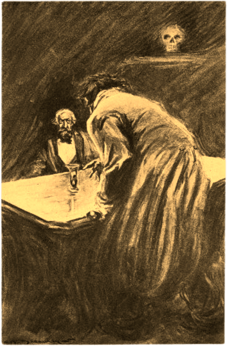

# Doctor Jekyll y Mister Hyde: Investigadores privados

«Doctor Jekyll y Mister Hyde: Investigadores privados» es un suplemento para _Fate Acelerado_ para un director de juego y dos jugadores, pero con solo un jugador en mesa al mismo tiempo. 

Tras solventar sus diferencias, el Doctor Jekyll y Mister Hyde han montado una agencia de investigación en Londres y se dedican a resolver crímenes en un Londres victoriano para el abogado y amigo del Doctor Jekyll, Gabriel John Utterson. 

Investigar casos no es fácil cuando dos personalidades tan diferentes habitan el mismo cuerpo, pero han encontrado la forma de hacerlo.

Tendrán que trabajar en los casos dejándose en un diario notas y mensajes con los avances en la investigación. De hecho la única comunicación entre jugadores sobre la partida deberían ser esas notas. 

\sp

***

# La historia de la agencia Hyde & Jekyll

Originalmente, el Extraño caso de Dr. Jekyll y Mr. Hyde acaba xxx

Sin embargo, en este suplemento me he tomado la licencia de cambiar el final escrito por el maestro Robert Louis Stevenson.

## Preludio

xxx

## El primer caso

xxx

## La creación de la agencia

xxx

***

# Las reglas

Este suplemento trae unas series de reglas extras presentadas en el manual de _Fate Acelerado_ que tienen como objetivo establecer las interacciones entre los dos personajes principales, Jekyll y Hyde.

## Dos personajes, un cuerpo

Cómo DJ, tus dos personajes van a habitar el mismo cuerpo y, por tanto, cuando Jekyll o Hyde están despiertos, su contrapartida está encerrado en lo más profundo de su mente sin saber nada de lo que pasa en el exterior. Para ello cada sesión deberás llevarla a uno solo de tus jugadores, mientras que el otro está fuera de la mesa, en su casa, viendo una peli, … en cualquier sitio menos en la partida.

### Paso de una personalidad a otra

Cuando el personaje activo se duerma o se «deje caer», su jugador abandonará la mesa, y entrará el otro jugador apareciendo la otra personalidad.

En principio el cambio se da al irse a dormir, digamos que Jekyll es el sueño de Jekyll y Hyde la pesadilla de Jekyll.

Los personajes pueden tratar de estar varios días sin dormir para no entregar el control a su otro yo. Pero cada 24 horas de privación del sueño a partir de las 24 primeras sube un nivel todas las dificultades y tiene el aspecto «muerto de sueño».

#### Dejarse caer

Un jugador puede dejar deliberadamente salir a su otro yo al final de una escena. Simplemente, cierra los ojos pone la mente en blanco y deja que entre su «alter ego».

\sp

Si desea hacerlo dentro de una escena, puede hacerlo, pero deberá gastar un punto de destino que obtendrá automáticamente el otro yo al salir.

Esto representa el hecho de que en esta forma de ceder el control el otro recién activado tiene cierta mano ancha para hacer lo que desee sin pensar en las consecuencias. 

Imaginemos que Jekyll se ha metido en una pelea de taberna en White Chapel, puede interesarle invocar a Hyde para que le saque del apuro. Al primer puñetazo que recibe en cara, se «deja caer» y, cuando vuelve la cara, ahí está la maliciosa mirada de Hyde preparado para la bronca.

Pero recuerda que muy posiblemente Hyde se despertará sin saber muy bien qué pasa y por qué le golpean, aunque eso nunca le ha preocupado mucho.

### Consecuencias

Las consecuencias y aspectos físicos como heridas y golpes pasan de un personaje a otro. Si Jekyll recibe una herida escapando de unos maleantes, cuando Hyde se despierte, se encontrará con la herida limpiada y suturada por el doctor. Si Hyde se pasa con la bebida, al caer inconsciente, Jekyll se levantará con el aspecto «borracho» o con una «resaca de mil demonios».

Las consecuencias mentales o sociales se mueven solamente entre Hyde y Jekyll, pero nunca al revés. De hecho, la complicación principal de Jekyll es su «alter ego» y las fechorías y felonías que hace Hyde mientras controla su cuerpo.

Pensemos, por ejemplo, xxx

\sp

### Cambios corporales

Realmente no hay cambios físicos entre Jekyll y Hyde. No le creen músculos o se le afilan los dientes. Su cuerpo es el mismo, pero hay sutiles cambios que los hacen diferentes, tan diferentes que muchas veces pasarán por personas distintas. Veamos algunos ejemplos:

* Hyde es mejor en peleas, no porque sea más fuerte y rápido, sino porque su lado animal le hace más agresivo y decidido y su umbral del dolor es mayor que el de Jekyll.
* Mientras que Jekyll siempre va estirado, mostrando su porte de caballero, limpio y con un traje impecable, Hyde va encorvado, con ropa y sombrero que le tape la cara y sin preocuparse mucho de su higiene personal.
* Mientras que como buen inglés Jekyll tiene una dicción perfecta y un tono de voz medio y amable, Hyde trata de compensar sus complejos con un tono de voz grave y hablando muy alto casi a gritos.

Cualquier persona tendrá que pasar una **tirada Buena (+2) para sospechar que Hyde y Jekyll son la misma persona** y que nunca se les ve juntos.

#### Haciéndote pasar por el otro

Puede ser que en determinados momentos de los casos Hyde necesite comportarse y parecerse a Jekyll y viceversa. 

Si desean hacerse pasar por su otro yo, deberán hacerlo al estilo de su «alter ego», es decir que si Hyde quiere hacerse pasar por Jekyll en un hospital deberá hacer al estilo Cauto, mientras que si Jekyll quiere dar la nota en una taberna, tendrá que ir al estilo Llamativo contra su naturaleza reservada.

En cualquier caso el director de juego, tiene la última palabra sobre el estilo a elegir.

\sp

## Compartiendo información del caso

xxx

Si en partida no hubiera tiempo para escribir el diario, la personalidad que salga a la luz no tendrá ninguna información de lo que la otra personalidad ha estado haciendo. Por ejemplo, si Mister Hyde es atrapado y encerrado en una celda sin forma de dejar un mensaje al Doctor Jekyll, cuando este se despierte se encontrará en esa celda sin saber como ni porque y tendrá que seguir a partir de lo que él mismo sabía, sin la ayuda de lo que pudo averiguar Mister Hyde.

### El diario del caso

El diario del caso es un objeto real dentro de las aventuras que normalmente irá con ellos y que puede ser usado en su contra. Un criminal podría encontrarlo al registrar a Jekyll o podrían robárselo a Hyde durante una de sus borracheras.

Si algún PNJ tiene acceso al diario alguna de las notas sueltas podrá leerlo y hacer uso de esa información para su provecho.

Si ellos lo pierden, ya no podrán acceder a su contenido y tendrán que empezar un nuevo diario, con la info que recuerden.

Podrían tratar de hacer copias de seguridad o encriptarlo, pero entonces deberían hacerlas ellos mismos como jugadores sobre sus notas.

### Otras formas de comunicarse

En este punto entra ya la creatividad de tus jugadores, quizás Jekyll se pinte la frente con carboncillo con el nombre del asesino o Hyde pague a un pilluelo una libra para que le pegue una parada la próxima vez que le vea y le grite una hora y un lugar.

\sp

Puede ser un punto divertido que se fastidien de esa manera, pero deberás controlar que no se les vaya de las manos.

## Compartiendo puntos de destino

Cuando sale una nueva personalidad a la palestra, esta recibe todos los puntos Fate de su anterior yo que tuviera por encima de su capacidad de recuperación.

Pongamos que Jekyll tiene 5 puntos Fate y una capacidad de recuperación 3. Se va a dormir para de salga Hyde, que tiene una capacidad de recuperación de 3. Eso supone que Hyde empieza con 5 puntos Fate, 3 normales por su capacidad de recuperación más 2 heredados de Jekyll.

Esto trata de reflejar que el trabajo llevado a cabo y las ventajas conseguidas por un jugador investigando permanece de cierta forma en la nueva personalidad.

## Cómo resolver conflicto entre personajes y entre jugadores

Jekyll y Hyde por la misma naturaleza de su historia van a tener conflictos. Las formas de abordar los casos deberían ser diametralmente distintas, mientras que Jekyll tiene un punto de vista científico y analítico, Hyde saldrá a la calle sacar respuestas rompiendo dientes.

Puede pasar que algún momento una acción de uno interfiera en las de otro. Tal vez hayan interrogado al mismo testigo cada uno a su estilo.

xxx

\sp

## Hitos y su uso

A la hora de mejorar los personajes son muy distintos. Jekyll, con su personalidad completa, puede gastar los hitos como desee sin ningún tipo de restricción.

Por el contrario, Hyde como solo es la parte más animal, instintiva y malvada de Jekyll no podrá gastar sus hitos como desee.

* Los estilos Cauto, Ingenioso y Furtivo no podrán ser mayores que el menor del resto de estilos (Rápido, Llamativo y Vigoroso).
* No puede crearse proezas en las que intervengan los estilos Cauto, Ingenioso y Furtivo.

\sp

***

# El Londres de 1890 y sus gentes

xxx

## El Londres victoriano

xxx

## La agencia Hyde & Jekyll

xxx

## Scotland Yard

xxx

### Técnicas de investigación disponibles

xxx

## Magia y ciencia

xxx

## Y si meto a Sherlock Holmes y al Doctor Watson

¿Y por qué no? Ambas parejas comparten época y lugar, el Londres victoriano, y todos son detectives con lo que la cooperación o el enfrentamiento es muy factible.

\sp

Pueden ser que sus agencias estén enfrentadas y se roben los clientes. Puede que luchen por aparecer en los periódicos con los asombrosos relatos de sus casos. Quizás un rico noble haya montado un concurso para ver quien es mejor detective.  

Rizando el rizo, podría darse el caso de que Holmes y Hyde tengan que infiltrarse en la guarida del asesino o que Watson y Jekyll tengan que hacer una autopsia juntos al cadáver de una víctima.

***

# Archivos de los casos

¿Y qué son unos detectives sin caso? Así que aquí hay 3 casos para que tus jugadores puedan disfrutar de sus andanzas detectivescas como Henry Jekyll y Edward Hyde.

No hay un orden concreto para jugar los casos. Puedes jugarlos como más te gusten.

## El extraño caso del tigre desaparecido del Zoo

> El pánico corre por las calles de Londres ante la noticia de que un tigre siberiano ha escapado del zoo. Sin embargo, uno de sus cuidadores fue atacado por desconocidos la noche de la desaparición del tigre. Sea como sea habrá que encontrarlo, detener a su ladrón y devolverlo al zoo.

xxx

\sp

## El extraño caso de la pala del zapador

> Joshua Croft estaba trabajando en las obras del nuevo Puente de Battersea cuando cayó un rayo en el hoyo de cimentación en el que trabajaba. Cuando sus compañeros se acercaron solo quedaba su pala. Su esposa cree que no es un accidente y Scotland Yard no le ayuda.

xxx

\sp

## El extraño caso del lingote de oro con la rosa impresa

> El viejo notario Stonewall ha aparecido muerto y lo curioso es que el arma homicida es un lingote de oro con una rosa impresa en su casa superior.

xxx

***

# Doctor Jekyll y Mister Hyde

## Doctor Henry Jekyll

xxx

Jekyll es un hombre de ciencia y como tal, su modo de investigación es puro método científico, ensayo y error y pruebas y más pruebas. xxx

* **Aspectos**
  * **Concepto principal:** xxx
  * **Complicación:** «Alter ego»
  * xxx
  * xxx
  * xxx
* **Estilos:** Cauto Grande (+3), Furtivo Bueno (+2), Ingenioso Bueno (+2), Llamativo Normal (+1), Rápido Normal (+1), Vigoroso Mediocre (+0)
* **Proezas**
  * xxx
  * xxx
  * xxx
* **Capacidad de recuperación:** 3

\sp

## Mister Edward Hyde

xxx

Edward es puro instinto animal. Los olores, los xxx

Hyde sufre de un profundo complejo de inferioridad, debido a que se considera solo una parte de Jekyll. xxx

* **Aspectos**
  * **Concepto principal:** xxx
  * **Complicación:** Complejo de inferioridad
  * xxx
  * xxx
  * xxx
* **Estilos:** Cauto Mediocre (+0), Furtivo Normal (+1), Ingenioso Normal (+1), Llamativo Bueno (+2), Rápido Bueno (+2), Vigoroso Grande (+3) 
* **Proezas**
  * xxx
  * xxx
  * xxx
* **Capacidad de recuperación:** 3

***

# Unas palabras del autor

Seguramente nadie llegue a leer este apartado, pero aquí os dejo información, ideas y consejos sobre este suplemento que os podrán ser de ayuda.

## Define los velos y herramientas de seguridad

> Antes de iniciar la aventura, todos los miembros de la mesa debéis definir las herramientas de seguridad que queráis utilizar y los temas o escenas que deben evitarse durante la partida para que nadie se sienta incómodo durante la sesión de juego. Podéis escoger los elementos que no queráis incluir durante la partida previamente o podéis utilizar un mecanismo de seguridad cuando estos aparezcan.
> No importa cuál sea la herramienta de seguridad o el tipo de mecanismo utilicéis, pero es importante recordad que el rol es un juego y todos deben pasarlo bien. En caso de que consideréis entre todos que no necesitáis una herramienta de seguridad tampoco pasa nada, pero en ese caso es necesario que el director de juego se asegure de forma más activa de que ningún miembro de la mesa se sienta incómodo o lo esté pasando mal.
> Por [FaustoRolero](https://twitter.com/FaustoRolero)

Aquí tienes algunas otras herramientas de seguridad que puedes usar: [DEVIR](https://devir.es/herramientas-seguridad-rol) y [NetCon](https://www.netconplay.com/guia-de-buenas-practicas/herramientas-en-la-mesa/)

## Participar en el proyecto

Si te gusta el proyecto, quieres participar y sabes de Git, puedes hacerlo a través de GitHub en este [proyecto](|GITHUB|). Si no estás familiarizado con Git, pues me mandas un DM en mis redes sociales [@Gwannon](https://linktr.ee/gwannon) y hablamos.

\sp

Si juegas con este suplemento y tienes ideas y posibles mejoras, también puedes enviármelas. Estaré encantado de estudiarlas y poneros como beta-testers en los créditos. 

## Gender flip

En este suplemento hemos sido muy clásicos a la hora de determinar el género y la sexualidad de los protagonistas, pero tus jugadores son libres de dejar libre su imaginación y jugar con versiones femeninas, trans, no binarias de estos personajes clásicos.

Doctore Jekyll y Miss Hyde es, por ejemplo, una versión perfectamente jugable de este suplemento. Puede tener giros y retos muy divertidos e interesantes. Por ejemplo, el tema de solucionar los cambios de vestuario cuando cambian de personalidad de masculina a femenina en plena y retrógrada época victoriana.

## Modo un solo jugador

Este suplemento no fue pensado para jugar únicamente 1 máster y 1 jugador, porque la gracia está en el control de la información y como transmitirla de un PJ a otro y, por tanto, de un jugador a otro. Pero está claro que la opción de un solo jugador es viable siempre que esté sepa suplir en su interpretación esa falta de información que puede darse entre Jekyll y Hyde al investigar casos.

## Atribuciones

No soy propietario de ninguna de las imágenes de este documento. Estoy usando imágenes con licencia CC y atribuyéndola a su propietario o de dominio público. Si hay algún error en la atribución, hacédmelo saber para corregirlo.

\sp

* Hojas interiores por [aopsan](https://www.freepik.com/free-photo/old-paper-texture-background_1273381.htm)
* Textura de portada y contraportada de [archive.org](https://archive.org/details/lostworldbeingac00doylrich/page/n343/mode/1up)
* Registro de préstamos de [allthatsinteresting.com](https://allthatsinteresting.com/worcester-massachusetts-overdue-library-book)
* Lupa portada por [juicy_fish](https://www.freepik.com/free-vector/magnifying-glasses-outline-style_255854102.htm)
* Grabados interiores por [Charles Raymond Macauley](https://archive.org/details/strangecaseofdr00stevuoft/strangecaseofdr00stevuoft/page/38/mode/2up)

## Otros proyectos que te pueden interesar

Si os ha gustado este suplemento podéis probar otros de mis proyectos para Fate. Animaros y dadles un poco de cariño.

[**Guía de Cazavampiros para niñas molonas**](https://cazavampiros.gwannon.com/pdf/) 

El juego de rol para FATE Acelerado donde aprenderás a cazar vampiros con tu panda del barrio y podrás acabar con la trama vampírica que domina tu ciudad.

\sp

&nbsp;

***

&nbsp;

***

«Doctor Jekyll y Mister Hyde: Investigadores privados» es un suplemento para _Fate Acelerado_ para jugar 1 director de juego y 2 jugadores, pero no al mismo tiempo, ya que interpretarán al Doctor Jekyll y Mister Hyde mientras resuelven crímenes en un Londres Victoriano.

Contiene reglas para jugar con el Doctor Jekyll y Mister Hyde y su extraña relación. Incluye también 3 casos listos para jugarse.

Solo necesitas _Fate Acelerado_ para jugar con este suplemento.

Creado por [Gwannon](https://linktr.ee/gwannon)