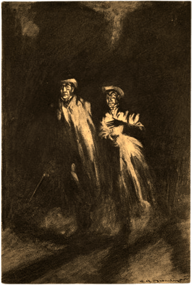

# Los extraños casos de Hyde & Jekyll

¿Y qué son unos detectives sin caso? Así que aquí hay 3 casos para que tus jugadores puedan disfrutar de sus andanzas detectivescas como Henry Jekyll y Edward Hyde.

No hay un orden concreto para jugar los casos. Puedes jugarlos como más te gusten.

## El extraño caso del tigre desaparecido del Zoo

> El pánico corre por las calles de Londres ante la noticia de que un tigre siberiano ha escapado del zoo. Sin embargo, uno de sus cuidadores fue atacado por desconocidos la noche de la desaparición del tigre. Sea como sea, habrá que encontrarlo, detener a su ladrón y devolverlo al zoo.

### Resumen del caso

XXX

### Introducción al caso

XXX

### La escena del crimen

XXX

\sp

### Pistas a seguir

XXX

\sp

## El extraño caso de la pala del zapador

> Joshua Croft estaba trabajando en las obras del nuevo Puente de Battersea cuando cayó un rayo en el hoyo de cimentación en el que trabajaba. Cuando sus compañeros se acercaron solo quedaba su pala. Su esposa cree que no es un accidente y Scotland Yard no le ayuda.

### Resumen del caso

XXX

### Introducción al caso

XXX

### La escena del crimen

XXX

\sp

### Pistas a seguir

XXX

* Si consiguen acceso a la pala y pueden estudiarla (tirada Buena +2) verán que pesa un poco más que otras palas del mismo fabricante. Eso es debido a que el interior del palo está relleno de una barra de metal conectada a la parte metálica de la pala. Lo que podría convertirla en un minipararrayos.

XXX

\sp

## El extraño caso del lingote de oro con la rosa impresa

> El viejo notario Stonewall ha aparecido muerto y lo curioso es que el arma homicida es un lingote de oro con una rosa impresa en su casa superior.

### Resumen del caso

XXX

### Introducción al caso

XXX

### La escena del crimen

XXX

El lingote no se lo puede llevar, aunque Hyde seguramente lo intenté, pero siendo rápidos (xxx) y con papel cebolla y carboncillo pueden obtener una copia muy buena sin que Newcomen o algún policía les vea.

\sp

### Pistas a seguir

XXX

Primeras pistas a seguir:

* Una mañana de bancos y joyerías preguntando por el diseño de la rosa no tendrá ningún éxito, nadie reconoce la marca.
* El Museo Británico u otra institución del conocimiento puede ser una mejor opción para saber de donde proviene ese lingote. Según uno de los profesores, ese símbolo pertenecería a los lingotes de oro que formaban parte de la dote de la princesa Jariba de la India.

XXX

\sp

***