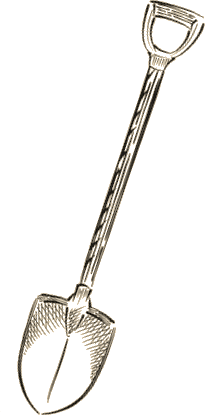

## El extraño caso de las palas del zapador

>  Joshua Croft estaba trabajando en las obras del nuevo Puente de Battersea cuando cayó un rayo en el hoyo de cimentación en el que trabajaba. Cuando sus compañeros se acercaron solo quedaba las palas con las que trabajaba y un montón de cenizas humeantes. Scotland Yard da por cerrado el caso, pero la compañía Stanley & Hickson Insurances que asegura la obra no está del todo de acuerdo con pagar a la viuda una prima por la muerte de su marido.

### Resumen del caso

Joshua Croft es un simple zapador de obra que abre zanjas y cava hoyos en las obras. Pero por las noches en el pequeño sótano de su casa se dedica a estudiar física y química tratando de sacar a su familia de la miseria. Gracias a su genio o su suerte ha descubierto una aleación de metales que desvía o atrae la electricidad según los porcentajes de metales. Si consigue patentar su descubrimiento podría darle a su familia la vida que se merece.

Su problema es que patentar su idea es muy caro y todo el mundo al que ha acudido se ha reído en su cara y no le han prestado el dinero. Ninguno cree que un simple zapador puede haber hecho el descubrimiento que dice que ha hecho.

Joshua se ha visto forzado a estafar al seguro de su actual trabajo, las obras del puente de Battersea, haciéndoles creer que está muerto para que su mujer pueda cobrar una pequeña prima y patentar su invento. Con el dinero que saquen de vender su invento, marcharán a Australia buscando una vida mejor.

\sp

Para cobrar la prima debe haber un cadáver, el suyo en concreto, y como no puede conseguirlo, su muerte debe ser inequívoca y a la vista de todos. Así que mientras trabaja en su hoyo una tarde tormenta con fuerte aparato eléctrico hace caer un rayo al lado suyo con una de sus palas y se protege con la otra repeliéndolo. Deja un montón de cenizas humeantes en su lugar y se escapa mientras la gente se recupera de la explosión y el shock producido por el impacto del rayo.

### Introducción al caso

XXX

### La escena del crimen

XXX

**Si buscan huellas de pisadas**, está todo el barro lleno de pisadas de los compañeros de trabajo que bajaron a ver que había pasado con Joshua. Es imposible sacar alguna información.

**El testimonio de los testigos** es muy parecido. El charlatán Tony Wilson, compañero de tajo, vio a Joshua bajar a su hoyo a cavar cuando de repente cayó un rayo. Cuando se recuperaron del impacto del rayo se acercaron al hoyo y solo había unas cenizas humeantes.

### Pistas a seguir

XXX

**Si consiguen acceso a las palas y pueden estudiarlas** (tirada Buena +2) verán que pesas un poco más que otras palas del mismo fabricante. Eso es debido a que el interior del palo está relleno de una barra de metal conectada a la parte metálica de la pala.

\sp

Si analizan la aleación del metal, es rara pero con metales normales. Parece tener propiedades magnéticas. Si lo llevan a un laboratorio, podrán descubrir que una pala atrae los arcos voltaicos y la otra los repele. Con lo que saben, las palas podría convertirse en un es minipararrayos.

**Preguntando a los compañeros** de Joshua es raro llevar dos palas iguales al mismo sitio. Es más práctico llevar una pala y un pico o palas de distintos tamaños para distintos trabajos.

**Si vistan la casa de Joshua,** no verán nada más que es una humilde casucha en un barrio pobre. La viuda, Trinity Croft, llora desconsolada la perdida y maldice a los investigadores porque el seguro le quiere quitar el poco dinero que van a recibir de esta desgracia.

Trinity no miente, ya que no sabe nada del plan de su marido y realmente cree que ha sido calcinado por un rayo.

Si bajan al sótano, lo encontrarán vacío, pero está claro que hace pocos días había muchas cosas en ese sótano. ¿Por qué está ahora vacío? ¿Por qué saco sus cosas Croft y dónde están?

**¿Hay un testamento?** Más o menos. Joshua dejó unas notas a su mujer con como patentar su invento usando el dinero de la prima del seguro y los esquemas de fabricación. Y que cumpliera con el sueño de la pareja ir a Australia y comprar una granja.

Joshua le dijo que nadie debería ver esos papeles bajo ninguna circunstancia, pero la esposa se encuentra sola y desamparada y aunque quiera seguir las órdenes de su marido se la puede llegar a convencer de que muestre la ultimas voluntades de Joshua.

**Consultar con un experto en electricidad y tormentas** debería dejar claro que no es normal que un rayo caiga en un agujero, siempre va al punto más alto de la zona. Algo debería atraerlo poderosamente para que eso ocurriera.

\sp

XXX

### Como buscar a un muerto

En el momento que descubran que la muerte es una estafa al seguro, tendrán que dar el siguiente paso, encontrar a Joshua Croft vivito y coleando para poder demostrar sus teorías

XXX

### El combate final

La tormenta eléctrica está en todo su apogeo y los rayos caen por todas partes. Estáis un barrizal resbaladizo y con grandes charcos. Cuesta moverse con rapidez y agilidad.

XXX

Joshua no piensa ir a la cárcel, su hermano murió de cólera en una de ellas y prefiere morir aquí y ahora que agonizar durante años en una sucia celda. Así que tratar de convencerle de que se rinda es casi imposible, a no ser que se le ofrezca un trato que le permita a su mujer y su hija vivir dignamente.

También pueden dejarle escapar, solo ha engañado a un seguro que gana miles de soberanos al año. Que una aseguradora pierda el dinero de una pequeña prima para que una familia que no ha hecho mal a nadie pueda empezar una nueva vida en Australia, tampoco es tan malo.

El único problema que tiene está opción es que no cobrarás este trabajo y seguramente Stanley & Hickson Insurances no vuelva a requerir tus servicios.

\sp

Tanto si es derrotado como si termina rindiéndose, Joshua será condenado a 12 años de cárcel y un comprador anónimo se quedará con los derechos de explotación del invento, dando a señora Croft una suma de dinero que le genera una buena pensión todos los meses.

#### Joshua Croft

Joshua puede usar su pala para controlar los rayos y que parte de las descargas del rayo impacten en Jekyll o Hyde.

* **Aspectos**
  * **Concepto principal:** XXX
  * **Complicación:** Desesperado
  * XXX
  * XXX
  * XXX
* **Estilos:** Cauto (X), Furtivo (X), Ingenioso (X), Llamativo (X), Rápido (X), Vigoroso (X)
* **Proezas**
  * XXX
  * XXX
  * XXX
* **Capacidad de recuperación:** 3
* **Estrés:** 1 | 2 | 3
* **Consecuencias:** Leve 2 | Moderado 4 | Grave 6

### Unas semanas más tarde

Unas semanas más tarde, recibirán un soplo de un contacto en Scotland Yard, *las palas han sido robadas* del almacén de pruebas. Lo curioso es que nadie parece usar la tecnología de Croft, así que el comprador anónimo se la está guardando para él y, por desgracia, las únicas muestras existentes de la aleación, las palas, han desaparecido.

Quizás tus jugadores tengan alguna muestra en su despacho …