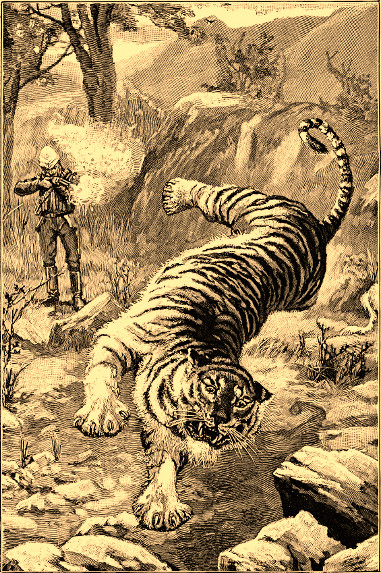

## El extraño caso de la tigresa desaparecida del Zoo

> El pánico corre por las calles de Londres ante la noticia de que una tigresa bengalí ha escapado del zoo. Sin embargo, uno de sus cuidadores fue atacado por desconocidos la noche de la desaparición de la tigresa. Sea como sea, habrá que encontrarla, detener a su ladrón y devolverla al zoo.

### Resumen del caso

Kim ha recorrido miles y miles de kilómetros desde su Bengala natal para liberar a su amiga Ehbri Khan, una tigresa de Bengala, que está encerrada en el zoo de Londres. Ehbri Khan y Kim se conocieron de crías (de tigre y de humano) en las selvas de Bangladés y se hicieron compañeras de juego inseparables, hasta que hace unos años Ehbri Khan fue captura por un rico cazador londinense, Sir Roger Corbyn, que la trajo a Londres y la dono al zoo.

Kim no sabía que había sido de su compañera, hasta que trabajando de sirvienta para un rico terrateniente inglés descubrió en un viejo ejemplar «The National Geographic» que Ehbri Khan (o como la habían rebautizado en el zoo, Victoria, en honor a la reina) estaba viva y encerrada en un horrible zoo en el lejano Londres. 

\sp

Tras conseguir un pasaje y pasar meses trabajando en casi esclavitud en un barco inglés, Kim llegó a Londres y sin pensárselo se coló en el zoo y sacó a Ehbri de su cárcel tras dejar sin sentido a uno de los cuidadores.

Ahora mismo están refugiados en el interior del bosquecillo de Regent’s Park esperando el momento de poder escapar de Londres.

### Introducción al caso

Como abogado y amigo y benefactor del zoo de Londres, Gabriel Utterson es avisado de la fuga del tigre y este a su vez pide a sus amigos Jekyll y Hyde que ayuden al zoo a encontrar a la tigresa escapada.

Cuando lleguen a la zona de los grandes felinos se encontrarán al inspector Newcomen metido dentro de la jaula de la tigresa revisando los barrotes junto a un cartel que pone «No dar de comer a los animales». Que tus jugadores hagan el chiste es cosa suya.

La jaula en un habitáculo de 20x20 metros cuadrados con barrotes en 3 de sus lados y ladrillos con una puerta reforzada cerrada por fuera con un resistente pestillo. No hay cerradura, la puerta da una parte a la que los visitantes no tienen acceso de normal y por seguridad prefieren poder entrar y salir sin necesidad de usar una llave.

Cómo siempre Newcomen les dirá que no pueden estar allí y que solo estorban. Lo tiene todo controlado y están buscando a un experto para que atrape a Victoria, la tigresa.

Según el inspector, el ataque al cuidador y la fuga de la tigresa son pura coincidencia. La tigresa definitivamente se ha escapado.

Robar un animal depredador como ese supone un golpe muy complejo con redes, sedantes, un vehículo de transporte y mucho ruido y no hay pruebas de nada de eso.

\sp

No les quitará los ojos de encima mientras empiezan a investigar, pero enseguida se llenará de gacetilleros haciendo preguntas. Newcomen y podrán moverse más tranquilamente.

#### Inspector Newcomen

Newcomen está muy interesado en este caso, puede darle un poco de fama y ayudarle en su carrera. Sabe que el caso va a ir directo a las portadas de los periódicos sensacionalistas y su nombre aparecerá como junto a palabras como «héroe» o «protector». Además, está encantado de sacar el gran cazador que tiene dentro y poder disparar a ese gran felino.

* **Aspectos**
  * **Concepto principal:** Inspector de Scotland Yard
  * **Complicación:** Obsesionado con Hyde
  * Muchos años pateando las calles
  * Duro como un clavo en un ataúd
  * Acostumbrado a las vigilancias
* **Estilos:** Cauto Mediocre (+0), Furtivo Bueno (+2), Ingenioso Normal (+1), Llamativo Normal (+1), Rápido Bueno (+2), Vigoroso Grande (+3)
* **Proezas**
  * **Lenguaje legal:** Debido a que conoce muchos términos y precedentes legales, gana un +2 para Crear una ventaja de modo Rápido cuando conversa con sospechosos, abogados, jueces y otras gentes del sistema policial y penal.
  * **Voz intimidatoria:** Debido a su tono de voz intimidante, gana un +2 para Atacar de modo Llamativo, cuando interroga a delincuentes y criminales.
  * **Juegos de manos:** Debido a que le encantan los trucos de magia y los juegos de manos, gana un +2 a superar de modo Rápido, cuando trata de escamotear algún objeto pequeño.
* **Capacidad de recuperación:** 3
* **Estrés:** 1 | 2 | 3
* **Consecuencias:** Leve 2 | Moderado 4 | Grave 6

\sp

### La escena del crimen

Realmente no hay nada que buscar en la jaula, Kim abrió la puerta, Ehbri se despertó y al oler a su amiga se lanzó a lamerle la cara y tras unos segundos se fueron. Saltaron la verja del zoo y fueron corriendo. De casualidad encontraron el bosquecillo de Regent’s Park y ahí se establecieron.

No hay ni una pista que seguir en la jaula. Kim no tiene nada, así que no ha dejado nada olvidado. El acceso a la jaula era de baldosas con lo que no dejó pisadas.

### Pistas a seguir

Tras revisar la escena del crimen empieza la labor detectivesca que puede hacerles ir a tus jugadores desde el Museo Británico al matadero municipal.

**Si buscan pisadas** con una tirada Normal (+1) encontrarán las de Ehbri que van hasta el lugar donde saltaron la valla del zoo para perderse en las adoquinadas calles aledañas. Hay cientos de pisadas de los visitantes, así que las de una niña como Kim no se destacan. Además, cuando están juntas, Kim va montada en la grupa de Ehbri.

**Si visitan el lugar donde fue atacado el celador del zoo** encontrarán sin problema el sitio donde aterrizó el «mono». Las huellas son de algo o alguien pequeño y con una tirada Buena (+2) tendrán bastante claro que son humanas. Lo curioso es que son pies humanos descalzos (Kim se quitó los zapatos para trepar mejor al árbol).

En el árbol desde que debió saltar había ramas rotas, así que debió subirse allí y estar un rato hasta atacar al vigilante.

Si vuelven a buscar pisadas (tirada Buena +2), esta vez fijándose en las de un niño descalzo les llevará hasta la jaula de Victoria. 

\sp

Si deciden confirmarlo, no falta ningún mono del zoo y no hay constancia de que alguno se escape de su jaula y haga travesuras por las noches.

**La historia de Victoria la tigresa** es de sobra conocida y cualquier persona del zoo o un poco de trabajo en los archivos del zoo les contará la historia de como la cazó Sir Corbyn y se la regaló a la reina Victoria que la dono al zoo.

**Si quieren hablar con Bob, el cuidador del zoo agredido** está descansando en su casa del golpe. No podrá decirles mucho, estaba de ronda nocturna, no muy lejos de las jaulas de los felinos, cuando una figura más bajita que él saltó como un mono enfrente de él y le dejó inconsciente golpeándole con un palo.

Según Bob, ha habido veces en que los bribones han entrado en el zoo por la noche a robar, pero nunca habían agredido deliberadamente a un cuidador.

**Alimentar a un tigre de Bengala no es sencillo** y si consultan a algún experto en zoología les dirá que puede comer entre 20 y 40 kilos de carne fresca al día, en cautividad con unos 8 kilos podría subsistir. 

Si buscan en los mercados de abastos y carnicerías de la ciudad, no encontrarán nada. No es un consumo de carne tan grande como para que fuera significativo. Cualquier restaurante cutre compra al día esa cantidad de carne.

Pueden montar un **mapa de Londres y marcar los sitios donde se escondería un tigre**. Pero encontrarán montones de parques, incluso puedes haber salido ya de la ciudad. Aun así, cuando empiecen los ataques de la tigresa, puede serles útil para poner sus localizaciones y los lugares de los ataques.

\sp

\sp

### Los primeros ataques

Kim necesita dinero para poder alimentar a Ehbri y volver a Bengala, así que no les queda más remedio que empezar a dar golpes nocturnos. Mientras que Ehbri los asusta hasta que se desmayan o los deja inconscientes de un par de golpes, Kim les roba la cartera y los objetos de valor. Harán un ataque al día y volverán con el botín al bosque. Al día siguiente, Kim buscará vender lo que pueda y comprar comida para Ehbri.

Scotland Yard sigue con sus teorías de la fuga porque aunque falten dinero y joyas, es algo normal que la gente saquee a las víctimas antes de llamar a la policía.

Kim y Ehbri no pueden alejarse mucho del bosquecillo de Regent’s Park por miedo a ser visto, así que los asaltos se concentrarán en esa zona de Londres. Cualquiera con un poco de cabeza verá que el epicentro de todo es Regent’s Park, pero por lo menos necesitaran 5 asaltos para fijar adecuadamente la zona. Quizás 4 días si hicieron trabajo de mapear los lugares donde podía esconderse un tigre en Londres.

Si ahora buscan carnicerías de la zona, descubrirán que una niña india está comprando en las carnicerías peores y más baratas toda la carne que puede, incluso ternera que se supone sagrada para ella.

#### Ehbri Khan

Ehbri es una esbelta y poderosa tigresa de bengala nacida en libertad. Desde que era una cachorra conoce a su amiga humana Kim, por la que haría lo que fuera. Fue capturada por Sir Corbyn y enviada al zoo de Londres. Estar separada de Kim la sumió en una terrible tristeza, pero cuando vio a Kim abrir la puerta de su celda y ayudarla a escapar de su prisión, se prometió que nunca la alejarían de nuevo de su salvadora. 

\sp

* **Aspectos**
  * **Concepto principal:** Temible tigresa de Bengala
  * **Complicación:** Hambrienta y asustada
  * Amigas para siempre (Kim)
  * Buena vista y olfato
  * Acechadora
* **Estilos:** Cauto Normal (+1), Furtivo Grande (+3), Ingenioso Mediocre (+0), Llamativo Normal (+1), Rápido Grande (+3), Vigoroso Enorme (+4) 
* **Proezas**
  * **Rugido aterrador:** Debido a su rugido aterrador, gana un +2 a Atacar de forma Vigorosa, cuando se enfrenta a un solo atacante.
  * **Huida a la desesperada:** Debido a su fuerza y agilidad, una vez por partida puede huir corriendo, saltando por los tejados o perdiéndose entre callejones con Kim a la grupa sin que se le pueda seguir corriendo detrás de ella. 
  * **Entender a los humanos:** Debido a que ha pasado mucho tiempo entre humanos, empieza entender su lenguaje y sus gestos y gana un +2 para Defenderse de modo Rápido cuando quieren tenderla una trampa.
* **Capacidad de recuperación:** 3
* **Estrés:** 1 | 2 | 3
* **Consecuencias:** Leve 2 | Moderado 4 | Grave 6

#### Kim

Kim conoce a Ehbri desde que tenía 6 años y se perdió en la selva que rodeaba su casa. Se encontró con una cachorra de tigre huérfana a la que cuidó y alimento como pudo. 

Pasar tanto tiempo en el bosque con Ehbri hizo de ella fuera un poco salvaje, de hecho es una gran escaladora y ágil como un mono. También ha aprendido a hablar con su amiga tigresa y se compenetran perfectamente.

\sp

Cuando Ehbri desapareció, Kim sufrió muchísimo y cuando descubrió que seguía viva en Londres, supo que tenía que ir a buscarla, liberarla y volver juntas a Bengala.

* **Aspectos**
  * **Concepto principal:** Aventurera sin miedo
  * **Complicación:** Niña extranjera en Londres
  * Amigas para siempre (Ehbri Khan)
  * Ágil como un mono
  * Valiente como un tigre
* **Estilos:** Cauto Normal (+1), Furtivo Grande (+3), Ingenioso Bueno (+2), Llamativo Normal (+1), Rápido Bueno (+2), Vigoroso Mediocre (+0)
* **Proezas**
  * **Ataque sorpresa:** Debido a su agilidad y sigilo, una vez por partida puede deshacerse de un matón directamente tendiéndole algún tipo de trampa.
  * **Vida en el bosque:** Debido a haber crecido en el bosque, gana un +2 para Crear una ventaja de modo Cauto cuando está en bosque, selva o similar.
  * **Entender a los felinos:** Puede comunicarse con felinos como si fueran PNJ humanos, ten en cuenta que la comprensión del mundo del felino es limitada.
* **Capacidad de recuperación:** 3
* **Estrés:** 1 | 2 | 3
* **Consecuencias:** Leve 2 | Moderado 4 | Grave 6

### Entra Sir Corbyn

La cosa se complica cuando Sir Corbyn llega de su retiro en la campiña escocesa para que de caza y mate a Ehbri a petición del inspector Newcomen. Si quieres hacerlo más ridículo, diles que lleva unos meses en el lago Ness buscando un monstruo marino.

Sir Corbyn montará un equipo de caza con los peores policías de a pie de Scotland Yard y empezará a patearse las calles.

\sp

Igual que Kim y Ehbri se siente fuera de lugar, pero a diferencia de ellas no está asustado. Está disfrutando cada segundo de esta nueva caza y de cómo va a fardar en su club de caballeros de ser el cazador que dio muerte al tigre devorado-hombres de Londres.

Ya se ve recibiendo una medalla de la reina y como esta manda disecar a la tigresa y la pone en la sala de audiencias al lado de su trono.

No puede seguir muchos rastros en el duro adoquín, ni llevar un elefante por las calles de Londres desde el que disparar a su presa, pero ha empezado a estudiar los lugares de los ataques y a triangularlos para acotar su zona de caza. Además, ha montado un puesto de caza móvil encima de un carruaje para detenidos de la policía a semejanza de los elefantes que usan en la India para cazar tigres.

No hemos de olvidar que cuenta con su salsa secreta, un adobo secreto que aprendió en Kenia para echar a la carne fresca. La hace irresistible para los felinos que además pueden olerla desde grandes distancias.

Si van de safari urbano con Sir Corbyn verán que empapa siempre la carne de las trampas con un líquido verdoso que echa de una petaca. Y si le preguntan les dirá que son secretos de los grandes cazadores.

#### Sir Roger Corbyn

Sir Corbyn vive por y para la caza y como ella es cruel y sanguinaria. Mientras que otros cazadores puede tener un mínimo de respeto por sus presas. Sir Corbyn se ríe de ellas y las desprecia desde su puesto elevado y camuflado cuando ve su cadáver abatido por sus disparos a través de su mira telescópica.

\sp

Este viejo cazador está deseoso de acabar con Ehbri, a la que tuvo que atrapar viva y no tuvo el gusto de matar. Pero esta vez no escapará de su rifle de cazar elefantes y acabará decorando alguna sala del palacio de Buckingham.

* **Aspectos**
  * **Concepto principal:** Gran cazador blanco
  * **Complicación:** Cruel y sanguinario
  * Mi fusil de cazar elefantes
  * Puedes huir, pero te encontraré 
  * Modales suaves
* **Estilos:** Cauto Normal (+1), Furtivo Bueno (+3), Ingenioso Normal(+1), Llamativo Bueno (+3), Rápido Bueno (+3), Vigoroso Bueno (+3)
* **Proezas**
  * **Francotirador:** Debido a su experiencia como cazador, gana un +2 para Atacar en modo Furtivo cuando dispara desde una localización oculta.
  * **Trampero:** Debido a su experiencia cazando grandes bestias, gana un +2 para Crear ventaja en modo Furtivo cuando monta trampas.
  * **Historias de caza:** Debido a sus años contando historias de caza falsas, gana un +2 para Superar en modo Llamativo cuando tiene que mentir.
* **Capacidad de recuperación:** 3
* **Estrés:** 1 | 2 | 3
* **Consecuencias:** Leve 2 | Moderado 4 | Grave 6

**Ayudantes de Sir Corbyn:** Sir Corbyn va acompañado de 4 policías de Scotland Yard que le ayudan a cazar a Victoria.

* Escoria de la policía
* **Buenos en (+2):** Peleas, Extorsionar a la gente
* **Malos en (-2):** Hacer trabajo policial, Leyes
* **Estrés:** ninguno (el primer ataque que le alcance le elimina).

\sp

### Cacería en Regent’s Park

Si han conseguido adelantarse a Sir Corbyn en encontrar la ubicación de la guarida de Ehbri y Kim, puede empezar a peinar Regent’s Park o pueden tratar de pillar a Kim cuando vaya a buscar comida y llevársela a Ehbri. También pueden esperar a que salgan a robar a la noche y seguirle cuando entren o salgan. 

Ponerse a buscarlos por los bosques de Regent’s Park sin conocimientos de rastreo es bastante difícil y tienen el problema de que estarían en desventaja con Ehbri que sabe moverse entre los árboles y los matorrales.

\sp

Si encuentran a Kim, tendrán que convencerla de que son buenas personas y quieren ayudarlas (sea o no verdad). Esta les conducirá a Ehbri y la tranquilizará y les dirá que no son enemigos.

Si se encuentran con Ehbri, esta se lanzará al ataque y tras un par de rondas aparecerá Kim para negociar. Deberán convencer a Kim y a Ehbri que puede entenderles un poco de que no quieren hacerles daño. Si fallan, atacarán hasta derrotarlos o huirán para desaparecer para siempre o durante mucho tiempo (las secuelas son buenas semillas de aventuras).

Cuando se pongan a planear sus siguientes pasos, llegarán ruidos de fuera de la arboleda. Algo está pasando en el parque, sir Corbyn está preparándose para su cacería.

Si no consiguen adelantarse a Sir Corbyn enseguida verán todo el espectáculo y tendrán que colarse dentro del parque escalando las verjas y esquivando a los policías y soldados y juntarse con Sir Corbyn o intentar infiltrarse en el bosquecillo que está sitiando ahora mismo Sir Corbyn.

#### Sir Corbyn saca su rifle

Al cabo de 5 días con sus 5 ataques (o antes si tus jugadores descubren la ubicación de la tigresa), Sir Corbyn tendrá claro que su presa está en Regent’s Park. Así que allí irá montando un dispositivo de caza gigantesco. Todas las puertas del parque serán cerradas, se vaciará de viandantes y policías y soldados con rifles estarán vigilando que nada escape del parque.

Ha hecho montar una jaula para retener al tigre cuando sea atrapado y ha montado su puesto de caza encima, pero es pura fachada, quiere matar a su pieza, nada de capturarlo vivo. La jaula está situada casi al borde de la arboleda donde se refugian Ehbri y Kim.

\sp

Las calles adyacentes estarán llenas de mirones atraídos por el morbo y la curiosidad y la verdad que sir Corbyn está disfrutando de actuar frente a tan selecto público.

#### Empieza la cacería

Sir Corbyn ha dejado dentro de la jaula un buen pedazo de carne fresca con su salsa especial. Eso volverá loco a Ehbri que en cuanto lo huela saldrá corriendo hacia la trampa.  Es complicado parar a la tigresa, pero no imposible.

Cuando Ehbri empiece a devorar la carne, Sir Corbyn bajará y sacará su cuchillo de caza para matar con sus propias manos a la tigresa. Quiere lucirse delante de la gente que acercándose.

La carne está drogada y no deja a Ehbri durmiendo, pero muy tocada (Consecuencia leve Drogada). Kim cuando vea eso saldrá hacia la jaula para ayudar a su amiga y entrará en la jaula por los pelos porque Sir Corbyn ha activado el cierre de la jaula para chulearse de luchar contra un tigre en una jaula.

Con una tirada Buena (+2) los jugadores entrarán en la jaula por los pelos y ayudar a Kim y Ehbri en la pelea. Pueden intentar si son fuertes evitar que la trampa no llegue a cerrarse con una tirada Grande (+3).

Desde fuera, muy poco se puede hacer, pero si son creativos, igual pueden entrar dentro o ayudar a una de las partes.

En la impensable, pero posible, situación que tus jugadores estén ayudando a Sir Corbyn, les dirán que se queden fuera. No quiere que nadie le robe la fama. Pueden intentar que Kim entre en la jaula, pero poco podrán hacer después, desde fuera de la jaula. Ehbri y Kim se pondrán a pelear a muerte con Sir Corbyn dentro.

\sp

### El indulto real

Al empezar el tiroteo, los mirones y curiosos han derribado una parte de la verja y están entrando en masa al parque. Y acercándose a donde está la acción. Poco a poco la gente empezará a rodear la jaula para ver el espectáculo, jaleando a unos u otros.  

Cuando veas oportuno se abrirá un pasillo entre el público y unos soldados de la guardia de honor real dejarán pasar a la propia reina Victoria que su ropa de montar. Debía estar haciendo su paseo a caballo diario y al ver el gentío ha querido ver que pasaba. 

Ante su presencia, tus jugadores, Sir Corbyn (que hinca rodilla), Kim y Ehbri se detendrán y esperarán callados a que hable la reina.

> Me entristece ver este terrible espectáculo en el corazón de mi reino, ¡cuán bajo han caído mis súbditos! Siempre he pensado que hay un placer mayor que matar, que es dejar vivir, así al ver aquí a mis súbditos luchando hasta la muerte prefiero que vivan y es, por tanto, mi deseo y mi derecho como reina que todos mis súbditos tanto humanos como tigres dejen de pelear y de matarse entre ellos. 

\sp

Acto seguido, se da la vuelta y se va por donde ha venido. Mientras, un par de guardias se llevarán a Sir Corbyn y los otros tratarán de hablar con los jugadores y les ofrecerán las caballerizas reales para que Kim y Ehbri vivan unos días allí mientras preparan las cosas para trasladarlos a Bengala.

Como consecuencia de todo esto, no solo Ehbri, sino todos los tigres y tigresas de todos los zoos y circos de Inglaterra y sus colonias son declarados súbditos de la reina y si no han cometido delitos, deberán de ser devueltos a su lugar de origen. Además, como ciudadanos no podrán ser cazados en ninguna parte, solo detenidos y ajusticiados en caso de matar a seres humanos.

### Unas semanas más tarde

Una semana más tarde del fin del indulto de la reina, un bienhechor anónimo ha fletado un barco exclusivamente para el viaje de regreso a Bengala para Kim y Ehbri. Ha contratado a un especialista en lenguaje y a un zoólogo para que les acompañen y documenten durante el viaje todo lo que puedan sobre la capacidad de comunicarse que tienen las dos amigas.

Según «The National Geographic» esos estudios podrían ser la base de un futuro lenguaje universal hablado por hombres y bestias.

Si los jugadores se interesan por el estudio, nunca llego a publicarse. Los estudiosos que lo hicieron lo entregaron por Correo y nunca supo nada.
