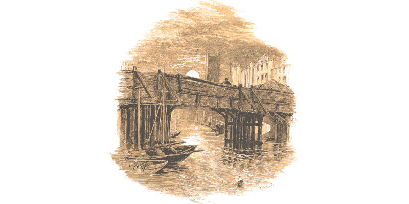

# Doctor Jekyll y Mister Hyde: Más extraños casos

> Los extraños casos de los que hablan prensa amarilla de Londres han convertido a Jekyll y Hyde en la sensación de la temporada y todos los días aparece gente por su oficina buscando su ayuda para resolver algún asesinato, encontrar un objeto familiar robado o perdido, hallar a una persona desaparecida, … y Jekyll y Hyde nunca se niegan a intentar resolverlos.

Jekyll y Hyde siguen investigando casos aún más extraños y tendrán que enfrentarse a gente con doble personalidad como ellos, avariciosos especuladores de terrenos y violentos falsificadores de los bajos fondos. En sus aventuras se moverán desde las altas instancias sociales teniendo que asistir a fastuosos bailes de sociedad a visitar los antros más peligrosos de Londres de donde tendrán que escapar como puedan.

No hay un orden concreto para jugar estos 3 nuevos casos. Puedes jugarlos en el orden que prefieras, pero quizás debieras primero jugar las aventuras del libro básico para que tus personajes puedan enfrentarse a los nuevos retos que suponen todos estos nuevos misterios.

***

|MasExtranosCasosDeJekyllYHydeUno.md|

\sp

|MasExtranosCasosDeJekyllYHydeDos.md|

\sp

|MasExtranosCasosDeJekyllYHydeTres.md|

\sp

# ¿Cómo puedes continuar?

Todas estas aventuras pueden continuarse de formas bastante interesantes para tu mesa con un poco de trabajo.

En el suplemento básico todos los casos tenían un apartado de unas «semanas más tarde» en el que de alguna manera el elemento extraño del caso desaparecía o quedaba en manos de un misterioso personaje. Esto permitía que hubiera algún tipo de villano que intentará dar un golpe criminal con toda esas tecnologías robadas.

En estas tres aventuras lo que puede servirte de semilla de aventuras son sus PNJ. Estos permitirán un amplio abanico de posibilidades, desde ser un interés romántico hasta buscar vengarse de los personajes. 

Las posibilidades románticas que tiene otro personaje con personalidad desdoblada pueden ser muy interesantes. Si quieres explorar esta posibilidad, deberás adaptar las preferencias sexo-afectivas y el género de Lisa Doosmall a tu mesa. Recuerda que ya hablamos de que habíamos sido muy clásicos en la orientación sexual de Jekyll y Hyde, pero que podía ser muy interesante un «gender flip» a la hora de jugar,

Alexia, la bruja del Tyburn, es una fuente de misterios perdidos en el tiempo. Puede contar historias de tiempos antiguos que se han trasmitido por tradición oral en su familia durante siglos y embarcar a tu mesa en aventuras en busca de tesoros perdidos.

Quizás puedan encontrar una tumba de algún general romano o de un caudillo britano, a quizás Alexia sea descendiente de druidas y les ayude a encontrar algún objeto «mágico» de tiempos artúricos oculto en alguna ciudad cercana a Londres como Bath u Oxford.

\sp

Walt «Tinta China» Sherwood es un personaje bastante rencoroso y muy hábil esquivando a la justicia. Así que, si al final del caso de la tipografía robado consigue escapar de la policía, pasará un tiempo en Francia lamiéndose las heridas y seguramente pensando como devolvérsela a Hyde y Jekyll. Si es apresado, no estará mucho tiempo en la cárcel y cuando salga lo hará más enfadado de lo normal. 

Con sus dotes de falsificador puede hacer cualquier tipo de documento y tenderles una trampa. No sería de extrañar que hiciese un testamento falso a nombre de Hyde para atraerle a una trampa en algún sitio remoto de la campiña. Lo divertido será saber que hará tu mesa, ya que Hyde no tiene familia y, por tanto, no tiene parientes de los que puede heredar alguna propiedad.

**Hay muchas formas de continuar estas aventuras.**

&nbsp;

&nbsp;

***

# Unas palabras del autor

Seguramente nadie llegue a leer este apartado, pero aquí os dejo información, ideas y consejos sobre este suplemento que os podrán ser de ayuda.

## Tono e inspiración de las aventuras

Las inspiraciones para los diferentes casos son bastante dispares, pero creo que por su interés merece la pena comentarlas.

* **«El extraño caso de la violetera secuestrada»** la trama general es el musical «My Fair Lady» con el giro de que Eliza Doolittle desarrolla una doble personalidad al ser maltratada por su padre y el profesor Henry Higgins. Lo divertido de este caso es que igual que Jekyll y Hyde tiene doble personalidad y eso puede permitir escenas muy divertidas.
* La fuente de inspiración de **«El extraño caso del afluente del Támesis desaparecido»** me vino con el libro «Los ríos de Londres» de Ben Aaronovitch donde te hablan de los [afluentes perdidos](https://en.wikipedia.org/wiki/Subterranean_rivers_of_London) del río Támesis que han ido desapareciendo o siendo soterrados según ha crecido la ciudad. 
* **«El extraño caso del robo de la fuente tipográfica»** se basa en esta [curiosa noticia](https://www.thisiscolossal.com/2024/05/doves-type/) sobre un impresor de libros que hizo desaparecer la fuente que usaba en su imprenta y que años más tarde fue encontrada por un «mudlarking», personas dedicadas a la arqueología que buscan objetos antiguos en el lodo de las riberas del Támesis.

En cuanto al tono, siguen siendo historias «pulp», pero mientras que las anteriores tenían cierto toque de «Ciencia extraña», a estas he preferido quitarles este elemento. Siguen siendo cosas extrañas, pero sin tener que recurrir a fórmulas milagrosas y a inventos increíbles.

\sp

## Participar en el proyecto

Si te gusta el proyecto, quieres participar y sabes de Git, puedes hacerlo a través de GitHub en este [proyecto](|GITHUB|). Si no estás familiarizado con Git, pues me mandas un DM en mis redes sociales [@Gwannon](https://linktr.ee/gwannon) y hablamos.

Si juegas con este suplemento y tienes ideas y posibles mejoras, también puedes enviármelas. Estaré encantado de estudiarlas y poneros como beta-testers en los créditos. 

## Atribuciones

No soy propietario de ninguna de las imágenes de este documento. Estoy usando imágenes con licencia CC y atribuyéndola a su propietario o de dominio público. Si hay algún error en la atribución, hacédmelo saber para corregirlo.

* Hojas interiores por [aopsan](https://www.freepik.com/free-photo/old-paper-texture-background_1273381.htm)
* Textura de portada y contraportada de [archive.org](https://archive.org/details/lostworldbeingac00doylrich/page/n343/mode/1up)
* Frascos de portada por [macrovector](https://www.freepik.com/free-vector/chemistry-tools-hand-drawn-set_3886828.htm)
* Registro de préstamos de libro por [archive.org](https://archive.org/details/strangecaseofdr00stevuoft/strangecaseofdr00stevuoft/page/n219/mode/2up)
* Sello de la biblioteca por [archive.org](https://archive.org/details/lostworldbeingac00doylrich/page/n3/mode/1up)
* Exlibris de Pergeñado con Inteligencia humana por [Ángel G. Ropero](https://bsky.app/profile/angelgropero.bsky.social)
* Winter’s Night by [William Hole](https://www.oldbookillustrations.com/illustrations/winters-night/)
* Bridge at Midnight by [Myles Birket Foster](https://www.oldbookillustrations.com/illustrations/bridge-midnight/)
* Hand-Blocking Wallpaper by [Jules Férat](https://www.oldbookillustrations.com/illustrations/hand-block-wallpaper/)
* Journey to the Center of the Earth (1864) by [Édouard Riou](https://www.wikiart.org/es/edouard-riou/journey-to-the-center-of-the-earth-1864-48)
* Hand drawn classic compass by [rawpixel.com](https://www.freepik.com/free-vector/hand-drawn-classic-compass_2782992.htm)

## Agradecimientos

* A [Gremio Astral](https://www.youtube.com/channel/UCXxra7C7ZpZgcJ0_2w_YnJA) por probar el juego original y ponerlo en su canal.

\sp

## Otros proyectos que te pueden interesar

Si os ha gustado este suplemento podéis probar otros de mis proyectos para Savage Worlds. Animaros y dadles un poco de cariño.

**[OPERACIÓN: Tras el mundo perdido](https://mundoperdido.gwannon.com/pdf/)**

Una campaña donde lucharás contra nazis a lomos de dinosaurios.

**[¡Arrr! Cthulhu](https://arrrcthulhu.com/pdf/)**

Aventuras de piratas en el Caribe de los Mitos de Cthulhu.

**[Mil y Un Ghūles](https://1001ghules.gwannon.com/pdf/)**

Aventuras de horror cósmico en los cuentos de las Mil y Una Noches

***

***

Este suplemento para «Doctor Jekyll y Mister Hyde: Investigadores privados» trae 3 nuevos casos llenos de misterio y acción para que tu mesa siga disfrutando de las aventuras de esta extraña pareja.

* El extraño caso de la violetera secuestrada
* El extraño caso del afluente del Támesis desaparecido
* El extraño caso del robo de la fuente tipográfica

Creado por [Gwannon](https://linktr.ee/gwannon)