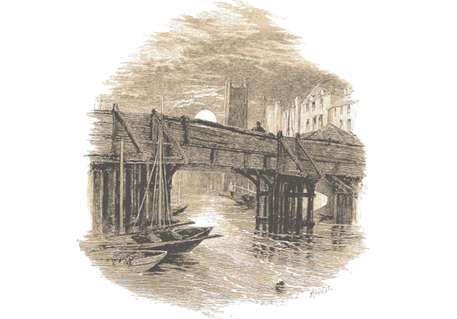

# El extraño caso del afluente del Támesis desaparecido

> El río Tyburn está desapareciendo. El alcalde del burgo Hampstead, en el que nace este afluente del Támesis, necesita que alguien descubra porque su río cada día es más pequeña. Si no actúan con celeridad, el cauce se secará en unas semanas y puede que sus vecinos pierdan su precioso río y tengan que irse del barrio.

## Resumen del caso

El Tyburn es un afluente del Támesis. Su curso medía unos 11 kilómetros, naciendo en South Hampstead (hoy una zona muy elegante del distrito de Camden). El río desembocaba en el Támesis en la zona de Pimlico, junto al puente de Vauxhall (construido en 1813).

El arroyo nace en el Pozo del Pastor (Shepherd’s Well) que es la principal fuente de agua de Hampstead. Sin embargo, el pozo ha dejado de manar agua y el río está desapareciendo. Sin el río el barrio estaría en graves problemas al perder su fuente principal de agua dulce y mucha gente que depende del río se iría del barrio.

Lord Winthle es el propietario más rico del Hampstead. Está harto de sus vecinos más pobres y busca hacer que vendan sus casuchas para comprarlas y construir grandes mansiones para personas ricas como él.

Sus tierras no están sobre el acuífero, así que ha construido en sus terrenos un pozo en diagonal que llega al acuífero del Pozo del Pastor y está secándolo con unas bombas accionadas por un grupo de peones. Según baja el nivel del agua ,otro grupo excava más profundo y extiende la tubería de la bomba.

\sp

Cuando el agua deje de fluir hacia el Tyburn, este se secará y las habitantes de las casas más pobres tendrán que vender sus casas por una miseria.

Toda el agua sobrante la está enviando a la red de alcantarillado que termina en el Támesis, unos 3 kilómetros más arriba de la desembocadura del Tyburn.

Cuando limpie el barrio de indeseables dejará de vaciar el pozo y el río debería volver a fluir. Lo que no sabe es que el acuífero puede colapsar por vaciarlo descontroladamente y hacer que todo el barrio se hunda en la tierra. De hecho, están empezando a salir grietas en las casas más viejas.

## Introducción al caso

Gabriel Utterson y Thomas Mundorf, alcalde de distrito de Hampstead y compañero del ejército del padre de Gabriel, se presentan en la agencia con un nuevo caso.

El río Tyburn ha dejado de fluir hacia el Támesis. Su fuente principal, el Pozo del Pastor, se ha secado y han perdido su principal fuente de agua dulce y una vía fluvial por la que mover las mercancías. Si no recuperan su río, el barrio podría estar en peligro.

Ha tratado de que el departamento de Obras Públicas le haga caso, que la Mancomunidad del Támesis les ayude o que lo investigue alguien de la Universidad de Oxford que sepa de estas cosas. Nadie le ha atendido, ni siquiera se han presentado a ver la situación.

Está tan desesperado que ha acudido a Scotland Yard a denunciar el robo del río y un tal inspector Newcomen le dijo que ellos no se encargan de desapariciones de ríos y si quieren, que contraten a algún investigador privado.

\sp

Ni corto ni perezoso ha hablado con Gabriel para ver si conocía a alguien apropiado y Gabriel sabía perfectamente quiénes eran los adecuados para este caso.

### Gabriel se une a la investigación

Gabriel siempre ha sido un apasionado del derecho inmobiliario y, aunque no es su especialidad, quiere participar en la investigación.

No es un hombre de acción, pero qué demonios iba a pasar en un caso como este, que empape de agua y barro sus nuevos zapatos.

## Visitando el barrio

Cuando lleguen a Hampstead se encontrarán con el cauce del río Tyburn medio seco y quedando solo un hilillo de agua. Muchas barcas que se usaban para moverse por el río o cruzarlo están varadas en el fango y el alcalde ha hecho poner unos puentes provisionales con troncos sobre el barro para poder cruzar.

### El barrio se hunde

El alcalde Mundorf les enseñará su barrio y les mostrará otro de los problemas que tienen ahora mismo están apareciendo grietas en las paredes de las casas. Por ahora, son cosas estéticas, pero en unos meses pueden hacerse muy graves.

En un momento dado, mientras miran una grieta cercana de un viejo edificio de dos plantas, se oirá un crujido seco y una gigantesca grieta recorrerá toda la fachada del edificio. No hay que ser muy listo para descubrir que el edificio se va a venir abajo en minutos.

Hay gente dentro que sale a las ventanas ante semejante ruido y otra que grita pidiendo ayuda desde dentro al ver los estragos que hay en su casa por las grietas que acaban de aparecer.

\sp

Si el PJ activo se considera un héroe, tendrá que entrar en la casa y ayudar a desalojarla antes de que se derrumbe. Si no se atreve a entrar, le arrastrará Gabriel.

Estos son 6 de los problemas y situaciones que pueden encontrarse. Escoge 4, uno por cada piso y mano del edificio. Entre Gabriel y tu jugador deberán poder salvar a todo el mundo en el edificio.

* La grieta ha estropeado el marco de la puerta de un apartamento del segundo piso y se ha atrancado. La familia que vive en ese piso no puede salir y grita desesperada desde el otro lado de la puerta. Deberán destruir la puerta a golpes o desatrancarla.
* Una señora muy mayor impedida necesita ayuda para salir de su apartamento. No quieres irse sin su viejo perro, así que o se la llevan a la fuerza o buscan al perro que se ha escondido debajo de la cama.
* La escalera se desploma cuando iba a usarla, tendrá que usar otras formas de subir y/o bajar de la segunda planta.

\sp

* Una lámpara de aceite se ha caído y ha creado un fuego. No es preocupante, pero 
* Una joven doncella de buen ver o un joven adonis (elige según las preferencias sexuales del personaje) pide ayuda desde una ventana. No tenéis claro porque pide ayuda, ya que podría salir por sus propios medios. 
* Hay un bebe solo en la casa, su madre grita desde la calle que salven a su bebe. Si son listos, pedirán a gente que pongan mantas y ropa para poder recoger al bebe que dejara caer por la ventana, si no tendrán que salir y volver a entrar con una perdida de tiempo.

Cuando terminen y salgan con la última persona rescatada, el edificio colapsará tras de ellos levantando una nube de polvo. Cuando salgan de la nube de polvo, los vecinos arremolinados se pondrán a aplaudir.

## El Pozo del Pastor

Mundorf les llevará a las fuentes del Tyburn, el Pozo del Pastor, un manantial natural que ahora mismo está medio seco.

Mundorf les advertirá que cerca, en una choza ruinosa, vive una vieja pirada llamada Alexia, a la que apodan «la bruja del pozo». Es inofensiva, pero se le va la cabeza, más desde que se secó el manantial. No para de gritar que el demonio está robando el agua.

Mientras investigan el lugar aparecerá una anciana encorvada con pelos llenos de hierba y ramas y que se apoya en un cayado. Irá muy lento, murmurando en voz baja. 

Se pondrá delante del grupo y empezará a gritarles que están robando el agua, que el agua es la vida y, por tanto, les roban la vida y terminara con «Seguid el manantial y os llevará al ladrón» señalando a una zona con matorrales al lado del manantial.

\sp

A partir de ahí solo dirá incongruencias, pero si quieres que se flipen un poco que se lleve al PJ a un lado y le cuchichee al oído «Yo sé vuestro secreto, pero no temáis. Si devolvéis el agua, no se lo diré a nadie».

### Alexia, la vieja bruja del pozo

Alexia, a la que gente de Hampstead llama «la bruja del pozo», es una anciana que se dedica a hacer ungüentos y pociones a cambio de unas monedas. Todas sus recetas llevan en su familia desde hace siglos y le han permitido ganarse la vida. Eres arisca y borde, pero como te enseño y tu madre nadie regatea ni engaña a una bruja mosqueada.

Alexia lleva viviendo en una choza al lado del Pozo del Pastor toda su vida, y su madre antes que ella y su abuela y su tatarabuela, así, quizás, hasta tiempos de los romanos. La familia de Alexia lleva adorando al dios del río desde tiempos ancestrales, siguiendo unas tradiciones animistas de las que ella es la última superviviente.

Alexia es un tesoro antropológico y si hablan de ella a alguna sociedad científica, seguramente que se reúnan donaciones para poder arreglar su casa y registrar sus historias para algún estudio histórico de Inglaterra.

* **Aspectos**
  * **Concepto principal:** Vieja bruja del río
  * **Complicación:** Empieza a estar senil
  * Conoce el río como la palma de su mano
  * Folklore local
  * Dar pena
* **Estilos:** Cauto Bueno (+2), Furtivo Mediocre (0), Ingenioso Bueno (+2), Llamativo Bueno (+2), Rápido Mediocre (+0), Vigoroso Malo (-1)

\sp

[ by Édouard Riou")](https://www.wikiart.org/es/edouard-riou/journey-to-the-center-of-the-earth-1864-48 "Journey to the Center of the Earth (1864) by Édouard Riou")

\sp
* **Proezas**
  * **Cuenta cuento:** Como buena cuentacuentos sabe captar la atención de su público, así que gana un +2 a crear ventajas en modo Llamativo cuando cuenta cuentos y narra historias.
* **Capacidad de recuperación:** 5
* **Estrés:** 1 | 2 | 3
* **Consecuencias:** Leve 2 | Moderado 4 | ~~Grave 6~~ Muy mayor

## El sistema de cavernas

Detrás de los matojos y arbustos que señala Alexis, hay una cuevecilla por la que apenas pasa una persona y llega hasta una compleja red de túneles. Alexia les ha dicho que sigan al agua y llegarán hasta el culpable. El problema es que está oscuro y el manantial es apenas un hilillo de agua.

Estas cuevas naturales son un laberinto de galerías y si no tienen una estrategia como marcas en el suelo, terminarán perdidos y andando en círculo. Si se buscan algún tipo de truco podrán moverse por ellas con menos dificultad pasando una tirada Buena (+2).

Si no se pierden, llegarán a un túnel en el que oirán al otro lado bastante ruido, incluso voces humanas si ponen mucha atención.

Si empiezan a golpear la pared del túnel parece muy débil y si la excavan o aplican fuerza se derrumbará para dar paso a otra galería que asciende poco a poco hacia la superficie. 

Allí trabajan 4 peones sacando tierra y profundizando la galería, que tras superar la sorpresa inicial se lanzarán al ataque con palas y picos en mano.

* Peones cavadores
* **Es Bueno (+2) en:** Usar la pala, Trabajos de fuerza
* **Es Malo (-2) en:** Educación general, Labores del hogar
* **Estrés:** ◯◯

\sp

### Perdidos en las cuevas

Si se pierden en las cuevas y tienen que volver, se encontrarán a Alexia en el manantial y les dirá «El agua de mi Tyburn siempre ha fluido hacia el Támesis. Si no es por aquí, será por otro cauce, pero siempre acabará en el Támesis».

Así que lo más sencillo es buscar en esta orilla del Támesis alguna canalización que lleve más agua de lo normal. Preguntando a los locales de la ribera, rápidamente les hablarán de un desagüe general de aguas fecales que estás tirando montones de litros de agua. Mucho más de lo normal. De hecho, han hecho chistes de lo mucho que mean por la zona.

El agua que sale del desagüe hacia el río es muchísima y está bastante limpia, no son aguas fecales normales. Eso de debe a que hay más agua limpia que residuos, así que puedes ser que gran parte del Tyburn salga por este aliviadero.

Deberán meterse en la cloaca y seguir el agua. Como la caverna, está oscuro, pero entra algo de luz por alcantarillas y desagües. Seguir el agua es más fácil, ya que la cloaca lleva muchísima agua y está más limpia que la del resto de colectores.

Tras andar varios kilómetros y tener que salir y entrar por las cloacas, terminarán llegando a un túnel recientemente excavado del que sale el agua. 

\sp

Si baja por el túnel llegarán a una zona donde un grupo de 4 peones accionan una bomba que saca agua de algún lugar más adelante del túnel. Los peones cogerán pocos y palas y se lanzarán a por los intrusos.

### Aviso de tormentas

Tanto si están en el fondo del pozo como en la bomba, un trueno muy cercano no será una buena señal. Enseguida ambos conductos se llenarán de agua de lluvia y habrá posibilidades de que mueran ahogados. 

La galería está muy inclinada y embarrada y el agua entra a raudales. Quien se quede dentro seguramente morirá ahogado. Si son buena gente deberán ayudar a salir a los peones que acaban de derrotar.

## La hacienda Winthle

Mojados y sucios conseguirán llegar a la hacienda Winthle, y tanto si vienen del pozo como si han subido de las cloacas. La haciendo es un típico palacio inglés de planta rectangular con una gran entrada en su parte central rodeado de bosques y jardines

Los jardines y la casa son limpiados y cuidados por sirvientes, jardineros y peones que trabajan muy pronto por la mañana, antes de que se levante Lord Winthle. Lord Winthle solo quiere codearse con la mínima cantidad de personas de menor estatus que él. Cuando han tenido que hacer reformas, ha preferido irse a su casa en el campo antes que tener que ver a sus humildes trabajadores.

Si llaman a la puerta les abrirá una vieja ama de llaves que les mirará raro, por sus pintas. Alguien les vigila desde una ventana y oirán un grito de «Tráelos a la biblioteca».

\sp

### Batalla legal

Lord Winthle les esperará en la biblioteca. Sus espías en el barrio le avisaron de los investigadores y se esperaba que pudieran dar con él. Así que se ha preparado para un combate legal con ellos. Sobre una mesa tiene un montón de libros de leyes preparados para rebatir sus acusaciones.

Según sus conocimientos legales, Winthle sabe que no podrá ganar, pero puede alargarlo mucho tiempo, el suficiente para que mucha gente se vaya y él compre sus casas. Está convencido que como mucho recibirá una multa, que por muy grande que sea la compensará con los beneficios de su especulación inmobiliaria. 

El combate legal es un conflicto que se resolverá como otros conflictos, pero de forma dialéctica. Recuerda que las consecuencias deberían tener un carácter psicológico, como «perder la confianza en sí mismo» o «dudas sobre el plan». Pueden atacarle tus jugadores y Utterson:

* El pozo se ha metido en terrenos municipales y tendrá que rellenarlo.
* Está robando el agua a los vecinos de Hampstead.
* Está destruyendo un acuífero y esto puede tener consecuencias a medio y largo plazo.
* El derrumbe de la casa es un delito criminal grave.
* Se ha convencido de que todo esto es parte de un brillante plan urbanístico que le hará más rico aún. En realidad es que no soporta a la gente pobre. Este es un hilo del que pueden tirar, sobre todo si ven como trata a sus trabajadores, por ejemplo hablando con los peones del pozo. Ante esto no tendrá defensa.

Por otro lado, Lord Winthle puede hacer uso de estos trucos:

* Puede alegar que estaba haciendo para lo que había pedido licencia, hacer un pozo para sacar agua. Aunque ha entrado en terrenos públicos, es solo un delito civil y solo supondrá una multa.

\sp

* No está robando agua, ya que es canalizada de nuevo al río. Solo se deshace del excedente de su pozo.
* El acuífero no está estudiado, así que puede alegar desconocimiento. Era obligación del alcalde tener un estudio hidrológico de la zona y con el estudio en mano no debería haberle dado una licencia.
* Las casas con grietas y la casa que ha colapsado son muy viejas y con un mal mantenimiento. No tiene nada que ver con que se esté drenando las aguas subterráneas.

Recuerda que es un combate dialéctico, deberías penalizar los actos violentos físicos. No es digno de caballeros, llegar a contacto físico.

Si tus jugadores se sobrepasan, Winthle se pondrá digno y superior, lo que hará que esté más seguro de que es mejor que el resto. Sabe que la violencia es el recurso del incompetente.

#### Ganar la batalla legal

Si consiguen derrotarle en este combate legal, se rendirá y reconocerá su odio por los pobres.

Así que olvidará su plan urbanístico y rellenará el pozo para que el Tyburn vuelva a fluir. En uno meses venderá la casa familiar y se marchará de Hampstead.

Por suerte para todos, el daño medioambiental no será permanente y las casas no seguirán hundiéndose.

La noticia del río robado saldrá en la portada y la gente de bien de la ciudad donará dinero para ayudar a arreglar las casas.

#### Perder la batalla legal.

Si no consiguen derrotarle en su juego, el alcalde podrá denunciarles y Lord Winthle entrará en proceso legal que retrasará lo máximo que pueda.

\sp

Mientras esperan la resolución del juicio, el acuífero será dañado irremediablemente, el Tyburn desaparecerá y se hundirán varias casas de Hampstead. Esto hará que el plan de Winthle se cumpla teniendo que muchos pobres irse del barrio, pero tampoco le saldrá bien a nuestro villano. El acuífero no se recuperará y la zona se quedará sin su valioso suministro de agua dulce y las propiedades no se revalorizarán como pensaba.

###  Lord James Winthle

Lord James Winthle es un caballero inglés de una buena familia con dinero. Estudio en Oxford donde destacó como atleta y economista. Nunca le ha faltado de nada y ha tenido una vida fácil que él cree que se ha ganado.

Lord James Winthle es una de las peores personas que puedes encontrarte en Londres. Es avaro, cruel, racista, machista, clasista y una larga lista de defectos. Si fuera un personaje de Dickens, le visitarían 3 fantasmas.

Pero lo peor es que odia a los pobres y ese odio visceral le ha llevado a elaborar un plan para echarlos a todos de Hampstead. De hecho, su odio visceral por la vieja Alexia le llevo a pensar en secar el río. Disfruta pensando que la vieja morirá cuando se seque el río.

Se ha gastado una fortuna en hacer el pozo que saca el agua del acuífero y su canalización, pero lo recuperará con la compraventa de terrenos cuando los pobres tengan que marcharse del barrio.

* **Aspectos**
  * **Concepto principal:** Caballero inglés de rancio abolengo
  * **Complicación:** Aporofóbico (odio a los pobres)
  * El más rico terrateniente de Hampstead
  * Del equipo de esgrima de Oxford
  * Aspiraciones políticas

\sp

* **Estilos:** Cauto Grande (+3), Furtivo Mediocre (+0), Ingenioso Bueno (+2), Llamativo Enorme (+4), Rápido Bueno (+2), Vigoroso Grande(+3)
* **Proezas**
  * **Nobleza:** Debido a que pertenece a familia noble y buena educación, gana un +2 para Atacar de modo Rápido cuando discute con gente de menor rango social o educación.
  * **Genio de las finanzas:** Debido a sus estudios de economía, gana un +2 para Crear una ventaja en modo Cauto al usar su dinero.
  * **Corpore sano:** Debido a sus entrenamientos diarios en remo y esgrima, gana +2 para superar en modo Vigoroso cuando hace actividades atléticas  
* **Capacidad de recuperación:** 3
* **Estrés:** 1 | 2 | 3
* **Consecuencias:** Leve 2 | Moderado 4 | Grave 6

&nbsp;

