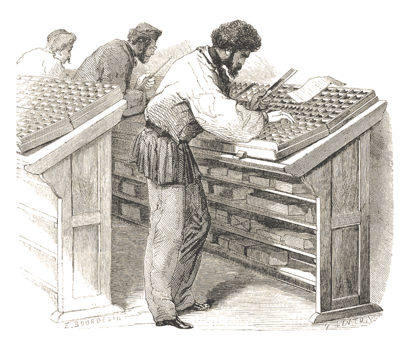

# El extraño caso del robo de la fuente tipográfica

> Un ladrón ha entrado en la imprenta Cobden-Jacobson y ha robado todos los tipos móviles de una antigua fuente que se usa en la imprenta para imprimir libros. Es algo valioso, pero había cosas más interesantes en el taller que la fuente y sobre todo más fáciles de llevarse, porque son miles de piezas de plomo que pueden llegar a pesar hasta unos 100 kilos.

## Resumen del caso

El tipo de fuente Vindica fue creada hace 200 años en Milán por un maestro impresor llamado Giuseppe Vindicani. Parte de esta fuente fue vendida a una imprenta de Londres que imprimía sobre todo libros científicos de poquísima tirada.

Lo que nadie sabe es que la casa de la moneda de París va a empezar a trabajar con la Vindica como parte de su sistema de antifalsificación. Creen que una vieja fuente en desuso desde hace siglos y diseños tan antiguos pondrá más difícil de hacer copias de sus billetes y hará que sean más fácilmente reconocibles.

Además, al estar tan destrozada por el uso, le da imperfecciones únicas que la hacen todavía más irreproducible.

La Casa de la Moneda ha comprado a los herederos del impresor milanés todos los tipos móviles que tenía sin saber que había una parte que se vendió a una imprenta inglesa, Cobden-Sanderson Printing Workshop.

Quiso la casualidad que el falsificador Walt «Tinta China» Sherwood estuviera leyendo un tratado de biología de un tal Charles Darwin cuando le trajeron una prueba de impresión de los nuevos billetes franceses y vio que usaban exactamente el mismo tipo de letra.

\sp

Ni corto ni perezoso organizo a su banda y asaltaron la imprenta llevándose todos los tipos móviles de la Vindica y ahora mismo está imprimiendo a toda máquina billetes de 20 francos franceses falsos muy difíciles de detectar en su guarida en el sótano de una taberna del East End.

Si todo sale bien, este puede ser el golpe de su vida y vivir él y su banda como marqueses en una mansión en la costa.

## Introducción al caso

Tiberius Fox, propietario de la Cobden-Sanderson Printing Workshop, acude a la agencia Hyde & Jekyll. Hace unos días le robaron en su taller todas las piezas de una de sus colecciones de tipografías, la Vindica. No es un gran robo a nivel monetario, pero es un viejo con sus manías y desea recuperarla.

Tiberius quiere pagarles por sus servicios, pero cuando vaya a sacar un sobre con el adelanto, Gabriel se lo impedirá diciéndole que si le permitiese pagar por este trabajo, su padre no se lo perdonaría. Parece ser que el padre de Gabriel tenía una deuda de honor con Tiberius que debió recibir una herida en la guerra por protegerle. Les dejará entender que luego arreglará el tema monetario con ellos.

## En la escena del robo

Cómo no es de extrañar cuando lleguen al taller estará el inspector Newcomen. Está interrogando a los trabajadores, está convencido que alguno de ellos es el ladrón y no para de molestarles en su trabajo.

No hay mucho que investigar, la puerta fue abierta con una palanca y los ladrones entraron, se llevaron las cajas de madera con los tipos de la Vindica y no se llevaron nada más. Las dos cajas con todas las letras mayúsculas, minúsculas, números y signos ortográficos son de plomo y pesan unos 100 kilos.

\sp

Por suerte, hay una cuantos tipos móviles que estaban usando para una segunda tipografía en otro libro y tienen como unas 10 piezas que no robaron.

Si buscan (Bueno +2) en el taller, en la papelera del taller encontrarán un papel sobre el que han hecho pruebas a mano de las piezas de la Vindica. Al robar las piezas, los ladrones escribieron «Francs» para ver si se parecía a la prueba de impresión del billete. Si preguntan por la prueba les dirán que la ha hecho alguien profesional del tema que sabe como juntar las piezas y sujetarlas juntas.

Si interrogan a los trabajadores no estarán muy por la labor. Ya ha aguantado al inspector Newcomen y no tienen más ganas de interrogatorio. Ninguno sabe nada, ni vio nada y sobre todo ninguno tenía una razón clara para robar la fuente.

\sp

Si hablan con la gente de los alrededores, nadie vio ni escuchó nada. Si les ves un poco perdido, algún vecino voy días antes un grupo de personas (entre 4 y 6) con malas pintas como vigilando el lugar.

## Buscando pistas

Una vez visitada la escena del robo, toca salir a la calle a hacer labor de investigación.

Las primeras sospechas deberían caer sobre otros impresores. Nadie más en todo la ciudad le debería interesar unos tipos móviles que a otras imprentas. Quizás no sean los ladrones, pero pueden haber encargado el robo o puede ser que se las hayan ofrecido.

Si se ponen a indagar entre las imprentas de Londres verán que no parece que hubiera mucho interesado en esa tipografía. Cada taller usa sus propias tipografías y usar las de otros impresores sería delatarse.

Por lo que cuentan los maestros impresores, si las han robado, o las piezas escondían algún secreto o por alguna razón eran muy valiosas para el ladrón, pero desde luego que el que las robo no buscaba venderlas y sacar dinero. Tienen su valor, pero no tanto. 

### Al otro lado de la ley

Si a los impresores legales no les interesa la Vindica, deberán buscar impresores del otro lado de la ley, pero quién querría robarla y sobre todo por qué. Las opciones pueden ser:

* Falsificadores que necesiten equipamiento para sus trabajos. Si encontraron la prueba en la papelera, podrán sin problema filtrar su búsqueda a falsificadores.
* Grupos anarquistas y sindicales que necesitaban tipos nuevos para imprimir sus panfletos propagandísticos.

\sp

Si tienen contactos en los bajos fondos, pueden obtener algunos nombres de anarquistas y falsificadores, entre los que estará el Walt «Tinta China» Sherwood. Puedes hacerles enfrentarse a algún grupo anarquista hasta ponerles sobre la pista de Walt.

Sin contactos en los bajos fondos, tendrán que conseguir pistas en Scotland Yard. Alguien debería conocer a los falsificadores de la ciudad y por donde suelen moverse.

Puedes ser malvado y que Newcomen empezará como detective de delitos fiscales antes de investigar crímenes y robos. Tendrán que negociar con él para sacarle algunos nombres.

Newcomen solo quiere una cosa, estar para las detenciones. Antes de zanjar el caso deben avisarle para que haga la detención y se apunte un tanto ante sus jefes.

Sea como sea tras algunas pistas falsas. Tendrán el nombre de Walt «Tinta China» Sherwood y la taberna de «El trébol».

#### El Frente Anarquista Popular (FAP)

No tendría gracia que directamente tus jugadores acabaran directamente en «El trébol» y deberías por lo menos ponerle un rastro falso de un grupo anarquista, a no ser que la prueba de impresión les marque que deben buscar solo falsificadores.

El Frente Anarquista Popular es un grupo anarquista que busca la destrucción del gobierno con atentados contra instituciones gubernamentales y monárquicas. Su objetivo son las instituciones de recaudación de impuestos, ya que creen que sin impuestos el gobierno será destruido.

Han dado varios golpes sonados con bombas en una oficina del fisco y en el ministerio de Hacienda.

\sp

Su cuartel general está en las Docklands en un almacén con una puerta principal y con acceso fluvial al Támesis. Casi siempre hay unos 4 miembros del FAP imprimiendo panfletos, preparando artefactos explosivos o discutiendo de política.

* Anarquistas fanáticos
* **Es Bueno (+2) en:** Arengar a las masas, Combatir
* **Es Malo (-2) en:** Negociar, Ciencias 
* **Estrés:** ◯◯

El cuartel del FAP está lleno de explosivos conectados a una mecha central que si se enciende los hace explotar y provocan el derrumbe del taller donde se reúnen. Si se enciende la mecha es muy difícil de apagar (Bueno +2) y tendrá un par de turnos para escapar corriendo del taller y saltar fuera mientras una bola de fuego destruye el edificio.

### La historia de la Vindica

Otra línea de investigación es que las piezas tipográficas tengan algún secreto, así que deberían investigar el origen de las piezas móviles. Los archivos de la imprenta son un tremendo lío, pero con un poco de suerte (Normal +1) podrán encontrar una especie de factura de compra de la tipografía a Giuseppe Vindicani de Milán de hace unos 200 años cuando se abrió la imprenta.

Si preguntan, los trabajadores de la imprenta no notaron nunca nada en las piezas de plomo y durante muchos años las han usado sin problemas.

Pueden llevar las pocas piezas que no fueron robadas a que las analice y solo encontraran plomo. No son de oro o plata y no parece que tengan ningún misterio.

Tarde o temprano esta línea de investigación se extinguirá, aunque puedes estirarla todo lo que quieras. Si tienes una buena idea ponla en práctica.

\sp

Por ejemplo, si han descubierto la prueba en la papelera, podrán hacer la prueba juntando las piezas de «Francs» y buscando si se descubre algo al poner esos tipos juntos.

## El East End de Londres

Tarde o temprano les pondrán en la pista de Walt «Tinta Cuina» Sherwood y su banda de falsificadores. 

Walt tiene su guarida en la bodega de «El Trébol», una de las peores tascas del East End londinense. Es un tugurio de mala muerte donde se bebe mal, se juega mucho y se pelea siempre.  

Walt tiene su imprenta en la bodega y entra y sale por la carbonera. Para evitar levantar sospechas de los parroquianos de «El trébol».

\sp

### Infiltración 

Tus investigadores necesitarán pruebas de que la fuente robada está en el sótano de «El Trébol», así que deberán infiltrarse y conseguir pruebas, unos puñados de moldes de letras servirán. Si consiguen pruebas de que están falsificando moneda francesa también estará bien, pero eso exigiría abrir, con una tirada Buena (+2), una caja con candado donde guardan el papel moneda.

Siempre hay dos personas trabajando en la imprenta y durante el día puede que haya alguien pasando el rato con esos dos. Por la noche, tras cogerse una buena borrachera en el propio bar, duermen en la bodega en unos camastros improvisados. Deberían atrancar la trampilla de las escaleras, pero la verdad que muchas veces van tan borrachos que ni se enteran.

La bodega es un cuadrado de unos 20x20 metros sin ningún tipo de separación, solo algunas columnas de contención. No tiene luz natural, solo lámparas de aceite y sus únicas entradas son las escaleras que dan detrás del mostrador del bar y una carbonera que ya no se usa para tal fin. Walt suele salir y entrar por la carbonera cuando no quiere ser detectado, pero el resto.  

En un par de días de vigilancia pueden detectar a Walt saliendo por la carbonera, los hábitos de entrada y de salida y lo más importante que casi todas las noches acaban alcoholizados perdidos.

### Detener a la banda

Es muy difícil que tus investigadores detengan a toda la banda ellos solos. Si consiguen ayuda de gente como el patrullero Wilson, la cosa puede ser más fácil, pero nunca sencilla.

Si son inteligentes, pueden tener alguna idea brillante como narcotizar la bebida o separarlos de alguna manera y detenerlos de uno en uno.

\sp

La opción más lógica es tratar de hablar con Newcomen y que les ayude a detener a todos los falsificadores en su guarida. El problema es que entonces Newcomen se apropiará del caso y se lo adjudicará.

El inspector Newcomen, si le dan la información sobre la banda y las pruebas del robo, podrá pedir una orden de detención y montará una redada que tomará «El trébol» y detendrá a todos los delincuentes. Newcomen se asegurará de que dos policías, vigilen a tus jugadores y no le dejen acercarse para evitar que le roben la fama.

Si han sido listos y lo saben, no le contarán lo de la salida por la carbonera y podrán ponerse allí para cazar a Sherwood tratando de escapar. Walt intentará huir como sea, pero no dudará en sacar una gran cuchilla de guillotinar papel y en usarla, si fuera necesario.

### Walt «Tinta China» Sherwood

Desde que era muy pequeño, Walt sabía que si quería salir del arroyo no podía seguir el camino de su padre, un humilde techador. Así que en cuanto pudo se metió en una de las bandas criminales del su barrio, el East End. Poco ascendió en la banda y allí conoció a su maestro en falsificación, Gîroc, un impresor francés que tuve que huir de Francia por problemas legales.

Con Gîroc no solo aprendió el fino arte de hacer cosas impresas tremendamente parecidas a otras cosas impresas, también aprendió modales y cultura general. Según su maestro, de nada sirve hacer la mejor falsificación si no no puedes engañar a nadie para que te lo compre. 

Así que Walter consiguió tener una buena cultura general y si lo desea puede pasar por un personaje de clase media/alta. Esto le viene muy bien cuando tiene que introducir sus falsificaciones en la calle, quién pensaría que ese elegante caballero es un falsificador del East End que trata de colarte 200 libras en billetes falsos.

\sp

Walter posee una vista excepcional para los detalles, nada se escapa a su ojo avizor. Sus años de falsificador le permiten detectar el mínimo detalle en una persona, objeto o estancia. Por poner un ejemplo, para él los trileros mueven los vasos a cámara lenta.

* **Aspectos**
  * **Concepto principal:** Experto falsificador de los barrios bajos de Londres
  * **Complicación:** Perfeccionista hasta la obsesión
  * Modales finos
  * Curtido en las calles
  * Muy buena vista
* **Estilos:** Cauto Enorme (+4), Furtivo Bueno (+2), Ingenioso Grande (+3), Llamativo Normal (+1), Rápido Normal (+1), Vigoroso Grande (+3)

* **Proezas**
  * **Colar billetes falsos:** Debido a sus años intentando soltar billetes falsos en todo tipo de negocios, gana un +2 para Superar en modo Rápido cuando tiene que mentir.
  * **Fingir de ser clase alta:** Debido a las enseñanzas de su maestro Gîroc sobre modales, etiqueta y cultura en general, gana un +2 para Crear una ventaja en modo Cauto cuando tiene hacerse pasar por gente clase media/alta.
  * **Burocracia a mí:** Como falsificador conoce muchos documentos y procesos burocráticos, una vez por partida puede montar algún tipo de documento falso que le evite problemas legales no sangrientos.
* **Capacidad de recuperación:** 3

\sp

### La pandilla de «Tinta China»

La pandilla de «Tinta China» es una mezcla de matones y trabajadores de imprenta. Trabajan imprimiendo las falsificaciones de Walter y si es necesario llenan un calcetín de piezas tipográficas de plomo y se lían a tortas con quien haga falta.

* Criminal de baja estofa
* **Es Bueno (+2) en:** Trabajo pesado, Pelear
* **Es Malo (-2) en:** Cultura, Negociar 
* **Estrés:** ◯◯

### Negro sobre blanco

Si consiguen resolverlo, Tiberius Fox estará tremendamente agradecido y propondrá a los investigadores un trato muy interesante, publicarles en formato folletín sus extraños casos y llevarse una parte de los beneficios.

Si no les ve muy convencidos, les hablará de la inmortalidad, de estar en negro sobre blanco, de la fama y si todo va bien de pingües beneficios.

Utterson revisará el contrato, si no se fían, pero les dirá que va a ser divertido cuando se tengan que presentar los dos a firmar juntos.

