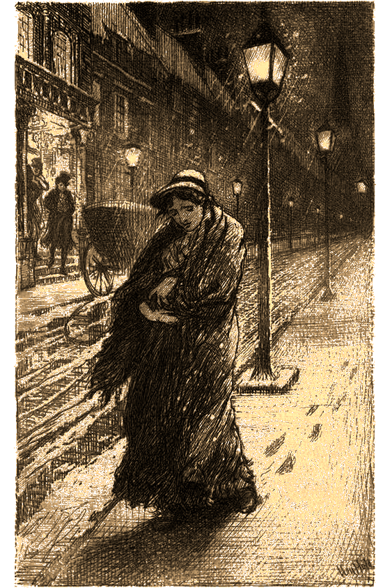

# El extraño caso de la violetera secuestrada

> Lisa Doosmall, una humilde violetera que vende flores a las parejas en Covent Garden, lleva desaparecida más de dos meses y su padre aparece en la agencia buscando alguien que la encuentre. Scotland Yard no tiene ni una pista sobre el paradero de la violetera y no parece que le preocupe.

## Resumen del caso

Lisa Doosmall es una joven violetera que sabe que mientras no obtenga una educación no podrá encontrar un trabajo mejor y así escapar de la casa de su padre, un alcohólico maltratador que la pega y se bebe el poco dinero que consigue sacar vendiendo flores. 

Una de las noches a la salida del Teatro Real se encuentra con un caballero que le pagará por ir a su casa y grabar su forma de hablar. Ella cree que es una forma rara de pedir sexo por dinero, pero acepta porque no ve otra salida a su situación actual.

Para su sorpresa, se pasa toda la noche grabando frases sin sentido para el filólogo Eric Hodgins que está estudiando el habla y la dicción de los bajos fondos de Londres.

Al ver los títulos en las paredes de la casa de Sir Hodgins y los libros gordos de las estanterías, Lisa piensa que puede conseguir una cultura del extraño personaje y decide ofrecerle servicios sexuales a cambio de que la enseñe a hablar y le dé cierta cultura. Hodgins la rechaza, pero se lo toma como un reto desafiante en su aburrida vida. 

\sp

Sir Hodgins acepta y empieza en ese mismo momento, no da a Lisa ni tiempo a recoger sus cosas, ni avisar a nadie. El problema es que Hodgins es un ser muy obsesivo, un pésimo profesor y tiene una acentuada tendencia bully y poquísima paciencia, con lo que empieza a insultar y despreciar a la mínima.

Para Lisa, las semanas que pasa con Sir Hodgins son una tortura, pero no sabe procesarlo, porque lo considera normal. Es lo ha vivido con su padre durante toda su vida.

Hodgins le hace ejercitar su pronunciación hasta quedarse afónica. Le enseña y le obliga a memorizar miles de datos totalmente descontextualizados y sin ninguna lógica. Le quita la comida, si no sigue las reglas de etiqueta en la mesa, que no para de repetirle día y noche a gritos.

Una noche la psique de Lisa, rota ya por los abusos de su padre, no aguanta más maltratos del profesor Hodgins y crea una segunda personalidad, Elsa Crawford. Elsa no tiene recuerdos de antes, pero cree que ella es un joven de la alta sociedad que ha sido secuestrada por un malvado caballero para obligarla a casarse con él y la misma noche que despierta escapa de la mansión del profesor. 

El profesor piensa que Lisa ha huido a media noche porque no es capaz de aguantar el duro trabajo de cultivarse y se despreocupa. Ve que le falta algo de dinero y algunos ropajes caros que tenía en casa.

Nacida como forma de procesar los abusos del profesor Hodgins, Elsa despliega todo lo que le ha metido a presión en la cabeza de Lisa. Es distinguida, habla de forma perfecta, tiene modales excelentes, una extensa cultura general y una agradable conversación. 

Por su lado, Lisa se queda encerrada en el fondo de su propia mente. Está cansada de abusos y gritos y allí se siente segura, sobre todo con Elsa protegiéndola. Aun así, aparece en los sueños de Elsa, que cree que es una especie de pesadilla recurrente.

\sp

\sp

Ahora mismo Elsa ha empezado a trabajar como dependienta en una perfumería de mucho postín y está conociendo a un joven de buena familia. Está totalmente irreconocible, no solo a nivel físico sino mental. Solo una extensa evaluación médica podría descubrir que son la misma persona. También alguien que hubiera pasado por un problema parecido podría descubrir donde se esconde Lisa.

## Introducción al caso

Wilfred Doosmall entra en la agencia pidiendo ver a Jekyll y Hyde. Necesita su ayuda para encontrar a su hija que lleva desaparecida desde hace dos meses. Está convencido que alguien la ha secuestrado y la tiene retenida

Quien le reciba puede ver qué huele a alcohol barato y Hyde incluso puedes recordar hacerse peleado con él hace semanas en algún tugurio o puede que se deban dinero de alguna partida de cartas.

Wilfred no puede pagar los honorarios que suelen cobrar, pero seguramente que si la rescatan podrá pagar sus servicios limpiando la oficina para ellos o realizando otros tipos de trabajos similares.

Hace dos meses desapareció sin dejar rastro una noche después de vender violetas a la salida de los teatros. Desde entonces nadie sabe nada y nadie la ha visto. Wilfred lo ha denunciado en Scotland Yard, pero no parecen ni dedicarle mucho tiempo, ni ponerle mucho interés.

### Wilfred Doosmall

* Maltratador y borracho vividor
* **Es Bueno (+2) en:** Pelear, Mentir
* **Es Malo (-2) en:** Juego, Resistirse a la bebida
* **Estrés:** ◯◯

\sp

## Primeras pesquisas

Quizás lo más fácil para empezar es ver qué sabe del caso Scotland Yard. Si tienen contactos como el patrullero Wilson (El extraño caso del lingote de oro con la rosa impresa), podrán saber que no tienen ninguna pista. Una noche desapareció y no se sabe nada más. No ha aparecido ningún cadáver que pudiera ser ella, ni nadie sabe nada.

Pero saben que su padre era un borracho y un maltratador y en muchos de estos casos la chica desaparece sin dejar rastro para que no las encuentre sus maltratadores. Consiguen un trabajo en otra ciudad y se cambian el nombre o consiguen un novio que se las lleva con ellos.

## Yo a las cabañas bajé, …

Una vez hechas las primeras pesquisas habría que hablar con sus compañeras de trabajo. Habrá que esperar a la noche para verlas recoger de la basura las flores desechadas de los mercados de flores o hablar con ellas a la hora de entrada y salida de los teatros de la zona de Covent Garden.

Nadie querrá hablar del tema, pero si ofrecen una buena propina y un té caliente, Mary Peed, una buena amiga, les contará su historia de maltrato y abusos por parte de su padre y como la noche de su desaparición había un extraño y elegante caballero tomando notas por la zona.

Su padre no denunció su desaparición hasta que se quedó sin dinero y dejaron de fiarle en sus bebedores habituales. Fue entonces cuando acudió a Scotland Yard.
 
\sp

## Yo a los palacios subí, …

Primer problema, buscar a alguien en una gran ciudad con una vaga discreción: unos 50 años, estatura media, moreno, con bigote, bien vestido y con porte elegante. Covent Garden a la noche se llena de tipos, así que van a los teatros.

### Retrato robot

Pueden intentar un retrato robot, una nueva técnica que está empezando a usar la policía. Deberán buscar un ilustrador y que la señorita Peed este un rato describiendo al caballero con el cuaderno de notas. Con o sin retrato hecho deberán decidir por dónde empezar a buscar.

* Los clubs de caballeros podrían ser una buena opción para empezar. El problema es que no los frecuenta y no se estira mucho en estos ambientes. Si consiguen entrar en alguno de muy alto nivel, algún miembro puede reconocerle como el profesor que contrato para que ayudara a alguno de sus hijos con sus problemas de dicción.
* En la universidad, si pasan por algún departamento de ciencias sociales y humanidades, hay posibilidades de que le reconozcan. Ninguno de sus colegas de profesión dirá nada bueno de él.
* En Scotland Yard también sabrán de él. Ha estado haciendo trabajos para ellos. Tiene la teoría de que por la forma de hablar se puede saber quién es un criminal y quién no. Scotland Yard está buscando nuevas formas de resolver crímenes y este método les pareció interesante, así que suelen llamarle a ver qué les dice. Claramente, esto llegará a oídos del inspector Newcomen.

En todos estos casos les podrán dar su dirección e incluso su tarjeta «Doctor Eric Hodgins, profesor de fonética y logopeda»

\sp

En cualquier otro ámbito será totalmente desconocido. Si les ves muy perdidos, puedes hacer que Mary Peed les ayude un poco. Les contará que a una de las violeteras les propuso grabar su voz y ella le rechazó pensando que le estaba ofreciendo dinero por sexo. Eso debería ponerles a buscar entre investigadores y profesores de universidad.

### Vigilancia

Montar turnos de vigilancia puede funcionar, pero tendrán que ser pacientes. El profesor Hodgins solo va a estudiar a las vendedoras de flores 2 veces al mes. Así que como mínimo deberán estar unas diez noches de vigilancia.

Sea como sea, Hodgins aparecerá por Covent Garden con su cuaderno donde anota las palabras que usan las violeteras y su pronunciación. Será fácilmente reconocible, se ajusta a la descripción y va con el cuaderno de notas.

Quizás traten de ver qué escribe, pero o le quitan el cuaderno o será imposible. Es de noche y el cuaderno es pequeño. Quizás puedan pagar a una de las chicas para que lo distraiga con sus encantos, pero desgraciadamente no funcionará.

Lo indicado en este caso será seguirle sigilosamente hasta su casa y averiguar dónde vive. Si la tiene secuestrada, saber dónde vive puede significar saber dónde está y salvarla. Si quieren detenerle o interrogarle, podría escapar y acabar matando a su prisionera para luego desaparecer.

#### Profesor Eric Hodgins

Eric Hodgins es una eminencia mundial en fonética y logopedia. Personalidades de todo el mundo requieren sus servicios para aprender a hablar correctamente como políticos y reyes o nuevos ricos que quieren esconder sus orígenes humildes. 

\sp

Si bien es el mejor del mundo, tratar con él es imposible y puede sacar de quicio hasta al lama del Tíbet más tranquilo y calmado. Es capaz de tenerte repitiendo la misma frase durante horas y días hasta que la hagas a la perfección, y cuando lo consigues pasar a otra frase sin ninguna palabra de ánimo o de estímulo. 

* **Aspectos**
  * **Concepto principal:** Engreída eminencia mundial sobre fonética
  * **Complicación:** Obsesivo y sin empatía
  * Excesiva confianza en sí mismo
  * Acomodado
  * Único en su especie
* **Estilos:** Cauto Grande (+3), Furtivo Normal (+1), Ingenioso Grande (+3), Llamativo Grande (+3), Rápido Normal (+1), Vigoroso Mediocre (+0)
* **Proezas**
  * **Por su forma de hablar le conocerás:** Debido a sus estudios en fonética en miles de lenguas y acentos, obtiene +2 a Crear una ventaja en forma Cauta cuando puede estudiar la forma de hablar de su interlocutor.
  * **Nota cuando mientes:** Con sus estudios sobre la voz y las mentiras, obtiene un +2 a Superar en modo Cauto cuando le mienten.
  * **Desquiciar:** Debido a su personalidad obsesiva y sin empatía, obtiene +2 a Atacar de modo Llamativo cuando discute o mantiene una conversación con otras personas.
* **Capacidad de recuperación:** 3
* **Estrés:** 1 | 2 | 3
* **Consecuencias:** Leve 2 | Moderado 4 | Grave 6

### Pesquisas previas

Con un nombre y una dirección podrán averiguar a través de sus vecinos y compañeros de trabajo las cosas normales del profesor Hodgins, profesor de universidad, logopeda, sin antecedentes penales, soltero y acomodado.

\sp

Nadie recuerda que entrarán mujeres en su casa de forma reiterada en los últimos meses, de hecho se rumorea que no le gusta la compañía femenina. Aun así, se oyen muchas voces femeninas a cualquier hora del día y de la noche que podrían ser de sus grabaciones o de estudiantes.

### Visita de cortesía

La última persona que se conoce que estuvo con Lisa fue el profesor Hodgins y después no se sabe nada más de ella. Está claro que para saber qué paso con Lisa habría que colarse en su casa y buscar alguna pista de su paradero.

Tus jugadores pueden tratar primero de hacer una visita preliminar a su domicilio con alguna excusa. Con la excusa de conocerle, querer contratarle o incluso entrevistarle o firmarle alguno de sus libros podrían concertar una cita. Recibe bastantes de este tipo de citas y no tendría por qué sospechar nada.

Si llegaron a Hodgins por sus relaciones con Scotland Yard, podrían incluso presentarse como lo que son, investigadores privados que quieren aprender sus técnicas fonéticas. La verdad que este método iría directo contra una de las debilidades del profesor que es su ego.

La visita será normal, Hodgins se presentará rimbombantemente y enseñará su estudio con sus cachivaches de fonética, sus títulos y sus trabajos y menciones. Luego ofrecerá un té y se podrá a hablar sobre el tema de la cita.

Podrán escamotearse con excusa de ir al baño o similar y ganar unos minutos de revisar la casa. Si quieren ganar tiempo, deberán apelar a su ego de investigador y preguntar cosas. Enseguida querrá hacer una demostración y se pondrá a armar sus cachivaches de fonética. Si se excusan en ese momento, tendrán más tiempo para investigar su casa.

\sp

En la casa con tan poco podrán hacer una de estas dos cosas o las dos si le consigue entretener

* **Buscar señales de que Lisa ha estado allí:** No encontrarán nada de Lisa, pero si miran en sus archivos y pasan una tirada Buena (+2), encontrarán entre los archivos del profesor una archivo sobre Lisa.
* **Revisar la casa para conocerla y poder planear una intrusión nocturna:** Puedes permitirles generar algún aspecto que les ayude en el futuro, como «Conozco el lugar».

Tras esto, dará por terminada la cita y acompañará a la puerta a su invitado.

Si en algún momento, Hodgins habla con Hyde, no será capaz de identificar su acento. Tiene la dicción perfecta de Jekyll, pero con las expresiones barriobajeras que ha aprendido durante sus juergas. Lo que no comprende Hodgins es que el tono y la cadencia de la pronunciación de Hyde vienen de su mente primitiva y animal. Hyde habla como hablaría una mezcla mutante de cavernícola y un tigre.

Si han encontrado el fichero de Lisa, un vistazo rápido les dirá que no parece nada más que otra clienta, una con la que trabajo muchísimas horas, pero no hay nada raro. Lo importante serán las fechas de sus anotaciones, que fueron después de desaparecer hasta hace unos días que acaban abruptamente y solo pone una escueta nota de «La clienta ha renunciado y no ha vuelto».

### Misión de infiltración

Si la visita de cortesía no da sus frutos, quizás un allanamiento nocturno sea más provechoso.

El apartamento de Hodgins ocupa toda la segunda y última planta de un edificio en Berkerley Square. El único acceso es por la escalera principal, pero se podría escapar la fachada llena de enredaderas y acceder por una ventana. 

\sp

La calle está bien iluminada y con tráfico, así que para intentar entrar deberían hacerlo bien entrada la noche.

El apartamento es una gran estancia central que sirve de sala de estar, biblioteca, comedor y aula. Y a cada lado de esa gran estancia está la cocina, el despacho, el dormitorio y un trastero que preparo como dormitorio para Lisa y que todavía no ha desmontado.

Si registran el trastero encontrarán señales de que una mujer estuvo allí como algún vestido viejo o un botecito de perfume gastado.

La casa cuenta con corriente y luz eléctrica, un lujo que el profesor se ha dado para poder usar diversos aparatos eléctricos en sus experimentos.

Si no lo vieron durante la visita de cortesía, podrán encontrar el cuaderno de notas sobre Lisa.

No encontrarán señales de sangre, ni sótanos truculentos, ni mazmorras sexuales, ni palas y sacos de cal viva. Hodgins es un tipo especial, pero no parece un psicópata.

XXX

### Charla delante de un té

Cuando los sorprenda dentro de su casa, si no les conoce de la visita anterior, les hará hablar con preguntas rápidas como quiénes son o qué quieren y si le contestan, ni se preocupará del intruso. Está tan convencido de sus conocimientos de la lengua inglesa, de la fonética y de la antropología que sabe que no son criminales.

Si le han visitado antes, no hará las preguntas, ya sabrá que no tienen intenciones criminales hacia él. Recuerda que para el profesor Hodgins Jekyll y Hyde no son la misma persona, principalmente porque hablan de forma distinta.

\sp

Rápidamente, les invitará a tomar un té mientras charlan sobre por qué están en su casa. Si le preguntan, Hodgins explicará, sin problema, toda su historia con Lisa y como se fue una noche con algo de dinero y unos trajes y aunque desconoce que exista Elsa, si les dejará ver qué no era muy psicológicamente estable, cosas que en cierta parte es culpa suya.

Colaborará sin problemas con tus jugadores, dejándoles registrar su casa y respondiendo a todas sus preguntas. Si le preguntan que porque no denunció nada, ni la desaparición, ni el robo, les dirá que el hurto no le importaba y estaba convencido de que no volvería a su casa. Seguramente huiría a otra ciudad y buscaría rehacer su vida allí lejos de su padre.

Les puedes dejar su cuaderno de notas sobre Lisa y les enseñará el trastero que usaba de habitación, incluso puede ponerles algunas grabaciones con sus progresos fonéticos, pero necesitarían a su padre o a la señorita Peed para reconocer la voz.

Una pista que puede parecer que no, pero que es importantísima, es que el profesor descubrió que Lisa tenía un portentoso olfato, lo que la permitía escoger de entre los restos del mercado de flores las mejores de todas. Lisa vendía más flores que sus compañeras porque eran mejores y sacaba más dinero, el problema era que su padre le quitaba todo el dinero y se lo bebía.

Otra cosa que podrá contarles es que es tremendamente alérgica a las plumas de pavo real. Se puso toda roja e hinchada el día que le regaló un sombrero con largas plumas de esta ave.

Tras una agradable, les dará su tarjeta y les dirá que está a su completa disposición para lo que necesiten.

\sp

## ¿Dónde está Lisa?

XXX

Un problema que tienen es que no conocen de cara a Lisa, pueden tirar horas visitando perfumerías que no la reconocerían y mucho menos como Elsa. 

Pueden intentar hacer otro retrato robot que les ayude y que puedan enseñar. Pero no será el elemento que les ayudará en su búsqueda, solo una ayuda.

Otra opción es llevar con ellos durante sus pesquisas a Mary Peed o a Wilfred Doosmall, para ver si la reconocen. Peed tiene que trabajar, así que solo podrá estar pequeños ratos para verificar si la persona que crean que es Lisa lo es o no. Su padre es un borracho maltratador del que seguramente huya nada más verle.

XXX

### Aparece Newcomen

El inspector Newcomen se ha enterado de que Jekyll y Hyde están buscando a la señorita Doosmall y, claro, eso ha despertado el interés en este caso. No porque sea importante, chicas como Lisa desaparecen todos los días, sino porque los medios suelen hacer eco de sus casos y los usan como forma de meterse con el trabajo policial de Scotland Yard.

En cualquier momento puedes sacar al inspector Newcomen, tratando de robarles el mérito de su investigación y de paso evitar que Scotland Yard no quede mal.

\sp

De normal les tiene un poco vigilados y si han acudido a la policía para saber algo más del caso, los tendrá bajo el radar por si descubrieran algo importante.

## ¿Sacando a Lisa a la luz?

Elsa no tiene por qué saber quiénes son tus jugadores, ni que hacen, ni que buscan. Su memoria solo es de haces menos de un mes. Pero desde luego la verán radiante y feliz, cosa que están seguros de qué no pasaba antes. 

En este momento deberán decidir si dejan a Elsa tranquila en su nueva vida o resuelven este extraño caso que puede darles bastantes líneas en los tabloides londinenses y, por consiguiente, nuevos clientes con nuevos e interesantes casos.

Realmente, tus jugadores, una vez sepan la verdad, deberían ver qué Elsa tiene una vida mucho mejor que Lisa. Vive feliz, tiene gente que la quiere y la protege y tiene una larga y plena vida por delante. Lisa cada día se hunde más hasta que terminará desapareciendo incluso de sus sueños.

Tus jugadores deberían pensar que está mejor como Elsa que como Lisa y no descubrir quién es. Lo cual será un duro golpe para su ego que tendrá que aguantar a Newcomen recordándoles siempre este caso como un caso no resultó.

Si ha aparecido Newcomen, este se decantará por resolver el caso, apuntándose un tanto ante un posible ascenso. El problema es que esto supondrá que Elsa sea internada en un psiquiátrico para curarla de su locura y seguramente acabe otra vez en el arroyo y con su padre abusando de ello. 

Todo eso no es algo que le importe a Newcomen al que igual tendrán que sobornar o amenazar para que se calle.

\sp

## Lisa Doosmall

Ya hemos hablado mucho de Lisa Doosmall y su «alter ego» Elsa y su historia, pero no hemos hablado de la relación entre ellas.

Al aparecer Elsa, el cuerpo de Lisa no sufre ningún cambio físico, con lo que tiene la misma apariencia que Lisa, pero claro parece otra persona, ya que va perfectamente peinada y maquillada, con ropa limpia y elegante y habla perfectamente sin taras ni fallos.

Viéndole solo la cara cualquiera diría que Elsa y Lisa son la misma persona. Pero viendo a Elsa en su entorno normal, con sus vestidos y con sus modales y maneras de alta cuna, nadie pensaría que hace unas semanas vendía flores a penique a la salida de los teatros de Covent Garden.

### Elsa, la estirada dama de alta sociedad

Elsa es en lo que debería haberse convertido Lisa con las enseñanzas del profesor Hodgins, pero al romperse la psique de Lisa, afloró esta segunda personalidad que abandonó todo recuerdo de Lisa y su dura vida.

Como «alter ego», Elsa es totalmente lo contrario a lo que Lisa era. A medida que crea su propia vida, mucho mejor que la de Lisa, esta se hunde más en el fondo de su psique hasta que seguramente desaparezca y solo quede Elsa.

Cada día de trabajo en la perfumería, cada paseo con su novio, cada cena en un restaurante, Elsa crece y Lisa desaparece.

* **Aspectos**
  * **Concepto principal:** Estirada dama de alta sociedad
  * **Complicación:** Amnesia de su vida pasada
  * Olfato entrenado
  * Gustos caros
  * Dicción perfecta y bonita voz

\sp

* **Estilos:** Cauto Bueno (+2), Furtivo Normal (+1), Ingenioso Grande (+3), Llamativo Bueno (+2), Rápido Normal (+1), Vigoroso Mediocre (0)
* **Proezas**
  * **Coquetería:** Con Elsa afloro la confianza y el lado más coqueto de lisa, de forma que obtiene +2 a Superar de modo Llamativo cuando se relaciona con otras personas en situaciones amorosas.
  * **Modales intachables:** Debido a sus finísimos modales. Obtiene un +2 a Superar en modo Cauto en reuniones sociales de clase alta.
  * **Vendedora nata:** Sabe todos los trucos de la venta, tanto como violetera como vendedora de perfumes, por ello obtiene un +2 Atacar a modo Rápido cuando trata de convencer a alguien de cosas sencillas. 
* **Capacidad de recuperación:** 3
* **Estrés:** 1 | 2 | 3
* **Consecuencias:** Leve 2 | Moderado 4 | Grave 6

### Lisa, la barriobajera vendedora de flores

Lisa Doosmall solo saldrá del fondo de su propia mente tras muchos cuidados y mucho trabajo terapéutico, pero aquí tienes su hoja de personaje por si algún día quieres sacarla a la luz.

* **Aspectos**
  * **Concepto principal:** Barriobajera vendedora de flores
  * **Complicación:** Maltratada
  * Olfato entrenado
  * Mucha calle
  * Puede subsistir con muy poco
* **Estilos:** Cauto Normal (+1), Furtivo Bueno (+2), Ingenioso Mediocre (0), Llamativo Bueno (+2), Rápido Grande (+3), Vigoroso Normal (+1)

\sp

* **Proezas**
  * **Espíritu de feriante:** Ha aprendido toda una serie de trucos de feriante para sobrevivir, lo que le permite tener un +2 a Crear una ventaja en modo Rápido al intentar timar y engañar.  
  * **Esconder:** Teniendo que escamotear dinero y objetos de su padre para que no se gastara en alcohol, obtiene un +2 a Defenderse en modo Rápido al esconderse o esconder cosas.
  * **Callejera:** Ha pasado toda su vida en las calles y se las conoce. Por eso obtiene un +2 a Superar en modo Furtivo cuando se mueve por las calles de Londres.
* **Capacidad de recuperación:** 3
* **Estrés:** 1 | 2 | 3
* **Consecuencias:** Leve 2 | Moderado 4 | Grave 6