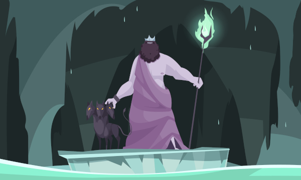

## PREPARAR TODO PARA JUGAR

Para jugar, necesitarás lo siguiente:

* Una baraja de póker sin comodines. Te ayudará a guiar la historia y los desafíos. Es tu **mazo de aventura**.
* 2 dados de 6 caras. Los usarás para realizar acciones dentro de la ficción y obtener respuestas acerca del mundo. Son tus dados de acción.
* Un cuaderno que te servirá como tu diario de viaje, donde escribir registrar tu historia.
* Tarjetas índice, tiras de papel o pósits.
* Un token cualquiera o una miniatura que represente a tu personaje para colocarlo sobre las cartas con las que crearás el mapa del mundo.

Baraja tu mazo de aventura y colócalo junto a los dados de acción, el diario de viaje y el resto de materiales.

### Crear tu incursor

Elige un nombre, los pronombres con los que te identificas y el nombre de tu amor. Tu personaje puede encarar los desafíos con tres estilos. Asigna al primer estilo +2, al segundo +1 y al tercero 0.

* **Fuerte** como Hércules.
* **Listo** como Ulises.
* **Embaucador** como Orfeo.

Por último decide donde empiezas tus andanzas con tirando 1d6.

* **El Elíseo (1),** el paraíso de los héroes
* **Los campos de asfódelos (4-5),** el lugar de las almas normales
* **El Tártaro (6),** el infierno de los malvados

## LA PARTIDA

### Realizar acciones

Las acciones dirigen tu travesía a través del mundo. Cada una de ellas te ayudan por sí misma a resolver las preguntas que tengas o lo que decidas hacer.

Al realizar una acción, sigue estos pasos:

* Roba 2 cartas de tu mazo de aventura.
* Haz una tirada con los 2 dados de acción y suma el valor de ambos.
* Añade cualquier modificador para obtener tu resultado.

Luego, interpreta el resultado y descarta las cartas usadas, a menos que la acción te indique usarlas:

* Si tu resultado es **mayor que la suma del valor de ambas cartas**, hay **Luz**.
* Si tu resultado es **mayor que el valor de una de las cartas**, hay **Penumbra**.
* De lo contrario, hay **Oscuridad**.

\sc

El as vale 1; la sota (J), 11; la reina (Q), 12; y el rey (K), 13. Cada tirada de acción se plantea como «acción + (modificador)», siendo este el valor de un estilo, el número de manzanas doradas o cualquier otro.

### Explorar el Mundo

Al comenzar, toma una carta del mazo de aventura, y colócala bocarriba sobre la mesa de juego. Es aquí donde te encuentras. Al proseguir tu viaje, añadirás más cartas al mapa del mundo. Cada carta representa una nueva región.

Para saber dónde situar las nuevas cartas que irás añadiendo al mapa, compara el número de la nueva carta con el de tu ubicación actual e interpreta el resultado.

* Si el **número de la nueva carta es mayor**, colócala **bocarriba en la parte superior**, conectada por una de las esquinas.
* Si el **número de la nueva carta es menor**, colócala **bocarriba en la parte inferior**, conectada por una de las esquinas.
* Si el **número de la nueva carta es igual**, colócala **a un lado** (las cartas solo se pueden unir por las esquinas, así que esta región podría quedar aislada del resto; para acceder a ella, deberás seguir descubriendo regiones).
* Si la nueva carta que colocas bocarriba **es un as**, has entrado en una **nueva zona del infierno**. Elige al azar a qué nueva zona llegas (par una zona, impar la otra).

Haz tiradas en las tablas generadoras, coloca pósits sobre las cartas para anotar detalles acerca de la región. Y escribir una entrada en tu diario por cada región.

### Recuperando los recuerdos

Para ubicar las memorias, haz Descubrir una Región. Si la carta que añades es una figura (jota, reina o rey), hay una.

### Descansar y fatiga

Cuando el track de fatiga se llena (los resultados de algunas acciones te obligan a marcar casillas de este) o el mazo de aventura se agota, es el momento de descansar; de lo contrario tu personaje terminaría por ver cómo su propia luz se extingue.

En un descanso, escribe una entrada extra en el diario de viaje, baraja las cartas descartadas durante tu travesía junto con las del mazo de aventura y borra la fatiga al completo.

### Combatir _démones_

Al buscar manzanas doradas, puedes encontrarte con _démones_. Para combatirlas, apila cartas tal y como se indica en los resultados de la acción Luchar contra un _demon_. 

Cuando el número de cartas de la pila sea igual a la vitalidad (VIT) del _demon_, este se desvanece y perece.
Si huyes de un _demon_, las cartas apiladas se mantienen hasta el próximo encuentro.
\sc

* **Demon menor (VIT 5):** Estos seres representan conceptos como vejez, miedo, pobreza y de esa forma te atormentan. Las picas (♠) valen el doble al ser apiladas.
* **Erinia/Furia (VIT 8):** Representan la venganza del crimen. Son mujeres aladas, con serpientes en su cabellera y portando una antorcha o un látigo. Las cartas negras (♠ ♣) valen el doble al ser apiladas.
* **Juez (VIT 10):** Estos hijos de Zeus juzgan las almas y deciden a que parte del Hades son enviados. Las cartas rojas (♦♥) valen el doble al ser apiladas.
* **Can cerbero (VIT 13):** El terrible sabueso de dos cabezas que nunca duerme y vigila las puertas del Más Allá. Los corazones (♥) valen el doble al ser apilados.

## LAS ACCIONES

### Afrontar el riesgo

Cuando te enfrentas al algo que entraña riesgo, acción + estilo.

* Con **Luz**, tienes un éxito total.
* Con **Penumbra**, tienes un éxito parcial.
* Con **Oscuridad**, tienes un contratiempo, marca **1 fatiga**.

### Buscar manzanas doradas

Las manzanas doradas son el alimento de los dioses y otorgan inmortalidad y dicha. Cuando buscas manzanas doradas, acción + estilo.

* Con **Luz**, hay **2 manzanas**.
* Con **Penumbra**, hay **1 manzana**.
* Con **Oscuridad**, hay un **_demon_**, marca **1 fatiga**.

### Comprar información

Puedes intercambiar manzanas doradas por conocimiento con las almas en pena y los pobladores del inframundo. Determina la cantidad de manzanas que vas a pagar y acción + manzanas.

* Con **Luz**, logras información detallada
* Con **Penumbra**, logras información incompleta.
* Con **Oscuridad**, logras información ambigua.

### Descubrir una región

Cuando buscas un nuevo camino, acción + estilo.

* Con **Luz**, añade las 2 cartas reveladas a tu mapa.
* Con **Penumbra**, añade 1 de las cartas reveladas a tu mapa.

* Con **Oscuridad**, el camino parece infranqueable. Añade 1 de las cartas reveladas al mapa, bocabajo, y marca **1 fatiga**. Para poder atravesarlo y voltear la carta, Comprar información o Afrontar el riesgo.

### Luchar contra un _demon_

Cuando te enfrentas a un _demon_, acción + estilo. Repite hasta que el número de cartas apiladas sea igual que su Vitalidad.

* Con **Luz**, apila las 2 cartas reveladas contra el _demon_.
* Con **Penumbra**, apila 1 de las cartas reveladas contra el _demon_.

\sp

* Con **Oscuridad**, haz la acción Evadir el peligro.

### Evadir el Peligro

Cuando evites una amenaza inminente, acción + estilo.

* Con **Luz**, evitas el peligro.
* Con **Penumbra**, marca **1 fatiga**.
* Con **Oscuridad**, marca **2 fatiga**.

### Conseguir una respuesta del oráculo

Cuando requieras respuestas de Sí/No: acción + 2 si es probable; acción + 0 si es improbable; acción + 1 si la probabilidad es equitativa.

* Con **Luz**, la respuesta es **“Sí, y…”**.
* Con **Penumbra**, la respuesta es **“Sí, pero…”**.
* Con **Oscuridad**, la respuesta es **“No, y…”**.

### Nombres

Si en algún momento al **escribir en tu diario el nombre de tu amor, no te acuerdas**, le habrás olvidado definitivamente y no recordarás porque estás en el Hades, así que tendrás que irte del inframundo.

Si en algún momento al **escribir en tu diario tu nombre, no lo recuerdas**, te quedarás atrapado en los dominios de Hades para toda la eternidad.

### Rememorar recuerdos

Cuando encuentres un recuerdo podrás rememorarlo, sacando una carta al azar de la pila descartada, ya que los recuerdos son cosas que ya han pasado. Según la carta puedes construir el recuerdo.

* Los corazones (♥) son recuerdos amorosos.
* Las picas (♠) recuerdos de enfrentamientos.
* Los tréboles (♣) hechos fortuitos.
* Los diamantes (♦) familia y amistad.

El valor de la carta también tiene un significado:

|Carta|Significado|Carta|Significado|
|---|---|---|---|
|As|Primer|8|Comodidad|
|2|Dudas|9|Expareja|
|3|Hogar|10|Último|
|4|Detalles|J|Enfermedad|
|5|Pobreza|Q|Guerra|
|6|Riqueza|K|Muerte|
|7|Regalos|--|--|

Así el As de corazones (Primer/ Amoroso) puede ser vuestro primer beso y el Rey de picas(Muerte/Enfrentamiento) un enfrentamiento mortal con otra persona por tú alma gemela.

\sc

### Tablas generadoras

|d66|Elíseo|Asfódelos|Tártaro|
|---|---|---|---|
|11|XXX|XXX|XXX|
|12|XXX|XXX|XXX|
|13|XXX|XXX|XXX|
|14|XXX|Estigia, el río del «odio»|XXX|
|15|XXX|XXX|XXX|
|16|XXX|XXX|XXX|
|21|XXX||XXX|XXX|
|22|XXX|Aqueronte, el río del «dolor»|XXX|
|23|XXX|XXX|XXX|
|24|XXX|XXX|Flegetonte, el río «ardiente»|
|25|XXX|XXX|XXX|
|26|XXX|XXX|Cocito, el río del «lamento»|
|31|XXX|XXX|XXX|
|32|XXX|XXX|XXX|
|33|XXX|XXX|XXX|
|34|XXX|XXX|XXX|
|35|XXX|XXX|XXX|
|36|XXX|XXX|XXX|
|41|XXX|XXX|XXX|
|42|XXX|Campo de lagrimas|XXX|
|43|XXX|XXX|XXX|
|44|XXX|XXX|XXX|
|45|XXX|XXX|XXX|
|46|XXX|XXX|XXX|
|51|XXX|XXX|Campo de cenizas|
|52|XXX|XXX|XXX|
|53|XXX|XXX|XXX|
|54|XXX|XXX|XXX|
|55|XXX|XXX|XXX|
|56|XXX|XXX|XXX|
|61|XXX|XXX|XXX|
|62|XXX|XXX|XXX|
|63|XXX|XXX|XXX|
|64|XXX|XXX|XXX|
|65|XXX|XXX|XXX|
|66|XXX|XXX|XXX|

&ast; solo puede haber uno

\sc

# En el Hades
&nbsp;

#### «En el Hades» es un juego de rol en solitario sobre mitología griega basado en Firelights .

&nbsp;

## Tu historia hasta ahora …

Has bajado al inframundo a **rescatar al amor de tu vida**. Tras muchos esfuerzos y penurias, Perséfone se ha apiadado de ti, ha aceptado tus hazañas, tus dones o tus halagos y te ha devuelto a tu amor perdido.

Pero hay trampa, tu persona amada no te recuerda. Hades le ha robado los 6 recuerdos más importantes que tenía de ti y de vuestro amor.

Antes de poder salir del Más Allá con tu alma gemela debes **adentrarte en el sombrío mundo de los muertos** con la antorcha que te ha entregado una _lámpade_, una ninfa del Más Allá, y recuperar todos los recuerdos importantes que tenía de ti y que Hades ha ocultado en su reino.

En tus andanzas serás acosado por _démones_, siervos demoníacos del señor del inframundo.

&nbsp;

> **Licencia:** Este trabajo se basa en Firelights, una creación de [Fari RPGs](https://farirpgs.com/), desarrollado y escrito por René-Pier Deshaies-Gélinas, y licenciado para nuestro uso bajo una licencia [Creative Commons Reconocimiento 4.0 Internacional](https://creativecommons.org/licenses/by/4.0/deed.es_ES)
