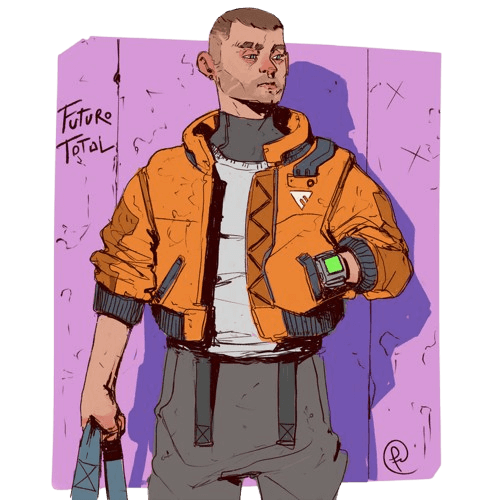
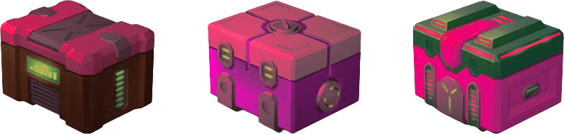

# Deliver the package 1.0.1 [by Gwannon](https://gwannon.itch.io/entrega-el-paquete-breathless)
**«Deliver the package» in a cyberpunk mini-setting for [Breathless](https://farirpgs.com/breathless/creator-kit), where you are a messenger who must deliver a package and dodge merc teams sent by enemy mega-corps to intercept you.**

```
In a hyper-technological world, the most effective way to prevent your information from being hacked is to keep it physical and basically move it. Remember, if it's online, it's hackable.
```

In "Deliver the Package", like any cyberpunk setting, information is power, and protecting it is essential, so much sensitive information is stored on paper or storage drives and it is moved physically rather than electronically.

That's why there are courier companies and independent messengers who transport this information from one place to another, risking their lives and even their bodies.

## Courier companies and independent messengers

Courier companies are quite atypical businesses compared to the prevailing capitalist system. They are usually co-ops of messengers, not businesses as we might think. Many began as groups of parkour riders or skaters practicing their sport in their alleys and receiving orders to quickly deliver food orders for a good tip.

Little by little, they became more professional, establishing rates and charging a monthly fee to rent a space where they could rest, store their equipment, and set up an office to receive orders. New messengers who join the cooperative pay an entry fee after their application to join the cooperative is accepted, and then a monthly fee to use the services.

Independent messengers are usually practitioners of disciplines such as parkour or skating who begin working as couriers to monetize their hobby, but without making it a way of life. If they want to pursue a profesionl career, they usually join a co-op.

## Parkour, skaters, BMX and other styles

Each messenger has its own way of moving quickly through the city. We have runners who practice parkour, skateboarders and inline skaters on their boards and skates, and cyclists on BMX bikes.

Companies often specialize in one type of movement and purchase equipment and hire professionals specialized in working in those disciplines, for example, physical therapists in the case of parkour or bicycle mechanics for BMX specialists.

[](https://www.deviantart.com/fernand0fc/art/Delivery-802145258 "Delivery By Fernand0FC")

## Hot contracts

Most deliveries are made by a single messenger. They pick up the package, transport it, and deliver it without incident. The contract is standard and is usually done online.

But occasionally, hot contracts arise. Dangerous deliveries are called hot contracts. They are usually negotiated face-to-face, pay large sums, and require the intervention of several messengers. Enemy megacorps will surely send their best agents to intercept the messengers and take the package from their cold hands.

```
These are the deliveries you'll be able to experience thanks to this little game, those hot contracts that can earn you chips like you've never seen before or simply kill you and leave your corpse in an alley surrounded by mangy, hungry rats.
```## System
«Deliver the Package» uses the [Breathless](https://farirpgs.com/breathless/creator-kit) system, modifying and expanding its rules to capture the crazy races you'll participate in to deliver the package to its destination.

### Checks

When doing something challenging, you make a check to see how it plays out. You only need to roll if what you are doing is risky. The GM first telegraphs the risk of your action. You then pick a skill or item, and roll the die that matches its rating.

If an ally helps you, they also make a check, but share the same risks as you. Take the highest die and interpret the result.

|Check|Result|
|---|---|
|1-2|You fail, and there’s an additional complication.|
|3-4|You succeed, but there’s a complication.|
|5+|You succeed. The higher the result, the better the effect.|

Being a messenger is hard. Everyone who rolled reduces the rating of the skill they used by one step. Skills cannot go lower than a d4.

**d12 ⇾ d10 ⇾ d8 → d6 → d4**

The GM can also disclaim decision-making by testing for luck. To do so, pick a die rating simply based on the odds of a thing happening, roll, and interpret the result as you see fit.

### Catch your Breath

To regain all your abilities, you must "catch your breath." This is a short rest to breathe, lower your heart rate, and consider your next move. To catch your breath, you must be **out of danger or hidden from enemies**.

When a messenger catches his breath, the GM looks at the scene and introduces a new complication for the group.

### Loot Checks

When the plot allows, you can make a looting roll to search for tools, spare parts, PowerWater™ bottles, etc. Be careful because you might come across things you didn't want, such as a group of mercs.

To make a looting roll, roll a d12 and consult the following table.

|1d12|Loot|
|---|---|
|1-2|Trouble is here…|
|3-4|There’s trouble ahead…|
|5-6|Add a d6 item.|
|7-8|Add a d8 item.|
|9-10|Add a d10 item or 1 PowerWater™|
|11-12|Add a d12 item or 1 PowerWater™|

If you are not sure what you get with the looting roll, you can roll a d20 on the following table.

|1d20|Equip|
|---|---|
|1|Protective Gear|
|2|Glue|
|3|Spare Parts|
|4|Duct Tape|
|5|Climbing Rope and Carabiners|
|6|Stimulant Drugs|
|7|Multi-Tool|
|8|Nylon Thread|
|9|Spray Paint|
|10|Barbed Wire|
|11|Industrial Lubricant|
|12|Binoculars|
|13|Ball Bearings|
|14|Shears|
|15|Chain|
|16|Steel Cutter|
|17|Bouncy Ball|
|18|Flashlight|
|19|Spray Cheese|
|20|Handheld Fire Extinguisher|

### Messenger bag

The items in your bandolier can be used in place of your skills. They start with a die level that decreases after each use. Once reduced to a d4, the item breaks, is lost, or disappears from history.

Only **3 items and 1 bottle of PowerWater™ can be carried in the bandolier**.

### Adrenaline rush

When things goes bad, you can use your adrenaline rush and **rolling with a d12** instead of using your current skill rank.

Once the adrenaline rush is spent, you can't use it again until you **catch your breath**.

### Fatigue

When you face a consequence as a result of one of your actions, the GM may decide that you receive 1 level of fatigue. If your character reaches 4 levels of fatigue, you are exhausted.

When you are exhausted, failing a dangerous action can range from **falling behind, losing the package** and possibly returning to base **without completing the delivery** to ending up **dead in an alley**.
#### PowerWater™

You can use a bottle of PowerWater™, the best energy drink on the market, to remove 2 fatigue points. Another option is to hide in a safe place for a while to remove 1 fatigue point.

### Your messenger

On your character sheet, fill your character's nickname, pronouns, and how they move (parkour, inline, skateboarding, BMX).

By default, skills have a d4 rating. Assign a d10, a d8, and a d6 to three skills you think your courier is good at.

Characters have a total of six skills:

* **Bash:** wreck, move, force.
* **Dash:** run, jump, climb.
* **Sneak:** hide, skulk, lurk.
* **Wander:** orient, pursue, shortcut.
* **Think:** perceive, analyze, repair.
* **Sway:** charm, manipulate, intimidate.

Finally, you have a **special piece of equipment, which starts with a d10 and represents your mode of movement**. This could be your running shoes, your bike, your skateboard, etc.
Unlike equipment, it returns to a d10 roll when you catch your breath and doesn't take up space in your bandolier, like a skill, but it can be broken, lost, or stolen like a piece of equipment.

At the start of each delivery, you'll also carry a random piece of equipment at d10 level in your bandolier.

[](https://www.deviantart.com/fernand0fc/art/moar-girls-form-a-dystopian-future-681146900 "Moar girls form a dystopian future By Fernand0FC")
## The deliveries
In "Deliver the Package," adventures are called deliveries. Deliveries have their own set of rules that make them chaotic and frantic.

### The contract

All deliveries start with a contract. Some are very simple, like transport a package from point A to point B, and you can make them as complicated as you like using these five vectors:* **The pickup point.** This is usually at the offices of the contracting megacorp, but it can even be a locker at the station or picking up something from the dry cleaners. Anything goes to throw off your rivals.
* **The delivery point.** Clearly other offices of the same megacorp. Be suspicious of any other option.
* **The time limit.** The megacorp always sets a time limit. The difference is how tight it is. The time limit can create more or less tension. As a tip, make your first deliveries with long deadlines; once you've got the system down, you can set shorter time limits.
* **The interest/value of the package.** The more valuable it is, the more resources rival megacorps will put into play.
* **Number of messengers and baits.** In most hot contracts, the megacorp pays for several messengers to go in groups so they can support each other and, if one falls, the surviving one can continue the delivery. They can also ask for extra messengers to act as baits, confusing the sent mercs.

Aside from the previous points, there are some addendums the megacorp may try to impose before signing the contract.

* Traceable package.
* Messenger secured to the package using explosive handcuffs or guillotine straps.
* Checkpoints. The client may require you to pass through certain checkpoints so they can monitor your progress.
* Health and/or life insurance for the messenger.
* Liability in case of loss of the package.
* Obligations and fines in case of breaking the contract by both parties.
* Recording of races with a personal camera to study the delivery and determine who attempted to intercept the shipment.
* Mode of movement to be used. They may request that you not ride bikes or that everyone ride on roller skates.

```
Writing a contract is a very quick way to put together a delivery that you then just need to add the details to give it flavor.
```

#### Negotiating the contract

> Negotiating a contract with those bastards of the megacorps is tough and dangerous. The messengers just run and jump. If I don't do my job right, everything goes to shit. I can make a suicidal delivery turn into a walk in the park. __Durante, contract negotiator__
Contract negotiation is something you can do as a GM outside of a game, and your messengers might suddenly receive it, grab their bandoliers, and hit the streets.

The other option is for your table to negotiate the contract with you. This negotiation can **work like a zero session**, where your table will help you create the game they want to play. However, try to leave things out that allow you to introduce unexpected elements. For example, you decide there will be checkpoints, but include a clause that they'll tell you the next one at each checkpoint, and reserve the option to surprise them with each checkpoint.

Remember that money isn't important in a game; it only shows the value of the package's contents. To give you an idea, 500 chips is a minor job; 10,000 chips will be a real mess.

### Don't ask about the package, just deliver it.

The package is the central plot point of each delivery. It's the object everyone wants and tries to get, and the funniest thing is that no one knows what's inside.

[](https://www.freepik.com/free-vector/game-futuristic-boxes-future-technology-chests_37077179.htm "Game futuristic boxes future technology chests by upklyak")

#### Package size

Packs come in three sizes:

* **Small enough to fit into a data chip.** You can hide it anywhere on your clothing or body, even swallow it if necessary.
* **Medium enough to fit into a shoehorn.** You can carry it in your shoulder bag and it takes up some space in your shoulder bag.
* **Big enough to fit into your shoulder bag.** It doesn't fit into your shoulder bag and you have to carry it in your hand.

When it doesn't fit into your shoulder bag, you have to carry it in your hand, and that gets in the way when you're trying to move. Just think, it's hard to climb a wall with one hand. Maybe you can make a rope harness or duct tape or some other trick.

To compensate for the problems with not fitting into the bandolier, when the package is large, it becomes **an item you can use in your deliveries with a d10 roll**. You can use it as a shield because it's armored, as a float because it's waterproof and floats, as a sled to slide down slides, as a battering ram to knock down a door, etc. By the time it reaches d4, the box is so damaged it's useless, but the contents are still safe.#### Don't Open the Package

This fundamental rule of deliveries can be a very interesting element to your adventure, and you should be able to play with it during deliveries.

The package buzzes, it's heavy, it's light, the mercs treat it like it's explosive, etc. Try to play with this so that when they're up to their necks, they'll want to say shit and open the package to find out why they're about to die.

Opening a package should be a rare occurrence and almost always part of the plot you've designed. So in really bad situations, knowing what's inside the package can give them negotiating leverage and move the story forward, but it will definitely break the contract, and that should have consequences.

> Under no circumstances open the package, don't even think about it, don't even dream about it... Never, never, never open it.__HeraGodness, veteran messenger__

#### Who's Carrying the Package?

The messenger carrying the package is often called a "ringer," and it's the most dangerous position, as the package makes them a target for all enemies. They may try to hide it, or they may have other messengers carrying decoy packages to fool the mercs. If your messengers are clever, they'll know how to take advantage of this disadvantage and use the "ringer" to distract the mercs while the rest of their teammates look for an exit.

If the package carrier tires and falls behind, the delivery is intercepted by the sent mercs, and the enemy megacorp gets what was inside.

If they haven't used up their adrenaline rush, the carrier can spend it to pass it to another messenger so they can continue the delivery.

There are deliveries that contractually require the messenger to secure the package with some kind of security device, such as **explosive handcuffs or cutting straps**. The messenger won't be able to pass the package to other colleagues, but they also can't lose it or have it stolen. They can only take it from them at the delivery point with a special code. If someone tries to break it or hack it, they'll most likely lose their hand, but in desperate situations, desperate measures are called for.

> This? This is aluminum foil. It wouldn't be the first time a megacorp tells me they didn't install a tracker, but they did. It's a serious breach of contract, but I'm the one taking the risk. __JackRunner, conspiracy theorist messenger__

By default, packages don't have trackers, but they can require it by contract. With a tracker, the contractor can track the package and trace it if it gets lost, but risks having their signal intercepted by enemy megacorps.

### Always Forward, Always Moving

The main philosophy of this game is «always forward, always moving». **Your players should always try to move forward, not stop and make a plan.** The plan is made as you move forward. You can only be stopped when you want to catch your breath.
Think of it this way: even when you're hiding, which is usually very static, you should keep moving forward.

If you come across a demonstration, steal a jacket and a cap, camouflage yourself among the people, and keep walking until you emerge on the other side of the crowd. If you take advantage of a garbage truck passing by to hide behind it, you should grab one of the bars and take off with it.

```
If you see that your messengers don't get this idea, you can apply the following rule to encourage them. If they roll any die while standing still, they have one less die level with a minimum of d4. There's no time to pick the lock, so you wrap your arm in your jacket, break the glass, open the latch, and keep running.
```

Even in moments of negotiation, you should move. When you're inside a conveni and shouting at the boss of the mercs surrounding the place, you should move to set up the smoke bomb with cleaning products to try to give them the slip.

#### No time for preparation.

Hot contractss are usually quick: a few texts, a few calls, and the race is on. You can be sitting quietly at the base in the rest zone, and suddenly your negotiator sticks a Post-it note on your forehead and says, "Get ready, you're the next."

Even if there was time to plan, there's no information to make a proper plan. When the work starts, you have almost no information. Just an address and four basic things: who's accompanying you, whether the package is large, and any special rules the client has set, such as cutting straps.

At the pickup point, they'll let you know everything you need to know for the delivery.

#### Deliveries wih time limit

Deliveries wih time limit are a way to **make missions more complicated** and put more pressure on your mesenagers. Deliveries wih time limit are **clocks you create at the beginning of the delivery with 4, 6, 8, 10, or 12 wedges**.

* When the package carrier receives one due to fatigue, you fill a spaces.
* When they catch their breath, you fill another.
* If you call base, you fill another cheese.

As long as you have spaces to fill, you're within the time limit. The moment **you have to fill a space and there's no free space, you've exceeded the time limit and failed**.

A clock with 4 spaces for wedges is very difficult to meet; with 12, there's no time problem unless the delivery goes seriously awry. If not specified, a job is considered to have 12 queues, which is almost as if there were no time limit.

At the GM's discretion, they may delete wedge if the actions taken by the messengers can be considered time-saving. If a messenger eludes their pursuers by taking a MetroMagLev train headed in their direction, they could make up for lost time and delete a wedge from the clock.

### Ladders and slides

Ladders and slides are events and situations that couriers will encounter along the way and will have to overcome if they want to make the delivery.

Sometimes they help, and other times they become an obstacle to overcome. It's all a matter of perspective. A dead end can be a deadly trap or, if you know how to climb well, a way to escape from pursuers who want to intercept the delivery.

|1d12|Obstacle|
|---|---|
|1|**Shootout between two rival gangs:** Two rival gangs are holed up behind several vehicles on both sides of the street, exchanging fire.|
|2|**Elevated train:** An elevated train is approaching your position. Perhaps you can jump on top of it and flee, perhaps it will give you a few seconds of concealment while you flee, or perhaps you can trick your enemies and have the train run over them.|
|3|**Flooded passage:** The only way to cross the 16-lane highway is through an underpass that is flooded with septic water.|
|4|**Row of vending machines:** There is a very long row of vending machines in the street. You can make a looting roll. If you roll a 1, you repeat the roll.|
|5|**Ambulance:** An ambulance with its lights on is heading towards you. If you hook onto it or climb on top of it, it could take you a long way.|
|6|**Procession:** Some sort of religious sect is holding celebrations in the street, and the entire area is jammed with devotees celebrating their beliefs.|
|7|**Bridge over the canal:** A narrow metal and cable bridge is the only way to cross the canal or other body of water.|
|8|**Alley:** You thought the path you took had a way out, but no, it's a dead end.|
|9|**Chinese New Year:** The street is filled with pedestrians watching a group of performers moving a giant Chinese dragon puppet.|
|10|**Major Fire:** Firefighters have blocked off traffic and are evacuating the area. There's a fire at a chemical plant that could break out at any moment.|
|11|**Cyberpsychopath:** A cyberpsychopath with a combat flamethrower and an explosive vest has blocked the street and is holding a nearby bus full of passengers hostage.|
|12|**Red Carpet:** You come across an «idorus» event. The street is lined with armored limousines carrying celebrities who stop for a few minutes on the red carpet to stroll down it. The rest of the street is filled with people looking for selfies with their «idorus».|
### Mercs and megacorps

[](https://www.deviantart.com/fernand0fc/art/Corporate-level-bodyguard-803579124 "Corporate level bodyguard By Fernand0FC")

Merc groups are your messengers' greatest nemesis. They'll give you no quarter and start shooting as soon as you're within range, and they won't rest until they get the package for their clients.

In «Deliver the Package», there are no combat skills; you can't face these heavily armed mercenaries, who are more equipped with cyber implants than flesh. You can only dodge or trick them and continue advancing to the delivery point.

Just because you don't have weapons doesn't mean you can't take them out. If you're good, you can lure them to a flooded area and throw a power line into the water.

And who's to say it didn't occur to you, while escaping through a restaurant kitchen, to turn on the gas vents on the stove so everything would explode when the gang of mercs chasing you entered?

#### Creating Merc Bands

```
Merc bands always have a name, a theme (they're samurai, they're super professionals, etc.) and finally an aesthetic (they're bald or shaved, they wear hockey masks, etc.) Have the 3 concepts ready, so it doesn't look like you just made it up.
```

If you want to give it more life, you should **define a strength, something they're good at, and a weakness, something they're not good at**. Your messengers won't be able to defeat them by facing their strength and can use their weakness to get rid of them. They can use their Interact or Think ability to try to figure out their strength and weakness.

The Silver Shadows are a team of mercs who act like ninja assassins. They wear black tactical gear and cover their faces with a hood and silver mask. As good ninjas, they're very good at ambushing, but they only fight in close combat, so running away from them leaves them few options. If they don't stop you with the first hit, you'll be able to escape them.

#### Enter the mercs

Mercs typically have three modes of action.

* **Direct Action:** They hunt you down and use everything they have to stop you.
* **Ambushes and Traps:** They set up ambushes or trap you. This option requires additional information about the delivery that allows them to know where you will be passing through.
* **Finding a Way for You to Come to Them:** They can do anything from trying to bribe you with huge amounts of chips to kidnapping a loved one or capturing a comrade who was with you on the delivery. They will try to arrange a negotiation that may or may not end well or in betrayal.

Mercs don't go into action from the first minute of the delivery. The first problems should be ladders and slides; there will be time to dodge armor-piercing bullets and monofilament blades later.

They should normally start appearing about a third of the way through the clock if they are looking for direct action, and about halfway through the clock if they are taking other forms of action. From that moment on they could come and go unless you consider that your messages have gotten rid of them.

#### What if I call the police?

> A.C.A.B. All Cops Are Bastards __Street graffiti__

The police are bought and are not your friends. Do not call them under any circumstances unless you want another armed group after you.

### Traps

> There are always traps. Another thing is that you don't see it. __HeraGodness, veteran messenger__

We've already said that **the mercs can try to set up ambushes and traps** and, since they have the resources, they can be as complex and expensive as you want with spy drones, sensors, gyrojets, snipers, automatic position weapons, whatever you want, but **always with a way to evade or escape from them**.

Think that the money that the contract costs will determine the resources of the merchants that will intervene in the delivery.

But your messengers will also be able to play that game, but with much fewer resources and in a much simpler way. We talk about ball bearings, homemade explosives and heavy things falling from the sky.

**The traps are going to need equipment** and the more complex they are, the more equipment you will need and the more people working on them. A simple trap can be to take out the bottle of lube while running and spray it on the ground to make your pursuers slip.
A more complex trap could be that one messenger empties a bottle of flammable liquid under a car and another ties a flare to the car door so that it lights up when the door is opened and lights everything up.

For the trap to work, **all of each participant's equipment rolls must be successful**.

### Low tech

> My mother always said «metal sinks, flesh floats». __Goldmill, messengers trainer__

The world of courier service is a world where technology has not entered. If you don't trust technology to send your information, you also can't trust messages filled with cyber implants and high-tech equipment.

The messengers tend to be the people in the city with the least chromes on their bodies, removing piercings and nails from the bones. Cyberimplants are hackable, they are traceable, they are detectable, they need specialized equipment to repair them, etc. 

Think that in a world of cyberimplants, everything is designed to combat this technology and the mercenaries cybernetically enhanced are trained to confront people with them. What could be a very clear disadvantage to some extent becomes an advantage.

Instead of implants, you can consider that your couriers are exceptional in their types of movements and that they replace the extra abilities that cybernetycs could give them with their cunning instincts.

Communications are verbal, no earpieces, messages or video calls, nothing that can be hacked electronically. They use their messenger slang to “encrypt” their communications and shout orders, plans and warnings to each other.

If they need to talk to the base, they have loose chips to call from an armored inter-cabin. And it is not the first time that they steal a cell phone from a careless passer-by while running away from a gang of mercs.

#### Messenger slang

As we have already said, the messengers use their own slang, a secret language specific to each cooperative, with which they communicate during missions. It has been developing over the years and does not stop evolving with the new people who enter.

They are not complicated terms to understand, with a little time any trained AI could decipher them, but they are convoluted enough that a bunch of mercs full of combat synthdrugs will not know what escape plan you are plotting while they hold you in an alley with a rain of bullets.

```
Let them gradually invent that jargon in their interactions and then integrate it into their dialogues.
```

### Call the base

> Calling the base is for cowards. Are you a coward? __Jeindal, retired messenger__

When the situation is terrific, you can call the base for help.

From the base they will be in charge of sending a group of ronins to clean the area, a flock of drones to clear the way for you, or even a gyrojet to take you out of there and leave you safe on a nearby rooftop.

Calling base is an exceptional option that can only be done when there is no other recourse. 

This assumes that **all of your messengers have spent their adrenaline shots, have no equipment items, have no PowerWater™ left, and the group has more than 50% of their total fatigue spent**.

Calling the base has a cost and that is that you will surely **owe someone a favor** and everyone knows that in a cyberpunk setting owing a favor means bigger problems in the future.

### Cyberpunk hints

Here are some cyberpunk hints that can help set the mood for your deliveries.

* It always has to **rain at the most inopportune moment**.
* **There's always a lot of action in the city**, and the group of mercs following you isn't unique. The sound of militarized mobile ICUs is constant, and around any corner, there could be a shootout.
* The routes won't always go through dark, dirty places; sometimes you'll **go through elegant, expensive places**. Who says you can't end up in a library or a museum?
* There are **street food stands everywhere** and they cook everything. What better way to catch your breath than slurping some noodles hidden behind the curtains of a small ramen-ya, while a bunch of mercs are looking for you outside.
* There are **ads and comercials everywhere**, even on your clothes there may be sponsor logos. Surely the marketing people have taken the opportunity to put Megacorp logos on the package in case your chase or the shootout in which you are going to die is recorded and appears on the Internet.
* **Drugs are easy to get**, some illegal and others legal. It is very easy to find someone who sells the legal ones or a vending machine that dispenses the illegals.
* **Everything is under construction.** The street that was walkable yesterday is a hole in the ground today. It is impossible that on a block there is not a building with a scaffolding that does not allow you to climb to the roof to escape danger (and find a new one).
* There will always **a way to hold onto to keep moving forward**. A pipe to go down, cables to climb down, or streetlights to jump over and then land safely on the ground.
* The **booths and vending machines** are bulletproofed, so they are a **perfect shelter** for your messengers. In addition, they weigh a ton so moving or pushing them, even with a vehicle, is complicated.

> It could be worse, it could rain. - __Igor «Young Frankenstein»__

### Delivery seeds

Maybe these delivery seeds will give you ideas to create your own.

* The entire **city is in a state of chaos for musical superstar DiByne's concert**: crowded streets, traffic jams, drugged-up partygoers, etc. And the CEO of VultureTech hasn't come up with a better idea than to send a very special package to DiByne, of whom she's a huge fan. You'll have to get to the stadium and sneak backstage to make the delivery, evading the fans and their bodyguards.
* A fellow messenger is hiding in an alley. They have a **broken leg and needs someone to replace them**, so they've called base, and they're sending you in as reinforcements. You'll have to rescue them, take them to a safe place, and complete the delivery.
* Every year around this time, "The Race" takes place. DelivaTeam, one of the biggest companies in the delivery industry, is holding **a competition to find the best messenger in town**. There are several scoring tests that simulate a very hot delivery, and the highest score wins. The suspicion of a scam is always present, as DelivaTeam messengers always win.
* The **package you're carrying is making strange noises and doesn't look right.** The contract negotiation was already weird, and this doesn't make it any better. It could be a bomb or some other kind of trap. Or maybe it's something alive. The truth is, you don't know, but maybe you should open the package and clear up any doubts.
* Today it's **training for the newcomers**. You'll be accompanied by a group of newly hired messengers so you can show them the ropes. What could go wrong?

[](https://www.deviantart.com/dana-ulama/art/D-hinghara-Diner-895072505 "D'hinghara Diner By Dana-Ulama")

## Epilogue
### Messenger sheet

|MessengerSheet.html|

### Contract sheet

|ContractSheet.html|### Sources

If you're looking for inspiration for your deliveries, these are some of the works that help me to develop "Deliver the Package".

* **Virtual Light (The Bridge Trilogy) by William Gibson.** Everyone is chasing a messenger who has obtained a virtual reality headset containing important corporate information.
* **Burning Chrome by William Gibson.** In this collection of short stories, we find the story of Johnny Mnemonic, a corporate courier who carries important data about a megacorp in his brain.
* In the video game **Mirror's Edge by EA**, a network of runners, including the main character, Faith, transmit messages between rebel elements while evading government and corporate surveillance.
### Useful Terms

This list of slang terms can help you set the mood for your messengers and can be used by your couriers to create their own.

* **Plates:** Mercenaries loaded with cyber implants and weapons.
* **Charlie:** Checkpoint, comes from Checkpoint Charlie.
* **Happily Ever After:** When you have to carry a package handcuffed to your hand.
* **Megacorp:** Megacorporation.
* **Merc:** Mercenary.
* **Pigeons:** Flying spy drones that follow you.
* **Hot Potato:** A dangerous package that everyone wants to get their hands on.
* **Cold/Hot Pizza:** Hot pizza is when the delivery has a time limit, and cold pizza is when it doesn't.
* **Ringer:** A messenger who carries the treasure, I mean, the package.
* **Tagged:** Wearing a tracker.### License 

This work is based on Breathless, product of [Fari RPGs](https://farirpgs.com), developed and authored by René-Pier Deshaies-Gélinas, and licensed for our use under the [Creative Commons Attribution 4.0 License](https://creativecommons.org/licenses/by/4.0/).

«Deliver the package» is developed under the [CC BY 4.0](https://creativecommons.org/licenses/by/4.0/legalcode.en) license. All the source code can be found at [GitHub/ideasRoleras/EntregaElPaquete](https://github.com/gwannon/ideasRoleras/tree/main/EntregaElPaquete)

* Red and black patterned background vector by [rawpixel.com](https://www.freepik.com/free-vector/red-black-patterned-background-vector_3463974.htm)
* Game futuristic boxes future technology chests by [upklyak](https://www.freepik.com/free-vector/game-futuristic-boxes-future-technology-chests_37077179.htm)
* Delivery By [Fernand0FC](https://www.deviantart.com/fernand0fc/art/Delivery-802145258) bajo licencia [Creative Commons Attribution 3.0 License](https://creativecommons.org/licenses/by/3.0/deed.es)
* Corporate level bodyguard By [Fernand0FC](https://www.deviantart.com/fernand0fc/art/Corporate-level-bodyguard-803579124) bajo licencia [Creative Commons Attribution 3.0 License](https://creativecommons.org/licenses/by/3.0/deed.es)
* moar girls form a dystopian future By [Fernand0FC](https://www.deviantart.com/fernand0fc/art/moar-girls-form-a-dystopian-future-681146900) bajo licencia [Creative Commons Attribution 3.0 License](https://creativecommons.org/licenses/by/3.0/deed.es)
* Some ideas have been taken from *[**Apocalyptic Delivery Men**](https://reroll.itch.io/1pag-cotarpg), a one-page game where you play with delivery men in a post-apocalyptic world.
* D'hinghara Diner By [Dana-Ulama](https://www.deviantart.com/dana-ulama/art/D-hinghara-Diner-895072505) bajo licencia [Creative Commons Attribution-NonCommercial-No Derivatives Works 3.0 License](https://creativecommons.org/licenses/by-nc-nd/3.0/deed.es)[](https://farirpgs.com/breathless/creator-kit "This game is Breathless")