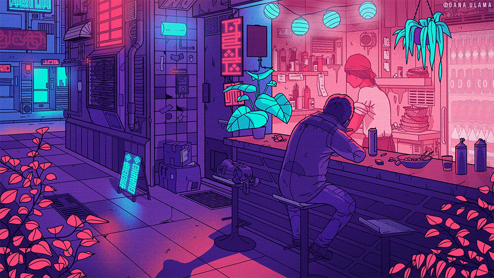

\sinc

# Deliver the package 1.0.1 [by Gwannon](https://gwannon.itch.io/entrega-el-paquete-breathless)

\conc

**«Deliver the package» in a cyberpunk mini-setting for [Breathless](https://farirpgs.com/breathless/creator-kit), where you are a messenger who must deliver a package and dodge merc teams sent by enemy mega-corps to intercept you.**

```
In a hyper-technological world, the most effective way to prevent your information from being hacked is to keep it physical and basically move it. Remember, if it's online, it's hackable.
```

In "Deliver the Package", like any cyberpunk setting, information is power, and protecting it is essential, so much sensitive information is stored on paper or storage drives and it is moved physically rather than electronically.

That's why there are courier companies and independent messengers who transport this information from one place to another, risking their lives and even their bodies.

## Courier companies and independent messengers

Courier companies are quite atypical businesses compared to the prevailing capitalist system. They are usually co-ops of messengers, not businesses as we might think. Many began as groups of parkour riders or skaters practicing their sport in their alleys and receiving orders to quickly deliver food orders for a good tip.

Little by little, they became more professional, establishing rates and charging a monthly fee to rent a space where they could rest, store their equipment, and set up an office to receive orders. New messengers who join the cooperative pay an entry fee after their application to join the cooperative is accepted, and then a monthly fee to use the services.

Independent messengers are usually practitioners of disciplines such as parkour or skating who begin working as couriers to monetize their hobby, but without making it a way of life. If they want to pursue a profesionl career, they usually join a co-op.

## Parkour, skaters, BMX and other styles

Each messenger has its own way of moving quickly through the city. We have runners who practice parkour, skateboarders and inline skaters on their boards and skates, and cyclists on BMX bikes.

Companies often specialize in one type of movement and purchase equipment and hire professionals specialized in working in those disciplines, for example, physical therapists in the case of parkour or bicycle mechanics for BMX specialists.

[](https://www.deviantart.com/fernand0fc/art/Delivery-802145258 "Delivery By Fernand0FC")

## Hot contracts

Most deliveries are made by a single messenger. They pick up the package, transport it, and deliver it without incident. The contract is standard and is usually done online.

But occasionally, hot contracts arise. Dangerous deliveries are called hot contracts. They are usually negotiated face-to-face, pay large sums, and require the intervention of several messengers. Enemy megacorps will surely send their best agents to intercept the messengers and take the package from their cold hands.

```
These are the deliveries you'll be able to experience thanks to this little game, those hot contracts that can earn you chips like you've never seen before or simply kill you and leave your corpse in an alley surrounded by mangy, hungry rats.
```

\sp

\sinc

## System

\conc

«Deliver the Package» uses the [Breathless](https://farirpgs.com/breathless/creator-kit) system, modifying and expanding its rules to capture the crazy races you'll participate in to deliver the package to its destination.

### Checks

When there's a challenge to overcome, you roll to see how it plays out. You only need to roll if what you want to do is risky.

The GM announces that your action may be risky and dangerous; you then choose a skill and roll the corresponding die. If a teammate helps you, they also roll, and you both take the same risks. The GM takes the highest roll and interprets the result.

|Check|Result|
|---|---|
|1-2|You fail, and there’s an additional complication.|
|3-4|You succeed, but there’s a complication.|
|5+|You succeed. The higher the result, the better the effect.|

Being a messenger is difficult. Each roll reduces the skill score used by one level to a minimum of d4:

**d12 ⇾ d10 ⇾ d8 → d6 → d4**

If desired, the GM can leave a game decision up to chance. Simply choose a die based on the probability of something happening, roll, and interpret the result.

### Catch your Breath

To regain all your abilities, you must "catch your breath." This is a short rest to breathe, lower your heart rate, and consider your next move. To catch your breath, you must be **out of danger or hidden from enemies**.

When a mensaka catches his breath, the GM observes the situation and presents a new complication to the group.

### Loot Checks

When the plot allows, you can make a looting roll to search for tools, spare parts, PowerWater™ bottles, etc. Be careful because you might come across things you didn't want, such as a group of mercs.

To make a looting roll, roll a d12 and consult the following table.

|1d12|Loot|
|---|---|
|1-2|Trouble is here…|
|3-4|There’s trouble ahead…|
|5-6|Add a d6 item.|
|7-8|Add a d8 item.|
|9-10|Add a d10 item or 1 PowerWater™|
|11-12|Add a d12 item or 1 PowerWater™|

If you are not sure what you get with the looting roll, you can roll a d20 on the following table.

|1d20|Equip|
|---|---|
|1|Protective Gear|
|2|Glue|
|3|Spare Parts|
|4|Duct Tape|
|5|Climbing Rope and Carabiners|
|6|Stimulant Drugs|
|7|Multi-Tool|
|8|Nylon Thread|
|9|Spray Paint|
|10|Barbed Wire|
|11|Industrial Lubricant|
|12|Binoculars|
|13|Ball Bearings|
|14|Shears|
|15|Chain|
|16|Steel Cutter|
|17|Bouncy Ball|
|18|Flashlight|
|19|Spray Cheese|
|20|Handheld Fire Extinguisher|

### Messenger bag

The items in your bandolier can be used in place of your skills. They start with a die level that decreases after each use. Once reduced to a d4, the item breaks, is lost, or disappears from history.

Only **3 items and 1 bottle of PowerWater™ can be carried in the bandolier**.

### Adrenaline rush

When things get tough, you can try tapping into your adrenaline rush and **rolling with a d12** instead of using your current skill rank.

Once the adrenaline rush is spent, you can't use it again until you **catch your breath**.

### Fatigue

When you face a consequence as a result of one of your actions, the GM may decide that you receive 1 level of fatigue. If your character reaches 4 levels of fatigue, you are exhausted.

When you are exhausted, failing a dangerous action can range from **falling behind, losing the package** and possibly returning to base **without completing the delivery** to ending up **dead in an alley**.

\sp

#### PowerWater™

You can use a bottle of PowerWater™, the best energy drink on the market, to remove 2 fatigue points. Another option is to hide in a safe place for a while to remove 1 fatigue point.

### Your messenger

On your character sheet, write down your character's nickname, pronouns, and how they move (parkour, inline, skateboarding, BMX).

All skills are scored on d4, and you should assign a d10, a d8, and a d6 to three skills you think your character excels at.

Characters have a total of six skills:

* **Bash:** wreck, move, force.
* **Dash:** run, jump, climb.
* **Sneak:** hide, skulk, lurk.
* **Wander:**  orient, pursue, shortcut.
* **Think:** perceive, analyze, repair.
* **Sway:** charm, manipulate, intimidate.

Finally, you have a **special piece of equipment, which starts with a d10 and represents your mode of movement**. This could be running shoes, your bike, your skateboard, etc.

\sc

Unlike equipment, it returns to a d10 roll when you catch your breath and doesn't take up space in your bandolier, like a skill, but it can be broken, lost, or stolen like a piece of equipment.

At the start of each delivery, you'll also carry a random piece of equipment at d10 level in your bandolier.

[](https://www.deviantart.com/fernand0fc/art/moar-girls-form-a-dystopian-future-681146900 "Moar girls form a dystopian future By Fernand0FC")

\sinc

## Las entregas

\conc


In "Deliver the Package," adventures are called deliveries. Deliveries have their own set of rules that make them chaotic and frantic.

### The contract

All deliveries start with a contract. Some are very simple, getting the package from point A to point B, and you can make them as complicated as you like using these five vectors:

* **The pickup point.** This is usually at the offices of the contracting megacorp, but it can even be a locker at the station or picking up something from the dry cleaners. Anything goes to throw off your rivals.
* **The delivery point.** Clearly other offices of the same megacorp. Be suspicious of any other option.
* **The time limit.** The megacorp always sets a time limit. The difference is how tight it is. The time limit can create more or less tension. As a tip, make your first deliveries with long deadlines; once you've got the system down, you can set shorter time limits.
* **The interest/value of the package.** The more valuable it is, the more resources rival megacorps will put into play.
* **Number of messengers and baits.** In most hot contracts, the megacorp pays for several messengers to go in groups so they can support each other and, if one falls, the surviving one can continue the delivery. They can also ask for extra messengers to act as baits, confusing the sent mercs.

Aside from the previous points, there are some addendums the megacorp may try to impose before signing the contract.

* Traceable package.
* Messenger secured to the package using explosive handcuffs or guillotine straps.
* Checkpoints. The client may require you to pass through certain checkpoints so they can monitor your progress.
* Health and/or life insurance for the messenger.
* Liability in case of loss of the package.
* Obligations and fines in case of breaking the contract by both parties.
* Recording of races with a personal camera to study the delivery and determine who attempted to intercept the shipment.
* Mode of movement to be used. They may request that you not ride bikes or that everyone ride on roller skates.

```
Writing a contract is a very quick way to put together a delivery that you then just need to add the details to give it flavor.
```

#### Negociar el contrato

> Negociar un contrato con eses cabrones de las megacorps sí que es duro y peligroso. Les mensakas solo corren y dan saltitos. Si yo no hago bien mi trabajo, todo se va a la mierda. Yo consigo que una entrega suicida se convierta en un paseo por el parque. __Durante, negociadore de contratos__

\sp

La negociación del contrato es algo que puedes hacerlo como DJ fuera de partida y que tus mensakas lo reciban de repente, cojan sus bandoleras y salgan a patearse las calles.

La otra opción es que tu mesa negocie el contrato en conjunto contigo. Esta negociación puede **funcionar como una sesión 0**, donde tu mesa va a ayudarte a crear la partida que quieren jugar, aun así trata de dejar cosas fuera que te permitan meter elementos inesperados. Por ejemplo, decidís que haya puntos de control, pero mete tu cláusula de que en cada punto te dirán el siguiente y resérvate la opción de sorprenderles con cada punto de control.

Recuerda que la pasta no es importante en partida, solo muestra el valor del contenido del paquete. Por darte una idea, 500 chips es un trabajillo menor, por 10.000 chips se va a montar una buena.

### No preguntes por el paquete, solo entrégalo

El paquete es el eje central de la trama de cada entrega. Es el objeto que todos quieren y tratan de conseguir y lo más divertido es que nadie sabe qué hay dentro. 

[](https://www.freepik.com/free-vector/game-futuristic-boxes-future-technology-chests_37077179.htm "Game futuristic boxes future technology chests by upklyak")

#### Dimensiones del paquete

Los paquetes pueden tener 3 tamaños:

* **Pequeño como un Chip de datos.** Puedes esconderlo en cualquier parte de tu ropa o de tu cuerpo, incluso tragártelo, si fuera necesario.
* **Medio como una caza de zapas.** Puedes llevarlo en la bandolera y te ocupa un espacio de bandolera.
* **Grande como para no entrar en la bandolera.** No entra en tu bandolera y tienes que llevarlo en la mano.

Cuando no entra en la bandolera, tienes que llevarlo en la mano y eso hace que te moleste cuando tratas de moverte. Piensa que es complicado escalar un muro con una sola mano. Quizás puedas hacer un arnés de cuerda o cinta americana o algún otro tipo de trucos.

Para compensar los problemas que supone que no entre en la bandolera, cuando el paquete es grande, se convierte en **un objeto que puedes usar en tus entregas con un d10**. Puedes usarlo como escudo porque está blindado, como flotador porque es estanco y flota, como trineo para deslizarte por cuestas, como ariete para tirar una puerta, etc. Cuando llega a d4, la caja está tan dañada que no sirve de nada, pero el contenido sigue a salvo.

#### No abras el paquete

Esta regla fundamental de las entregas puede ser un elemento muy interesante para tu aventura y deberías poder jugar con ello durante las entregas.

El paquete zumba, pesa mucho, pesa poco, les mercs lo tratan como si fueran explosivo, etc. Trata de jugar con esto y que cuando estén hasta en cuello tengan ganas de mandarlo todo a la mierda y abrir el paquete para saber por qué están a punto de palmarla.

Abrir en paquete debería ser algo excepcional y casi siempre parte de la trama que hayas diseñado. Así que en situaciones muy chungas, saber lo que hay dentro del paquete puedes darles capacidad de negociación y hacer avanzar la historia, pero desde luego romperá el contrato y eso debería traer consecuencias.

> Bajo ningún concepto mires que hay dentro del paquete, ni lo pienses, ni sueñes con hacerlo, … Nunca, nunca, nunca lo abras. __HeraGodness, mensaka veterana__

#### ¿Quién lleva el paquete?

Le mensaka que lleva el paquete se le suele llamar «ringer», y **es el puesto más peligroso**, ya que el paquete le convierte en el objetivo de todes les enemigues. Puede intentar ocultarlo o que haya otres mensakas con paquetes señuelos para engañar a les mercs. Si tus mensakas son astutes, sabrán aprovechar esta desventaja y usar al «ringer» para distraer a les mercs mientras el resto de compañeres buscan una salida.

**Si le portadore del paquete se agota y se queda atrás, la entrega es interceptada** por les mercs enviades y la megacorp enemiga consigue lo que había dentro.

Si no ha gastado su chute de adrenalina, le portadore puede gastarlo para pasárselo a otre mensaka y que este siga la entrega.

Hay entregas que por contrato exigen que le mensajere lleve sujeto el paquete con algún tipo de artilugio de seguridad, tipo **esposas explosivas o cinchas cortadoras**. Le mensajere no podrá pasar el paquete a otros compañeres, pero tampoco podrá perderlo o se lo podrán robar. Solo podrán quitárselo en el punto de entrega con algún código especial. Si se intenta romper o hackear lo más seguro es que pierda la mano, pero a situaciones desesperadas, medidas desesperadas.

> ¿Esto? Esto es papel de aluminio. No será la primera vez que una megacorp me dice que no ha puesto un rastreador y si lo ha puesto. Es un grave incumplimiento de contrato, pero el que se la juega soy yo. __JackRunner, mensaka conspiranoico__

Por defecto, los paquetes no llevan rastreadores, pero pueden exigirlo por contrato. Con un rastreador le contratante puede seguir el paquete y rastrearlo si se pierde, pero se arriesga a que las megacorps enemigas intercepten su señal.

### Siempre hacia adelante, siempre moviéndote

La filosofía principal de este juego es «siempre hacia delante, siempre moviéndote». **Tus jugadoras y jugadores deben tratar de ir siempre hacia adelante, nada de pararse a trazar un plan.** El plan se hace mientras avanzas. Solo te pueden parar cuando quieras recuperar el resuello.

\sp

Piénsalo así, incluso cuando te escondes, algo normalmente muy estático, deberías seguir avanzado.

Si te cruzas con una manifestación, robas una chaqueta y una gorra, te camuflas entre la gente y sigues caminando hasta que sales al otro lado de la multitud. Si aprovechas a qué pase un camión de la basura para ocultarte detrás, deberías agarrarte a una de las barras y largarte con él.

```
Si ves que tus mensakas no pillan esta idea, puedes aplicar la siguiente regla para animarles. Si tiran cualquier dado estando parados, tienen un nivel menos de dado con un mínimo de d4. No hay tiempo de abrir la cerradura con las ganzúas, enrollas el brazo en la chaqueta, rompes el cristal, abres el pestillo y sigues corriendo.
```

Incluso en momentos de negociación deberías moverte. Cuando estás dentro en un convini y hablas a gritos con le jefe de les mercs que rodean el local, deberías moverte para montar la bomba de humo con productos de limpieza con la que intentarás darles esquinazo.

#### No hay tiempo de preparación

Los contratos calientes normalmente son rápidos, unos mensajes, unas llamadas y empieza la carrera. Puedes estar tranquilamente en la base en la zona de descanso y de repente vuestre negociadore te pega un post-it en la frente y te dice «Calienta que sales a jugar».

Aunque hubiera tiempo de planear, no hay información para hacer un plan adecuado. Cuando empieza el curro apenas tienes info. Solo una dirección y cuatro cosas básicas: quién te acompaña, si el bulto es grande y alguna regla especial que ha puesto le cliente como cinchas cortadoras.

En el punto de recogida, te avisarán de todo lo que necesites y debas saber para la entrega.

#### Entregas con límite de tiempo

Los límites de tiempo son una forma de **complicar las misiones** y meter más presión a tus mensakas. Los límites de tiempo son **relojes que creas al principio de la entrega con 4, 6, 8, 10 o 12 quesitos**. 

* Cuando el portador del paquete recibe uno de cansancio, rellenas un quesito.
* Cuando recupera el resuello, rellenas otro. 
* Si llamas a la base, rellenas otro quesito. 

Mientras tengas quesitos que rellenar estás dentro del límite de tiempo. En el momento que tengas que **rellenar un quesito y haya no espacio libre, habrás sobrepasado el límite de tiempo** y habrás fracasade.

Un reloj con 4 espacios es muy complicado de cumplir, con 12 no hay ningún problema de tiempo a no ser que se tuerza mucho la entrega. Si no se especifica, se considera que un trabajo tiene 12 quesitos, que es casi como si no hubiera un límite.

A discreción de le DJ, este puede borrar quesitos si las acciones tomadas por les mensakas pueden considerarse que han ahorrado tiempo. Si une mensaka da esquinazo a sus perseguidores tomando un tren en el MetroMagLev que va en su dirección, podría recuperar tiempo perdido y borrar un quesito del reloj. 

### Toboganes y escaleras

Los toboganes y las escaleras son eventos y situaciones que les mensajeres se van a encontrar en su camino y tendrán que afrontar si quieren realizar la entrega.

A veces ayudarán y otras se convertirán en un obstáculo a superar. Todo es cuestión de perspectiva. Un callejón sin salida puede ser una trampa mortal o, si sabes escalar bien, una forma de dar esquinazo a les perseguidores que quieren interceptar el envío.

|1d12|Obstáculo|
|---|---|
|1|**Tiroteo entre dos bandas rivales:** Dos bandas rivales están parapetadas tras varios vehículos a ambos lados de la calle y no paran de intercambiar disparos.|
|2|**Tren elevado:** Un tren elevado se acerca a tu posición, quizás puedas saltar encima y huir, quizás te dé unos segundos de ocultación mientras huyes o tal vez puedas engañar a tus enemigues y hacer que el tren les arrolle.|
|3|**Paso inundado:** La única forma de cruzar la autopista de 16 carriles es un paso subterráneo que está inundado de aguas sépticas.|
|4|**Fila de máquinas de vending:** En la calle hay una larguísima fila de máquinas de vending. Puedes hacer una tirada de saqueo. Si sale un 1 repites la tirada.|
|5|**Ambulancia:** Una ambulancia con las luces puestas va en vuestra dirección. Si os engancháis a ella u os subís encima podría haceros avanzar mucho.|
|6|**Procesión:** Algún tipo de secta religiosa está haciendo celebraciones en la calle y está toda la zona colapsada por devotes celebrando sus creencias.|
|7|**Puente sobre el canal:** Un estrecho puente de metal y cable es la única forma de cruzar el canal u otra superficie de agua.|
|8|**Callejón:** Creías que el camino que habías cogido tenía salida, pero no, es un callejón sin salida.|
|9|**Año nuevo chino:** La calle está llena de viandantes observando a un grupo de artistas que hacen moverse una gigantesca marioneta de un dragón chino.|
|10|**Gran incendio:** Los bomberos han cortado el paso y está evacuando la zona, hay un incendio en una planta química y puede estallar en cualquier momento.|
|11|**Ciberpsicopata:** Une ciberpsicopate con un lanzallamas de combate y un chaleco de explosivos ha cortado la calle y usa de rehenes un bus cercano lleno de pasajeres.|

\sp

|1d12|Obstáculo|
|---|---|
|12|**Alfombra roja:** Te encuentras con un evento de «idorus». La calle está llena de limusinas blindadas donde van les famoses que paran unos minutos en la alfombra roja para que se paseen por ella. El resto de la calle está lleno de gente buscando selfies con sus «idorus».|

### Mercs y megacorps

[](https://www.deviantart.com/fernand0fc/art/Corporate-level-bodyguard-803579124 "Corporate level bodyguard By Fernand0FC")

Las bandas de mercs son la gran némesis de tus mensakas, son las que no te darán cuartel y empezaran a disparar en cuanto estés a tiro, y no descansarán hasta conseguir el paquete para sus clientes.

En «Entrega el paquete» **no existen habilidades de combate, no puedes enfrentarte a eses mercenaries** armades hasta los dientes y con más ciberimplantes que carne. Solo puedes esquivarles o engañarles y seguir avanzando hasta el punto de entrega.

Que no tengas armas no quiere decir que no puedas acabar con elles. Si eres buene, igual puedes atraerles a una zona inundada de agua y tirar al agua un cable de alta tensión.

Y quién dice que no se te pudo ocurrir, mientras escapabas atravesando una cocina de un restaurante, abrir las espitas de gas de los fuegos para que todo explotará cuando entrarán la panda de mercs que te perseguían 

#### Creando bandas de mercs

```
Las bandas de mercs siempre tienen un nombre, un tema (van de samurais, van de super profesionales, etc.) y por último una estética (son calvos o van rapados, llevan máscaras de hockey, etc.)  Ten los 3 conceptos preparados, que no parezca que te la acabas de inventar.
```

Si quieres darle más vida, debes **definir una fortaleza, algo en lo que son buenos, y una debilidad, algo en lo que no son buenos**. Tus mensakas no pondrán ganarles enfrentándose a su fortaleza y pueden usar su debilidad para librarse de ellos. Pueden usar su habilidad de Interactuar o Pensar para tratar de averiguar su fortaleza y su debilidad.

Las Sombras de Plata son un equipo de mercs que van de rollo asesinos ninjas. Viste ropajes tácticos de color negro y cubren su cara con una capucha y una máscara plateada. Cómo buenos ninjas son muy buenos haciendo emboscadas, pero solo combaten cuerpo a cuerpo, con lo que huir de ellos les deja pocas opciones. Si no te detienen en el primer golpe, podrás escapar de ellos.

#### Enter the mercs

Les mercs tiene normalmente 3 formas de actuar.

* **Acción directa:** Te buscan hasta dar contigo y usan todo lo que tienen para detenerte.
* **Emboscadas y trampas:** Montan unas emboscadas o te tienden una trampa. Está opción exige tener información extra sobre la entrega que les permita saber por donde vas a pasar. 
* **Buscar la manera para que tú vayas a ellos:** Pueden desde tratar de sobornarte con ingentes cantidades de chips, hasta secuestrar a algún ser querido o capturar a une compañere que estaba contigo en la entrega. Buscarán llegar a una negociación que puede o no acabar bien o en traición.

Les mercs no entran en acción desde el minuto uno de la entrega. Los primeros problemas deberían ser toboganes y escaleras, ya habrá tiempo de esquivar balas perforantes y filos monofilamento.

Normalmente deberían empezar a aparecer a un tercio del reloj si buscan la acción directa y a partir de la mitad del reloj, si toman las otras formas de acción. A partir de ese momento podrían ir y venir a no ser que consideres que tus mensakas se han deshecho de elles.

#### ¿Y si llamo a la policía?

> A.C.A.B. All Cops Are Bastards __Graffiti callejero__

La policía está comprada y no es tu amiga, No la llames bajo ningún concepto a no ser que quieras a tener a otro grupo armado detrás de ti.

### Trampas

> Siempre hay trampas. Otra cosa es que tú no la veas. __HeraGodness, mensaka veterana__

Ya hemos dicho que **los mercs puede intentar crear emboscadas y trampas** y, como tienen recursos, pueden ser todo lo complejas y caras que quieras con drones espías, sensores, girojets, francotiradores, armas de posición automáticas, lo que quieras, pero **siempre con una forma de eludirlas o escapar de ellas**. 

\sp

Piensa que el dinero que cuesta el contrato va a marcar los recursos de les mercs que van a intervenir en la entrega.

Pero tus mensakas también van a poder jugar a ese juego, pero con muchísimos menos recursos y de una forma muchísimo más simple. Hablamos de bolas de rodamiento, de explosivos caseros y de cosas pesadas que caen del cielo.

**Las trampas van a necesitar equipo** y cuanto más complejas más equipo necesitarás y más gente trabajando en ellas. Una trampa simple puede ser sacar el bote de lubricante mientras corres y rociar el suelo para que tus perseguidores resbalen.

Una trampa más compleja podría ser que une mensaka vacíe una botella de líquido inflamable debajo de un coche y otro ate una bengala a la puerta del coche para que se encienda al abrir la puerta y prenda todo.

Para que la trampa funcione, **todas las tiradas de equipo de cada participante deben tener éxito**.

### Baja tecnología

> Mi vieja siempre decía «el metal se hunde, la carne flota». __Goldmill, entrenador de mensakas__

El mundo de la mensajería es un mundo donde la tecnología no ha entrado. Si no te fías de la tecnología para enviar tu información tampoco puedes fiarte de mensajes hasta arriba de ciberimplantes y equipo de alta tecnología.

Les mensakas suelen ser de las personas de la ciudad con menos cromos en el cuerpo, quitando piercings y clavos en los huesos. Los ciberimplantes son hackeables, son rastreables, son detectables, necesitan equipo especializado para repararlos, etc. 

Piensa que en un mundo de ciberimplantes, todo está pensado para combatir esta tecnología y les mercs cibermejorades están entrenados para enfrentarse a gente con ellos. Lo que pudiera ser una desventaja muy clara en cierta medida se convierte en una ventaja.

En vez de implantes, puedes considerar que tus mensakas son excepcionales en sus tipos de movimientos y que sustituyen las capacidades extras que los implantes pudieran darles con su astucia y sus instintos de mensaka.

Las comunicaciones son todas verbales, nada de pinganillos, mensajes o videollamadas, nada que pueda ser hackeado electrónicamente. Usan su jerga de mensakas para «encriptar» sus comunicaciones y se gritan las órdenes, los planes y las advertencias.

Si necesitan hablar con la base, tienen chips sueltos para llamar desde una inter-cabina blindada. Y no es la primera vez que roban un móvil de une descuidade transeúnte mientras escapan corriendo de una panda de mercs.

#### Jerga mensaka

Como ya hemos dicho, les mensakas usan su propia jerga, un lenguaje secreto y propio de cada cooperativa, con él se comunican durante las misiones. Se ha ido desarrollando con los años y no para de evolucionar con la gente nueva que entra.

No son términos complicados de entender, con un poco de tiempo cualquier IA entrenada podría descifrarlo, pero lo son suficientemente enrevesadas para que una panda de mercs hasta arriba de sintedrogas de combate no sepa qué plan de escape estáis tramando mientras os retienen en un callejón con una lluvia de balas.

```
Déjales que en sus interacciones se inventen poco a poco esa jerga y la integren luego en sus diálogos.
```

### Llamar a la base

> Llamar a la base es de cobardes, ¿eres une cobarde? __Jeindal, mensaka retirado__

Cuando las cosas están muy muy muy chungas, puedes llamar a la base a pedir ayuda.

Desde la base se encargarán de enviar a un grupo de ronins que limpie la zona, una bandada de drones que os abran camino o incluso un girojet que os saque de allí y os dejé a salvo en una azotea cercana.

Llamar a la base es una opción excepcional que solo se puede hacer cuando no hay otro recurso. 

Eso supone que **todes tus mensakas han gastado sus chutes de adrenalina, no tienen ningún ítem de equipo, ni les queda PowerWater™ y el grupo tiene más del 50% del cansancio total gastado**.

Llamar a la base tiene un coste y es que seguramente le **deberéis un favor a alguien** y todo el mundo sabe que en una ambientación ciberpunk deber un favor significa problemas más grandes en el futuro.

Seguro que vuestre benefactore, querrá cobrarse el favor haciendo que entreguéis algo ilegal o que hagáis la entrega en territorio de una megacorp enemiga. Igual transportáis una bomba que explotará cuando se abra. Puede ser cualquier cosa y estás obligade a cumplirlo.

Seguramente este favor os hará pedir otro y este otro y así hasta el infinito. Es por ello que llamar a la base debe ser la ultimísima opción.

### Toques ciberpunk

Aquí van algunos toques ciberpunks que pueden ayudar a ambientar tus entregas.

* Siempre tiene que **llover en el momento más inoportuno**.
* **En la ciudad siempre hay mucha acción**, el grupo de mercs que te sigue no es único. El sonido de las UCI móviles militarizadas es constante y a la vuelta de cualquier esquina, puede haber un tiroteo.
* Las rutas no siempre irán por sitios cutres y sucios, algunas veces **pasarás por lugares elegantes y de mucho dinero**. Quién dice que no puedes acabar en una biblioteca o un museo.

\sp

* Hay **puestos de comida callejera en todas partes** y preparan de todo. Qué mejor forma de recuperar el resuello que sorbiendo unos fideos escondido tras las cortinas de un pequeño ramen-ya, mientras fuera te buscan una panda de mercs.
* Hay **publicidad en todas partes**, hasta en tu ropa puede haber logos de patrocinadores. Seguramente que la gente de marketing ha aprovechado a meter logos de la megacorp en el paquete por si tu persecución o el tiroteo en que vayas a morir es grabado y sale en la red.
* Las **drogas son fáciles de conseguir**, ilegales unas y legales otras. Es muy fácil encontrar a alguien que venda las primeras o una máquina que dispense las segundas.
* **Todo está en obras.** La calle que ayer era transitable, hoy es un hoyo en el suelo. Es imposible que en una manzana no haya un edificio con un andamio que no te permita subir a la azotea para huir del peligro (y encontrarte con otro nuevo).
* Siempre habrá **algo a lo que agarrarse para seguir avanzando**. Una tubería por la que bajar, cables por los que descolgarse o farolas a las que saltar para luego aterrizar en el suelo sano y salvo.
* Las **cabinas y las máquinas de vending** tiene blindaje antibalas, así que son un **parapeto perfecto** para tu mensaka. Además, pesan una tonelada con lo que moverlas o empujarlas, incluso con un vehículo, es complicado.

> It could be worse, it could rain. - __Igor «Young Frankenstein»__

\sc

### Delivery seeds

Maybe these delivery seeds will give you ideas to create your own.

* The entire **city is in a state of chaos for musical superstar DiByne's concert**: crowded streets, traffic jams, drugged-up partygoers, etc. And the CEO of VultureTech hasn't come up with a better idea than to send a very special package to DiByne, of whom she's a huge fan. You'll have to get to the stadium and sneak backstage to make the delivery, evading the fans and their bodyguards.
* A fellow messenger is hiding in an alley. He has a **broken leg and needs someone to replace him**, so he's called base, and they're sending you in as reinforcements. You'll have to rescue him, take him to a safe place, and complete the delivery.
* Every year around this time, "The Race" takes place. DelivaTeam, one of the biggest companies in the delivery industry, is holding **a competition to find the best messenger in town**. There are several scoring tests that simulate a very hot delivery, and the highest score wins. The suspicion of a scam is always present, as DelivaTeam messengers always win.
* The **package you're carrying is making strange noises and doesn't look right.** The contract negotiation was already weird, and this doesn't make it any better. It could be a bomb or some other kind of trap. Or maybe it's something alive. The truth is, you don't know, but maybe you should open the package and clear up any doubts.
* Today it's **training for the newcomers**. You'll be accompanied by a group of newly hired messengers so you can show them the ropes. What could go wrong?


\sinc

&nbsp;

[](https://www.deviantart.com/dana-ulama/art/D-hinghara-Diner-895072505 "D'hinghara Diner By Dana-Ulama")

\conc

\sp

\sinc

## Epilogue

\conc

### Messenger sheet

|MessengerSheet.html|

### Contract sheet

|ContractSheet.html|

&nbsp;

### Sources

If you're looking for inspiration for your plots, these are some of the works that inspired me to develop "Deliver the Package".

* **Virtual Light (The Bridge Trilogy) by William Gibson.** Everyone is chasing a messenger who has obtained a virtual reality headset containing important corporate information.
* **Burning Chrome by William Gibson.** In this collection of short stories, we find the story of Johnny Mnemonic, a corporate courier who carries important data about a megacorp in his brain.
* In the video game **Mirror's Edge by EA**, a network of runners, including the main character, Faith, transmit messages between rebel elements while evading government and corporate surveillance.

\sc

### Useful Terms

This list of slang terms can help you set the mood for your messengers and can be used by your couriers to create their own.

* **Plates:** Mercenaries loaded with cyber implants and weapons.
* **Charlie:** Checkpoint, comes from Checkpoint Charlie.
* **Happily Ever After:** When you have to carry a package handcuffed to your hand.
* **Megacorp:** Megacorporation.
* **Merc:** Mercenary.
* **Pigeons:** Flying spy drones that follow you.
* **Hot Potato:** A dangerous package that everyone wants to get their hands on.
* **Cold/Hot Pizza:** Hot pizza is when the delivery has a time limit, and cold pizza is when it doesn't.
* **Ringer:** A messenger who carries the treasure, I mean, the package.
* **Tagged:** Wearing a tracker.

&nbsp;

### License 

This work is based on Breathless, product of [Fari RPGs](https://farirpgs.com), developed and authored by René-Pier Deshaies-Gélinas, and licensed for our use under the [Creative Commons Attribution 4.0 License](https://creativecommons.org/licenses/by/4.0/).

«Deliver the package» is developed under the [CC BY 4.0](https://creativecommons.org/licenses/by/4.0/legalcode.en) license. All the source code can be found at [GitHub/ideasRoleras/EntregaElPaquete](https://github.com/gwannon/ideasRoleras/tree/main/EntregaElPaquete)

* Red and black patterned background vector by [rawpixel.com](https://www.freepik.com/free-vector/red-black-patterned-background-vector_3463974.htm)
* Game futuristic boxes future technology chests by [upklyak](https://www.freepik.com/free-vector/game-futuristic-boxes-future-technology-chests_37077179.htm)
* Delivery By [Fernand0FC](https://www.deviantart.com/fernand0fc/art/Delivery-802145258) bajo licencia [Creative Commons Attribution 3.0 License](https://creativecommons.org/licenses/by/3.0/deed.es)
* Corporate level bodyguard By [Fernand0FC](https://www.deviantart.com/fernand0fc/art/Corporate-level-bodyguard-803579124) bajo licencia [Creative Commons Attribution 3.0 License](https://creativecommons.org/licenses/by/3.0/deed.es)
* moar girls form a dystopian future By [Fernand0FC](https://www.deviantart.com/fernand0fc/art/moar-girls-form-a-dystopian-future-681146900) bajo licencia [Creative Commons Attribution 3.0 License](https://creativecommons.org/licenses/by/3.0/deed.es)
* Some ideas have been taken from *[**Apocalyptic Delivery Men**](https://reroll.itch.io/1pag-cotarpg), a one-page game where you play with delivery men in a post-apocalyptic world.
* D'hinghara Diner By [Dana-Ulama](https://www.deviantart.com/dana-ulama/art/D-hinghara-Diner-895072505) bajo licencia [Creative Commons Attribution-NonCommercial-No Derivatives Works 3.0 License](https://creativecommons.org/licenses/by-nc-nd/3.0/deed.es)

&nbsp;

[](https://farirpgs.com/breathless/creator-kit "This game is Breathless")