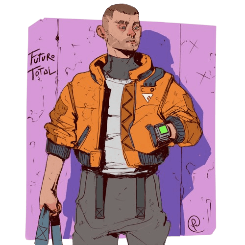
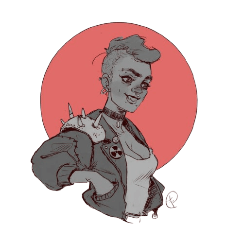
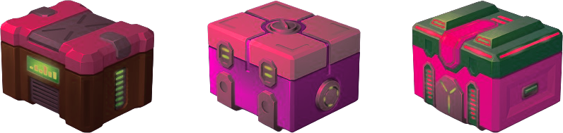
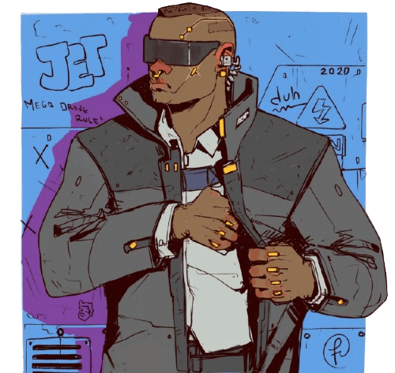

\sinc

# Entrega el paquete 0.9 [por Gwannon](https://gwannon.itch.io/entrega-el-paquete-breathless)

\conc

**«Entrega el paquete» en una mini-ambientación ciberpunk para [Breathless](https://fari-rpgs.itch.io/breathless-srd) donde eres une mensajere que debe entregar un paquete y esquivar a los equipos de mercs enviades por mega-corps enemigas para interceptarte.**

```
En un mundo hipertecnificado, la forma más eficaz para evitar que te hackeen información es que esta sea física. Todo dato sensible es mejor tenerlo en papel y moverlo fisicamente. Recuerda, si va por la red es hackeable.
```

En «Entrega el paquete», como buena ambientación ciberpunk, la información es poder y protegerla es fundamental, así que mucha información sensible se guarda en papel o unidades de almacenamiento y se mueve físicamente en vez de electrónicamente.

Es por ello que existen empresas de mensajería y mensakas independientes que llevan esa información de un lugar a otro arriesgando su cuerpo e incluso sus vidas.

## Empresas de mensajería y mensajeres independientes

Las empresas de mensajería son empresas bastante atípicas en comparación con el sistema capitalista imperante. Suelen ser cooperativas de mensakas, no empresas como podríamos pensar. Muchas empezaron como grupos de corredores de parkour o skaters que estaban en sus callejones practicando su deporte y que recibían encargos para llevar rápidamente pedidos de comida a domicilio por una buena propina.

Poco a poco se fueron profesionalizando, estableciendo tarifas y ponían una cuota mensual para alquilar un habitáculo donde descansar, guardar su equipo y montar una oficina donde recibir los encargos. Les mensakas nueves que se apuntan a la cooperativa pagan una cuota de entrada tras ser aceptaba su solicitud de ingreso en la cooperativa y luego una cuota mensual para usar los servicios.

Les mensakas independientes suelen ser practicantes de disciplinas como parkour o skating que empiezan a trabajar de mensajeres para monetizar su afición, pero sin convertirlo en un modo de vida. Si quieren dedicarse profesionalmente, suelen unirse a una cooperativa.

## Parkour, skaters, BMX y otros estilos

Cada mensaka tiene su forma de moverse por la ciudad rápidamente. Tenemos corredores que hacen parkour, skaters y rollers con sus tablas y patines y ciclistes con sus bicis de BMX.

Las empresas suelen especializarse en un tipo de movimiento y comprar equipo y contratar profesionales especializados en trabajar en esas disciplinas, por ejemplo, fisioterapeutas en caso del parkour o mecániques de bicis para les especialistes en BMX.

[](https://www.deviantart.com/fernand0fc/art/Delivery-802145258 "Delivery By Fernand0FC")

## Contratos calientes

La mayoría de las entregas las hace une unique mensaka. Recoge el paquete, lo transporta y lo entrega sin, a priori, incidentes. El contrato es estándar y normalmente se hace a través de la web.

Pero de vez en cuando hay contratos calientes. Se denominan contratos calientes a las entregas peligrosas. Normalmente, se negocian cara a cara, se pagan buenas y se exige la intervención de varios mensakas. Seguramente las megacorps enemigas mandarán a sus mejores agentes a interceptar al mensaka y quitarles el paquete de sus frías manos. 

```
Estas son las entregas que vas a poder vivir gracias a este pequeño suplemento, esos contratos calientes que pueden hacerte ganar chips como nunca has visto o simplemente matarte y que tu cadáver acabe en un callejón rodeado de sarnosas y hambrientas ratas.
```

\sp

\sinc

## Sistema 

\conc

«Entrega el paquete» usa el sistema Breathless, modificando y ampliando sus reglas para plasmar las locas carreras en las que participarás para entregar el paquete en su punto de destino.

### Tiradas

Cuando hay un desafío que superar, haces una tirada para ver cómo se desarrolla. Solo necesitas tirar si lo que quieres hacer es arriesgado.

Le DJ anuncia que tu acción puede ser arriesgada y peligrosa; entonces eliges una habilidad y tiras el dado correspondiente a su puntuación. Si une compañere te ayuda, también realiza una tirada y ambos corréis los mismos riesgos. Le DJ toma la tirada más alta e interpreta el resultado.

|Tirada|Resultado|
|---|---|
|1-2|Fallas y algo malo sucede.|
|3-4|Lo logras, pero tiene algún tipo de coste.|
|5+|Tienes éxito. Cuánto mayor es el resultado, el efecto es mejor.|

Ser mensaka es difícil. Cada tirada reduce la puntuación de la habilidad usada en un nivel hasta un mínimo de d4:

**d12 ⇾ d10 ⇾ d8 → d6 → d4**

Si lo desea, le DJ puede dejar una decisión de partida a la suerte. Simplemente elige un dado basándote en la probabilidad de que algo suceda, tira e interpreta el resultado.

### Recuperar el resuello

Para recuperar todas tus habilidades, debes «recuperar el resuello». Se trata de un breve descanso para poder respirar, bajar tus pulsaciones y pensar tu siguiente paso. Para recuperar el resuello debes estar **fuera de peligro u oculte a la vista de enemigues**.

Cuando une mensaka recupera el resuello, le DJ observa la situación y presenta una nueva complicación al grupo.

### Tiradas de saqueo

Cuando la trama lo permita, puedes hacer una tirada de saqueo para buscar herramientas, repuestos, botellines de PowerWater™, etc. Ten cuidado porque puedes encontrarte con cosas que no querías, como un grupo de mercs.

Para hacer una tirada de saqueo debes lanzar un d20 y consultar la siguiente tabla.

|1d20|Equipo|
|---|---|
|1|Pasa algo malo|
|2-14|No encuentras nada|
|15-16|1 pieza de equipo de d6|
|17-18|1 pieza de equipo de d8|
|19-20|1 pieza de equipo de d10 o 1 PowerWater™|

Si no tienes claro que obtienes con la tirada de saqueo puedes tirar un d20 en la siguiente tabla.

|1d20|Equipo|
|---|---|
|1|Protecciones|
|2|Pegamento|
|3|Piezas de repuesto|
|4|Cinta americana|
|5|Cuerda de escalada y mosquetones|
|6|Drogas estimulantes|
|7|Multi-herramienta|
|8|Hilo de nilón|
|9|Espray de pintura|
|10|Alambre de espino|
|11|Lubricante industrial|
|12|Binoculares|
|13|Bolas de rodamiento|
|14|Cizallas|
|15|Cadena|
|16|Cúter monofilamento|
|17|Pelota superrebotante|
|18|Linterna|
|19|Queso en espray|
|20|Extintor de mano|

### Bandolera de mensaka

Los objetos de tu bandolera pueden usarse en lugar de tus habilidades. Comienzan con un nivel de dado que disminuye tras cada uso. Al reducirse a un d4, el objeto se rompe, se pierde o desaparece de la historia.

Solo se pueden llevar **3 objetos y 1 botella de PowerWater™ en la bandolera**.

### Chute de adrenalina

Cuando todo se complica, puedes intentar recurrir a tu adrenalina y hacer una **tirada con un d12** es vez de una tirada con tu rango de habilidad actual.

Una vez gastado el subidón de adrenalina, no podrás usarlo de nuevo hasta que **recuperes el resuello**.

### Cansancio

Cuando enfrentas una consecuencia como resultado de una de tus acciones, el DJ puede decidir que recibas 1 nivel de cansancio. Si tu personaje alcanza 4 niveles de cansancio, estás agotade.

Cuando estás agotade, fallar una acción peligrosa significa **quedarte atrás, perder el paquete** y seguramente volver a la base **sin haber cumplido la entrega**.

\sp

#### PowerWater™

Puedes usar una botella de PowerWater™, la mejor bebida energética del mercado, para eliminar 2 puntos de cansancio. Otra opción es esconderte en un lugar seguro por un tiempo para eliminar 1 punto de cansancio.

### Tu mensaka

En tu hoja de mensaka, anota el mote, los pronombres de tu personaje y cómo se mueve, parkour, roller, skate, bici BMX.

Todas las habilidades tienen una puntuación de d4 y debes asignar un d10, un d8 y un d6 a tres habilidades en las que creas que tu personaje destaca.

Los personajes tienen un total de 6 habilidades:

* **Empujar:** Abrirte paso, doblar, destrozar.
* **Moverse:** Correr, saltar, trepar.
* **Acechar:** Esconderse, husmear, merodear.
* **Callejear:** Orientarse, perseguir, atajar.
* **Pensar:** Percibir, analizar, reparar.
* **Interactuar:** Cautivar, manipular, intimidar.

Por último, tienes una **pieza de equipo especial, que empieza con d10 y que representa la forma de moverte que usas**, pueden ser zapatillas de correr, tu bici, tu tabla de skate, etc.

\sc
A diferencia del equipo vuelve a tener un d10 cuando recuperas el resuello, como una habilidad, pero se puede romper, perder o ser robada como una pieza de equipo.

Al comenzar cada entrega, llevarás en tu bandolera una pieza de equipo aleatoria a nivel de d10.

[](https://www.deviantart.com/fernand0fc/art/moar-girls-form-a-dystopian-future-681146900 "moar girls form a dystopian future By Fernand0FC")

\sinc

## Las entregas

\conc

En «Entrega el paquete» las aventuras se denominan entregas. Las entregas tienen una serie de reglas propias que las hacen caóticas y frenéticas.

### El contrato

Todas las entregas empiezan con un contrato. Algunos son muy simples, llevar el paquete del punto A al punto B, y puedes complicarlos tanto como quieras usando 5 vectores:

* **El punto de recogida.** Normalmente es en las oficinas de la megacorp contratante, pero puede ser hasta una taquilla de la estación o recoger algo de la tintorería. Todo vale para despistar a les rivales.
* **El punto de entrega.** Claramente otras oficinas de la misma megacorp. Sospecha de cualquier otra opción.
* **El límite de tiempo.** La megacorp siempre pone un límite de tiempo. La diferencia es cuan ajustado sea. El límite de tiempo puede crear más o menos tensión. Como consejo, las primeras entregas hazlas con límites largos, cuando ya tengáis claro el sistema puedes meter límites de tiempo más cortos.
* **El interés/valor del paquete.** Cuanto más valioso, más recursos pondrá en juego las megacorp rivales.
* **Número de mensakas y señuelos.** En la mayoría de contratos calientes la megacorp paga para que varios mensakas vayan en grupo, de forma que se puedan apoyar y, si cae une, le superviviente continúe con la entrega. Pueden pedir también mensakas extras que actúen de señuelos, despistando a les mercs enviades.

Aparte de los puntos principales, hay algunos anexos que la megacorp puede intentar imponer antes de firmar el contrato.

* Paquete rastreable.
* Mensaka sujeto al paquete mediante esposas explosivas o cinchas guillotina.
* Puntos de control. Le cliente puede exigir que pases por unos puntos para que controlen tus progresos.
* Seguro de salud y/o vida para el mensaka.
* Responsabilidad en caso de perder el paquete.
* Obligaciones y multas en caso de rotura de contrato por ambas partes.
* Grabación de carreras con cámara personal para estudiar la entrega y ver quien ha querido interceptar en el envío.
* Medio de transporte a usar. Pueden pedir que no se vaya en bici o que tenga que ir todos en rollers.

```
Escribir un contrato es una forma muy rápida de montar una entrega a la que luego solo tienes que meter detalles que le den sabor.
```

#### Negociar el contrato

> Negociar un contrato con eses cabrones de las megacorps sí que es duro y peligroso. Les mensakas solo corren y dan saltitos. Si yo no hago bien mi trabajo todo se va a la mierda. Yo consigo que una entrega suicida se convierta en un paseo por el parque. __Durante, negociadore de contratos__

\sp

La negociación del contrato es algo que puedes hacerlo como DJ fuera de partida y que tus mensakas lo reciban de repente, cojan sus bandoleras y salgan a patearse las calles.

La otra opción es que tu mesa negocie el contrato en conjunto contigo. Esta negociación puede **funcionar como una sesión 0**, donde tu mesa va a ayudarte a crear la partida que quieren jugar, aun así trata de dejar cosas fuera que te permita meter elementos inesperados. Por ejemplo, decidís que haya puntos de control, pero mete tu cláusula de que en cada punto te dirán el siguiente y resérvate la opción de sorprenderles con cada punto de control. 

### No preguntes por el paquete, solo entrégalo

XXX

[](https://www.freepik.com/free-vector/game-futuristic-boxes-future-technology-chests_37077179.htm "Game futuristic boxes future technology chests by upklyak")

#### Dimensiones del paquete

Los paquetes pueden tener 3 tamaños:

* **Pequeño como un Chip de datos.** Puedes esconderlo en cualquier parte de tu ropa o de tu cuerpo, incluso tragártelo.
* **Medio como una caza de zapas.** Puedes llevarlo en la bandolera y te ocupa un espacio de bandolera.
* **Grande como para no entrar en la bandolera.** No entra en tu bandolera y tienes que llevarlo en la mano.

Cuando no entra en la bandolera, tienes que llevarlo en la mano y eso hace que te moleste cuando tratas de moverte. Piensa que es complicado escalar un muro con una sola mano. Quizás puedas hacer un arnés de cuerda o cinta americana o algún otro tipo de trucos.

Para compensar los problemas que supone que no entre en la bandolera, cuando el paquete es grande, se convierte en un objeto que puedes usar en tus entregas con un d10. Puedes usarlo como escudo, porque está blindado, como flotador porque es estanco y flota, como trineo para deslizarte por cuestas, etc. Cuando llega a d4, la caja está tan dañada que no sirve de nada.

#### No abras el paquete

XXX

> Bajo ningún concepto mires que hay dentro del paquete, ni lo pienses, ni sueñes con hacerlo, … Nunca, nunca, nunca lo abras. __HeraGodness, mensaka veterana__

### ¿Quién lleva el paquete?

XXX

Si le portadore del paquete se agota y se queda atrás, la entrega es interceptada por los mercs enviados y la megacorp enemiga consigue lo que había dentro.

Si no ha gastado su chute de adrenalina, le portadore puede gastarlo para pasárselo a otre mensaka y que este siga la entrega.

Hay entregas que por contrato exigen que le mensajere lleve sujeto el paquete con algún tipo de artilugio de seguridad, tipo esposas explosivas o cinchas cortadoras.

Le mensajere no podrá pasar el paquete a otros compañeres, pero tampoco podrá perderlo o se lo podrán robar. Solo podrán quitárselo en el punto de entrega con algún código especial. Si se intenta romper o hackear lo más seguro es que pierda la mano, pero a situaciones desesperadas, medidas desesperadas.

> ¿Esto? Esto es papel de aluminio. No será la primera vez que una megacorp me dice que no ha puesto un rastreador y si lo ha puesto. Es un grave incumplimiento de contrato, pero el que se la juega soy yo. __JackRunner, mensaka conspiranoico__

Por defecto, los paquetes no llevan rastreadores, pero pueden exigirlo por contrato. Con un rastreador le contratante puede seguir el paquete y rastrearlo si se pierde, pero se arriesga a que las megacorps enemigas intercepten su señal.

### Siempre hacia adelante, siempre moviéndote

La filosofía principal de este juego es «siempre hacia delante, siempre moviéndote». Tus jugadoras y jugadores deben tratar de ir siempre hacia adelante, nada de pararse a trazar un plan. El plan se hace mientras avanzas. Solo te pueden parar cuando quieras recuperar el resuello.

Piénsalo así, incluso cuando te escondes, algo normalmente muy estático, deberías seguir avanzado.

Si te cruzas con una manifestación, robas una chaqueta y una gorra y sigues caminando hasta que sales al otro lado de la multitud. Si aprovechas a qué pase un camión de la basura para ocultarte detrás, deberías agarrarte a una de las barras y largarte con él.

```
Si ves que tus mensakas no pillan esta idea, puedes aplicar la siguiente regla para animarles. Si tiran cualquier dado estando parados, tienen un nivel menos de dado con un mínimo de d4. No hay tiempo de abrir la cerradura con las ganzuas, enrollas el brazo en la chaqueta, rompes el cristal, abres el pestillo y sigues corriendo.
```

Incluso en momentos de negociación deberias moverte. Cuando estas dentro en un convini y hablas a gritos con le jefe de les mercs que rodean el local, deberias moverte para montar la bomba de humo con productos de limpieza con la que intentarás darles esquinazo.

#### No hay tiempo de preparación

Los contratos calientes normalmente son rápidos, unos mensajes, unas llamadas y empieza la carrera. Puedes estar tranquilamente en la base en la zona de descanso y de repente vuestre negociadore te pega un post-it en la frente y te dice «Calienta que sales a jugar».

\sp

Aunque hubiera tiempo de planear, no hay información para hacer un plan adecuado. Cuando empieza el curro apenas tienes info. Solo una dirección y cuatro cosas básicas: quién te acompaña, si el bulto es grande y alguna regla especial que puesto le cliente como cinchas cortadoras.

En el punto de recogida, te avisarán de todo lo que necesites y debas saber para la entrega.

#### Entregas con límite de tiempo

XXX

### Toboganes y escaleras

Los toboganes y las escaleras son eventos y situaciones que les mensejeres se van a encontrar en su camino y tendrán que afrontar si quieren realizar la entrega.

A veces ayudarán y otras se convertirán en un obstáculo a superar. Todo es cuestión de perspectiva. Un callejón sin salida puede ser una trampa mortal o, si sabes escalar bien, una forma de dar esquinazo a les perseguidores que quieren interceptar el envío.

|1d12|Obstáculo|
|---|---|
|1|**Tiroteo entre dos bandas rivales:** Dos bandas rivales están parapetadas tras varios vehículos a ambos lados de la calle y no paran de intercambiar disparos.|
|2|**Tren elevado:** Un tren elevado se acerca a tu posición, quizás puedas saltar encima y huir, quizás te dé unos segundos de ocultación mientras huyes o tal vez puedas engañar a tus enemigues y hacer que el tren les arrolle.|
|3|**Paso inundado:** La única forma de cruzar la autopista de 16 carriles es un paso subterráneo que está inundado de aguas sépticas.|
|4|**Fila de máquinas de vending:** en la calle hay una larguísima fila de máquinas de vending. Puedes hacer una tirada de saqueo. Si sale un 1 repites la tirada.|
|5|**Ambulancia:** Una ambulancia con las luces puestas va en vuestra dirección. Si os engancháis a ella u os subís encima podría haceros avanzar mucho.|
|6|**Procesión:** Algún tipo de secta religiosa está haciendo celebraciones en la calle y está toda la zona colapsada por devotes celebrando sus creencias.|
|7|**Puente sobre el canal:** Un estrecho puente de metal y cable es la única forma de cruzar el canal u otra superficie de agua.|
|8|**Callejón:** Creías que el camino que habías cogido tenía salida, pero no, es un callejón sin salida.|
|9|**Año nuevo chino:** La calle está llena de viandantes observando a un grupo de artistas que hacen moverse una gigantesca marioneta de un dragón chino.|

\sc

|1d12|Obstáculo|
|---|---|
|10|**Gran incendio:** Los bomberos han cortado el paso y está evacuando la zona, hay un incendio en una planta química y puede estallar en cualquier momento.|
|11|**Ciberpsicopata:** Une ciberpsicopate con un lanzallamas de combate y un chaleco de explosivos ha cortado la calle y usa de rehenes un bus cercano llena de pasajeres.|
|12|**Alfombra roja:** Te encuentras con un evento de «idorus». La calle está llena de limusinas blindadas donde van los famosos que paran unos minutos en la alfombra roja para que se paseen por ella. El resto de la calle está lleno de gente buscando selfies con sus ídolos.|

### Trampas

> Siempre hay trampas. Otra cosa es que tú no la veas. __HeraGodness, mensaka veterana__

XXX

### Mercs y megacorps

XXX

En «Entrega el paquete» no existen habilidades de combate, no puedes enfrentarte a eses mercenaries armades hasta los dientes y con más ciberimplantes que carne. Solo puedes esquivarles o engañarles y seguir avanzando hasta el punto de entrega.

Que no tengas armas no quiere decir que no puedas acabar con ellos. Si eres bueno, igual puedes atraerlos a una zona inundada de agua y tira al agua un cable de alta tensión.

Y quién dice que no se te pudo ocurrir, mientras escapabas atravesando una cocina de un restaurante, abrir las espitas de gas de los fuegos para que todo explotará cuando entrarán la panda de mercs que te perseguían 

```
Las bandas de mercs siempre tienen un nombre, un tema (van de samurais, van de super profesionales, etc.) y por último una estética (son calvos o van rapados, llevan mascaras de hockey, etc.)  Ten los 3 conceptos preparados, que no parezca que te la acabas de inventar.
```
Si quieres darle más vida, debes definir una fortaleza, algo en lo que son buenos, y una debilidad, algo en lo que son buenos. Tus mensakas no pondrán ganarles enfrentándose a su fortaleza y pueden usar su debilidad para librarse de ellos. Puedes usar tu habilidad de Interactuar o Pensar para tratar de averiguar si fortaleza y su debilidad.

\sp

Las Sombras de Plata son un equipo de mercs que van de rollo asesinos ninjas. Viste ropajes tácticos de color negro y cubren su cara con una capucha y una máscara plateada. Cómo buenos ninjas son muy buenos haciendo emboscadas, pero solo combaten cuerpo a cuerpo, con lo que huir de ellos les deja pocas opciones. Si no te detienen en el primer golpe, podrás escapar de ellos.

[](https://www.deviantart.com/fernand0fc/art/Corporate-level-bodyguard-803579124 "Corporate level bodyguard By Fernand0FC")

#### Enter the mercs

Les mercs no entran en acción desde el minuto uno de la entrega. Los primeros problemas deberían ser toboganes y escaleras, ya habrá tiempo de esquivar balas perforantes y filos monofilamento.

Les mercs tiene normalmente 3 formas de actuar.

* **Acción directa:** Te buscan hasta dar contigo y usan todo lo que tienen para detenerte.
* **Emboscadas y trampas:** Montan unas emboscadas o te tienden una trampa. Está opción exige tener información extra sobre la entrega que les permita saber por donde vas a pasar. 
* **Buscar la manera para que tú vayas a ellos:** Pueden desde tratar de sobornarte con ingentes cantidades de chips, hasta secuestrar a algún ser querido o capturar a une compañere que estaba en tu entrega contigo. Buscarán llegar a una negociación que puede o no acabar bien o en traición.

XXX

\sc

#### ¿Y si llamo a la policía?

> A.C.A.B. All Cops Are Bastards __Graffiti callejero__

La policía está comprada y no es tu amiga, No la llames bajo ningún concepto a no ser que quieras a tener a otro grupo armado detrás de ti.

### Baja tecnología

> Mi viejo siempre decía «el metal se hunde, la carne flota». __Goldmill, entrenador de mensakas__

El mundo de la mensajería es un mundo donde la tecnología no ha entrado. Si no te fías de la tecnología para enviar tu información tampoco puedes fiarte de mensajes hasta arriba de ciberimplantes y equipo de alta tecnología.

Les mensakas suelen ser de las personas de la ciudad con menos cromos en el cuerpo, quitando piercings y clavos en los huesos. Los ciberimplantes son hackeables, son rastreables, son detectables, necesitan equipo especializado para repararlos, etc. 

Piensa que en un mundo de ciberimplantes, todo está pensado para combatir esta tecnología y les mercs cibermejorades están entrenados para enfrentarse a gente con ellos. Lo que pudiera ser una desventaja muy clara en cierta medida se convierte en una ventaja.

En vez de implantes, puedes considerar que tus mensakas son muy buenos en sus tipos de movimientos y que sustituyen las capacidades extras que los implantes pudieran darles con su astucia y sus instintos de mensaka.

Las comunicaciones son todas verbales, nada de pinganillos, mensajes o videollamadas, nada que pueda ser hackeado electrónicamente. Usan su jerga de mensakas para «encriptar» sus comunicaciones y se gritan las órdenes, los planes y las advertencias.

Si necesitan hablar con la base, tienen chips sueltos para llamar desde una inter-cabina blindada. Y no es la primera vez que roban un móvil de une descuidade transeúnte mientras escapan corriendo de una panda de mercs.

### Jerga mensaka

Les mensakas usan su propia jerga, un lenguaje secreto y propio de cada cooperativa, con él se comunican durante las misiones. No son complicados de entender, cualquier IA entrenada podría descifrarlo, pero lo son suficientemente enrevesadas para que una panda de mercs no sepa qué plan de escape estáis tramando mientras os retienen en un callejón con una lluvia de balas.

```
Déjales que en sus interacciones se inventen poco a poco esa jerga y la integren luego en sus diálogos.
```

\sp

### Llamar a la base

> Llamar a la base es de cobardes, ¿eres une cobarde? __Jeindal, mensaka retirado__

Cuando las cosas están muy muy muy chungas, puedes llamar a la base a pedir ayuda.

Desde la base se encargarán de que enviar a un grupo de ronins que limpie la zona, una bandada de palomas que os abran camino o incluso un girojet que os saque de allí y os dejé a salvo en una azotea cercana.

Llamar a la base es una opción excepcional que solo se puede hacer cuando no hay otro recurso. 

Eso supone que todes tus mensakas han gastado sus chutes de adrenalina, no tienen ningún ítem de equipo, ni les queda PowerWater™ y el grupo tiene más del 50% del cansancio total gastado.

Llamar a la base tiene un coste y es que seguramente le **deberéis un favor a alguien** y todo el mundo sabe que en una ambientación ciberpunk deber un favor significa problemas más grandes en el futuro.

Seguro que vuestre benefactore, querrá cobrarse el favor haciendo que entreguéis algo ilegal o que hagáis la entrega en territorio de una megacorp enemiga. Igual transportáis una bomba que explotará cuando se abra. Puede ser cualquier cosa y estás obligade a cumplirlo.

### Toques ciberpunk

Aquí van algunos toques ciberpunks que pueden ayudar a ambientar tus entregas.

* Siempre tiene que **llover en el momento más inoportuno**.
* **En la ciudad siempre hay mucha acción**, el grupo de mercs que te sigue no es único. El sonido de las UCI móviles militarizadas es constante y a la vuelta de cualquier esquina, puede haber un tiroteo.
* Las rutas no siempre irán por sitios cutres y sucios, algunas veces **pasarás por lugares elegantes y de mucho dinero**. Quién dice que no puedes acabar en una biblioteca o un museo.
* Hay **puestos de comida callejera en todas partes** y preparan de todo. Qué mejor forma de recuperar el resuello que sorbiendo unos fideos escondido tras las cortinas de un pequeño ramen-ya, mientras fuera te buscan una panda de mercs.
* Hay **publicidad en todas partes**, hasta en tu ropa puede haber logos de patrocinadores. Seguramente que la gente de marketing ha aprovechado a meter logos de la megacorp en el paquete por si tu persecución o el tiroteo en que vayas a morir es grabado y sale en la red.
* Las **drogas son fáciles de conseguir**, ilegales unas y legales otras. Es muy facil encontrar alguien que venda las primeras o una máquina que dispense las segundas.
* **Todo está en obras.** La calle que ayer era transitable, hoy es un hoyo en el suelo. Es imposible que en una manzana no haya un edificio con un andamio que no te permita subir a la azotea para huir del peligro (y encontrarte con otro nuevo).
* Siempre habrá **algo a lo que agarrarse para seguir avanzando**. Una tubería por la que bajar, cables por los que descolgarse o farolas a las que saltar para luego aterrizar en el suelo sano y salvo.
* Las **cabinas y las máquinas de vending** tiene blindaje antibalas, así que son un **parapeto perfecto** para tu mensaka. Además, pesan una tonelada con lo que moverlas o empujarlas, incluso con un vehículo, es complicado.

> Podría ser peor, podría llover - __Igor «El jovencito Frankenstein»__

### Semillas de entregas

Tal vez estas semillas de entregas te den ideas para crear las tuyas propias.

* Toda la ciudad está colapsada por el concierto de la superestrella musical DiByne, calles abarrotadas, atascos, gente de fiesta drogada, etc. Y a la CEO de VultureTech no se le ha ocurrido mejor ideas que mandar un paquete muy especial a DiByne, de la que es muy fan. Tendrás que llegar al estadio y colarte en el backstage para hacer la entrega, eludiendo a les fans y a sus guardaespaldas.  
* Une compañere mensaka está escondido en un callejón. Tiene una pierna rota y necesita que alguien le sustituya, asi que ha llamado a la base y os envían como refuerzos. Tendréis que rescatarlo, llevarlo a un sitio seguro y terminar la enttega.
* Todos los años por estas fechas se hace «La carrera». DelivaTeam, una de las grandes del sector de las entregas, organiza un concurso para encontrar a le mejore mensaka de la ciudad. Son varias pruebas puntuables que simulan una entrega muy caliente y gana la mejor puntuación. La sospecha de tongo siempre está presente, ya que siempre ganan les mensakas de DelivaTeam. 
* El paquete que transportáis hace ruidos extraños y no tiene buena pinta. La negociación del contrato ya fue rara y esto no lo mejora. Puede ser una bomba o algún otro tipo de trampa. O quizás es algo vivo. La verdad es que no lo sabéis, pero quizas deberíais abrir el paquete y salir de dudas.
* Hoy toca entrenar a los nuevos, te acompañarán un grupo de mensakas recién contratados para que les enseñes los trucos. Qué podría salir mal.

\sp

\sinc

## Epílogo 

\conc

### Hoja de mensaka

|HojaMensajere.html|

### Hoja de contrato

|HojaContrato.html|

### Fuentes

Si deseas inspiración para crear tus tramas, estás son algunas obras que me han servidor de inspiración para desarrollar «Entrega el paquete».

* **Luz virtual (Trilogía del puente) de William Gibson.** Todos persiguen a una mensajera que ha conseguido una gafas de realidad virtual con importante información corporativa.
* **Quemando cromo de William Gibson.** En esta recopilación de historias cortas tenemos la historia de Johnny Mnemonic que es un mensajero corporativo que lleva en su cerebro relevantes datos de una megacorp.
* En el videojuego **Mirror’s Edge de EA** una red de corredores, entre ellos el personaje principal, Faith, transmiten mensajes entre elementos rebeldes mientras eluden la vigilancia del gobierno y las corporaciones. 

\sc

### Términos útiles

Este listado de términos en argot te pueden ayudar a ambientar tus entregas y que tus mensakas pueden usar para crear la suya.

* **Chapas:** Mercenaries hasta arriba de ciberimplantes y armas.
* **Charlie:** Punto de control, viene de Checkpoint Charlie.
* **Felices para siempre:** Cuando tienes que llevar un paquete esposado a tu mano.
* **Megacorp:** Megacorporación.
* **Mensaka:** Mensajere.
* **Merc:** Mercenarie.
* **Palomas:** Drones voladores espías que te siguen.
* **Patata caliente:** Es un paquete peligroso que todo el mundo quiere conseguir.
* **Pizza fría/caliente:** Pizza caliente es cuando la entrega tiene límite de tiempo en la entrega y fría cuando no lo tiene.
* **Ringer:** Mensaka que porta el tesoro, digo, el paquete.
* **Tagueado:** Que lleva un rastreador.

### Licencia 

This work is based on Breathless, product of [Fari RPGs](https://farirpgs.com/), developed and authored by René-Pier Deshaies-Gélinas, and licensed for our use under the [Creative Commons Attribution 4.0 License](https://creativecommons.org/licenses/by/4.0/).

«Entrega el paquete» está hecho bajo licencia [CC BY 4.0](https://creativecommons.org/licenses/by/4.0/legalcode.es). Todo el código fuente puedes encontrarlo en [GitHub/ideasRoleras/EntregaElPaquete](https://github.com/gwannon/ideasRoleras/tree/main/EntregaElPaquete)

* Red and black patterned background vector by [rawpixel.com](https://www.freepik.com/free-vector/red-black-patterned-background-vector_3463974.htm)
* Game futuristic boxes future technology chests by [upklyak](https://www.freepik.com/free-vector/game-futuristic-boxes-future-technology-chests_37077179.htm)
* Delivery By [Fernand0FC](https://www.deviantart.com/fernand0fc/art/Delivery-802145258) bajo licencia [Creative Commons Attribution 3.0 License](https://creativecommons.org/licenses/by/3.0/deed.es)
* Corporate level bodyguard By [Fernand0FC](https://www.deviantart.com/fernand0fc/art/Corporate-level-bodyguard-803579124) bajo licencia [Creative Commons Attribution 3.0 License](https://creativecommons.org/licenses/by/3.0/deed.es)
* moar girls form a dystopian future By [Fernand0FC](https://www.deviantart.com/fernand0fc/art/moar-girls-form-a-dystopian-future-681146900) bajo licencia [Creative Commons Attribution 3.0 License](https://creativecommons.org/licenses/by/3.0/deed.es)
* Algunas ideas han sido sacadas de *[**Repartidores del Apocalipsis**](https://reroll.itch.io/1pag-cotarpg), un juego de una página donde juegas con repartidores en un mundo postapocalíptico. 

&nbsp;

[](https://fari-rpgs.itch.io/breathless-srd "This game is Breathless")