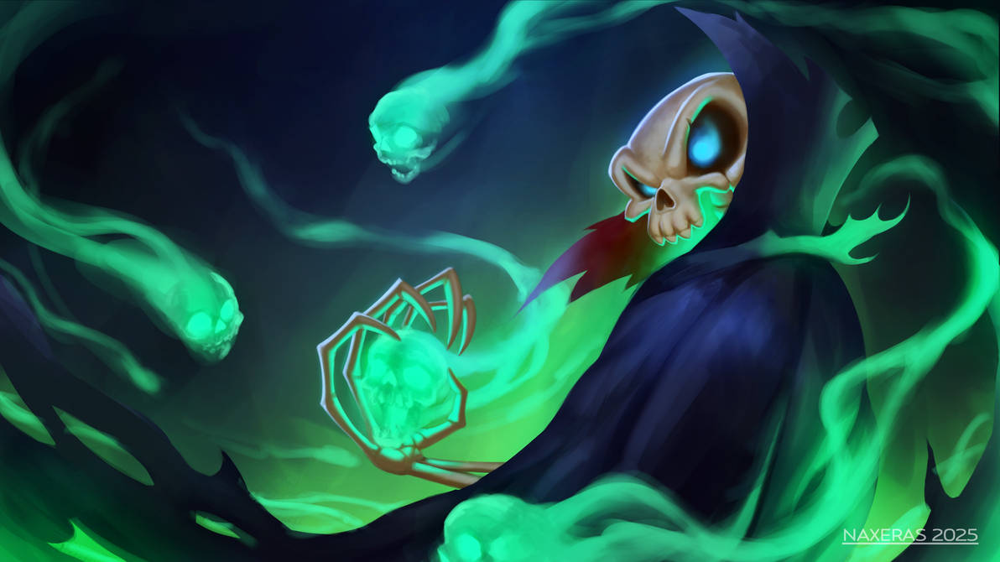

\sinc

# Fincas & Inmuebles [Por Gwannon - Ver. 0.9](https://gwannon.itch.io/fincas-e-inmuebles)

&nbsp;

Fincas&Inmuebles (F&I) es un juego de rol para 1 DJ y un grupo de PJ donde vivirán auténticas y épicas aventuras inmobiliarias en pos de la riqueza que pueden ganar con la transacción de bienes inmuebles ganando con ello una plusvaláa. En resumen, que deberán vender la mazmorra, castillo, torre de mago, etc. que acaban de explorar para pagar los gastos de la aventura y tratar de sacar beneficios.

Para jugar necesitarás dados de 6 caras y fichas de 3 colores distintos (rojo &#128308;, azul &#128309; y verde &#128994;).

## Reglas

&nbsp;

\conc

```
Yo traje el gotelé a Rivendel.
```
Benito Gamyi

El sistema es muy sencillo, cuando vas a hacer algo que sea posible fallar, **tiras tantos dados de 6 como el atributo adecuado**. Los **5 y 6 son éxitos** y cuantos más éxitos mejor lo haces.

Si la acción que voy a hacer supone interactuar con otro PJ o un cliente, se considera una tirada enfrentada. En caso de tiradas enfrentadas, tiran ambos participantes y gana el que más éxitos consiga.

En caso de empates gana el defensor. Si no se consiguen éxitos por ninguna parte, el defensor también gana.

Tus compañeros **pueden ayudarte** y en vez de hacer tu tirada pueden darte **un dado extra**.

### Inmuebles y fincas

Los inmuebles vienen definidos por una simple descripción que puede usarse como un conjunto de aspectos. Los elementos de esta descripción pueden **invocarse y dan un dado extra**. 

Si la descripción dice que las ruinas malditas tienen grabados de primigenios y voy a vendérselo a un cultista puedo invocar ese aspecto y conseguir 1 dado extra a Negociar. Si puedo invocar más elementos de la descripción, puedo conseguir más dados. 

\sp

\sinc

[](https://www.freepik.com/free-vector/ancient-dark-arena-gladiator-battles_379400616.htm "Ancient dark arena for gladiator battles by upklyak")

\conc

Esto también puede **usarlo el DJ para sus clientes**. Si la descripción dice que es muy luminoso y soleado, el vampiro que busca cripta puede obtener un dado extra a la hora de negociar el precio.

Además, cada inmueble tiene 4 características que lo definen.

* **Ubicación.** Indica si su ubicación es buena. Con 1 está en Mordor y con 5 en la Comarca.
* **Espacio.** Marca el tamaño del inmueble. Quizás un halfling solo necesita 1, pero Smaug necesita 5. El tamaño también supone más problemas al limpiar y adecentar el inmueble.
* **Corrupción.** Indica la magia oscura y la corrupción que destila el lugar. Con 1 casi no hay corrupción, aun así, un señor de los altos elfos te diría que ni de coña dormiría en ese sucio antro de corrupción. Con 5 los nurgletes crecen solos y los esqueletos se levantan solos.
* **Precio:** Indica el precio de la vivienda. Un goblin cojito y tuerto podría comprarse una choza de precio 1 y solo un antiguo liche que lleva siglos acumulando los tesoros de los aventureros que mata podría pagar una mazmorra de precio 5.

Lo curioso es que **las puntuaciones de los tributos del inmueble son buenas o malas según el cliente**. Por ejemplo, a un orco la ubicación 1 es perfecta porque está al lado de su trabajo en Karad-zum y es malísima para un halfling porque tiene que andar durante tres películas para llegar.

Lo importante es la diferencia entre los atributos del inmueble y, como veremos más adelante, los atributos del inmueble deseado por los posibles clientes. 

### Los compradores

```
Bueno, un trato es un trato, ¿no? Claro. Nos vemos luego. Buena suerte. Que lo disfrutes. Me largo.
```
Stan S. Stanman

Para empezar necesitas definir en una frase al comprador y lo que busca, como «poderosa jefa tribal orca en busca de una cabaña digna de su gloria» u «hogareño mago elfo que busca un sitio tranquilo donde hacer sus cosas de mago».

La descripción del comprador también se puede usar como aspecto que dan un dado extra a las tiradas. Si puedo invocar más elementos de la descripción, puedo conseguir más dados.

Aparte, tienen 3 atributos que representan sus capacidades más importantes a la hora de comprar un inmueble:

* **Negociar:** Es la capacidad de hacer tratos, regatear y sacar ventajas mientras se negocia una venta.
* **Observar:** Es la capacidad de buscar fallos y taras en el inmueble y detectar la verdad o la «verdad».

\sp

* **Crédito:** Es la capacidad económica del comprador. Un goblin cojo, tuerto y con un gancho en vez de mano tiene un crédito de 1 y un conde elector del reino tiene 5.

Tiene además un inmueble soñado con los 4 atributos de inmueble que muestran su casa soñada. Un Kuru-Hai buscará una casa Ubicación 2, Espacio 2 y Corrupción 4, mientras que un paladín del bien no pisará nada que tenga menos de Ubicación 3 y Espacio 3 (con establo para su caballo), Corrupción 4.

Los atributos de la **casa soñada es secreta**, puedes darles una idea en general, pero nunca números exactos. A lo largo de la partida darles pistas en partida para que puedan hacerse una idea más clara de la casa soñada.

### La «verdad» y sus tokens

```
Naturalmente, pero existe la verdad y «la verdaaaaaad».
```
Lionel Hutz

Si quieres vender el inmueble, debes conseguir que la casa que quieres vender, sea igual o, por lo menos, muy parecida a la casa soñada del cliente.

Para conseguir eso puedes hacer remodelaciones y reparaciones en el inmueble que son costosas, largas y cansadas (ver «Adecentar la mazmorra y sacar cadáveres») o puedes usar la «verdad» que principalmente es como mentir, pero diciendo cosas verdaderas.

Por ejemplo, con la «verdad» una ponzoñosa mazmorra que habitada un liche con su ejército de esqueletos puede convertirse en un rústico hogar para personas que quieren disfrutar de la no-vida en toda su inmortalidad junto a sus siervos con exceso de calcio en su organismo.

La «verdad» solo puede usarse cuando **el cliente descubre un problema** en alguno de los atributos de tu inmueble **haciendo una tirada de Observar**. Si detecta un defecto puedes tratar de arreglarlo (si es posible) o puedes distorsionar la realidad con la «verdad» y darle la vuelta al fallo.

Para ello debes elaborar una excusa creíble y hacer una tirada Charlatanería o buscar la manera de esconder el fallo y hacer una tirada de Ocultar y sacar más éxitos que la tirada de Observar. Si lo logras puedes modificar un punto hacia arriba o hacia el atributo del defecto de la casa soñada del comprador de forma que se acerque a las estadísticas reales del inmueble.

Estás vendiendo una torre fortificada al lado de una grieta interdimensional al infierno (Ubicación 1) y el grupo de clérigos legales buenos que buscan un nuevo refugio para su orden se dan cuentan de ello y te lo hacen notar. Los monjes quieren algo menos cerca del infierno (Ubicación 3) así que será difícil venderles la torre.

Decides usar la «verdad», porque no hay artesano que arregle eso de la fractura interplanar y le das la vuelta diciendo que así están más cerca de los demonios y las almas descarriadas a los que deben purificar. Además, ahorrarán un dineral en raciones de viaje que pueden dar de limosna a los pobres. Tiras Charlatanería y aprovechas el aspecto de que son beatorros que dan limosna para conseguir un dado extra. 

Tiras los dados y obtienes más éxitos en la tirada, con lo que consigues que la casa soñada de los monjes pase de Ubicación 3 a 2, con lo que estás más cerca de los atributos casa real y de poder vendérsela.

\sp

Cada vez que usas la «verdad», tengas éxito o no, generas un token para el DJ, rojo &#128308; si es Ubicación, azul &#128309; si es Espacio y verde &#128994; si Corrupción.

#### Uso de los tokens

El DJ puede usar los tokens para meter a sus PJ en nuevas complicaciones. Según los tokens o combinaciones de tokens que gasten, puede tirar en una u otra tabla.

\sinc

&nbsp;

&nbsp;

**Token &#128308;: Problemas en el vecindario**

|1d6|Efecto|
|---|---|
|1|Los vecinos se pasan el día llamando a la guardia acusándoos de ruido, de obras ilegales, etc.|
|2|La cocatriz de los vecinos canta todos los días al amanecer y eso no gusta a los compradores que no quieren madrugar.|
|3|El círculo de druidas nudistas local suelen pasearse por la zona para hacer sus cosas de druidas.|
|4|Están talando el bosque que rodea el inmueble, quieren montar una megataberna con chiquimazmorra para los niños y cafetería élfica gourmet.|
|5|Topos infernales están excavando en la zona y las vibraciones hacen que los cimientos cedan poco a poco.|
|6|Un clan orco ha oído que el inmueble está vacío y quiere darle un vistazo, el problema es que cada orco quiere cosas distintas.|

&nbsp;

&nbsp;

**Token &#128309;: Defectos de construcción**

|1d6|Efecto|
|---|---|
|1|El tejado o los techos tienen filtraciones o goteras, el problema es que no es agua lo que se filtra.|
|2|El limo ácido que se encargaba de comerse la basura, trastos, cadáveres, … se ha hecho vegano.|
|3|Las vigas principales tienen carcoma élfica que solo come maderas nobles y es inmune a la magia.|
|4|Un albañil os dice que tenemos peste de golem de piedra en las paredes y eso es un problema caro.|
|5|Hay que hacer la lechada de todos los espacios del inmueble, igual hay que hacerla blanca inmaculada, verde grumosa o roja sangre y vísceras según a quien vayáis a venderlo.|
|6|Las cañerías del váter están obstruidas y no tragan o lo que es peor, no existen y solo era un pozo al que le pusieron encima una taza del váter y se ha llenado.|

\conc

\sp

\sinc

**Token &#128994;: Maldiciones y posesiones**

|1d6|Efecto|
|---|---|
|1|Las insalubres condiciones del inmueble traen enfermedades, sarna de goblin, picazón axilar de enano o ronchas pálidas de elfo oscuro.|
|2|Todos grifos del inmueble dan la sangre de la tierra, vino tinto. El problema es que todo el mundo, desde aventureros y clientes hasta artesanos, acaban ebrios.|
|3|Un montón de objetos se han convertido en mímicos y la verdad nadie quiere hacer sus necesidades en una taza de váter mímica.|
|4|Plaga de gremlins, que más hay que decir. Todos hemos visto las pelis y te sabes las reglas.|
|5|La cocina está poseída por los fantasmas de una «troupe» de artistas y no paran de organizar números musicales con el menaje de cocina.|
|6|Habéis airado de alguna manera a los dioses y todos los personajes cambian de cuerpo entre sí y con los clientes y los artesanos. Quizás haya que devolver alguna estatuilla antigua o hacer algún tipo de ritual o hechizo.|

&nbsp;

**Tokens &#128308; &#128309;: Batalla legal**

|1d6|Efecto|
|---|---|
|1|El legítimo propietario del inmueble vuelve de la muerte con el título de propiedad bajo el brazo.|
|2|Un aviso parece clavado en vuestra puerta, van a expropiar por 4 monedas de oro el inmueble para construir un orfanato.|
|3|Los archivos municipales dicen que vuestro inmueble es un molino y un molino tiene que tener, buscaros la vida.|
|4|La recalificación del terreno hace que parte de la finca sea terreno rural y debería tener un bosque.|
|5|Nadie escapa de la muerte y los impuestos. Tal vez de la muerte sí, pero del montón de impuestos municipales que el anterior dueño dejo sin pagar no.|
|6|No tenéis permisos de obra de ninguna de las reformas y eso es una infracción muy grave de las ordenanzas reales.|

&nbsp;

**Tokens &#128309; &#128994;: Eventos mágicos**

|1d6|Efecto|
|---|---|
|1|En teoría, parte de la construcción está en tierra feérica y las hadas no paran de raptar a todo aquel que se acerca a ver el inmueble.|
|2|El último artesano que vino a la casa tenía una especie de destornillador raro que zumbaba mucho y ahora la casa es mucho más grande por fuera que por dentro.|

\conc

\sp

\sinc

|1d6|Efecto|
|---|---|
|3|Todas las superficies reflectantes, desde espejos hasta escudos de metal bruñidos, muestras los momentos más vergonzosos de aquellos que se reflejan.| 
|4|En el terreno colindante aparece una espada mágica clavada en la piedra y se llena de aspirantes a rey y de curiosos que quieren probar suerte, y claro, de vendedores de souvenirs y de comida rápida.|
|5|Los árboles toman conciencia y les salen caras y hablan, los hongos de la mazmorra se convierten en seres sintientes con forma humanoide o los vegetales del huerto crecen desmesuradamente y pueden hablar y moverse.|
|6|Las escaleras han pasado a estado cuántico y ahora bajan cuando quieres subir, suben cuando quieres bajar o te llevan al mismo nivel en que estabas.|

&nbsp;

**Tokens &#128994; &#128308;: Vecinos molestos**

|1d6|Efecto|
|---|---|
|1|El círculo de druidas local deja vuestro inmueble lleno de cascos de botellas de sidra y dan gritos y hacen cánticos hasta las tantas cuando hacen sus reuniones las noches de luna nueva.|
|2|El puerto de barcos voladores gnomos pasa por encima de vuestra finca, metiendo muchísimo ruido, dejando caer cosas peligrosas o incluso estrellándose.|
|3|La bruja comeniños cercana ha puesto su casita de chocolate en venta y atrae a todos los clientes, nadie quiere vuestro edificio, cuando puede comprar uno de chocolate y caramelo.|
|4|La cervecera enana local tiene fugas en el riachuelo local, eso hace que el agua sea alcohol puro y el cielo este lleno de humos.|
|5|Una medusa, minotauro u otro monstruo similar aparece con un contrato de trabajo firmado y fechado para vigilar en la mazmorra y acabar con cualquier aventurero que entre. El problema es que intenta matar a las visitas y quiere cobrar a fin de mes.|
|6|Las finales del campeonato piedraball para gigantes de las colinas se celebran cerca y las piedras están cayendo en la finca.|

&nbsp;

**Tokens &#128308; &#128309; &#128994;: Catástrofes**

|1d6|Efecto|
|---|---|
|1|Algún dios o diosa se ha cabreado y ha mandado un diluvio. Lo bueno es que las humedades y las goteras ya no son un problema.|
|2|La finca o el inmueble ya no está en nuestro plano, quizás esté en un plano demoniaco o celestial o de gente churro. La cuestión es que como mínimo ya no existen los posibles clientes que teníais.|

\conc

\sp

\sinc

|1d6|Efecto|
|---|---|
|3|La respuesta es 42|
|4|La magia del mundo colapsa súbitamente, así que todos los elementos mágicos de la finca empiezan a fallar. El problema es que ha pillado a tus clientes en el teleportador que va de una parte a otra del inmueble y habrá que sustituir todo lo que no funciona.|
|5|El inspector de vivienda deja un aviso de que hará una visita en 3 días. Si no cumple los mínimos de seguridad lo clausurará.|
|6|Un señor del bosque gigantesco, un primigenio o un dragón está arrasando la zona, lo que desgraciadamente está haciendo bajar los precios de los inmuebles de la zona.|

&nbsp;

## Creación de personajes

&nbsp;

\conc

Cuando hablamos de creación de personajes, deberíamos hablar de conversión de personajes, ya que la idea es convertir a los PJ de otro juego de fantasía que acaban de terminar su aventura/campaña en PJ jugables en F&I.

Lo primero es definir que profesión tenían antes de ser aventureros ~~(labradores, porqueros, cazarratas, …)~~ (terratenientes, criadores de ganado porcino, exterminadores de plagas, …), su profesión actual (los guerreros suelen ser armeros y herreros, los bardos escribanos y cartógrafos, los magos alquimistas, …) y su clase actual. Esto nos dirá las tiradas de reparación que puede realizar. 

Por ejemplo, un guerrero que era aprendiz de carpintero y reparaba armas podría arreglar el rastrillo de la fortaleza roto por «vete tú a saber quién y no miro a nadie» o poner suelo nuevo a la sala del trono empapado de vete tú a saber de mezcla de fluidos corporales e icores varios que «vete tú a saber quien ha derramado y no miro a nadie».

Tus personajes tienen 4 atributos y reparten 10 puntos con un mínimo de 1 y un máximo de 5. Si su personaje era fuerte, quizas reparar deba ser su mayor atributo. Si era diestro y furtivo, Ocultar. Carismático con charlatanería. Por último con poderes mágicos o inteligente, Arcano. 

### Reparar

Reparar no solo cubre cosas como carpintería o albañilería, cubre también cosas como trato con animales para sacar los enjambres de ciempiés y cucarachas de algunas salas. U Hortelano y puedes adecentar los jardines del castillo.

Hay actividades genéricas como sacar cadáveres o limpiar chorretones de sangre, tuya o de tus enemigos casi siempre, que puede hacer cualquiera sin tener la profesión adecuada.

### Charlatanería

Poco hay que decir, está es la habilidad que usarás para ~~mentir al cliente y endosarle una mierda de casa por un precio desorbitadamente alto y decir que es el mercado~~ para ofrecer un punto de vista diferente sobre una cualidad que bien pudiera ser un defecto o una oportunidad y por la que va a pagar un montón de pasta.

\sp

Además, muchas de las tiradas para usar la «verdad» se harán con Charlatanería.

Puedes que te encuentres con seres inmunes a la Charlatanería, como los ents, a los que tu verborrea, tu buena apariencia y tus halagos no les afecten. En esos casos, es mejor un buen hacha para cortar leña y encender el horno para hacer galletas en él para el próximo cliente. Nadie dijo que el sector inmobiliario fuera justo.

[](https://www.freepik.com/free-vector/old-wizard-character-working-magic_149961814.htm "Old wizard character working magic by upklyak")

### Arcano

Tu Arcano muestra lo bueno que eres aplicando la magia y/o los objetos mágicos en la venta de inmuebles. De hecho no tienes que ser lanzador de conjuros para tener un buen atributo Arcano. Un guerrero con una espada +1 puede que sepa usarla puede

Los seres inmunes a la Charlatanería solo pueden ser ~~engañados~~ convencidos con el uso de las energías mágicas elementales del universo y si no, pues Bola de fuego y siguiente cliente.

Hay reparaciones que solo pueden hacerse con Arcano como devolver un inmueble a nuestro plano, exorcizar moho fantasma o desatascar el agujero dimensional que usáis para lanzar la basura. No hay fontanero que pueda reparar que el demonio Gólgota que atasca los baños del templo de Kellogs, dios halfling de los productos ricos en fibra.

### Ocultar

Si Charlatanería servía para esconder defectos bajo un montón de frases con poco sentido, Ocultar supone esconder los ~~ terribles fallos~~ pequeños defectos de un inmueble bajo un montón de pintura, cemento, cuadros, etc. de la manera más barata posible.

Cuando toca adecentar la casa, puedes repararla, cosa que cuesta dinero, u ocultar sus fallos que no suele costar nada. Con Ocultar podrás hacer todo tipo de trucos para que los defectos del inmueble no sean visibles. Quizas pongas una manta cubierta de ramas sobre un agujero de disformidad que hay en el patio o pongas diademas con cuernos a las ratas del sótano y dices que son cabras de interior para conseguir leche para hacer queso. Tal vez, le pongas caretas a los árboles para convencer al druida de que son ents o les haces hablar con tus dotes de bardo ventrílocuo.

### Toques finales

Por último, ponle nombre y esas cosas y que diseñe su propia casa soñada. La casa soñada del PJ supone dos cosas.

* Si hay dos o menos puntos de diferencia entre su casa soñada y la que quieren vender, se convierte en un posible cliente. 
* Si su casa soñada tiene los mismos atributos que la casa soñada de un cliente es que está en sintonía con ese cliente y sus gustos y tira un dado extra cuando interactúa con él, ya que comprende sus gustos y necesidades.

\sp

\sinc

## Fases de la operación

&nbsp;

\conc

Las aventuras que se van a jugar en F&I casi siempre tienen la misma estructura, pero cambian los actores y el inmueble. Así que vamos a ver la secuencia que sigue la venta.

Como ya hemos comentado antes, la aventura empieza cuando tus aventureros ~~masacran a sus enemigos y algunos inocentes por el camino~~ terminan su gran campaña y pasan a ser propietarios de la mazmorra del liche, el castillo del vampiro, la pirámide de la momia, etc. Con los gastos, los impuestos sobre el botín, las sanaciones y demás al final no queda nada del tesoro y la única manera de sacar dinero es vender la guarida del malo final.

**Y aquí empieza la aventura inmobiliaria de vuestros personajes.**

### Tasar el inmueble y redactar el anuncio

El primer paso en esta aventura es tasar el inmueble y redactar el anuncio. Parece una tarea banal, pero tiene su gracia, sobre porque puede usarlo para ~~abroncar a tus jugadores con las cosas que hicieron terriblemente mal mientras explroaban la mazmorra que tan genialmente habías creado y que se cargó la partida~~ hacerles ver a tus jugadores los puntos de mejora en su forma de juego durante la exploración de la mazmorra, templo, castillo, ruinas, etc.

#### La tasación

El primer paso es tasar la finca, para saber qué pros y contras tiene (descripción) y una estimación de sus atributos. 

En esta parte puedes describirles el edificio que seguramente que ya conocen, pero que **no han visto de un punto de vista inmobiliario**. ¿Quién tiene tiempo de ver los detalles de marquetería de los ventanales góticos de la sala principal de un castillo mientras esquivas hechizos mortales lanzados por el anterior propietario? 

Lo mejor es recorrerlo, **ver sus posibles problemas** (u oportunidades que todos sabemos lo que se escriben igual es chino) y que vayan pensando como arreglarlos. Además de lo que apunten durante el paseo visitando su nueva propiedad, deberás darle la **tasación oficial que constará de los 4 atributos del inmueble**.

Es importante que se den cuenta de que sus actos tienen consecuencias y que hacer explotar las calderas de las cocinas para acabar con una horda de zombis con machetes carniceros repercutirá en sus futuros beneficios.

Recuérdales que explorar mazmorras y matar enemigos es bueno, destruir el mobiliario y los elementos estructural es malo. Así que, si lo deseas, hazles un repaso de su aventura anterior recordándoles todas y cada una de las estupideces que cometieron. 

|Falta.md|

#### Día de trampas desactivadas

Puedes organizar un día de trampas desactivadas, también conocido como día de puertas abiertas, donde la gente de las cercanías podrá ver el inmueble que quieres vender e informarse o incluso hacer ofertas.

Durante este día puedes principalmente conocer a los posibles clientes y tratar de averiguar a grandes rasgos como es su casa soñada. Lo normal es que crees un cliente por cada PJ y cada uno que se dedique a enseñar el inmueble a su cliente asignado.

Durante esta visita pueden tratar de ver que clientes son los mejores y a cuales vender mejor la finca. Es importante que recuerdes que las visitas son al mismo tiempo, con lo que afecte a uno de los clientes puede afectar a todos. Imagínate que un PJ oculta el río de lava a su cliente humano ocultando la puerta del sótano detrás de un armario. Esto hará que otro PJ que quiera enseñar a un cliente tiefling no pueda enseñarle el increíble SPA de lava fundida con el que cuenta esta mágica casa.

Importante: El día de trampas desactivadas supone que las trampas están desactivadas sí o sí. Si puede que los clientes mueran ensartados en pozos de pinchos cuando deambulen solos viendo la casa.

### Negociar la venta

```
No he vencido a los impuestos y a la burocracia municipal para intercambiar falacias con un gusano sarnoso.
```
Chandalf, el mago loco de las gangas inmobiliarias

Una vez que a base de reparar, ocultar y tergiversar la realidad, has convencido al alquimista loco de que el mausoleo perdido en el bosque que tenía un antiguo culto de violinistas satánicos es el lugar perfecto para trasladar su laboratorio de pociones, llega la hora de hablar de las monedas de oro.

Para que se empiece a negociar la venta los atributos del inmueble deberán ser los mismos que los de la casa soñada del comprador. En caso de no fueran iguales, se permite un máximo de 3 puntos de diferencia en Ubicación, Espacio y Corrupción. Si mi casa soñada tiene Ubicación 5, Espacio 3 y Corrupción 1 y la casa que me ofrecen Ubicación 3, Espacio 4 y Corrupción 3, hay 5 puntos de diferencia y no estará interesado. 

Cada punto de diferencia entre la casa real y la soñada le dará un dado extra al comprador a la tirada de Negociar el precio. Está claro que si el comprador no quiere babosas gigantes come-carne en su jardín, pues no las quiere y será más difícil negociar el precio.

Por su lado los jugadores, podrán usar sus trucos sucios de Precio para conseguir dados extras en la tirada de Negociar. También pueden hacer uso de las descripciones de los proveedores y de los inmuebles para ganar dados extras. Si tus PJ hacen uso de esos aspectos, como DJ también puedes hacer uso de ellas y darles dados extras a tus compradores si hay partes de la descripción que pueden ayudarles.

\sp

Una vez con todos los dados en la mano por parte del DJ y del PJ con más Negociar (nadie pone al más inepto a negociar un negocio millonario excepto que los PJ vengan de un indie raro de esos), deberán hacer una tirada enfrentada.

Si gana el vendedor se vende al precio de la casa real y si gana el comprador se venderá al valor del Crédito del comprador.

Lo curioso es que perdiendo la tirada de Negociar puede que saques más dinero. Esto se debe a que en realidad el comprador tenía más crédito que el precio de la casa, así que te interesa tratar de averiguar si el Crédito es alto o bajo, y tratar de perder la tirada en vez de ganarla.

### Entregar las llaves y pago

```
Un mago de las gangas inmobiliarias nunca paga de más, Benito Gamyi, ni de menos. Paga exactamente lo que había previsto.
```
Chandalf, el mago loco de las gangas inmobiliarias

El final está cerca, de alguna manera tus PJ y el comprador harán el pago. Tal vez sean cofres de monedas de oro, títulos nobiliarios, objetos únicos, deseos mágicos, etc. 

Puedes cerrar ya el trato o gastar tus últimos tokens en algún desastre que pueda mandar al traste el trato y que les mande a la casilla de salida. Eso ya es cosa tuya como DJ y de tu sádico sentido del humor.

El precio final pactado, puedes convertirlo en elementos del juego que prefiera. Por ejemplo, por un precio de 5 quizas te den 5 tiradas de tesoro aleatorio, 5 espadas mágicas o directamente 5 cofres con 5000 monedas de oro en cada uno. Si eres como cogerás la caja sorpresa del tesoro aleatorio, pero hay gente que prefiere la pasta y gastarla como quiera.

\sinc

&nbsp;

## Trucos sucios de vendedor

&nbsp;

\conc

Como ya hemos visto en la creación de PJ podemos **convertir los poderes, capacidades y destrezas especiales en trucos sucios de vendedor** que aplicaremos podremos poner en práctica durante la venta. 

En general **todos los trucos dan 1 dado extra** a la tirada, aunque hay excepciones que vienen explicadas en el propio truco. Para poder usar el truco debe tener sentido en la escena. No podemos usar «Esto es bueno bueno» que va de demostrar que la casa es de buenos materiales cuando hablamos de ubicación.

Además, un truco **solo puede ser usado una sola vez contra un mismo cliente en la misma fase**. En el caso de los **trucos de Precio solo podrán usarse en la negociación**.

Puedes ponerte el que más te guste, pero los hemos **dividido en 4 grupos** que representan más o menos todos los tipos generales de PJ en los juegos medieval-fantásticos.

Además, **cada truco viene con el atributo del inmueble** en que puede usarse preferentemente. Por ejemplo, «Su valor no deja de subir» es perfecta cuando se negocia un Precio y «¿Lo escuchas? Eso se llaman silencio» puedes usarlo cuando el comprador pone pegas a la Ubicación.

\sp

Los trucos **pueden adaptarse a cada situación si es necesario**. Por ejemplo, en «Mi padre siempre decía que invirtiera en castillos» puede ser «La mente maestra siempre decía que invirtiera en mazmorras» o «La verruga peluda de la espalda del troll de la que nací siempre decía que invirtiera en pirámides invertidas».

#### Para PJ diestros

Hablamos de pícaros, exploradores, monjes, etc. gente que se basa en destreza y velocidad.

* **Las trampas están recién revisadas (Ubicación o Espacio):** Lanzas a un compañero (algo indispensable) y ves como de las paredes salen hojas cortantes o flechas envenenadas que deberá esquivar para demostrar que todo funciona. Y terminas con un «Esto es lo que pasaría a un sucio aventurero que quisiera saquear su tumba».
* **Esto es mejor que tener tus monedas de oro en el banco y no te lo pueden robar (Precio):** La verdad que si te pueden robar un inmueble o destruirlo que es igual que robarlo, pero tienes que recoger los restos. Al tema, si tú no lo dices nosotros tampoco.
* **Ya sabes como son estos sitios tan viejos:** Puedes usarlo, mientras tratas de hacer que funcione algo roto o hay algún defecto o tara debida al tiempo. Esta excusa sirve para cualquier atributo, pero tiene que ser en un inmueble muy viejo. Tal vez los jeroglíficos de tu pirámide tengan escenas eróticas fuera de lugar (puedes decir «un hombre salva a una mujer de caer al río Tigris») o haya una maldición grabada en la pared en rúnico que te convierte en pollo de goma si la lees.

#### Para PJ fuertes

Incluirían a personajes fuertes y resistentes, como guerreros, paladines, bárbaros, etc.
* **Así entrenas el cardio:** Tras subir las escaleras de la torre del mago o subir la empinada cuesta que lleva al templo en las nubes puedes usar este viejo truco si no estás echando los pulmones por la boca. Sirve para cualquier atributo siempre que haya que hacer esfuerzos grandes y si el cliente tiene cuerpo físico. Poco cardio va a entrenar un ser de luz extraplanar. 
* **Esto es bueno bueno (Espacio):** Puedes coger algo y moverlo delante del cliente de un lado a otro para que no pueda cogerlo, mientras dices «Toca, toca. Esto es bueno bueno». 
* **Tú tira con fuerza que al final abre (Espacio):** Golpeas o tiras con fuerza algo atrancado como una puerta y dices «Está un poco duro, pero se aflojará con el tiempo».
* **La ley me obliga a decirle que aquí ha muerto gente (Corrupción):** Como mínimo los que mataste tú, pero eso no estás obligado a contarlo. Lo bueno es que distrae al cliente, mientras esconder algún cadáver debajo de una cama o dentro de una despensa.

#### Para PJ inteligentes

Hablamos de magos y alquimistas y otras profesiones donde ser inteligente es una ventaja importante.

* **Hay que comprar con cabeza:** Puedes usar este truco en cualquier situación y con cualquier atributo. Golpeas tu sien con tu dedo índice y sueltas un «Hay que comprar con cabeza», pero, si fallas la tirada, el DJ se lleva un token del color del atributo adecuado. No puede ser utilizado con clientes sin cabeza, como fantasmas decapitados, cubos gelatinosos inteligentes y con línea de crédito (si eso existe), seres de energía/luz o cosas similares. 

\sp

* **Su valor no deja de subir (Precio):** Si puedes apoyarlo con unos gráficos en papel que muestras unos segundos mucho mejor. No tiene por qué ser del precio de la vivienda, igual es cobro de impuestos o de la correlación entre el descenso de número de goblins y el aumento del precio de las salchichas. 
* **Mi padre siempre decía que invirtiera en castillos (Espacio):** Te acercas al cliente le rodeas con tu brazo y se lo sueltas susurrándolo como si fuera un secreto familiar que nadie más conoce. Puede fallar con gente como los elfos que son muy celosos con su espacio personal o si no te has duchado en semanas, que también puede ser.

#### Para PJ carismáticos

Hablamos en PJ como bardos y nobles que basan sus capacidades en su carisma y labia.

* **Esto está hecho para durar (Espacio):** Decirlo mientras golpeas algo interesante del inmueble con tu arma predilecta, tu bastón mágico o tus puños mortales. Tira 1d6, con 1 lo rompes delante del cliente y quedas como el culo. De 2-6 obtienes dos dados extras.
* **No hemos reparado en gastos (Espacio):** Puedes decirlo después de enseñar algo que parece cutre y barato y hacerlo parecer de calidad y caro.
* **Hablar rápido y mover los brazos:** Ya está, es así de fácil, no paras de hablar y de mover las manos. Esto creo un efecto hipnótico que nubla la mente del posible comprador. Puede hacerse en cualquier situación y con cualquier atributo, pero, si fallas la tirada, el DJ se lleva un token del color del atributo adecuado. 

#### Para PJ con capacidades mágicas

Cualquiera que tenga poderes mágicos o similares, magos, druidas, psíquicos, alquimistas, etc.

* **¿Lo escuchas? Eso que escuchas se llama silencio (Ubicación):** Si el comprador dice que está muy alejado, que no hay servicios de matasanos en las inmediaciones o que no hay buenos colegios de magia en la vecindad, puedes usar este sucio truco.
* **Y tiene su propio círculo de invocación (Corrupción):** Otra cosa es que puedas invocar con ese círculo lo que tú buscas. Quizás puedas invocar a entes interdimensionales para comprar la finca.
* **Galletas recién horneadas de Mordenchainen:** Invocas unas deliciosas galletas recién horneadas de Mordenchainen y todos los asistentes al día de trampas desactivadas pierden un dado de Observar. Huele demasiado bien para fijarse en otras cosas.

\sp

\sinc

## Inmuebles y fincas

&nbsp;

\conc

En este apartado encontrarás ejemplos de inmuebles y clientes que puedes meter en tus partidas. Desde cuevas sucias y lóbregas que solo unos goblins desesperados querrían comprar a castillos comprados por un capricho y sin mirar las consecuencias.

\sinc

### El castillo en la playa de Stradh

&nbsp;

\conc

[](https://www.freepik.es/vector-gratis/castillo-cuentos-hadas-colina-sobre-mar-noche-tormentosa_152129994.htm "El castillo de cuentos de hadas en la colina sobre el mar de la noche tormentosa por upklyak")

> **Ubicación 4 | Espacio 3 | Corrupción 2 | Precio 5**

> Ruinoso y pequeño castillo en un acantilado con vistas al mar.

\sc

Queriendo chulearse de dinero, el conde vampiro Stradh decidió comprarse una casita de vacaciones en la no-nublosa Benidorovia, donde hacer barbacoas con otros señores del mal.

Pero adquirir un pequeño castillo en la perla de la Costa Oscura de Barovia no fue la mejor idea del conde. Desde luego las vistas eran increíbles, pena que el conde vampiro siempre tenga las cortinas corridas por su alergia mortal al sol.

\sinc

&nbsp;

### Zigurat piloto de Kaklak

&nbsp;

\conc

[](https://commons.wikimedia.org/wiki/File:Zigurat.png "By vi:User:Mth - Own work, CC BY-SA 3.0, https://commons.wikimedia.org/w/index.php?curid=94966335")

> **Ubicación 5 | Espacio 5 | Corrupción 5 | Precio 4**

> Replica a menor escala de un zigurat con pésima decoración interior, paredes de gotelé y pintado de un terrible rojo sangre.

\sc

Antes de construir su zigurat, el difunto rey hechicero Kaklak pidió a sus templarios que le construyeran un zigurat piloto para ver si le gustaba o se montaba una pirámide. 

Puede que este poseído por las almas en pena de los esclavos que murieron en su construcción, pero está en el centro de la ciudad estado en el barrio de los nobles y tiene unas vistas maravillosas al propio zigurat y eso se paga.

Los constructores aprendieron mucho en la construcción del zigurat piloto y decidieron que pintarlo con la sangre de los esclavos no daba buena imagen del rey hechicero, así que el zigurat definitivo está pintado con los vivos colores del arcoíris.

\sp

\sinc

### Sucia cueva de goblins

&nbsp;

\conc

[](https://www.freepik.com/free-vector/mystical-forest-cave-entrance_149955609.htm "Mystical forest cave entrance brgfx")

> **Ubicación 1 | Espacio 2 | Corrupción 3 | Precio 1**

> Sucio agujero en el suelo, frío y húmedo en un pantano embrujado aún más frío y húmedo.

\sc

Nadie en su sano juicio viviría aquí y mucho menos pagaría dinero, pero oye, pones el anuncio y si parece alguien, pues genial.

Ya solo atravesar el pantano y encontrarlo es una misión, imagínate limpiarlo, decorarlo y adecentarlo al gusto de sus posibles compradores.

\sinc

&nbsp;

### Cueva de pequeño dragón

&nbsp;

\conc

[](https://www.deviantart.com/alexander-werner-jr/art/Sleepy-Cave-Dragon-888474721 "Sleepy Cave Dragon By Alexander-Werner-Jr")

> **Ubicación 2 | Espacio 3 | Corrupción 1&ast; | Precio 2**

> Gran cueva bajo la montaña con adorable dragoncillo

\sc

Fuisteis a esa cueva a matar a un malvado dragón y a quedaros con su tesoro, pero solo había este pequeñín que os quemo los cordones de las botas con su pequeño aliento de fuego. Lo adoptasteis, aunque os dijeron que estas cosas se hacen grandes y suelen romperlo todo. En fin, eso es un problema de vuestros yos del futuro.

Su tesoro apenas era unas monedas de cobre, así que tenéis que vender o alquilar su cueva, para pagar los gastos de la expedición y el pienso de dragón que come.

_* La corrupción aumenta un punto según crece el dragoncito y este crece cada vez que el DJ hace un gasto de token._ 

\sp

\sinc

## Compradores

&nbsp;

\conc

Si necesitas ejemplos o inspiración para hacer a tus clientes, aquí tienes algunos ejemplos. Desde goblins a grandes señores liche con extraños gustos. 

Algunos de ellos tienen reglas especiales para darles algo de vidilla y que no sean un simple bloque de estadísticas.

\sinc

### Clan de goblins apaleados que buscan un lugar donde vivir

&nbsp;

\conc

[](https://www.deviantart.com/alexander-werner-jr/art/Goblin-s-Pike-The-Goblin-Tribe-888473654 "Goblin's Pike - The Goblin Tribe By Alexander-Werner-Jr")

> **Negociar 4 | Observar 1 | Crédito 1**

> **Ubicación 1 | Espacio 4 | Corrupción 3**

\sc

Este clan de goblins lleva meses vagabundeando desde que un grupo de aventureros los masacraron y echaron de su cueva para robarles las pocas monedas de cobre que habían conseguido ahorrar con mucho esfuerzo matando a otros pobres grupos de aventureros … Y así en un ciclo sin finde muerte y avaricia. 

Buscan un hogar lúgubre y sucio que puedan pagar con sus escasos recursos y a poder ser en un lugar horrible y húmedo que mantenga su piel viscosa e hidratada. 

No sabrán negociar, los cabrones, pero te ponen esos ojillos de cachorro grandes y brillantes y no te puedes negar. Tienen hasta un goblincito cojo con muletas que no para de toser y de decir que tiene hambre. 

\sinc

&nbsp;

### Liche buscando encontrarse a sí mismo y darle una vuelta a su no-vida

&nbsp;

\conc

[](https://www.deviantart.com/naxeras/art/Soul-Harvest-1206471530 "Soul Harvest By Naxeras")

> **Negociar 2 | Observar 4 | Crédito 4**

> **Ubicación 3 | Espacio 2 | Corrupción 1&ast;**

\sc

Llevas toda la vida jugando con la muerte y dominando los oscuros poderes de la nigromancia y ya estás aburrido. Necesitas un cambio, tiene que haber algo más que levantar no-muertos y liderar ejercitos de ellos. Llega un momento en que te aburres de abrir las puertas del más-allá.

Así que te fuiste a la sección de autoayuda de la gran biblioteca de la Universidad Invisible y te sacaste un libro de un tal Benito Gamyi titulado «Mejora tu vida mejorando tu agujero hobbit».

\sp

Tenía muy buena pinta (aparecía un tipo feliz en la portada) y estás poniendo en práctica sus consejos. Hay un concepto que te ha gustado mucho y que quieres poner en práctica, el agujero hobbit del que habla el título, así que toca buscar nueva casa.

Lo de la hierba de los medianos te intriga, pero siendo una calavera está complicado. ¿Y qué es eso del café?

_* Aunque no quiera el liche atrae la corrupción y los no-muertos, así que la corrupción aumenta un punto cada vez que el DJ hace un gasto de token._ 

\sinc

&nbsp;

### Un bárbaro, un arquero, una acróbata, un par de magos y un caballero

&nbsp;

\conc

[](https://www.deviantart.com/selene713/art/Dungeon-and-dragons-fan-art-132226999 "Dungeon and dragons fan art By selene713")

> **Negociar 3 | Observar 3 | Crédito 3**

> **No tienen casa soñada, solo quieren volver a la suya en su mundo.**

\sc

Llegaron a un mundo fantástico, lleno de seres extraños. 

El amo del calabozo, les dio poderes a todos. 

Uno el bárbaro, otro el arquero, acróbata, magos y el caballero.

Dragones y mazmorras, un mundo infernal. 

Se oculta entre las sombras la fuerza del mal.

_Si algún PJ canta la canción, el DJ coge un token del color que quiera._

\sp

|Licencia.md|
