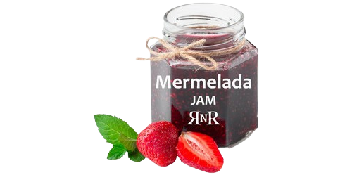

\sinc

## Licencia

&nbsp;

\conc

Creado para la [Mermelada Rolera 2025](https://itch.io/jam/mermelada-rolera-rnr-2025) organizada por [Rolerøs No Representativøs](https://rolerosnorepresentativos.itch.io/)

Hecho bajo licencia **[CC BY 4.0](https://creativecommons.org/licenses/by/4.0/legalcode.es)**. Imágenes libres de derecho de [freepik](https://www.freepik.com/): [castillo gótico entre nubes](https://www.freepik.es/vector-gratis/iconos-dibujos-animados-castillo-medieval-personas-antorchas-mazmorras-ilustraciones-vectoriales-aisladas_37366209.htm), [señal SE VENDE](https://www.freepik.es/vector-gratis/coleccion-carteles-venta-inmobiliaria_9914038.htm), [bordes piedra](https://www.freepik.com/free-vector/set-seamless-pattern-old-gray-stone-border_11140421.htm) y [fondo de piedra](https://www.freepik.com/free-vector/stone-wall-texture_957408.htm).

\sc

