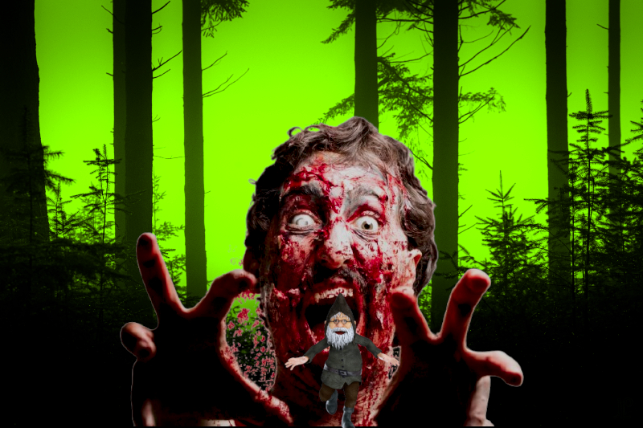

# Gnomocalipsis

Gnomocalipsis es una ambientación en una página para [Breathless](https://fari-rpgs.itch.io/breathless-srd) sobre una comunidad de gnomos islandeses que debe sobrevivir a un apocalipsis zombi.

## ¿Qué ha pasado?

El bosque de Hofði en Islandia era un tranquilo lugar donde habitaba una comunidad de gnomos lejos de los ojos de los humanos. Vivían en paz y armonía hasta que un apocalipsis zombi asoló la tierra.

Aunque son  inmunes a la enfermedad zombi, ahora tienen que sobrevivir a los ataques de los caminantes que se adentran en su bosque a devorar su carne.

Los gnomos eran casi invisibles para los humanos a excepción de algunos niños y niñas, pero, a diferencia de los humanos, los zombis si pueden verlos y cuando se encuentran con una comunidad gnoma, la destruyen y se comen a todos sus habitantes.

Y no solo deben enfrentarse a zombis, el clima se ha ido a la mierda y el mundo es un perpetuo inverno que hace muchísimo más difícil la supervivencia.

## Creando tu gnomo

XXX

## El día a día

La vida es muy dura para la comunidad de Hofði. Los ataques de gigantescos zombis son cada vez más frecuentes y conseguir comida es muy complicado. 

Los zombis han acabado con casi toda la fauna y la desaparición de los humanos ha hecho que millones de desastres ecológicos por todo el planeta hayan mandado a la mierda el clima. Los gnomos viven en un invierno continuo, sin ver casi el sol, con lluvia y nieve continua.

Conseguir comida es el principal problema de la comunidad y cada vez hay que irse más lejos y arriesgar más para conseguir alimentos.

XXX

## Darse un respiro

Para poder darse un respiro deberán poder acampar y descansar y eso se puede hacer siempre que no haya zombis cerca.

XXX

## Combatir a los zombis

No hay forma de combatir contra un zombi, son monstruos gigantescos que se mueven lentamente y devoran todo lo que encuentran.

Pero si se les puede distraer y llamar su atención hacia otro lado o encerrarlos en alguna sala o inmovilizarlos con alguna trampa.

### Movimiento y tamaño

Los gnomos son increíblemente rápidos, de forma que no eran casi perceptibles por los humanos. Si a eso le sumas la lentitud de los zombis, para los gnomos es como si se movieran a la velocidad de glaciares.

Esa es la gran ventaja que les permite combatirlos y defenderse de ellos. Esto permite a los gnomos escalar por los zombis e intentar algún plan descabellado.

Otra cosa que debes tener en cuenta es la diferencia de tamaño. Un gnomo mide unos 15 cm, unas 12 veces menos que un zombi. Eso supone que cualquier ataque de un zombi es mortal. Si no lo esquivas o si te atrapa, ten claro que acabarás devorado.

Si tus gnomos pierden todo su estrés frente a un zombi, estos serán atrapados y devorados por un zombi.

### Defensas y armas

Como ya hemos dicho las armas no son eficaces contra los zombis, solo contra otras criaturas como pudieran ser ratas rabiosas o gaviotas hambrientas.

Lo único eficaz contra los zombis son las defensas y trampas. Por ejemplo, en Hofði hay un perímetro de seguridad que hace sonar unas latas y campanillas cuando se acerca un zombi. Hay también una serie de trampas de pozo con pincho a donde se les atrae para acabar con ellos.

## Botín y tecnología humana

En Gnomocalipsis hay dos tipos de botín:

* **Botín del bosque:** XXX. El botín del bosque solo se encuentra en zonas donde no había humanos. 
* **Botín humano:** XXX. El botín humano se encuentra en zonas donde había humanos y también en los cadáveres de los zombis.

Los gnomos siempre han considerado la tecnología humana como una ofensa contra la naturaleza, pero en situaciones desesperadas, medidas desesperadas y hay grupos de gnomos que se internan en los edificios humanos abandonados para conseguir tecnología útil.

La tecnología humana ocupa dos espacios en tu petate, pero es muy útil con los zombis, así que tiene un nivel más a la hora tirar, aunque conservan su nivel normal a la hora de gastarse.

Los **kits médicos** son emplastos e infusiones de hierbas curativas del bosque y **solo se pueden conseguir en el bosque**. Los medicamentos humanos no sirven para gnomos.

Veamos algunos ejemplos de botines.

|Botín humano|Botín del bosque|
|---|---|
|Cordones|Lianas|

## Tramas

XXX
