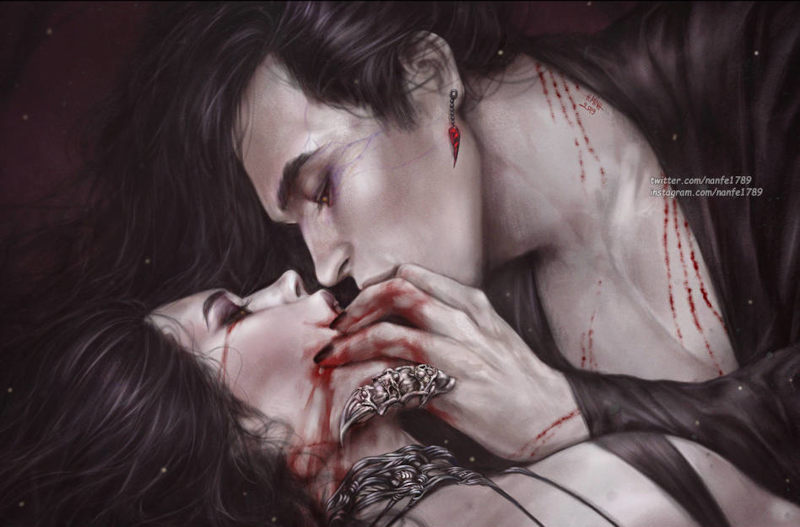
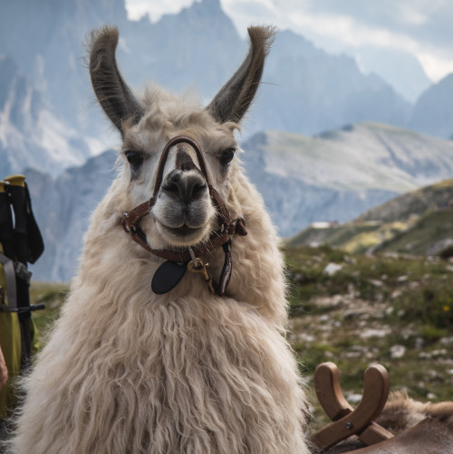
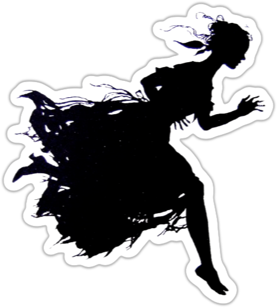

# Soy una cazavampiros

## Me llamo Berta de Cantaverno, tengo 12 años y soy una cazavampiros.

En este libro que tienes en tus manos te enseñaré como detectar vampiros, encontrar su guarida y matarlos a tiempo de volver a casa para cenar y hacer tu directo de Twitch.

Si han empezado a pasar cosas en tu barrio como desapariciones sin explicación, ataques de animales extraños, robos en bancos de sangre, … estate segura de que son malditos vampiros.

Y hazme caso, _necesitas este cuaderno_ si quieres salir viva y llegar al instituto.

### Decálogo de la cazavampiros

1. **Acabarás con los vampiros** donde se alimenten y duerman. Investiga y busca durante el día, ataca y mata de noche.
2. **Siempre tienen un plan** y si no lo has descubierto es que no has investigado lo suficiente.
3. Si alguien es mordido por un vampiro, **se convertirá en vampiro y deberás eliminarlo**. A veces será duro porque pueden ser amigas o familiares, pero ya no son humanas, solo sanguijuelas.
4. **No tengas un crush por un vampiro, vampira, vampire** por guapo que sea. No te quiere a ti, solo tu sangre fresca.
5. Si puedes ver al vampiro, es que te vio hace mucho tiempo, prepárate.
6. **No te creas ninguna de las explicaciones de los mayores,** son todas mentiras. Están todos manipulados por los vampiros o directamente les sirven.
7. **Te leerás Drácula todos los años**, hay que revisar las bases cada poco tiempo.
8. **No te fíes de las redes.** Pueden ser útiles, pero ellos las controlan.
9. **Organiza y pasa a limpio todos tus apuntes.** Recuerda que se descubrió el plan de Drácula porque Mina Murray organizó y pasó a limpio las notas, cartas y apuntes de sus compis. Además, nadie puede hackearte lo que tengas en papel.
10. ~~Sororidad~~ **Confía en tus amigas**, ellas son tu fuerza. Nunca te separes de tu panda.

```
AVISO: Este juego es sobre niñas que cazan vampiros, pero no es para menores. Tiene temas adultos, drogas, situaciones duras y violencia en la que se verán enredados menores, así que deberías avisar a tu mesa de lo que se va a encontrar durante las partidas.  
```

***

# Los vampiros

Los vampiros, nosferatus, chupasangres, sanguijuelas, … han estado desde siempre entre nosotros. Y siempre tienen un plan de dominación.

Ahora veamos como son, de donde vienen y lo que es más importantes como devolverlos al infierno del que salieron reptando.

## ¿De dónde vienen?

Pues tras muchos meses de estudio no he podido encontrar una respuesta clara. Hay tantas teorías como podcasts de fenómenos extraños y hacedme caso que hay muchos podcasts.

Estas son las que veo más probables:

* **Maldición:** hay varias opciones en cuanto a su época, ~~mesopotopomica~~ mesopotámica, egipcia o etrusca y casi siempre tiene toque bíblico, donde castiga con el vampirismo a un malo malísimo.
* **Siervos de la Muerte:** otra teoría es que son algún tipo de siervos de algún dios de la Muerte y el inframundo, rollo Anubis el Chacal o Hades el-machista-secuestra-persefones. Esto explicaría por qué la luz del día los mata.
* **Aliens:** los vampiros no son de este mundo, vienen del espacio exterior y por eso son tan diferentes a nosotros los humanos. La teoría de los astronautas vampiros ancestrales está muy de moda y pueden escuchar más en muchos de los podcasts que lo tratan.
* **Mutación/enfermedad:** puede que sean producto de una mutación o enfermedad como en Blade. Igual al principio solo bebían sangre humana por vicio, como mis padres con las morcillas del pueblo, y terminaron cogiendo algo chungo. Casarse entre primos también puede hacer esas cosas, o eso dice mi padre cuando sale el Rey en la tele.

[](https://www.deviantart.com/zeilyan/art/Rain-574414420 "Retrato de Vlad III")

* **Descendientes de Drácula:** no es la más lógica, aunque ninguna de las anteriores es mucho mejor, pero puede que todos los vampiros provengan de Vlad Dracul, el supuesto vampiro original. La pregunta es _quién convirtió a Drácula en vampiro._

> Si tienes tu propia teoría mándame un MD explicándomela, igual estamos ante la verdad.

## ¿Cómo son?

De normal son guapos a rabiar en lo que he denominado su forma _Crush_. Son seductores, tienen voz de K-Poper y se mueven también como ellos. Puedes de cualquier forma no hay un patrón, pero siempre están más pálidos de lo normal y no suelen tener casi bello corporal y es fácil detectarlo, porque son muy dados a enseñar cacho.

Pero en su forma real, denominada forma _Trash_, son feos a rabiar. Su piel es gomosa, sus ojos saltones y demasiado juntos y sus dedos alargados y ganchudos. Van encorvados y no paran de moverse.

De normal van en su forma Crush, pero el Trash sale cuando sienten miedo, son heridos o se cabrean mucho. 

Odian esta forma y si bien son más poderosos a nivel físico, también son más tontos y se les puede engañar más fácilmente. Además, sus poderes de Crush desaparecen.

_CRUSH: Normalmente los vemos así_

[](https://www.deviantart.com/zeilyan/art/Rain-574414420 "Rain By Zeilyan")

No te putopilles

_TRASH: En realidad son así_

[](https://www.deviantart.com/rachaurux/art/Nosferatu-124220759 "Nosferatu By Rachaurux")

Pueden tener muchas formas, altos, bajos, mazados, fibrosos, rubios, morenos, rapados (que no calvos). La realidad es que pueden ser de cualquier forma, desde ligeros y ágiles cantantes pop a poderosas amazonas racializadas.

[](https://www.deviantart.com/nanfe/art/Darker-Than-Tears-784728854 "Darker Than Tears By NanFe")

### Alimentación

Los vampiros beben exclusivamente sangre fresca de humanos. No toleran otros tipos de sangre y no debe haber pasado más de 12 horas de su extracción. Con lo que tampoco les vale toda la sangre que hay en un banco, solo la recién extraída.

Un nosferatu medio, si está asentado y no tiene problemas, suele beber sangre unas tres veces a la semana. Pero en casos de necesidad puede subsistir con una vez a la semana, pero pasará mucha sed, hambre, … lo que sea. Normalmente, cuando están hambrientos no pueden acceder a su forma Crush, se guían más por sus instintos y la forma Trash sale a la luz todo el rato.

El proceso de alimentación no suele ser rápido y necesitan un par de minutos mientras chupan a su víctima hasta quedarse llenos. La ventaja es que son tremendamente vulnerables en esta situación, con lo que es un buen momento para atacar.

Son muy buenos ocultando sus mordiscos en público y la verdad que pueden parecer un par de amantes enrollándose. Por lo menos yo, gracias a la profa de Educación sexual, puede distinguir un rollo de un vampiro dándose un festín. 

#### Víctimas

Las víctimas de un vampiro pueden ser de cualquier tipo y condición, sobre todo cuando están hambrientos, pero en general su ego les lleva a escoger a aquellas víctimas masculinas y femeninas muy guapas y fit.

Es un rollo marichulo de «soy un alfa» y mis bros no me pueden ver con una víctima que sea menos que yo. No os podéis imaginar la de vampiro que hay adictos a los vídeos de ShitTubers como el Llados.

Una víctima de vampirismo suele presentar unos síntomas básicos muy parecidos a una gripe chunga, debilidad general, mal color, falta de apetito, vómitos y algunas veces diarrea.

Si la víctima no se aleja del vampiro, yéndose, por ejemplo, a otra ciudad, o el vampiro muere (cosas de la que tú deberías encargarte), terminará muriendo por alguna enfermedad común agravada por su anemia vampírica. 

Si muere, el vampiro o sus sirvientes se encargarán de dejar pruebas que expliquen su muerte, desde drogas escondidas en su cuarto a pruebas de una TCA. Son extremadamente creativos en esta mierda y sé que disfrutan mucho con esta parte. ¡¡¡¡PUTOS VAMPIROS!!!!

Los vampiros suelen morder en cuello y muñecas, por lo que deberías buscar principalmente en esos sitios marcas de mordiscos. Las muñequeras de pinchos y los chokers de cuero son una buena protección, porque cubren esas 2 zonas.

#### Territorios de caza

Sabiendo todo lo anterior es fácil deducir que sus territorios predilectos de caza son discotecas, salas de conciertos y gimnasios de alto standing. No te fíes de monitores de gimnasio y de camareros de disco, suelen ser sirvientes. Aun así no te confíes, cualquiera puede ser un vampiro y su territorio de caza ser desde un centro comercial a un parque infantil donde seduce a padres y madres solteros y divorciados haciéndose pasar por otra desdichada alma solitaria.

Si es lo suficientemente rico y poderoso, deja de cazar y simplemente espera en su mansión a sus sirvientes le traigan víctimas que desangrar. Aun así cada cierto tiempo, sienten la necesidad de salir a cazar solos. Les gusta la emoción de la caza y perseguir a su presa. Ese es un buen momento para acabar con las sanguijuelas que están más protegidas.

### ¿Puedes consumir sangre de vampiro?

Puedes, otra cosa es que debas. Beber sangre de vampiro te da superpoderes a lo Capitana Marvel, eres más fuerte, más rápida, más resistente y puedes flotar. El efecto dura unos minutos donde te sientes la leche.

El problema es que después te deja muy doblada. Y tras unos minutos terminas devolviendo toda la sangre tomada y vuelves a estar normal. Ya os digo que esa vomitona es de lo peor que puede pasarte.

No lo tengo estudiado (es puto desagradable andar haciendo pruebas), pero seguramente habrá sangres de vampiro más poderosas que otras.

[ By SlyLaika")](https://www.deviantart.com/slylaika/art/Sorry-I-m-Not-Made-of-Sugar-Screenshot-Redraw-897706855 "Sorry I'm Not Made of Sugar (Screenshot Redraw) By SlyLaika")

### Falsas creencias

Hay una serie de creencias populares sobre los vampiros que he podido que no son verdad o por lo menos he podido comprobar que las hagan.

* No se transforman en niebla.
* No se transforman en lobos o murciélagos. Igual sí, pero con los locos de caza igual salen escopeteados.
* No tienen sentido radar como los murciélagos.

* Sí flotan, pero no son grandes voladores. Lo justo para escapar de una turba y llegar a las ventanas de los pisos superiores para mirar, todo muy cripi.
* No tienen problemas con las vías de agua. Pueden pasar encima de ríos sin problemas.
* No tienen ninguna marca especial, ni estigmas, como mucho no tienen casi nada de bello corporal.
* No necesitan dormir sobre tierra de su país natal y tampoco tienen que dormir en ataúdes.
* Los vampiros no tienes poderes mágicos, no lanzan hechizos, ni maldiciones, ni portan objetos mágicos. Como dice Marisa, no dan loteo. Tampoco hacen rituales para invocar a sus dioses.
* No tienen poderes sobre los animales, como ratas o perros. De hecho, la mayoría de los animales se alejan de ellos.
* No vomitan todo lo que comen. Pueden fingir que tragan alimento, pero deben vaciar el estómago cuando se llena.

## ¿Dónde duermen?

La imagen clásica del vampiro en un ataúd con tierra de su país de origen está bastante alejada de la realidad. No necesitan ninguna de esas cosas, solo un _sitio seguro_ y donde _no entre la luz del sol_. Puedes dormir en una cama supergótica con doseles y cortinajes supergruesos o dentro de una compleja caja metálica anti-cazavampiros en una habitación del pánico. En caso de necesidad, colgando bocabajo de la viga de un desván o arrebujados en un conducto de ventilación de un garaje subterráneo. 

Principalmente, duermen cerca de sus territorios de caza, muchas veces incluso en el propio territorio. Si caza en una disco de su propiedad, tienen montado en el local un despacho donde duermen, o quizás tengan una tienda alquilada en eternas reformas en el centro comercial por donde se mueven.

Sea como sea, la amenaza de la luz del sol, les hace que no se alejen mucho de sus refugios. El hecho que durante el día sean vulnerables hace que sean muy cuidadosos a la hora de volver a sus guaridas, extremando las precauciones y vigilando que nadie les siga.

### Alcantarillado

[](https://www.deviantart.com/tonywashingtonart/art/TMNT-sewer-1-58169816 "TMNT sewer 1 By Tonywashingtonart")

El alcantarillado es el salvavidas más común para estas criaturas. Cuando el amanecer les pilla lejos de su guarida, suelen recurrir a las alcantarillas. Suelen moverse por ellas hasta llegar a un colector donde buscará algún hueco o conducto donde esconderse para pasar el día.

> Un buen mapa de las alcantarillas de tu barrio con sus colectores principales y como llegar a ellos es muy muy muy muy útil.

Suelo sacar fotos de las alcantarillas y si cuando busco a una sanguijuela detecto que una alcantarilla está movida ya sé por donde ha intentado escapar. No es un método perfecto porque hay gente que las revisa y las mueve, pero es bastante efectivo.

### Pisos turísticos

No es la primera vez que usan pisos turísticos como guaridas temporales o permanentes. Lo primordial es que no necesitan ser invitados porque no son el hogar de nadie. Se contratan por internet y la mayoría de las veces ni aparece el dueño a abrirte. Entra y sale mucha gente variada a horas raras, el ruido y los gritos son normales, así que son tapaderas perfectas para sus actividades.

[](https://commons.wikimedia.org/wiki/File:Key_safe_combination_wall_mounted.jpg "Wall mounted combination key safes by Acabashi")

> Siempre que puedas, jode las casetillas con las llaves. La silicona es barata y funciona de miedo. Cuantos menos pisos turísticos en el barrio, más seguro será.

### Protección de sus guaridas

Las guaridas de los vampiros, salvo extrañas excepciones, son tan grandes, lujosas y seguras como el nivel del chupasangre. Más nivel, más espacio, lujo y seguridad. Así que un vampiro newbie puede tener un pequeño recinto asegurado y un Lord vampiro tendrá un ático que es casi una fortaleza con seguridad armada y sistemas de vigilancia de última generación.

Aun así, hay una serie de aspectos que hasta el vampiro más cutre tiene en sus guaridas.

* __Insonorizado__ para que no oiga gritar a las víctimas.
* Están __aislados del sol__ con cortinones, persianas y directamente sin ventanas.
* Tienen buenas puertas de seguridad con __cerraduras de última tecnología__ que son muy complicadas de abrir.
* Están __protegidas contra el fuego__ con materiales ignífugos y medidas antiincendios.
* Suelen tener una __pequeña armería__ con un par de las armas preferidas de la sanguijuela que pueden ser desde una hacha de guerra o un alfanje hasta una Glock con mira láser.

A partir de ahí puedes meter lo que quieras, habitación de invitados, celdas, diferentes salas de diversión, quirófanos, … lo que tu imaginación se le pueda ocurrir. 

Pasarte por las obras de los pisos como los jubilados y dar un vistazo a las licencias de obra que deben exponer públicamente pueden darte pistas de lo que están haciendo y detectar guaridas vampíricas. 

## ¿Cómo matarlos?

La verdad que para ser seres inmortales y superpoderosos, los vampiros tienen muchas debilidades muy estúpidas que debes aprender a aprovechar si quieres durar muchos años como cazadora.

### Estacas de madera

La tradición marca que un vampiro muere si su corazón es atravesado por una estaca de madera y es totalmente cierto. 

Lo que pasa es que es algo muy complicado, debe estar dormido o inmovilizado para hacerlo. Bueno, si cae sobre una valla de madera igual alguna de las tablas atraviesa su corazón. Sea como sea, es una medida bastante fiable de que no volverá a molestar.

[](https://www.amazon.es/encuestas-pulgadas-construcci%C3%B3n-topograf%C3%ADa-utilidades/dp/B0C6K6YVZ5 "Estacas de Amazon")

La combinación estaca en el corazón + cortar cabeza es lo más afectivo. De ahí sí que retorna ninguno. El problema es que cortar un cuello es muy difícil con el cuchillo jamonero.

Quemar el cuerpo después de estarlo puede funcionar, pero se montan unos fuegos artificiales muy chungos.

Os recuerdo que puedes comprar estacas en Amazon y estarán mañana en casa, pero si puedes, COMPRA EN LOCAL :)

### Ajo

El ajo no solo repele a los chupasangres, el contacto les hace daño y puede ser mortal si consigues que lo ingieran. Métele una cabeza de ajo en la boca y verás fuegos artificiales de sesos de sanguijuela.

El ajo picado o en polvo son igual de efectivos que las cabezas de ajo y es mucho más práctico. Pero por experiencia te diré que el pan con ajo del Telepi ni lo huelen. 

#### Té de ajo

Mi mayor descubrimiento en mi carrera de cazavampiros es el té de ajo. Esta infusión de ajo es capaz de dañar a los vampiros como si fuera agua bendita o fuego.

La receta es simple, una cabeza de ajo por cada 2 litros de agua y ponerlo al 5 durante 1 hora. Esto te deja un 1 litro de té de ajo preparado para meter en bombas o pistolas de agua.

###  Fuego purificador

El fuego también es mortal, pero la verdad es bastante ingobernable y puedes acabar quemando todo el barrio. Y encima luego viene la policía a investigar el incendio.

Lo bueno es que conseguir fuego es fácil, un mechero y gasofa y tienes fuego. 

En serio, úsalo como último recurso.

### Luz del día

La luz del día es mortal para estas sanguijuelas. Unos pocos segundos expuestos a la luz solar y se convierte en cenizas. Así que tus operaciones deberían ser de día, cuando duermen y son más débiles.

Siempre que te muevas por una de sus guaridas trata de abrir ventanas, quitar papeles de los cristales y descorrer cortinas (cómo les gustan los cortinones de abuela). Cuanta más luz entre, más seguro será para ti.

Las linternas UV (ultravioletas) que todos conocemos como luz negra funcionan de lujo y dañan a los vampiros, pero no son tan mortales como la luz del sol. Puedes quedar de rarita llevando una en la mochila, pero es que además de dañar a los vampiros, puedes usarlas para _detectar fluidos como sangre_.

[.jpg "Cuatro modelos de pililla benditera o aguabenditeras de loza popular española. ")](https://es.wikipedia.org/wiki/Benditera#/media/Archivo:Benditeras_espa%C3%B1olas_(XVIII_al_XX).jpg "Cuatro modelos de pililla benditera o aguabenditeras de loza popular española. ")

### Agua bendita

El agua bendita es igual de efectiva que el ajo y encima es fácil de conseguir. Entras en la parroquia de San Julián sin que te vea el padre Ambongo y metes la botella de agua en la fuente de la entrada o en donde bañan a los bebes.

El problema del agua bendita es que el sacerdote que la bendiga debe creer y tener fe y, por tanto, puede pasarte que la lances al nosferatu y no tenga efecto porque el cura es un falso. Si encuentras una iglesia con agua bendita real, tienes un tesoro porque son muy raras.

### Plata

Los objetos dañados en plata dañan a los vampiros, da igual que sea un cuchillo para mantequilla, que un anillo, que la tetera de tu tata. Si es de plata puede hacerles daño. 

Les hace grandes heridas y mucho dolor y normalmente se acobardan bastante si tienen una buena provisión de plata, porque el simple roce es muy peligroso para ellos.

[](https://es.wikipedia.org/wiki/Denario#/media/Archivo:TRAIANUS_RIC_II_291_732081.jpg "Monedas superviejuners de plata")

Tengo la teoría que cuanto más vieja más efectiva es la plata, así que comprar monedas de plata en el rastro no es mala opción. Cómprate un álbum de monedas y mételas dentro y tus padres estarán contentísimos.

Las balas de plata serían realmente útiles, pero las menores no tenemos acceso a este material. Por eso, estas vacaciones, igual, tengo tiempo de probar con un tirachinas con cuentas de plata. Seguro que si impacto en la cabeza de unos chupasangres, le dejo inconsciente lo suficiente para trincharle el corazón con una estaca. 

> Las cosas bañadas en plata son tan útiles como si fueran de plata y ¡¡¡¡¡MUCHO MÁS BARATAS!!!!!

Las películas viejas de los abus, esas que son como de cine, están hechas de plata y son geniales para inmovilizar vampiros, son como las bridas que usa la policía para detener mucha gente en las manifas.

### Cosas que he probado y no funcionan

La experiencia me ha ayudado a descubrir cosas que funcionan y no funcionan con los chupasangres. 

* No te fíes de tu abuela cuando te diga que su cubertería es de plata, la mayoría son de alpaca plateada y no sirven contra los vampiros.
* Solo las cruces funcionan y solo si eres muy creyente, que no es mi caso, ya que ni estoy bautizada.
* Los petardos no son más efectivos que en un humano. Si consigues uno gordo, puede que algo le haga, pero no es mortal. Aprovecha las fiestas para hacer acopio y recuerda que la pólvora caduca. Los hermanos mayores son una buena fuente de petardos.
* Los extintores ni los notan.
* Los tasers solo churruscan un poco su piel y huele a bacón chungo, pero ni lo notan.

## Sus planes

Los vampiros y los planes siempre van unidos, es parte de su naturaleza inmortal.

Primero porque lo ven a largo plazo y los planes largos y complicados con muchos pasos se ajustan a esa visión a largo plazo.

Segundo, porque esa inmortalidad les aburre y necesitan un juguete complicado y largo que les dure tiempo.

> Vamos, como diría mi abu: Las manos ociosas son el taller del diablo.

Si te encuentras un vampiro, estaré segura de que está planeando o ejecutando un plan. En cuanto terminan un plan empiezan con otro, ni los disfrutan.

### Estructura social

Para entender los planes de los vampiros debemos entender primero su sociedad. Cuando hablo así parezco mi profa de Sociales.

Los vampiros tienen una estructura social basada en su poder y antigüedad. Estando los newbies o más débiles abajo y arriba el Lord Vampiro, con un par de niveles intermedios.

Los de arriba mandan sobre los de abajo y los de abajo cuando pueden acaban con el de arriba y toman su sitio. Aquí nadie se jubila y se va a vivir a la playa LOL así que el único modo de ascender es cargándote a tu jefe (uno de los sueños de mi madre).

__¿Puedes asociarte con un vampiro para cargarte a otro?__ Puedes, pero ten claro que la siguiente en su lista serás tú.

__¿Intentarán comerte el tarro para que los dejes vivos y vayas a por su jefe?__ Lo intentarán siempre y no te extrañe que dejen pistas falsas que lleven a otro vampiro al que quieren cargarse.

[](https://www.freepik.es/foto-gratis/composicion-concepto-verdad-escritorio-detective_16691262.htm "Composición del concepto de verdad en un escritorio de detective by freepik")

### Planes sobre planes

Los planes vampiros son como sus creadores, así que los planes vampíricos tienen muchos niveles con grandes planes que tienen subplanes más pequeños y así hasta planes minúsculos.

Lo interesante de los planes vampiros es que no siempre tienes que ir hacia arriba, puedes ir hacia los lados. Incluso puedes volver a empezar desde abajo. Pero mejor lo vemos con un ejemplo.

Tu madre empieza a tener problemas en el trabajo por los constantes cambios de cita para la diálisis de tu abu. Descubres que es uno de los funcionarios que pone las citas. Esto sería un __plan menor__.

Según tiras del hilo, oh sorpresa, descubres que trabaja para un vampiro novato al que le han encargado cargarse el centro de salud donde va tu abu. Esto es un __plan inferior__.

Al acabar con el vampiro encuentras mensajes de un señor X que le daba las órdenes (__plan medio__) y de otro vampiro noob que estaba desmantelando la casa de cultura, otro plan inferior.

En ese momento, puede ir hacia arriba e investigar el plan medio y al señor X. También puedes investigar el plan inferior y tratar de salvar la casa de cultura. En este caso igual tienes que empezar investigando los planes menores que se ejecutan en la casa de cultura.

Subir a un nivel superior de plan o explorar otros del mismo nivel pueden ser igual de útiles y eficaces. Si vas a por el señor X y su plan medio, está bien porque ascendientes hacia el gran plan y si acabas con todos sus planes inferiores, seguramente él vendrá a por ti.

|Plan|Quién lo controla|
|---|---|
|Gran plan|Lord Vampiro|
|Plan medio|Vampiro oldie|
|Plan inferior|Vampiro noob|
|Plan menor|Siervo|

También puedes pasar que tengas que volver a un plan menor porque afecta a tu entorno directo, como que cierran el taller donde curra tu hermano para poner una casa de apuestas. En este caso tendrás dos tramas de planes a seguir que seguramente llevarán al mismo Lord Vampiro.

Has de ser rápida al desmantelar planes porque pueden volver a aparecer o cambiar de forma en poco tiempo, sobre todo si el vampiro te descubre y/o escapa a tu caza.

#### Planes mundanos
 
Otro elemento importante de los planes de los chupasangres es que son muy mundanos, tremendamente mundanos. Nada de plagas de zombis, rayos vampirizante o control mental en tu serie favorita.

Son más convertir tu ciudad en una mierda, donde nadie se preocupa de nadie y todos tienen miedo de todos. Es ahí donde sus actos ni son detectados ni son perseguidos y donde viven como reyes.

#### Fantasías de poder

Necesitan tanto el poder como la sangre y por eso sus planes deben influir en muchas personas. Ver a tanta gente bajo el poder de sus planes les encanta, les excita mejor dicho.

Piénsalo así, lo normal un vampiro habría acumulado millones de € a lo largo de los años con sus poderes y tendría a un par de siervos invirtiendo en bolsa. Seguramente se habría comprado una isla y haría traer a víctimas para bebérselas. 

Pero no, un vampiro tiene que cargarse las infraestructuras sociales de un barrio para que la gente del barrio se vaya, luego gentrificarlo y llenarlo de pisos turísticos y bares de borrachera para poder beber de ingleses y alemanes borrachos que volverán a su país con una anemia brutal. Necesita que haya miles de vidas jodidas para estar satisfechos.

[](https://worleygig.com/2013/10/01/vampire-street-art-sticker/ "CVampire Street Art Sticker by Worley Gig")

### ¿Cómo frustrar sus planes?

El modo de frustrar sus planes es avanzar poco a poco hasta llegar a su cima y al Lord Vampiro o socavarlo desde abajo para que el Lord Vampiro salga a la luz cuando su castillo de naipes empiece a caerse.

Debes ser rápida porque los planes como los vampiros regeneran y, en pocas semanas, el plan desbaratado ha respawneado con una nueva skin.

Frustrar planes grandes o pequeños no implica acaban con el enemigo que lo llevaba a cabo, implica muchas veces sanar y fortalecer esa parte del barrio y conseguir unos aliados que te ayuden cuando subas de nivel en la estructura de planes y los enemigos sean más poderosos.

Por ejemplo, evitar que se cierre un centro de salud, puede granjearte la amistad de la jefa del laboratorio, que seguramente hará pruebas y análisis a las muestras que envía el anónimo salvador de su centro.

> Recuerda que sus planes suelen ser muy mundanos y muchas veces basados en minar las estructuras sociales de ayuda, así que apoyar a los diferentes grupos que trabajan día para mejorar tu ciudad es una manera de prevención contra las actividades de los vampiros. Ir un día a trabajar al huerto urbano de tu barrio, hacer carteles contra una protesta por la tala de árboles en el parque o servir comida en el comedor social son formas también de luchar contra los vampiros. 

### Los grandes vampiros y sus grandes planes

Como ya hemos aclarado, detrás de todo gran plan vampírico siempre hay un vampiro muy viejo, un Lord, una Lady o une Liege (gracias Macarena por esas horas de lenguaje inclusivo en clase de Lengua, a pesar de lo que dijo el director). 

De hecho, normalmente son Lieges Vampires, cuando eres tan mayor lo de la sexualidad fluida es bastante factible. Si queréis putomosquear a un vampiro-machito-alfa el Liege funciona. El resto se giran y le dan un morreo a la primera víctima/sirviente que pillan.

[](https://www.flickr.com/photos/silverfuture/7533629452/ "Vampire lips by Eric B.")

Los grandes planes tienen una cosa muy importante que nunca debes olvidar, __son como sus creadores__. Si el Lord Vampiro es maquiavélico, los planes serán maquiavélicos con muchas intrigas y traiciones. Si el Lord es sanguinario, muchos obstáculos se arreglarán con violencia, tortura y asesinatos. Si el Lord es un depravado, habrá todo tipo de drogas, parafilias sexuales, juego, … y participarán los personajes más cripis que puedas imaginar.

Una vez que sepas quién es el creador del gran plan, te será mucho más fácil deducir los diferentes elementos de cada subplan, porque al final van a tener el sello de marca del gran arquitecto que ha estructurado todo. 

Otro punto importante de los grandes planes es que una de sus funciones principales es alimentar el inmenso ego de su creador. Si el plan avanza bien, el ego del Lord crece, pero, si empieza a fallar, su ego se desinfla y dejan de actuar racionalmente y su ego dañado toma el control

Que su gran plan falle es malo para el ego de un Lord Vampiro. Que falle porque 4 niñas con pistolas de agua están haciendo el trabajo que deberían haber hecho policías e investigadores adultos, es un golpe mortal en su orgullo propio. Con el ego herido, un vampiro puede empezar a hacer actos sin mucho sentido y dar palos de ciego, pero se mueve mucho más agresivo y menos cauto.

## ¿Cómo puedes defenderte de ellos?

No solo debes acabar con los vampiros y frustrar sus planes, es importante salir viva y a poder sin recibir daño. Es por ello que debes saber como defenderte de esas malditas sanguijuelas.

### Ajo

Una buena ristra de ajos alrededor del cuello te da bastante protección, pero si están muy enfadados o hambrientos no les detendrá.

Tampoco sirve de nada con los sirvientes a los que no les afecta el ajo.

> No compres grandes cantidades de ajos en supers o por internet. Vigilan todas esas compras. La tienda de encurtidos de tu calle es mucho mejor. Así que como digo siempre COMPRA LOCAL.

### Reflejo en el espejo

Los vampiros no se reflejan en los espejos, pero solo en los viejos que debían tener algo de plata. Los modernos tienen aluminio y en esos se reflejan.

Eso convierte a estos viejos espejos de plata en los perfectos detectores de vampiros, sobre todo cuando en su modo Crush.
 
Una visita a la casa de tus abuelos en el pueblo, al rastro o una antiquaría y puedes conseguir un espejo eficaz. Yo uso uno con mango y baño de plata por si tengo que golpear con él.

Si se rompen los trozos de cristal, estos tienen plata y pueden usarse como arma.

### Invitación a entrar

Las sanguijuelas no pueden entrar en una casa si no son invitados, así que mi regla fundamental es no invitar a nadie a entrar. El problema es que tu familia no lo tiene en cuenta, así que siempre soy la primera en abrir la puerta de casa. Así el tonto de mi hermano no invita a entrar a quien no debe.

La invitación es personal, así que solo le vale al vampiro al que se la diste, ni sus siervos ni su Lord están cubiertos en esa invitación 

Si el vampiro rompe en tu casa las leyes de hospitalidad se puede revocar la invitación, pero vamos es difícil revocar algo si primero te han roto el cuello.

[](https://www.freepik.com/free-photo/young-woman-boxer-training-gym_6255935.htm "Young woman boxer training at the gym por senivpetro")

### Entrenamiento de combate

Puedes pensar que las MMA, el Brazilian Jiujitsu y mierdas similares te vendrán bien en tu batalla contra los chupasangres, pero no merecen la pena. No tienes ni el tiempo, ni el peso, ni la fuerza para ser un peligro. Además, los gimbros se reirán de ti.

Mi consejo es que aprendas _autodefensa_ _personal_ con el _grupo feminista de tu barrio_. Lo que te enseñen esas reinas será mucho más útil para alguien de nuestro tamaño que lo te puedan enseñar los kungfu-bros del gimnasio. 

### Gafas de sol

La manera más eficiente de no caer bajo el influjo de la mirada hipnótica de un vampiro es no mirarles a los ojos. Pero como es complicado muchas veces para matarlos, unas gafas de sol pueden ayudar.

Aparte, quedas muy fachera y recuerda que el estilo está por encima de la sustance.

### ¿Aliados?

TUS AMIGAS. No hay más.

## ¿Cómo se defienden?

Se defiende de nosotras de dos formas bien diferenciadas. Primero descrédito social y si eso falla pasan a lo físico.

### Ataques sociales

Mientras te muevas en la periferia de sus actividades, usarán todo su arsenal social para desacreditarte y aislarte, pudiendo llegar a desquiciarte y acabar en un psiquiátrico si no tienes una mente preparada.

Veamos algunas tácticas:

* Pueden convencer a los abusones del patio de que se ceben contigo y te cambies de colegio por otro más lejos.
* Mover hilos para despedir o cambiar de lugar de trabajo a tus padres o tutores y que tengas que abandonar el barrio.
* También pueden intentar quitarte las ayudas sociales que puedas estar recibiendo como forma de obligarte a buscar una manera de conseguir dinero en vez de cazar vampiros.
* Lanzarte hate desde redes, troles de internet, cuentas e imágenes fake, incluso hacerte pornoIA.
* Quizás hagan que te sigan peña cripi, solo para atemorizarte y tenerte en tensión.

La mejor defensa que tienes son tus socias y amigas. Ellas serán tu escudo contra toda la mierda que puede echarte encima. No digo que sea fácil con amigas, digo que sin su apoyo casi seguro sucumbes a sus ataques.

La ventaja de esos ataques sociales es que muchos son hilos desde los que tirar. Si te quitan la ayuda del comedor, puedes ir subiendo por la empinada cuesta de la burocracia hasta dar con el siervo que te ha hecho la putada y de él llegar al Lord Vampiro.

### Ataques físicos

Cuando empiezas a adentrarte en sus planes desbaratándolos y dándole problemas, es decir, cuando empiezas a truncar sus planes medios, suelen pasar al plano físico y periódicamente pueden enviar a alguien para acabar contigo.

Una cosa buena que tiene la naturaleza depredadora del vampiro es que cuando tiene una víctima y se pone en plan físico, se olvida del resto. En ese momento se olvida de tu familia, amigos, … Quieres hacerte daño a ti y solo a ti.

Si has seguido las normas estás bien protegida y preparada y tienes un grupo de sistars que te apoya, así que si mandan sirvientes humanos no son tan poderosos como para no poder derrotarlos o escapar de ellos. Si mandan vampiros, tu casa debería ser impenetrable y fuera de ella tienes armas para defenderte.

> Siempre que sea posible un chupasangre no se ~~manchará las manos de sangre~~ no intervendrá directamente en combates, eso supone muchas veces pasar a su forma Trash y lo odian, además se ven como pensadores maquiavélicos, no picadoras de carne. 

[](https://www.flickr.com/photos/mgabelmann/27199658215 "Vampire graffiti in a very remote setting by Michael Gabelmann")

Casi siempre tratan de trabajar a través de sus chupones o de los vampiros que están por debajo de ellos. No les gusta meter gente de fuera. 

Podéis pensar que podrían contratar a un grupo de supermercenarios para acabar con tu panda de cazadoras, cuando empiezas a desbaratar su plan, pero piensa que eres una niña de 12 años. Sería raro contratar a un mercenario checheno para que ejecute a un grupo de niñas de 12 años. Estos encargos provocan muchas preguntas. Además, que aparezcan 4 cadáveres de 4 niñas de un barrio, puede hacer que el barrio entero se levante y luche por él y eso es lo último que quiere el Lord. 

Un gran vampiro solo recurrirá a fuerzas especiales cuando su status se vea altamente en peligro, hasta ese momento tratarán de llevar todo a modo local.

### Sirvientes humanos

Los siervos, ghouls, thralls, renfields son diferentes nombres a través del tiempo y las tradiciones de lo que yo llamo _chupones_.

Los chupones son humanos que sirven a los vampiros, bien como herramientas de sus planes, bien como sirvientes o protectores.

El vampiro suele darle pequeñas dosis de su sangre para engancharles al subidón y que la resaca de después cada vez sea mejor. Si deja de recibir su dosis, volverá tras un mono brutal a la normalidad. 

Por eso cuando te enfrentes a un chupón deberías usar fuerza no letal. Al final muchas veces son víctimas del sistema y la gran mayoría pueden ser rehabilitadas. Solo unos pocos escogieron su depravado y cripi destino y buscarán otro maestro si no tienen uno.

Muchos sirvientes empezaron siendo víctimas. La mayoría de las veces, mientras las vigilaba y/o seducía, el vampiro vio cosas que le eran útil y paso de alimentarse de ella a convertirla en su sirviente.

No hay un patrón fijo para los chupones, pueden ser de cualquier estrato social, tener cualquier físico, cualquier profesión y cualquier ideología. Cualquiera puede acabar siendo un siervo de vampiro. Son un poco como las sectas, un momento de bajón y te enganchan.

Podemos hablar de 3 tipos de chupones, los que ejecutan sus planes, los que les sirven y los que les protegen.

En vampiros novatos que pueden mantener pocos siervos estos tres tipos se pueden solapar. Un Lord Vampiro tendrá varios siervos por cada tipo.

#### Ejecutores de planes

Estos chupones se dedican a llevar a cabo los planes vampíricos. Muchas veces ni saben que son forma de un plan, ni que trabajan para los chupasangres. Igual simplemente reciben órdenes por Telegram y Bizums con la pasta por su trabajo.

Otros, sin embargo, son adictos a su vampiro o incluso son parte fundamental de plan como políticos de la ciudad, altos funcionarios y banqueros. 

#### Sirvientes

Su vida está dedicada a servir a su amo vampiro al que casi siempre están enganchados. Limpian su guarida, cumplen sus caprichos y sobre todo se encargan de proporcionarles alimentación. 

Eso supone buscar a las víctimas preferidas de su amo y engañarlas para llevarlas ante su amo para que se alimente de ellas y luego limpiar todo y eliminar pruebas.

Si la sanguijuela es más de cazar por sí solo, le ayuda en la caza, aislando a la víctima de sus amistades, emborrachándola, … Luego se encargará de llevarla a casa o en casos extremos deshacerse del cuerpo sin dejar pruebas.

> La verdad que algunas veces los vampiros se vuelven tan dependientes de sus sirvientes que se convierten en unos inútiles que se mueren solos si les alejas de su servidumbre.

#### Protectores

Son protectores, pero también funcionan como fuerza de choque. Hablamos de gimbros que se ponían hasta arriba de anabolizantes y que ahora se dopan con sangre de vampiro. No son un portento de las peleas, pero tienen fuerza y aguante y han aprendido cosillas de boxeo y MMA.

La verdad que lo mejor es engañarlos, es muchísimo más fácil que enfrentarse con ellos físicamente. De todas formas, como nos enseñó Mónica del punto morado del barrio, todos caen, si aciertas en los pendientes reales.

## ¿Y si me convierto en vampiro?

Pues estás jodida y no hay mucho que hacer. Tus sistars deberían darte una muerte digna para recordarte cuando todavía no eras una asquerosa sanguijuela asesina.

Si estás sola, antes de caer, búscate un final que esos cabrones no olviden jamás. **Si vas a caer,** **que no sea sola.**

### ¿Cómo te transformas en vampiro?

Para acabar convertida en un vampiro es importante saber cómo es ese proceso.

Lo primero es estar al borde de la muerte, más allá que acá. Puede ser porque te hayan chupado la sangre o por culpa de las heridas del combate.

En ese momento, el vampiro puede decidir darte de beber de su sangre.

Un cuerpo humano que bebe sangre vampírica la combate y la termina expulsando, de ahí la gran vomitona al de un rato de beberla. Pero si tu cuerpo está muy débil, no puede combatirla y está termina apoderándose de ti.

En ese momento el proceso ya es irreversible, pero todavía no eres un vampiro, solo eres medio vampiro. Según pases los días, la sangre de vampiro irá poco a poco tomando el control de ti hasta que te obligue a beber sangre fresca. En ese momento ya eres un vampiro completo con todas sus fortalezas y debilidades.

Normalmente, la primera vez que te alimentas suele ser un fiestón de sangre y miembros desmembrados, así que los casos de asesinatos más brutales suelen estar relacionados con vampiros noobs, aunque los medios traten de taparlo achacándolo a otras cosas.

## Bibliografía para cazavampiros

Aquí tienes algunos libros, pelis y podcasts que te pueden dar más información. Ninguno tiene toda la verdad, pero cogiendo cositas de uno de ellos puedes tener una visión bastante cercana a la realidad.

Este listado es abierto. Si conoces algún buen libro o peli, mándamelo a mis redes y miraré de meterlo.

### Libros

* **Drácula de Bram Stoker.** PEC El libro texto básico que es recomendable releer cada poco. Recuerda el séptimo mandamiento de la cazavampira molona.
* **Carmilla de Joseph Sheridan Le Fanu.** PEC Difícil de encontrar y muy corto, necesito una segunda parte ya.

### Películas

* **Nosferatu.** Puedes encontrarte dos versiones, una con mala calidad y sin sonido y otra que si tiene sonido y mucha calidad. La que encuentres.
* **Jóvenes ocultos.** Película muy viejuner que pillas a la noche en canales cutres, pero le chifla a mi tío. Fiel reflejo de lo que pasa cuando los mayores no nos creen.
* **Saga Crepúsculo.** Pura propaganda vampira. _NO VER NUNCA_
* **Salem’s Lot.** Hay libro, pero habiendo peli, mejor peli. En esta peli se ve como todo vampiro tiene un plan de dominación.

### Series

* **Monster High.** Perfectas para verla con tus amigas y tantear lo que piensan de Vampilaura y los de su calaña.
* **Lo que hacemos en las sombras.** La tendrás que ver a escondidas, porque «trata temas adultos y hay referencias sexuales». Muy divertida, pero más propaganda vampira. Quieren que creas que son unos imbéciles trasnochados, pero ES MENTIRA. 

### Podcasts y página webs

* **Cuentos de la casa de la bruja.** Muchos audiolibros de libros clásicos como [Drácula de Bram Stoker](https://www.ivoox.com/podcast-cuentos-de-la-casa-de-la-bruja_sq_f1421745_1.html).
* **tododevampiros.com.** [Página web](https://www.tododevampiros.com/) con contenido superinteresante y extraño.

***

# Las reglas del juego

## Defínete como cazadora de vampiros

Saber cuáles son tus puntos fuertes y débiles como cazadora de vampiros te ayuda a saber qué puedes hacer y qué no y a que puedes enfrentarte y a que no.

### Estilos

Salvo contadas excepciones, como Sara de mi clase, con 12 años no eres muy fuertes con lo que no deberíamos tener un estilo Vigoroso a nivel Grande y si Bueno solo en casos muy especiales. 

### Aspectos

Uno de tus tres aspectos secundarios debería ser _Soy una niña_, que refleja no tienes ni 12 años. Eso supone, entre otras muchas cosas, que no eres ni muy fuerte, ni muy alta, ni corres muy deprisa, pero puedes esconderte más fácilmente y meterte en sitios donde no entran los adultos.

#### Ganarse la vida en el barrio

Un aspecto definitorio de ti como tu joven cazavampiros es como te buscas la vida en el barrio. Todo esto no solo va a marcar tu forma de vida, sino también tu ética y tu relación con la ley.

**Pides la paga:** Pides a tus padres la paga todas las semanas. Es menos dinero que el resto de métodos, pero es dinero muy fácil.

**Haciendo recados:** Te dedicas a hacer recados por una propina. Cargas con paquetes, llevas mensajes, etc. siempre corriendo arriba y abajo de las calles y callejuelas.

**Cuidando animales:** Te dedicas a vigilar y cuidar de mascotas por una pequeña propina.

[](https://www.deviantart.com/mephisto123456789/art/Blood-880245401 "Blood By Mephisto123456789")

**Robando:** Entras en los supermercados y robas cosas que luego revendes a tu panda o a adultos o tal vez tengas habilidades de carterista.

**Mendigando:** Mendigas por las calles apelando a la buena fe y caridad de sus gentes. Puede que tengas una discapacidad o solo lo finjas, pero desde luego has aprendido a fingir pena para aflojar la pasta de los viandantes.

**Trabajo en el negocio familiar.**  Quizás repongas latas en el badulaque de tus padres o recojas mesas en el restaurante de tu abuela. Y todos los findes recibes una propinilla.

**Artista callejero:** Te dedicas a hacer malabarismos, a cantar, a bailar, a recitar poesía, etc. por unas monedas.

**Buscando en la basura:** Vives de lo que encuentras en la basura y los vertederos. Las cosas buenas las vendes y las útiles te las quedas.

```
Alguno de los aspectos de una cazadora podría estar relacionado con su forma de ganarse la vida. Si la forma de ganarse la vida de alguien de tu mesa no se ajusta a ninguna de estas opciones, puedes evaluarla y decidir si la permites, pero no deberías aceptar aquellas que vayan en contra de los derechos de la infancia como prostitución infantil.
```

#### ¿En qué eres bueno en el cole?

Quizás definir en que eres buena en el colegio te sirva para establecer otro de tus aspectos secundarios.

[](https://www.deviantart.com/valentinepsycho/art/Vampire-edited-80281908 "Vampire -edited- By Valentinepsycho")

Ser buena en matemáticas puede ayudarte a revisar un libro de cuentas y encontrar en que gastan los vampiros su dinero, mientras que ser una máquina en Lengua te permita entender y descifrar el código secreto que usan las sanguijuelas para encriptar sus mensajes. 

#### Apodos

Los apodos son importantes en el barrio, para bien o para mal te definen y tienen aspectos sociales y de cómo te perciben el resto de vecinos. Es por eso que cuando te pongan un apodo tus amigas debe ser por algo grande y espectacular.

## Regalos de cumpleaños y Navidad útiles para matar vampiros

Hay un montón de cosas útiles cuando cazas vampiros, pero normalmente pocas puedes comprarlas con tu semanada. Así que has de aprovechar cumpleaños y Navidades para pedirlos. 

No puedes pedir cualquier cosa (sueño con unas gafas de visión nocturna) porque no son cosas de niñas (mimimimi), así que aquí tienes cosas que puedes pedir que te regalen y no levantan sospechas en los adultos.

> Si compras online usa siempre puntos de recogida, mejor si son esos armarios metálicos en los que metes códigos larguísimos. Será más difícil rastrear un pedido extraño hasta tu casa.

### Pistolas de agua

¡¡¡Benditas pistolas de agua cargadas de té de ajo o de agua bendita!!! _Son tu arma más poderosa_, además de tu cerebro, contra los vampiros. Encima, cientos de personas de todo el mundo gastan un estúpido número de horas en mejorarlas y hacen tutoriales de ello :)

Hay cientos de vídeos explicando como hacer más efectiva tus pistolas, rifles y cañones de agua sin saber que han ayudado a parar la plaga vampírica que amenaza nuestros barrios y ciudades.

[](https://m.media-amazon.com/images/I/71aOczXzPvL._AC_SX679_.jpg "Pistola agua Xiaomi")

Puedes pillarte algo normalito durante todo el año, pero en cuanto llega el verano y las tiendas de juguetes se llenan de flotadores, colchonetas y churros de piscina, coge uno de sus catálogos y disfruta pensando cuál vas a comprarte para tu próxima misión.

### Globos de agua

**La versión vampírica de las granadas.** Estos 2 céntimos de plástico son devastadores en esos asquerosos bichejos si consigues impactarles. El problema es que son grandes y pesados y bastante frágiles. 

Si eres lista y hábil, sabrás adaptar tu pistola de agua para recargarla con globos de agua y buscarás la manera llevar un globo con el agua de tu pistola.

### Walkie-talkie

Esta tecnología retro, como dice mi tío, es la leche. Con 12 años o menos es complicado tener un móvil, pero es fácil tener unos walkie-talkies para comunicarte con tus si&#x2605;s. No deja registros, no es hackeable, funciona en sitios donde no hay cobertura de móvil, las baterías duran un montón, … todo son ventajas.

Si solucionarán lo del cambio y corto (mi tío se puso muy pesado con eso cuando me enseño a usarlo) serían la leche. Pero vamos Es de las primeras cosas que debes conseguir cuando salgas a cazar acompañada de tu panda.

[](https://www.freepik.com/free-vector/versatile-red-swiss-army-knife_146612585.htm "Versatile Red Swiss Army Knife by brgfx")

### Navaja suiza

Esta navaja con multitud de opciones te permite cortar, destornillar, cortar cables, abrir latas y quitar chapas, … recuerdo haber visto en Twitch una navaja de estas con sierra y otra con puntero láser. 

_Cuantas más opciones mejor_, pero las básicas ya son muy útiles y muy escondibles y tampoco es tan raro ver una niña con una pequeña navaja multiusos. 

Un par de escapadas al monte con el grupo de montaña del barrio y puedes conseguir que te compren una navaja suiza. También sirve de excusa para conseguir cuerdas, ganchos y mosquetones, … en general material de montaña.

Me puse a ver todos los programas de MasterChef Junior, a ver si conseguía que me comprarán un juego de cuchillos, pero no funciono. Quizás con unos padres menos responsables puedes conseguirlo.

Si la sacas delante de un adulto, se podrán a tararear un tema de una serie viejuner y alguno pedirá un chicle y un clip. Pase de preguntar, los boomers son raros.

### Protecciones deportivas

Empieza a practicar un deporte de contacto y tendrás la excusa necesaria para que te compren o regalen protecciones, **cascos, muñequeras,** **coderas, rodilleras, …**

Estas protecciones no te protegen de vampiros que siempre van a tus partes blandas, pero son buenas para caídas y golpes y llegar a casa llena de rasguños y morados y no tener que dar excusas a preguntas de tus padres.

[](https://www.deviantart.com/malvarisco21/art/Roller-Derby-Girl-585903000 "Pegatina Roller Derby Girl By malvarisco21")

### Muñequeras y chokers de pinchos

Como ya te he contado, los vampiros chupan la sangre principalmente de cuello y muñecas, así que unas protecciones de cuero con pinchos metálicos (ojalá fueran de plata las mías) son muy eficaces.

Si tu outfit es un poco alternativo, podrás llevar estos complementos sin dar mucho la nota. 

En las ferias medievales tienen mucha selección, con cuero bueno y pinchos bien afilados. También puedes pedirlo como parte de un disfraz de Halloween o robárselo a tu tío, el heavy trasnochado.

### Sudaderas con choto

Las sudaderas grandes son muy útiles sobre todo anchas. Pasas desapercibidas, ocultas tu cara con el choto y puedes llevar debajo protecciones varias como coderas. Además, sus grandes bolsillos te permiten llevar la pistola de agua sin dar el cante.

Junto al pantalón de chándal y unas deportivas es el outfit perfecto de la cazavampiros.

## El mundo cuando tienes 12 años

```
Aquí van una serie de consejos a la hora de jugar partidas con personajes menores de 12 años. Pero recuerda, son consejos, eres muy libre de llevarlo como tú quieras.
```

Tu mundo es diferente al de los adultos y por eso tienes que tener algunos conceptos muy claros.

### Los adultos son tontos

Esta premisa es básica. Las personas adultas no son tontas por sí mismas, son tontas porque nunca harán caso a un niño. Las ideas de las chicas son solo fantasías de sus cerebros sobreexcitados y no perderán un segundo en corroborarlas.

Es importante que tengas muy claro que por ese lado no tendrás la más mínima ayuda. Esto hará que si al final aparece un adulto para ayudarte sea más impactante.

Puede haber adultos que te hagan caso, pero son tan extraños y raros que el resto de adultos les tratan igual que a ti.

### Es un mundo para adultos

Para bien o para mal es un mundo de adultos, todo está pensado para esos gigantes que no escuchan.

La ropa, las armas y las herramientas son tamaño adulto. No puedes hacerte pasar por un adulto poniéndote su ropa, tendrás que subirte una encima de otra o usar zapatos altos o zancos.

Por otro lado, es más fácil librarte de grilletes o reptar por las alcantarillas cuando mides y pesas mucho menos.

### Nunca eres una amenaza

Los adultos nunca te consideran una amenaza, así que hay que aprovecharse de ello. Puedes fingir llorar para que tu captor baje la guardia y cuando se gire golpearle con algo contundente.

Solo un gran número de niñas armadas y con intenciones agresivas podría ser considerado una amenaza.

### Nadie se fija en ti

Puedes entrar en sitios en los que los adultos no pueden o no se atreven, principalmente porque no eres una amenaza. Solo necesitas una buena excusa.

Vete a cualquier bar de tu barrio por chungo que sea vendiendo boletos de una rifa y podrás moverte por el bar aunque lo tengas prohibido y escuchar todas las conversaciones adultas del local.

Si intentas pedir una cerveza se reirán de ti y te echarán a la calle y quizás llamen a tus padres.

## Las si&#x2605;s

Es imposible cazar vampiros sola, necesitas a tus amigas, a tus __SI&#x2605;S__, para que te ayuden, te den ánimos y te protejan. Y ellas también te necesitan a ti para que les ayudes, les animes y las cuides. Así pues, nunca never salgas de caza de sola, es un camino directo a la derrota. 

[](https://www.freepik.com/free-vector/bff-best-friend-forever-lettering-white-background_24084900.htm "Pegatina contraportada BFF por brgfx")

```
La pandilla puede ser otra fuente importante de aspectos secundarios, quizás tengan una relación especial entre ellas o sean familia. Si algún PJ ha dejado algún aspecto sin definir puede que al principio de tus aventuras puedan rellenarlo cuando conozcan a sus sistars más a fondo.
```

### Cómo montar y organizar el grupo

Montar tu propia banda de cazadoras de no es fácil, es cuestión de tener amigas de verdad y el momento adecuado.

Una vez que descubrí que el rollo de los vampiros y sus planes eran algo real, empecé a tantear a mis amigas. Una pijamada fue el momento perfecto para hacer las preguntas adecuadas en el momento adecuado.

Estaba acostumbrada a intentar hablarlo con adultos y siempre recibir las mismas respuestas, desde «vaya imaginación tiene esta niña» hasta «tus padres deberían consultar estos delirios con un especialista».

Sin embargo, esa noche hubo flow y empezamos a contar historias raras que habíamos visto o vivido y poco a poco la conspiración vampírica se hizo muy patente sin todavía darle nombre.

Esa misma noche montamos un Google Maps con las localizaciones de todos esos sucesos y enseguida vimos un patrón. 

A esa pijamada siguieron unas cuantas más donde seguimos investigando el misterio del barrio sin darle el nombre más lógico, VAMPIROS. Hasta que en la última aparecí las pruebas que conseguí de mi primera cacería y les conté todo lo que sabía.

Esa misma noche juramos combatir el vampirismo y formamos nuestra Banda de sistars cazavampiras, hicimos nuestro reglamento y lo juramos por nuestras abuelas.

Que haya amigas íntimas que no estén entre mis sistars no quieren decir que sean menos amigas, simplemente que no están preparados para la caza. Pero son igual de válidas y tan o más amigas que mi panda. Además, son por gente como ellas, por lo que salimos de caza por las noches, protegerlas de esos horrores.

> Este es el sistema que a mí me funciona con mis si&#x2605;s, pero igual no es el mejor para tu grupo de cazadoras, así que tómalo más como un ejemplo que como una guía que seguir.

#### Cargos

Al principio todo era muy caótico, cada una hacía lo que podía y quería, pero con el tiempo cada una de nosotras encontró su lugar donde hacía las cosas que le gustaban y sabía hacer bien.

```
Los puestos dentro del grupo de cazadoras también pueden ser origen de otros aspectos de tu personaje o por ejemplo que el aspecto de lo que «mejor se te da en clase» evolucione hacia tu puesto en la liga de cazadoras
```

**La reina** es la jefa, la capitana, la mandamás de la banda en una misión. Nosotras elegimos una reina por misión y su palabra durante la misión es sagrada. Pero igual vosotras preferís algo más duradero o más de votar todo.

**Dora** es la que sabe de mapas. Ella busca la ruta de entrada y salida más adecuada y todo lo que ello conlleva, desde bonobús hasta cortacables.

**Geppetto** que es la que se encarga de poner excusas para llegar tarde, urde las mentiras para poder salir de noche y la que le mienten a la poli sobre lo que hacías en ese descampado con unas palas.

**Gossipgirl** se encarga de recabar información y rumores. Filtra los simples shipeos y salseos en info útil para nuestras misiones de caza.

**Coach** se encarga de entrenar a las novatas en las técnicas básicas de la caza. Los vampiros noobs son fáciles de cazar, así que aprovecha estas misiones de caza para entrenar a las nuevas reclutas. 

**Kahlo** se encarga de los grafitis reivindicativos y de denuncia. A veces un grafiti bien hecho a la puerta de un local de apuestas cuya foto corra por los grupos del barrio en RRSS es más efectivo que una intervención nocturna con cócteles molotov.

Por último, **tiritas** que se encarga de las heridas y de la comida y el relax (chuches, chocolate, snacks, …) después de una caza. 

Cómo ya os he dicho, estos y otros puestos que podáis necesitar en vuestra banda se suelen rotar para que todas sepamos de todo.

### Las reglas de la panda

Mi grupo de cazadoras creó estas reglas que todas seguimos y ninguna ha roto.

1. BBF. Mejores amigas para siempre, nada nos puede separar.
2. Nadie se queda atrás, salimos todas o no salimos ninguna.
3. Y no hay más. 

Creo que es importante que una banda de cazadoras tenga sus propias reglas y las hayan creado ellas mismas. Tampoco tienes que tenerlas desde el principio, pero a medida que corráis aventuras podéis establecerlas o incluso cambiarlas con el tiempo. 

```
Las reglas que se creen puedes dejar que sean invocados como aspectos en momentos críticos. Si tratan de huir de una horda de vampiros, pueden invocar «Nadie se queda atrás, salimos todas o no salimos ninguna» para tratar de salvar a una amiga que se ha roto una pierna.
```

### Un lugar de reunión

Todo grupo de cazavampiros necesita un lugar donde reunirse. Un sitio un poco privado, a cubierto, donde no entre nadie no deseable y donde guardar sus trastos y tener un panel de corcho con el plan vampírico en curso. 

> Hacedme caso, el panel de corcho con chinchetas y lacitos es lo más putoútil que podéis tener.

Al principio tendréis que reuniros en algún soportal cubierto de un patio interior o en un rincón de un Burger King, pero hazme caso con tiempo y trabajo puedes mejorarlo. Veamos opciones:

* Los **trasteros son geniales**, porque son privados y puedes guardar tus mierdas de cazadora. Pero suele levantar sospechas en los vecinos que se terminan chivando a los padres.
* Las **casas de los abuelos** cuando ya no están vivos son buenos lugares mientras los codiciosos adultos deciden si alquilarlo o venderlo.
* Crear una asociación o un grupo cultural puede conseguiros **un local en centros cívicos y casas de cultura**, pero trata de que sea de algo aburrido hasta la muerte, como filatelia y canto tirolés.
* Quizás haya **una casa abandonada** en el barrio. Es una opción, pero aseguraos de que no hay ni drogatas ni vampiros. No son seguras, así que nada de guardar cosas de valor. 

```
Las bases secretas de las cazadoras deberían tener aspectos, que les ayuden a su trabajo, pero también que les dé problemas. Al principio deberían tener un par de ellos y según avancen deberían tener más según vayan consiguiendo equipamiento y otras mejoras. Por ejemplo, la casa abandonada sería «poco segura», pero «lejos de miradas indiscretas».
```

### No puede faltar una mascota

La pandilla tiene que tener una mascota. No tiene por qué ser siempre un perro o un gato, puede ser un atolondrado y torpe hurón, un viejo y ruidoso canario, un ave rapaz que vive en el barrio al que curaron una ala rota, etc.

Las mascotas no son juguetes, hay que cuidarlas, alimentarlas, vacunarlas y darles muchos mimos. Recuerda __NO COMPRES, ADOPTA__.

[](https://www.freepik.com/free-vector/bff-best-friend-forever-lettering-white-background_24084900.htm "Foto de llama por wisetock")

Necesito una llama, seguro que los vampiros son alérgicos a su lana.

```
En general, la mascota debes darles un aspecto que puedan usar como poder montarlo, mandar mensajes, tener un vigilante que avisa del peligro, etc. Pero también debe darles un aspecto negativo que se use contra ellos y que les dé puntos de destino, como que hace mucho ruido, siempre rompe cosas, etc.
```

[](https://www.freepik.com/free-photo/wide-shot-modern-busy-city-with-dark-clouds-orange-sky_9852971.htm "Wide shot of a modern and busy city with dark clouds and orange sky by wisetock")

## Día y noche

Es de día, es de noche, está amaneciendo y está anocheciendo son aspectos muy importantes cuando eres un vampiro o te dedicas a cazar vampiro.

```
El día y la noche, junto a anochecer y amanecer, son aspectos muy importantes que como DJ debes controlar en tu partida y que tus PJ y PNJ debería invocar bastante.
```

Es curioso porque lo que para unos supone malro, para los otros supone buenro.

Es fundamental controlar cuando sale y se pone el sol, así que las apps con esa info son cruciales. Los vampiros no tienen ese problema, saben instintivamente cuando se acerca la mañana o cuando se va a ir el sol.

```
A nivel de juego puedes usar unas tarjetas que encontrarás en el Epílogo para determinar si es noche o de dia. Al principio de cada escena debes poner el que más se adecue a la hora. Recuerda que si pones las tarjetas de amaneciendo o anocheciendo se supone que al final de la escena se hará de día o de noche respectivamente.
```

## Entrada y salida durante las cazas

[](https://www.flickr.com/photos/37217398@N02/3737850192 "Cinderella running by Elizabeth")

Uno de los grandes problemas cuando eres menor de edad es que no eres totalmente autónoma y estás a expensas de sus padres. Así que muchas veces no vas a poder acudir a las cazas programadas por la panda. El día a día te come, así que si durante alguna ronda de vigilancia una cazavampiros no puede asistir, es una putada, pero es entendible. Todas tenemos nuestros compromisos fuera de la actividad cazavampiros.

No es la primera vez que estando de caza, persiguiendo a un esquivo vampiro, he tenido que desaparecer y dejar colgada a mis amigas porque mis padres me habían puesto un toque de queda. Queda raro mirar el reloj y tener que decirles a mis sistars «Mierda chica, me voy. Llego tarde a la cena de cumpleaños del tonto de mi hermano».

Para que las tengas controladas, estas son muchas de las situaciones en las que te verás obligada a abandonar a tus compañeras:

* Toque de queda de los padres por malas notas, por saltarse clases, por contestar descaradamente, …
* Compromisos familiares entre los que podemos tener abuelos enfermos, entierros, reuniones familiares como bodas, bautizos y comuniones, …
* Actividades familiares como fin de semana en el pueblo, vacaciones, celebraciones de cumpleaños, cenas familiares periódicas como noche de pizza, 
* Actividades religiosas como misas de los domingos oraciones, Ramadán, Semana Santa, catequesis, …

## Anatomía de un vampiro

Ya hemos hablado mucho de los chupasangres, sobre cómo piensan, cómo viven, cómo se relacionan, cómo son sus planes, … Ahora vamos con una clase práctica de anatomía vampírica que te terminará de convertir en cazavampiros en que necesitas convertirte.

[](https://www.freepik.com/free-vector/bff-best-friend-forever-lettering-white-background_24084900.htm "Vampire Anatomy 1 By DanielGovar")

### Sed de sangre

Los vampiros tienen una condición llamada sed de sangre de 7 casillas. Muchos de sus poderes necesitan gastar sangre para activarse. Además, cada semana de vida supone tachar una casilla de esta condición. Si el vampiro le quedan solo dos casillas sin tachar, está muy hambriento y pasa a su forma más brutal y animal, la forma Trash. No puede volver a ser Crush hasta recuperar algunas casillas.

Si el vampiro tacha todas las casillas, muere simplemente de hambre. Su cuerpo cae al suelo y se convierte en una cáscara vacía.

#### Beber sangre

Para recuperar casillas de sed de sangre deben de beber sangre fresca de humanos. Pueden desde tomar lo justo para sobrevivir ellos y dejar al humano débil, pero no herido, hasta saciarse completamente y matar a su víctima.

* **1 casilla:** La víctima está cansada, pero ha disfrutado del mordisco casi como si hubiera tenido relaciones sexuales consensuadas y placenteras.
* **2 casillas:** La víctima está débil por la falta de sangre y recibe una consecuencia leve por la falta de sangre.
* **4 casillas:** La víctima recibe una condición que representa daño físico, gran anemia, gran debilidad, … La víctima se lleva una consecuencia moderada.
* **7 casillas:** La víctima muere y su cadáver desangrado cae al suelo sin vida y con una gran herida de colmillos en el cuello.

En condiciones normales recordará toda la escena como algo borroso en su memoria, mezcla de relación sexual y algún rollo fetichista de sumisión. Si es forzada, la escena será borrosa, pero tendrá asociadas sensaciones de asco y náusea.

Si están a 2 o menos casillas de morir y beben de una víctima, seguramente la dejarán seca. En ese momento manda su sed y no se preocupan de tener que luego limpiar las pruebas y deshacerse del cadáver.

Si la víctima es seducida, no podrá evitar la presa y el posterior mordisco. Si es atacada por el vampiro, podrá tratar de resistirse usando un estilo rápido o vigoroso.

### Poderes vampíricos

Los poderes vampíricos son proezas propias de todos los vampíricos que normalmente son alimentadas por la sangre que chupan a sus víctimas.

#### Flotar

Por __un punto de sangre__ el chupasangre puede __flotar por los aires durante una escena__. No es muy rápido flotando, va a velocidad de paseo, pero puede ponerse fuera de alcance y llegar a sitios como ventanas en el segundo o tercer piso. También es una buena manera de escapar de los peligros.

#### Resistencia y velocidad vampírica

La resistencia y velocidad vampírica hace que sean inmunes a cualquier daño que no provenga de algunas de sus debilidades. Las balas las esquivan o les rebotan, las balas de plata se las comen con patatas. 

#### Multiformas

Ya hemos hablado de que los vampiros tienen dos formas que llamo Crush y Trash. 

**Forma Crush:** Obtienen un _+2 a todas las tiradas donde la belleza_ es importante. 

**Forma Trash:** Obtienen un **+2 en aquellas donde el miedo y la intimidación** es útil.

De normal, están en Crush y pasan a Trash automáticamente tras recibir una consecuencia o tener que tachar una casilla de estrés. Pueden volver a Crush al final de la escena, excepto si pasaron a forma Trash por una consecuencia debida a la luz del Sol. Ahí no podrán volver a su forma Crush hasta curar esa consecuencia.

También pasan a Trash cuando se quedan con 2 o menos casillas de Sed de Sangre.

#### Garras y colmillos

Las garras y colmillos de un vampiro son unas poderosas armas, pero salen cuando pasan a su forma Trash. 

En su forma Crush, sus colmillos y sus uñas apenas traspasan la piel, lo justo para hacerte sangrar y alimentarse.

Las garras y colmillos de la forma Trash te dan _+1 a la gravedad del daño_ cuando atacas con estas armas naturales.

#### Regeneración vampírica

Sus increíbles poderes de regeneración hace que __se curen de todo daño tras un día de descanso__ __durmiendo y marcando una casilla de sed__ __de sangre__. El daño por el sol no puede ser curado con la regeneración.

#### Visión en la oscuridad

Los vampiros tienen visión térmica y pueden ver perfectamente independientemente de las condiciones de luz, pueden incluso ver en plena oscuridad sin ninguna fuente de luz.

### Debilidades vampíricas

Pero los vampiros también tienes debilidades que son la única manera de hacerles daño.

#### Ajo, plata, fuego, luz ultravioleta y agua bendita

Si puedes atacar a un vampiro con alguno de estos objetos, podrás enfrentarse contra el vampiro. Sin alguno de estos objetos es imposible dañarlos y la única opción es huir.

No hay ninguna más dañina que otras, solamente dan unas opciones u otras.

La plata puede convertirse en balas o cuchillos, el fuego es fácil de conseguir, el té de ajo y el agua bendita pueden usarse en pistolas y globos de agua y las linternas UV pueden sentirte como una auténtica jedi con su sable de luz a lo Rey Skywalker.

#### Luz del sol

La luz del sol es tan mortal como las estacas, pero el vampiro puede resistir unos segundos antes de morir.

Cada turno expuesto al sol (más del 50% de su cuerpo), empieza a arder y echar humo. Antes de hacer nada en su turno, debe tachar una casilla de estrés o apuntar en una consecuencia libre «quemado por el sol». Cuando se quede sin casillas libres muere convertido en un montón de cenizas.

Si consigue escapar de la muerte por alergia al sol, podrá curar cada «quemado por el sol» como si fuera una consecuencia grave.

#### Estaca de madera en el corazón

La estaca de madera en el corazón __supone la muerte directa del vampiro__ y solo es posible si está dormida.

Eso del cazavampiros clavando estacas a diestro y siniestro es para series y pelis. Hay una caja torácica de hueso protegiendo el corazón que hay que romper. Solo con ayuda de un martillo se puede atravesar las costillas.

### Aspectos para vampiros

Salvo casos muy especiales, el _rango del vampiro_ debería aparecer en su aspecto principal, rollo «Lord Vampiro|Lady Vampira|Liege Vampire de la ciudad».

Otro aspecto importante puede ser _su forma de ser_, como «sanguinario», «vengativo», «meticuloso y cauto». Como ya hemos visto, su forma de ser también influye en la forma de sus planes y en su ejecución.

[](https://www.deviantart.com/nanfe/art/vamp-it-up-819073694 "vamp it up By NanFe")

Su _método de liderazgo/tiranía_ también puede dar buenos aspectos a tu vampiro, frases como «solo me vas a fallar una vez» o «soy generoso con los que me sirven bien» vendrían al pelo.

Suelen haber vivido muchos años, así que _algo de su pasado_ puede ser interesante, desde «veterano de la Guerra Civil» a «conquistador de la cuenca del Ucayali».

### Bebiendo sangre de vampiro

Beber sangre de vampiros es una forma rápida de acceder a ciertas proezas vampíricas, como son _flotar_ o _ver en la oscuridad_. También recibes como aspecto la _«fuerza, velocidad y_ _resistencia vampírica»_. Estos poderes duran una escena completa. 

Según acabe la escena y los poderes desaparezcan, recibes hasta el final de esta nueva escena el aspecto «resaca de sangre de vampiro». Te encontrarás fatal, con un dolor de cabeza brutal, náuseas y ganas de vomitar.

Al final de la escena vomitarás los restos de la sangre de vampiro que queda en tu cuerpo y volverás a la normalidad.

### Creando vampiros

Si necesitas crear tu propia némesis vampírica, aquí tienes algunos consejos y sugerencias para su creación.

#### Vampiros noobs

Siguiendo las __reglas normales de creación de__ __personajes y aplicándoles las proezas y__ __debilidades vampíricas__, tendríamos un vampiro newbie muy bueno. 

Desde luego, no tiene contactos ni aliados y solo un amo, un vampiro más viejo que él que le mangonea. Igual está tratando de atraer a algún siervo. 

Podrías incluso hacer que le fallen ciertos poderes como flotar, ya que todavía no sabe usarlos adecuadamente o que no tenga mucho control a la hora de beber sangre y se pase siempre con sus víctimas.

#### Vampiros oldie

Un viejo vampiro es un __nivel intermedio__ entre el newbie y el Lord. Y controla sus poderes, tiene una guarida y un territorio de caza, tienen aliados y seguro que enemigos y tiene un Lord Vampiro al que sirve. 

Al generarlo deberías, mínimo, añadirle __2 Hitos Trascendentes__ y __3 Hitos Relevantes__ para mostrar el poder superior que tiene. Con esto debería poder enfrentarse a problemas tan mundanos como efectivos de la policía y del ejército y no ser una presa fácil para un grupo de 4 o 5 niñas cazavampiros con estacas.

#### Lord Vampiros

Solo debería haber un Lord Vampiro en tu aventura, así que dedícale un tiempo en definirlo. En qué año nació, a qué se dedicaba, cómo se hizo tan poderoso, qué grandes planes ha conseguido ya, cómo es su guarida … Piensa en todo lo que se dice de Drácula en su novela, pues así deberías definirlo.

Al generarlo deberías, mínimo, añadirle __4 Hitos Trascendentes__ y __6 Hitos Relevantes__ para mostrar el poder que ha ido acumulando con los años.

Como es lógico, tiene muchos siervos tanto humanos como vampíricos y contactos poderosos en todas partes. Lord Ceballos te dará pistas de como debería ser tu Lord Vampiro.

***

# Buenos días, Sr. Vampiro

[](# "Pintada vanpiro esiten")

> Esta es mi historia, de como me convertí en cazavampiros y libré a mi barrio de su amenaza. Tu historia podría totalmente diferente.

## El gran plan

Veamos primero cuál era el gran plan contra el que deberán luchar tus cazadoras.

Lord Ceballos quería montar una ciudad de juego, bebida y descontrol en el barrio. Le gusta pasear por sus dominios y observar la miseria humana que traería el megalocal que iba a montar, New Las Vegas.

De hecho, se frotaba las manos pensando en como iba a pasear por la capilla de boda llena de símbolos religiosos sin qué le afectarán. 

Para ello tenía que conseguir que le permitieran derribar el campo de fútbol local para construir allí el casino. Además, tendría que construir una gran autopista hasta el casino, pasando por unos humedales donde había una especie de rana protegida. Por último, tenía que desmantelar los grupos vecinales para que no lucharan mientras montaba el casino y la autopista.

### Permisos de construcción 

El tema de los permisos de derribo y construcción iba a conseguirlo proporcionando a algunos concejales sus deseos más sucios y depravados y luego chantajeándolos a cambio de votar a favor de sus proyectos.

Tendrían que conseguir, drogas, sexo y prostitución, bastante dinero y un asesinato que pareciera natural. Nada fuera de lo normal, de lo que hacía siempre.

### Ecodiversidad

Lord Ceballos pensaba cargarse el humedal a través de una planta de reciclaje/chatarrería/fundición cercana que tendría una fuga de mercurio y destruiría el ecosistema de la rana. Con lo que no habría nada que proteger. Además, así tendría un malo contra el que se manifestarían y lucharían los ecologistas y otros grupos sociales.

### Grupos vecinales

Tenía pensado destruirlos desde dentro. Por un lado, los tenía distraído con la fuga de mercurio, mientras pensaba hinchar a uno de los grupos a donaciones, e infiltrar a agentes con grandes dotes de persuasión y «sex appel», para sembrar la cizaña hacia dentro y hacia fuera.

### Otras actividades

Adicionalmente iba a gentrificar el barrio, llenarlo de casa de apuestas, de pisos turísticos, de ocio de borrachera, de droga barata y destruir servicios sociales como los centros sanitarios.

## Piezas en el tablero

En el tablero que es esta partida hay muchas piezas, rey, reina, torres, caballos, … cada una con sus movimientos y su valor. Veamos las más importantes que participan en esta campaña.

* _Lord Ceballos:_ Lord Vampiro de la ciudad. La parte principal del plan vampírico.
* _Alfonse:_ Vampire buscavidas. Une vampire más al que cazar o une interesante «amienemigue» para tus cazadoras.
* _Nieve:_ Lugarteniente vampira de Lord Ceballos. Se encarga en hacer realidad y poner en práctica los planes de Lord Ceballos. Es su CTO si hablamos empresarialmente.
* _Tito:_ Siervo protector de Lord Ceballos. Leal hasta la muerte. Mejor no encontrárselo, porque es duro de narices.
* _Eloise:_ Súcubo vampírico. Eloise es la herramienta perfecta para conseguir lo que necesitas cuando la fuerza y la intimación no funcionan.
* _Covadonga «Cova»:_ Amiga, consejera y ex lugarteniente de Lord Ceballos. Con la mente anclada en 1920 e incapaz de asimilar el paso del tiempo.
* _Néstor:_ Vampiro sirviente de Lord Ceballos. La maldad personalizada, el mal por el mal sin excusas.
* _Catalina Faroes:_ Abogada antisistema. Aliada y soporte emocional de las cazadoras.

### Secundarios

El barrio está poblado de personajes secundarios que tienen sus vidas y sus historias y que pueden ayudarte o entorpecerte en tu lucha contra los vampiros.

* _Samuel:_ Psicólogo «new age». Plasta pero bienintencionado.
* _«El Mordor»:_ El peor profesor de la historia y la prehistoria.

## It’s Now or Never

> Mi profesora de Ciencias Sociales, Maricarmen, había muerto y mi madre se empeñó en ir al tanatorio para su despedida. Gente que no conoces llorando, otra gente que no conoces hablando y riendo y un tipo que no conocía de nada muy cripi. Solo miraba a los presentes, sacaba fotos a escondidas y tecleaba cosas en el móvil, todo muy sospechoso. 

_DÍA_

Todas las madres, padres o tutores de tus PJ han tenido la misma idea, ir al tanatorio a despedirse de su profesora. Nadie les hace caso, los adultos como siempre están en sus cosas y tus futuras cazadoras están juntas en una esquina. La difunta está de cuerpo presente y ninguna ha visto nunca un muerto.

Pueden _echarle un vistazo al cadáver_ si se quitan de encima las miradas de los adultos Mediocre (+0). El maquillaje es muy bueno y parece que está viva, pero llama la atención que le han puesto unos guantes largos negros y en el cuello tiene dos heriditas, como dos pinchazos.

Si se ponen a _fisgonear entre los adultos_ Mediocre (+0), podrán enterarse de que Maricarmen se debió suicidar en su casa y se preocuparon cuando no apareció por el colegio al día siguiente. Debía estar medicada para la depresión y no debía estar muy bien de salud. Alguna madre recuerda verla muy pálida en las últimas reuniones.

Entre los asistentes hay un _personaje muy cripi_ _sacando fotos a escondidas_ y escribiendo en su móvil. Si se acercan mucho e intentan hablar con él, responderá con monosílabos y huirá a los baños. 

De repente habrá algo de revuelo un concejal del ayuntamiento entrará en el tanatorio, dejará su tarjeta, escribirá en el libro de visitas y se pondrá a hablar con los asistentes. Si se acercan a escuchar Mediocre (+0), será charla política intrascendente. Tanto mirando el libro de visitas como escuchándole verán que es Ernesto Lujua Martínez y por los apellidos debía ser hermano de Maricarmen.

Lo curioso es que no parece nada afectado. Igual alguna se acuerda de una serie de CSI Mediocre (+0), los suicidas son normalmente muertes sorpresa que afectan mucho a los familiares. Aunque no tuvieras simpatía por el muerto, te afecta la sorpresa y el qué pensaran los demás, cómo no se dieron cuenta, seguro que no se veían, … más siendo un político cuya imagen puede verse comprometida.

Cuando empiece el funeral, les dejarán fuera con algunos adultos. Son las únicas niñas de la misma edad, así que seguramente se juntarán para hablar de las cosas raras. Se habrán visto fisgando por el tanatorio y quizás puedan intercambiar información y cotilleos.

### El Cripi

Este personaje alto delgado y desgarbado que parece que lleva un traje 4 tallas más grandes, no para de moverse nerviosamente y no deja de mirar a todas partes. Es uno de los siervos más incompetentes de Alfonse (ver más adelante). Este vampiro le ha mandado observar qué pasa en el velatorio y comunicárselo.

Si consiguen _robarle el móvil_ (+4) verán que envía fotos mensajes a Máster Alfonse poniendo notas sobre quiénes aparecen en las fotos.

* Siempre nervioso
* **Bueno (+2) en:** Observando y apuntando cosas, Cavar hoyos
* **Malo (-2) en:** Interacciones sociales, Pasar desapercibido
* **Estrés:** Nada (cae al primer golpe)

## Don’t Be Cruel

> Al día siguiente en el colegio cogieron a todos los alumnos de Maricarmen y los reunieron para una charla sobre el suicidio dado por Samuel, el psicólogo del colegio. Tras la charla Samuel reúne a todas las PJ, ya que las vio en el funeral para hablar sobre el tema.

_DÍA_

Samuel cree que la sinceridad y no ocultar cosas a los niños es fundamental así que les dirá que pueden preguntarle todo lo que quieran y sabe bastante.

* Se tomó un montón de medicamentos, se cortó las venas por las muñecas y se metió en la bañera.
* Nadie en claustro había percibido nada, de hecho parecía que estaba conociendo a alguien y parecía ilusionada.
* Ha sido incinerada como pedía en su nota de suicidio.
* Eso ya lo sabían ellas, pero lo confirma Samuel, llevaba unas semanas muy débil y anémica. Se dormía en todas partes y estaba muy pálida. Creen que igual tenía un cáncer y había preferido no sufrir.

### Samuel, el psicólogo del colegio

* Psicólogo «new age»
* **Bueno (+2) en:** Interpretando a las personas, Charlatanería
* **Malo (-2) en:** Deporte, Conducir
* **Estrés:** Nada (cae al primer golpe)

Después de la reunión con Samuel, ninguna recordará que Maricarmen faltase a clase en el último año y si tienes algo grave pierdes mucho tiempo en médicos.

### El chat

En este punto quizás quieran intercambiar redes, WhatsApp u otros sistemas de mensajería y empezar a hablar de la muerte de Maricarmen. Hay cosas que no cuadran y todo suena sospechoso.

La idea es que tengan una hoja que simule su chat donde escriban los mensajes uno tras otro poniendo cada cazadora su nombre.

El DJ debería poder mirar esas hojas solo si algún adulto tiene acceso al móvil de la forma que sea. Igual sus padres se lo revisan buscando pruebas de que drogan o quizás un hacker se lo haya pirateado. Si borran el chat, se guarda el papel y se saca uno nuevo, para simular que no hay acceso a las conversaciones anteriores.

Podrías hacerlo también con un chat de WhatsApp o Telegram, pero la hoja de papel evita que cuando cojan el móvil se pongan con otros chats. Además, me gusta el impacto dramático de arrancar la hoja de las manos por sorpresa como si fueras sus padres o un malo y sin miedo a romper el móvil. También permite cotillear la hoja sin que ellos lo sepan que les han hackeado o que han fisgado su móvil.

Como siempre, si todo esto te parece un engorro, puedes hacer que simplemente hablen entre ellas, 

## Suspicious Minds

> Si Mari Carmen no se había suicidado, quién había sido el asesino, por qué, qué eran esas marcas en su cuello y por qué a nadie le preocupaba. 

_DÍA_

Pueden empezar a investigar por su cuenta o en conjunto alguno de los flecos que tiene toda esta historía.

* Si buscan al Cripi, terminarán encontrándolo, trabaja de celador en el IML (Instituto de Medicina Legal), vamos la morgue. Podría haber interferido en la autopsia.
* Puedes buscar en casa de Maricarmen, la policía ha quitado el precinto y si consiguen una llave o se cuelan de alguna otra manera.
* Por último queda su despacho en el colegio, el problema es que lo compartía con «El Mordor», uno de los peores profesores del colegio.

Empezarán a haber rumores de que los abogados de Ernesto Lujua están mandando avisos de desahucio a varias personas del barrio. Si ves que no están muy por la labor de investigar qué paso a Maricarmen, haz saltar los padres de una de tus PJ recibirán una carta avisándoles de que abandonen su casa en 3 meses. ¿Tienen algo que ver la muerte de Maricarmen con este desahucio?

### La morgue

El acceso a la morgue no es público y tiene bastante seguridad, con tarjeta de ID y esas cosas. 

Queda muy lejos de las habilidades de tus cazadoras, pero si vigilan un par de horas verán entrar al Cripi con su tarjeta en una de las puertas de servicio.

Pueden seguir al Cripi cuando salga del curro y siempre va a un disco llamada «Jaula» que está en polígono en las afueras del barrio. Parece que lleva y trae bolsas varias como si hiciera los recados para alguien. El Cripi está a lo suyo y no sospechará de un grupo de niñas a no ser que hagan algo muy estúpido.

Si intentan entrar, el portero no les dejará entrar. Es ilegal la entrada de menores.

###  El piso de Maricarmen

El piso de Maricarmen es un ático y la única manera de entrar sin llaves, como es el caso, sería subir al tejado por una claraboya y descolgarse al balcón (tirada normal +1). Es bastante peligroso, pero no hay otra manera, si desean entrar. La amable anciana que era vecina de Maricarmen tiene una copia de las llaves, pero se la dio a la policía para entrar en la casa. Se lo contará encantado a las cazadoras si la llaman a la puerta y si le dejan hablar y le aguantan la chapa les dirá que dejaron las llaves en el buzón al irse para los familiares.

El piso está bien amueblado y con muebles modernos de calidad, no de Ikea. Hay una cocina moderna, un salón con un sofá comodísimo, una habitación con una cama grandísima y una segunda habitación con material de pintura, madejas de lana y agujas y otros hobbies. 

No hay medicamentos fuera de lo normal que hagan pensar que estaba enferma, igual es que había abandonado la medicación. Pero debería de haber medicación contra el dolor o similar. Sí veis suplementos de hierro y vitaminas. Alguna cazadora puede que le recuerden que alguien de su familia las tomaba por la anemia.

Si revisan la cama hay manchas de sangre en las sabanas. Si revisan la cocina, encontrarán unas sabanas guardadas debajo del fregadero que iban a ser usadas como trapos. También tienen manchas de sangre. No grandes manchas, solo pequeñas manchas como si alguna herida pequeña las hubiera manchado. La cuestión es que están en un extremo de las sabanas, o sea es algo en los pies o la cabeza.

#### El portátil

Si no han pasado ni un día desde que la policía retiro el precinto, podrán encontrar el portátil de Maricarmen, si tardan más se lo llevará el ayudante de Ernesto Lujua siguiendo sus órdenes y será destruido. Por suerte, hay más o menos lo mismo en el ordenador de su despacho en el colegio y no será formateado hasta que venga su sustituto en unas semanas.

El ordenador parece bastante caro y nuevo y, por desgracia, al encenderlo tiene contraseña, no es complicada de hackear, si puedes llevarte el ordenador, pero si tienes prisa es un gran obstáculo. Si consiguen acceso pueden encontrar:

* **Historial de navegación:** aparte de noticias, redes y compras online tiene un par de webs de citas y en una de ellas un match con un chico joven Goloso22. Han tonteado un poco y han quedado un par de noches a cenar y toar algo. Luego parece que se pasaron a WhatsApp.

* **Carpeta de documentos:** hay muchos recibos de donaciones a ONG varios y avisos de banco unos 2.500 € cada mes de una entidad con nombre «Fideicomiso Lujua». No parece que haya pagos de hipotecas o similares.

### El despacho

Maricarmen compartía despacho con «El Mordor», el peor y más malvado profesor del colegio. No se parecían en nada y no debían llevarse muy bien.

El despacho solo es accesible en horario escolar, así que tendrán que escaquearse de clase en una hora que «El Mordor» tenga clase también. En el recreo «El Mordor» se va al despacho con lo que no pueden hacerlo en ese momento. 

La cerradura es muy simple y se puede abrir con trucos sacados de YouTube (tirada mediocre +0). Lo óptimo es un grupo vigilando cada lado del pasillo del despacho y otro entrando al despacho.

Han metido todas sus cosas en una caja de cartón esperando que vengan a buscarlo. No hay nada especial excepto una copia de sus llaves de casa, pero se puede sacar conclusiones.

#### Pistas en el despacho

* El ordenador de Maricarmen tiene clave, pero tiene un post-it con ella escrita en la pantalla. Pueden encontrar lo mismo que en el portátil de su casa.
* No hay rastro de medicamentos que den a entender que tenía alguna enfermedad.
* Las cosas de la caja no parecen baratas, no eran de «Todo a 1 euro».

#### «El Mordor»

«El Mordor» es el otro profesor de Ciencias Sociales. Es una horrible persona que odia a los niños y nunca debiera haberse metido en la docencia.

[](https://www.deviantart.com/spartank42/art/Hosts-of-Angband-675611276 "Hosts of Angband By SpartanK42")

Grita a todo el mundo y está todo el tiempo enfadado. No sabe nada especial de la muerte de Maricarmen, pero le molestaba la risa tonta que se le ponía con su nuevo noviete.

* El profesor más temido del colegio 
* **Bueno (+2) en:** Intimidar, Historia
* **Malo (-2) en:** Vigilar, Encontrar cosas y personas
* **Estrés:** Nada (cae al primer golpe)

### Familia Lujua

Si se ponen a investigar a la familia Lujua, solo podrán sacar lo de que son propietarios de pisos (por ello los avisos de desahucio). Parece que Ernesto se dedica a la política y que su hermana no tenía ningún interés en el negocio de la familia, pero desde luego su muerte ha dejado vía libre a su hermano en la dirección que toma la empresa de alquileres de piso.

 \sp

### Los secretos de Maricarmen

Tus cazadoras ya deben haber empezado a juntar pistas y ver que Maricarmen no se suicidó, sino que un personaje llamado Goloso22 que conoció en internet pudo tener que ver mucho con su muerte. Goloso22 es un jovencito que conoció en una web de citas con el que había quedado y hablaba por teléfono (tras unos cuantos mensajes por chat paso al teléfono). Parece por las manchas de sangre en las sabanas que había prácticas sexuales fuera de lo normal y que Goloso22 la tenía encantada.

Maricarmen debía tener pasta, además de su sueldo de maestra, parecía que recibía dinero de un fideicomiso familiar y mucho de ese dinero lo donaba a diferentes ONG. Su hermano el concejal maneja dinero y tiene varias empresas. Igual él usó el dinero de la familia para crear esas empresas, mientras que Maricarmen prefirió trabajar de profesora y donar el dinero de la familia que recibía.

Por lo que sea la muerte de Maricarmen ha podido ser un asesinato, pero no hay nada concluyente, solo pruebas condicionales.

#### La historia real

La familia de Ernesto y Maricarmen eran constructores que fueron acumulando pisos desde 1980 y que alquilaba a largo plazo.

Al morir dejo el negocio de los pisos a su hijo Ernesto y la fortuna familiar en un fideicomiso vitalicio a su hija Maricarmen que le permitiría vivir cómodamente. También puso un montón de reglas que permitían a Maricarmen vetar las decisiones de su hermano con los pisos.

Mientras que Ernesto ascendía en política siendo concejal de urbanismo, su hermana se hizo profesora y donaba una parte importante del fideicomiso a ONG y organizaciones vecinales.

Ernesto siempre se vio coartado en sus negocios por los vetos de su hermana. Y ahora que como concejal podía sacar tajada con sus pisos su hermana seguía siendo un problema.

Entonces apareció el grupo Ceballos con una propuesta y su correspondiente soborno para derribar el campo de fútbol municipal y construir un casino en su lugar y construir un acceso desde la autopista y un parking en los humedales.

Ernesto podía derribar el polideportivo sin problema. Era un peligro público con serios problemas estructurales, y luego vender esos terrenos. Pero lo de los humedales se quedaba fuera de sus competencias aunque daría su voto si compraban a los políticos adecuados.

A cambio quería que se deshiciera de su hermana, por ejemplo, fingiendo un suicidio. De esa manera él se quedaría con todo el control de los pisos heredados de sus padres.

Así que Alfonse fue encargado de seducirla con sus encantos vampíricos. La encontró de casualidad en la web de citas y en un par de contactos quedo con ella en su discoteca y consiguió que la invitara a su casa. En pocas semanas la tenía enganchada a elle y a sus prácticas sexo-vampíricas que la estaban dejando anémica.

[](https://www.deviantart.com/cylonka/art/In-love-with-a-Vampire-288956144 "In love with a Vampire By cylonka")

Alfonse le propuso un trío con un amigo suyo con los mismos gustos sexuales y ella aceptó y sin saberlo invito a su casa a su asesino, Néstor. Este la dejo medio atontada por la perdida de sangre de 2 vampiros chupándole sangre, le hizo tragar las pastillas, puso una nota de suicidio falsa, la metió en la bañera y le corto las venas, mientras Alfonse miraba horrorizado.

Cuando se describió el cadáver, al de 48 horas, se declaró un suicidio. Su hermano tenía una coartada para esos días y Alfonse también. La policía investigó las conversaciones con Goloso22 y fueron a interrogarle siguiendo el protocolo. Tenía coartada sólida (pero falsa) para la noche del suicidio y además les dijo que habían cortado la noche anterior, eran muy diferentes, ella era mayor y no iba a funcionar.

El Cripi se encargó de falsificar la autopsia y eliminar las cosas raras que pudiera descubrir la forense encargada y polis corruptos al servicio de Néstor hicieron lo suyo con las pruebas policiales. Con lo que al final se confirmó el suicidio.

### Buscando a Goloso22

El único hilo del que tirar es Goloso22 y lo único que tienen de Goloso22 es una foto de un jovencito con una imagen bastante alternativa y queer y que tiene una cuenta en una web de citas. Así que pueden enseñar la foto por ahí o hacerse una cuenta en la web de citas.

Si preguntan por ahí y el plan para buscarle es bueno obtendrán el nombre de un lugar, «Jaula». Una discoteca con gancho en el barrio, de la que corren varias historias turbias de actos violentos, rituales de sangre y cosas por el estilo. Si siguieron al Cripi, ya les sonará el lugar y las piezas empezarán a encajar.

Alfonse borró la cuenta de Tinder tras el trabajo, pero sigue usando otra foto de él mismo en otra cuenta para encontrar sexo casual con succión de sangre.

Si se hacen la cuenta en la web de citas y ponen un perfil como el de Maricarmen, no funcionará. Lo de Maricarmen fue un encargo, no entraba en sus gustos.

Si tienen suerte y un buen plan como hacerse un perfil de alguien alternativo de cualquier orientación sexual y le dan un like puede que les conteste.

Alfonse es muy listo en estos ámbitos y no será fácil engañarle. Pero al final, si accede, jugará en casa y quedará con las cazadoras en la «Jaula».

Si son más listas que elle pueden tratar de sonsacarle información. Muchas cosas como su trabajo, sus horarios, sus gustos sexuales dirán que solo vive de noche, tiene cierto fetichismo por la sangre, y le gusta fingir que es une vampire que seduce a sus víctimas. 

Pero por mucho que lo intenten, no dirá nada que pudiera dar a entender que es un vampire o que les vampires existen. Se puede dejar llevar por el jugueteo y el sexting, pero no es tonte. 

```
Si a tu mesa le apetece quizás puedas hacer esta parte por una app de mensajería durante la semana entre sesión y sesión de juego. El DJ puede hacer tiradas y poniendo el resultado en el chat.
```

## Jailhouse Rock

> Teníamos un nombre y un lugar, «Jaula», donde no podíamos entrar a buscar a un posible asesino con un fetichismo por los vampiros y la sangre. Planazo para el finde :)

Hay varias maneras de conseguir llegar a localizar a Alfonse en la «Jaula».

Si intentan la cita, debes dejarles claro que por mucho que quieran no pasan por mayores y aunque lo consiguieran por cosas de sus cazadoras, no le interesará a Alfonse nada con ellas, se reirá un poco de ellas y de sí misme y las echará del bar. No es como Néstor y además los niños tienen poca sangre.

Lo normal es que una vez sepan dónde encontrarle, busquen alternativas para colarse en la discoteca y tratar de averiguar más de la muerte de su profesora.

### Investigaciones previas

En un vistazo rápido a la web de «Jaula» sabrán las cosas normales que viene en su página web. Si se ponen a ver sus redes incluso pueden confirmar que Alfonse aparece en el fondo de alguna foto de las fiestas.

Un vistazo rápido y verán las dos entradas, la principal y la trasera. La principal está siempre vigilada por un par de porteros.

La otra opción es la puerta trasera, que tiene una cerradura con código y una cámara de vigilancia.

De día el sitio está vacío excepto por la seguridad que vigila el exterior del edificio, Alfonse que duerme en su guarida y puede que algún empleado aparezca a recoger pedidos de bebida o similar. Con mucha probabilidad el Cripi entré en el edificio para hacer algún recado a su señor.

[](https://www.freepik.com/free-photo/front-view-young-female-dj-entertaining-crowd_5854739.htm "Front view young female dj entertaining crowd by Freepik")

Si montan una vigilancia, verán que Alfonse sale muy poco de su discoteca y normalmente acompañado de alguna víctima. Si está solo, no usa la puerta, prefiere otros métodos menos humanos. Sale a la azotea y flota hasta la calle, cubierto con una capa negra con capucha. Es tremendamente difícil de detectar de noche con ropa oscura, flotando y sin hacer ruido (tirada Grande +4).

### Entrando en «Jaula»

_NOCHE_

#### Puerta principal

Esquivar a los porteros es muy complicado a no ser que consigan distraerlos con un buen espectáculo delante. Si van con carnets falsos no colará, se ve de sobra que son menores. Un buen soborno tampoco funcionará se juegan el curro por una miseria.

#### Puerta trasera

Quizás puedan poner su propia cámara oculta o desde lejos escondidas para tratar de ver el código. Igual algún truco como mirar los números más desgastados les funcione también.

El problema es la cámara que vigila puerta. Si pasan más de un par de minutos alguien aparecerá a decirles que se vayan de allí.

#### Conductos de ventilación

Si las puertas fallan solo hay una opción, los conductos de ventilación. Son pequeños para un adulto, pero podrán colarse y moverse por ellos sin ser vistas porque el ruido de la música amortiguará sus golpes.

Deben subir al techo por una escalera de emergencia y abrir la salida del conducto de ventilación. Sin herramientas será imposible abrir el conducto.

Orientarse en los conductos exige una tirada Grande (+3) o aparecerán en un sitio al azar de la disco menos en la habitación secreta de Alfonse.

### Dentro de la disco

Una vez dentro de la disco podrán moverse sin problemas. Si está cerrada porque no hay nadie, aunque deberán esconderse cuando entre algún empleado, un portero o el Cripi.

Mientras está abierta, podrán moverse por la planta baja sin problemas, a nadie le importará que unas niñas estén por ahí. En la planta VIP y en el bar y su almacén deberán ir con cuidado y estar escondidas.

### El primer encuentro con Alfonse

De noche pueden encontrar a Alfonse en cualquier parte de la disco, desde alimentándose de alguna víctima en una zona reservada de la planta VIP, hasta metiendo cajas de bebida en el bar sin camisetas enseñando tableta.

Por el día, estará durmiendo en su habitación del pánico con vestidor y baño. El acceso sin saber el código y la ubicación de la puerta secreta es imposible para las capacidades y herramientas de unas niñas.

Una vez lo localicen, Alfonse se moverá a la zona VIP a no ser que estén ya allí. Alfonse se pondrá en el centro de la zona y escrutará su menú de esa noche. Para acto seguido sentarse sin ningún pudor al lado de su próxima víctima lo más en contacto posible. Si son varias víctimas se meterá en medio sin ningún problema.

Acto seguido, despliega todo su encanto vampírico y sacará un arsenal de drogas de diseño que le suministra su jefe vampírico.

Es muy buene sonsacando vicios prohibidos, fetiches y perversiones de sus víctimas y lo hace encantadoramente. Luego usa está información para atraerte a un reservado donde completa la faena a nivel sexual y hematófago (alimentarse de sangre).

Igual se les ocurre a tus jugadoras cortarle el rollo, pero eso supondría ponerse al descubierto y realmente tendría que hacer algo gordo como activar los aspersores pulsando la alarma antiincendios.

Si quieren seguirle al reservado, la única forma de ver lo que pasa dentro es escabulléndose dentro. Desde fuera solo oirán gemidos y suspiros, pero no como los que les han podido oír a sus padres.

La escena del reservado no sería excesivamente rara si no fuera por ciertos detallitos. Alfonse tiene la cara llena de sangre, unos colmillos exageradamente grandes para un humano hincados en el cuello de una de sus víctimas, está en su forma trash (le gusta dejarse ir) y flota sobre la mesa del reservado con sus víctimas entre sus brazos.

De repente, Alfonse levantará la cabeza de sus víctimas y les verá con sus profundos ojos rojos y empezará a chillar. Podrías pedirles alguna tirada Buena (+2) para evitar chillar de miedo o quedarse petrificada.

Es un buen momento para recordarles que si no han dicho nada, llevan la cara descubierta y Alfonse se las ha visto.

### Escapando de «Jaula»

En esta escena lo importante es la rapidez, no les dejes discutir que hacer. Dales segundos para que te digan cuál es su plan y si cada una toma una decisión distinta mucho mejor, el caos es divertido. En ese momento sus únicas vías de escape son.

**Correr como posesas** hasta llegar a la pista de baile y atravesarla para llegar a la salida. Tendrán además que esquivar a los porteros y darles esquinazo porque Alfonse dará la orden de detenerlas si las ven.

Puedes hacer más divertida la escena y cuando empiecen a correr oigan al DJ gritar: ¡Fiesta de la espuma!

Podrán esconderse en ella, pero también sus perseguidores y con el tumulto alguna cazadora puede perderse. Puede ser una divertida escena de jugar al escondite. Recuerda que la espuma llega a la altura del pecho a un adulto y oculta completamente a las cazadoras.

Si quieren montar una distracción rápida, tienen segundos para llevarla a cabo, por ejemplo tirando petardos. Si lo consiguen ya no estarán en la misma zona de la discoteca que Alfonse y según a donde se muevan incluso no las vea.

Otra opción puede ser **lanzarse contra Alfonse** e intentar acabar con él. Tus cazadoras no están preparadas para luchar contra vampiros así que es casi imposible hacerle daño.

[](https://www.freepik.com/free-photo/high-angle-dj-woman-control-panel_5854775.htm "High angle dj woman at control panel by Freepik")

Que no puedan hacerle daño no quiere decir que no puedan derribarlo e intenten inmovilizarlo. Alfonse no quiere enseñar sus cartas, pero si es sobrepasado empezará a flotar y atacar haciendo pasadas con lo que será muy difícil golpearlo.

Pueden hacer fuego, pero no será una gran llama a no ser que tengan combustible como gasolina o alcohol. Además, el sistema de aspersores se pondrá a funcionar al instante y apagar toda llama que haya.

Al final, seguramente tengan que huir corriendo, pero ahora cansadas y seguramente con garrazos de Alfonse.

#### Y si todo falla

Si no consiguen escapar, no está todo perdido. Alfonse puede proponerles el mismo trato que les propondrá en el siguiente capítulo de la aventura. Pero en vez de hacerlo suplicando por si no-vida, serán ellas las que estén sujetas con cinta aislante a unas sillas sin ninguna capacidad de negociación.

Deshacerse de unas niñas sin dejar rastro es muy complicado y las comunidades enseguida sacan horcas y antorchas en estas situaciones. Es mejor tener un aliado que aunque no es muy poderoso si pasa desapercibido y que es un señuelo perfecto para atraer a Néstor, su vampiro superior y pederasta, a una trampa.

### Algo muy chungo ocurre en el barrio

Una vez hayan conseguido escapar y este en un lugar seguro deberían hablar de que ha pasado y que van a hacer.

A priori, deberían tener claro que los vampiros existen y parece que hay muchos. También parece que tienen planes para el barrio. No se dedican a cazar y a disfrutar de la eternidad. Comenten asesinatos, sobornan a políticos, compran terrenos, venden droga.

La idea general que les debe quedar clara es que los vampiros son una especie de cáncer que se enquista en una comunidad y hace que todo empeore hasta destruir esa comunidad. Cuando la comunidad es un pozo de miseria ellos pueden hacer lo que quieran allí.

#### Se empieza a forjar una amistad

Tras esta gran primera aventura es hora de que tus jugadoras se conviertan en un grupo de cazadoras de vampiros.

Puedes aprovechar está huida de la disco para que encuentren su base de operaciones. Igual se han parado a descansar de su fuga en un almacén abandonado del tren o en un trastero de un garaje de un piso propiedad del banco. Cuando terminen de hablar puedes contarles las ventajas del lugar y lo conviertan en su guarida secreta o dejarles y que empiecen ellos solos a quedar aquí para futuras reuniones.

También es un buen momento para que se prometan cosas entre ellas, como «O escapamos todas o no escapa ninguna». Estos votos deberían ser la base de las futuras normas de la panda de cazavampiros.

Por último, puede que alguna haya destacado en alguna tarea durante esta primera aventura. Aprovecha a convertir esto en un puesto dentro del grupo.

## In the Ghetto

> Pues después de descubrir la terrible verdad, había que hacer algo. La cuestión era qué podíamos hacer. Contarlo, nadie nos creería. La otra opción era acabar nosotras mismas con el vampiro. Unas niñas contra un poderoso vampiro, digno de una peli mala …  

Hasta ahora no sabían qué estaba pasando en el barrio, pero ahora sí saben a qué se enfrentan. Aunque su enemigo es muy peligroso y poderoso, también tiene grandes debilidades que pueden ser fácilmente explotables por unas niñas. Ajo, fuego, plata

### Nadie te creerá

Si deciden contarlo a sus padres, tutores, profesores, … nadie les va a creer. Eso debe quedarles muy claro, les dirán que dejen de mentir o que son imaginaciones suyas, … las típicas cosas que le dicen a la protagonista de una peli de miedo al principio.

Si continúan con ello o incluso involucran a la policía, se tendrán que enfrentar a un psicólogo infantil (en el capítulo Mientras Tanto) y aprenderán que mejor no contarles ciertas cosas a los adultos.

### Preparándose para la acción

Lo primero debería ser informarse. Como preadolescentes puede que sepan muy poco de vampiros, porque no es un monstruo muy de moda y lo que hay está muy desvirtuado. Piensa en los vampiros brillantes de Crepúsculo. Así que lo que tendrán que hacer es buscar libros y películas sobre vampiros o, mejor, vídeos de majaretas en Twitch y YouTube con locas teorías, y muchas veces con cierta base real, sobre vampiros y cómo matarlos.

[](https://www.freepik.com/free-photo/pro-gamer-participating-gaming-competition-all-night_369234748.htm "Pro gamer participating in gaming competition all night by DC Studio")

> __Invéntate un nombre para__ __el Youtuber__ como «VanHernanding» «VampireHuntressVallekas» y úsalo en frase como «Si recuerdas el último directo de VampireHuntressVallekas, la formula para el té de ajo es de una cabeza de ajo por cada litro de agua». Quizás hasta puedan dejarle comentarios en sus directos y que este les responda. 

En la sección «¿Cómo matarlos?» tienes todos los modos de matarlos, así que puedes darles parte de la información verdadera con mitos clásicos que no funcionan y juega con esa información. Deberán aprender mediante ensayo y error. Que no tengan toda la información y que tengan que jugársela sin saber 100% si lo que hacen es fiable le dará un punto interesante a los encuentros con vampiros.

Por ejemplo, diles que parece que las cruces y el ajo repelen a los vampiros. El ajo siempre y las cruces solo si tienes fe. Si van con una ristra de ajos y crucifijo en el cuello, el vampiro ni se les acercará, pero no sabrán si es por el ajo, la cruz o ambos. Igual la próxima vez no tienen ajo y se arriesgan con el crucifijo y como su portadora no tiene fe, el vampiro se lo quita de las manos y les ataca sin problemas.

Conseguir algunos de los objetos puede ser fácil, como el agua bendita o más complicada como objetos de plata. Es tu decisión si lo rolean un poco la escena o que lo consigan con alguna tirada.

Todo el equipo extraño, como rifles de agua, garrafas de té de ajo y de agua bendita, crucifijos, estacas y mazas, deberán guardarlas fuera de casa así que podrían empezar a usar su guarida y quedar allí para compartir información y empezar a montar planes de acción.

#### Se busca

Mientras se preparan para la caza, puedes meter algún encuentro con el Cripi. Alfonse debe buscar a las cazadoras y su mejor agente para temas humanos es el Cripi.

Así que puedes hacer un par de encuentros en la puerta del cole a la entrada o la salida. No las van a encontrar porque tiene muy pocas pistas, pero es bueno para añadir tensión, que se sientan acorraladas y tengan que actuar.

### La primera caza

_NOCHE_

> Personalmente como DJ, sea como sea, saquen las tiradas que saquen y hagan lo que hagan, esta primera caza debería ser un éxito. Puede que sea chapucera o una genialidad, pero deberían acabar la caza triunfando sobre el mal, con valiosa información y con un poderoso enemigo derrotado o un aliado muy importante. Ya tendrán tiempo de meter la pata y fracasar. 

#### El plan de caza

Con toda la información recogida y el equipo preparado tendrán que pensar un plan de acción que solucione un gran problema, el vampiro está avisado, sabe que alguien ha entrado en su «sancta sanctorum» y habrá puesto remedio mejorando la seguridad.

Como DJ no deberías dejarles entrar del mismo modo que la primera vez a no ser que fueran muy cuidadosas y no dejarán ninguna pista, pero seguro que salen en alguna cámara o se dejaron algún acceso sin cerrar. 

Por ejemplo, si entraron por la ventilación, se dejarían las tapas desatornilladas y cuando vuelvan habrá un candado de seguridad o algún tipo de alarma.

#### Mucho hablar y poco actuar

Si ves que planean mucho y no terminan de lanzarse a la acción, puede activar alguna de las opciones del capítulo «Mientras tanto», como las fiestas del barrio. Quizás ese evento especial cambie la visión general de la caza y les anime a lanzarse.

Por ejemplo, las fiestas del barrio pueden hacer que se vacíe o se llene de gente la «Jaula» y eso puede ayudar a que su plan salga mejor y aprovechen a lanzarse a la caza aunque no tengan más que una mega-pistola de agua.

#### La noche de las cazadoras

Los planes para cazar a Alfonse puede ser muy diversos, pero recuerda estás normas cuando los ejecuten tus cazadoras.

* Alfonse no saldrá de la «Jaula», mientras no esté seguro. Se acabarán sus cazas en el exterior por una temporada y de salir saldrá a escondidas flotando.
* La «Jaula» está muy preparada contra incendios, intentar provocar fuegos es perder tiempo.
* De día es imposible entrar en su cámara secreta.
* No le interesan las niñas, no pueden tenderle una trampa haciéndose pasar por víctimas.

Si todo ha ido bien y no han saltado ninguna alarma, le encontrarán con sus víctimas de esa noche. Estará sorprendido, pero desde luego no indefenso.

En caso de hacer saltar la alarma, Alfonse las estará esperando en la zona VIP disfrutando de una víctima, pero sin quitar la vista de la entrada y lo que les rodea. Le pierde el dramatismo y quiere hacerles el numerito del vampiro poderoso.

Has de tener en cuenta si tus cazadoras son conscientes de si han sido o no descubiertas. Pueden encontrarse a Alfonse preparado para defenderse y contraatacar, cuando pensaban que estaría desconcertado y sorprendido.

### Su primer combate

El combate puede ser muy sencillo si le pillan sorprendido y sus armas son eficaces o una pesadilla, si Alfonse está preparado y no tienen las armas adecuadas.

Recuerda que Alfonse tiene su reserva de sangre completa lo que le permite usar todos sus poderes vampíricos a plena potencia.

En este combate es importante que haya mucho diálogo, tiene que tener cierto toque de duelo dialéctico.

Alfonse, si puede, jugará con tus cazadoras, y mientras combate tratará de conseguir información. Nunca se ha enfrentado a cazadoras de vampiros y esto es algo nuevo que puede aprovechar. Si se sale con la suya, puedes darle algún aspecto que pueda usar en la siguiente escena.

Recuerda que no luchará hasta la muerte, no es su estilo, se rendirá si ve que puede llegar a un trato.

### ¿Qué hacemos con Alfonse?

En este punto de la aventura deberán tomar una decisión importante, matar a Alfonse o aliarse con él. Alfonse está su merced, derrotado en el suelo de la pista de baile VIP, posiblemente con quemaduras de agua de ajo y cortes de cuchillos de plata de la abuela. Está tratando de salvar su vida como solo sabe hacer, negociando y adulando, haciendo tratos que puede que no cumpla, … No es de fiar, pero sabe mucho de este mundo desconocido para tus cazadoras.

#### Acabar con el chupasangre

La solución rápida es darle el «paseo» a Alfonse. Rápido y sencillo. Habría que quedarse con su teléfono y su portátil y poder sacar información útil de ellos para poder seguir cazando vampiros. De estos dispositivos pueden sacar pistas que les permita avanzar en el plan vampírico hacia arriba o hacia los lados en el siguiente capítulo.

Alfonse no es un santo y tus cazadoras no deberían porque sentir piedad por él. Incluso podrían organizar algún tipo de ejecución, rollo abandonarlo a pleno sol, ahogarlo en una bañera de agua con ajo, estacarle el corazón, etc. Las opciones son muchas y si son creativas incluso pueden crear algún aspecto en la comunidad vampírica que puedan explotar.

#### Negociar con el chupasangre

Alfonse es un superviviente de manual y sabe que ahora le toca negociar con unas niñas. Ya sabe que no son unas chicas normales, son unas cazadoras natas. Sin casi experiencia y conocimientos, le han derrotado. Con sus conocimientos y su información pueden acaban con Néstor, su vampiro oldie que le manda, y ocupar su puesto.

Tendrá que suplicar por su vida, prometer servirlas, firmar algún tipo de trato (que cumplirá o no en el futuro) y ofrecerles algo como prueba de buena voluntad. Esta prueba puede servir de pista que les permita avanzar en el plan vampírico hacia arriba o hacia los lados en el siguiente capítulo.
 
Recuerda que ahora mismo está en inferioridad y que no tiene mucho margen de negociación, además cuando pueda las traicionará y acabará con ellas. Con lo que puede aceptar cualquier cosa que le propongan.

## Always on My Mind

> En este punto de la historia empecé a seguir diferentes pistas y cada pista me fue llevando a una nueva caza y a descubrir una parte del gran plan vampírico. Yo seguí este orden en mis investigaciones, pero tú quizás lo harías en otro orden o de otra manera. Al final lo importante es tener todas las piezas del plan y poder montarlo.

Tras su primera gran caza de chupasangres, las cosas se complican. Saben que sus problemas son las grandes de lo que pensaban, pero no tienen mucha información de la que tirar.

### Alfonse puede ser de gran ayuda

Si Alfonse ha sobrevivido, les podrá rápidamente en la pista de Néstor, del que no sabe más que lo necesario, pero tiene pistas que pueden encaminar a tus cazadoras hacia él.

Alfonse no tiene mucho trato con su jefe, pero ni Alfonse ni nadie. Lo ha visto un par de veces cuando Lord Ceballos puso al joven vampiro a su cargo y un par de veces más. Normalmente, se comunican por mensajes de texto y voz y personalmente lo prefiere así porque no soporta su inquietante presencia.

Alfonse puede darle una descripción, números de teléfono, mensajes de texto y sabe a ciencia cierta que se encarga principalmente del tráfico de drogas en el barrio, porque muchas veces le ordena dejar actuar tranquilamente a sus camellos en la «Jaula».

Sabe más cosas, pero se las guarda. Quiere testar a las cazadoras primero y ver cómo se desenvuelven y si Néstor las atrapa y las tortura, no podrán contar mucho. Cosas que sabe:

* Conoce toda la estructura de poder desde él hasta Lord Ceballos. No conoce otras ramas, pero sí la suya. Por ejemplo no conoce a Verónica, la otra sierva vampira de Néstor.
* No tiene muy estudiado a Néstor, pero sabe que está detrás de las desapariciones de menores. No tiene detalles concretos, pero sabe de sus abominables apetitos. Lo importante para Alfonse es que las cazadoras son la presa y el depredador perfecto para Néstor.

* Por último, Alfonse sabe que Néstor no comete fallos, es tremendamente metódico y todo sigue un orden concreto testado y revisado. Es una gran fortaleza y su mayor debilidad, no se espera que un grupo de niñas puedan hacerle frente y eso le va a volver loco al desbaratar sus planes.

### Subiendo a un nivel superior del plan

Si deciden ascender, todos sus esfuerzos les pondrán en camino a Néstor. 

Alfonse puede ser de mucha ayuda, como ya hemos visto, pero de no contar con él hay algunas opciones:

* Si revisan sus restos antes de huir de «Jaula», pueden como mínimo llevarse su teléfono móvil. Si consiguen hackearlo podrán encontrar mensajes con Néstor y las pruebas del tráfico de drogas.
* Las desapariciones de menores no son algo público del que se hable en los medios o la calle, pero el patio del colegio si es un tema candente. Casi todas las víctimas de Néstor, como mínimo, tonteaban con drogas blandas. Algunos incluso trapicheaban por su cuenta y Néstor aprovecho a quitarse competencia. 
* Está claro que los vampiros se meten en todos los negocios sucios del barrio y las drogas son ahora el principal problema que hay. 

Si siguen alguna de estas pistas, deberían encaminarse a alguno de los centros de distribución de drogas de Néstor y puedes pasar al siguiente capítulo «Burning Love».

### Explorando el nivel del plan actual

Alfonse no es el único vampiro noob al servicio de Néstor. También tiene a Verónica, una doctora de urgencias nocturnas que tiene la capacidad de meter mano en los ambulatorios y están saboteando los dos centros médicos del barrio con diversas acciones.

* Está cambiando las cita continuamente de personas con problemas de movilidad, de forma que sea imposible aparecer al final.
* Crea citas fantasma para llenar los horarios del personal médico a las que nunca acude nadie.
* Ha saboteado varios equipos fundamentales como máquinas de diálisis o de resonancias, para hacer las largas listas de espera más largas todavía.
* Hace desaparecer pruebas y resultados para obligar a repetirlas.

Verónica tiene a su servicio un par de celadores de noche que le sirven incondicionalmente y que la protegen de día, cuando es más vulnerable.

* Celador de noche
* **Bueno (+2) en:** Vigilar, Mover cosas y levantar pesos
* **Malo (-2) en:** Tratar con los pacientes, Medicina  
* **Estrés:** ◯◯

#### Descubrir a Verónica 

La manera principal de descubrir todo el tinglado de Verónica es tener que ir a urgencias del hospital general del barrio.

Puede haber varias formas de acabar en el hospital. Si van a curarse heridas de combate, Verónica les atenderá y reconocerá ese tipo de heridas. Las ha visto muchas veces en las víctimas de Néstor.

Otra manera es que vayan al hospital por alguna razón y la pillen alimentándose de algún paciente. No tiene que ser muy evidente, pero por lo menos sospechoso.

Recuerda también que Verónica está creando muchos problemas en los centros de salud y eso pueda afectar a personas mayores o de salud delicada. Tus cazadoras, tal vez, terminan en urgencias porque su yaya ha tenido un problema, ya que le han retrasado la cita de la diálisis varias veces gracias a Verónica y ha tenido una crisis.

Tanto si les atienda a ellas como si atiende a algún pariente, tus cazadoras podrán ver que no lleva nada bien el olor ajo que seguramente les impregna a ellas y a su ropa o no ven con buenos ojos los objetos de cazadoras que porten.

Deberían tener ya maneras de ver si es una vampira, y deberán ingeniárselas para aplicarlas con Verónica sin que se dé cuenta.

Si necesitan excusas para ir al hospital con asiduidad, pueden apuntarse a programas de acompañamiento de mayores solos, o quizás tengan una amiga en la planta de oncología, por poner unos ejemplos. __Sé respetuoso con estos temas y respeta las__ __decisiones de la mesa si no están cómodos.__

Una vez confirmen que es una vampira, deberán buscar la manera de seguirla y espiarla por el hospital hasta encontrar donde tiene su guarida, un almacén en el sótano donde guardan cámara frigoríficas viejas que solo usan en caso de quedarse sin sitio en la morgue.

#### Cazar a Verónica

Si tienen que enfrentarse a Verónica, ella sí luchará hasta el final y no hay ninguna posibilidad de que traicione a su señor Néstor. Recuerda que los celadores la vigilan mientras duerme, así que no está del todo desprotegida de día.

En su taquilla del hospital, en los frigoríficos donde duerme y entre los restos de Verónica debería haber suficientes pruebas para acercarse a Néstor.

* Mensajes en su teléfono pidiéndole que le consiga fármacos y con resúmenes de sus actividades de sabotaje. Necesitarán hackear el móvil para obtener esa información.
* Informes de sobredosis que ha tratado y ha ocultado para que no salten las alarmas en la policía. Tienen post-its con los cambios que ha hecho para cuando elabora los informes para su señor.
* Informes médicos de ataques a menores que ha robado. 

### El plan se reconstruye

Recuerda que si Alfonse está muerto, Néstor debería en pocas semanas a buscar a un sustituto, quizás convierta algún siervo humano en vampiro y lo ponga al cargo de «Jaula». Una vez resuelto el problema principal, encargará a su nuevo siervo vampiro cazar a los asesinos de Alfonse.

Si mantienen vivo a Alfonse, para Néstor no hay plan que reconstruir y seguirá como siempre.

### Para despistar

Si ves que la aventura va muy deprisa o quieres despistar a tus cazadoras un poco, aquí tienes algunos callejones sin salida que puedes presentar a tus cazadoras.

La idea es que, aunque no parezcan importantes, todas estas tramas les serán de ayuda más adelante.

#### La casa de las «Chejas»

La casa de las «Chejas» es una antigua y ruinosa casa que había en los humedales que se llama así porque la habitaban dos viejas solteronas a las que la gente del barrio llamaba las «Chejas». Todo tipo de historias se cuentan de la casa y pueden oír algo raro sobre el lugar que las incite a explorarla.

La casa es un sitio donde a veces Néstor lleva a sus víctimas y donde disfruta cazando las entre los cañaverales.

Podrán encontrar restos de sangre o ropas infantiles, pero nada que puedan seguir y que les sirva de pista. Lo bueno es que __conocerán la casa en caso de que Néstor las__ __atrape y quiera jugar con ellas__.

#### CebaBet

El grupo Ceballos suele inundar los barrios con casas de apuestas en su proceso de degradación y acaba de abrir la primera en el barrio, a pocos metros del colegio de tus cazadoras.

Si Alfonse es un aliado, puede decirles que sus superiores suelen hacer estás cosas, también puede ser haya una fiebre ludópata entre sus compañeros de clase. Parece ser que todo usan estas cosas (drogas, juego, juergas y borracheras, etc.) para deprimir los barrios, así que las casas de apuestas son un buen punto de partida.

Lo interesante de la casa de apuestas «CebaBet» es que es un sitio donde pueden conocer a Catalina Faroes, que está tratando de cerrar la primera que han montado en el barrio.

Catalina ha montado una sentada popular delante y se han organizado para que siempre haya gente del grupo vecinal con pancartas reivindicativas y recogiendo firmas.

Catalina tratará de que la ayuden a recoger firmas y si les ofrecen entrar y jugar que lo graben para tener pruebas.

## Burning love

> Hasta ahora nuestra historia había sido una típica aventura de película infantil, carreras, escaramuzas, mentir a padres y profesores y escapar de los malos para hacérselo pagar con creces. Con Néstor aprendimos lo que era el auténtico mal.

Tus cazadoras ya saben a lo que se enfrentan, pero en este capítulo todo va a subir de nivel. Néstor debería suponer un antes y un después de lo que puedan pensar y creer de los vampiros y podrán ver que son auténticos monstruos.

Verónica tiene pistas que van directo a Néstor, el tiempo que perdieron en el hospital ahora lo van a ahorrar.

Por su lado, Alfonse las pondrás en la pista de la lonja, como ya hemos dicho le interesa que tus cazadores se deshagan de él, pero si no está Alfonse o no se fían o no quiere recurrir a elle, tienen otras vías

### Si investigan el tráfico de drogas

Si empiezan a investigar el tema de la droga, si mucho problema les llevarán a la lonja de Néstor. 

Puede que alguno de sus compañeros sea un camello menor o algún familiar este enganchado. Por unos pocos euros cantarán todo lo que necesitan saber para dar con la lonja.

También pueden hablar con los colectivos antidroga del barrio que les hablarán de la increíble subida del consumo de drogas en el barrio en muy pocos años.

Por su experiencia no es algo normal y está claro que hay intereses ocultos en llenar las calles de drogas.

Puede ser un buen momento en que empiecen a ver a Catalina Faroes y que les vaya sonando su cara.

### Si investigan las desapariciones de niñes

Si investigan el tema de las desapariciones, pueden ver que muchos de ellos eran consumidores menores de drogas blandas con lo que al acudir a la lonja entran en su radar. Además, sus camellos suelen informarle de este tipo de clientes.

Néstor suele buscar sus víctimas entre esos preadolescentes y adolescentes que consumen drogas. Esto muchas veces supone que vengan de familias desestructuradas y que escapen de casa y desaparezcan sea algo posible.

De esta manera las desapariciones les pondrán en la pista de la droga y esta, a su vez, en la pista de la lonja.

### El plan de Néstor

Néstor tiene una misión, deprimir el barrio y echar a sus vecinos. Con Alfonse buscaba gentrificar el barrio y convertirlo en un sitio de fiesta y borrachera y con Verónica joder la sanidad local. Pero su plan es más amplio y también está llenando el barrio de droga, con su consiguiente delincuencia y violencia.

Si conseguían convertir el barrio en un narco barrio, la gente querrá irse, los precios de la vivienda bajarán y él podrá comprar edificios enteros. 

El toque maestro será hacer aparecer al Grupo Ceballos como unos benefactores que van a salvar a un barrio deprimido levantándolo con inversiones, puestos de trabajo y nuevas construcciones.

Mientras que parece que apoyan al barrio, en realidad lo irán comprando y troceando poco a poco y desmontando la estructuras sociales de apoyo que hay montadas.

### El almacén

Néstor tiene varios puntos de venta en el barrio, desde camellos pateando las calles ofreciendo su mercancía hasta dos narcopisos. Pero la cantidad de droga que hay en esos puntos no es muy grave. La mayor parte de la droga la tiene en un almacén. 

El lugar está vigilado por varios de sus sirvientes que no solo cuidan la droga, también vigilan su guarida que está bajo el local. 

Además, está entrando pequeños camellos todo el tiempo a conseguir más material y entregar dinero. De normal, tanto movimiento atraería la atención de las fuerzas de seguridad si no fuera porque están compradas.

La lonja cuenta con un __cierre centralizado de__ __todas las puertas y ventajas__ __cuyo mando controla Néstor__, de forma que, para bien o para mal, nadie puede entrar y nadie puede salir.

Su guarida es su despacho y la puerta está reforzada, ya que mueve mucho dinero y lo guarda en su despacho hasta que vienen a buscarlo del Grupo Ceballos para blanquearlo.

Como buen vampiro temeroso del fuego, el sistema antiincendios está instalado y funcional. A esta hora tus cazadoras deberían saber que si quieren saber si un local es una guarida vampírica debe tener aspersores con las revisiones pasadas.

### El ataque nocturno

La lógica dicta que tus cazadoras tratarán de repetir sus éxitos con Verónica y Néstor. Así que se preparan y buscarán la manera de entrar en el local de Néstor. Quizás lo estudien un par de días o incluso intenten verlo por dentro. Alguna información puede sacar, pero nada claro. La idea es que vayan más envalentonadas de sus éxitos que preparadas.

* Pueden tener un boceto del plano del local y alguna pista de dónde está la guarida del vampiro.
* Pueden saber que de noche hay menos movimiento, ya que no venden droga a esas horas, pero la seguridad es la misma. Los vasallos de Néstor siempre están ahí.
* No tienen ni idea de lo loco que está Néstor, seguramente lo verán como un vividor como Alfonse o una gótica obsesionada como Verónica, no saben lo zumbado que está y lo que puede llegar a hacer.
* Tendrán certezas ya muy claras de que usar contra vampiro como ajo y estacas, pero Néstor tiene contramedidas de todo.

#### La captura

Planeen lo que planeen tus cazadoras caerán ante Néstor. Para empezar si Alfonse o Verónica han muerto, él ya sabrá que alguien está cazando vampiros en el barrio. 

Si Alfonse solo le ha traicionado, sigue siendo lo suficientemente paranoico como no dejas puertas sin cablear y esquinas sin cubrir sin cámaras. Néstor es perro viejo y está preparado y, a diferencia de Alfonse, no es vividor que aprecia su no-vida por encima de todo.

Néstor, mientras está en el local, no para de mirar las cámaras de seguridad y en cuanto tus cazadoras pongan un pie dentro las tendrá fichadas. Acto seguido se pondrá su traje EPI negro que evita que el ajo y el agua bendita le topen y empezará a flotar por el techo del local, entre en cableado y los conductos de ventilación.

> Piensa en Néstor como en un alien de película, las seguirá flotando en la oscuridad, las acechará y en cuanto una se descuide se la llevará y volverá a por el resto.

Posibles trampas y trucos que puede usar para capturarlas:

* Si el grupo se separa, irá a por el más pequeño.
* Tiene acceso al material de caza que usa en sus cacerías, como cloroformo, cinchas, cuerdas.
* Imita muy bien las voces infantiles. Puede pedir auxilio como si fuera un niño asustado en la oscuridad y atraer a sus víctimas.
* El EPI le hace que inmune a ajo y agua bendita y le da un aspecto terrorífico. Imagínate ver una máscara de gas completamente negra y solo ver los ojos relucientes de Néstor.
* Una vez atrape a la primera cazadora, puede empezar a usarla de cebo e incluso a amenazar con matarla si no rinden.
* El espacio del local de venta de drogas es muy sencillo, pero puedes crear zonas independientes a tu gusto mediante palés de materiales y equipo almacenado. Lo interesante es que entraron pensando que es una zona simple y diáfana (según los planos) y estos elementos van a actuar como paredes convirtiéndolo en laberinto de cajas, estanterías y palés. Néstor al flotar no sufre ese problema y se va a mover mucho más rápido por el local.
* Recuerda que Néstor tiene unos aspectos muy útiles cuando se enfrenta a menores como depredador sexual que es. Deberías aprovecharlos siempre que puedas.

[](https://www.freepik.com/free-photo/light-from-open-door_19139608.htm "Light from an open door by rawpixel.com")

### Atrapadas

_Día_

Si no han conseguido huir de su trampa, acabarán en la mazmorra de Néstor, descrita en el apartado Lugares para más información.

```
A partir de este punto la historia tiene momentos muy duros. Estate atento a las reacciones de tu mesa porque puede ser bastante intenso.
```

Néstor debería poder dejarlas inconscientes durante su captura. Así que _despertarán_ _esposadas y con una capucha en la cabeza_, cada una en su propia celda de la mazmorra.

Néstor las registrará pero sin mucha intensidad. Su podrido cerebro quiere reservarse los tocamientos para un mejor momento. Así que **cosas muy escondidas** como unos dientes de ajos en las botas, alguna cápsula de agua bendita, petardos y redomitas de sangre de vampiro **no las detectará**. Lo mismo con objetos pequeños de plata. Móviles fuera, eso será lo primero que buscará.

Néstor las quiere dejar un día completo en el «dungeon» macabro antes de empezar con sus juegos. Las vigila desde su guarida y puede llegar allí en 5 minutos si es de noche. 

Si es de día o está anocheciendo, tendrá que esperar a que anochezca, pero está convencido que estarán tan atemorizadas que ni se moverán.

Cosas que debe tener en cuenta.

* Néstor tiene experiencia reteniendo niñes y eso le da cierta ventaja porque sabe como van a actuar y razonar. Pero eso también es una gran debilidad, porque ve a tus cazadoras como niñas y no como experimentadas cazadoras con sus trucos.
* Tus cazadoras pueden hablar a gritos entre ellas, pero todo lo podrá registrar Néstor con su sistema de vigilancia.
* La cámara de vigilancia se ve perfectamente. De hecho está puesta así a propósito. Es muy difícil desactivarla, es muy resistente y está muy alta.
* Ha grabado los gritos de víctimas anteriores y los reproduce en una de las celdas desocupadas aleatoriamente. La idea es aterrorizar y no dejar dormir a sus prisioneros. Eso puede confundir a tus cazadoras, pero también pueden usar esos gritos para enmascarar el ruido que hagan.
* Néstor deja objetos sucios y ensangrentados de víctimas anteriores, así que si tus cazadoras están muy perdidas puedes darles algo de equipo como cinturones, cables de móviles, cordones, etc.

Unas vías de escape posibles son:

* Las cámaras tienen un punto ciego todas, pegadas a la esquina no se ve al recluso. Si todas las cazadoras desaparecen al mismo tiempo y no se mueven harán que Néstor se vuelva loco y vaya a ver que pasa. Recuerda que solo podrá ir si es de noche.
* Otro problema que desconoce Néstor de las cámaras es que están tan bien ancladas que pueden servir de punto de anclaje para diferentes trampas. Podrían poner una trampa de lazo con cordones y cables que haga que se enrede solo y quede anclado al soporte de la cámara. No durará mucho tiempo atado, unos segundos, pero suficiente para salir y abrir la celda de otra compañera.
* Si Néstor abre una celda no puedes esconderse detrás de la puerta porque se abren hacia afuera para no tener puntos ciegos cuando las abre.  Los reflejos de Néstor son sobrehumanos, así que tendrán que montar una distracción o tener los mismos reflejos si quieren esquivarle y salir al pasillo. Para ventaja de tus cazadoras que se abran hacia afuera hace que se sean más fácil de abrir por fuerza bruta.

* Unos petardos no romperán la puerta, pero la pueden dañar o doblar lo suficiente, para que ayude a la hora de abrirla a la puerta o quizás estropeen el mecanismo de cierre y se abran solas. 
* Una redomita de sangre de vampiro podría dar capacidades extras para las que Néstor no ha pensado, como flotar o suficiente fuerza para forzar una puerta.
* Las celdas desde fuera son fáciles de abrir, solo hay que tirar de la manija. Así que, si sale una cazadora, podrá sacar al resto fácilmente.
* Normalmente, solo tiene una víctima al mismo tiempo. Con tantas cazadoras, Néstor sin querer las ha puesto en celdas contiguas y hay unos agujeros de ventilación que las conectan y por donde podrán pasarse cosas pequeñas, que quepan en la mano.

Tus cazadoras no lo saben, pero intentar apelar a la bondad de Néstor haciéndose las enfermas o que tienen problemas, no van a funcionar, solo disfrutará más.

Si ves que la trama no avanza puedes hacer que sea de noche ya y aparezca Néstor para torturarlas. Ahí tendrán toda una serie de nuevas oportunidades de huir. 

#### Fuera de las celdas

El **tiempo es un elemento fundamental** en esta parte, si crees que ya es de noche cuando escapen, Néstor podrá aparecer en la mazmorra y tendrán que enfrentarse a él a muerte.

Si es de día, aún podrán intentar escapar y dejar la caza de Néstor para otro día. El resto de la mazmorra es un pasillo con habitaciones a los lados. Seguramente todo será muy rápido a partir de este punto, sobre todo si está Néstor, y estas son las cosas que pueden conseguir de forma rápida.

* Puede intentar arrancar algún tubo o hierro de las paredes y usarlo de arma.
* Hay cristales rotos en el suelo que puede convertir en cuchillos si los envuelven en alguna tela y lo usan como mango.
* Hay latas casi vacías de productos industriales y limpieza y alguno puede ser inflamable. No hay casi nada, pero para un buen chorro de tragafuegos ya tienen.
* Por último al final del pasillo junto a la puerta de salida hay una mesa metálica con parte de su equipo.

#### El equipo y las pistolas de agua

Al salir de las celdas podrán ver su equipo al final del pasillo en una mesita metálica al lado de la puerta de salida. Néstor ha destruido todo aquello que pueda ser peligroso para él y ha dejado allí el resto del equipo de tus cazadoras.

Suele usarlo como pruebas/trampas a sus víctimas. Les deja robarle algo de equipo, para que sientan cierta sensación de triunfo. Eso les da falsas esperanzas y Néstor disfruta viendo el horror en sus caras cuando ven que lo que creían que era su salvación, no sirve de nada y van a morir igual.

Así que _Néstor ha vaciado las pistolas de agua_ (si habían llevado a la caza) y las ha vuelto a llenar de agua normal, de forma que son totalmente inofensivas para él.

Quiere ver la cara de las cazadoras cuando cojan las armas y al usarla contra él no le hagan nada. De hecho, esto hará que vaya sin su EPI, lo cual le hará vulnerable a ataques con agua bendita y ajo.

Lo que no sabe es que las pistolas que han comprado tus cazadoras tienen dos depósitos separados para mejorar su presión y distancia y para poder meter aguas con diferentes tintes y solo ha vaciado y rellenado uno.

> Juega con este hecho a la hora de que las cazadoras y Néstor se enfrenten en los pasillos de la mazmorra. Es una cuestión todo de lo que saben y de lo que no saben y de la realidad. Tómalo como un extraño duelo en que los duelistas creen que tiene las de ganar y actúan en consecuencia, pero a la vez la información que tienen es falsa.

Otras cosas que pueden fallarle son linternas de rayos UV. Si no pone claramente en la linterna que son UV, lo dejará como equipo inocuo y tus cazadoras podrán cogerlo de la mesa.

### Hasta arriba de mierda

La puerta de seguridad de la mazmorra es un desafío para cualquier ladrón de cajas fuertes, así que debería ser imposible para tus cazadoras.

Además, **Néstor destruirá la llave electrónica de** **la puerta de seguridad** a la mínima señal de problema, ya buscará luego la manera de salir, pero es importantísimo que las cazadoras no salgan, acaben encerradas en la mazmorra y terminen muriendo de sed y hambre.

Esto supone que tendrán que encontrar la otra vía de escape de la mazmorra, un desagüe central que se usa en estos túneles abandonados.

Lo primero será localizar la _tapa de alcantarilla_, que está cubierta de cemento, pero es fácilmente detectable (Normal +1). Usando algún tipo herramienta, un tubo arrancado, una pata de la mesa metálica, etc. podrán sacar la tapa y acceder a la tubería. 

Escapar por el desagüe es fácil si no mides ni 1,30 m, pero no es agradable. A lo «Cadena Perpetua», tus cazadoras deberán romper la cañería, meterse dentro y arrastrarse entre mierda y porquería con un olor horrible durante unos 200 metros.

Es bueno recordarles que la otra opción es acabar muertas tras semanas sin comer y ni beber o porque un vampiro las ha dejado sin una gota de sangre.

### Cazando al pederasta

Después de la experiencia de la mazmorra, puede que tus cazadoras hayan matado a Néstor o puede que no. 

En caso de que haya conseguido escapar o no haya podido evitar la fuga porque todavía era de noche y no podía salir de su guarida, tus cazadoras deberían estar ansiosas de volver a la guarida de Néstor y esta vez estarán preparadas. Deberían querer darle su merecido a Néstor y asegurarse de que no vuelva a tocar a ninguna niña, niño o niñe.

Pueden afrontar esto de varias maneras, atacarle directamente con todo lo que tengan en su local, intentar cazarle en su mazmorra o ponerle alguna trampa.

Sea como sea, Néstor irá a saco y sin dar tregua y combatirá como un depredador. Irá bajándose una a una sus enemigas hasta acabar con todas y si puede, y tiene fuerzas, convertirá a la que crea más débil en vampira como castigo y para tener una nueva sierva que humillar.

#### Atacar su guarida

Igual que en la segunda visita a Alfonse no deberían poder usar con Néstor la misma entrada que la primera vez porque ya falló antes y además Néstor estará preparado para su ataque.

El ataque a Néstor debe principalmente buscar la manera de solucionar el tema del EPI. La idea más sencilla es destruirlo con fuego o ácido.

El propio EPI podría ser una ventaja si tus cazadoras saben aprovecharlo. Por ejemplo, al ser estanco si conseguís meter té de ajo, agua bendita o fuego dentro del traje, será mucho más efectivo y no podrá quitárselo fácilmente.

Pueden tener más éxito si consigue tener a sus esbirros distraídos con una pelea de adictos o una redada de la policía (aunque difícil por los vampiros controlan a la policía).

Un incendio no acabará con Néstor, recordemos su sistema antiincendios, pero puede atraer a bomberos y policía y muchos mirones. Néstor preferirá huir a sus otras guaridas como la casa de las «Chejas» y ahí podrían cazarlo.

#### Ponerle una trampa

Quizás sea la opción más interesante, ya que aúna el factor sorpresa con que Néstor no juegue en casa como en su mazmorra o su guarida.

El problema es que se va a oler la trampa casi fijo, así que deberá ser muy buena o la mínima Néstor flotara y huirá a su refugio.

```
Tus cazadoras puede que quieran aprovecharse de Néstor como pederasta para cazarlo y, por ejemplo, tenderle una trampa con material sexual de ellas mismas. No deberias permitir que se trivialice este tema o parecidos. Tienes que pensar y recalcar el asco y la rabia que deben sentir al tener que hacer esto para evitar que siga matando. 
```

Algunas ideas básicas podrían ser:

* Tratar de negociar en algún lugar donde preparen algún tipo de trampa. Desde luego, Néstor no irá desprotegido. Si consiguen pruebas de sus crímenes pueden forzarle a negociar a sacarlas a la luz. 
* Néstor no se fía de Alfonse de normal y menos después del tema de las cazadoras. De hecho, está seguro que puede estar ayudándolas para quitarle el puesto, pero puede ser una manera de atraerle a una emboscada o darle información falsa.

[](https://www.flickr.com/photos/pulsocristiano/28400999812/ "Marcha contra narcos y tratantes por Pulso Cristiano")

* Dejarle pistas falsas sobre alguna de las cazadoras para que pueda atraparla y atraerle a una trampa.

#### Atacar su mazmorra

Esta opción es la más inútil de las 3. Néstor no va a la mazmorra más que cuando tiene víctimas y ahora mismo no tiene. Así que sus visitas a su sala de torturas no deberían darse mientras tenga el problema de las cazadoras sin resolver y no se dedique a saciar sus bajos instintos. 

### ¿Qué hacemos con la droga?

Una vez derrotado Néstor, tus cazadoras puede que tengan delante de ellas un palé lleno de drogas de varios tipos. Tus cazadoras deberán decidir que hacen con ello. Las opciones son muchas y con diferentes consecuencias.

* Pueden destruirlo.
* Pueden esconderlo.
* Tal vez pueden dárselo a Alfonse a ver si lo vende.

Quizás lo más interesante sea esconderlo y poder usarlo, por ejemplo, para meter en problemas a la Corporación Ceballos en un futuro.

Dejar un palé lleno de droga en un local del Grupo puede ser una pesadilla legal para los abogados de Lord Ceballos. 

No es fácil ni esconderlo, ni moverlo, pero puede ser una baza muy potente a la hora de negociar o de sabotear.

### Money, money

Si son rápidas también tendrán acceso a una buena cantidad de dinero del tráfico de dinero. Puedes dejar en la mazmorra o en la lonja algún maletín lleno de dinero. Este maletín, mientras tenga dinero, puede proporcionarles algún aspecto grupal de «bien aprovisionadas» o «buen equipo».

Otra opción, y quizás la más justa, es actuar de Robin Hood y hacer una donación a alguna asociación antidrogas local. Tendrán que buscarse alguna excusa para entregar el dinero, como que han hecho alguna recogida en redes o es el premio de un concurso o han organizado un mercadillo.

Es importante que den la cara porque en el futuro necesitaran el apoyo de esta organización y de otras para continuar con su caza y queda más lógico que ya las conozcan y sepan que son buena gente.

## Can’t Help Falling in Love

> La _rave_ iba a ser el sitio perfecto para cazar a nuestro vampiro. El problema es que las _raves_ se avisan en el último momento y por mensajes. Eso no nos permitía buscar una excusa para salir de casa sin levantar sospechas y encima necesitamos conseguir que alguien nos diera los datos de hora y lugar.

En este capítulo se van a enfrentar a Eloise y Eloise va a actuar de forma diferente a lo que puedan esperar tus cazadoras. Néstor ha caído y era muy bueno en su estilo de juego, así que ella buscará otra manera de afrontar el problema que suponen tus cazadoras.

> A partir de ahora la línea general de la aventura va a cambiar, ya no van a tener que investigar y descubrir el plan vampírico para poder desbaratarla. El plan vampiro vendrá a ellas en este caso en forma de Eloise, pero luego vendrá como Nieve y finalmente de lord Ceballos. 

### El debut de Eloise

Cuando las noticias de la muerte de Néstor lleguen, y puede ser de varios días incluso semanas según como y donde haya muerto, Lord Ceballos toma medidas. 

No sabe muy bien qué ha pasado y no quiere desperdiciar a sus mejores agentes en quimeras. Así que dará una oportunidad a Eloise. Ceballos sabe que el «florero de sus fiestas» es lista y le va a dar la ocasión de demostrar que puede ser algo más que ser una cara bonita con la que distraer a la gente.

Eloise conoce a grandes rasgos las implicaciones del gran plan vampírico para el barrio de tus cazadoras, pero no tiene muchos detalles. Es por ello, que con ella en juego el plan ni avanzará ni se retrasará.

Eloise va a usar su alter ego en internet, Celose, para tratar de investigar que ha pasado con Néstor y luego para atraer a algún tipo de trampa a sus asesinas.

Celose, empezará a pagar en publicidad para salir en los TL de las redes de los vecinos del barrio. Será casi imposible buscar algo en internet sin que salga Celose. 

#### Las investigaciones

Si tus cazadoras fueron cuidadosas, Eloise no tendrá mucho con lo que trabajar.

Pero siempre puede haber quedado algún testigo que vio a tus cazadoras merodeando por la lonja de la droga. Los siervos de Néstor saben de los gustos de su maestro y puede que les llamará la atención ver a unas niñas merodeando el local de venta de drogas, incluso igual ayudaron a llevarlas a la mazmorra.

Si Verónica no está muerta, podrá decirle que su maestro le dio la descripción de las cazadoras por si pasaban por urgencias con heridas de garras de vampiro.

Si no han sido destruidas, Eloise podrá ver algunas grabaciones de seguridad de lo que pudo pasarle a Néstor, desde luego parece que unas niñas han tenido algo ver con su muerte.

#### Echando las redes

Una vez tenga, una descripción más o menos precisa de las sospechosas, Celose entrará en acción. Se inventará una historia de unas niñas que les pidieron un autógrafo que no pudo dárselo porque el bolígrafo no tenía tinta y que las está buscando para compensarlas con una cena con ella.

En cuanto dé las descripciones, le llegarán miles de DM de seguidores diciendo que son ellos o diciendo que conocen a las chicas de las descripciones. Se quedará solo con los DM de gente del barrio donde trabajaba Néstor y empezará a filtrar los mensajes y corroborar si lo que les cuenta concuerda con las niñas que acabaron con Néstor.

En poco tiempo tus cazadoras empezarán a recibir mensajes (si no ven los anuncios de Celose) avisándoles de que una influencer las busca. Esto debería ponerlas en alerta, ya que la historia de Celose puede ser cierta, pero ellas no son las fans que le pidieron un autógrafo. Si visionan los reels de Celose no parece que esta sea una vampira, así que igual pueden dejarse llevar por la fama efímera.

Puede, también, que igual quieran investigar todo está historia. Huele muy raro y Celose podría ser un agente humano de algún vampiro.

Si ellas no van a Celose, Celose terminará encontrando alguien que las ponga en la pista de las cazadoras y seguramente obtendrá sus redes.

#### ¿Y Alfonse?

Como ya hemos dicho, Alfonse, si está vivo, avanzará con cada paso que den tus cazadoras. Lord Ceballos lo pondrá al cargo de los negocios de Néstor y bajo las órdenes de Eloise.

El poder de Alfonse aumenta y ahora tiene _línea directa con los jefazos_. Néstor siempre había evitado que Alfonse tuviera contacto con Lord Ceballos y otros vampires de alto nivel, de hecho Néstor le había amenazado que si contactaba con sus superiores, se encargaría de matarlo con sus propias manos.

Pero esa restricción ha desaparecido y ahora estará al tanto de los planes de Eloise. Alfonse puede decidir hacerse el tonto y ver por donde van las aguas o ayudar a tus cazadoras. No puede darles mucha información, sabe que Eloise es lista y se daría cuenta de sus chivatazos, además no suelta mucha prenda de sus planes. Así que solo dará pistas sutiles, no podrá dar datos exactos.

Las tradiciones vampíricas dictán que Alfonse deje de ser un noob, para ser un veterano y claramente, Lord Ceballos le dejará caer que debe buscarse un siervo vampiro que ocupe su lugar y de Verónica si tus cazadoras han acabado con ella. Puede que Alfonse, empiece a pensarse en convertir a alguna de tus cazadoras. 

Puede que le «tire los tejos» a alguna de ellas con el rollo vampírico, la vida inmortal, etc. Si hay alguna de ellas con tendencias callejeras y buscavidas, debería ser con la que tenga alguna relación y a quien quiera tener cerca como su sierva.

Si _Alfonse está muerto_, Lord Ceballos empezará a probar a _Verónica como sustituta_, lo cual será un desastre completo, o puede empezar a buscar algún sustituto, lo cual no es nada rápido y fácil.

### La casita de chocolate

__NOCHE__

Eloise va a plantearse tender una trampa a las cazadoras. Va a montar una «casita de chocolates» para atraparlas, algo a lo que no se puedan resistir.

La idea es montar una especie de fiesta para su cumpleaños. Sería una fiesta privada, pero, como quiere atraer a las niñas, su idea es montar un evento libre de alcohol y drogas donde literalmente quiere montar una casita de chocolate y golosinas. De hecho ella va a disfrazarse de bruja malvada, pero no arrugada y vieja, sino moderna y empoderada.

Recuerda que los vampiros siempre montan planes complicados y ostentosos, solo pueden actuar de noche y no pueden entrar en casa si no están invitados con lo que una fiesta/trampa como esta entra dentro de sus rebuscada forma de pensar.

[](https://commons.wikimedia.org/wiki/File:LA2_Milda_pepparkakshus_2009_framsida.jpg "Full-size gingerbread house made by Milda, a margarine and cream products producer, seen at front in Stockholm Central Station by LA2")

Tus cazadoras recibirán una visita inesperada a la salida de clase, un chambelán, un grupo de mariachis, un tragafuegos, etc. excentricidades de youtuber que les entregarán una invitación a la fiesta de cumpleaños de Celose.

Les entregará una invitación escrita personalmente por Celose y una bolsa regalo con entre otras cosas un **cheque regalo de una lujosa** **tienda de ropa del centro** y una **autorización que** **deberán firmar sus padres**.

El resto de objetos de la bolsa ponles lo que quieras. Pero que sea caro y lujoso y que puedan chulear frente a sus amistades de esas cosas. Si quieres paranoia, algo personalizado para cada cazadora, para que piensen que las conoce muy bien, quizás demasiado bien.

El cheque-regalo es de una tienda de ropa superexclusiva. Es ropa muy elegante, pero nada cómoda para escalar, correr, pelear, etc. Pero si permite esconder fácilmente equipo.

Eloise quiere con este regalo adularlas y que se confíen y segundo que sean una presa más fácil. Si pudieron con Néstor, no son unas simples niñas y llevar zapatitos de charol en vez de deportivas pueden hacer que su plan sea un éxito o un fracaso.

Habrá un equipo de grabación que hará video de todo y Celose publicará a la noche etiquetando sus perfiles (si los tienen). Cuando se despierten por la mañana tendrán miles de likes y seguidores nuevos. Y todos sus compañeros de clase les habrán inundado de mensajes.

Tus cazadoras deberán conseguir que sus padres firmen la autorización. Quizás tengan buenas notas y nadie sepa de sus actividades nocturnas y sus padres se las firmen encantados.

También puede ser que sus padres crean que esa fiesta no sea bueno para ellas y se nieguen a firmar, con lo que tendrán que falsificar la firma y escaparse para asistir a la fiesta.

Sea como sea, Celose se ha asegurado de que nadie pueda poner pegas a firmar la autorización. Es una fiesta sin humo y alcohol, con seguridad y con responsables del cuidado de menores y una psicóloga por si hubiera problemas.

El día que vayan de compras con el cheque regalo, puedes hacerles una escena divertida de compras con dependientes haciéndoles la pelota y probándose toda suerte de trajes. Quizás puedas aplicar alguna de las sugerencias de las pijamadas como poner motes a partir de contar historias vergonzosas.

#### El fiestón

Como diría John Hammond en Parque Jurásico, «No hemos reparado en gastos». Celose ha alquilado un polígono industrial en las afueras del barrio y ha hecho venir a los mejores especialistas en diseño de escenarios de películas. Estos han creado un bosque encantado a veces muy colorido y otras veces bastante tétrico según este iluminado. 

Actores y actrices contratados se mueven por el set haciendo de diferentes personajes de cuento, pero todos han sido maquillados y caracterizados para dar cierto mal rollo con detalles inquietantes. Quizás el gato con gotas tenga unos colmillos demasiado afilados o la sonrisa de la reina del hielo es demasiado exagerada. De hecho, muchos de los disfraces has sido retocados por Eloise y ella misma ha hecho algunos de los maquillajes o ha supervisado el trabajo del resto del equipo de maquillaje.

Es fácil para los actores esconderse entre los árboles y sorprender a los invitados, bien para darles terribles sustos o bien para aparecer como mágicos seres. Los actores tienen un guion que contar y la idea es entretener a las invitadas y hacerlas avanzar por el camino dispuesto en forma de espiral que lleva al centro del bosque. Allí está la casita de la bruja, hecha de chocolate y guirlache. De hecho, toda la casa es comestible.

Fuera de la casa de chocolate hay una mesa gigantesca para unas 30 comensales decorada como si fuera la mesa donde toma el té el sombrerero loco en Alicia en el país de las maravillas. Allí les dará una merienda mientras charla con ellas.

Junto a las cazadoras, y para no levantar sospechas, ha invitado a unas 30 niñas más de entre sus seguidoras. Así que tus cazadoras deberían tener en cuenta que no pueden hacer cualquier cosa porque podrían poner sus vidas en peligro. Celose lo ha hecho a propósito para limitar sus capacidades.

Celose, como ya hemos dicho siente fascinación por las cosas de los mortales incluso los aprecia, aunque sea por la adoración que recibe en las redes y no quiere lanzarse a por las cazadoras según traspasen la puerta de la fiesta. Realmente le caen bien las cazadoras y **necesita confirmar todas sus sospechas** antes de tratar de acabar con ellas.

Mientras avanza por el bosque las vigilará por las cámaras de seguridad del complejo y verá sus reacciones. Cuando ya esté con ellas en persona tratará de sonsacarles información.

Puedes ser creativo poniéndoles en el paseo por el bosque algunos dilemas morales o acertijos, usando los personajes de cuento para ello. Cuando lleguen a la mesa del té, Celose directamente buscará sacarles información.

#### Detectar a Eloise como vampira

Eloise como Celose parece totalmente humana. De hecho es tan humana que sus jefes y compañeros vampíricos no la reconocen como Celose. Así que debería ser difícil (Enorme +4) detectar si es vampira y si se desea hacerlo, tus cazadoras deberán montar alguna prueba.

Está claro, que tus cazadoras deben ya saber que todo esto huele mucho a plan vampiro, pero deben caer en la trampa para poder seguir como sigue la historia, así lo primero debería saber es conocer a su próximo objetivo y saber de qué va. Es por ello que la fiesta es la manera principal de saber si Celose es una vampira.

Recuerda que su disfraz de bruja es de «Wicked» y como la protagonista está muy tapada, salvo manos y cara donde hay pintura verde, con lo que tratar hacer pruebas será muy complicado. 

* El disfraz y el maquillaje no permiten ver ninguno de sus posibles rasgos vampíricos como palidez.
* Como buena cocinera, el ajo lo soporta bastante bien, mientras no entre en contacto con él o lo ingiera.
* El maquillaje verde que lleva encima hace que no les afecte la luz ultravioleta. Necesitaría una exposición de más de 10 segundos para que le haga daño. La luz del día sigue siendo igual de mortal.
* Se ha hartado de sangre y la visión de sangre puede controlarlo sin problema.

Realmente la mejor prueba, sería sacar su forma trash. Sería una prueba irrefutable, pero no pueden hacerla a la vista de todos y el mejor sitio sería dentro de la casita de chocolate. Tendrá que buscar la manera de cabrearla mucho y sacarla de sus casillas. Celose es diferente al resto de vampiros y ahora mismo solo hay dos métodos de sacarla de sus casillas.

* Estropear su evento, del que se siente muy orgullosa. Solo hay que ver el número de visionados que hay en el directo.
* Robarle el foco y que los seguidores empiecen a hablar más de las invitadas que de ella.

> Lo curioso de esta escena es que mientras se celebra la fiesta, Eloise y tus cazadoras estarán observándose en busca de pruebas que confirmen sus sospechas. Esto puede crear unas situaciones muy divertidas mientras se mueven en un mundo de seres mágicos, música pop moderna y dulces por todos los lados.

#### Combate en la casita de chocolate

El combate final debería ser en la casita de chocolate que hay en mitad de la fiesta, pero no es algo necesario, este enfrentamiento entre Eloise y tus cazadoras podría ser en cualquier parte del bosque si ellas lo buscan. Sin embargo, creo que puede ser un combate divertido y diferente hacerlo dentro de una casita de chocolate que se está derritiendo.

Eloise pedirá a las cazadoras que entren con ella en la casita y le ayuden a sacar la gigantesca tarta de cumpleaños, para poder splar la verlas y comerla con el resto de invitadas en la gran mesa de fuera.

Huele muchísimo a trampa y sobre todo si ya tienen claro el vampirismo de Celose, pero también es una oportunidad de estar a solas con ella y de hablar, negociar o sacar las estacas de madera. 

Cuando las cazadoras cojan la tarta (o estén relativamente cerca), Eloise activará un mando a distancia y la bomba incendiaria del interior de la tarta estallará dejándolas noqueadas y vulnerables a los ataques de Eloise. Algunos elementos de la decoración se prenderán fuego y empezarán a derretirse el chocolate de la casa.

Las alarmas de fuego empezarán a sonar y todo el mundo tratará de salir del polígono. En principio, de un vistazo verán que los actores y la gente de seguridad están sacando a las niñas de la merienda, así que deberían poder centrarse en su enemiga. Pero siempre puedes usar alguna niña atrapada bajo un árbol de fibra de vidrio para que Eloise pueda escapar o que la use de rehén. 

La casita de chocolate tiene una serie de características que debes tener en cuenta en el combate. Es un entorno cerrado y pequeño unos 12 metros cuadrados (3x4 m) y unos 3 altos en la parte más alta.

El interior está completamente vacío y las entradas y salidas son la puerta principal, una ventana de cristal de guirlache en las otras paredes y una chimenea de turrón. Puedes hacer dos zonas dentro la casita para temas de contacto, la entrada y el fondo de la casita.

Estos son algunos de los aspectos de los que podrás tirar en el combate:

* **Pegajoso:** Todo está pegajoso y es difícil moverse.
* **Derritiéndose:** Del techo caen goterones de chocolate fundido. Alguna cazadora hasta podría lanzar chocolate a los ojos de su enemigo para cegarlo.
* **Inestable:** Tratar de apoyarse contra la pared, de subirse a alguna cosa es casi imposible, todo se derrumba, se deshace y te quedas pegado.

* **Resbaladizo:** El chocolate fundido del suelo está resbaladizo y es complicado mantener la verticalidad. Además, si te empujan te mueves más de lo normal.

Aquí tenemos algunas ideas para hacer el combate más entretenido:

* **Combate de bastones de caramelos:** Parte de la estructura está hecha de bastones de caramelo gigantes con un lado en forma de gancho y pueden ser arrancados y usados como armas. Aunque no podrán hacerle daño a Eloise, podrían engancharla e inmovilizarla o atraerla hacia ellas. Si intentan empalarla con un bastón afilado, a tu gusto si funciona o no.
* **Batalla de bolas de helado:** Dentro de la casita de chocolate hay varios depósitos de helado que pueden ser usados para hacer bolas de helado y lanzarlos. Daño no hacen, pero pueden distraer y desde luego es cómico.
* **A lo depredador:** Tus cazadoras pueden embadurnarse a propósito de chocolate a lo depredador podrían convertirse en invisible para la visión térmica de los vampiros. Además, debería ser más fácil esconderse dentro de la casita y «fundirse con el entorno». Esta estrategia también podría darles ciertas ventajas, como que sean resbaladizas y Eloise no pueda hacerles una presa fácilmente (aparte de que no quiera ensuciar su traje).

Eloise, como vampira, puede flotar, así que puede evitar mucho de los problemas de la casita de chocolate, pero el techo hace que no pueda ponerse fuera del alcance de las cazadoras. Además, no quiere manchar su modelito de chocolate y caramelo y va a estar más interesada en proteger su bolso Gucci y sus Manolos, que de acabar con las cazadoras.

Recuerda que si tratan de escapar o de irse en sigilo será imposible, dejarán un rastro de chocolate que las delatará.

#### Evitando el combate

Una opción interesante que puede evitar un combate es convencer a Eloise de que si acaba con ellas, Celose deberá desaparecer, ya que será la responsable de sus muertes y perderá todo lo que ha creado con los años. Eloise, a priori, está decidida a sacrificar a Celose para ascender en la escala de poder vampírica, pero su decisión no es tan firme como ella cree.

Esto puede que desemboque huya sin combatir y en que en el siguiente capítulo en que Eloise traicione a Lord Ceballos y se una a ellas, sobre todo si Alfonse ha muerto.

#### Abandonando la fiesta elegantemente

Cuando veas que Eloise tiene problemas, haz que huya. La capacidad de flotar se lo tendría que hacer fácil y con su fuerza puede hacer un agujero en el techo sin problemas o salir por la chimenea de turrón. No debería haber nadie, ya que las alarmas anti incendio han hecho salir a todo el mundo del local. Así que no delatará sus poderes a nadie.

Cuando Eloise huya, aparecerán los bomberos por el aviso de fuego. Se empeñarán en ver las cazadoras estén bien, así que no podrán perseguir a Eloise. Jugar con la paranoia de que los bomberos pueden ser sicarios puede ser divertido mientras las examinan, las limpian de chocolate y les preguntan por lo que hacían allí. Pero recuerda los malos suelen los polis que reprimen manifas, no los bomberos que se niegan a participar en desahucios.

Alguna cazadora puede que quiera explotar a los bomberos en sus redes para ganar popularidad y tratar de combatir a Celose/Eloise en su terreno. Estos estarán encantados de sacarse fotos e incluso bailes con las cazadoras. También pueden hacer chistes de chocoterapia o que les limpien el chocolate usando el agua de las mangueras.

Si tus cazadoras no le ponen fácil la huida, puedes colapsar la estructura de la casita sobre ellas y enterrarlas en chocolate. Se despertarán cuando los bomberos las saquen de entre los restos de chocolate fundido.

### La noche de los goblins

Eloise ha fallado en su primera intentona y Lord Ceballos se está impacientando ante su falta de éxitos. Así que solo tiene una y única segunda oportunidad. Esta vez va a tener que poner toda la carne en el asador.

Tus cazadoras ya deberían tener muy claro que Celose es una vampira llamada Eloise, así que nuestra celebrity vampiresa ha perdido el factor sorpresa, pero aun así puede montarles una trampa. Por otro lado, ella debería saber quien son las pequeñas asesinas de vampiros y debería poder prepararse contra ellas. Sea como sea, ambas partes saben que tienen que enfrentarse y solo debería sobrevivir una de las partes.

Eloise va a volver a montar otro evento, esta vez una especie de rave «ilegal». La va a empezar promocionar muchísimo y creará un tremendo FOMO con ella. Espera que las cazadoras acudan para matarla, ya que ella como Celose será el centro todo el evento.

Recuerda que intentar cazar directamente a Eloise puede ser muy complicado. Las anteriores veces que mataron a vampiros sabían físicamente donde encontrarlo. Pero ahora mismo solo saben de ella lo que marque su presencia online. Así que si quieren cazarla deben seguir sus redes y acudir a los eventos que organice o a los que vaya a acudir.

[](https://www.freepik.com/free-photo/teenager-light-movie-projector_28888761.htm "Teenager in the light of movie projector by freepik")

#### Infiltración

Colarse en la rave debería ser fácil, de hecho la idea de Celose es dejar a tus cazadoras vía libre para entrar. Lo difícil será acercarse a ella sin ser visto y eludiendo la seguridad que seguramente las estará buscando. 

El principal problema es que ellas solas __entre gente mucho más mayor darán el__ __cante enseguida__ y serán detectadas en cuanto pongan un pie dentro del edificio abandonado donde se celebrará la rave. Así que necesitarán una distracción.

Los fuegos, las alarmas y otras maneras de desviar la atención podrían montar una avalancha de gente y haber muertos, así que en principio todos los planes que intenten montar puedes desmontarlos fácilmente.

¿Pero y si llenan la rave de niños y niñas como ellas? ¿Y si distribuyen entre sus amistades el lugar y la hora de la rave y aquello se convierte en un caos de menores desfasados e incluso borrachos, saltando y corriendo por todas partes?

Cuando vean que sus planes no son viables, puedes proponerles que consulten con algún experto (o mejor dicho pirado) de internet. Seguramente ya conozcan a alguno de cuando empezaron a ser cazadoras al principio de la aventura. Este les dará la idea de llenar la rave de menores hiperactivos.

O quizas vean el principio Los Goonies cuando Mamá Fratelli escapa de la policía metiéndose dentro de una carrera de todoterrenos o vean la típica historia de robos donde el ladrón se esconde disfrazado de Papa Noel en una convención/maratón de Papa Noeles.

> Si proponen un plan viable y que pueden llevar a cabo con sus propios medios, déjales desarrollarlo. La idea de la noche de los goblins es muy divertida, pero no coartes sus buenas ideas.

#### Buscando la hora y el lugar

Las reglas de las rave son muy simples, son secretas y la hora y el lugar no se publica hasta el último momento. Eso les da muy poco margen para hacerla llegar a sus goblins y si fallan todo el plan se irá al garete.

En última instancia, Celose publicará un vídeo dando la hora y el lugar. Pero no será un mensaje sin más, sino un pequeño acertijo que solo tus cazadoras podrán descifrar, ya que tienen info que solo sabe ellas, como datos que solo ellas deberían como cazavampiros.

Eloise solo quiere que las cazadoras sepan la ubicación de la rave, no quiere extraños en la fiesta. El resto de personas que van a ir a la rave son gente de confianza de Celose.

En el vídeo Celose sale bailando delante de un fondo blanco con la música de la fiesta de vampiro de Blade. Lleva una camiseta blanca y con letras de sangres se puede leer __«Si fueras__ __Néstor, sabrías a qué hora empieza rave»__ y en la espalda se puede ver unos __colmillos mordiendo__ __una cuchilla__.

Está claro que la rave será de noche y empezará al anochecer cuando los vampiros como Néstor pueden acudir. El problema es la ubicación. Un poco de lógica, un rato en YouTube y alguna búsqueda en internet y verán que la escena de inicio de Blade de la rave es un matadero.

No hay mataderos ahora mismo en el barrio, pero si hay un viejo edificio abandonado que en los 60 y 70 fue un matadero. Está en un estado ruinoso, pero está apartado y es espacioso. 

#### Llamando a los goblins

Podrían pasar la dirección a sus amigas y esperar que estás se las pasen a otras amigas y así hasta que todo el barrio lo sepa. El problema es que se arriesgan a que en las pocas horas antes de la rave el mensaje no llegue a suficientes amigas y amigos y no obtengan la cobertura y el caos que buscan. 

Así que deberían buscar un sistema para pasarlo en el último momento, pero que puedan controlar quien acceder. Veamos algunas opciones.

* Si tienen conocimientos informativos, montar un website con registro de algún tipo con el que puedan filtrar quien entra y quien no y una hora antes de la rave envíen la info por correo.
* Montar una lista de amistades a las que mandar los mensajes y de suficiente confianza para que solo se lo pasen a otros menores.
* Buscar canales en las redes donde solo haya menores del barrio y lanzar en el chat la ubicación de la rave. Una manera más analógica sería poner carteles con la info en sitios que solo vayan menores.

Algunas ideas interesantes que pueden tener y que deberían darles positivos podrían ser:

* Decirle a sus amigos que vayan con máscaras para no ser identificados.
* Hacer correr entre sus compañeros la historia de que la rave va rollo Blade/vampiros y podrían encontrarse equipo como estacas y ajos, ya que los menores han entrado en la rave como cazavampiros.
* Decirles que lo normal es llevar ropas oscuras y luces fluorescentes, así ellas no destacarán entre el resto de menores. 
* La música estará altísima y más con miles de goblins arriba y abajo. Quizás tapones y aprender lenguaje de símbolos o las señales que hacen maderos/marines en las películas.

#### La rave

Una vez distribuido el lugar y la fecha, solo queda entrar en la rave y montar un buen follón. Para tus cazadoras no debería ser muy complicado, pero deberán buscar la manera de meter a los goblins si quieren que su plan tenga éxito.

Toda la chavalada está en las calles y campas adyacentes al edificio así que si abrís una vía de entrada enseguida se correrá la voz para entrar todos.

El viejo matadero donde se va está montando la rave, lleva años abandonado. Las puertas y ventanas están cerradas con maderos clavados y solo se ha abierto la entrada principal donde un par de miembros del equipo de seguridad controla la entrada. En principio, cualquier mayor de edad (o que lo parezca) puede entrar por esa puerta. 

Tus cazadoras y el resto de goblins tendrán que buscarse otras vías. Veamos algunas opciones.

* Con una buena palanca deberían poder abrir alguna ventana o puerta secundaría y entrar por ella.
* Si suben al techo (solo hay un piso) hay unas escaleras que dan acceso al interior.
* El matadero tenía una zona de carga y descarga donde hay persianas y rejas oxidadas que pueden ser forzadas.

Una vez dentro han vaciado todo el interior y solo hay algunas columnas llenas de altavoces y equipos de iluminación. 

Hay unas entre 90 y 100 personas bailando desenfrenadamente por todo el matadero a lo que hay que sumar los goblins que están entrando por todas partes.

En el centro hay un podio de gran tamaño en donde un DJ pincha su música en una gran mesa de mezcla. Junto a él Eloise baila y anima la fiesta. En un de los lados hay una mesa con refrescos y botellines de agua.

Las drogas corren entre los asistentes y muchos todavía están conscientes, pero en un rato irán bastante ciegos y no se enterarán de nada, solo seguirán la música y las luces.

#### Blade es un «pringao»

Para empezar, no hay mejor momento que este para poner el [tema de la rave de Blade](https://www.youtube.com/watch?v=cNOP2t9FObw) en bucle.

Celose no va a moverse de la mesa de mezcla a la espera de las cazadoras. Tus cazadoras tendrán que hacer el esfuerzo de subir al podium y enfrentarse a ella.

Esta vez sí, la pelea debería ser a muerte. Cuando se acerquen a ella, Eloise se pondrá en modo trash y empezará a lanzar garrazos y mordiscos a diestro y siniestro, mientras algunos de sus siervos (casi todos fans y followers) la ayudan.

* Siervos/seguridad
* **Bueno (+2) en:** Vigilar, Retener personas
* **Malo (-2) en:** Mezclarse entre la multitud y pasar desapercibidos, Organizarse y crear estrategias y planes
* **Estrés:** ◯◯

Los asistentes o están muy pasados o realmente se tomarán todo como una performance de Celose para dar el espectáculo, así que la mayoría de los que sean conscientes de lo que pasa se pondrán a grabarlo y a subirlo a sus redes. Los likes se dispararán y esos vídeos se viralizarán con lo que empezará a acercarse mucha gente al matadero al compartir la ubicación.

Recuerda que es un matadero abandonado, así que tus cazadoras podrían hacer uso de algunos de estos elementos que todavía hay.

* Para mover las grandes piezas de carne hay un sistema de carriles y poleas, viejo y oxidado pero todavía funcional. Podrían usarlo para alcanzar a Eloise, si se pone a flotar. También podrían usarlo como una manera de atarla para que no escape.
* No queda anda del material de despiece como cuchillos y machetes, pero pueden encontrar barras de hierro y tuberías de plomo antiguas que usar como armas.
* Si las estacas escasean, puede ser sencillo hacerlas de los tablones con que han cegado puertas y ventajas. Es madera vieja y los clavos muchas veces han abierto rajas a lo largo del tablero, con lo que se pueden conseguir de forma fácil piezas larga y puntiagudas de madera.
* El potente equipo de luz y sonido es muy valioso, pero poco útil en combate. Aunque si tus cazadoras son ingeniosos podrían usarlo para deslumbrar a los siervos (y si lo hacen mal a ellas mismas).
* Aparte de eso no debería haber mucho más, son muchos años de saqueo de los objetos valiosos.

### Eloise como aliada

Si tus cazadoras dejaron escapar a Alfonse como aliado, **puede ser interesante darle la** **opción de aliarse con Eloise** de alguna manera. Piensa que es, dentro de la pirámide vampírica y junto a Alfonse, uno de los personajes más humano y más cercanos a ellos.

Comprende a los humanos mucho mejor que el resto y está a la última y puedes hacer que con los años de streamer/influencer haya aprendido a verlos como algo distinto a simples presas e incluso tenga amistades online importantes para ella.

Como Alfonse, si deciden dejarla con vida, podría ser **una buena aliada**. Pero a diferencia de Alfonse, Eloise no podrá seguir dentro del plan vampírico. Se trasladará a vivir a su estudio de influencer y seguirá como influencer mientras cuenta a las cazadoras lo que sabe del grupo Ceballos y del plan vampírico.

También puede ser una poderosa aliada en combate, aunque solo sea por sus poderes vampíricos. Y también como espía o guardaespaldas.

> Al estar fuera del mundo vampírico, Eloise es mucho más libre que Alfonse. No está tan bien informada y con tan buenos contactos, pero podrá meterse en todos los fregados con ellas.

Si alguna de tus cazadoras destaca por su belleza, su carisma y tiene gusto por la moda y se interesa del famoseo, podrá atraer la atención de Eloise y esta podría trabar una amistad más profunda con ella y, como siempre, ofrecerle convertirla en una chupasangre.

## Heartbreak Hotel 

> El grupo Ceballos debía caer, si queríamos desmantelar los planes de Lord Ceballos. Y aunque parezca increíble un grupito de niñas cazadoras de vampiros tenían el poder de acabar con una multinacional que facturaba millones de euros.

Tus cazadoras ya han acabado con Alfonse, Néstor y Eloise, así que Lord Ceballos no tiene más opción que poner a solucionar el problema de las cazadoras a Nieve, su mano derecha, su CTO. Lo que el gran vampiro no sabe es que eso permitirá a las cazadoras y sus aliadas a hundir el Grupo Ceballos.

### La corporación toma iniciativa

El Grupo Ceballos dirigida por su CTO Nieve debe mover ficha y debe ser un movimiento resolutivo, necesita empezar a construir el casino y para ello debe forzar el derrame contaminante en los humedales y demoler el estadio para empezar las obras de New Vegas.

Tus cazadoras deben tratar de evitar una o ambas iniciativas de la corporación, pero no es necesario triunfar. Lo único importante es que consigan pruebas suficientes de que el grupo Ceballos este detrás y pasárselas a Catalina.

#### El tiempo es importante

Nieve tiene que poner en funcionamiento todo el plan vampírico y tiene mucha prisa. El plan ha tenido muchos retrasos las últimas semanas y cada día que pasa se pierde un montón de dinero. Es por ello que Nieve tiene un calendario y nada va a parar ese calendario. Es por ello que esta parte de la campaña tengan más control del tiempo y que tus cazadoras lo noten. 

Desde que tú decidas que Nieve empieza a trabajar en cada uno de los puntos siguientes (Vertido tóxico y Demolición del estadio) va a pasar una semana (7 días con sus 7 noches). Si tus cazadoras no lo paran ese en ese tiempo será una derrota para ellas y si logras desbaratar los siguientes eventos será una victoria para tus cazadoras.

Aun así lo importante no es evitar el derrame o el derribo, lo _importante es tener pruebas_ de esas actividades para que Catalina monte un caso contra el Grupo Ceballos.

### Demolición del estadio

De la noche a la mañana, el estadio de futbol del barrio será cerrado por problemas estructurales y en una semana será derruido. En los documentos oficiales se relatan los graves fallos estructurales del polideportivo. No se propone que se construirá en su lugar en ningún tipo esa documentación. 

Tus cazadoras llevan unas semanas sin mucha acción desde sus aventuras con Eloise y estarán hambrientas de acción. En cuanto les des esta pista deberán empezar a sospechar que los vampiros están detrás de toda esta movida del campo de fútbol. Si no son muy avispadas Alfonse y/o Eloise podrían ponerlas en la pista.

Buscando en las actas municipales su demolición fue votada en sesión especial cuando el concejal de obras públicas e infraestructuras, Diego Villal, presento un informe recalcando los graves problemas estructurales del estadio. Todo lo que se expone en el informe es verdad, pero en vez de pedir su derribo inmediato, podría haberse pedido su cierre y reparación.

Diego Villal tomó la decisión de tirar abajo el estadio por chantajes (droga y prostitución) que recibe de Nieve y está buscando la fórmula legal y económica que permita construir el casino del Grupo Ceballos y tiene varias opciones:

* Traerá trabajo y dinero a un barrio deprimido y lleno de droga (droga que el propio grupo ha metido en las calles).
* Junto con el casino se va a crear instalaciones deportivas como squash o golf, deportes de ricos que solo practicará una minoría. Además son deportes que podrán vender con el paquete de lujo del hotel del casino.

* El grupo Ceballos como empresa que gestiona el futuro casino se compromete a donar parte de sus beneficios a una asociación conservacionista que proteja los humedales. De hecho puede presentar cuentas de que llevan meses ayudando a la asociación de protección y conservación de los humedales «APCHUM».

XXX

#### Visitando la APCHUM

XXX

No hace falta tirar para darse cuenta de que están renovando todo el local de la asociación. Sillas nuevas, ordenadores nuevos, equipo de oficina nueva y una cafetera digna de uno de esos sitios pijos del centro de a 5 € el café.

#### No nos moverán

XXX

Puedes hacer que el evento de «Mientras tanto» titulado «La boy band» se monte la noche del concierto.

### Vertido tóxico

XXX

> A pesar del problema del tiempo, si tus cazadoras ayudan en los trabajos de limpieza del vertido, deberías recompensarla en la preparación y durante la gran sentada que se montará en capítulos posteriores.

### La caída del Grupo Ceballos

El paso lógico a seguir con todo lo que saben tus cazadoras es denunciar las ilegalidades del grupo Ceballos y que el peso de la justicia caiga sobre la corporación.

Deberían desconfiar de las fuerzas de la ley, no han sido de ayuda hasta ahora, pero quizás es que no han llamado a las puertas adecuadas.

#### Hablando con Catalina

A estas alturas deberían conocer a Catalina y saber que es de fiar. Está claro que dará batalla legal y tiene el apoyo del barrio así que sus denuncias podrían llegar lejos. 

Catalina tiene un dosier muy grande de las ilegalidades del Grupo Ceballos, pero son todo especulaciones y rumores, no hay pruebas físicas. Tus cazadoras pueden darle todo eso acompañado de pruebas si es que se han molestado en recogerlas.

Tus cazadoras pueden demostrar que el grupo Ceballos está detrás de la muerte de la Maricarmen Lujua para conseguir el voto del concejal Ernesto Lujua. Si pueden completar esto con otras actividades como que son responsables del derribo del estadio o del vertido tóxico en los humedales, podrán montar un caso contra la corporación. Si tienen pruebas de que metían droga en el barrio u otras actividades criminales, mucho mejor.

Si tus cazadoras no quieren acudir a Catalina, Catalina acudirá a ellas. Seguramente que las haya visto en algún vídeo de internet y querrá interrogarlas para empezar a crear un caso contra el Grupo Ceballos. De modo que las buscará y las entrevistará. Es en ese momento en que debería ganarse su confianza si no la tenía.

Durante toda una semana (de lunes a viernes), investigará por las mañanas y se reunirá con tus cazadoras por las tardes para entrevistarlas y ellas deberán decidir que le cuentan y que no. En cuanto llegue el fin de semana Catalina no puede investigar mucho más (archivos, oficinas públicas y demás cerradas), así que tiene pensado organizar todo el papeleo para hacer las denuncias el lunes a primera hora tras conseguir ciertas pruebas.

Deben considerar que Catalina es muy escéptica en temas sobrenaturales, así que sin buenas pruebas físicas (como Alfonse o Eloise), en esta parte de la trama será casi imposible convencerla de la existencia del plan vampírico. 

#### Las guardaespaldas de Catalina

Las indagaciones de Catalina han hecho saltar las alarmas de la abogacía de la corporación Ceballos y rápidamente llegarán informes a la mesa de Nieve sobre una abogada independiente del barrio que está haciendo demasiadas preguntas. 

Catalina puede caer en las garras de Nieve y su gente, eso exige que tus cazadoras la vigilen y la protejan durante las 48 horas del fin de semana hasta que abran los archivos municipales y obtenga las pruebas que necesita para armar la causa con el Grupo Ceballos.

Catalina ya tiene toda la causa contra el grupo Ceballos y solo necesita ir a los archivos municipales y pedir acceso a diferentes archivos. Con esos archivos en mano podrá poner la denuncia y desmontar a la corporación.

La primera tarea será que tus cazadoras busquen la manera de quedarse el fin de semana con Catalina y poder protegerla. En principio podrían intentar montar una especie de pijamada con Catalina. 

Catalina es muy mayor para estos temas, pero pueden planteárselo como alguna convivencia/quedada donde Catalina les explique temas importantes de feminismo, racismo y/o anticapitalismo en algún centro social del barrio.

Pueden tratar de pasar el finde en alguna sede de alguna organización con la que colabora Catalina. Otra opción, si tienen dinero, es que contraten algún tipo habitación de hotel o similar donde pasar el sábado y domingo. Es mucho más seguro, sobre todo, si lo haces a escondidas, pero exige dinero y tendrán que tener una buena excusa para convencer a Catalina. 

En ambos casos los vampiros no necesitarán pedir permiso para entrar. Pero será difícil convencer a Catalina, pero no imposible, que pase el finde en casa de la familia del alguna de tus cazadoras, este o no la familia en la casa.

Durante esas 48 horas deberían sufrir por los menos dos intentos de secuestro/asesinato de Catalina, uno de noche con agentes vampíricos y otro de día. Estas pueden ser algunas ideas para el día:

* La opción más simple sería una entrada a la fuerza en el local con trajes negros y pasamontañas y una furgoneta en la puerta para secuestrar a Catalina.
* Gente disfrazada de policía podrían intentar entrar en el local por avisos de ruidos extraños, música alta, gritos de ayuda, … No será una pelea, pero si consiguen engañar a tus cazadoras y llevarse a Catalina esposada, no la volverán a ver.
* Si piden comida a domicilio, porque tendrán que comer en algún momento de las 48 horas, los sicarios de Nieve se podrían hacer pasar por repartidores para colarse dentro del local y atacar. Como solo puede entrar uno, sería un pequeño caballo de Troya que investiga el lugar y saca info o facilita la entrada de otros dejando alguna puerta abierta o similar. Incluso podría dejar alguna cámara espía o micrófonos.
* Intentar algún tipo de distracción como fuegos o escapes de gas, generaría un caos tan grande que podría servir para llevarse a Catalina. No deberían perderla de vista mientras los bomberos y protección civil hacen lo suyo.

El ataque nocturno tiene que ser más brutal y más cercana a una escena de peli de terror. Debería ser un ataque total contra tus cazadoras. Algunos vampiros novatos al servicio de Nieve van a atacar a saco el local donde estén. No les importará ni el ruido y los rastros que dejen. Su orden es matar a Catalina, lo que dejen detrás ya lo limpiarán otros.

Ten en cuenta que Catalina tratará de racionalizar todo lo que pase y se creerá que son mercenarios enviados por el grupo Ceballos para detenerla. A no ser que haya un enfrentamiento directo con un vampiro, Catalina seguirá en la inopia.

Puedes usar a Verónica y Alfonse como ejemplos de vampiros o también algo más genérico como este vampire:

* **Aspectos**
  * **Concepto principal:** Sicarie vampire
  * **Complicación:** Muy novate
  * Brutal
  * Sin conciencia

* **Estilos:** Cauto Mediocre (+0), Furtivo Normal (+1), Ingenioso Mediocre (+0), Llamativo Mediocre (+0), Rápido Bueno (+2), Vigoroso Grande (+3) 
* **Proezas**
  * **Sed de sangre:** Su parte animal y su sed de sangre le posee más que al resto de chupasangres, de manera que consigue un +2 a Atacar de forma Vigorosa a humanos que puedan ser sus presas.
  * **Rápido y furioso:** El no pensar en las consecuencias te lleva a ser muy rápide en sus avances, es por ello que consigue un +2 a Crear ventaja en modo Rápido a la hora de moverse y evitar obstáculos.
* **Capacidad de recuperación:** 1
* **Estrés:** 1 | 2 | 3
* **Consecuencias:** Leve 2 | Moderado 4 | Grave 6
* **Sed de sangre:** 1 | 2 | 3 | 4 | 5 | 6 | 7

Para los agentes vampíricos, puedes poner algún vampiro noob con las características de Alfonse o Verónica que estén sirviendo a Nieve en otras partes del plan.

Para agentes mortales, usa un gran número siervos humanos con características como los polis corruptos de la comisaría de policía del barrio, «el cripi» o los bedeles que sirven a Verónica.

Seguramente el local donde pasen el fin de semana no será el lugar más seguro, pero hay algunas medidas de seguridad que pueden implementar tus cazadoras que podrían darles ventaja durante los ataques.

* Por muy poco dinero pueden poner _cámaras WIFI_ con sensor de movimiento que avise al móvil. Evitará que sean sorprendidas por intrusos que intenten colarse.
* _Repartir armas por todo el local_, como globos de té de ajo y bates de beisbol, les permitirá armarse estén donde estén y poder dar una respuesta rápida que seguro que no se esperan los incursores.
* Si consiguen algún tipo de _local parroquial_, podrían tener crucifijos y agua bendita sin problemas y seguro que los vampiros no les gusta pisar suelo sagrado.
* _No tienen protección del hogar_, ya que es un local público y los vampiros pueden entrar sin ser invitados, pero estos locales sueles tener robos y suelen estar _bien cerrados y_ _protegidos_ con rejas en ventajas, puertas con cadenas y candados. Algo es algo.
* Según a que se dedique la asociación, _puede haber de todo_ en estos locales, desde herramientas a maquinaria pesada a material de manualidades, cocinas equipadas con bombonas de gas y aceite, etc. 

#### Catalina hace lo suyo

A las 8:30 de la mañana, cuando abra el registro municipal, Catalina entrará y empezará a pedir registros e informes, haciendo fotocopias y compulsándolas, para guardarlo todo en su maletín de cuero de abogada sería. En un par de horas, estará en los juzgados con poniendo una denuncia, haciendo caer la primera pieza de dominó que llevará a la destrucción de la corporación Ceballos.

Tus cazadoras pueden ir con ella como guardaespaldas o seguirla en la distancia vigilando que nadie sospechoso se le acerque con malas intenciones. Sea como sea, nadie molestará a Catalina mientras pone las denuncias. A pleno día y en sitios públicos no sería buena idea. 

Está claro que una simple denuncia por grave que sea no puede hacer caer una gran empresa, pero las acciones de tus cazadoras y Catalina es la pieza de dominó que hizo caer el resto.

Con la primera demanda de Catalina vienen otras más de grupos ecologistas, sindicatos, grupos vecinales, … En unas semanas las acciones del grupo caen a niveles históricos y se declara en bancarrota para tratar de salvar algo.

### Y después su CTO

Si Nieve es incapaz de controlar el estrés de normal con la avalancha de mierda que le está cayendo, va a explotar y se lanzará a una misión de búsqueda y destrucción de tus cazadoras. 

En cuanto se ponga el sol el lunes y despierte empezará a leer informes y su poca cordura desaparecerá. Entrará en forma «trash» y saldrá a las calles en busca de tus cazadoras, corriendo a cuatro patas y dando grandes saltos gracias a su flotabilidad. Lanzará terribles aullidos 

Empezará a recorrer el barrio como algún tipo de bestia salvaje que ira atacando a los peatones. La policía intentará pararla sin éxito. Las redes se llenarán con imágenes borrosas de Nieve y tus cazadoras deberían poder descifrar a que se enfrentan y trazar un plan de ataque.

Deberían, si quieren conservar su anonimato, llevarla hasta algún sitio deshabitado, como un parque, los humedales e incluso la casa de la «Chejas».

Una fuera de la vista de otros humanos y detectando a su presa, Nieve volverá un poco a la normalidad y empezará a ser menos bestia y más persona. Aun así no abandonara su forma «trash».

Tras un para intercambios dialécticos, mientras giran sobre ellos mismos, Nieve se lanzará al ataque. Pelear con Nieve es difícil, es bastante poderosa, va bien armada con dones vampíricos y ha ido aprendiendo de los fallos de vampiros anteriores. Ya sabe que hay en pistolas de agua y globos de agua, como sabe quien puede ser una creyente, etc. 

No es fácil sorprenderla y se mantendrá fuera del alcance de las pistolas, escondiéndose en las sobras y saliendo solo a atacar a cazadoras desprevenidas.

Pero si tus cazadoras la han estudiado es fácil darse cuenta de que su mente es muy frágil, si la desquician cometerá errores y podrán usarlos para acabar con ella.

## You’re the Devil in Disguise

> El asalto final era inminente, iba a ser el capullo vampírico del reino o nosotras. Habíamos ido acabando poco a poco con sus planes, pero si Lord Ceballos seguía vivo con el tiempo volvería montar un nuevo plan y joder nuestro barrio o el de otros. Pero igual que nosotros Lord Ceballos había reunido a todos sus aliados, así que no sería nada fácil.

Destruido su imperio, ya solo queda ir a por el propio Lord Ceballos. Mientras no le sea destruido, un vampiro puede volver a reconstruir sus planes. Digamos que tiempo les sobra y se aburren más cho en su no-vida.

### ¿Con qué cuenta Lord Ceballos?

Como activos principales Lord Ceballos ya solo dispone de Tito y de Cova. Como secundarios, Lord Ceballos todavía cuenta con sus siervos, tanto ayudantes como guardaespaldas, y suficiente dinero para comprar equipo y algunas voluntades.

> Recuerda que está ambientación es muy de barrio. Por dinero puedes meter perros entrenados, explosivos, detectores de movimientos, incluso drones militares, pero ahí debería estar el límite. Nada de láseres, robots y cacharritos de espía.

### Preparando el asalto

En el capítulo «Lugares» tienes una descripción del edificio de Lord Ceballos.

En cuanto a los sistemas de protección y seguridad tiene lo último de lo último. Si necesitas drones de vigilancia, los tienes. Quieres escáneres corporales, una llamada y los tiene. 

Puede conseguir lo que quieras sin problemas. Todavía le deben favores y sabe secretos de mucha gente.

Es importante que, mientras preparan el asalto, vean que el edificio de Lord Ceballos es lo que es, una fortaleza inexpugnable y que tus cazadoras no pueden tomarla ellas solas.

La idea es que tus cazadoras tengan que plantearse maneras diferentes a todo lo anterior para llegar al ático. Deberán pensar fuera de la caja del jugador medio y usar algo que no hayan usado hasta ahora, pero que han ido creando con sus aventuras.

> Cuando vayan explicando su plan deberías ponerles muchos problemas y pegas y explicarles que guardaespaldas, seguridad y vigilancia son del máximo nivel y los accesos son pocos y muy seguros. Si ves que se frustran déjales que caer _no están solas, tienen al barrio_ _de su parte_.

#### Ayuda del barrio

Necesitarán que pase algo muy gordo y que intervenga mucha gente para desbaratar toda la seguridad del edificio. Así que deberían empezar a cobrarse favores entre los colectivos que han ayudado.

Casi todos los grupos vecinales han tenido problemas con el grupo Ceballos, así que hablar y ponerlos en contra del Grupo Ceballos será mediante fácil, sobre todo si les han ayudado directamente.

Catalina Faroes, nuestra simpática abogada defensora de derechos civiles, será una baza importante contra grupos menos interesados en participar.

Algunas asociaciones a las que pueden haber ayudado y a las que pedir ayuda:

* **Grupos vecinales.** El grupo Ceballos ha estado provocando mucho daño en el barrio, desde pisos turísticos a casa de apuestas y zonas de fiesta descontroladas. Seguramente que tienen buenas razones para protestar ante su sede, sobre todo ahora que todos sus trapos sucios están saliendo a la luz.
* **Grupos antidrogas.** La caída de Néstor supuso una importante desaparición de problemas de drogadicción en las calles y puede que tus cazadoras apoyarán a estos grupos con el dinero de la droga. Así que si les piden favores estarán dispuestos a ayudar.
* **Grupos deportivos** que se habrían visto afectados por el derribo del estadio. Seguramente tengan ganas de montarle un scratch a Lord Ceballos. Hay que tener cuidado, porque hay individuos muy violentos en sus filas, que si se controlan pueden ser muy útiles, pero que, si no se controlan, pueden ser un problema.
* **Organizaciones ecologistas** de defensa de los humedales. Los grupos ecologistas han estado en el centro de las manipulaciones del grupo Ceballos y han sufrido sus acciones. Así que casi se presentarán a las puertas de las cazadoras a la mínima que sepan que se monta algo contra el Grupo Ceballos. Tienen experiencia en la lucha contra grandes grupos empresariales y escucharles puede darte muy buenas ideas.
* **Grupo de jubilados:** La gentrificación del barrio causada por el Grupo Ceballos ha echado a mucha gente a la calle y varios grupos de jubilados y jubiladas se han organizado contra los desalojos. No son jóvenes, pero tienen experiencia, pueden estar 24 horas en la sentada y no tienen ya mucho que perder. 

En general cualquier grupo medianamente organizado ha sufrido con los tejemanejes del grupo en el barrio, así que puedes meter lo que te guste, grupo de cosplayers al que compraron su local donde hacían sus disfraces, grupos corales que perdieron su local ensayo, …

[](https://www.flickr.com/photos/vdevivienda/243035023/ "Sentada Barcelona por vdevivienda")

### La sentada

Mientras los tribunales estudian todos los delitos del Grupo Ceballos, puede ser interesante montar un campamento protesta delante de la casa donde vive Lord Ceballos y una de las sedes del Grupo.

La sentada puede ser la distracción que tu grupo necesita para poder asaltar la guarida de Lord Ceballos.

En unas horas la plaza delante del edificio de Lord Ceballos se llenará de tiendas de campaña, de ollas populares, de gente haciendo carteles y banderolas, grupos de debate, batucadas, etc. Será algo caóticamente organizado donde tus cazadoras podrán encontrar de todo y haya gente que sepa hacer de todo, desde electricistas a limpiacristales en altura, desde gente de cocina que pueda hacer té de ajo hasta guerrilleros urbanos que mejores sus pistolas de agua y sus tirachinas.

> Proponles inventar el nombre de la sentada/campamento y sé generoso con los puntos de destino si es nombre es bueno.

Déjales disfrutar del ambiente festivo de la sentada, habrá bailes, canciones, comida y «bebida». Deberían ver las cosas por las que están luchando y ver el poder de la comunidad.

En general tus cazadoras tendrán acceso en la sentada de todo tipo de habilidades y equipo, así que cualquier plan que tengan es posible llevarse a cabo. Los grupos más radicales están preparando cócteles molotov, tirachinas, hondas, bates de madera, así que podrán equiparse de todo ese equipo.

Algo importante para que la sentada funcione es poner furioso a Lord Ceballos, eso hará que pierda el control y tire de contactos para hacer venir a los antidisturbios y se monte la distracción que necesitan tus cazadoras. Algunas ideas son:

* **Colar un coctel molotov en el ático.** Plan simple, ejecución difícil. Lanzar una botella hasta tanta altura no es fácil.
* **Poner algunas pancartas con mensajes** **que mosqueen al gran vampiro.** Déjales ser creativas.
* **Cortar su suministro de presas.** Lord Ceballos hace venir a sus presas, si le ponen difícil alimentarse se pondrá furioso. Pueden vigilar las entradas y hacer que las chicas que hace traer no puedan entrar.

Si consiguen desquiciar a Lord Ceballos varias furgonetas de antidisturbios se presentaran en la sentada para dispersarla. Enseguida se formará el caos y puede hacer alguna escena de tus cazadoras enfrentándose a los antidisturbios salvando a alguna persona indefensa de sus porrazos.

El momento oportuno para asaltar el edificio es cuando empiecen las cargas policiales y la seguridad del edificio reciba la orden desde arriba de salir a apoyar a los antidisturbios. Así que deberán seguir presionando a Lord Ceballos mientras esquivan pelotas antidisturbios.

> Cuando aparezcan los antidisturbios y vaya a empezar la gran batalla, creo que es un buen momento para dejar que alguna de tus cazadoras arengue a las tropas a lo Aragorn en las puertas de Mordor.

En cuanto Lord Ceballos envíe a sus guardias para ayudar a los policías tus cazadoras tendrán vía libre para entrar en la guarida del gran vampiro.

### El asalto

Como DJ conoces a tu mesa y tendrás que decidir como vas a montar este asalto final. Puedes montar una especie de «dungeon» en el que tus cazadoras avance sala a sala acabando con lo que les echen por delante hasta llegar a la guarida de Lord Ceballos.

La otra opción es pasar de todo y ponerlos a todos juntos en una gran confrontación, primero dialéctica y luego a muerte. Por un lado, tus cazadoras, por el otro Lord Ceballos, Tito y Cova.

Si vas a jugar todo el asalto, deberías tratar de que por lo menos tengan que superar 3 desafíos.

* **La entrada principal o de servicio:** Pueden entrar a saco y empezar a repartir candela, pero si son inteligentes, tus cazadoras deberían poder hacer que los guardas salgan fuera a apoyar a los antidisturbios o que los manifestantes entren dentro.

* **Los ascensores:** El ascensor solo funciona con un código, así que deberán robarlo, hackearlo o sacárselo a algún guarda del edificio.
* **La antesala a la gran sala del ático:** Sinceramente, aquí puedes meter lo que quieras. Sé creativo. Lord Ceballos tiene dinero para comprar lo que quiera y debería ser capaz de pagar lo que sea que tu imaginación se le ocurra.

__Guardia del edificio__

* **Bueno (+2) en:** Pelear, cachear y buscar cosas escondidas
* **Malo (-2) en:** Persuadir gente, leyes 
* **Estrés:** ◯

> Mi consejo es que pases de preludios y una vez consigan movilizar al barrio y estén preparadas, pases a la escena final del asalto. Ir habitación por habitación acabando con todos los enemigos o infiltrándose en secreto por trampillas, montacargas y conductos de ventilación ya lo han hecho muchas veces.

Si no vas a llevar todo el asalto, simplemente quítales algo de equipo que pudieran haber perdido durante los anteriores encuentros y ponlas al otro lado de la puerta de la sala del ático de Lord Ceballos.

### Combate en la cumbre

_NOCHE_

Lord Ceballos esperará sentado en su trono a tus cazadoras con Cova y Tito, uno a cada lado. Lord Ceballos solo quiere disfrutar del espectáculo, sentado en su sillón. Quiere ver como sufren las causantes de todos sus problemas. A medida que vea como sus aliados caen, se irá poniéndose más nervioso, incluso levantándose y con intención de meterse en la pelea.

Cova, a diferencia de otres vampires con los que se han enfrentado, no va a confiar en sus habilidades vampíricas, tendrá un par de armas de fuego preparadas para acabar con tus cazadoras. Tus cazadoras tendrán que esquivar sus ráfagas de fuego detrás de sofás, mesas, paredes y demás y atacarla cuando recargue.

Tito, el guardaespaldas es más de cuerpo a cuerpo, pero su cerebro está en shock, ya que no se ve enfrascado en un combate de MMA con una niña. Realmente no sabe como reaccionar y va a esperar a que le ataquen a él o a Lord Ceballos.

Si ves que la pelea resulta demasiado sencilla para tus cazadoras, puede hacer que Lord Ceballos entre un par de turnos a combatir, pero sin ser muy efectivo ni definitivo. En cuanto se quede solo o reciba daño considerable, huirá. Podría enfrentarse a tus cazadoras, pero ver caer a su gente le ha dejado en shock y se le ha metido el miedo en el cuerpo para ser realmente efectivo en combate. Además, así no enseña todas sus cartas y deja alguna sorpresa para la batalla final.

#### La huida

Si las cazadoras consiguen derrotar a sus dos principales defensas, Cova y Tito, Lord Ceballos huirá por la salida secreta de la chimenea cerca de su trono. Las cazadoras escapan a su comprensión y ahora sí que está solo, como no hacía desde hace decenios. 

Si decides que huya, no deberías dejar a tus cazadores más que un turno para intentar de alguna forma poder rastrearle, como colándole un «tag» en un bolsillo, o hacerle daño que no debería recuperar para la siguiente escena. Una vez cerrada la salida secreta está se sellará por dentro y será imposible abrirla. Aunque pudieran hacerlo porque llevan un soplete o similar, para cuando hubiera cortado las placas Lord Ceballos habrá huido lejos. 

> La idea principal es que Ceballos huya y la lucha final sea en la planta de reciclaje, pero si tus cazadoras se lo montan excepcionalmente bien, pueden acabar allí mismo, en el ático, con su mayor enemigo. 

Si alguna cazadora, consigue colarse en la salida secreta antes de ser selladas, quedará a completa merced del viejo vampiro. Puedes ser creativo con esa situación, desde que la use en el siguiente capítulo como señuelo a que la convierta en vampire y sea su aliada, frente a las 

En esta situación, creo que es mejor que llegues a un consenso con la persona que lleva a la cazadora sobre como irán las cosas en el futuro. Podría rebelarse en el último momento contra Ceballos y sacrificarse y retenerle hasta que salga el sol. La búsqueda de una cura del vampirismo puede ser una buena manera de continuar las aventuras de tus cazadoras una vez terminada la campaña.

## Viva Las Vegas

> Allí estábamos, en medio de un patio inmenso lleno de chatarra buscando a un Lord Vampiro para darle la muerte final que se merecía y esperando su ataque mortal desde cualquier esquina.

_NOCHE_

Lord Ceballos ha huido al único lugar un poco seguro ahora mismo, su planta de reciclaje de San Andrés. Sabe que Néstor tenía algún tipo de refugio allí. Debe encontrarlo y refugiarse en él. Si consigue pasar el día podrá salir del país, reorganizarse con los fondos que tiene y volver a empezar.

Pero antes tiene que _cerrar el ciclo_. Así mandará un mensaje a las cazadoras para enfrentarse a ellas en la fundición. Quizás, mientras huye de su guarida, les lance el reto a gritos o hace que alguien ponga una pintada en algún sitio importante para que la lean tus cazadoras.

Tus cazadoras podrían esperar a la mañana y buscarlo a plena luz del día, pero entonces seguro que alguno de sus pocos siervos vivos lo sacaría de allí antes del amanecer y se escondería para volver más poderoso y rabioso dentro de unos meses o años. Tienen que remendar sus heridas, juntar el poco equipo que les quede e ir ahora mismo a la fundición a la caza final.

La fundación es un lugar perfecto para una gran batalla final y puede tener dos modos según la historia. Si está **cerrada por el derrame de productos tóxicos**, será un sitio oscuro, con óxido y herrumbre por todas partes y sombras tenebrosas allá donde mires. Si está _en funcionamiento_ es un infierno de calor, fuego y metal líquido.

Tus cazadoras podrán usar cosas del entorno para buscar y en combate. Por ejemplo, tendrán soldadores a su disposición, cascos de seguridad, herramientas pesadas de hierro.

 La planta está llena de poleas y cadenas que se pueden mover por raíles que van por el techo. De forma que se pueden usar como trampas, como armas o como tus cazadoras vean. 

### La factoría vacía

Si la factoría ha sido clausura, llevará días apagada y vacía. Intentar encender los hornos es una misión imposible sin conocimientos y las llaves adecuadas y si lo deseas la luz estará cortada con lo que será imposible encender la luces de las instalaciones.

Aun con luz, de noche es un sitio oscuro con montones de zonas en sombras y penumbras desde los que saltar y atacar.

Lord Ceballos estará más dispuesto a tender trampas y emboscadas en esta situación, usando su flotabilidad y la poca visibilidad en su beneficio.

[](https://www.freepik.com/free-photo/breathtaking-shot-sunset-along-street-middle-modern-city_9932265.htm "Breathtaking shot of a sunset along the street in the middle of a modern city by wirestock")

### La factoria en funcionamiento

La factoria de noche funciona, pero con un mínimo de personal, al que Lord Ceballos seguramente haya echado/asustado. No habrán tenido tiempo de apagar las máquinas, así que todos los hornos estarán en funcionamiento.

El calor es insoportable y si buscan trajes de protección les quedarán muy grandes.

Meter una barra de metal en las coladas puede ser considerado un ataque de fuego y si alguien cae en una de las cubas de colada considéralo muerto.

### Lord Ceballos en combate

Tus cazadoras han acabado con todos sus sicarios, humanos y vampíricos. Así que sabe que son duras de pelar y tremendamente capaces. Si quiere salir vivo, debe ser listo y planificador. Lord Ceballos va a tratar de usar la fundición en su beneficio. 

* Los techos altos son un lugar hasta donde flotar y donde guarecerse y moverse sin ser visto. Puede subir y bajar del techo para atacar a tus cazadoras.
* Su infravisión le permite ver mejor que tus cazadoras, mientras que ellas solo ven donde apuntan con sus linternas o lo que ilumina los fuegos y el metal burbujeante.
* No dudará en coger a una cazadora y lanzarla dentro de una cubeta de metal fundido.

Una vez entre en combate directo, ya se dejará lleva por sus instintos depredadores y ya no podrá planear nada, solo lanzar garrazos y mordiscos.

> Si quieres un final épico, usa el amanecer. Mientras tus cazadoras asestan un último golpe mortal saldrá el sol convirtiendo al viejo Ceballos en un montón de cenizas.

## Blue Suede Shoes

> La amenaza de Lord Ceballos había sido neutralizada. ¡¡¡¡¡Qué Narices!!!!! Le habíamos dado una paliza a todos los niveles de la existencia y enviado al infierno de una patada en el culo. Pero y ahora ¿qué? 

Las aventuras de tus cazadoras, no tienen por qué acabarse con la muerte de Lord Ceballos. Pues tenemos muchas opciones.

* El verano se acerca y pueden ir a alguna ciudad con costa donde tengan que enfrentarse a una nueva conspiración vampírica. Hablamos de yates usados como guaridas vampíricas, amaneceres y atardeceres en la playa, vampiros extranjeros con calcetines y sandalias, …
* Puede que una vez que su barrio esté limpio y seguro, se muevan a otro barrio y extiendan su territorio de caza.
* Igual tienen que irse de colonias y campamentos y cerca haya un antiguo castillo propiedad de un viejo conde vampiro.
* Con el vacío de poder de Lord Ceballos puede que algún otro Lord trate de entrar en el barrio.

Además, podemos meter nuevos elementos que den juego a tus partidas.

* __¿Quién dijo que tus jugadoras eran las__ __únicas cazadoras de vampiros?__ Quizás se encuentren con otras cazadoras como ellas. Pueden que tengan otros métodos de trabajo o sus métodos de cazar sea radicalmente opuestas y acaben enfrentadas. También pueden encontrarse con un grupo de viejos cazavampiros que las tomen como becarias y que las entrenen.
* __Tal vez hay otras clases de vampiros.__ Puede que en otras partes los vampiros sean diferentes con diferentes poderes y debilidades. Sé creativo y podrás ofrecerle a tu mesa un nuevo reto completamente original.
* __¿Y si hay otros no-muertos?__ Si hay vampiros porque no podría haber otros no-muertos. Las posibilidades son muchas. Hablamos de momias que llevan miles de años controlando nuestro mundo, zombis inteligentes devoradores de cerebros, nigromantes que juegan con la muerte y los muertos, …

Y claro tus cazadoras pueden crecer e ir al instituto. Con unos pocos cambios y modificaciones puedes jugar aventuras en el instituto mientras resuelven los típicos problemas de series como «Física o Química».

Incluso podemos avanzar más y migrar tus personajes a otros juegos como cazadoras de vampiros en __World of Darkness__ o superespías de __Agentes de la noche__.

## Mientras tanto …

En este punto puedes encontrar eventos o encuentros que pueden pasar en cualquier momento de la aventura y otros que pueden saltar si lo crees necesario y se dan unas condiciones específicas.

Los más sencillos, como las fiestas del barrio, simplemente van a ofrecerte la posibilidad de meter aspectos especiales y temporales al barrio. Los más complicados pueden llevar una o más sesiones terminarlos, tener encuentros y combates y con ello obtener nuevos enemigos y aliados.

### Las fiestas del barrio

> Cada año por estas fechas son las fiestas del barrio y si bien las calles eran un hervidero de gente bebiendo y bailando, 

[](https://www.flickr.com/photos/myprofe/37918844252/ "Feria del Barrio del Pilar 2017 por Gordon Dionne")

Durante las fiestas del barrio puedes dotar al barrio de aspectos nuevos que no tiene de normal, como «lleno de gente» que dificultad seguir a una persona y facilita esconderse y desaparecer entre la multitud. 

Debes pensar como son las fiestas del barrio, quizás son un desfreno de alcohol y música alta, tal vez hay carrozas de floras o pasos religiosos. Piensa en una fiesta que conozcas y te guste y plásmala en algunos aspectos. Veamos algunas ideas:

* **Carnavales:** Gente disfrazada, carrozas y pasacalles que cortan el tráfico, música y alcohol.
* **Sanfermines:** Gente en las calles 24 horas, eventos importantes que atraen a gente de fuera, música y alcohol.
* **Semana Santa:** Grandes concentraciones de gentes a determinadas horas, pasos religiosos que colapsan el tráfico, sobriedad y religiosidad.

Hay otras opciones similares que no impliquen las fiestas del barrio y que puedes meter esporádicamente son:

* El equipo deportivo local ha conseguido __ganar alguna competición__ y la gente lo celebra
* Alguna __celebridad viene al barrio__, desde el papa hasta un o una deportista de élite que salió del barrio.
* Se celebra algún tipo de __festival musical__, __concentración motera__, __concursos populares__, …

### La Pijamada

> Después de los estresantes días anteriores, una de mis compañeras cumplía años y nos invitó a una pijamada en su casa. Además, sus padres iban a estar fuera, con lo que la casa sería para nosotras.

Esta parte de la aventura puedes hacerla cuando quieras, quizás alguna vez que falte un jugador o ese día que no tienes nada preparado y buscáis algo rápido y divertido.

Tras las cosas normales de una pijamada, cena de chuches, pintar uñas, poner purpurina en ropa, … empezarán a jugar al UNO Vergonzoso, la que pierda cada mano debe contar una historia vergonzosa que haya vivido. Todas van a perder hazle tirar un dado para establecer el orden de las historias.

Es un buen momento para que se pongan motes, si no los tienen ya, basándose en la historia. Luego deberán votar cuál la historia más vergonzosa y nombrar a la reina del ridículo.

Puedes como DJ convertir los motes o las historias en aspectos que pueden ser invocados por todo el mundo también puede aprovechar para cambiar alguno de sus aspectos por uno nuevo de la pijamada.

Imagina que una cazadora cuenta que jugando se quedó atrapada en contenedor de basuras durante horas. La encontraron durmiendo abrazada a una calabaza medio podrida y desde entonces la llaman «Basurilla». Si entran en un lugar con un cadáver medio descompuesto, podrían invocar su mote/aspecto para que lo le afecte el horrible olor. 

### La boy band

> Lord Ceballos sabía que había un grupo de adolescentes truncando uno a uno sus planes, pero todavía no sabía quiénes eran. Así que ideo una estrategia para ocultar su próximo golpe, un concierto en el barrio de la boy band de moda.

De la noche a la mañana cualquier cacho de pared libre se llena de carteles anunciando el mayor concierto que ha conocido el barrio, los NashB, la banda de K-Popers más famosa del mundo y encima con entradas solo en taquilla a precios populares. El concierto será en la plaza del barrio en una semana.

Este evento se puede usar para _ocultar cualquier tipo de actividad_ que el Grupo Ceballos quiera hacer desapercibidamente como la fuga de mercurio de la fundición o que no quiere que haya oposición como el derribo del campo de fútbol.

Las noticias del concierto serán una semana antes y podrían coincidir con decisiones burocráticas importantes como el permiso de derribo del campo de fútbol o los permisos de construcción en los humedales.

Se hará _en la plaza grande_ del barrio porque la productora de los NashB, no creen que el estadio de fútbol del barrio sea seguro (otro clavo en el ataúd buscando su derribo).

El concierto _será de noche_ y el barrio estará lleno hasta la bandera, coches aparcados en cualquier sitio, buses y metro colapsados, barras sirviendo alcohol en las calles, … 

Es una noche perfecta para un desastre y quizás te interese para tu partida una noche de caos en que un par de vampiros jóvenes desconocidos de otras zonas de la ciudad salgan a divertirse. La poli estará sobrepasada, habrá mucho alcohol, las ambulancias no pueden pasar por los coches mal aparcados, un caos total.

También puedes ser una noche en que tus cazadoras planeen un gran golpe a los vampiros y el concierto les dé la cobertura necesaria. Un incendio más no se va a notar.

### Psicólogo infantil

> Papá y mamá me miraban con asombro y algo de miedo mientras el director les contaba lo que había en mi mochila y lo que ponía en mi libreta de notas de cazadora. Recuerdo perfectamente como terminó su discurso diciendo «psicólogo infantil».

Si algún adulto encuentra pruebas de tus actividades extraescolares, muy posiblemente hablará con tus padres y terminarás teniendo que ir al psicólogo infantil.

El psicólogo infantil va a ser un importante obstáculo en tu carrera de cazavampiros. Por lo menos dos sesiones semanales de terapia que no puedes saltarte más diferentes tareas que hacer entre sesiones como escribir sobre tus sentimientos o hacerte un video-diario grabando mensajes diarios.

Todo esto podría cortar tus vigilancias o truncar tus persecuciones de sospechosos. También tienes que esconder tus trastos antes de las sesiones y recuperarlos después.

Puedes usar las estadísticas de Samuel, el psicólogo del colegio, si en algún momento quieren interactuar con él.

[](https://www.flickr.com/photos/duncan/49539509723 "graffiti, Santiago by duncan cumming")

### ACAB

> La situación se nos iba de las manos. Era demasiado para un grupito de niñas valientes, pero aun así niñas y sin recursos. Así que decidimos recurrir a la policía … grave error.

Esta parte de la aventura puede meterse en cualquier parte, pero has de tener en cuenta que si acuden a la policía serán identificadas y el plan vampírico sabrá quién le ha atacado.

Antes de jugar esta escena deberías tratar de jugar con su paranoia de que tal vez la poli es corrupta y está comprada por el Grupo Ceballos.

Solo deberían intentar esta jugada si están muy desesperadas y deberían pensar durante toda la escena que es el mayor error de su vida hasta que aparezca Catalina a salvarlas.

Según entren algún poli se les acercará y les preguntará qué quieren, qué les pasa, … No les harán mucho caso y las tendrán un poco apartadas mientras localizan a sus padres o tutores.

Enseguida un par de polis comprados por Ceballos entrará en acción en cuanto oigan alguna cosa de vampiros, de los Lujua o del Grupo Ceballos. Se harán cargos de tus cazadoras y se las llevarán a una sala de interrogatorio.

#### La sala de interrogatorio

Lo primero que harán los dos polis será atar las manos a la espalda con unas bridas. No es que crean que pueden con ellos, es para intimidarlas creando el aspecto «retenidas».

Las primeras preguntas parecerán normales, sobre sus nombres, donde viven y quiénes son sus padres, pero rápidamente se centrarán en el plan vampírico y el Grupo Ceballos. Serán preguntas hechas con un tono más intimidatorio sobre que saben de los últimos acontecimientos, dónde estaban cuando ocurrió tal o cual evento importante. 

Pueden mentir, pero los polis son experto en eso y juegan en casa. También pueden callarse, pero también sabe hacerte hablar.

Amenazarán con meterlas en un reformatorio, en alejarlas de sus padres y amigos y si siguen sin contestar la verdad vendrán gritos, insultos y, por último, bofetadas.

Si consiguen aguantar hasta las bofetadas sin rendirse, llegará la caballería a salvarlas. Aun así estarán marcadas y habrán entrado en el radar del plan vampírico.

* Poli corrupto
* **Bueno (+2) en:** Interrogar, Ocultar sus actividades
* **Malo (-2) en:** Leyes, Moverse en las calles
* **Estrés:** ◯◯

#### Entra Catalina

Catalina Faroes es una activista de derechos sociales del barrio. Es de origen brasileño y tiene el título de abogada.

Estaba en la comisaría, sacando a una amiga detenida por unos disturbios con un grupo antiabortista, cuando vio a dos polis metiendo a un grupito de niñas en una sala de interrogatorio y uno de ellos llevaba un manojo de bridas de detención en la mano.

Eso hizo saltar todas las alarmas, menores interrogados sin tutores presentes o sin un asistente social y lo de las bridas sonaba a detención ilegal.

Acto seguido se acercó a la zona de seguridad y no quito ojo a las cámaras de la zona de interrogatorio mientras se roneaba al encargado. Al primer tortazo de uno de los detectives, salió hecha un basilisco a la puerta de la sala de interrogatorio y empezó a dar golpes y patadas.

Catalina sacará todo su arsenal para sacar a las niñas: 

* Amenazará con denunciarles por interrogar a menores sin sus tutores o alguien de protección de menores, 
* les dirá que si las han tocado un solo pelo les denunciará por pederastas, 
* que va directa con ellas al hospital a hacerles pruebas de violación y 
* todo a gritos para que se oiga en toda la comisaría.

Se empezará a juntar gente, civiles y policías. Ante esto los polis corruptos dejarán irse a las niñas y Catalina y tratarán de escaquearse.

#### El centro social

Catalina se las llevará al centro social donde tiene su despacho y allí hablará con ellas. Si intentan irse, las dejará irse sin problemas, ya las encontrará del barrio cuando estén más tranquilas.

Está dispuesta a escuchar, aunque sin pruebas muy muy sólidas todo lo que le digan de los vampiros, serán solo fantasías. Pedirá pizza para comer algo y les dará su tarjeta. Cuando vuelvan a tener problemas con la poli, deben llamarla de inmediato y no decir nada a ningún poli. Recuerden _ACAB All Cops Are Bastards_

> Tu panda ha perdido su anonimato, pero tiene un aliado muy interesante con Catalina. No solo será un importante apoyo mental, sino que puede ser muy útil en situaciones legales y burocráticas y como sortearlas.

### Grupo terrorista

> No era conocido en su momento, pero Grupo Ceballos controlaba varios periódicos y televisiones. Con su influencia en la opinión pública, rápidamente los ataques que estábamos haciendo en el barrio empezaron a ser considerados ataques terroristas y se hablaba de alguna célula radical antisistema.

Puedes hacer saltar este evento como un modo de meter más presión a tu mesa. Un nuevo elemento va a obligar a tus cazadoras a tener que ser muy cuidadosas o sus actividades serán descubiertas.

El barrio se va a llenar de furgonetas de TV y de periodistas de investigación buscando pruebas de la célula terrorista. 

Puedes alargar el tema de los periodistas y los terroristas lo que quieras. Cuando se vayan los periodistas «serios», vendrán los «otros» periodistas, conspiranoicos, youtubers, buleros, buscando views y likes.

En general, todo esto hará que haya más ojos vigilando y bocas haciendo preguntas. Personas normales con cámaras y micrófonos ocultos.

Podrías pensar que habría más presencia policial, pero realmente la mayoría de las cosas que hagan tus cazadoras no pasarán de disturbios callejeros. No hay nada de terrorismo, así que la poli pasa del tema.

## Lugares

A continuación he copiado las notas que fui haciendo sobre los distintos lugares donde ocurrió mi aventura para que puedan hacerte una mejor idea. Son, principalmente, guaridas de vampiros, zonas de caza y algún que otro sitio donde hubo encuentros importantes.

### El barrio

El barrio es una localización especial en esta aventura porque es tu labor definirlo poniéndole unos 4 aspectos. 

Llevas muchos años viviendo en el barrio para que tengas secretos para ti, por lo que el barrio solo tiene aspectos visibles. Los aspectos deben responder a preguntas como:

* ¿Quién vive en el barrio?
* ¿Es rico o es pobre?
* ¿Está en el centro o en las afueras?
* ¿Está bien comunicado?
* ¿Hay mucha delincuencia? ¿Hay mucha policía? ¿Está abandonado por las instituciones?

### Guarida de Lord Ceballos

* **Aspectos visibles:** Altísima seguridad, Guarida perfecta de vampiros
* **Aspectos ocultos:** Habitación del pánico, Túnel de escape

Lord Ceballos vive en el ático de un edificio de viviendas de lujo, que es completamente de su propiedad. En ese edificio solo viven sirvientes suyos tanto humanos como vampiros y encima de ellos con la vivienda más lujosa y segura está Lord Ceballos.

Solo hay dos entradas al edificio, la principal, y, como no, la de servicio para repartidores, vigilantes y demás. Ambas tienen arcos de seguridad y escáner de rayos X para las bolsas. 

El ático solo tiene acceso por ascensor privado en el que siempre hay un vigilante que actúa de ascensorista. Todas las paredes están llenas de grandes ventanales que al amanecer se cubren de persianas metálicas reforzadas que no dejan entrar ni la luz, ni las balas.

El ático tiene varios dormitorios con su propio cuarto de baño y un gran salón donde Ceballos celebra sus fiestas. Tiene barra de bar, cómodos sofás, una chimenea y en el lugar principal una especie de sofá unipersonal como si fuera un trono.

Detrás del trono, tras unas cortinas de terciopelo rojo, tiene la puerta a una habitación del pánico donde puede dormir en una especie de sarcófago metálico anti-cazavampiros.

La chimenea se puede mover, pulsando un botón escondido y da acceso a una especie de tobogán que te lleva a las alcantarillas debajo del edificio.

La seguridad no tiene armas de fuego, solo porras y pistolas táser. Ceballos quiere saber que está protegido, pero no llamar demasiado la atención llevando más protección que el presidente del gobierno.

[](https://www.freepik.com/free-photo/wetlands-with-marsh-vegetation-mammoth-route-padul-granada-andalusia-spain_2788654.htm "Wetlands with marsh vegetation in Mammoth route in Padul, Granada, Andalusia, Spain by javi_indy")

### Los humedales

* **Aspectos visibles:** Reserva protegida, Zona pantanosa
* **Aspectos ocultos:** Intereses inmobiliarios, Fácil de deshacerse de cuerpos y pruebas

En un extremo del barrio hay una zona pantanosa, unos humedales según la asociación ecologista local. Es una zona de charcas y cañaverales donde se supone que descansan diversas aves migratorias. Además, debe haber un par de especies de ranas protegidas.

Los humedales corren serios problemas debido a, primero, la fundición de San Andrés que supone un riesgo muy importante para el ecosistema de los humedales y, segundo, porque hay muchos intereses inmobiliarios, no solo del grupo Ceballos, en secar esos terrenos y edificar urbanizaciones privadas de lujo.

Se cuentan historias raras del humedal, desde luces extrañas hasta ovnis. Pero lo único cierto es que es un lugar estupendo para deshacerte de cadáveres y otras pruebas incriminatorias. 

### La fundición

* **Aspectos visibles:** Vieja y destartalada, Peligro ecológico
* **Aspectos ocultos:** Controlada en secreto por el Grupo Ceballos, Aislada y lejos de miradas indiscretas

[](https://www.freepik.com/free-photo/stove-with-fire-blacksmith-workshop-there-are-different-tools-around_26614049.htm "Stove with fire at blacksmith workshop. There are different tools around. by fxquadro")

La fundición y planta de reciclaje de San Andrés fue durante muchos años uno de los motores de la economía del barrio, pero hace años que entró en decadencia y está vieja y destartalada fundición de chatarra es más un peligro ecológico que una fuente de riqueza.

Se encuentra al borde de los humedales y no es la primera vez que tiene «fugas accidentales» de productos peligrosos. Su cierre está siendo luchado por las asociaciones de vecinos y ecologistas, pero también da trabajo a unas cuantas familias. Esto lo convierte en un tema de conversación escabroso en las reuniones familiares del barrio.

La fundición cuenta con un edificio de oficinas, la fundición propiamente dicha, varios almacenes donde se guarda el material recuperado y un extensísimo patio donde se almacena a la intemperie la basura metálica a reciclar.

Cada día llegan camiones que traen basura metálica y se llevan metal preparado para su uso industrial.

Los subproductos contaminantes como plomo o mercurio se guardan en balsas estancas a la espera de ser tratadas en otras fábricas.

Lo que nadie sabe es que el grupo Ceballos la compró a través de una serie de empresas fantasmas, algunas fuera del país.

Por las noches para su producción y como está en los humedales, el lugar se convierte en un sitio aislado y lejos de miradas indiscretas, donde los vampiros pueden hacer sus cosas de vampiros sin ser detectados.

### Campo municipal de fútbol 

* **Aspectos visibles:** Grandes Eventos, No cumple las normativas de seguridad actuales
* **Aspectos ocultos:** Trampa sin escapatoria, Pelotazo inmobiliario

Este campo de fútbol municipal tiene unos 60 años, construido en los 80 cuando el barrio tuvo un gran crecimiento.

Tiene un aforo de 8.000 personas y es donde juega el equipo local de segunda B.

Uno de sus problemas principales es que no cumple ningún tipo de legislación de espacios públicos, ni accesibilidad, ni seguridad, ni protección civil, … nada de nada. Llevan años con planes de derribarlo y construir un polideportivo que recoja otras actividades deportivas. Sin embargo, todas las administraciones locales por una razón u otra lo han retrasado.

El campo está metido casi en los humedales con lo que solo se puede entrar desde uno de los laterales largos. Si se pone vigilancia en ese lado es muy difícil salir o entrar sin ser visto, ya que no hay accesos de ningún tipo por otros lados.

### Discoteca «Jaula»

* **Aspectos visibles:** Discoteca de moda, Oscura y ruidosa 
* **Aspectos ocultos:** Guarida de vampiros, Tráfico de drogas

«Jaula» es una discoteca techno situada en un polígono industrial del barrio. Es _-oscura y llena de __zonas reservadas__ fuera de la vista de todos, mientras que la pista es ruidosa, llena de gente bailando frenéticamente y con luces estroboscópicas. 

Las __fiestas de la espuma__ que ocurre en la pista de baile de la planta baja son famosas y fueron una idea de Alfonse como sistema antiincendios y una forma de mojar a todos y a todo el mundo y que sea difícil provocar un incendio. En la segunda planta hay unos __aspersores antiincendios__ para proteger su guarida del fuego.

Todo el polígono se llena los fines de semana de coches con los capós abiertos con su propia música y su propio alcohol para entonarse antes de entrar en «Jaula». Las peleas son normales, pero la seguridad de la discoteca las corta rápido cuando las detecta en sus rondas.

Tiene unas escaleras que dan acceso a una segunda planta con una __zona VIP__, con otra mini pista de baile y un puesto de DJ para sesiones privadas. La pista está rodeada de sofás donde se sientan los invitados VIP mientras toman cócteles que traen del bar del piso interior. 

__Alfonse tiene su guarida__ en una sala anexa, totalmente __insonorizada y aislada__ del exterior. Allí tiene un vestidor y un baño completo donde se prepara todas las noches.

Las únicas entradas son la puerta principal y otra por detrás que da al almacén del bar. Hay puertas de emergencia pero están alarmadas. La puerta principal tiene a dos gorilas, pero la del almacén no se vigila, pero tiene una cerradura con código y una cámara de vigilancia.

«Jaula» está abierta todos los días y hay seguridad las 24 horas, aunque para clientes solo está de las 20:00 a las 6:00 de la mañana.

### Mazmorra de Néstor

* **Aspectos visibles:** Oscura, Da mucho miedo
* **Aspectos ocultos:** Llena de trampas, Segura como una cárcel

La mazmorra del Néstor es un espacio subterráneo debajo de la fundición de San Andrés. Eran unos túneles de la Guerra Civil que se cegaron y que descubrió hace unos años, mientras investigaba la compra de la vieja fundición para el Grupo Ceballos. Solo Néstor sabe como se accede a su mazmorra, de hecho, nadie sabe de sus actividades en ella.

Es un largo pasillo con habitaciones, 3 habitaciones a cada lado. Cada habitación es usada como celda, donde puede tener a sus víctimas durante días sobreviviendo como pueden, ya que no se preocupa de alimentarles y darles agua.

Cada celda tiene una cámara en el techo para vigilarla y suele pasar largas horas cada noche vigilando a los niños y niñas que tiene encerradas. No tienen ningún tipo de conducto, ni ventana, solo puede salirse por la puerta y están cerradas con llave por fuera. Se podría forzar con una tirada Vigorosa Grande (+3) o Rápida (+3) si se tiene algún tipo de cuerda, cable o así para hacer una ganzúa. Suele dejar en las celdas objetos como ropa o peluches de otras víctimas llenas de suciedad y sangre seca.

Cuando sus víctimas están aterrorizadas y/o desesperadas, cosa que él cree que puede oler, aparece para jugar con ellas antes de chuparles toda la sangre y matarlos. Sus juegos son de un sadismo increíble, 

* Normalmente, se presenta como un salvador (un policía o un bombero) que viene a rescatar a la víctima de su captor. Cuando los libera empieza con tocamientos mientras tratan de huir y va aumentando la intensidad de los tocamientos cada vez más sexuales. Para cuando están a punto de escapar, los inmoviliza y los viola, terminando con sus vidas chupándoles toda la sangre.
* La otra vertiente es presentarse como sí mismo y pedir diferentes favores sexuales que van aumentando de nivel a cambio de pequeños regalos como agua, comida o la promesa de libertad. Los tortura así durante días, hasta que un día deja la celda abierta. En cuanto salen, se dedica a cazarlos hasta que los atrapa y los mata drenándoles la sangre.

Ninguna de sus víctimas tiene ninguna posibilidad ni de escapar, ni de derrotarle, ni de huir de él, pero aun así le excita esa falsa caza. Los únicos modos de salir de su mazmorra es como cadáver o si te traslada a la casa de la «Chejas» para aterrorizarte entre los cañaverales del pantano.

Las únicas salidas posibles es por la puerta que da a la fundación y también por un desagüe general a la que se puede acceder desde una alcantarilla en el pasillo central. La puerta está blindadísima y tiene una cerradura electrónica de última generación por fuera y solo Néstor tiene el mando que lo abre.

El desagüe da a los Humedales, pero hay que arrastrase unos cientos de metros por la tubería para salir. El aire está viciado y el olor es insoportable, así que deberías pedir algún tipo de tirada para superar estos problemas.

[](https://www.freepik.com/free-photo/pro-gamer-participating-gaming-competition-all-night_369234748.htm "Foto de casa de campo en las ruinas de Gurvan  Rolland")

### La casa de las «Chejas»

* **Aspectos visibles:** Aislada, Ruinosa
* **Aspectos ocultos:** Zona de caza de Néstor

La casa de las «Chejas» es una antigua y ruinosa casa que hay en los humedales y que se llama así porque la habitaban dos viejas solteronas a las que la gente del barrio llamaba las «Chejas».

De siempre han corrido todo tipo de historias sobre la casa, brujas, fantasmas, asesinatos ovnis, etc. Según pasaban unas modas y venían otras cambiaban las historias. Las historias de brujas pasaron a historias de asesinos con garfios oxidados y después a aliens y ovnis.

Hoy en día unos cuantos youtubers con canales de «urbex» (exploración urbana) han visitado la casa y han hecho directos allí.

La mayoría de historias modernas de la casa de las «Chejas» tienen una base de verdad. __Néstor la ha usado para sus macabros juegos__ __homicidas.__

Dejaba a los menores en la casa inconscientes y cuan se despertaban se dedicaba a acosarlos y asustarlos, cuando salían de la casa los cazaba en el pantano, para terminar matándolos y deshaciéndose del cadáver en los propios humedales.

La casa está en ruinas y el techo de la segunda planta está derrumbado con lo que solo se puede estar en la primera planta que era una gran estancia común, la cocina y un baño. Es húmeda, fría y seguramente tendrás que ponerte la vacuna del tétanos tras visitarla, pero nadie la visita. Si tuvieras que deshacerte de alguien o de algo la casa de las Chejas podría ser un buen lugar.

También puede ser usada como una **guarida secreta por tus cazadoras**, aunque siendo sinceras, atravesar medio kilómetro de un camino de tierra muchas veces embarrado no la hace muy atrayente. Aunque como hemos dicho puede haber visitas inesperadas de curiosos, youtubers y lo peor de todo Néstor.

## Amigos y enemigos

Aquí tienes las bíos de los personajes principales de la aventura para que puedas consultarlos cuando lo necesites.

### Lord Ceballos

Lord Ceballos lleva con nosotros desde hace más de 200 años. Nacido en una familia muy rica de la ciudad, uso sus poderes vampíricos y el dinero familiar para montar una empresa que en pleno siglo XXI es casi una megacorporación muy poderosa, el Grupo Ceballos. Pero Grupo Ceballos es solo una parte (muy importante eso sí) de su gran plan vampírico para controlar toda la ciudad.  

[](https://www.deviantart.com/monkeymu/art/Wesker-300376367 "Wesker By MonkeyMu")

El principal problema hoy en día que tiene el plan vampírico de Lord Ceballos es el propio Lord Ceballos, está demasiado anclado en el pasado e intenta usar trucos muy viejos en un mundo moderno y claramente muchas veces fallan. Aun así sus siervos vampíricos se encargan de modernizar sus trucos al nuevo siglo a escondidas de él. 

Su objetivo principal a día de hoy es el barrio de tus PJ y va a caer como otras zonas de la ciudad, es que no te quepa duda.

* **Aspectos**
  * **Concepto principal:** Lord Vampiro de la ciudad
  * **Complicación:** Anclado en el pasado
  * Todo el mundo me debe un favor
  * CEO de la megacorporación Grupo Ceballos
  * Difícil de matar
  * Nunca rompe una promesa
* **Estilos:** Cauto Enorme (+4), Furtivo Normal (+1), Ingenioso Enorme (+4), Llamativo Enorme (+4), Rápido Excelente (+5), Vigoroso Excelente (+5) 
* **Proezas**
  * **En la cúspide de la pirámide trófica:** Lord Ceballos es el depredador supremo, está arriba de pirámide trófica, debido a eso recibe +2 a Atacar en modo Vigoroso cuando se enfrenta en combate a humanos.

* **Proezas:**
  * **Yo hago las reglas:** Lord Ceballos es la máxima autoridad vampírica con potestad de hacer y deshacer a su gusto, debido a eso recibe +2 a Atacaren modo Llamativo cuando se enfrenta socialmente a otros vampiros.
  * **Experiencia con cazavampiros:** Debido a que ya les ha visto anteriormente con más cazavampiros y conoce sus trucos recibe +2 a Crear ventaja de modo Furtivo cuando se enfrenta a cazavampiros.
  * **Este no es mi primer rodeo:** No es la primera vez que tratan de matarlo, de forma que recibe un +2 a defenderse de modo cauto de los planes para acabar con su vida.
  * **Hecho de pesadillas:** Lord Ceballos representa todos elementos que los humanos llevan temiendo desde que vivían en cavernas, una vez por partida puede desplegar todos sus poderes vampiros y hacer que masas de humanos huyan aterrorizados.
  * **Tentación:** Debido a Lord Ceballos puede cumplir cualquiera de tus deseos y sueños con su poder y su dinero tiene una gran capacidad de tentar a las personas y hacer con ellas lo que quiera. Debido a esto una vez por partida, Lord Ceballos se puede reunir en secreto con un PNJ (a no ser que lo tengan vigilado tus cazadoras) y tentarle para que traicione a tus cazadoras.
* **Capacidad de recuperación:** 3
* **Estrés:** 1 | 2 | 3
* **Consecuencias:** Leve 2 | Moderado 4 | Grave 6
* **Sed de sangre:** 1 | 2 | 3 | 4 | 5 | 6 | 7

**Sugerencia de interpretación:** Eres un ser superior que lleva más de dos siglos entre los simples mortales y si tus planes se cumplen, te convertirás en el amo y señor de toda ciudad, así que es normal que consideres como hormigas a todos los que te rodean. Sus vidas son insignificantes para ti, meras herramientas, y no hay problemas en acabar con las vidas de los que te sirven, si sirve a tu causa. Si alto te irrita es que algo no salga como quieres y, en ese caso, alguien tiene que pagarlo.

### Alfonse

Alfonse es le vampire más joven convertido por Lord Ceballos. El viejo Ceballos buscó a alguien que se pudiera introducir en grupos sociales diferentes a los que estaba acostumbrado y se encontró con le fiestere no binario de Alfonse. Viendo que había potencial en elle para ser un vampire lo convirtió y como prueba de fuego lo abandono unas semanas para ver si valía la pena. 

El paso a vampiro no fue nada traumático, como pensaba Lord Ceballos. Había tenido en su vida problemas mucho mayores que ese y había sobrevivido a ellos.

Tras esas semanas, lo puso como «noob» al servicio de Néstor, pensando que siendo del mismo tipo de «depravados» (nada más lejos de la realidad) se llevarían bien y trabajarían bien juntos en la parte de su gran plan vampírico. 

[](https://www.deviantart.com/sokoistrying/art/Dorcha-1002628311 "Dorcha By sokoistrying")

Alfonse odia profundamente Néstor y está buscando una manera de acabar con él y quedarse su puesto. Así que muy posiblemente vea a tus cazadoras como una oportunidad de deshacerse de él, para luego traicionarlas luego y ganarse la confianza de Lord Ceballos y obtener el puesto de Néstor.

Alfonse aparenta alrededor de los 22 años y viste a la última moda siendo bastante transgresor en sus elecciones de vestuario. Como persona no binaria juega con ello en su forma de vestir buscando siempre crear outfits rompedores y chocantes.

Nuestro vampire en principio no tiene ningún tipo de escrúpulos morales o ético y solo piensa en sí mismo y su supervivencia por lo que solo mira por su interés sin importar quien caiga. De hecho eso es lo que vio Lord Ceballos en elle cuando lo convirtió. 

Pero hay cosas en las que puede olvidarse de sí mismo y pensar en los demás. 

No soportará abusos y ataques al colectivo LGTBIQ+, tomándoselo con algo personal e incluso puede que establezca lazos emocionales y de amistad con alguna cazadora del colectivo que vayan más allá de la simple utilidad que puedan tener en sus planes. 

Otra de las debilidades de Alfonse son les buscavides como él. Alfonse se suele llevar bien con la gente con calle, con buscavidas como elle y puede que incluso llegue a ofrecer a esos PJ convertirles en vampiro y apoderarse juntos de la ciudad.

* **Aspectos**
  * **Concepto principal:** Vampiro buscavidas
  * **Complicación:** Odia a Néstor
  * Fiestero empedernido
  * Abiertamente del colectivo
  * .................................................................................
* **Estilos:** Cauto Mediocre (+0), Furtivo Bueno (+2), Ingenioso Normal (+1), Llamativo Grande (+3), Rápido Bueno (+2), Vigoroso Normal (+1) 
* **Proezas**
  * **Dar coba:** Debido a que es un adulador nato y sabe regalarte los oídos, gana un +2 para Crear una ventaja de modo Llamativo cuando trata de seducir a humanos.
  * **Inmovilizar:** Con su experiencia en prácticas sexuales bizarras, gana un +2 a Atacar de modo vigoroso cuando trata de inmovilizar a sus víctimas.
  * .................................................................................

* **Capacidad de recuperación:** 3
* **Estrés:** 1 | 2 | 3
* **Consecuencias:** Leve 2 | Moderado 4 | Grave 6
* **Sed de sangre:** 1 | 2 | 3 | 4 | 5 | 6 | 7

**Sugerencia de interpretación:** Mientras las jugadoras no te conozcan trata de ser ese vampiro intimidador y poderoso de voz profunda. Una vez que te conozcan y tengas una relación con las cazadoras no pares de hacerles preguntas indiscretas. El cotilleo es tu vida y te encanta sacarles chismes a las cazadoras. Si no responden o crees que se están callando algo sigue insistiendo y obvia el tema del que querían hablar.

> Alfonse seguramente será le vampire con el que más se van a relacionar, tanto en combates y persecuciones, como puede que algunos tratos y planes suicidas. Si sobrevive a sus primeros encuentros y no acaba convertido en un montón cenizas es importante que Alfonse vaya _subiendo de nivel_ con tus cazadoras. De hecho, tiene espacios vacíos para rellenarlos según interactúe con tus jugadoras. Además, deberías subirle los mismos hitos que a tus PJ, principalmente, para que no se quede atrás y pueda ser une digne rivale o une socie competente.

### Nieve

Nieve es la última persona a la que ha convertido en Lord Ceballos en vampiro. Lo hizo a principio de los 2000 cuando Nieves, ascendía vertiginosamente por las empresas del grupo Ceballos. En cuanto se convirtió en CTO de una de sus empresas auxiliares más importantes entró en su radar y aunque no la vio al principio como buena candidata para sucederle, si detectó que tenía madera de ser una gran vampira y una muy buena mano derecha.

La convirtió en vampira durante una convención de empresas del grupo (y paso a llamarse Nieve) y la ascendió a ayudante de su CTO en aquellos tiempos. Con el tiempo aprendió todo lo necesario para llevar al grupo empresarial y hacer realidad los planes que el Ceballos tenía en mente. Para 2010 había acabado con su jefe y se había convertido en la nueva CTO del grupo. Lord Ceballos estaba encantado con este cambio, solo tenía que plantearle una idea para que ella la hiciera realidad en pocos meses.

Como Jefa de operaciones de una gran corporación sufre bastante estrés. El estrés en los vampiros no funciona igual que en los humanos, ya que la parte física no se ve muy afectada por el estrés. Sus cuerpos ya están muertos y no sufren muchos cambios. Así que el efecto en su psique es el doble de grave. 

[](https://www.deviantart.com/ivanvalladares/art/Joaquina-Maya-Clan-Ravnos-90621984 "Joaquina Maya, Clan Ravnos By IvanValladares")

De esta manera, Nieve sufre despistes y lapsus de memoria. Normalmente, son tonterías, pero se ha dejado a veces a víctimas vivas o muertas en el capó del coche durante horas y días.

También se ha vuelto muy sensible a los olores molestándole mucho, de hecho, el olor a ajo la repele muchísimo más que al resto de chupasangres y no puede aguantar estar en una habitación con alguien que ha comido ajo o cebolla.

Y si ser el CTO no la estresara lo suficiente, hay que sumarle en que todos creen Nieve será la próxima Lady Vampiresa cuando Ceballos se retire o muera. Eso hace que tenga más poder, pero también más enemigo que quieren su puesto.

* **Aspectos**
  * **Concepto principal:** Lugarteniente vampira de Lord Ceballos
  * **Complicación:** Demasiado estresada
  * Jefe de operaciones (CTO) del Grupo Ceballos
  * Los datos y la planificación aseguran el éxito.
  * Futura Lady Vampiresa
* **Estilos:** Cauto Enorme (+4), Furtivo Grande (+3), Ingenioso Enorme (+4), Llamativo Bueno (+2), Rápido Grande (+3), Vigoroso Bueno (+2) 
* **Proezas**
  * **Recursos humanos:** Sus años seleccionando personal, tanto para el entramado de empresas del Grupo Ceballos, como para el séquito de Lord Ceballos, la han enseñado a calar a la gente de un vistazo, de forma que obtiene un +2 a Defender en modo Cauto cuando se encuentra en reuniones, discusiones y entrevistas.
  * **Tiburón empresarial:** Es tan agresiva en los negocios que recibe un +2 a Atacar en modo Vigoroso cuando negocia tratos.
  * **OPA hostil:** Es tan buena negociante que recibe un +2 a Atacar en modo Ingenioso cuando negocia tratos.
  * **Empresas pantalla:** Debido al entramado de empresas fantasmas del Grupo Ceballos, recibe +2 a Superar en modo Furtivo cuando trata de ocultar sus actividades pocos legales o que no quiere que sean públicas. 

* **Proezas**
  * **Dinero negro:** Debido al dinero sucio que ha generado el Grupo Ceballos, una vez por partida puede sobornar a quien quiera para que mire hacia otro lado cuando intervenga o planee alguna actividad ilegal. No puede sobornar a PNJ o PJ en concreto, sino, más bien, a entidades como la policía, la fiscalía, inspección sanidad, un periódico o un medio, … 
* **Capacidad de recuperación:** 3
* **Estrés:** 1 | 2 | 3
* **Consecuencias:** Leve 2 | Moderado 4 | Grave 6
* **Sed de sangre:** 1 | 2 | 3 | 4 | 5 | 6 | 7

**Sugerencia de interpretación:** Bajo tu apariencia profesional y empresarial moderna, escondes un manojo de nervios y estrés acumulado. Deja de hablar durante un par de segundos mirando al infinito, muérdete las puntas de los dedos hasta «hacerte sangre» sin darte cuenta, enseña los colmillos sin razón o ráscate picores que no existen. 

### Tito

Tito es el fiel guardaespaldas de Lord Ceballos. Cualquiera pensaría que el guardaespaldas de un poderoso vampiro sería otro vampiro, pero la verdad es eso solo recalcaría las debilidades de los vampiros, mientras que teniendo un humano como protector, este puede protegerte de día cuando eres más vulnerable.

Tito lleva más de 10 años sirviendo a su señor como jefe de seguridad. Es un fiel perro guardián, fiel y sacrificado, que dará su vida por su amo sin pensárselo ni un segundo.

Empieza a ser mayor para la lucha directa, pero aún puede derribarte antes de que te des cuenta y ha aprendido con los años todo lo necesario para ser un excelente guardaespaldas.

También ha mejorado su modo de ser y su educación de ser un descerebrado gritón y bravucón sin modales a ser un tipo discreto, callado y observador al que no se le escapa nada.

Tito tuvo una breve carrera en el circuito de MMA y fue «invitado a irse» por varios actos violentos incluso para la MMA. De hecho, fue en una gala de MMA, donde Lord Ceballos se lo encontró hace unos 15 años. 

[](https://www.freepik.com/free-photo/portrait-retro-1920s-english-arabian-business-man-wearing-dark-suit-tie-flat-cap_26284579.htm "Portrait of retro 1920s english arabian business man wearing dark suit tie and flat cap By ASphotofamily")

Lord Ceballos lo atrajo y lo convirtió en su siervo dándole de beber de su sangre para que fuera más fuerte en los combates de MMA. Cuando se empezó a hablar de dopaje en sus peleas y le acusaron de violencia deportiva, abandonó la lucha profesional. Lo curioso es que todos en el mundillo del MMA sabían que se dopaba, pero ningún médico o laboratorio supo como lo hacía. 

A partir de ese momento se dedicó a servir a Lord Ceballos en exclusiva entregándose en cuerpo y alma.

* **Aspectos**
  * **Concepto principal:** Siervo protector de Lord Ceballos
  * **Complicación:** Sobreprotector
  * Experto en MMA
  * Cara de póker
  * Planificador
* **Estilos:** Cauto Bueno (+2), Furtivo Grande (+3), Ingenioso Bueno (+2), Llamativo Normal (+1), Rápido Grande (+3), Vigoroso Enorme (+4) 
* **Proezas**
  * **Luchador de suelo:** Debido a su experiencia como combatiente de MMA, gana un +2 para Atacar en modo Vigoroso cuando forcejea con su enemigo en el suelo.
  * **Wheelman:** Debido a que es un conductor excepcional, recibo un +2 para Crear una ventaja de modo Rápido cuando conduce un vehículo terrestre.
  * **Huir con su cliente:** Debido a su fuerza y agilidad, una vez por partida puede huir corriendo y saltando estilo parkour con su protegido sin que se le pueda seguir fácilmente corriendo detrás de él. 
* **Capacidad de recuperación:** 3
* **Estrés:** 1 | 2 | 3
* **Consecuencias:** Leve 2 | Moderado 4 | Grave 6

**Sugerencia de interpretación:** Cruza los brazos sobre el pecho y no hables. Usa solo lenguaje corporal, asiente o niega con la cabeza en las manos, mira aviesamente, encoge los hombros. Solo deberías hablar para dar órdenes claras y precisas.

### Eloise

Eloise es el epítome de la vampiresa seductora que atrae a la perdición a sus víctimas con su increíble belleza. Podría ser perfectamente una de las novias de «Drácula», una auténtica súcubo sexual que te atrapa y se drena la esencia hasta acabar contigo sin que puedas hacer nada por rechazarla. Desgraciadamente para ella, Lord Ceballos solo la tiene como un florero que decora su guarida.

Lord Ceballos la convirtió hacia mediados de los 80, de hecho compro la agencia de modelaje donde trabajaba y la hacía trabajar de azafata en sus eventos. Descubrió que si negociaba con ella cerca sus competidores estaban más distraídos y vio que el escultural cuerpo de Eloise podía mejorarse con las capacidades vampíricas que podía otorgarle.

A diferencia de otros siervos vampíricos, le pidió permiso y le explico las ventajas, que no los inconvenientes. Eloise aceptó y ese es un error del que se arrepiente todas las noches.

Una cosa que guarda en secreto para el resto de vampiros es que le encantan las redes sociales donde sus encantos pueden llegar más lejos y a más gente. De unos años a esta parte ha conseguido ser una influencer menor, pero con seguidores muy fans.

[![[COMMISSION] Cheelu By aeeriz](./assests/images/_commission__cheelu_by_aeeriz_de1pgfp-414w-2x.jpg "[COMMISSION] Cheelu By aeeriz")](https://www.deviantart.com/aeeriz/art/COMMISSION-Cheelu-849393781 "[COMMISSION] Cheelu By aeeriz")

Se hace llamar Celose y evita toda estética gótica, pero conserva su carisma y elegancia. La mayor parte de sus followers no les importa lo que dice, solo la siguen por como lo dice.

Celose tiene que hacer toda esta actividad a escondidas e incluso se ha alquilado un piso secreto desde donde hace sus directos hablando de sus cosas, comentando desde noticias de política internacional a outfits de la alfombra roja. 

Curiosamente, para ser vampira es una excelente chef con mucho gusto para hacer cocina humana con la que encandilar a sus objetivos. Sabe también de vinos y de protocolo en la mesa y puede organizar eventos sociales con mucho éxito. De hecho, esto último, es de las pocas cosas que Lord Ceballos sobre las que la deja hacer y deshacer a su gusto.

Todo este tema de la cocina hizo que empezara a buscar vídeos en internet y que terminará enganchada a las redes con sus propios canales y, de hecho, las recetas, los modales en la mesa, los concursos de cocina y las críticas culinarias suponen muchas horas de sus directos.

El problema de Eloise con las cazadoras es que fuera de sus poderes vampíricos, no puede ejercer ningún tipo de control con las cazadoras. A priori, toda su sensualidad y carisma no sirven de nada contra ellas. 

Quizás si alguien de tu mesa decide tener un «crush» con ella, podría usar sus habilidades, pero ella activamente no debería poder seducir y manipularlas.

Si desea controlarla como hace con otras de sus víctimas, deberá buscar otras vías. En vez de ser la mujer que desean, deberá presentarse como la mujer que desean ser cuando crezcan.

* **Aspectos**
  * **Concepto principal:** Súcubo vampiro
  * **Complicación:** Lujuria
  * Mirada hipnótica
  * Una mente para los negocios y un cuerpo para el pecado
  * Excelente chef
* **Estilos:** Cauto Grande (+3), Furtivo Grande (+3), Ingenioso Grande (+3), Llamativo Grande (+3), Rápido Grande (+3), Vigoroso Grande (+3) 

* **Proezas**
  * **Exuda confianza:** Eloise es una consumada conquistadora sexual o amorosa, de manera que obtiene +2 a Superar de modo Llamativo cuando se relaciona con otras personas en situaciones amorosas.
  * **Rubia tonta:** Con los años aprendido a hacerse la «guapa, pero tonta» y obtiene +2 para Crear una ventaja en modo ingenioso cuando finge ser tonta, excéntrica, caprichosa o coqueta.
  * **Influencer in progress:** Eloise pasa mucho tiempo en redes y empieza a ser conocida en redes, de modo que obtiene un +2 a Crear una ventaja en modo Llamativo cuando está un evento y puede poner mensajes en las redes.
* **Capacidad de recuperación:** 3
* **Estrés:** 1 | 2 | 3
* **Consecuencias:** Leve 2 | Moderado 4 | Grave 6
* **Sed de sangre:** 1 | 2 | 3 | 4 | 5 | 6 | 7

**Sugerencia de interpretación:** La intimidación y la fuerza no son tu estilo. Lo tuyo es el carisma y la zalamería. Unas palabras bonitas y aduladoras y tienes a todo el mundo comiendo de tu mano. Para que arrastrar a tus víctimas a tu guarida si puedes engañarles para que entren ellos solos.

### Covadonga «Cova»

Covadonga es una de las más antiguas siervas de Lord Ceballos y fue de gran ayuda cuando Lord Ceballos quiso independizarse de su creador, Lord Guzmán, y buscarse un territorio donde hincar sus dientes. Sin su ayuda, hacia 1900, los planes para conseguir su actual territorio habrían fracasado y seguramente habría acabado muerto. 

Covadonga, a diferencia de sus compañeros vampiros, se quedó estancada en los años 20 del siglo XX y no ha conseguido avanzar desde esa época. Sigue vistiendo y comportándose como en 1920, no consigue comprender los avances de la tecnología y le cuesta relacionarse con la gente de 2020 con lo que su alimentación depende de lo que le proporcione Ceballos. 

Durante un tiempo la tuvo de su lugarteniente, pero Lord Guzmán empezó a ver que algo fallaba en la mente de su lugarteniente y tuvo que apartarla de su puesto.

Fue creada también por Lord Guzmán y por eso Ceballos la considera una especie de hermana de sangre. Ese sentimiento fraternal, junto a la ayuda que le presto cuando eran jóvenes, hacen que Lord Ceballos la haya mantenido a su lado, a pesar de que con sus problemas para adaptarse a los tiempos suponga más una debilidad que una ventaja.   

Aun así, «Cova» tiene una ventaja frente a sus compañeros. Digamos que el estancamiento en 1920 hace que piense fuera de la caja de la época actual. Cuando se plantea un problema aplica su mente de 1920 con un mundo sin casi tecnología y propone planes sencillos y directos que no se basan en las modernidades que proponen el resto de servidores de Lord Ceballos.

[](https://www.deviantart.com/ivanvalladares/art/Hexerei-Clan-Ventrue-51844540 "Hexerei, Clan Ventrue By IvanValladares")

Mientras que sus compañeros más jóvenes recomendarían sobornar a un político con criptomonedas, cuentas en paraísos fiscales y una pantalla de empresas falsas, «Cova» siempre será más de ofrecerle 2 lingotes de oro y un cuadro valorado en miles de euros.

* **Aspectos**
  * **Concepto principal:** Antigua lugarteniente vampira de Lord Ceballos
  * **Complicación:** Anclada en 1920
  * Pensamiento fuera de la caja
  * Los viejos métodos son los mejores
  * Más sabe el diablo por viejo que por diablo
* **Estilos:** Cauto Enorme (+4), Furtivo Grande (+3), Ingenioso Bueno (+2), Llamativo Bueno (+2), Rápido Enorme (+4), Vigoroso Grande (+3)
* **Proezas**
  * **Modales intachables:** Debido a sus finísimos modales, obtiene un +2 a Superar en modo Cauto en reuniones sociales de clase alta.
  * **Viejos métodos:** Su forma de actuar en métodos viejos y en desuso, pero eficaces para los que nadie está preparado, por ello obtiene +2 a Atacar en modo Furtivo cuando planea ataques a sus enemigos.
  * **Pistolera:** Con años de entrenamiento disparando armas de fuego, obtiene +2 a Atacar en modo Rápido usando armas de fuego cortas o medias. 
  * **Cero tecnología:** Como no usa ningún tipo de tecnología, legalmente no está viva y los archivos de vida antes de ser vampira no están digitalizados, es imposible rastrearla y sacar información de ella por Internet. 
* **Capacidad de recuperación:** 3
* **Estrés:** 1 | 2 | 3
* **Consecuencias:** Leve 2 | Moderado 4 | Grave 6
* **Sed de sangre:** 1 | 2 | 3 | 4 | 5 | 6 | 7

**Sugerencia de interpretación:** Estás chapada a la antigua, hablas como la gente de principios de siglo, con el «usted» siempre en la boca y con expresiones arcaicas del 1900. Siéntete incómoda cuando tengas que relacionarte con gente moderna y extraña que esas estúpidas nuevas tecnologías.

### Néstor

Néstor es el «hombre del saco» del mundo vampírico, ni sus propios compañeros chupasangres quieren estar a su lado. El aura de maldad y de crueldad que emite incómoda incluso a sus propios sirvientes y a su amo Lord Ceballos.

[](https://www.deviantart.com/elleylie/art/Ondolemar-doodle-490444153 "Ondolemar doodle By Elleylie")

Néstor es un pederasta que disfruta primero atemorizando, luego torturando y violando a sus víctimas infantiles, para, al final, acabar con sus vidas drenándoles toda la sangre. Tiene una mazmorra secreta donde pone en práctica todo este ritual sádico y macabro.

Sabe mantener encerrados sus demonios mientras está gente normal, aunque a la mayoría de la gente (humanos y vampiro) su instinto primitivo de conservación le dice que se aleje de Néstor. Cuando está solo con sus presas estos salen y hacen lo que quieren sin ningún tipo de línea que no vayan a traspasar.

Es muchos sentidos, es más bestia que persona. Con los años esa bestia ha ido saliendo al exterior y aunque conserva aspecto humano tiene ya algunos rasgos animales incluso en forma crush. Ojos reflectantes como los gatos, colmillos más pronunciados aunque los tenga retraídos, orejas puntiagudas, etc. 

Un aspecto importante de Néstor y que debes tener en cuenta al pensar que hará en la partida es que sabe que es un monstruo y no trata de reprimirlo, ni tratará de pedir perdón, ni de arrepentirse. Nunca bajo ningún concepto se arrepentirá de lo que ha hecho, sino que siempre estará orgulloso de ello, aunque este frente a la muerte definitiva cuando salga el sol (la manera más dolorosa de morir para un vampiro).

* **Aspectos**
  * **Concepto principal:** Fiel siervo vampiro
  * **Complicación:** Pederasta
  * Ningún tipo de escrúpulos
  * Disfruta del miedo de sus víctimas
  * Hombre del saco
  * Child's play
* **Estilos:** Cauto Mediocre (0), Furtivo Enorme (+4), Ingenioso Grande (+3), Llamativo Bueno (+2), Rápido Enorme (+4), Vigoroso Enorme (+4)
* **Proezas**
  * **Acechador:** Es un maestro moviéndose en las sombras, de manera que obtiene +2 al Atacar en modo Furtivo mientras está escondido especialmente entre las sombras.

* **Proezas**
  * **Atemorizador.** Con los años ha mejorado su habilidad de infundir miedo, de modo que una vez por sesión puede hacer huir de miedo a personajes secundarios. 
  * **Guerra psicología:** Es un torturador nato y ha podido practicar con decenas de víctimas indefensas, de forma que consigue un +2 a Atacar de forma Ingeniosa a sus torturados.
  * **Guerra de bandas:** Como jefe de una red de tráfico de drogas conoce muy bien los bajos fondos del barrio, de manera que tiene +2 a Crear ventajas de modo Ingenioso cuando trata de defender su territorio o atacar en de otras bandas.
* **Capacidad de recuperación:** 3
* **Estrés:** 1 | 2 | 3
* **Consecuencias:** Leve 2 | Moderado 4 | Grave 6
* **Sed de sangre:** 1 | 2 | 3 | 4 | 5 | 6 | 7

**Sugerencia de interpretación:** Has de ser todo lo malvado, cabrón, cruel, sádico y pervertido que puedas, pero no tienes que parecer un loco. Nada de gestos histriónicos ni de gritos sin sentido, siempre calmado y pensando las cosas, nada de ataques repentinos de furia. Simplemente disfruta de hacer el mayor mal posible al mayor número de personas durante el mayor tiempo posible. 

```
AVISO: Néstor es el personaje más extremo de toda esta aventura y debes decidir si tu mesa a va a estar a gusto con su forma de actuar. Si crees que es excesivo para tu mesa, puede quitarle todo el tema pederasta (y poner psicota) y convertir sus víctimas en adultos. También puedes quitar todo el tema de violencia sexual y simplemente convertirlo en un malvado vampiro que mata a sus víctimas tras atemorizarlas hasta casi volverlas locas.   
```

### Catalina Faroes

Carolina Faroes es una de las activistas más importante del barrio y no hay causa perdida que no haya defendido y organización social en que participe de activa.

Su familia de origen brasileño, se vino a vivir al barrio cuando era una niña y ha crecido en sus calles aprendiendo respetarlas y quererlas.

Estudio derecho con gran esfuerzo propio y de su familia y entorno cercano y cuando termino la carrera volvió al barrio en vez de quedarse en un lujoso bufete del centro. Desde entonces se dedica a defender a mujeres víctimas de violencia de género, parar desahucios, defender a inquilinos desprotegidos, …

Catalina no les niega a nadie su ayuda y siempre está en primera línea cuando los antidisturbios se ponen en plan nazi y empiezan a golpear sus porras contra sus escudos sin amedrentarse ni un ápice. 

[](https://www.deviantart.com/arthurhenri/art/Painting-sketch-775087428 "Painting sketch By ArthurHenri")

Así que sea el problema que tengas a ambos de la ley, querrás que este de tu lado y te defienda. 

En los últimos meses, está notando que empiezan a pasar demasiadas cosas en el barrio de toda índole y eso no es normal, no pueden ser coincidencia, pero ni de lejos se imagina que hay un grupo de vampiros tratando de acabar con su barrio. Así que si alguien le viene que no ese cuento no lo tomará en serio a no ser que tenga pruebas sólidas e irrefutables. 

* **Aspectos**
  * **Concepto principal:** Abogada antisistema
  * **Complicación:** Fichada por la policía y detenida bastantes veces
  * Defensora de las causas perdidas
  * Luchadora incansable
  * Cae bien
* **Estilos:** Cauto Normal (+1), Furtivo Bueno (+2), Ingenioso Bueno (+2), Llamativo Normal (+1), Rápido Grande (+3), Vigoroso Mediocre (+0) 
* **Proezas**
  * **Conozco el sistema:** Debido a que ha tenido que moverse por todo el sistema burocrático y legal, gana un +2 para Superar de modo Rápido cualquier traba burocrática o legal.
  * **Sé defenderme de los abusones:** Como lleva toda la vida enfrentándose a abusones, gana un +2 para Defender de modo Ingenioso cuando se enfrenta a abusones, explotadores, manipuladores y escoria por el estilo.
  * **Tarjeta de salir de la cárcel:** Con su experiencia en temas policiales puede sacar de la cárcel por delitos menores a una persona o a sí misma con diversas triquiñuelas legales.  
* **Capacidad de recuperación:** 3
* **Estrés:** 1 | 2 | 3
* **Consecuencias:** Leve 2 | Moderado 4 | Grave 6

**Sugerencia de interpretación:** No dejes de sonreír ni en las peores situaciones, porque ya has estado en cosas parecidas y has salido viva. Lo tuyo es el instinto y las decisiones rápidas, antes incluso de que lo hayas pensado ya estás actuando, quizás golpeando un antidisturbios o cantándole la internacional a la cara al nazi que intenta amedrentarte con un bate.

### Verónica

Verónica es una veterana doctora de urgencias a la que Néstor transformó en vampira, porque necesitaba a alguien dentro del sistema de salud para qué le ayudará con los planes de Lord Ceballos en el barrio y por propio interés como sociopata.

[](https://www.deviantart.com/keep-breathing/art/Your-heaven-s-a-lie-213258685 "Your heaven’s a lie By keep-breathing")

A diferencia de sus congéneres, la caza es más una molestia más que una parte importante de su no-vida, así que no ha desarrollado ninguna habilidad relacionada con conseguir su sustento sanguíneo.

Verónica simplemente depreda de los pacientes del hospital. Sabe de qué pacientes beber sin producirles daño, cuáles están sedados y no se enterarán y donde morder para no dejar rastro de sus festines.

Una de las razones por las que Néstor la convirtió en vampira fue que, como doctora de urgencias, podía controlar y manipular a las posibles víctimas de Néstor que hubieran sobrevivido a sus juegos. Si una de sus presas llegaba viva a Urgencias, Verónica podía limpiar pruebas que inculparan a Néstor, falsificar informes y tests e influir en las declaraciones de las víctimas.  

Verónica está muy enganchada a la vida vampira, ya sentía fascinación antes de ser convertida y ahora todavía. Ha juntado sus conocimientos médicos y cuando tiene un rato libre experimenta con su cuerpo vampírico haciéndose pruebas y tests y usándose como conejillo de indias. Sus conocimientos sobre la fisionomía vampira son superiores al de otros vampiros mucho más antiguos que ella.

* **Aspectos**
  * **Concepto principal:** Doctora experta, vampira novata
  * **Complicación:** Muy fan de los vampiros
  * Medicina de urgencias
  * Acceso a pruebas, informes, drogas y medicamentos
  * Experta en biología vampírica
* **Estilos:** Cauto Bueno (+2), Furtivo Normal (+1), Ingenioso Grande (+3), Llamativo Normal (+1), Rápido Bueno (+2), Vigoroso Bueno (+2) 
* **Proezas**
  * **Puntos débiles:** Sus años en urgencias le han enseñado los puntos más débiles y más peligrosos donde atacar en el cuerpo humano, por lo que recibe un +2 a Atacar en modo Furtivo en combate cuerpo a cuerpo.

* **Proezas**
  * **Anatomía humana:** Sus conocimientos de anatomía le permiten alimentarse de modo más eficiente y sin llamar la atención, por lo que recibe un +2 a Superar en modo Rápido cuando se alimenta en el hospital y/o de sus pacientes.
  * **Acceso a tu cartilla de salud:** Con su acceso a las fichas médicas de la mayoría de gente del barrio puede saber muchas cosas de ti. Debido a eso recibe +2 a Generar una ventaja en modo Ingenioso al buscar información sobre una persona.
* **Capacidad de recuperación:** X
* **Estrés:** 1 | 2 | 3
* **Consecuencias:** Leve 2 | Moderado 4 | Grave 6
* **Sed de sangre:** 1 | 2 | 3 | 4 | 5 | 6 | 7

**Sugerencia de interpretación:** Tienes casi una doble personalidad, cuando eres la vampiresa, eres misteriosa, gótica y ambigua, mientras que cuando eres la doctora eres seria y centrada observando todo lo que pasa y dando un diagnóstico.

## Personajes pregenerados

Aquí tienes 4 cazadoras novatas del barrio preparadas para dar guerra a los vampiros. También puedes usarlas de compañeras de clase o de grupo de apoyo y rescate si tus cazadoras principales fallan. No tienen todos sus aspectos rellenados para que puedan rellenarlos en partida.

### Amirah Tajdin

_Apodo:_ Gata

[](https://www.flickr.com/photos/punkassphotos/3351954588/ "GRAFFITI - DENVER, COLORADO 08 por Trip & Queball with PUNKassPHOTOS") 

La calle corre por tus venas, conoces a todo el mundo, sabes todos los rumores y no te pueden engañar con ningún truco. Estás más tiempo en la calle que en tu casa y nadie te controla. Tus padres murieron hace años y tu abuela está muy mayor para controlarte.

Amirah es la alegría del grupo, es la que da vidilla, la risa en el momento inoportuno, la canción en momentos duros. Si nota que alguna amiga está de bajón, su forma de ser le lleva a sacarle una sonrisa.

Amirah adora el barrio, no hay mejor sitio en el mundo. Quiere crecer y vivir en el barrio, disfrutando de sus pequeños placeres. Es donde es más feliz y por nada del mundo permitiría que alguien lo destruyera.

* **Aspectos**
  * **Concepto principal:** Tengo calle
  * **Complicación:** Huérfana que vive con su abuela
  * Entrenamiento de carterista
  * .................................................................................
  * .................................................................................
* **Estilos:** Cauto Normal (+1), Furtivo Bueno (+2), Ingenioso Normal (+1), Llamativo Grande (+3), Rápido Bueno (+2), Vigoroso Mediocre (+0) 
* **Proezas**
  * **Conozco a un tipo:** Debido a que tengo muchos contactos, una vez por partida puedo encontrar un aliado que me ayude en el lugar más oportuno.
  * **Hablar sin parar:** Debido a que soy una charlatana de primera, gano un +2 para Crear una ventaja de modo Furtivo cuando converso con alguien.
  * **Parkour:** Debido a tus años haciendo parkour en las calles, ganas una +2 a Superar de modo rápido cuando corres para escapar o perseguir a alguien.
* **Capacidad de recuperación:** 3
* **Estrés:** 1 | 2 | 3
* **Consecuencias:** Leve 2 | Moderado 4 | Grave 6

### Nuria Ramos

_Apodo:_ Greenpeace

[](https://commons.wikimedia.org/wiki/File:Wandgem%C3%A4lde_Heliosstra%C3%9Fe_37,_K%C3%B6ln-Ehrenfeld-1873.jpg "Raimond Spekking")

Nuria es la más activista del grupo, se apunta a todas las causas del barrio y las apoya con fervor. Si Nuria apoya una causa, casi casi seguro que es una causa buena que hay que defender.

Nuria es la más sensible de la panda, es su corazón y su brújula moral. Distingue muy bien lo que es legal de lo que es bueno y solo le importa lo que es éticamente justo.

Siempre marcará el objetivo justo, aunque a veces tenga que tomar senderos extraños y dudosos caminos. Es una pequeña Robin Hood, que si tiene que saltarse la ley lo hará.

Quiere ser abogada medioambientalista y de derechos humanos y es por eso que se pasa la vida viendo series de abogados y leyendo sentencias de casos contra grandes corporaciones supercontaminantes.

* **Aspectos**
  * **Concepto principal:** Activista junior
  * **Complicación:** Demasiado comprometida
  * Le encantan las series y los libros de abogados
  * .................................................................................
  * .................................................................................
* **Estilos:** Cauto Normal (+1), Furtivo Grande (+3), Ingenioso Bueno (+1), Llamativo Bueno (+2), Rápido Normal (+2), Vigoroso Mediocre (+0) 
* **Proezas**
  * **Lenguaje legal:** Debido a que conozco muchos términos y precedentes legales, gano un +2 para Crear una ventaja de modo Cauto cuando converso con alguien.
  * **Trabajo en la protectora:** Debido a qué llevo mucho tiempo trabajando en una protectora de animales, una vez por partida puede conseguir que un animal o un grupo de animales no le ataquen o le protejan de un agresor.
  * **Protesta ciudadana:** Debido a su experiencia escapando a la carrera de la policía y los antidisturbios, gano un +2 para Crear una ventaja de modo Rápido cuando escapa de un lugar o persona.  
* **Capacidad de recuperación:** 3
* **Estrés:** 1 | 2 | 3
* **Consecuencias:** Leve 2 | Moderado 4 | Grave 6

### Ana Isabel «Anaís» Duran

_Apodo:_ Tocón

[](https://www.flickr.com/photos/infomatique/4673901682 "Che In Dublin Docklands - Street Art And Graffiti por William Murphy")

Anaís es la mayor (por unos meses, pero cuando tienes doce años es mucho) y a la vez la líder. Ella escucha a sus compañeras tiene en cuenta los pros y los contras valorando la experiencia de cada una en el tema y toma una decisión, normalmente acertada, pero alguna vez no ha estado centrada y ha supuesto un problema para el grupo.

Anaís es la que tiene los pies más en a tierra, el ahora y el aquí son lo importante. Ni sueña con un mundo mejor como Nuria, ni tampoco flipa con la tecnología y sus aplicaciones como Sabina y desde luego no está tan centrada en la calle como Amirah. Para ella los problemas están aquí y ahora y es aquí y ahora donde deben resolverse.

Sus madres son profesionales libres (doctora y arquitecta) y tienen bastante más dinero que el resto de la gente del Barrio. Eso no sería ningún problema si no fuese porque nunca sabe si sus amigos y amigas lo son de verdad o solo por su dinero. Eso le crea bastantes inseguridades que compensa con su carácter de líder fuerte.

* **Aspectos**
  * **Concepto principal:** Líder natural
  * **Complicación:** Dinero por castigo
  * Nervios de acero
  * .................................................................................
  * .................................................................................
* **Estilos:** Cauto Grande (+3), Furtivo Normal (+1), Ingenioso Bueno (+2), Llamativo Bueno (+2), Rápido Mediocre (+0), Vigoroso Normal (+1) 
* **Proezas**
  * **La VISA de mis padres:** Debido a que tengo una tarjeta de crédito de mis padres para emergencias, una vez por partida puedo pagar lo que sea que necesite, siempre que sea legal y sin pasarme del límite de la tarjeta.
  * **Voz de mando:** Debido a mi tono de voz intimidante, gano un +2 para Atacar de modo Llamativo, cuando discuto con otras personas.
  * **La más alta de mi clase:** Debido a qué soy más alta que el resto de mi clase, una vez por partida puede hacerse pasar por mayor de edad, mientras no le pidan un documento de identidad.
* **Capacidad de recuperación:** 3
* **Estrés:** 1 | 2 | 3
* **Consecuencias:** Leve 2 | Moderado 4 | Grave 6

### Sabina Castillo

_Apodo:_ Lovelace

[](https://www.flickr.com/photos/machbel/11345048516 "Mural en honor a Marie Curie en la facultad de ciencias por Víctor Gómez")

Sabina es introvertida y podría pensarse que con gran dificultad de socialización. Pero en realidad cuando quiere es muy social, solo que normalmente no quiere. Prefiere sus cachorros tecnológicos y sus programas.

Su pensamiento es el más científico de toda la panda y es la que mejor entiende la tecnología. Ese pensamiento científico hace que sea muy poco propensa a creer en lo sobrenatural y el ocultismo.

Su principal problema en la vida son sus padres que son tremendamente protectores y no le dan ninguna cancha. No la dejan solo nunca, revisan sus redes, investigan a sus amistades y tienen el horario más restrictivo de su cuadrilla.

* **Aspectos**
  * **Concepto principal:** Cerebrito
  * **Complicación:** Padres muy protectores
  * Muy buena en ciencias
  * .................................................................................
  * .................................................................................
* **Estilos:** Cauto Bueno (+2), Furtivo Mediocre (+0), Ingenioso Grande (+3), Llamativo Normal (+1), Rápido Bueno (+2), Vigoroso Normal (+1) 
* **Proezas**
  * **La contraseña es 1234:** Debido a mis conocimientos informativos superiores, una vez por partida puedo tener acceso a un dispositivo electrónico con clave, huela, reconocimiento facial, etc.
  * **Evadirse del mundo:** Debido a mi capacidad de evadirme del mundo que me rodea, gano un +2 para Defender de modo Cauto cuando tratan de intimidarme o amedrentarme.
  * **Mezclando esto con esto:** Debido a mis conocimientos en química, gano un +2 a para Atacar de modo ingenioso cuando mezclo productos de limpieza, líquidos corrosivos, combustibles, … para crear algún tipo de explosivo o bomba de humo.
* **Capacidad de recuperación:** 3
* **Estrés:** 1 | 2 | 3
* **Consecuencias:** Leve 2 | Moderado 4 | Grave 6

***

# Epílogo

## Inspiración

Como habrás podido ver, este suplemento rolero no es nada original y aventuras de niños y niñas que se enfrentan a monstruos hay muchas y buenas, no solo en el mundo del rol, sino también en libros, películas, series y comics. En cuanto a vampiros y planes tenemos desde los clásicos Tremere con planes dentro de planes dentro de planes hasta famosísimas campañas como Drácula Dossier.

Simplemente, es un divertimento que surgió de un personaje de «Los Greens en la ciudad». Andrómeda, la mejor amiga de Tilly, es una niña friki de las conspiraciones, cree en los hombres lagarto, en los vampiros, etc. Y pensé que si algún día jugaba a la campaña de Drácula Dossier mi PJ sería como Andrómeda. 

A partir de ahí pensé que sería divertido jugar con una niña como Andrómeda y una cosa llevo a otra y aquí tienes esta aventura.

También es un poco MoonGirl de «MoonGirl y Dinosaurio Diabólico» por el rollo de barrio que tiene todo el suplemento y por luchar contra la gentrificación, los machirulos y los políticos corruptos.

## Define los velos y herramientas de seguridad

> Antes de iniciar la aventura, todos los miembros de la mesa debéis definir las herramientas de seguridad que queráis utilizar y los temas o escenas que deben evitarse durante la partida para que nadie se sienta incómodo durante la sesión de juego. Podéis escoger los elementos que no queráis incluir durante la partida previamente o podéis utilizar un mecanismo de seguridad cuando estos aparezcan.
> No importa cuál sea la herramienta de seguridad o el tipo de mecanismo utilicéis, pero es importante recordad que el rol es un juego y todos deben pasarlo bien. En caso de que consideréis entre todos que no necesitáis una herramienta de seguridad tampoco pasa nada, pero en ese caso es necesario que el director de juego se asegure de forma más activa de que ningún miembro de la mesa se sienta incómodo o lo esté pasando mal.
> Por [FaustoRolero](https://twitter.com/FaustoRolero)

Aquí tienes algunas otras herramientas de seguridad que puedes usar: [DEVIR](https://devir.es/herramientas-seguridad-rol) y [NetCon](https://www.netconplay.com/guia-de-buenas-practicas/herramientas-en-la-mesa/)

## Interpretando a personajes menores de edad

En esta aventura vais a jugar con PJ que son niñas cazavampiros, concepto que creo que puede ser muy interesante y divertido, pero hay que ser cuidadoso al tratar ciertos temas que van a aparecer en la trama de la aventura. 

Además de temas como drogas, alcohol y juego + menores, van a aparecer temas más duros como maltrato y abuso infantil. Vuestras cazadoras de vampiros se van a enfrentarse a situaciones muy complicadas como maltrato por parte de policías corruptos, tendrán que enfrentarse a pederastas, peleas a muerte como todo tipo de seres de la más baja estofa donde recibirán daño o incluso podrán morir, torturas para sacarles información, etc.

Todos estos elementos son una fantasía que forma parte de una historia donde el bien ganará al mal. Nunca deben salir de la mesa de juego y deben tratarse con el debido respeto y seriedad. 

Si como director de juego o jugador vas a hacer chistes sobre estas duras situaciones que se plantean, te vas a regodear en ellas o buscas disfrutar de ellas más allá del simple juego de rol, que sepas que era una mierda de persona y que te deseo lo peor. Si ves estos comportamientos en tu mesa y no te repugnan y se lo echas en cara, sino que les sigues el juego, también eres una mierda de persona. Por último, si ves que en tu mesa pasa algo de lo escrito anteriormente, mejor sal corriendo de ahí lo antes que puedas.

### Romanceo y amistad

Por otro lado, el romanceo y relaciones sexuales entre PJ y entre PJ y PNJ debería ser otro tema a tratar de forma sería. Estamos interpretando a menores con todo lo que ello ética, moral y legalmente supone. Está claro que tu PJ puede tener un crush por su actor o actriz favorita, por alguien de su clase, etc. pero no debería ir más allá del simple «el DJ te dé un aspecto divertido cuando tu amor platónico está cerca». 

Creo que en lugar del tema del romance puedes optar por llevar temas de amistad. Un parte importante de la ambientación trabaja el tema de la amistad, de amigas para siempre, BBF y creo que puede ser una idea diferente y alternativa al romanceo y que puede dar mucho juego y diversión.  

## Participar en el proyecto

Si te gusta el proyecto, quieres participar y sabes de Git, puedes hacerlo a través de GitHub en este [proyecto](|GITHUB|). Si no estás familiarizado con Git, pues me mandas un DM en mis redes sociales [@Gwannon](https://gwannon.com) y hablamos.

Si juegas la campaña y tienes ideas y posibles mejoras, también puedes enviármelas. Estaré encantado de estudiarlas y poneros como beta-testers en los créditos. 

## Atribuciones

* Papel cuadriculado por [kues](https://www.freepik.es/foto-gratis/textura-papel-cuadriculado_932591.htm)
* Canutillo metálico por [upklyak](https://www.freepik.com/free-vector/notebook-spiral-wire-binds_12632847.htm)
* Colmillos de la portada por [vectorpouch](https://www.freepik.com/free-vector/vampire-mouth-with-fangs-set-female-red-lips_6690894.htm)
* Cruz portada por [freepik](https://www.freepik.com/free-vector/flat-ornamental-cross_1631913.htm)
* Nosferatu By [Rachaurux](https://www.deviantart.com/rachaurux/art/Nosferatu-124220759) Creative Commons Attribution-NonCommercial-No Derivatives Works 3.0 License
* Ajo portada por [brgfx](https://www.freepik.com/free-vector/garlic-cartoon-style-isolated_37409150.htm)
* Pegatina portada de «Web can do it» por [freepik](https://www.freepik.es/vector-gratis/composicion-adorable-feminismo_3386686.htm)
* Decálogo de la cazadora de vampiros basado en [esta hilo de rpg.net](https://forum.rpg.net/index.php?threads/rules-of-vampire-hunting.139264/)
* Denarios de plata de la [Wikipedia](https://es.wikipedia.org/wiki/Denario#/media/Archivo:TRAIANUS_RIC_II_291_732081.jpg) Creative Commons Attribution-Share Alike 2.5 Generic 
* [borderize.com](https://borderize.com/)
* Darker Than Tears By [NanFe](https://www.deviantart.com/nanfe/art/Darker-Than-Tears-784728854) Creative Commons Attribution-NonCommercial-No Derivatives Works 3.0 License
* Retrato de Vlad Tepes [Wikipedia](https://es.wikipedia.org/wiki/Vlad_el_Empalador#/media/Archivo:Vlad_Tepes_002.jpg)
* Cuatro modelos de pililla benditera o aguabenditeras de loza popular española [Wikipedia](https://es.wikipedia.org/wiki/Benditera#/media/Archivo:Benditeras_espa%C3%B1olas_(XVIII_al_XX).jpg)
* Pegatina contraportada BFF por [brgfx](https://www.freepik.com/free-vector/bff-best-friend-forever-lettering-white-background_24084900.htm)
* TMNT sewer 1 By [Tonywashingtonart](https://www.deviantart.com/tonywashingtonart/art/TMNT-sewer-1-58169816) Creative Commons Attribution-NonCommercial-No Derivatives Works 3.0 License
* [Pistola agua Xiaomi](https://m.media-amazon.com/images/I/71aOczXzPvL._AC_SX679_.jpg)
* Versatile Red Swiss Army Knife by [brgfx](https://www.freepik.com/free-vector/versatile-red-swiss-army-knife_146612585.htm)
* Foto llama andina [wirestock](https://www.freepik.com/free-photo/beautiful-shot-white-llama-looking-camera-with-blurred-mountains-background_10636706.htm) Creative Commons Attribution-NonCommercial-No Derivatives Works 3.0 License
* Wall mounted combination key safes [by Acabashi](https://commons.wikimedia.org/wiki/File:Key_safe_combination_wall_mounted.jpg) Creative Commons Attribution-ShareAlike 4.0 International
* Vampire Anatomy 1 By [DanielGovar](https://www.freepik.com/free-vector/bff-best-friend-forever-lettering-white-background_24084900.htm) Creative Commons Attribution-NonCommercial-No Derivatives Works 3.0 License
* Young woman boxer training at the gym por [senivpetro](https://www.freepik.com/free-photo/young-woman-boxer-training-gym_6255935.htm)
* vamp it up By [NanFe](https://www.deviantart.com/nanfe/art/vamp-it-up-819073694) Creative Commons Attribution-NonCommercial-No Derivatives Works 3.0 License
* Painting sketch By [ArthurHenri](https://www.deviantart.com/arthurhenri/art/Painting-sketch-775087428) Creative Commons Attribution-NonCommercial-ShareAlike 3.0 License
* Textura de graffiti de pared en blanco y negro por [vector_corp](https://www.freepik.es/vector-gratis/textura-graffiti-pared-blanco-negro_370750953.htm)
* Iconos de día y noche por [brgfx](https://www.freepik.com/free-vector/set-sun-moon_2958644.htm)
* Wide shot of a modern and busy city with dark clouds and orange sky by [wisetock](https://www.freepik.com/free-photo/wide-shot-modern-busy-city-with-dark-clouds-orange-sky_9852971.htm)
* Blue texture by [tirachard](https://www.freepik.com/free-photo/blue-texture_997261.htm)
* Wetlands with marsh vegetation in Mammoth route in Padul, Granada, Andalusia, Spain by [javi_indy](https://www.freepik.com/free-photo/wetlands-with-marsh-vegetation-mammoth-route-padul-granada-andalusia-spain_2788654.htm)
* Stove with fire at blacksmith workshop. There are different tools around by [fxquadro](https://www.freepik.com/free-photo/stove-with-fire-blacksmith-workshop-there-are-different-tools-around_26614049.htm)
* Vampire Street Art Sticker by [Worley Gig](https://worleygig.com/2013/10/01/vampire-street-art-sticker/)
* Vampire lips by [Eric B.](https://www.flickr.com/photos/silverfuture/7533629452/) Creative Commons Attribution-NonCommercial-ShareAlike 2.0 Generic License
* Vampire graffiti in a very remote setting by [Michael Gabelmann](https://www.flickr.com/photos/mgabelmann/27199658215) Creative Commons Attribution-NonCommercial 2.0 Generic License

* graffiti, Santiago by [duncan cumming](https://www.flickr.com/photos/duncan/49539509723) Creative Commons Attribution-NonCommercial 2.0 Generic License
* Mural en honor a Marie Curie en la facultad de ciencias por [Víctor Gómez](https://www.flickr.com/photos/machbel/11345048516)
Creative Commons Attribution-NonCommercial-NoDerivs 2.0 Generic License
* Wesker By [MonkeyMu](https://www.deviantart.com/monkeymu/art/Wesker-300376367) Creative Commons Attribution-NonCommercial-ShareAlike 3.0 License
* Dorcha By [sokoistrying](https://www.deviantart.com/sokoistrying/art/Dorcha-1002628311) Creative Commons Attribution-NonCommercial-No Derivatives Works 3.0 License
*Che In Dublin Docklands - Street Art And Graffiti por [William Murphy](https://www.flickr.com/photos/infomatique/4673901682) Creative Commons Attribution-ShareAlike 2.0 Generic License
* [Raymond Spekking](https://commons.wikimedia.org/wiki/File:Wandgem%C3%A4lde_Heliosstra%C3%9Fe_37,_K%C3%B6ln-Ehrenfeld-1873.jpg) Creative Commons Attribution-Share Alike 4.0 International license
* Feria del Barrio del Pilar 2017 por [Gordon Dionne](https://www.flickr.com/photos/myprofe/37918844252/) Creative Commons Attribution-NonCommercial-ShareAlike 2.0 Generic license
* Blood By [Mephisto123456789](https://www.deviantart.com/mephisto123456789/art/Blood-880245401) Creative Commons Attribution-NonCommercial-No Derivatives Works 3.0 License
* Vampire —edited— By [Valentinepsycho](https://www.deviantart.com/valentinepsycho/art/Vampire-edited-80281908) Creative Commons Attribution-ShareAlike 3.0 License
* GRAFFITI - DENVER, COLORADO 08 por [Trip & Queball with PUNKassPHOTOS](https://www.flickr.com/photos/punkassphotos/3351954588/) Creative Commons Attribution-NonCommercial-NoDerivs 2.0 Generic License
* Cinderella running by [Elizabeth](https://www.flickr.com/photos/37217398@N02/3737850192) Creative Commons Attribution-NonCommercial 2.0 Generic License
* Hexerei, Clan Ventrue By [IvanValladares](https://www.deviantart.com/ivanvalladares/art/Hexerei-Clan-Ventrue-51844540) Creative Commons Attribution-NonCommercial-No Derivatives Works 3.0 License
* Hosts of Angband By [SpartanK42](https://www.deviantart.com/spartank42/art/Hosts-of-Angband-675611276) Creative Commons Attribution-NonCommercial-No Derivatives Works 3.0 License
* In love with a Vampire By [cylonka](https://www.deviantart.com/cylonka/art/In-love-with-a-Vampire-288956144) Creative Commons Attribution-NonCommercial-No Derivatives Works 3.0 License
* High angle dj woman at control panel by [Freepik](https://www.freepik.com/free-photo/high-angle-dj-woman-control-panel_5854775.htm)
* Front view young female dj entertaining crowd by [Freepik](https://www.freepik.com/free-photo/front-view-young-female-dj-entertaining-crowd_5854739.htm)
* Joaquina Maya, Clan Ravnos By [IvanValladares](https://www.deviantart.com/ivanvalladares/art/Joaquina-Maya-Clan-Ravnos-90621984) Creative Commons Attribution-NonCommercial-No Derivatives Works 3.0 License
* [COMMISSION] Cheelu By [aeeriz](https://www.deviantart.com/aeeriz/art/COMMISSION-Cheelu-849393781) Creative Commons Attribution-NonCommercial-No Derivatives Works 3.0 License
* Exlibris de Pergeñado con Inteligencia humana por [Ángel G. Ropero](https://bsky.app/profile/angelgropero.bsky.social)
* Foto de casa de campo en las ruinas de [Gurvan Rolland](https://www.freepik.com/free-photo/pro-gamer-participating-gaming-competition-all-night_369234748.htm)
* Ondolemar doodle By [Elleylie](https://www.deviantart.com/elleylie/art/Ondolemar-doodle-490444153) Creative Commons Attribution-NonCommercial-No Derivatives Works 3.0 License
* Sorry I’m Not Made of Sugar (Screenshot Redraw) By [SlyLaika](https://www.deviantart.com/slylaika/art/Sorry-I-m-Not-Made-of-Sugar-Screenshot-Redraw-897706855)
* Your heaven’s a lie By [keep-breathing](https://www.deviantart.com/keep-breathing/art/Your-heaven-s-a-lie-213258685)
* Light from an open door by [rawpixel.com](https://www.freepik.com/free-photo/light-from-open-door_19139608.htm)
* Breathtaking shot of a sunset along the street in the middle of a modern city by [wirestock](https://www.freepik.com/free-photo/breathtaking-shot-sunset-along-street-middle-modern-city_9932265.htm)
* Full-size gingerbread house made by Milda, a margarine and cream products producer, seen at front in Stockholm Central Station by [LA2](https://commons.wikimedia.org/wiki/File:LA2_Milda_pepparkakshus_2009_framsida.jpg)
* Teenager in the light of movie projector by [freepik](https://www.freepik.com/free-photo/teenager-light-movie-projector_28888761.htm)

* Marcha contra narcos y tratantes por [Pulso Cristiano](https://www.flickr.com/photos/pulsocristiano/28400999812/) Creative Commons Atribución-Compartir Igual 2.0 Genérica
* sentada barcelona por [vdevivienda](https://www.flickr.com/photos/vdevivienda/243035023/) Creative Commons Atribución-NoComercial-CompartirIgual 2.0 Genérica

## Jerga

[](https://www.freepik.es/vector-gratis/textura-graffiti-pared-blanco-negro_370750953.htm "Textura de graffiti de pared en blanco y negro por vector_corp")

Aquí tienes un listado de jerga más común.

* **Beef:** Tirar beef hace referencia un enfrentamiento o discusión en público.
* **Bro:** De brother (hermano). Es el nuevo “tío”.
* **Buenro:** Abreviatura de buen rollo.
* **Bugeado (Bugueado):** Que falla o tiene errores. Se usa con tecnología. 
* **Calle (Tener o no tener):** Tiene mucha experiencia.
* **Chetao (Chetadísimo):** Que hace trampas o que es tan superior al resto que parece que hace trampas.
* **Cool:** Es el nuevo mola. 
* **Crack:** Alguien muy torpe y matado en algo.
* **Crush:** Se refiere tanto a un amor platónico como a la persona que te gusta.
* **Cringe:** Algo te genera vergüenza ajena o bochorno.
* **Cute:** Mono en referencia a bonito, achuchable, … También puede usarse la versión japonesa kawai.
* **De chill:** Ha sustituido al «de tranqui».
* **Dejar en leído:** No responderte a los mensajes.
* **Evento canónico (Es canon):** Significa que es un momento de tu vida que no puedes cambiar y que te define para siempre.
* **Exposear:** Alguien exposeado es alguien expuesto, que le han pillado en una situación comprometida.
* **Fachero:** Algo fachero es algo que es chulo o bonito.
* **Funar:** Cancelar por tus opiniones.

* **Goat (Greatest Of All Time):** El mejor de todos los tiempos.
* **Hater:** De hate, odio en inglés. Persona que odian lo que haces muchas veces por envidia, sobre todo en RRSS.
* **Hostear:** Ser el anfitrión de un evento.
* **Hype:** Expectativas desproporcionadas ante la salida de una película, serie, disco, etc.
* **Lache:** Véase Cringe.
* **Literal:** Forma de decir que estás de acuerdo con algo tipo Ok.
* **Malro:** Abreviatura de mal rollo.
* **Mierder:** Persona indeseable.
* **Mood:** Estado anímico o humor que tienes. Es normal poner un meme + My mood para mostrar tu estado anímico actual.
* **Mucho texto:** Te están llamando pesado y debes callarte. 
* **NPC (Non Playable Character):** Gente que no aporta nada.
* **PEC (Por el culo):** Algo que te gusta muchísimo.
* **POV (Point of view):** Para marcar algo como que es personal, como tú lo ves o como a ti te afecta.
* **Pro:** De profesional. Alguien que es bueno en algo.
* **Random:** Algo es al azar.
* **Rentar:** Si algo te renta o no te renta quiere para decir que algo te compensa o no.
* **Sapo:** Chivato, soplón.
* **Servir coño:** Cuando alguien que ha hecho algo muy bien.
* **Shippeo:** Imaginar y querer que dos personas mantengan una relación amorosa.
* **Siete veinticuatro:** Todo el rato. 24 horas al día, 7 días a la semana.
* **Stalkear:** Revisar de manera obsesiva y oculta los perfiles en redes de otra persona.
* **Traer té:** Tener algo interesante que contar.
* **Tryhardear:** No rendirse.
* **Ubícate:** Si alguien te lo dice, quiere decir que te pongas al día de algo que está pasando ahora mismo.

## Referencias

Aquí tienes algunos posts, películas, libros y comics que te pueden ayudar a dar el tono:

* [Jugando al escondite con el vampiro](https://www.agenteprovocador.es/publicaciones/caza-vampiro-y6gk4) sobre un hecho real de niños enfrentándose a un supuesto vampiro ocurrido en Glasgow en los años 50.
* El comic [Soy una matagigantes](https://www.astiberri.com/products/soy-una-matagigantes) y versión en película vemos a una niña luchando contra gigantes reales e imaginarios.
* Por el tono en general, la serie de comics de [Leñadoras](https://es.wikipedia.org/wiki/Le%C3%B1adoras) de ND Stevenson.
* La película Attack the Block, tampoco son niñas y vampiros, sino más bien adolescentes y aliens, pero tiene el rollo «de barrio».
* En la película de Noche de miedo (y su remake de 2012) no son niños, sino más bien adolescentes, pero refleja el rollo de que nadie te crea.
* Stranger Things por descontado.

## Notas

|&nbsp;|
|------|
|&nbsp;|
|&nbsp;|
|&nbsp;|
|&nbsp;|
|&nbsp;|
|&nbsp;|
|&nbsp;|
|&nbsp;|
|&nbsp;|
|&nbsp;|
|&nbsp;|
|&nbsp;|
|&nbsp;|
|&nbsp;|
|&nbsp;|
|&nbsp;|
|&nbsp;|
|&nbsp;|
|&nbsp;|
|&nbsp;|
|&nbsp;|

## Esquema del plan

|&nbsp;|
|------|
|&nbsp;|
|&nbsp;|
|&nbsp;|
|&nbsp;|
|&nbsp;|
|&nbsp;|
|&nbsp;|
|&nbsp;|
|&nbsp;|
|&nbsp;|
|&nbsp;|
|&nbsp;|
|&nbsp;|
|&nbsp;|
|&nbsp;|
|&nbsp;|
|&nbsp;|
|&nbsp;|
|&nbsp;|
|&nbsp;|
|&nbsp;|

## Dramatis personae

|Nombre|Descripción|&nbsp;|
|------|-----------|------|
|&nbsp;|&nbsp;|&nbsp;|
|&nbsp;|&nbsp;|&nbsp;|
|&nbsp;|&nbsp;|&nbsp;|
|&nbsp;|&nbsp;|&nbsp;|
|&nbsp;|&nbsp;|&nbsp;|
|&nbsp;|&nbsp;|&nbsp;|
|&nbsp;|&nbsp;|&nbsp;|
|&nbsp;|&nbsp;|&nbsp;|
|&nbsp;|&nbsp;|&nbsp;|
|&nbsp;|&nbsp;|&nbsp;|
|&nbsp;|&nbsp;|&nbsp;|
|&nbsp;|&nbsp;|&nbsp;|
|&nbsp;|&nbsp;|&nbsp;|
|&nbsp;|&nbsp;|&nbsp;|
|&nbsp;|&nbsp;|&nbsp;|
|&nbsp;|&nbsp;|&nbsp;|
|&nbsp;|&nbsp;|&nbsp;|
|&nbsp;|&nbsp;|&nbsp;|
|&nbsp;|&nbsp;|&nbsp;|
|&nbsp;|&nbsp;|&nbsp;|
|&nbsp;|&nbsp;|&nbsp;|

## Tarjetas de día y noche

### Día

[](https://www.freepik.com/free-vector/set-sun-moon_2958644.htm "Token Día")

### Anochecer

[](https://www.freepik.com/free-vector/set-sun-moon_2958644.htm "Token Día")

### Noche

[](https://www.freepik.com/free-vector/set-sun-moon_2958644.htm "Token Día")

### Amanecer

[](https://www.freepik.com/free-vector/set-sun-moon_2958644.htm "Token Día")

## Hoja de personaje

|hojapersonaje.html|

## Otros proyectos que te pueden interesar

Si os ha gustado esta campaña podéis probar otros de mis proyectos para Fate. Animaros y dadles un poco de cariño.

[](https://jekyllhyde.gwannon.com/ "Doctor Jekyll y Mister Hyde: Investigadores privados")

[**Doctor Jekyll y Mister Hyde: Investigadores privados**](https://jekyllhyde.gwannon.com/) es un suplemento para Fate Acelerado para un director de juego y dos jugadores, pero con solo un jugador en mesa al mismo tiempo. Tras solventar sus diferencias y problemas, el Doctor Jekyll y Mister Hyde han montado una agencia de investigación y se dedican a resolver crímenes en un Londres victoriano.

[**Doctor Jekyll y Mister Hyde: Más extraños casos**](https://jekyllhydemas.gwannon.com/) trae 3 nuevos casos para el juego de rol para Fate Acelerado «Doctor Jekyll y Mister Hyde: Investigadores privados», donde tendrán que enfrentarse a gente con doble personalidad como ellos, avariciosos especuladores de terrenos y violentos falsificadores de los bajos fondos.

***

***

Guía de Cazavampiros para niñas molonas __por Berta de Cantaverno__

Soy Beta de Cantaverno y he escrito este libro. Tienes en tus manos la guía definitiva para convertirte en una cazadora de vampiros. Te cuento todo lo que sé sobre los vampiros y sus planes y cómo acabar con ellos y desmantelar sus planes. También te explicaré los mejores trucos del oficio que no podrás encontrar en YouTube ni en Twitch. Para jugar esta ambientación solo necesitas el Reglamento de Fate Acelerado. Este libro contiene:

1. Un montón de información sobre los vampiros y cómo matarlos. Sus puntos fuertes, sus debilidades y cómo aprovecharlas, sus rutinas y en general como funciona todo su oscuro mundo.
2. Reglas para montar tu grupo de cazadoras de vampiros como enfrentarte a los grandes planos vampíricos que estén desarrollándose en tu barrio.
3. «Buenos días, señor vampiro», una campaña en la que descubrirás la existencia de vampiros, aprenderás a combatirlos y evitarás que ejecuten sus malvados planes en tu barrio. 

_AVISO:_ Este juego es sobre niñas que cazan vampiros, pero _no es para niñes_. Tiene temas adultos, situaciones escabrosas y violencia en la que se verán enredados menores, así que deberías avisar a tu mesa de lo que se va a encontrar durante las partidas.

Creado por [Gwannon](https://gwannon.com)


