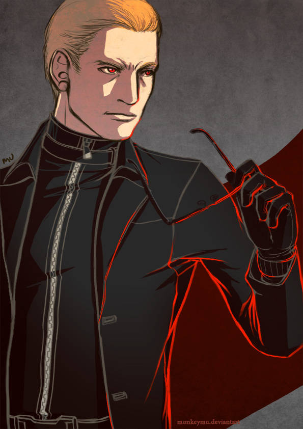
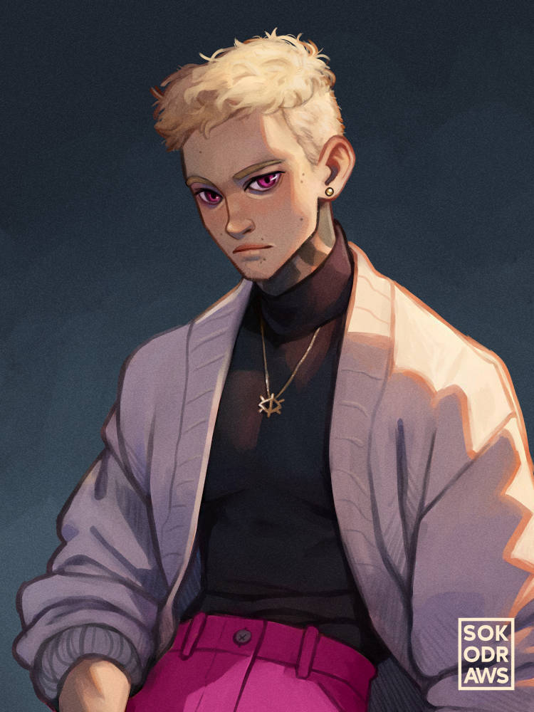
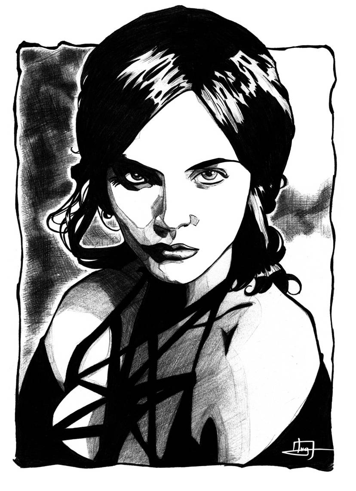
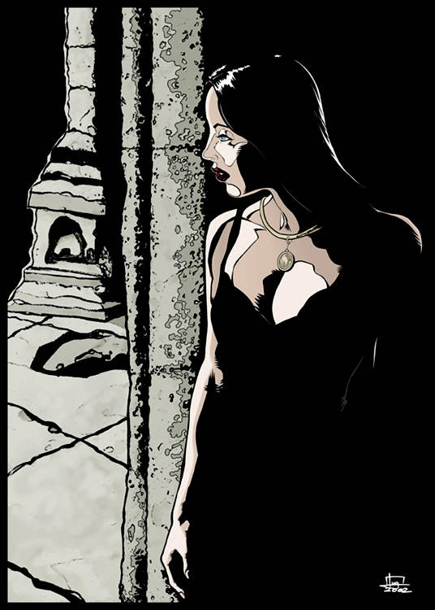
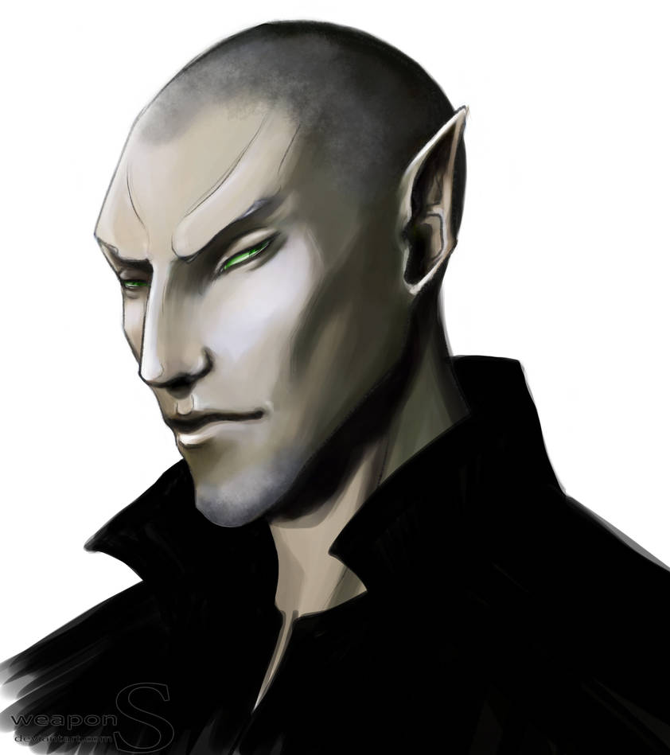
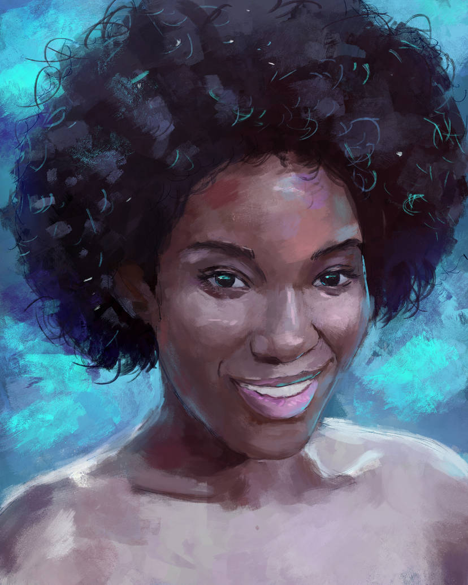
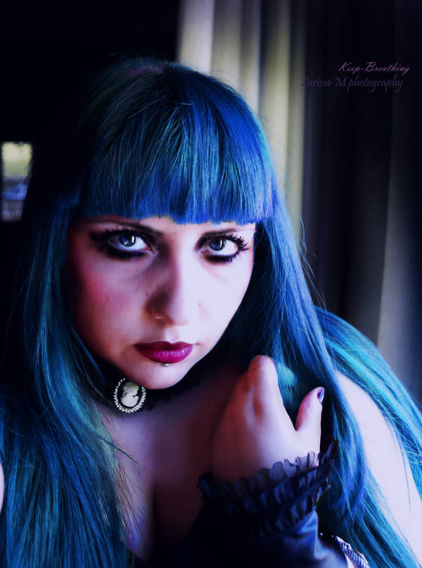

\sinc

## Amigos y enemigos

Aquí tienes las bíos de los personajes principales de la aventura para que puedas consultarlos cuando lo necesites.

### Lord Ceballos

\conc

Lord Ceballos lleva con nosotros desde hace más de 200 años. Nacido en una familia muy rica de la ciudad, uso sus poderes vampíricos y el dinero familiar para montar una empresa que en pleno siglo XXI es casi una megacorporación muy poderosa, el Grupo Ceballos. Pero Grupo Ceballos es solo una parte (muy importante eso sí) de su gran plan vampírico para controlar toda la ciudad.  

[](https://www.deviantart.com/monkeymu/art/Wesker-300376367 "Wesker By MonkeyMu")

&nbsp;

El principal problema hoy en día que tiene el plan vampírico de Lord Ceballos es el propio Lord Ceballos, está demasiado anclado en el pasado e intenta usar trucos muy viejos en un mundo moderno y claramente muchas veces fallan. Aun así sus siervos vampíricos se encargan de modernizar sus trucos al nuevo siglo a escondidas de él. 

Su objetivo principal a día de hoy es el barrio de tus PJ y va a caer como otras zonas de la ciudad, es que no te quepa duda.

* **Aspectos**
  * **Concepto principal:** Lord Vampiro de la ciudad
  * **Complicación:** Anclado en el pasado
  * Todo el mundo me debe un favor
  * CEO de la megacorporación Grupo Ceballos
  * Difícil de matar
  * Nunca rompe una promesa
* **Estilos:** Cauto Enorme (+4), Furtivo Normal (+1), Ingenioso Enorme (+4), Llamativo Enorme (+4), Rápido Excelente (+5), Vigoroso Excelente (+5) 
* **Proezas**
  * **En la cúspide de la pirámide trófica:** Lord Ceballos es el depredador supremo, está arriba de pirámide trófica, debido a eso recibe +2 a Atacar en modo Vigoroso cuando se enfrenta en combate a humanos.

\sp

* **Proezas:**
  * **Yo hago las reglas:** Lord Ceballos es la máxima autoridad vampírica con potestad de hacer y deshacer a su gusto, debido a eso recibe +2 a Atacaren modo Llamativo cuando se enfrenta socialmente a otros vampiros.
  * **Experiencia con cazavampiros:** Debido a que ya les ha visto anteriormente con más cazavampiros y conoce sus trucos recibe +2 a Crear ventaja de modo Furtivo cuando se enfrenta a cazavampiros.
  * **Este no es mi primer rodeo:** No es la primera vez que tratan de matarlo, de forma que recibe un +2 a defenderse de modo cauto de los planes para acabar con su vida.
  * **Hecho de pesadillas:** Lord Ceballos representa todos elementos que los humanos llevan temiendo desde que vivían en cavernas, una vez por partida puede desplegar todos sus poderes vampiros y hacer que masas de humanos huyan aterrorizados.
  * **Tentación:** Debido a Lord Ceballos puede cumplir cualquiera de tus deseos y sueños con su poder y su dinero tiene una gran capacidad de tentar a las personas y hacer con ellas lo que quiera. Debido a esto una vez por partida, Lord Ceballos se puede reunir en secreto con un PNJ (a no ser que lo tengan vigilado tus cazadoras) y tentarle para que traicione a tus cazadoras.
* **Capacidad de recuperación:** 3
* **Estrés:** 1 | 2 | 3
* **Consecuencias:** Leve 2 | Moderado 4 | Grave 6
* **Sed de sangre:** 1 | 2 | 3 | 4 | 5 | 6 | 7

**Sugerencia de interpretación:** Eres un ser superior que lleva más de dos siglos entre los simples mortales y si tus planes se cumplen, te convertirás en el amo y señor de toda ciudad, así que es normal que consideres como hormigas a todos los que te rodean. Sus vidas son insignificantes para ti, meras herramientas, y no hay problemas en acabar con las vidas de los que te sirven, si sirve a tu causa. Si alto te irrita es que algo no salga como quieres y, en ese caso, alguien tiene que pagarlo.

\sinc

### Alfonse

\conc

Alfonse es le vampire más joven convertido por Lord Ceballos. El viejo Ceballos buscó a alguien que se pudiera introducir en grupos sociales diferentes a los que estaba acostumbrado y se encontró con le fiestere no binario de Alfonse. Viendo que había potencial en elle para ser un vampire lo convirtió y como prueba de fuego lo abandono unas semanas para ver si valía la pena. 

El paso a vampiro no fue nada traumático, como pensaba Lord Ceballos. Había tenido en su vida problemas mucho mayores que ese y había sobrevivido a ellos.

Tras esas semanas, lo puso como «noob» al servicio de Néstor, pensando que siendo del mismo tipo de «depravados» (nada más lejos de la realidad) se llevarían bien y trabajarían bien juntos en la parte de su gran plan vampírico. 

\sp

[](https://www.deviantart.com/sokoistrying/art/Dorcha-1002628311 "Dorcha By sokoistrying")

&nbsp;

Alfonse odia profundamente Néstor y está buscando una manera de acabar con él y quedarse su puesto. Así que muy posiblemente vea a tus cazadoras como una oportunidad de deshacerse de él, para luego traicionarlas luego y ganarse la confianza de Lord Ceballos y obtener el puesto de Néstor.

Alfonse aparenta alrededor de los 22 años y viste a la última moda siendo bastante transgresor en sus elecciones de vestuario. Como persona no binaria juega con ello en su forma de vestir buscando siempre crear outfits rompedores y chocantes.

Nuestro vampire en principio no tiene ningún tipo de escrúpulos morales o ético y solo piensa en sí mismo y su supervivencia por lo que solo mira por su interés sin importar quien caiga. De hecho eso es lo que vio Lord Ceballos en elle cuando lo convirtió. 

Pero hay cosas en las que puede olvidarse de sí mismo y pensar en los demás. 

No soportará abusos y ataques al colectivo LGTBIQ+, tomándoselo con algo personal e incluso puede que establezca lazos emocionales y de amistad con alguna cazadora del colectivo que vayan más allá de la simple utilidad que puedan tener en sus planes. 

Otra de las debilidades de Alfonse son les buscavides como él. Alfonse se suele llevar bien con la gente con calle, con buscavidas como elle y puede que incluso llegue a ofrecer a esos PJ convertirles en vampiro y apoderarse juntos de la ciudad.

* **Aspectos**
  * **Concepto principal:** Vampiro buscavidas
  * **Complicación:** Odia a Néstor
  * Fiestero empedernido
  * Abiertamente del colectivo
  * .................................................................................
* **Estilos:** Cauto Mediocre (+0), Furtivo Bueno (+2), Ingenioso Normal (+1), Llamativo Grande (+3), Rápido Bueno (+2), Vigoroso Normal (+1) 
* **Proezas**
  * **Dar coba:** Debido a que es un adulador nato y sabe regalarte los oídos, gana un +2 para Crear una ventaja de modo Llamativo cuando trata de seducir a humanos.
  * **Inmovilizar:** Con su experiencia en prácticas sexuales bizarras, gana un +2 a Atacar de modo vigoroso cuando trata de inmovilizar a sus víctimas.
  * .................................................................................

\sp

* **Capacidad de recuperación:** 3
* **Estrés:** 1 | 2 | 3
* **Consecuencias:** Leve 2 | Moderado 4 | Grave 6
* **Sed de sangre:** 1 | 2 | 3 | 4 | 5 | 6 | 7

**Sugerencia de interpretación:** Mientras las jugadoras no te conozcan trata de ser ese vampiro intimidador y poderoso de voz profunda. Una vez que te conozcan y tengas una relación con las cazadoras no pares de hacerles preguntas indiscretas. El cotilleo es tu vida y te encanta sacarles chismes a las cazadoras. Si no responden o crees que se están callando algo sigue insistiendo y obvia el tema del que querían hablar.

\sinc

> Alfonse seguramente será le vampire con el que más se van a relacionar, tanto en combates y persecuciones, como puede que algunos tratos y planes suicidas. Si sobrevive a sus primeros encuentros y no acaba convertido en un montón cenizas es importante que Alfonse vaya _subiendo de nivel_ con tus cazadoras. De hecho, tiene espacios vacíos para rellenarlos según interactúe con tus jugadoras. Además, deberías subirle los mismos hitos que a tus PJ, principalmente, para que no se quede atrás y pueda ser une digne rivale o une socie competente.

\conc

\sinc

### Nieve

\conc

Nieve es la última persona a la que ha convertido en Lord Ceballos en vampiro. Lo hizo a principio de los 2000 cuando Nieves, ascendía vertiginosamente por las empresas del grupo Ceballos. En cuanto se convirtió en CTO de una de sus empresas auxiliares más importantes entró en su radar y aunque no la vio al principio como buena candidata para sucederle, si detectó que tenía madera de ser una gran vampira y una muy buena mano derecha.

La convirtió en vampira durante una convención de empresas del grupo (y paso a llamarse Nieve) y la ascendió a ayudante de su CTO en aquellos tiempos. Con el tiempo aprendió todo lo necesario para llevar al grupo empresarial y hacer realidad los planes que el Ceballos tenía en mente. Para 2010 había acabado con su jefe y se había convertido en la nueva CTO del grupo. Lord Ceballos estaba encantado con este cambio, solo tenía que plantearle una idea para que ella la hiciera realidad en pocos meses.

Como Jefa de operaciones de una gran corporación sufre bastante estrés. El estrés en los vampiros no funciona igual que en los humanos, ya que la parte física no se ve muy afectada por el estrés. Sus cuerpos ya están muertos y no sufren muchos cambios. Así que el efecto en su psique es el doble de grave. 

\sp

[](https://www.deviantart.com/ivanvalladares/art/Joaquina-Maya-Clan-Ravnos-90621984 "Joaquina Maya, Clan Ravnos By IvanValladares")

&nbsp;

De esta manera, Nieve sufre despistes y lapsus de memoria. Normalmente, son tonterías, pero se ha dejado a veces a víctimas vivas o muertas en el capó del coche durante horas y días.

También se ha vuelto muy sensible a los olores molestándole mucho, de hecho, el olor a ajo la repele muchísimo más que al resto de chupasangres y no puede aguantar estar en una habitación con alguien que ha comido ajo o cebolla.

Y si ser el CTO no la estresara lo suficiente, hay que sumarle en que todos creen Nieve será la próxima Lady Vampiresa cuando Ceballos se retire o muera. Eso hace que tenga más poder, pero también más enemigo que quieren su puesto.

\sc

* **Aspectos**
  * **Concepto principal:** Lugarteniente vampira de Lord Ceballos
  * **Complicación:** Demasiado estresada
  * Jefe de operaciones (CTO) del Grupo Ceballos
  * Los datos y la planificación aseguran el éxito.
  * Futura Lady Vampiresa
* **Estilos:** Cauto Enorme (+4), Furtivo Grande (+3), Ingenioso Enorme (+4), Llamativo Bueno (+2), Rápido Grande (+3), Vigoroso Bueno (+2) 
* **Proezas**
  * **Recursos humanos:** Sus años seleccionando personal, tanto para el entramado de empresas del Grupo Ceballos, como para el séquito de Lord Ceballos, la han enseñado a calar a la gente de un vistazo, de forma que obtiene un +2 a Defender en modo Cauto cuando se encuentra en reuniones, discusiones y entrevistas.
  * **Tiburón empresarial:** Es tan agresiva en los negocios que recibe un +2 a Atacar en modo Vigoroso cuando negocia tratos.
  * **OPA hostil:** Es tan buena negociante que recibe un +2 a Atacar en modo Ingenioso cuando negocia tratos.
  * **Empresas pantalla:** Debido al entramado de empresas fantasmas del Grupo Ceballos, recibe +2 a Superar en modo Furtivo cuando trata de ocultar sus actividades pocos legales o que no quiere que sean públicas. 

\sp

* **Proezas**
  * **Dinero negro:** Debido al dinero sucio que ha generado el Grupo Ceballos, una vez por partida puede sobornar a quien quiera para que mire hacia otro lado cuando intervenga o planee alguna actividad ilegal. No puede sobornar a PNJ o PJ en concreto, sino, más bien, a entidades como la policía, la fiscalía, inspección sanidad, un periódico o un medio, … 
* **Capacidad de recuperación:** 3
* **Estrés:** 1 | 2 | 3
* **Consecuencias:** Leve 2 | Moderado 4 | Grave 6
* **Sed de sangre:** 1 | 2 | 3 | 4 | 5 | 6 | 7

**Sugerencia de interpretación:** Bajo tu apariencia profesional y empresarial moderna, escondes un manojo de nervios y estrés acumulado. Deja de hablar durante un par de segundos mirando al infinito, muérdete las puntas de los dedos hasta «hacerte sangre» sin darte cuenta, enseña los colmillos sin razón o ráscate picores que no existen. 

\sinc

### Tito

\conc

Tito es el fiel guardaespaldas de Lord Ceballos. Cualquiera pensaría que el guardaespaldas de un poderoso vampiro sería otro vampiro, pero la verdad es eso solo recalcaría las debilidades de los vampiros, mientras que teniendo un humano como protector, este puede protegerte de día cuando eres más vulnerable.

Tito lleva más de 10 años sirviendo a su señor como jefe de seguridad. Es un fiel perro guardián, fiel y sacrificado, que dará su vida por su amo sin pensárselo ni un segundo.

Empieza a ser mayor para la lucha directa, pero aún puede derribarte antes de que te des cuenta y ha aprendido con los años todo lo necesario para ser un excelente guardaespaldas.

También ha mejorado su modo de ser y su educación de ser un descerebrado gritón y bravucón sin modales a ser un tipo discreto, callado y observador al que no se le escapa nada.

Tito tuvo una breve carrera en el circuito de MMA y fue «invitado a irse» por varios actos violentos incluso para la MMA. De hecho, fue en una gala de MMA, donde Lord Ceballos se lo encontró hace unos 15 años. 

[](https://www.freepik.com/free-photo/portrait-retro-1920s-english-arabian-business-man-wearing-dark-suit-tie-flat-cap_26284579.htm "Portrait of retro 1920s english arabian business man wearing dark suit tie and flat cap By ASphotofamily")

\sp

Lord Ceballos lo atrajo y lo convirtió en su siervo dándole de beber de su sangre para que fuera más fuerte en los combates de MMA. Cuando se empezó a hablar de dopaje en sus peleas y le acusaron de violencia deportiva, abandonó la lucha profesional. Lo curioso es que todos en el mundillo del MMA sabían que se dopaba, pero ningún médico o laboratorio supo como lo hacía. 

A partir de ese momento se dedicó a servir a Lord Ceballos en exclusiva entregándose en cuerpo y alma.

* **Aspectos**
  * **Concepto principal:** Siervo protector de Lord Ceballos
  * **Complicación:** Sobreprotector
  * Experto en MMA
  * Cara de póker
  * Planificador
* **Estilos:** Cauto Bueno (+2), Furtivo Grande (+3), Ingenioso Bueno (+2), Llamativo Normal (+1), Rápido Grande (+3), Vigoroso Enorme (+4) 
* **Proezas**
  * **Luchador de suelo:** Debido a su experiencia como combatiente de MMA, gana un +2 para Atacar en modo Vigoroso cuando forcejea con su enemigo en el suelo.
  * **Wheelman:** Debido a que es un conductor excepcional, recibo un +2 para Crear una ventaja de modo Rápido cuando conduce un vehículo terrestre.
  * **Huir con su cliente:** Debido a su fuerza y agilidad, una vez por partida puede huir corriendo y saltando estilo parkour con su protegido sin que se le pueda seguir fácilmente corriendo detrás de él. 
* **Capacidad de recuperación:** 3
* **Estrés:** 1 | 2 | 3
* **Consecuencias:** Leve 2 | Moderado 4 | Grave 6

**Sugerencia de interpretación:** Cruza los brazos sobre el pecho y no hables. Usa solo lenguaje corporal, asiente o niega con la cabeza en las manos, mira aviesamente, encoge los hombros. Solo deberías hablar para dar órdenes claras y precisas.

\sinc

### Eloise

\conc

Eloise es el epítome de la vampiresa seductora que atrae a la perdición a sus víctimas con su increíble belleza. Podría ser perfectamente una de las novias de «Drácula», una auténtica súcubo sexual que te atrapa y se drena la esencia hasta acabar contigo sin que puedas hacer nada por rechazarla. Desgraciadamente para ella, Lord Ceballos solo la tiene como un florero que decora su guarida.

Lord Ceballos la convirtió hacia mediados de los 80, de hecho compro la agencia de modelaje donde trabajaba y la hacía trabajar de azafata en sus eventos. Descubrió que si negociaba con ella cerca sus competidores estaban más distraídos y vio que el escultural cuerpo de Eloise podía mejorarse con las capacidades vampíricas que podía otorgarle.

A diferencia de otros siervos vampíricos, le pidió permiso y le explico las ventajas, que no los inconvenientes. Eloise aceptó y ese es un error del que se arrepiente todas las noches.

\sp

Una cosa que guarda en secreto para el resto de vampiros es que le encantan las redes sociales donde sus encantos pueden llegar más lejos y a más gente. De unos años a esta parte ha conseguido ser una influencer menor, pero con seguidores muy fans.

[![[COMMISSION] Cheelu By aeeriz](./assests/images/_commission__cheelu_by_aeeriz_de1pgfp-414w-2x.jpg "[COMMISSION] Cheelu By aeeriz")](https://www.deviantart.com/aeeriz/art/COMMISSION-Cheelu-849393781 "[COMMISSION] Cheelu By aeeriz")

&nbsp;

Se hace llamar Celose y evita toda estética gótica, pero conserva su carisma y elegancia. La mayor parte de sus followers no les importa lo que dice, solo la siguen por como lo dice.

Celose tiene que hacer toda esta actividad a escondidas e incluso se ha alquilado un piso secreto desde donde hace sus directos hablando de sus cosas, comentando desde noticias de política internacional a outfits de la alfombra roja. 

Curiosamente, para ser vampira es una excelente chef con mucho gusto para hacer cocina humana con la que encandilar a sus objetivos. Sabe también de vinos y de protocolo en la mesa y puede organizar eventos sociales con mucho éxito. De hecho, esto último, es de las pocas cosas que Lord Ceballos sobre las que la deja hacer y deshacer a su gusto.

Todo este tema de la cocina hizo que empezara a buscar vídeos en internet y que terminará enganchada a las redes con sus propios canales y, de hecho, las recetas, los modales en la mesa, los concursos de cocina y las críticas culinarias suponen muchas horas de sus directos.

El problema de Eloise con las cazadoras es que fuera de sus poderes vampíricos no puede ejercer ningún tipo de control con las cazadoras, a priori toda su sensualidad y carisma no sirven de nada contra ellas. 

Quizás si alguien de tu mesa decide tener un «crush» con ella, podría usar sus habilidades, pero ella activamente no debería poder seducir y manipularlas.

Si desea controlarla como hace con otras de sus víctimas, deberá buscar otras vías. En vez de ser la mujer que desean, deberá presentarse como la mujer que desean ser cuando crezcan.

* **Aspectos**
  * **Concepto principal:** Súcubo vampiro
  * **Complicación:** Lujuria
  * Mirada hipnótica
  * Una mente para los negocios y un cuerpo para el pecado
  * Excelente chef
* **Estilos:** Cauto Grande (+3), Furtivo Grande (+3), Ingenioso Grande (+3), Llamativo Grande (+3), Rápido Grande (+3), Vigoroso Grande (+3) 

\sp

* **Proezas**
  * **Exuda confianza:** Eloise es una consumada conquistadora sexual o amorosa, de manera que obtiene +2 a Superar de modo Llamativo cuando se relaciona con otras personas en situaciones amorosas.
  * **Rubia tonta:** Con los años aprendido a hacerse la «guapa, pero tonta» y obtiene +2 para Crear una ventaja en modo ingenioso cuando finge ser tonta, excéntrica, caprichosa o coqueta.
  * **Influencer in progress:** Eloise pasa mucho tiempo en redes y empieza a ser conocida en redes, de modo que obtiene un +2 a Crear una ventaja en modo Llamativo cuando está un evento y puede poner mensajes en las redes.
* **Capacidad de recuperación:** 3
* **Estrés:** 1 | 2 | 3
* **Consecuencias:** Leve 2 | Moderado 4 | Grave 6
* **Sed de sangre:** 1 | 2 | 3 | 4 | 5 | 6 | 7

**Sugerencia de interpretación:** La intimidación y la fuerza no son tu estilo. Lo tuyo es el carisma y la zalamería. Unas palabras bonitas y aduladoras y tienes a todo el mundo comiendo de tu mano. Para que arrastrar a tus víctimas a tu guarida si puedes engañarles para que entren ellos solos.

\sinc

### Covadonga «Cova»

\conc

Covadonga es una de las más antiguas siervas de Lord Ceballos y fue de gran ayuda cuando Lord Ceballos quiso independizarse de su creador, Lord Guzmán, y buscarse un territorio donde hincar sus dientes. Sin su ayuda, hacia 1900, los planes para conseguir su actual territorio habrían fracasado y seguramente habría acabado muerto. 

Covadonga, a diferencia de sus compañeros vampiros, se quedó estancada en los años 20 del siglo XX y no ha conseguido avanzar desde esa época. Sigue vistiendo y comportándose como en 1920, no consigue comprender los avances de la tecnología y le cuesta relacionarse con la gente de 2020 con lo que su alimentación depende de lo que le proporcione Ceballos. 

Durante un tiempo la tuvo de su lugarteniente, pero Lord Guzmán empezó a ver que algo fallaba en la mente de su lugarteniente y tuvo que apartarla de su puesto.

Fue creada también por Lord Guzmán y por eso Ceballos la considera una especie de hermana de sangre. Ese sentimiento fraternal, junto a la ayuda que le presto cuando eran jóvenes, hacen que Lord Ceballos la haya mantenido a su lado, a pesar de que con sus problemas para adaptarse a los tiempos suponga más una debilidad que una ventaja.   

Aun así, «Cova» tiene una ventaja frente a sus compañeros. Digamos que el estancamiento en 1920 hace que piense fuera de la caja de la época actual. Cuando se plantea un problema aplica su mente de 1920 con un mundo sin casi tecnología y propone planes sencillos y directos que no se basan en las modernidades que proponen el resto de servidores de Lord Ceballos.

\sp

[](https://www.deviantart.com/ivanvalladares/art/Hexerei-Clan-Ventrue-51844540 "Hexerei, Clan Ventrue By IvanValladares")

&nbsp;

Mientras que sus compañeros más jóvenes recomendarían sobornar a un político con criptomonedas, cuentas en paraísos fiscales y una pantalla de empresas falsas, «Cova» siempre será más de ofrecerle 2 lingotes de oro y un cuadro valorado en miles de euros.

* **Aspectos**
  * **Concepto principal:** Antigua lugarteniente vampira de Lord Ceballos
  * **Complicación:** Anclada en 1920
  * Pensamiento fuera de la caja
  * Los viejos métodos son los mejores
  * Más sabe el diablo por viejo que por diablo
* **Estilos:** Cauto Enorme (+4), Furtivo Grande (+3), Ingenioso Bueno (+2), Llamativo Bueno (+2), Rápido Enorme (+4), Vigoroso Grande (+3)
* **Proezas**
  * **Modales intachables:** Debido a sus finísimos modales, obtiene un +2 a Superar en modo Cauto en reuniones sociales de clase alta.
  * **Viejos métodos:** Su forma de actuar en métodos viejos y en desuso, pero eficaces para los que nadie está preparado, por ello obtiene +2 a Atacar en modo Furtivo cuando planea ataques a sus enemigos.
  * **Pistolera:** Con años de entrenamiento disparando armas de fuego, obtiene +2 a Atacar en modo Rápido usando armas de fuego cortas o medias. 
  * **Cero tecnología:** Como no usa ningún tipo de tecnología, legalmente no está viva y los archivos de vida antes de ser vampira no están digitalizados, es imposible rastrearla y sacar información de ella por Internet. 
* **Capacidad de recuperación:** 3
* **Estrés:** 1 | 2 | 3
* **Consecuencias:** Leve 2 | Moderado 4 | Grave 6
* **Sed de sangre:** 1 | 2 | 3 | 4 | 5 | 6 | 7

**Sugerencia de interpretación:** Estás chapada a la antigua, hablas como la gente de principios de siglo, con el «usted» siempre en la boca y con expresiones arcaicas del 1900. Siéntete incómoda cuando tengas que relacionarte con gente moderna y extraña que esas estúpidas nuevas tecnologías.

\sp

\sinc

### Néstor

\conc

Néstor es el «hombre del saco» del mundo vampírico, ni sus propios compañeros chupasangres quieren estar a su lado. El aura de maldad y de crueldad que emite incómoda incluso a sus propios sirvientes y a su amo Lord Ceballos.

[](https://www.deviantart.com/elleylie/art/Ondolemar-doodle-490444153 "Ondolemar doodle By Elleylie")

Néstor es un pederasta que disfruta primero atemorizando, luego torturando y violando a sus víctimas infantiles, para, al final, acabar con sus vidas drenándoles toda la sangre. Tiene una mazmorra secreta donde pone en práctica todo este ritual sádico y macabro.

Sabe mantener encerrados sus demonios mientras está gente normal, aunque a la mayoría de la gente (humanos y vampiro) su instinto primitivo de conservación le dice que se aleje de Néstor. Cuando está solo con sus presas estos salen y hacen lo que quieren sin ningún tipo de línea que no vayan a traspasar.

Es muchos sentidos, es más bestia que persona. Con los años esa bestia ha ido saliendo al exterior y aunque conserva aspecto humano tiene ya algunos rasgos animales incluso en forma crush. Ojos reflectantes como los gatos, colmillos más pronunciados aunque los tenga retraídos, orejas puntiagudas, etc. 

Un aspecto importante de Néstor y que debes tener en cuenta al pensar que hará en la partida es que sabe que es un monstruo y no trata de reprimirlo, ni tratará de pedir perdón, ni de arrepentirse. Nunca bajo ningún concepto se arrepentirá de lo que ha hecho, sino que siempre estará orgulloso de ello, aunque este frente a la muerte definitiva cuando salga el sol (la forma más dolorosa de morir para un vampiro).

* **Aspectos**
  * **Concepto principal:** Fiel siervo vampiro
  * **Complicación:** Pederasta
  * Ningún tipo de escrúpulos
  * Disfruta del miedo de sus víctimas
  * Hombre del saco
  * Child's play
* **Estilos:** Cauto Mediocre (0), Furtivo Enorme (+4), Ingenioso Grande (+3), Llamativo Bueno (+2), Rápido Enorme (+4), Vigoroso Enorme (+4)
* **Proezas**
  * **Acechador:** Es un maestro moviéndose en las sombras, de manera que obtiene +2 al Atacar en modo Furtivo mientras está escondido especialmente entre las sombras.

\sp

* **Proezas**
  * **Atemorizador.** Con los años ha mejorado su habilidad de infundir miedo, de modo que una vez por sesión puede hacer huir de miedo a personajes secundarios. 
  * **Guerra psicología:** Es un torturador nato y ha podido practicar con decenas de víctimas indefensas, de forma que consigue un +2 a Atacar de forma Ingeniosa a sus torturados.
  * **Guerra de bandas:** Como jefe de una red de tráfico de drogas conoce muy bien los bajos fondos del barrio, de manera que tiene +2 a Crear ventajas de modo Ingenioso cuando trata de defender su territorio o atacar en de otras bandas.
* **Capacidad de recuperación:** 3
* **Estrés:** 1 | 2 | 3
* **Consecuencias:** Leve 2 | Moderado 4 | Grave 6
* **Sed de sangre:** 1 | 2 | 3 | 4 | 5 | 6 | 7

**Sugerencia de interpretación:** Has de ser todo lo malvado, cabrón, cruel, sádico y pervertido que puedas, pero no tienes que parecer un loco. Nada de gestos histriónicos ni de gritos sin sentido, siempre calmado y pensando las cosas, nada de ataques repentinos de furia. Simplemente disfruta de hacer el mayor mal posible al mayor número de personas durante el mayor tiempo posible. 

```
AVISO: Néstor es el personaje más extremo de toda esta aventura y debes decidir si tu mesa a va a estar a gusto con su forma de actuar. Si crees que es excesivo para tu mesa, puede quitarle todo el tema pederasta (y poner psicota) y convertir sus víctimas en adultos. También puedes quitar todo el tema de violencia sexual y simplemente convertirlo en un malvado vampiro que mata a sus víctimas tras atemorizarlas hasta casi volverlas locas.   
```

\sinc

### Catalina Faroes

\conc

Carolina Faroes es una de las activistas más importante del barrio y no hay causa perdida que no haya defendido y organización social en que participe de activa.

Su familia de origen brasileño, se vino a vivir al barrio cuando era una niña y ha crecido en sus calles aprendiendo respetarlas y quererlas.

Estudio derecho con gran esfuerzo propio y de su familia y entorno cercano y cuando termino la carrera volvió al barrio en vez de quedarse en un lujoso bufete del centro. Desde entonces se dedica a defender a mujeres víctimas de violencia de género, parar desahucios, defender a inquilinos desprotegidos, …

Catalina no les niega a nadie su ayuda y siempre está en primera línea cuando los antidisturbios se ponen en plan nazi y empiezan a golpear sus porras contra sus escudos sin amedrentarse ni un ápice. 

\sp

[](https://www.deviantart.com/arthurhenri/art/Painting-sketch-775087428 "Painting sketch By ArthurHenri")

&nbsp;

Así que sea el problema que tengas a ambos de la ley, querrás que este de tu lado y te defienda. 

En los últimos meses, está notando que empiezan a pasar demasiadas cosas en el barrio de toda índole y eso no es normal, no pueden ser coincidencia, pero ni de lejos se imagina que hay un grupo de vampiros tratando de acabar con su barrio. Así que si alguien le viene que no ese cuento no lo tomará en serio a no ser que tenga pruebas sólidas e irrefutables. 

* **Aspectos**
  * **Concepto principal:** Abogada antisistema
  * **Complicación:** Fichada por la policía y detenida bastantes veces
  * Defensora de las causas perdidas
  * Luchadora incansable
  * Cae bien
* **Estilos:** Cauto Normal (+1), Furtivo Bueno (+2), Ingenioso Bueno (+2), Llamativo Normal (+1), Rápido Grande (+3), Vigoroso Mediocre (+0) 
* **Proezas**
  * **Conozco el sistema:** Debido a que ha tenido que moverse por todo el sistema burocrático y legal, gana un +2 para Superar de modo Rápido cualquier traba burocrática o legal.
  * **Sé defenderme de los abusones:** Como lleva toda la vida enfrentándose a abusones, gana un +2 para Defender de modo Ingenioso cuando se enfrenta a abusones, explotadores, manipuladores y escoria por el estilo.
  * **Tarjeta de salir de la cárcel:** Con su experiencia en temas policiales puede sacar de la cárcel por delitos menores a una persona o a sí misma con diversas triquiñuelas legales.  
* **Capacidad de recuperación:** 3
* **Estrés:** 1 | 2 | 3
* **Consecuencias:** Leve 2 | Moderado 4 | Grave 6

**Sugerencia de interpretación:** No dejes de sonreír ni en las peores situaciones, porque ya has estado en cosas parecidas y has salido viva. Lo tuyo es el instinto y las decisiones rápidas, antes incluso de que lo hayas pensado ya estás actuando, quizás golpeando un antidisturbios o cantándole la internacional a la cara al nazi que intenta amedrentarte con un bate.

\sp

\sinc

### Verónica

\conc

Verónica es una veterana doctora de urgencias a la que Néstor transformó en vampira, porque necesitaba a alguien dentro del sistema de salud para qué le ayudará con los planes de Lord Ceballos en el barrio y por propio interés como sociopata.

[](https://www.deviantart.com/keep-breathing/art/Your-heaven-s-a-lie-213258685 "Your heaven’s a lie By keep-breathing")

&nbsp;

A diferencia de sus congéneres, la caza es más una molestia más que una parte importante de su no-vida, así que no ha desarrollado ninguna habilidad relacionada con conseguir su sustento sanguíneo.

Verónica simplemente depreda de los pacientes del hospital. Sabe de qué pacientes beber sin producirles daño, cuáles están sedados y no se enterarán y donde morder para no dejar rastro de sus festines.

Una de las razones por las que Néstor la convirtió en vampira fue que, como doctora de urgencias, podía controlar y manipular a las posibles víctimas de Néstor que hubieran sobrevivido a sus juegos. Si una de sus presas llegaba viva a Urgencias, Verónica podía limpiar pruebas que inculparan a Néstor, falsificar informes y tests e influir en las declaraciones de las víctimas.  

Verónica está muy enganchada a la vida vampira, ya sentía fascinación antes de ser convertida y ahora todavía. Ha juntado sus conocimientos médicos y cuando tiene un rato libre experimenta con su cuerpo vampírico haciéndose pruebas y tests y usándose como conejillo de indias. Sus conocimientos sobre la fisionomía vampira son superiores al de otros vampiros mucho más antiguos que ella.

* **Aspectos**
  * **Concepto principal:** Doctora experta, vampira novata
  * **Complicación:** Muy fan de los vampiros
  * Medicina de urgencias
  * Acceso a pruebas, informes, drogas y medicamentos
  * Experta en biología vampírica
* **Estilos:** Cauto Bueno (+2), Furtivo Normal (+1), Ingenioso Grande (+3), Llamativo Normal (+1), Rápido Bueno (+2), Vigoroso Bueno (+2) 
* **Proezas**
  * **Puntos débiles:** Sus años en urgencias le han enseñado los puntos más débiles y más peligrosos donde atacar en el cuerpo humano, por lo que recibe un +2 a Atacar en modo Furtivo en combate cuerpo a cuerpo.

\sp

* **Proezas**
  * **Anatomía humana:** Sus conocimientos de anatomía le permiten alimentarse de modo más eficiente y sin llamar la atención, por lo que recibe un +2 a Superar en modo Rápido cuando se alimenta en el hospital y/o de sus pacientes.
  * **Acceso a tu cartilla de salud:** Con su acceso a las fichas médicas de la mayoría de gente del barrio puede saber muchas cosas de ti. Debido a eso recibe +2 a Generar una ventaja en modo Ingenioso al buscar información sobre una persona.
* **Capacidad de recuperación:** X
* **Estrés:** 1 | 2 | 3
* **Consecuencias:** Leve 2 | Moderado 4 | Grave 6
* **Sed de sangre:** 1 | 2 | 3 | 4 | 5 | 6 | 7

**Sugerencia de interpretación:** Tienes casi una doble personalidad, cuando eres la vampiresa, eres misteriosa, gótica y ambigua, mientras que cuando eres la doctora eres seria y centrada observando todo lo que pasa y dando un diagnóstico.

\sp
