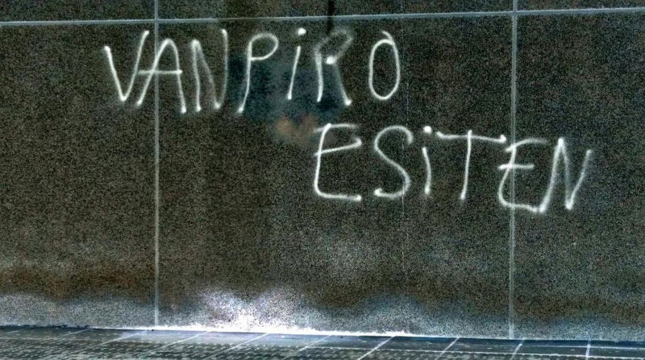
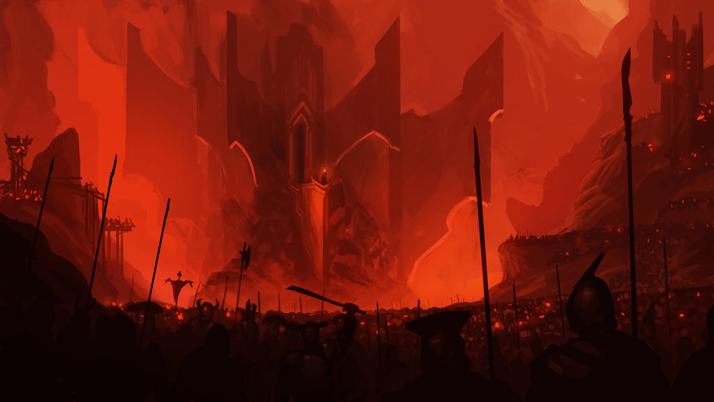
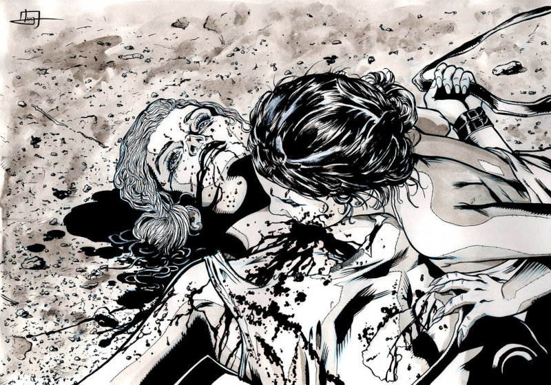

# Buenos días, Sr. Vampiro

\sinc

[](# "Pintada vanpiro esiten")

> Esta es mi historia, de como me convertí en cazavampiros y libré a mi barrio de su amenaza. Tu historia podría totalmente diferente.

## El gran plan

\conc

Veamos primero cuál era el gran plan contra el que deberán luchar tus cazadoras.

Lord Ceballos quería montar una ciudad de juego, bebida y descontrol en el barrio. Le gusta pasear por sus dominios y observar la miseria humana que traería el megalocal que iba a montar, New Las Vegas.

De hecho, se frotaba las manos pensando en como iba a pasear por la capilla de boda llena de símbolos religiosos sin qué le afectarán. 

Para ello tenía que conseguir que le permitieran derribar el campo de fútbol local para construir allí el casino. Además, tendría que construir una gran autopista hasta el casino, pasando por unos humedales donde había una especie de rana protegida. Por último, tenía que desmantelar los grupos vecinales para que no lucharan mientras montaba el casino y la autopista.

### Permisos de construcción 

El tema de los permisos de derribo y construcción iba a conseguirlo proporcionando a algunos concejales sus deseos más sucios y depravados y luego chantajeándolos a cambio de votar a favor de sus proyectos.

\sp

Tendrían que conseguir, drogas, sexo y prostitución, bastante dinero y un asesinato que pareciera natural. Nada fuera de lo normal, de lo que hacía siempre.

### Ecodiversidad

Lord Ceballos pensaba cargarse el humedal a través de una planta de reciclaje/chatarrería/fundición cercana que tendría una fuga de mercurio y destruiría el ecosistema de la rana. Con lo que no habría nada que proteger. Además, así tendría un malo contra el que se manifestarían y lucharían los ecologistas y otros grupos sociales.

### Grupos vecinales

Tenía pensado destruirlos desde dentro. Por un lado, los tenía distraído con la fuga de mercurio, mientras pensaba hinchar a uno de los grupos a donaciones, e infiltrar a agentes con grandes dotes de persuasión y «sex appel», para sembrar la cizaña hacia dentro y hacia fuera.

### Otras actividades

Adicionalmente iba a gentrificar el barrio, llenarlo de casa de apuestas, de pisos turísticos, de ocio de borrachera, de droga barata y destruir servicios sociales como los centros sanitarios.

## Piezas en el tablero

En el tablero que es esta partida hay muchas piezas, rey, reina, torres, caballos, … cada una con sus movimientos y su valor. Veamos las más importantes que participan en esta campaña.

* _Lord Ceballos:_ Lord Vampiro de la ciudad. La parte principal del plan vampírico.
* _Alfonse:_ Vampire buscavidas. Une vampire más al que cazar o une interesante «amienemigue» para tus cazadoras.
* _Nieve:_ Lugarteniente vampira de Lord Ceballos. Se encarga en hacer realidad y poner en práctica los planes de Lord Ceballos. Es su CTO si hablamos empresarialmente.
* _Tito:_ Siervo protector de Lord Ceballos. Leal hasta la muerte. Mejor no encontrárselo, porque es duro de narices.
* _Eloise:_ Súcubo vampírico. Eloise es la herramienta perfecta para conseguir lo que necesitas cuando la fuerza y la intimación no funcionan.
* _Covadonga «Cova»:_ Amiga, consejera y ex lugarteniente de Lord Ceballos. Con la mente anclada en 1920 e incapaz de asimilar el paso del tiempo.
* _Néstor:_ Vampiro sirviente de Lord Ceballos. La maldad personalizada, el mal por el mal sin excusas.
* _Catalina Faroes:_ Abogada antisistema. Aliada y soporte emocional de las cazadoras.

### Secundarios

El barrio está poblado de personajes secundarios que tienen sus vidas y sus historias y que pueden ayudarte o entorpecerte en tu lucha contra los vampiros.

* _Samuel:_ Psicólogo «new age». Plasta pero bienintencionado.
* _«El Mordor»:_ El peor profesor de la historia y la prehistoria.

\sp

\sinc

## It’s Now or Never

> Mi profesora de Ciencias Sociales, Maricarmen, había muerto y mi madre se empeñó en ir al tanatorio para su despedida. Gente que no conoces llorando, otra gente que no conoces hablando y riendo y un tipo que no conocía de nada muy cripi. Solo miraba a los presentes, sacaba fotos a escondidas y tecleaba cosas en el móvil, todo muy sospechoso. 

\conc

_DÍA_

Todas las madres, padres o tutores de tus PJ han tenido la misma idea, ir al tanatorio a despedirse de su profesora. Nadie les hace caso, los adultos como siempre están en sus cosas y tus futuras cazadoras están juntas en una esquina. La difunta está de cuerpo presente y ninguna ha visto nunca un muerto.

Pueden _echarle un vistazo al cadáver_ si se quitan de encima las miradas de los adultos Mediocre (+0). El maquillaje es muy bueno y parece que está viva, pero llama la atención que le han puesto unos guantes largos negros y en el cuello tiene dos heriditas, como dos pinchazos.

Si se ponen a _fisgonear entre los adultos_ Mediocre (+0), podrán enterarse de que Maricarmen se debió suicidar en su casa y se preocuparon cuando no apareció por el colegio al día siguiente. Debía estar medicada para la depresión y no debía estar muy bien de salud. Alguna madre recuerda verla muy pálida en las últimas reuniones.

Entre los asistentes hay un _personaje muy cripi_ _sacando fotos a escondidas_ y escribiendo en su móvil. Si se acercan mucho e intentan hablar con él, responderá con monosílabos y huirá a los baños. 

De repente habrá algo de revuelo un concejal del ayuntamiento entrará en el tanatorio, dejará su tarjeta, escribirá en el libro de visitas y se pondrá a hablar con los asistentes. Si se acercan a escuchar Mediocre (+0), será charla política intrascendente. Tanto mirando el libro de visitas como escuchándole verán que es Ernesto Lujua Martínez y por los apellidos debía ser hermano de Maricarmen.

Lo curioso es que no parece nada afectado. Igual alguna se acuerda de una serie de CSI Mediocre (+0), los suicidas son normalmente muertes sorpresa que afectan mucho a los familiares. Aunque no tuvieras simpatía por el muerto, te afecta la sorpresa y el qué pensaran los demás, cómo no se dieron cuenta, seguro que no se veían, … más siendo un político cuya imagen puede verse comprometida.

Cuando empiece el funeral, les dejarán fuera con algunos adultos. Son las únicas niñas de la misma edad, así que seguramente se juntarán para hablar de las cosas raras. Se habrán visto fisgando por el tanatorio y quizás puedan intercambiar información y cotilleos.

\sp

### El Cripi

Este personaje alto delgado y desgarbado que parece que lleva un traje 4 tallas más grandes, no para de moverse nerviosamente y no deja de mirar a todas partes. Es uno de los siervos más incompetentes de Alfonse (ver más adelante). Este vampiro le ha mandado observar qué pasa en el velatorio y comunicárselo.

Si consiguen _robarle el móvil_ (+4) verán que envía fotos mensajes a Máster Alfonse poniendo notas sobre quiénes aparecen en las fotos.

* Siempre nervioso
* **Bueno (+2) en:** Observando y apuntando cosas, Cavar hoyos
* **Malo (-2) en:** Interacciones sociales, Pasar desapercibido
* **Estrés:** Nada (cae al primer golpe)

\sinc

## Don’t Be Cruel

> Al día siguiente en el colegio cogieron a todos los alumnos de Maricarmen y los reunieron para una charla sobre el suicidio dado por Samuel, el psicólogo del colegio. Tras la charla Samuel reúne a todas las PJ, ya que las vio en el funeral para hablar sobre el tema.

\conc

_DÍA_

Samuel cree que la sinceridad y no ocultar cosas a los niños es fundamental así que les dirá que pueden preguntarle todo lo que quieran y sabe bastante.

* Se tomó un montón de medicamentos, se cortó las venas por las muñecas y se metió en la bañera.
* Nadie en claustro había percibido nada, de hecho parecía que estaba conociendo a alguien y parecía ilusionada.
* Ha sido incinerada como pedía en su nota de suicidio.
* Eso ya lo sabían ellas, pero lo confirma Samuel, llevaba unas semanas muy débil y anémica. Se dormía en todas partes y estaba muy pálida. Creen que igual tenía un cáncer y había preferido no sufrir.

### Samuel, el psicólogo del colegio

* Psicólogo «new age»
* **Bueno (+2) en:** Interpretando a las personas, Charlatanería
* **Malo (-2) en:** Deporte, Conducir
* **Estrés:** Nada (cae al primer golpe)

Después de la reunión con Samuel, ninguna recordará que Maricarmen faltase a clase en el último año y si tienes algo grave pierdes mucho tiempo en médicos.

\sp

### El chat

En este punto quizás quieran intercambiar redes, WhatsApp u otros sistemas de mensajería y empezar a hablar de la muerte de Maricarmen. Hay cosas que no cuadran y todo suena sospechoso.

La idea es que tengan una hoja que simule su chat donde escriban los mensajes uno tras otro poniendo cada cazadora su nombre.

El DJ debería poder mirar esas hojas solo si algún adulto tiene acceso al móvil de la forma que sea. Igual sus padres se lo revisan buscando pruebas de que drogan o quizás un hacker se lo haya pirateado. Si borran el chat, se guarda el papel y se saca uno nuevo, para simular que no hay acceso a las conversaciones anteriores.

Podrías hacerlo también con un chat de WhatsApp o Telegram, pero la hoja de papel evita que cuando cojan el móvil se pongan con otros chats. Además, me gusta el impacto dramático de arrancar la hoja de las manos por sorpresa como si fueras sus padres o un malo y sin miedo a romper el móvil. También permite cotillear la hoja sin que ellos lo sepan que les han hackeado o que han fisgado su móvil.

Como siempre, si todo esto te parece un engorro, puedes hacer que simplemente hablen entre ellas, 

\sinc

## Suspicious Minds

> Si Mari Carmen no se había suicidado, quién había sido el asesino, por qué, qué eran esas marcas en su cuello y por qué a nadie le preocupaba. 

\conc

_DÍA_

Pueden empezar a investigar por su cuenta o en conjunto alguno de los flecos que tiene toda esta historía.

* Si buscan al Cripi, terminarán encontrándolo, trabaja de celador en el IML (Instituto de Medicina Legal), vamos la morgue. Podría haber interferido en la autopsia.
* Puedes buscar en casa de Maricarmen, la policía ha quitado el precinto y si consiguen una llave o se cuelan de alguna otra manera.
* Por último queda su despacho en el colegio, el problema es que lo compartía con «El Mordor», uno de los peores profesores del colegio.

Empezarán a haber rumores de que los abogados de Ernesto Lujua están mandando avisos de desahucio a varias personas del barrio. Si ves que no están muy por la labor de investigar qué paso a Maricarmen, haz saltar los padres de una de tus PJ recibirán una carta avisándoles de que abandonen su casa en 3 meses. ¿Tienen algo que ver la muerte de Maricarmen con este desahucio?

\sp

### La morgue

El acceso a la morgue no es público y tiene bastante seguridad, con tarjeta de ID y esas cosas. 

Queda muy lejos de las habilidades de tus cazadoras, pero si vigilan un par de horas verán entrar al Cripi con su tarjeta en una de las puertas de servicio.

Pueden seguir al Cripi cuando salga del curro y siempre va a un disco llamada «Jaula» que está en polígono en las afueras del barrio. Parece que lleva y trae bolsas varias como si hiciera los recados para alguien. El Cripi está a lo suyo y no sospechará de un grupo de niñas a no ser que hagan algo muy estúpido.

Si intentan entrar, el portero no les dejará entrar. Es ilegal la entrada de menores.

###  El piso de Maricarmen

El piso de Maricarmen es un ático y la única manera de entrar sin llaves, como es el caso, sería subir al tejado por una claraboya y descolgarse al balcón (tirada normal +1). Es bastante peligroso, pero no hay otra manera, si desean entrar. La amable anciana que era vecina de Maricarmen tiene una copia de las llaves, pero se la dio a la policía para entrar en la casa. Se lo contará encantado a las cazadoras si la llaman a la puerta y si le dejan hablar y le aguantan la chapa les dirá que dejaron las llaves en el buzón al irse para los familiares.

El piso está bien amueblado y con muebles modernos de calidad, no de Ikea. Hay una cocina moderna, un salón con un sofá comodísimo, una habitación con una cama grandísima y una segunda habitación con material de pintura, madejas de lana y agujas y otros hobbies. 

No hay medicamentos fuera de lo normal que hagan pensar que estaba enferma, igual es que había abandonado la medicación. Pero debería de haber medicación contra el dolor o similar. Sí veis suplementos de hierro y vitaminas. Alguna cazadora puede que le recuerden que alguien de su familia las tomaba por la anemia.

Si revisan la cama hay manchas de sangre en las sabanas. Si revisan la cocina, encontrarán unas sabanas guardadas debajo del fregadero que iban a ser usadas como trapos. También tienen manchas de sangre. No grandes manchas, solo pequeñas manchas como si alguna herida pequeña las hubiera manchado. La cuestión es que están en un extremo de las sabanas, o sea es algo en los pies o la cabeza.

#### El portátil

Si no han pasado ni un día desde que la policía retiro el precinto, podrán encontrar el portátil de Maricarmen, si tardan más se lo llevará el ayudante de Ernesto Lujua siguiendo sus órdenes y será destruido. Por suerte, hay más o menos lo mismo en el ordenador de su despacho en el colegio y no será formateado hasta que venga su sustituto en unas semanas.

El ordenador parece bastante caro y nuevo y, por desgracia, al encenderlo tiene contraseña, no es complicada de hackear, si puedes llevarte el ordenador, pero si tienes prisa es un gran obstáculo. Si consiguen acceso pueden encontrar:

* **Historial de navegación:** aparte de noticias, redes y compras online tiene un par de webs de citas y en una de ellas un match con un chico joven Goloso22. Han tonteado un poco y han quedado un par de noches a cenar y toar algo. Luego parece que se pasaron a WhatsApp.

\sp

* **Carpeta de documentos:** hay muchos recibos de donaciones a ONG varios y avisos de banco unos 2.500 € cada mes de una entidad con nombre «Fideicomiso Lujua». No parece que haya pagos de hipotecas o similares.

### El despacho

Maricarmen compartía despacho con «El Mordor», el peor y más malvado profesor del colegio. No se parecían en nada y no debían llevarse muy bien.

El despacho solo es accesible en horario escolar, así que tendrán que escaquearse de clase en una hora que «El Mordor» tenga clase también. En el recreo «El Mordor» se va al despacho con lo que no pueden hacerlo en ese momento. 

La cerradura es muy simple y se puede abrir con trucos sacados de YouTube (tirada mediocre +0). Lo óptimo es un grupo vigilando cada lado del pasillo del despacho y otro entrando al despacho.

Han metido todas sus cosas en una caja de cartón esperando que vengan a buscarlo. No hay nada especial excepto una copia de sus llaves de casa, pero se puede sacar conclusiones.

#### Pistas en el despacho

* El ordenador de Maricarmen tiene clave, pero tiene un post-it con ella escrita en la pantalla. Pueden encontrar lo mismo que en el portátil de su casa.
* No hay rastro de medicamentos que den a entender que tenía alguna enfermedad.
* Las cosas de la caja no parecen baratas, no eran de «Todo a 1 euro».

#### «El Mordor»

«El Mordor» es el otro profesor de Ciencias Sociales. Es una horrible persona que odia a los niños y nunca debiera haberse metido en la docencia.

[](https://www.deviantart.com/spartank42/art/Hosts-of-Angband-675611276 "Hosts of Angband By SpartanK42")

Grita a todo el mundo y está todo el tiempo enfadado. No sabe nada especial de la muerte de Maricarmen, pero le molestaba la risa tonta que se le ponía con su nuevo noviete.

* El profesor más temido del colegio 
* **Bueno (+2) en:** Intimidar, Historia
* **Malo (-2) en:** Vigilar, Encontrar cosas y personas
* **Estrés:** Nada (cae al primer golpe)

### Familia Lujua

Si se ponen a investigar a la familia Lujua, solo podrán sacar lo de que son propietarios de pisos (por ello los avisos de desahucio). Parece que Ernesto se dedica a la política y que su hermana no tenía ningún interés en el negocio de la familia, pero desde luego su muerte ha dejado vía libre a su hermano en la dirección que toma la empresa de alquileres de piso.

 \sp

### Los secretos de Maricarmen

Tus cazadoras ya deben haber empezado a juntar pistas y ver que Maricarmen no se suicidó, sino que un personaje llamado Goloso22 que conoció en internet pudo tener que ver mucho con su muerte. Goloso22 es un jovencito que conoció en una web de citas con el que había quedado y hablaba por teléfono (tras unos cuantos mensajes por chat paso al teléfono). Parece por las manchas de sangre en las sabanas que había prácticas sexuales fuera de lo normal y que Goloso22 la tenía encantada.

Maricarmen debía tener pasta, además de su sueldo de maestra, parecía que recibía dinero de un fideicomiso familiar y mucho de ese dinero lo donaba a diferentes ONG. Su hermano el concejal maneja dinero y tiene varias empresas. Igual él usó el dinero de la familia para crear esas empresas, mientras que Maricarmen prefirió trabajar de profesora y donar el dinero de la familia que recibía.

Por lo que sea la muerte de Maricarmen ha podido ser un asesinato, pero no hay nada concluyente, solo pruebas condicionales.

#### La historia real

La familia de Ernesto y Maricarmen eran constructores que fueron acumulando pisos desde 1980 y que alquilaba a largo plazo.

Al morir dejo el negocio de los pisos a su hijo Ernesto y la fortuna familiar en un fideicomiso vitalicio a su hija Maricarmen que le permitiría vivir cómodamente. También puso un montón de reglas que permitían a Maricarmen vetar las decisiones de su hermano con los pisos.

Mientras que Ernesto ascendía en política siendo concejal de urbanismo, su hermana se hizo profesora y donaba una parte importante del fideicomiso a ONG y organizaciones vecinales.

Ernesto siempre se vio coartado en sus negocios por los vetos de su hermana. Y ahora que como concejal podía sacar tajada con sus pisos su hermana seguía siendo un problema.

Entonces apareció el grupo Ceballos con una propuesta y su correspondiente soborno para derribar el campo de fútbol municipal y construir un casino en su lugar y construir un acceso desde la autopista y un parking en los humedales.

Ernesto podía derribar el polideportivo sin problema. Era un peligro público con serios problemas estructurales, y luego vender esos terrenos. Pero lo de los humedales se quedaba fuera de sus competencias aunque daría su voto si compraban a los políticos adecuados.

A cambio quería que se deshiciera de su hermana, por ejemplo, fingiendo un suicidio. De esa manera él se quedaría con todo el control de los pisos heredados de sus padres.

Así que Alfonse fue encargado de seducirla con sus encantos vampíricos. La encontró de casualidad en la web de citas y en un par de contactos quedo con ella en su discoteca y consiguió que la invitara a su casa. En pocas semanas la tenía enganchada a elle y a sus prácticas sexo-vampíricas que la estaban dejando anémica.

\sp

[](https://www.deviantart.com/cylonka/art/In-love-with-a-Vampire-288956144 "In love with a Vampire By cylonka")

Alfonse le propuso un trío con un amigo suyo con los mismos gustos sexuales y ella aceptó y sin saberlo invito a su casa a su asesino, Néstor. Este la dejo medio atontada por la perdida de sangre de 2 vampiros chupándole sangre, le hizo tragar las pastillas, puso una nota de suicidio falsa, la metió en la bañera y le corto las venas, mientras Alfonse miraba horrorizado.

Cuando se describió el cadáver, al de 48 horas, se declaró un suicidio. Su hermano tenía una coartada para esos días y Alfonse también. La policía investigó las conversaciones con Goloso22 y fueron a interrogarle siguiendo el protocolo. Tenía coartada sólida (pero falsa) para la noche del suicidio y además les dijo que habían cortado la noche anterior, eran muy diferentes, ella era mayor y no iba a funcionar.

El Cripi se encargó de falsificar la autopsia y eliminar las cosas raras que pudiera descubrir la forense encargada y polis corruptos al servicio de Néstor hicieron lo suyo con las pruebas policiales. Con lo que al final se confirmó el suicidio.

### Buscando a Goloso22

El único hilo del que tirar es Goloso22 y lo único que tienen de Goloso22 es una foto de un jovencito con una imagen bastante alternativa y queer y que tiene una cuenta en una web de citas. Así que pueden enseñar la foto por ahí o hacerse una cuenta en la web de citas.

Si preguntan por ahí y el plan para buscarle es bueno obtendrán el nombre de un lugar, «Jaula». Una discoteca con gancho en el barrio, de la que corren varias historias turbias de actos violentos, rituales de sangre y cosas por el estilo. Si siguieron al Cripi, ya les sonará el lugar y las piezas empezarán a encajar.

Alfonse borró la cuenta de Tinder tras el trabajo, pero sigue usando otra foto de él mismo en otra cuenta para encontrar sexo casual con succión de sangre.

Si se hacen la cuenta en la web de citas y ponen un perfil como el de Maricarmen, no funcionará. Lo de Maricarmen fue un encargo, no entraba en sus gustos.

Si tienen suerte y un buen plan como hacerse un perfil de alguien alternativo de cualquier orientación sexual y le dan un like puede que les conteste.

Alfonse es muy listo en estos ámbitos y no será fácil engañarle. Pero al final, si accede, jugará en casa y quedará con las cazadoras en la «Jaula».

\sp

Si son más listas que elle pueden tratar de sonsacarle información. Muchas cosas como su trabajo, sus horarios, sus gustos sexuales dirán que solo vive de noche, tiene cierto fetichismo por la sangre, y le gusta fingir que es une vampire que seduce a sus víctimas. 

Pero por mucho que lo intenten, no dirá nada que pudiera dar a entender que es un vampire o que les vampires existen. Se puede dejar llevar por el jugueteo y el sexting, pero no es tonte. 

```
Si a tu mesa le apetece quizás puedas hacer esta parte por una app de mensajería durante la semana entre sesión y sesión de juego. El DJ puede hacer tiradas y poniendo el resultado en el chat.
```

\sinc

## Jailhouse Rock

> Teníamos un nombre y un lugar, «Jaula», donde no podíamos entrar a buscar a un posible asesino con un fetichismo por los vampiros y la sangre. Planazo para el finde :)

\conc

Hay varias maneras de conseguir llegar a localizar a Alfonse en la «Jaula».

Si intentan la cita, debes dejarles claro que por mucho que quieran no pasan por mayores y aunque lo consiguieran por cosas de sus cazadoras, no le interesará a Alfonse nada con ellas, se reirá un poco de ellas y de sí misme y las echará del bar. No es como Néstor y además los niños tienen poca sangre.

Lo normal es que una vez sepan dónde encontrarle, busquen alternativas para colarse en la discoteca y tratar de averiguar más de la muerte de su profesora.

### Investigaciones previas

En un vistazo rápido a la web de «Jaula» sabrán las cosas normales que viene en su página web. Si se ponen a ver sus redes incluso pueden confirmar que Alfonse aparece en el fondo de alguna foto de las fiestas.

Un vistazo rápido y verán las dos entradas, la principal y la trasera. La principal está siempre vigilada por un par de porteros.

La otra opción es la puerta trasera, que tiene una cerradura con código y una cámara de vigilancia.

\sp

De día el sitio está vacío excepto por la seguridad que vigila el exterior del edificio, Alfonse que duerme en su guarida y puede que algún empleado aparezca a recoger pedidos de bebida o similar. Con mucha probabilidad el Cripi entré en el edificio para hacer algún recado a su señor.

[](https://www.freepik.com/free-photo/front-view-young-female-dj-entertaining-crowd_5854739.htm "Front view young female dj entertaining crowd by Freepik")

Si montan una vigilancia, verán que Alfonse sale muy poco de su discoteca y normalmente acompañado de alguna víctima. Si está solo, no usa la puerta, prefiere otros métodos menos humanos. Sale a la azotea y flota hasta la calle, cubierto con una capa negra con capucha. Es tremendamente difícil de detectar de noche con ropa oscura, flotando y sin hacer ruido (tirada Grande +4).

### Entrando en «Jaula»

_NOCHE_

#### Puerta principal

Esquivar a los porteros es muy complicado a no ser que consigan distraerlos con un buen espectáculo delante. Si van con carnets falsos no colará, se ve de sobra que son menores. Un buen soborno tampoco funcionará se juegan el curro por una miseria.

#### Puerta trasera

Quizás puedan poner su propia cámara oculta o desde lejos escondidas para tratar de ver el código. Igual algún truco como mirar los números más desgastados les funcione también.

El problema es la cámara que vigila puerta. Si pasan más de un par de minutos alguien aparecerá a decirles que se vayan de allí.

#### Conductos de ventilación

Si las puertas fallan solo hay una opción, los conductos de ventilación. Son pequeños para un adulto, pero podrán colarse y moverse por ellos sin ser vistas porque el ruido de la música amortiguará sus golpes.

Deben subir al techo por una escalera de emergencia y abrir la salida del conducto de ventilación. Sin herramientas será imposible abrir el conducto.

Orientarse en los conductos exige una tirada Grande (+3) o aparecerán en un sitio al azar de la disco menos en la habitación secreta de Alfonse.

### Dentro de la disco

Una vez dentro de la disco podrán moverse sin problemas. Si está cerrada porque no hay nadie, aunque deberán esconderse cuando entre algún empleado, un portero o el Cripi.

Mientras está abierta, podrán moverse por la planta baja sin problemas, a nadie le importará que unas niñas estén por ahí. En la planta VIP y en el bar y su almacén deberán ir con cuidado y estar escondidas.

\sp

### El primer encuentro con Alfonse

De noche pueden encontrar a Alfonse en cualquier parte de la disco, desde alimentándose de alguna víctima en una zona reservada de la planta VIP, hasta metiendo cajas de bebida en el bar sin camisetas enseñando tableta.

Por el día, estará durmiendo en su habitación del pánico con vestidor y baño. El acceso sin saber el código y la ubicación de la puerta secreta es imposible para las capacidades y herramientas de unas niñas.

Una vez lo localicen, Alfonse se moverá a la zona VIP a no ser que estén ya allí. Alfonse se pondrá en el centro de la zona y escrutará su menú de esa noche. Para acto seguido sentarse sin ningún pudor al lado de su próxima víctima lo más en contacto posible. Si son varias víctimas se meterá en medio sin ningún problema.

Acto seguido, despliega todo su encanto vampírico y sacará un arsenal de drogas de diseño que le suministra su jefe vampírico.

Es muy buene sonsacando vicios prohibidos, fetiches y perversiones de sus víctimas y lo hace encantadoramente. Luego usa está información para atraerte a un reservado donde completa la faena a nivel sexual y hematófago (alimentarse de sangre).

Igual se les ocurre a tus jugadoras cortarle el rollo, pero eso supondría ponerse al descubierto y realmente tendría que hacer algo gordo como activar los aspersores pulsando la alarma antiincendios.

Si quieren seguirle al reservado, la única forma de ver lo que pasa dentro es escabulléndose dentro. Desde fuera solo oirán gemidos y suspiros, pero no como los que les han podido oír a sus padres.

La escena del reservado no sería excesivamente rara si no fuera por ciertos detallitos. Alfonse tiene la cara llena de sangre, unos colmillos exageradamente grandes para un humano hincados en el cuello de una de sus víctimas, está en su forma trash (le gusta dejarse ir) y flota sobre la mesa del reservado con sus víctimas entre sus brazos.

De repente, Alfonse levantará la cabeza de sus víctimas y les verá con sus profundos ojos rojos y empezará a chillar. Podrías pedirles alguna tirada Buena (+2) para evitar chillar de miedo o quedarse petrificada.

Es un buen momento para recordarles que si no han dicho nada, llevan la cara descubierta y Alfonse se las ha visto.

### Escapando de «Jaula»

En esta escena lo importante es la rapidez, no les dejes discutir que hacer. Dales segundos para que te digan cuál es su plan y si cada una toma una decisión distinta mucho mejor, el caos es divertido. En ese momento sus únicas vías de escape son.

**Correr como posesas** hasta llegar a la pista de baile y atravesarla para llegar a la salida. Tendrán además que esquivar a los porteros y darles esquinazo porque Alfonse dará la orden de detenerlas si las ven.

Puedes hacer más divertida la escena y cuando empiecen a correr oigan al DJ gritar: ¡Fiesta de la espuma!

Podrán esconderse en ella, pero también sus perseguidores y con el tumulto alguna cazadora puede perderse. Puede ser una divertida escena de jugar al escondite. Recuerda que la espuma llega a la altura del pecho a un adulto y oculta completamente a las cazadoras.

\sp

Si quieren montar una distracción rápida, tienen segundos para llevarla a cabo, por ejemplo tirando petardos. Si lo consiguen ya no estarán en la misma zona de la discoteca que Alfonse y según a donde se muevan incluso no las vea.

Otra opción puede ser **lanzarse contra Alfonse** e intentar acabar con él. Tus cazadoras no están preparadas para luchar contra vampiros así que es casi imposible hacerle daño.

[](https://www.freepik.com/free-photo/high-angle-dj-woman-control-panel_5854775.htm "High angle dj woman at control panel by Freepik")

Que no puedan hacerle daño no quiere decir que no puedan derribarlo e intenten inmovilizarlo. Alfonse no quiere enseñar sus cartas, pero si es sobrepasado empezará a flotar y atacar haciendo pasadas con lo que será muy difícil golpearlo.

Pueden hacer fuego, pero no será una gran llama a no ser que tengan combustible como gasolina o alcohol. Además, el sistema de aspersores se pondrá a funcionar al instante y apagar toda llama que haya.

Al final, seguramente tengan que huir corriendo, pero ahora cansadas y seguramente con garrazos de Alfonse.

#### Y si todo falla

Si no consiguen escapar, no está todo perdido. Alfonse puede proponerles el mismo trato que les propondrá en el siguiente capítulo de la aventura. Pero en vez de hacerlo suplicando por si no-vida, serán ellas las que estén sujetas con cinta aislante a unas sillas sin ninguna capacidad de negociación.

Deshacerse de unas niñas sin dejar rastro es muy complicado y las comunidades enseguida sacan horcas y antorchas en estas situaciones. Es mejor tener un aliado que aunque no es muy poderoso si pasa desapercibido y que es un señuelo perfecto para atraer a Néstor, su vampiro superior y pederasta, a una trampa.

### Algo muy chungo ocurre en el barrio

Una vez hayan conseguido escapar y este en un lugar seguro deberían hablar de que ha pasado y que van a hacer.

A priori, deberían tener claro que los vampiros existen y parece que hay muchos. También parece que tienen planes para el barrio. No se dedican a cazar y a disfrutar de la eternidad. Comenten asesinatos, sobornan a políticos, compran terrenos, venden droga.

\sp

La idea general que les debe quedar clara es que los vampiros son una especie de cáncer que se enquista en una comunidad y hace que todo empeore hasta destruir esa comunidad. Cuando la comunidad es un pozo de miseria ellos pueden hacer lo que quieran allí.

#### Se empieza a forjar una amistad

Tras esta gran primera aventura es hora de que tus jugadoras se conviertan en un grupo de cazadoras de vampiros.

Puedes aprovechar está huida de la disco para que encuentren su base de operaciones. Igual se han parado a descansar de su fuga en un almacén abandonado del tren o en un trastero de un garaje de un piso propiedad del banco. Cuando terminen de hablar puedes contarles las ventajas del lugar y lo conviertan en su guarida secreta o dejarles y que empiecen ellos solos a quedar aquí para futuras reuniones.

También es un buen momento para que se prometan cosas entre ellas, como «O escapamos todas o no escapa ninguna». Estos votos deberían ser la base de las futuras normas de la panda de cazavampiros.

Por último, puede que alguna haya destacado en alguna tarea durante esta primera aventura. Aprovecha a convertir esto en un puesto dentro del grupo.

\sinc

## In the Ghetto

> Pues después de descubrir la terrible verdad, había que hacer algo. La cuestión era qué podíamos hacer. Contarlo, nadie nos creería. La otra opción era acabar nosotras mismas con el vampiro. Unas niñas contra un poderoso vampiro, digno de una peli mala …  

\conc

Hasta ahora no sabían qué estaba pasando en el barrio, pero ahora sí saben a qué se enfrentan. Aunque su enemigo es muy peligroso y poderoso, también tiene grandes debilidades que pueden ser fácilmente explotables por unas niñas. Ajo, fuego, plata

### Nadie te creerá

Si deciden contarlo a sus padres, tutores, profesores, … nadie les va a creer. Eso debe quedarles muy claro, les dirán que dejen de mentir o que son imaginaciones suyas, … las típicas cosas que le dicen a la protagonista de una peli de miedo al principio.

Si continúan con ello o incluso involucran a la policía, se tendrán que enfrentar a un psicólogo infantil (en el capítulo Mientras Tanto) y aprenderán que mejor no contarles ciertas cosas a los adultos.

\sp

### Preparándose para la acción

Lo primero debería ser informarse. Como preadolescentes puede que sepan muy poco de vampiros, porque no es un monstruo muy de moda y lo que hay está muy desvirtuado. Piensa en los vampiros brillantes de Crepúsculo. Así que lo que tendrán que hacer es buscar libros y películas sobre vampiros o, mejor, vídeos de majaretas en Twitch y YouTube con locas teorías, y muchas veces con cierta base real, sobre vampiros y cómo matarlos.

[](https://www.freepik.com/free-photo/pro-gamer-participating-gaming-competition-all-night_369234748.htm "Pro gamer participating in gaming competition all night by DC Studio")

> __Invéntate un nombre para__ __el Youtuber__ como «VanHernanding» «VampireHuntressVallekas» y úsalo en frase como «Si recuerdas el último directo de VampireHuntressVallekas, la formula para el té de ajo es de una cabeza de ajo por cada litro de agua». Quizás hasta puedan dejarle comentarios en sus directos y que este les responda. 

En la sección «¿Cómo matarlos?» tienes todos los modos de matarlos, así que puedes darles parte de la información verdadera con mitos clásicos que no funcionan y juega con esa información. Deberán aprender mediante ensayo y error. Que no tengan toda la información y que tengan que jugársela sin saber 100% si lo que hacen es fiable le dará un punto interesante a los encuentros con vampiros.

Por ejemplo, diles que parece que las cruces y el ajo repelen a los vampiros. El ajo siempre y las cruces solo si tienes fe. Si van con una ristra de ajos y crucifijo en el cuello, el vampiro ni se les acercará, pero no sabrán si es por el ajo, la cruz o ambos. Igual la próxima vez no tienen ajo y se arriesgan con el crucifijo y como su portadora no tiene fe, el vampiro se lo quita de las manos y les ataca sin problemas.

Conseguir algunos de los objetos puede ser fácil, como el agua bendita o más complicada como objetos de plata. Es tu decisión si lo rolean un poco la escena o que lo consigan con alguna tirada.

Todo el equipo extraño, como rifles de agua, garrafas de té de ajo y de agua bendita, crucifijos, estacas y mazas, deberán guardarlas fuera de casa así que podrían empezar a usar su guarida y quedar allí para compartir información y empezar a montar planes de acción.

#### Se busca

Mientras se preparan para la caza, puedes meter algún encuentro con el Cripi. Alfonse debe buscar a las cazadoras y su mejor agente para temas humanos es el Cripi.

\sp

Así que puedes hacer un par de encuentros en la puerta del cole a la entrada o la salida. No las van a encontrar porque tiene muy pocas pistas, pero es bueno para añadir tensión, que se sientan acorraladas y tengan que actuar.

### La primera caza

_NOCHE_

> Personalmente como DJ, sea como sea, saquen las tiradas que saquen y hagan lo que hagan, esta primera caza debería ser un éxito. Puede que sea chapucera o una genialidad, pero deberían acabar la caza triunfando sobre el mal, con valiosa información y con un poderoso enemigo derrotado o un aliado muy importante. Ya tendrán tiempo de meter la pata y fracasar. 

#### El plan de caza

Con toda la información recogida y el equipo preparado tendrán que pensar un plan de acción que solucione un gran problema, el vampiro está avisado, sabe que alguien ha entrado en su «sancta sanctorum» y habrá puesto remedio mejorando la seguridad.

Como DJ no deberías dejarles entrar del mismo modo que la primera vez a no ser que fueran muy cuidadosas y no dejarán ninguna pista, pero seguro que salen en alguna cámara o se dejaron algún acceso sin cerrar. 

Por ejemplo, si entraron por la ventilación, se dejarían las tapas desatornilladas y cuando vuelvan habrá un candado de seguridad o algún tipo de alarma.

#### Mucho hablar y poco actuar

Si ves que planean mucho y no terminan de lanzarse a la acción, puede activar alguna de las opciones del capítulo «Mientras tanto», como las fiestas del barrio. Quizás ese evento especial cambie la visión general de la caza y les anime a lanzarse.

Por ejemplo, las fiestas del barrio pueden hacer que se vacíe o se llene de gente la «Jaula» y eso puede ayudar a que su plan salga mejor y aprovechen a lanzarse a la caza aunque no tengan más que una mega-pistola de agua.

#### La noche de las cazadoras

Los planes para cazar a Alfonse puede ser muy diversos, pero recuerda estás normas cuando los ejecuten tus cazadoras.

* Alfonse no saldrá de la «Jaula», mientras no esté seguro. Se acabarán sus cazas en el exterior por una temporada y de salir saldrá a escondidas flotando.
* La «Jaula» está muy preparada contra incendios, intentar provocar fuegos es perder tiempo.
* De día es imposible entrar en su cámara secreta.
* No le interesan las niñas, no pueden tenderle una trampa haciéndose pasar por víctimas.

Si todo ha ido bien y no han saltado ninguna alarma, le encontrarán con sus víctimas de esa noche. Estará sorprendido, pero desde luego no indefenso.

\sp

En caso de hacer saltar la alarma, Alfonse las estará esperando en la zona VIP disfrutando de una víctima, pero sin quitar la vista de la entrada y lo que les rodea. Le pierde el dramatismo y quiere hacerles el numerito del vampiro poderoso.

Has de tener en cuenta si tus cazadoras son conscientes de si han sido o no descubiertas. Pueden encontrarse a Alfonse preparado para defenderse y contraatacar, cuando pensaban que estaría desconcertado y sorprendido.

### Su primer combate

El combate puede ser muy sencillo si le pillan sorprendido y sus armas son eficaces o una pesadilla, si Alfonse está preparado y no tienen las armas adecuadas.

Recuerda que Alfonse tiene su reserva de sangre completa lo que le permite usar todos sus poderes vampíricos a plena potencia.

En este combate es importante que haya mucho diálogo, tiene que tener cierto toque de duelo dialéctico.

Alfonse, si puede, jugará con tus cazadoras, y mientras combate tratará de conseguir información. Nunca se ha enfrentado a cazadoras de vampiros y esto es algo nuevo que puede aprovechar. Si se sale con la suya, puedes darle algún aspecto que pueda usar en la siguiente escena.

Recuerda que no luchará hasta la muerte, no es su estilo, se rendirá si ve que puede llegar a un trato.

\sc

### ¿Qué hacemos con Alfonse?

En este punto de la aventura deberán tomar una decisión importante, matar a Alfonse o aliarse con él. Alfonse está su merced, derrotado en el suelo de la pista de baile VIP, posiblemente con quemaduras de agua de ajo y cortes de cuchillos de plata de la abuela. Está tratando de salvar su vida como solo sabe hacer, negociando y adulando, haciendo tratos que puede que no cumpla, … No es de fiar, pero sabe mucho de este mundo desconocido para tus cazadoras.

#### Acabar con el chupasangre

La solución rápida es darle el «paseo» a Alfonse. Rápido y sencillo. Habría que quedarse con su teléfono y su portátil y poder sacar información útil de ellos para poder seguir cazando vampiros. De estos dispositivos pueden sacar pistas que les permita avanzar en el plan vampírico hacia arriba o hacia los lados en el siguiente capítulo.

Alfonse no es un santo y tus cazadoras no deberían porque sentir piedad por él. Incluso podrían organizar algún tipo de ejecución, rollo abandonarlo a pleno sol, ahogarlo en una bañera de agua con ajo, estacarle el corazón, etc. Las opciones son muchas y si son creativas incluso pueden crear algún aspecto en la comunidad vampírica que puedan explotar.

#### Negociar con el chupasangre

Alfonse es un superviviente de manual y sabe que ahora le toca negociar con unas niñas. Ya sabe que no son unas chicas normales, son unas cazadoras natas. Sin casi experiencia y conocimientos, le han derrotado. Con sus conocimientos y su información pueden acaban con Néstor, su vampiro oldie que le manda, y ocupar su puesto.

\sp

Tendrá que suplicar por su vida, prometer servirlas, firmar algún tipo de trato (que cumplirá o no en el futuro) y ofrecerles algo como prueba de buena voluntad. Esta prueba puede servir de pista que les permita avanzar en el plan vampírico hacia arriba o hacia los lados en el siguiente capítulo.
 
Recuerda que ahora mismo está en inferioridad y que no tiene mucho margen de negociación, además cuando pueda las traicionará y acabará con ellas. Con lo que puede aceptar cualquier cosa que le propongan.

\sinc

## Always on My Mind

> En este punto de la historia empecé a seguir diferentes pistas y cada pista me fue llevando a una nueva caza y a descubrir una parte del gran plan vampírico. Yo seguí este orden en mis investigaciones, pero tú quizás lo harías en otro orden o de otra manera. Al final lo importante es tener todas las piezas del plan y poder montarlo.

\conc

Tras su primera gran caza de chupasangres, las cosas se complican. Saben que sus problemas son las grandes de lo que pensaban, pero no tienen mucha información de la que tirar.

### Alfonse puede ser de gran ayuda

Si Alfonse ha sobrevivido, les podrá rápidamente en la pista de Néstor, del que no sabe más que lo necesario, pero tiene pistas que pueden encaminar a tus cazadoras hacia él.

Alfonse no tiene mucho trato con su jefe, pero ni Alfonse ni nadie. Lo ha visto un par de veces cuando Lord Ceballos puso al joven vampiro a su cargo y un par de veces más. Normalmente, se comunican por mensajes de texto y voz y personalmente lo prefiere así porque no soporta su inquietante presencia.

Alfonse puede darle una descripción, números de teléfono, mensajes de texto y sabe a ciencia cierta que se encarga principalmente del tráfico de drogas en el barrio, porque muchas veces le ordena dejar actuar tranquilamente a sus camellos en la «Jaula».

Sabe más cosas, pero se las guarda. Quiere testar a las cazadoras primero y ver cómo se desenvuelven y si Néstor las atrapa y las tortura, no podrán contar mucho. Cosas que sabe:

* Conoce toda la estructura de poder desde él hasta Lord Ceballos. No conoce otras ramas, pero sí la suya. Por ejemplo no conoce a Verónica, la otra sierva vampira de Néstor.
* No tiene muy estudiado a Néstor, pero sabe que está detrás de las desapariciones de menores. No tiene detalles concretos, pero sabe de sus abominables apetitos. Lo importante para Alfonse es que las cazadoras son la presa y el depredador perfecto para Néstor.

\sp

* Por último, Alfonse sabe que Néstor no comete fallos, es tremendamente metódico y todo sigue un orden concreto testado y revisado. Es una gran fortaleza y su mayor debilidad, no se espera que un grupo de niñas puedan hacerle frente y eso le va a volver loco al desbaratar sus planes.

### Subiendo a un nivel superior del plan

Si deciden ascender, todos sus esfuerzos les pondrán en camino a Néstor. 

Alfonse puede ser de mucha ayuda, como ya hemos visto, pero de no contar con él hay algunas opciones:

* Si revisan sus restos antes de huir de «Jaula», pueden como mínimo llevarse su teléfono móvil. Si consiguen hackearlo podrán encontrar mensajes con Néstor y las pruebas del tráfico de drogas.
* Las desapariciones de menores no son algo público del que se hable en los medios o la calle, pero el patio del colegio si es un tema candente. Casi todas las víctimas de Néstor, como mínimo, tonteaban con drogas blandas. Algunos incluso trapicheaban por su cuenta y Néstor aprovecho a quitarse competencia. 
* Está claro que los vampiros se meten en todos los negocios sucios del barrio y las drogas son ahora el principal problema que hay. 

Si siguen alguna de estas pistas, deberían encaminarse a alguno de los centros de distribución de drogas de Néstor y puedes pasar al siguiente capítulo «Burning Love».

### Explorando el nivel del plan actual

Alfonse no es el único vampiro noob al servicio de Néstor. También tiene a Verónica, una doctora de urgencias nocturnas que tiene la capacidad de meter mano en los ambulatorios y están saboteando los dos centros médicos del barrio con diversas acciones.

* Está cambiando las cita continuamente de personas con problemas de movilidad, de forma que sea imposible aparecer al final.
* Crea citas fantasma para llenar los horarios del personal médico a las que nunca acude nadie.
* Ha saboteado varios equipos fundamentales como máquinas de diálisis o de resonancias, para hacer las largas listas de espera más largas todavía.
* Hace desaparecer pruebas y resultados para obligar a repetirlas.

Verónica tiene a su servicio un par de celadores de noche que le sirven incondicionalmente y que la protegen de día, cuando es más vulnerable.

* Celador de noche
* **Bueno (+2) en:** Vigilar, Mover cosas y levantar pesos
* **Malo (-2) en:** Tratar con los pacientes, Medicina  
* **Estrés:** ◯◯

#### Descubrir a Verónica 

La manera principal de descubrir todo el tinglado de Verónica es tener que ir a urgencias del hospital general del barrio.

\sp

Puede haber varias formas de acabar en el hospital. Si van a curarse heridas de combate, Verónica les atenderá y reconocerá ese tipo de heridas. Las ha visto muchas veces en las víctimas de Néstor.

Otra manera es que vayan al hospital por alguna razón y la pillen alimentándose de algún paciente. No tiene que ser muy evidente, pero por lo menos sospechoso.

Recuerda también que Verónica está creando muchos problemas en los centros de salud y eso pueda afectar a personas mayores o de salud delicada. Tus cazadoras, tal vez, terminan en urgencias porque su yaya ha tenido un problema, ya que le han retrasado la cita de la diálisis varias veces gracias a Verónica y ha tenido una crisis.

Tanto si les atienda a ellas como si atiende a algún pariente, tus cazadoras podrán ver que no lleva nada bien el olor ajo que seguramente les impregna a ellas y a su ropa o no ven con buenos ojos los objetos de cazadoras que porten.

Deberían tener ya maneras de ver si es una vampira, y deberán ingeniárselas para aplicarlas con Verónica sin que se dé cuenta.

Si necesitan excusas para ir al hospital con asiduidad, pueden apuntarse a programas de acompañamiento de mayores solos, o quizás tengan una amiga en la planta de oncología, por poner unos ejemplos. __Sé respetuoso con estos temas y respeta las__ __decisiones de la mesa si no están cómodos.__

Una vez confirmen que es una vampira, deberán buscar la manera de seguirla y espiarla por el hospital hasta encontrar donde tiene su guarida, un almacén en el sótano donde guardan cámara frigoríficas viejas que solo usan en caso de quedarse sin sitio en la morgue.

#### Cazar a Verónica

Si tienen que enfrentarse a Verónica, ella sí luchará hasta el final y no hay ninguna posibilidad de que traicione a su señor Néstor. Recuerda que los celadores la vigilan mientras duerme, así que no está del todo desprotegida de día.

En su taquilla del hospital, en los frigoríficos donde duerme y entre los restos de Verónica debería haber suficientes pruebas para acercarse a Néstor.

* Mensajes en su teléfono pidiéndole que le consiga fármacos y con resúmenes de sus actividades de sabotaje. Necesitarán hackear el móvil para obtener esa información.
* Informes de sobredosis que ha tratado y ha ocultado para que no salten las alarmas en la policía. Tienen post-its con los cambios que ha hecho para cuando elabora los informes para su señor.
* Informes médicos de ataques a menores que ha robado. 

### El plan se reconstruye

Recuerda que si Alfonse está muerto, Néstor debería en pocas semanas a buscar a un sustituto, quizás convierta algún siervo humano en vampiro y lo ponga al cargo de «Jaula». Una vez resuelto el problema principal, encargará a su nuevo siervo vampiro cazar a los asesinos de Alfonse.

Si mantienen vivo a Alfonse, para Néstor no hay plan que reconstruir y seguirá como siempre.

\sp

### Para despistar

Si ves que la aventura va muy deprisa o quieres despistar a tus cazadoras un poco, aquí tienes algunos callejones sin salida que puedes presentar a tus cazadoras.

La idea es que, aunque no parezcan importantes, todas estas tramas les serán de ayuda más adelante.

#### La casa de las «Chejas»

La casa de las «Chejas» es una antigua y ruinosa casa que había en los humedales que se llama así porque la habitaban dos viejas solteronas a las que la gente del barrio llamaba las «Chejas». Todo tipo de historias se cuentan de la casa y pueden oír algo raro sobre el lugar que las incite a explorarla.

La casa es un sitio donde a veces Néstor lleva a sus víctimas y donde disfruta cazando las entre los cañaverales.

Podrán encontrar restos de sangre o ropas infantiles, pero nada que puedan seguir y que les sirva de pista. Lo bueno es que __conocerán la casa en caso de que Néstor las__ __atrape y quiera jugar con ellas__.

#### CebaBet

El grupo Ceballos suele inundar los barrios con casas de apuestas en su proceso de degradación y acaba de abrir la primera en el barrio, a pocos metros del colegio de tus cazadoras.

Si Alfonse es un aliado, puede decirles que sus superiores suelen hacer estás cosas, también puede ser haya una fiebre ludópata entre sus compañeros de clase. Parece ser que todo usan estas cosas (drogas, juego, juergas y borracheras, etc.) para deprimir los barrios, así que las casas de apuestas son un buen punto de partida.

Lo interesante de la casa de apuestas «CebaBet» es que es un sitio donde pueden conocer a Catalina Faroes, que está tratando de cerrar la primera que han montado en el barrio.

Catalina ha montado una sentada popular delante y se han organizado para que siempre haya gente del grupo vecinal con pancartas reivindicativas y recogiendo firmas.

Catalina tratará de que la ayuden a recoger firmas y si les ofrecen entrar y jugar que lo graben para tener pruebas.

\sinc

## Burning love

> Hasta ahora nuestra historia había sido una típica aventura de película infantil, carreras, escaramuzas, mentir a padres y profesores y escapar de los malos para hacérselo pagar con creces. Con Néstor aprendimos lo que era el auténtico mal.

\conc

\sp

Tus cazadoras ya saben a lo que se enfrentan, pero en este capítulo todo va a subir de nivel. Néstor debería suponer un antes y un después de lo que puedan pensar y creer de los vampiros y podrán ver que son auténticos monstruos.

Verónica tiene pistas que van directo a Néstor, el tiempo que perdieron en el hospital ahora lo van a ahorrar.

Por su lado, Alfonse las pondrás en la pista de la lonja, como ya hemos dicho le interesa que tus cazadores se deshagan de él, pero si no está Alfonse o no se fían o no quiere recurrir a elle, tienen otras vías

### Si investigan el tráfico de drogas

Si empiezan a investigar el tema de la droga, si mucho problema les llevarán a la lonja de Néstor. 

Puede que alguno de sus compañeros sea un camello menor o algún familiar este enganchado. Por unos pocos euros cantarán todo lo que necesitan saber para dar con la lonja.

También pueden hablar con los colectivos antidroga del barrio que les hablarán de la increíble subida del consumo de drogas en el barrio en muy pocos años.

Por su experiencia no es algo normal y está claro que hay intereses ocultos en llenar las calles de drogas.

Puede ser un buen momento en que empiecen a ver a Catalina Faroes y que les vaya sonando su cara.

### Si investigan las desapariciones de niñes

Si investigan el tema de las desapariciones, pueden ver que muchos de ellos eran consumidores menores de drogas blandas con lo que al acudir a la lonja entran en su radar. Además, sus camellos suelen informarle de este tipo de clientes.

Néstor suele buscar sus víctimas entre esos preadolescentes y adolescentes que consumen drogas. Esto muchas veces supone que vengan de familias desestructuradas y que escapen de casa y desaparezcan sea algo posible.

De esta manera las desapariciones les pondrán en la pista de la droga y esta, a su vez, en la pista de la lonja.

### El plan de Néstor

Néstor tiene una misión, deprimir el barrio y echar a sus vecinos. Con Alfonse buscaba gentrificar el barrio y convertirlo en un sitio de fiesta y borrachera y con Verónica joder la sanidad local. Pero su plan es más amplio y también está llenando el barrio de droga, con su consiguiente delincuencia y violencia.

Si conseguían convertir el barrio en un narco barrio, la gente querrá irse, los precios de la vivienda bajarán y él podrá comprar edificios enteros. 

El toque maestro será hacer aparecer al Grupo Ceballos como unos benefactores que van a salvar a un barrio deprimido levantándolo con inversiones, puestos de trabajo y nuevas construcciones.

\sp

Mientras que parece que apoyan al barrio, en realidad lo irán comprando y troceando poco a poco y desmontando la estructuras sociales de apoyo que hay montadas.

### El almacén

Néstor tiene varios puntos de venta en el barrio, desde camellos pateando las calles ofreciendo su mercancía hasta dos narcopisos. Pero la cantidad de droga que hay en esos puntos no es muy grave. La mayor parte de la droga la tiene en un almacén. 

El lugar está vigilado por varios de sus sirvientes que no solo cuidan la droga, también vigilan su guarida que está bajo el local. 

Además, está entrando pequeños camellos todo el tiempo a conseguir más material y entregar dinero. De normal, tanto movimiento atraería la atención de las fuerzas de seguridad si no fuera porque están compradas.

La lonja cuenta con un __cierre centralizado de__ __todas las puertas y ventajas__ __cuyo mando controla Néstor__, de forma que, para bien o para mal, nadie puede entrar y nadie puede salir.

Su guarida es su despacho y la puerta está reforzada, ya que mueve mucho dinero y lo guarda en su despacho hasta que vienen a buscarlo del Grupo Ceballos para blanquearlo.

Como buen vampiro temeroso del fuego, el sistema antiincendios está instalado y funcional. A esta hora tus cazadoras deberían saber que si quieren saber si un local es una guarida vampírica debe tener aspersores con las revisiones pasadas.

### El ataque nocturno

La lógica dicta que tus cazadoras tratarán de repetir sus éxitos con Verónica y Néstor. Así que se preparan y buscarán la manera de entrar en el local de Néstor. Quizás lo estudien un par de días o incluso intenten verlo por dentro. Alguna información puede sacar, pero nada claro. La idea es que vayan más envalentonadas de sus éxitos que preparadas.

* Pueden tener un boceto del plano del local y alguna pista de dónde está la guarida del vampiro.
* Pueden saber que de noche hay menos movimiento, ya que no venden droga a esas horas, pero la seguridad es la misma. Los vasallos de Néstor siempre están ahí.
* No tienen ni idea de lo loco que está Néstor, seguramente lo verán como un vividor como Alfonse o una gótica obsesionada como Verónica, no saben lo zumbado que está y lo que puede llegar a hacer.
* Tendrán certezas ya muy claras de que usar contra vampiro como ajo y estacas, pero Néstor tiene contramedidas de todo.

#### La captura

Planeen lo que planeen tus cazadoras caerán ante Néstor. Para empezar si Alfonse o Verónica han muerto, él ya sabrá que alguien está cazando vampiros en el barrio. 

Si Alfonse solo le ha traicionado, sigue siendo lo suficientemente paranoico como no dejas puertas sin cablear y esquinas sin cubrir sin cámaras. Néstor es perro viejo y está preparado y, a diferencia de Alfonse, no es vividor que aprecia su no-vida por encima de todo.

\sp

Néstor, mientras está en el local, no para de mirar las cámaras de seguridad y en cuanto tus cazadoras pongan un pie dentro las tendrá fichadas. Acto seguido se pondrá su traje EPI negro que evita que el ajo y el agua bendita le topen y empezará a flotar por el techo del local, entre en cableado y los conductos de ventilación.

> Piensa en Néstor como en un alien de película, las seguirá flotando en la oscuridad, las acechará y en cuanto una se descuide se la llevará y volverá a por el resto.

Posibles trampas y trucos que puede usar para capturarlas:

* Si el grupo se separa, irá a por el más pequeño.
* Tiene acceso al material de caza que usa en sus cacerías, como cloroformo, cinchas, cuerdas.
* Imita muy bien las voces infantiles. Puede pedir auxilio como si fuera un niño asustado en la oscuridad y atraer a sus víctimas.
* El EPI le hace que inmune a ajo y agua bendita y le da un aspecto terrorífico. Imagínate ver una máscara de gas completamente negra y solo ver los ojos relucientes de Néstor.
* Una vez atrape a la primera cazadora, puede empezar a usarla de cebo e incluso a amenazar con matarla si no rinden.
* El espacio del local de venta de drogas es muy sencillo, pero puedes crear zonas independientes a tu gusto mediante palés de materiales y equipo almacenado. Lo interesante es que entraron pensando que es una zona simple y diáfana (según los planos) y estos elementos van a actuar como paredes convirtiéndolo en laberinto de cajas, estanterías y palés. Néstor al flotar no sufre ese problema y se va a mover mucho más rápido por el local.
* Recuerda que Néstor tiene unos aspectos muy útiles cuando se enfrenta a menores como depredador sexual que es. Deberías aprovecharlos siempre que puedas.

[](https://www.freepik.com/free-photo/light-from-open-door_19139608.htm "Light from an open door by rawpixel.com")

### Atrapadas

_Día_

Si no han conseguido huir de su trampa, acabarán en la mazmorra de Néstor, descrita en el apartado Lugares para más información.

```
A partir de este punto la historia tiene momentos muy duros. Estate atento a las reacciones de tu mesa porque puede ser bastante intenso.
```

\sp

Néstor debería poder dejarlas inconscientes durante su captura. Así que _despertarán_ _esposadas y con una capucha en la cabeza_, cada una en su propia celda de la mazmorra.

Néstor las registrará pero sin mucha intensidad. Su podrido cerebro quiere reservarse los tocamientos para un mejor momento. Así que **cosas muy escondidas** como unos dientes de ajos en las botas, alguna cápsula de agua bendita, petardos y redomitas de sangre de vampiro **no las detectará**. Lo mismo con objetos pequeños de plata. Móviles fuera, eso será lo primero que buscará.

Néstor las quiere dejar un día completo en el «dungeon» macabro antes de empezar con sus juegos. Las vigila desde su guarida y puede llegar allí en 5 minutos si es de noche. 

Si es de día o está anocheciendo, tendrá que esperar a que anochezca, pero está convencido que estarán tan atemorizadas que ni se moverán.

Cosas que debe tener en cuenta.

* Néstor tiene experiencia reteniendo niñes y eso le da cierta ventaja porque sabe como van a actuar y razonar. Pero eso también es una gran debilidad, porque ve a tus cazadoras como niñas y no como experimentadas cazadoras con sus trucos.
* Tus cazadoras pueden hablar a gritos entre ellas, pero todo lo podrá registrar Néstor con su sistema de vigilancia.
* La cámara de vigilancia se ve perfectamente. De hecho está puesta así a propósito. Es muy difícil desactivarla, es muy resistente y está muy alta.
* Ha grabado los gritos de víctimas anteriores y los reproduce en una de las celdas desocupadas aleatoriamente. La idea es aterrorizar y no dejar dormir a sus prisioneros. Eso puede confundir a tus cazadoras, pero también pueden usar esos gritos para enmascarar el ruido que hagan.
* Néstor deja objetos sucios y ensangrentados de víctimas anteriores, así que si tus cazadoras están muy perdidas puedes darles algo de equipo como cinturones, cables de móviles, cordones, etc.

Unas vías de escape posibles son:

* Las cámaras tienen un punto ciego todas, pegadas a la esquina no se ve al recluso. Si todas las cazadoras desaparecen al mismo tiempo y no se mueven harán que Néstor se vuelva loco y vaya a ver que pasa. Recuerda que solo podrá ir si es de noche.
* Otro problema que desconoce Néstor de las cámaras es que están tan bien ancladas que pueden servir de punto de anclaje para diferentes trampas. Podrían poner una trampa de lazo con cordones y cables que haga que se enrede solo y quede anclado al soporte de la cámara. No durará mucho tiempo atado, unos segundos, pero suficiente para salir y abrir la celda de otra compañera.
* Si Néstor abre una celda no puedes esconderse detrás de la puerta porque se abren hacia afuera para no tener puntos ciegos cuando las abre.  Los reflejos de Néstor son sobrehumanos, así que tendrán que montar una distracción o tener los mismos reflejos si quieren esquivarle y salir al pasillo. Para ventaja de tus cazadoras que se abran hacia afuera hace que se sean más fácil de abrir por fuerza bruta.

\sp

* Unos petardos no romperán la puerta, pero la pueden dañar o doblar lo suficiente, para que ayude a la hora de abrirla a la puerta o quizás estropeen el mecanismo de cierre y se abran solas. 
* Una redomita de sangre de vampiro podría dar capacidades extras para las que Néstor no ha pensado, como flotar o suficiente fuerza para forzar una puerta.
* Las celdas desde fuera son fáciles de abrir, solo hay que tirar de la manija. Así que, si sale una cazadora, podrá sacar al resto fácilmente.
* Normalmente, solo tiene una víctima al mismo tiempo. Con tantas cazadoras, Néstor sin querer las ha puesto en celdas contiguas y hay unos agujeros de ventilación que las conectan y por donde podrán pasarse cosas pequeñas, que quepan en la mano.

Tus cazadoras no lo saben, pero intentar apelar a la bondad de Néstor haciéndose las enfermas o que tienen problemas, no van a funcionar, solo disfrutará más.

Si ves que la trama no avanza puedes hacer que sea de noche ya y aparezca Néstor para torturarlas. Ahí tendrán toda una serie de nuevas oportunidades de huir. 

#### Fuera de las celdas

El **tiempo es un elemento fundamental** en esta parte, si crees que ya es de noche cuando escapen, Néstor podrá aparecer en la mazmorra y tendrán que enfrentarse a él a muerte.

Si es de día, aún podrán intentar escapar y dejar la caza de Néstor para otro día. El resto de la mazmorra es un pasillo con habitaciones a los lados. Seguramente todo será muy rápido a partir de este punto, sobre todo si está Néstor, y estas son las cosas que pueden conseguir de forma rápida.

* Puede intentar arrancar algún tubo o hierro de las paredes y usarlo de arma.
* Hay cristales rotos en el suelo que puede convertir en cuchillos si los envuelven en alguna tela y lo usan como mango.
* Hay latas casi vacías de productos industriales y limpieza y alguno puede ser inflamable. No hay casi nada, pero para un buen chorro de tragafuegos ya tienen.
* Por último al final del pasillo junto a la puerta de salida hay una mesa metálica con parte de su equipo.

#### El equipo y las pistolas de agua

Al salir de las celdas podrán ver su equipo al final del pasillo en una mesita metálica al lado de la puerta de salida. Néstor ha destruido todo aquello que pueda ser peligroso para él y ha dejado allí el resto del equipo de tus cazadoras.

Suele usarlo como pruebas/trampas a sus víctimas. Les deja robarle algo de equipo, para que sientan cierta sensación de triunfo. Eso les da falsas esperanzas y Néstor disfruta viendo el horror en sus caras cuando ven que lo que creían que era su salvación, no sirve de nada y van a morir igual.

Así que _Néstor ha vaciado las pistolas de agua_ (si habían llevado a la caza) y las ha vuelto a llenar de agua normal, de forma que son totalmente inofensivas para él.

\sp

Quiere ver la cara de las cazadoras cuando cojan las armas y al usarla contra él no le hagan nada. De hecho, esto hará que vaya sin su EPI, lo cual le hará vulnerable a ataques con agua bendita y ajo.

Lo que no sabe es que las pistolas que han comprado tus cazadoras tienen dos depósitos separados para mejorar su presión y distancia y para poder meter aguas con diferentes tintes y solo ha vaciado y rellenado uno.

> Juega con este hecho a la hora de que las cazadoras y Néstor se enfrenten en los pasillos de la mazmorra. Es una cuestión todo de lo que saben y de lo que no saben y de la realidad. Tómalo como un extraño duelo en que los duelistas creen que tiene las de ganar y actúan en consecuencia, pero a la vez la información que tienen es falsa.

Otras cosas que pueden fallarle son linternas de rayos UV. Si no pone claramente en la linterna que son UV, lo dejará como equipo inocuo y tus cazadoras podrán cogerlo de la mesa.

### Hasta arriba de mierda

La puerta de seguridad de la mazmorra es un desafío para cualquier ladrón de cajas fuertes, así que debería ser imposible para tus cazadoras.

Además, **Néstor destruirá la llave electrónica de** **la puerta de seguridad** a la mínima señal de problema, ya buscará luego la manera de salir, pero es importantísimo que las cazadoras no salgan, acaben encerradas en la mazmorra y terminen muriendo de sed y hambre.

Esto supone que tendrán que encontrar la otra vía de escape de la mazmorra, un desagüe central que se usa en estos túneles abandonados.

Lo primero será localizar la _tapa de alcantarilla_, que está cubierta de cemento, pero es fácilmente detectable (Normal +1). Usando algún tipo herramienta, un tubo arrancado, una pata de la mesa metálica, etc. podrán sacar la tapa y acceder a la tubería. 

Escapar por el desagüe es fácil si no mides ni 1,30 m, pero no es agradable. A lo «Cadena Perpetua», tus cazadoras deberán romper la cañería, meterse dentro y arrastrarse entre mierda y porquería con un olor horrible durante unos 200 metros.

Es bueno recordarles que la otra opción es acabar muertas tras semanas sin comer y ni beber o porque un vampiro las ha dejado sin una gota de sangre.

### Cazando al pederasta

Después de la experiencia de la mazmorra, puede que tus cazadoras hayan matado a Néstor o puede que no. 

En caso de que haya conseguido escapar o no haya podido evitar la fuga porque todavía era de noche y no podía salir de su guarida, tus cazadoras deberían estar ansiosas de volver a la guarida de Néstor y esta vez estarán preparadas. Deberían querer darle su merecido a Néstor y asegurarse de que no vuelva a tocar a ninguna niña, niño o niñe.

\sp

Pueden afrontar esto de varias maneras, atacarle directamente con todo lo que tengan en su local, intentar cazarle en su mazmorra o ponerle alguna trampa.

Sea como sea, Néstor irá a saco y sin dar tregua y combatirá como un depredador. Irá bajándose una a una sus enemigas hasta acabar con todas y si puede, y tiene fuerzas, convertirá a la que crea más débil en vampira como castigo y para tener una nueva sierva que humillar.

#### Atacar su guarida

Igual que en la segunda visita a Alfonse no deberían poder usar con Néstor la misma entrada que la primera vez porque ya falló antes y además Néstor estará preparado para su ataque.

El ataque a Néstor debe principalmente buscar la manera de solucionar el tema del EPI. La idea más sencilla es destruirlo con fuego o ácido.

El propio EPI podría ser una ventaja si tus cazadoras saben aprovecharlo. Por ejemplo, al ser estanco si conseguís meter té de ajo, agua bendita o fuego dentro del traje, será mucho más efectivo y no podrá quitárselo fácilmente.

Pueden tener más éxito si consigue tener a sus esbirros distraídos con una pelea de adictos o una redada de la policía (aunque difícil por los vampiros controlan a la policía).

Un incendio no acabará con Néstor, recordemos su sistema antiincendios, pero puede atraer a bomberos y policía y muchos mirones. Néstor preferirá huir a sus otras guaridas como la casa de las «Chejas» y ahí podrían cazarlo.

\sc

#### Ponerle una trampa

Quizás sea la opción más interesante, ya que aúna el factor sorpresa con que Néstor no juegue en casa como en su mazmorra o su guarida.

El problema es que se va a oler la trampa casi fijo, así que deberá ser muy buena o la mínima Néstor flotara y huirá a su refugio.

```
Tus cazadoras puede que quieran aprovecharse de Néstor como pederasta para cazarlo y, por ejemplo, tenderle una trampa con material sexual de ellas mismas. No deberias permitir que se trivialice este tema o parecidos. Tienes que pensar y recalcar el asco y la rabia que deben sentir al tener que hacer esto para evitar que siga matando. 
```

Algunas ideas básicas podrían ser:

* Tratar de negociar en algún lugar donde preparen algún tipo de trampa. Desde luego, Néstor no irá desprotegido. Si consiguen pruebas de sus crímenes pueden forzarle a negociar a sacarlas a la luz. 
* Néstor no se fía de Alfonse de normal y menos después del tema de las cazadoras. De hecho, está seguro que puede estar ayudándolas para quitarle el puesto, pero puede ser una manera de atraerle a una emboscada o darle información falsa.

\sp

\sinc

[](https://www.flickr.com/photos/pulsocristiano/28400999812/ "Marcha contra narcos y tratantes por Pulso Cristiano")

&nbsp;

\conc

* Dejarle pistas falsas sobre alguna de las cazadoras para que pueda atraparla y atraerle a una trampa.

#### Atacar su mazmorra

Esta opción es la más inútil de las 3. Néstor no va a la mazmorra más que cuando tiene víctimas y ahora mismo no tiene. Así que sus visitas a su sala de torturas no deberían darse mientras tenga el problema de las cazadoras sin resolver y no se dedique a saciar sus bajos instintos. 

### ¿Qué hacemos con la droga?

Una vez derrotado Néstor, tus cazadoras puede que tengan delante de ellas un palé lleno de drogas de varios tipos. Tus cazadoras deberán decidir que hacen con ello. Las opciones son muchas y con diferentes consecuencias.

* Pueden destruirlo.
* Pueden esconderlo.
* Tal vez pueden dárselo a Alfonse a ver si lo vende.

Quizás lo más interesante sea esconderlo y poder usarlo, por ejemplo, para meter en problemas a la Corporación Ceballos en un futuro.

Dejar un palé lleno de droga en un local del Grupo puede ser una pesadilla legal para los abogados de Lord Ceballos. 

No es fácil ni esconderlo, ni moverlo, pero puede ser una baza muy potente a la hora de negociar o de sabotear.

### Money, money

Si son rápidas también tendrán acceso a una buena cantidad de dinero del tráfico de dinero. Puedes dejar en la mazmorra o en la lonja algún maletín lleno de dinero. Este maletín, mientras tenga dinero, puede proporcionarles algún aspecto grupal de «bien aprovisionadas» o «buen equipo».

\sp

Otra opción, y quizás la más justa, es actuar de Robin Hood y hacer una donación a alguna asociación antidrogas local. Tendrán que buscarse alguna excusa para entregar el dinero, como que han hecho alguna recogida en redes o es el premio de un concurso o han organizado un mercadillo.

Es importante que den la cara porque en el futuro necesitaran el apoyo de esta organización y de otras para continuar con su caza y queda más lógico que ya las conozcan y sepan que son buena gente.

\sinc

## Can’t Help Falling in Love

> La _rave_ iba a ser el sitio perfecto para cazar a nuestro vampiro. El problema es que las _raves_ se avisan en el último momento y por mensajes. Eso no nos permitía buscar una excusa para salir de casa sin levantar sospechas y encima necesitamos conseguir que alguien nos diera los datos de hora y lugar.

\conc

En este capítulo se van a enfrentar a Eloise y Eloise va a actuar de forma diferente a lo que puedan esperar tus cazadoras. Néstor ha caído y era muy bueno en su estilo de juego, así que ella buscará otra manera de afrontar el problema que suponen tus cazadoras.

> A partir de ahora la línea general de la aventura va a cambiar, ya no van a tener que investigar y descubrir el plan vampírico para poder desbaratarla. El plan vampiro vendrá a ellas en este caso en forma de Eloise, pero luego vendrá como Nieve y finalmente de lord Ceballos. 

### El debut de Eloise

Cuando las noticias de la muerte de Néstor lleguen, y puede ser de varios días incluso semanas según como y donde haya muerto, Lord Ceballos toma medidas. 

No sabe muy bien qué ha pasado y no quiere desperdiciar a sus mejores agentes en quimeras. Así que dará una oportunidad a Eloise. Ceballos sabe que el «florero de sus fiestas» es lista y le va a dar la ocasión de demostrar que puede ser algo más que ser una cara bonita con la que distraer a la gente.

Eloise conoce a grandes rasgos las implicaciones del gran plan vampírico para el barrio de tus cazadoras, pero no tiene muchos detalles. Es por ello, que con ella en juego el plan ni avanzará ni se retrasará.

\sp

Eloise va a usar su alter ego en internet, Celose, para tratar de investigar que ha pasado con Néstor y luego para atraer a algún tipo de trampa a sus asesinas.

Celose, empezará a pagar en publicidad para salir en los TL de las redes de los vecinos del barrio. Será casi imposible buscar algo en internet sin que salga Celose. 

#### Las investigaciones

Si tus cazadoras fueron cuidadosas, Eloise no tendrá mucho con lo que trabajar.

Pero siempre puede haber quedado algún testigo que vio a tus cazadoras merodeando por la lonja de la droga. Los siervos de Néstor saben de los gustos de su maestro y puede que les llamará la atención ver a unas niñas merodeando el local de venta de drogas, incluso igual ayudaron a llevarlas a la mazmorra.

Si Verónica no está muerta, podrá decirle que su maestro le dio la descripción de las cazadoras por si pasaban por urgencias con heridas de garras de vampiro.

Si no han sido destruidas, Eloise podrá ver algunas grabaciones de seguridad de lo que pudo pasarle a Néstor, desde luego parece que unas niñas han tenido algo ver con su muerte.

#### Echando las redes

Una vez tenga, una descripción más o menos precisa de las sospechosas, Celose entrará en acción. Se inventará una historia de unas niñas que les pidieron un autógrafo que no pudo dárselo porque el bolígrafo no tenía tinta y que las está buscando para compensarlas con una cena con ella.

En cuanto dé las descripciones, le llegarán miles de DM de seguidores diciendo que son ellos o diciendo que conocen a las chicas de las descripciones. Se quedará solo con los DM de gente del barrio donde trabajaba Néstor y empezará a filtrar los mensajes y corroborar si lo que les cuenta concuerda con las niñas que acabaron con Néstor.

En poco tiempo tus cazadoras empezarán a recibir mensajes (si no ven los anuncios de Celose) avisándoles de que una influencer las busca. Esto debería ponerlas en alerta, ya que la historia de Celose puede ser cierta, pero ellas no son las fans que le pidieron un autógrafo. Si visionan los reels de Celose no parece que esta sea una vampira, así que igual pueden dejarse llevar por la fama efímera.

Puede, también, que igual quieran investigar todo está historia. Huele muy raro y Celose podría ser un agente humano de algún vampiro.

Si ellas no van a Celose, Celose terminará encontrando alguien que las ponga en la pista de las cazadoras y seguramente obtendrá sus redes.

#### ¿Y Alfonse?

Como ya hemos dicho, Alfonse, si está vivo, avanzará con cada paso que den tus cazadoras. Lord Ceballos lo pondrá al cargo de los negocios de Néstor y bajo las órdenes de Eloise.

El poder de Alfonse aumenta y ahora tiene _línea directa con los jefazos_. Néstor siempre había evitado que Alfonse tuviera contacto con Lord Ceballos y otros vampires de alto nivel, de hecho Néstor le había amenazado que si contactaba con sus superiores, se encargaría de matarlo con sus propias manos.

\sp

Pero esa restricción ha desaparecido y ahora estará al tanto de los planes de Eloise. Alfonse puede decidir hacerse el tonto y ver por donde van las aguas o ayudar a tus cazadoras. No puede darles mucha información, sabe que Eloise es lista y se daría cuenta de sus chivatazos, además no suelta mucha prenda de sus planes. Así que solo dará pistas sutiles, no podrá dar datos exactos.

Las tradiciones vampíricas dictán que Alfonse deje de ser un noob, para ser un veterano y claramente, Lord Ceballos le dejará caer que debe buscarse un siervo vampiro que ocupe su lugar y de Verónica si tus cazadoras han acabado con ella. Puede que Alfonse, empiece a pensarse en convertir a alguna de tus cazadoras. 

Puede que le «tire los tejos» a alguna de ellas con el rollo vampírico, la vida inmortal, etc. Si hay alguna de ellas con tendencias callejeras y buscavidas, debería ser con la que tenga alguna relación y a quien quiera tener cerca como su sierva.

Si _Alfonse está muerto_, Lord Ceballos empezará a probar a _Verónica como sustituta_, lo cual será un desastre completo, o puede empezar a buscar algún sustituto, lo cual no es nada rápido y fácil.

### La casita de chocolate

__NOCHE__

Eloise va a plantearse tender una trampa a las cazadoras. Va a montar una «casita de chocolates» para atraparlas, algo a lo que no se puedan resistir.

La idea es montar una especie de fiesta para su cumpleaños. Sería una fiesta privada, pero, como quiere atraer a las niñas, su idea es montar un evento libre de alcohol y drogas donde literalmente quiere montar una casita de chocolate y golosinas. De hecho ella va a disfrazarse de bruja malvada, pero no arrugada y vieja, sino moderna y empoderada.

Recuerda que los vampiros siempre montan planes complicados y ostentosos, solo pueden actuar de noche y no pueden entrar en casa si no están invitados con lo que una fiesta/trampa como esta entra dentro de sus rebuscada forma de pensar.

[](https://commons.wikimedia.org/wiki/File:LA2_Milda_pepparkakshus_2009_framsida.jpg "Full-size gingerbread house made by Milda, a margarine and cream products producer, seen at front in Stockholm Central Station by LA2")

Tus cazadoras recibirán una visita inesperada a la salida de clase, un chambelán, un grupo de mariachis, un tragafuegos, etc. excentricidades de youtuber que les entregarán una invitación a la fiesta de cumpleaños de Celose.

Les entregará una invitación escrita personalmente por Celose y una bolsa regalo con entre otras cosas un **cheque regalo de una lujosa** **tienda de ropa del centro** y una **autorización que** **deberán firmar sus padres**.

El resto de objetos de la bolsa ponles lo que quieras. Pero que sea caro y lujoso y que puedan chulear frente a sus amistades de esas cosas. Si quieres paranoia, algo personalizado para cada cazadora, para que piensen que las conoce muy bien, quizás demasiado bien.

\sp

El cheque-regalo es de una tienda de ropa superexclusiva. Es ropa muy elegante, pero nada cómoda para escalar, correr, pelear, etc. Pero si permite esconder fácilmente equipo.

Eloise quiere con este regalo adularlas y que se confíen y segundo que sean una presa más fácil. Si pudieron con Néstor, no son unas simples niñas y llevar zapatitos de charol en vez de deportivas pueden hacer que su plan sea un éxito o un fracaso.

Habrá un equipo de grabación que hará video de todo y Celose publicará a la noche etiquetando sus perfiles (si los tienen). Cuando se despierten por la mañana tendrán miles de likes y seguidores nuevos. Y todos sus compañeros de clase les habrán inundado de mensajes.

Tus cazadoras deberán conseguir que sus padres firmen la autorización. Quizás tengan buenas notas y nadie sepa de sus actividades nocturnas y sus padres se las firmen encantados.

También puede ser que sus padres crean que esa fiesta no sea bueno para ellas y se nieguen a firmar, con lo que tendrán que falsificar la firma y escaparse para asistir a la fiesta.

Sea como sea, Celose se ha asegurado de que nadie pueda poner pegas a firmar la autorización. Es una fiesta sin humo y alcohol, con seguridad y con responsables del cuidado de menores y una psicóloga por si hubiera problemas.

El día que vayan de compras con el cheque regalo, puedes hacerles una escena divertida de compras con dependientes haciéndoles la pelota y probándose toda suerte de trajes. Quizás puedas aplicar alguna de las sugerencias de las pijamadas como poner motes a partir de contar historias vergonzosas.

#### El fiestón

Como diría John Hammond en Parque Jurásico, «No hemos reparado en gastos». Celose ha alquilado un polígono industrial en las afueras del barrio y ha hecho venir a los mejores especialistas en diseño de escenarios de películas. Estos han creado un bosque encantado a veces muy colorido y otras veces bastante tétrico según este iluminado. 

Actores y actrices contratados se mueven por el set haciendo de diferentes personajes de cuento, pero todos han sido maquillados y caracterizados para dar cierto mal rollo con detalles inquietantes. Quizás el gato con gotas tenga unos colmillos demasiado afilados o la sonrisa de la reina del hielo es demasiado exagerada. De hecho, muchos de los disfraces has sido retocados por Eloise y ella misma ha hecho algunos de los maquillajes o ha supervisado el trabajo del resto del equipo de maquillaje.

Es fácil para los actores esconderse entre los árboles y sorprender a los invitados, bien para darles terribles sustos o bien para aparecer como mágicos seres. Los actores tienen un guion que contar y la idea es entretener a las invitadas y hacerlas avanzar por el camino dispuesto en forma de espiral que lleva al centro del bosque. Allí está la casita de la bruja, hecha de chocolate y guirlache. De hecho, toda la casa es comestible.

Fuera de la casa de chocolate hay una mesa gigantesca para unas 30 comensales decorada como si fuera la mesa donde toma el té el sombrerero loco en Alicia en el país de las maravillas. Allí les dará una merienda mientras charla con ellas.

\sp

Junto a las cazadoras, y para no levantar sospechas, ha invitado a unas 30 niñas más de entre sus seguidoras. Así que tus cazadoras deberían tener en cuenta que no pueden hacer cualquier cosa porque podrían poner sus vidas en peligro. Celose lo ha hecho a propósito para limitar sus capacidades.

Celose, como ya hemos dicho siente fascinación por las cosas de los mortales incluso los aprecia, aunque sea por la adoración que recibe en las redes y no quiere lanzarse a por las cazadoras según traspasen la puerta de la fiesta. Realmente le caen bien las cazadoras y **necesita confirmar todas sus sospechas** antes de tratar de acabar con ellas.

Mientras avanza por el bosque las vigilará por las cámaras de seguridad del complejo y verá sus reacciones. Cuando ya esté con ellas en persona tratará de sonsacarles información.

Puedes ser creativo poniéndoles en el paseo por el bosque algunos dilemas morales o acertijos, usando los personajes de cuento para ello. Cuando lleguen a la mesa del té, Celose directamente buscará sacarles información.

#### Detectar a Eloise como vampira

Eloise como Celose parece totalmente humana. De hecho es tan humana que sus jefes y compañeros vampíricos no la reconocen como Celose. Así que debería ser difícil (Enorme +4) detectar si es vampira y si se desea hacerlo, tus cazadoras deberán montar alguna prueba.

Está claro, que tus cazadoras deben ya saber que todo esto huele mucho a plan vampiro, pero deben caer en la trampa para poder seguir como sigue la historia, así lo primero debería saber es conocer a su próximo objetivo y saber de qué va. Es por ello que la fiesta es la manera principal de saber si Celose es una vampira.

Recuerda que su disfraz de bruja es de «Wicked» y como la protagonista está muy tapada, salvo manos y cara donde hay pintura verde, con lo que tratar hacer pruebas será muy complicado. 

* El disfraz y el maquillaje no permiten ver ninguno de sus posibles rasgos vampíricos como palidez.
* Como buena cocinera, el ajo lo soporta bastante bien, mientras no entre en contacto con él o lo ingiera.
* El maquillaje verde que lleva encima hace que no les afecte la luz ultravioleta. Necesitaría una exposición de más de 10 segundos para que le haga daño. La luz del día sigue siendo igual de mortal.
* Se ha hartado de sangre y la visión de sangre puede controlarlo sin problema.

Realmente la mejor prueba, sería sacar su forma trash. Sería una prueba irrefutable, pero no pueden hacerla a la vista de todos y el mejor sitio sería dentro de la casita de chocolate. Tendrá que buscar la manera de cabrearla mucho y sacarla de sus casillas. Celose es diferente al resto de vampiros y ahora mismo solo hay dos métodos de sacarla de sus casillas.

* Estropear su evento, del que se siente muy orgullosa. Solo hay que ver el número de visionados que hay en el directo.
* Robarle el foco y que los seguidores empiecen a hablar más de las invitadas que de ella.

\sp

> Lo curioso de esta escena es que mientras se celebra la fiesta, Eloise y tus cazadoras estarán observándose en busca de pruebas que confirmen sus sospechas. Esto puede crear unas situaciones muy divertidas mientras se mueven en un mundo de seres mágicos, música pop moderna y dulces por todos los lados.

#### Combate en la casita de chocolate

El combate final debería ser en la casita de chocolate que hay en mitad de la fiesta, pero no es algo necesario, este enfrentamiento entre Eloise y tus cazadoras podría ser en cualquier parte del bosque si ellas lo buscan. Sin embargo, creo que puede ser un combate divertido y diferente hacerlo dentro de una casita de chocolate que se está derritiendo.

Eloise pedirá a las cazadoras que entren con ella en la casita y le ayuden a sacar la gigantesca tarta de cumpleaños, para poder splar la verlas y comerla con el resto de invitadas en la gran mesa de fuera.

Huele muchísimo a trampa y sobre todo si ya tienen claro el vampirismo de Celose, pero también es una oportunidad de estar a solas con ella y de hablar, negociar o sacar las estacas de madera. 

Cuando las cazadoras cojan la tarta (o estén relativamente cerca), Eloise activará un mando a distancia y la bomba incendiaria del interior de la tarta estallará dejándolas noqueadas y vulnerables a los ataques de Eloise. Algunos elementos de la decoración se prenderán fuego y empezarán a derretirse el chocolate de la casa.

Las alarmas de fuego empezarán a sonar y todo el mundo tratará de salir del polígono. En principio, de un vistazo verán que los actores y la gente de seguridad están sacando a las niñas de la merienda, así que deberían poder centrarse en su enemiga. Pero siempre puedes usar alguna niña atrapada bajo un árbol de fibra de vidrio para que Eloise pueda escapar o que la use de rehén. 

La casita de chocolate tiene una serie de características que debes tener en cuenta en el combate. Es un entorno cerrado y pequeño unos 12 metros cuadrados (3x4 m) y unos 3 altos en la parte más alta.

El interior está completamente vacío y las entradas y salidas son la puerta principal, una ventana de cristal de guirlache en las otras paredes y una chimenea de turrón. Puedes hacer dos zonas dentro la casita para temas de contacto, la entrada y el fondo de la casita.

Estos son algunos de los aspectos de los que podrás tirar en el combate:

* **Pegajoso:** Todo está pegajoso y es difícil moverse.
* **Derritiéndose:** Del techo caen goterones de chocolate fundido. Alguna cazadora hasta podría lanzar chocolate a los ojos de su enemigo para cegarlo.
* **Inestable:** Tratar de apoyarse contra la pared, de subirse a alguna cosa es casi imposible, todo se derrumba, se deshace y te quedas pegado.

\sp

* **Resbaladizo:** El chocolate fundido del suelo está resbaladizo y es complicado mantener la verticalidad. Además, si te empujan te mueves más de lo normal.

Aquí tenemos algunas ideas para hacer el combate más entretenido:

* **Combate de bastones de caramelos:** Parte de la estructura está hecha de bastones de caramelo gigantes con un lado en forma de gancho y pueden ser arrancados y usados como armas. Aunque no podrán hacerle daño a Eloise, podrían engancharla e inmovilizarla o atraerla hacia ellas. Si intentan empalarla con un bastón afilado, a tu gusto si funciona o no.
* **Batalla de bolas de helado:** Dentro de la casita de chocolate hay varios depósitos de helado que pueden ser usados para hacer bolas de helado y lanzarlos. Daño no hacen, pero pueden distraer y desde luego es cómico.
* **A lo depredador:** Tus cazadoras pueden embadurnarse a propósito de chocolate a lo depredador podrían convertirse en invisible para la visión térmica de los vampiros. Además, debería ser más fácil esconderse dentro de la casita y «fundirse con el entorno». Esta estrategia también podría darles ciertas ventajas, como que sean resbaladizas y Eloise no pueda hacerles una presa fácilmente (aparte de que no quiera ensuciar su traje).

Eloise, como vampira, puede flotar, así que puede evitar mucho de los problemas de la casita de chocolate, pero el techo hace que no pueda ponerse fuera del alcance de las cazadoras. Además, no quiere manchar su modelito de chocolate y caramelo y va a estar más interesada en proteger su bolso Gucci y sus Manolos, que de acabar con las cazadoras.

Recuerda que si tratan de escapar o de irse en sigilo será imposible, dejarán un rastro de chocolate que las delatará.

#### Evitando el combate

Una opción interesante que puede evitar un combate es convencer a Eloise de que si acaba con ellas, Celose deberá desaparecer, ya que será la responsable de sus muertes y perderá todo lo que ha creado con los años. Eloise, a priori, está decidida a sacrificar a Celose para ascender en la escala de poder vampírica, pero su decisión no es tan firme como ella cree.

Esto puede que desemboque huya sin combatir y en que en el siguiente capítulo en que Eloise traicione a Lord Ceballos y se una a ellas, sobre todo si Alfonse ha muerto.

#### Abandonando la fiesta elegantemente

Cuando veas que Eloise tiene problemas, haz que huya. La capacidad de flotar se lo tendría que hacer fácil y con su fuerza puede hacer un agujero en el techo sin problemas o salir por la chimenea de turrón. No debería haber nadie, ya que las alarmas anti incendio han hecho salir a todo el mundo del local. Así que no delatará sus poderes a nadie.

Cuando Eloise huya, aparecerán los bomberos por el aviso de fuego. Se empeñarán en ver las cazadoras estén bien, así que no podrán perseguir a Eloise. Jugar con la paranoia de que los bomberos pueden ser sicarios puede ser divertido mientras las examinan, las limpian de chocolate y les preguntan por lo que hacían allí. Pero recuerda los malos suelen los polis que reprimen manifas, no los bomberos que se niegan a participar en desahucios.

\sp

Alguna cazadora puede que quiera explotar a los bomberos en sus redes para ganar popularidad y tratar de combatir a Celose/Eloise en su terreno. Estos estarán encantados de sacarse fotos e incluso bailes con las cazadoras. También pueden hacer chistes de chocoterapia o que les limpien el chocolate usando el agua de las mangueras.

Si tus cazadoras no le ponen fácil la huida, puedes colapsar la estructura de la casita sobre ellas y enterrarlas en chocolate. Se despertarán cuando los bomberos las saquen de entre los restos de chocolate fundido.

### La noche de los goblins

Eloise ha fallado en su primera intentona y Lord Ceballos se está impacientando ante su falta de éxitos. Así que solo tiene una y única segunda oportunidad. Esta vez va a tener que poner toda la carne en el asador.

Tus cazadoras ya deberían tener muy claro que Celose es una vampira llamada Eloise, así que nuestra celebrity vampiresa ha perdido el factor sorpresa, pero aun así puede montarles una trampa. Por otro lado, ella debería saber quien son las pequeñas asesinas de vampiros y debería poder prepararse contra ellas. Sea como sea, ambas partes saben que tienen que enfrentarse y solo debería sobrevivir una de las partes.

Eloise va a volver a montar otro evento, esta vez una especie de rave «ilegal». La va a empezar promocionar muchísimo y creará un tremendo FOMO con ella. Espera que las cazadoras acudan para matarla, ya que ella como Celose será el centro todo el evento.

Recuerda que intentar cazar directamente a Eloise puede ser muy complicado. Las anteriores veces que mataron a vampiros sabían físicamente donde encontrarlo. Pero ahora mismo solo saben de ella lo que marque su presencia online. Así que si quieren cazarla deben seguir sus redes y acudir a los eventos que organice o a los que vaya a acudir.

[](https://www.freepik.com/free-photo/teenager-light-movie-projector_28888761.htm "Teenager in the light of movie projector by freepik")

#### Infiltración

Colarse en la rave debería ser fácil, de hecho la idea de Celose es dejar a tus cazadoras vía libre para entrar. Lo difícil será acercarse a ella sin ser visto y eludiendo la seguridad que seguramente las estará buscando. 

El principal problema es que ellas solas __entre gente mucho más mayor darán el__ __cante enseguida__ y serán detectadas en cuanto pongan un pie dentro del edificio abandonado donde se celebrará la rave. Así que necesitarán una distracción.

\sp

Los fuegos, las alarmas y otras maneras de desviar la atención podrían montar una avalancha de gente y haber muertos, así que en principio todos los planes que intenten montar puedes desmontarlos fácilmente.

¿Pero y si llenan la rave de niños y niñas como ellas? ¿Y si distribuyen entre sus amistades el lugar y la hora de la rave y aquello se convierte en un caos de menores desfasados e incluso borrachos, saltando y corriendo por todas partes?

Cuando vean que sus planes no son viables, puedes proponerles que consulten con algún experto (o mejor dicho pirado) de internet. Seguramente ya conozcan a alguno de cuando empezaron a ser cazadoras al principio de la aventura. Este les dará la idea de llenar la rave de menores hiperactivos.

O quizas vean el principio Los Goonies cuando Mamá Fratelli escapa de la policía metiéndose dentro de una carrera de todoterrenos o vean la típica historia de robos donde el ladrón se esconde disfrazado de Papa Noel en una convención/maratón de Papa Noeles.

> Si proponen un plan viable y que pueden llevar a cabo con sus propios medios, déjales desarrollarlo. La idea de la noche de los goblins es muy divertida, pero no coartes sus buenas ideas.

#### Buscando la hora y el lugar

__ANOCHECER__

Las reglas de las rave son muy simples, son secretas y la hora y el lugar no se publica hasta el último momento. Eso les da muy poco margen para hacerla llegar a sus goblins y si fallan todo el plan se irá al garete.

En última instancia, Celose publicará un vídeo dando la hora y el lugar. Pero no será un mensaje sin más, sino un pequeño acertijo que solo tus cazadoras podrán descifrar, ya que tienen info que solo sabe ellas, como datos que solo ellas deberían como cazavampiros.

Eloise solo quiere que las cazadoras sepan la ubicación de la rave, no quiere extraños en la fiesta. El resto de personas que van a ir a la rave son gente de confianza de Celose.

En el vídeo Celose sale bailando delante de un fondo blanco con la música de la fiesta de vampiro de Blade. Lleva una camiseta blanca y con letras de sangres se puede leer __«Si fueras__ __Néstor, sabrías a qué hora empieza rave»__ y en la espalda se puede ver unos __colmillos mordiendo__ __una cuchilla__.

Está claro que la rave será de noche y empezará al anochecer cuando los vampiros como Néstor pueden acudir. El problema es la ubicación. Un poco de lógica, un rato en YouTube y alguna búsqueda en internet y verán que la escena de inicio de Blade de la rave es un matadero.

No hay mataderos ahora mismo en el barrio, pero si hay un viejo edificio abandonado que en los 60 y 70 fue un matadero. Está en un estado ruinoso, pero está apartado y es espacioso. 

\sp

#### Llamando a los goblins

Podrían pasar la dirección a sus amigas y esperar que estás se las pasen a otras amigas y así hasta que todo el barrio lo sepa. El problema es que se arriesgan a que en las pocas horas antes de la rave el mensaje no llegue a suficientes amigas y amigos y no obtengan la cobertura y el caos que buscan. 

Así que deberían buscar un sistema para pasarlo en el último momento, pero que puedan controlar quien acceder. Veamos algunas opciones.

* Si tienen conocimientos informativos, montar un website con registro de algún tipo con el que puedan filtrar quien entra y quien no y una hora antes de la rave envíen la info por correo.
* Montar una lista de amistades a las que mandar los mensajes y de suficiente confianza para que solo se lo pasen a otros menores.
* Buscar canales en las redes donde solo haya menores del barrio y lanzar en el chat la ubicación de la rave. Una manera más analógica sería poner carteles con la info en sitios que solo vayan menores.

Algunas ideas interesantes que pueden tener y que deberían darles positivos podrían ser:

* Decirle a sus amigos que vayan con máscaras para no ser identificados.
* Hacer correr entre sus compañeros la historia de que la rave va rollo Blade/vampiros y podrían encontrarse equipo como estacas y ajos, ya que los menores han entrado en la rave como cazavampiros.
* Decirles que lo normal es llevar ropas oscuras y luces fluorescentes, así ellas no destacarán entre el resto de menores. 
* La música estará altísima y más con miles de goblins arriba y abajo. Quizás tapones y aprender lenguaje de símbolos o las señales que hacen maderos/marines en las películas.

#### La rave

__NOCHE__

Una vez distribuido el lugar y la fecha, solo queda entrar en la rave y montar un buen follón. Para tus cazadoras no debería ser muy complicado, pero deberán buscar la manera de meter a los goblins si quieren que su plan tenga éxito.

Toda la chavalada está en las calles y campas adyacentes al edificio así que si abrís una vía de entrada enseguida se correrá la voz para entrar todos.

El viejo matadero donde se va está montando la rave, lleva años abandonado. Las puertas y ventanas están cerradas con maderos clavados y solo se ha abierto la entrada principal donde un par de miembros del equipo de seguridad controla la entrada. En principio, cualquier mayor de edad (o que lo parezca) puede entrar por esa puerta. 

Tus cazadoras y el resto de goblins tendrán que buscarse otras vías. Veamos algunas opciones.

* Con una buena palanca deberían poder abrir alguna ventana o puerta secundaría y entrar por ella.
* Si suben al techo (solo hay un piso) hay unas escaleras que dan acceso al interior.
* El matadero tenía una zona de carga y descarga donde hay persianas y rejas oxidadas que pueden ser forzadas.

\sp

Una vez dentro han vaciado todo el interior y solo hay algunas columnas llenas de altavoces y equipos de iluminación. 

Hay unas entre 90 y 100 personas bailando desenfrenadamente por todo el matadero a lo que hay que sumar los goblins que están entrando por todas partes.

En el centro hay un podio de gran tamaño en donde un DJ pincha su música en una gran mesa de mezcla. Junto a él Eloise baila y anima la fiesta. En un de los lados hay una mesa con refrescos y botellines de agua.

Las drogas corren entre los asistentes y muchos todavía están conscientes, pero en un rato irán bastante ciegos y no se enterarán de nada, solo seguirán la música y las luces.

#### Blade es un «pringao»

Para empezar, no hay mejor momento que este para poner el [tema de la rave de Blade](https://www.youtube.com/watch?v=cNOP2t9FObw) en bucle.

Celose no va a moverse de la mesa de mezcla a la espera de las cazadoras. Tus cazadoras tendrán que hacer el esfuerzo de subir al podium y enfrentarse a ella.

Esta vez sí, la pelea debería ser a muerte. Cuando se acerquen a ella, Eloise se pondrá en modo trash y empezará a lanzar garrazos y mordiscos a diestro y siniestro, mientras algunos de sus siervos (casi todos fans y followers) la ayudan.

* Siervos/seguridad
* **Bueno (+2) en:** Vigilar, Retener personas
* **Malo (-2) en:** Mezclarse entre la multitud y pasar desapercibidos, Organizarse y crear estrategias y planes
* **Estrés:** ◯◯

Los asistentes o están muy pasados o realmente se tomarán todo como una performance de Celose para dar el espectáculo, así que la mayoría de los que sean conscientes de lo que pasa se pondrán a grabarlo y a subirlo a sus redes. Los likes se dispararán y esos vídeos se viralizarán con lo que empezará a acercarse mucha gente al matadero al compartir la ubicación.

Recuerda que es un matadero abandonado, así que tus cazadoras podrían hacer uso de algunos de estos elementos que todavía hay.

* Para mover las grandes piezas de carne hay un sistema de carriles y poleas, viejo y oxidado pero todavía funcional. Podrían usarlo para alcanzar a Eloise, si se pone a flotar. También podrían usarlo como una manera de atarla para que no escape.
* No queda anda del material de despiece como cuchillos y machetes, pero pueden encontrar barras de hierro y tuberías de plomo antiguas que usar como armas.
* Si las estacas escasean, puede ser sencillo hacerlas de los tablones con que han cegado puertas y ventajas. Es madera vieja y los clavos muchas veces han abierto rajas a lo largo del tablero, con lo que se pueden conseguir de forma fácil piezas larga y puntiagudas de madera.
* El potente equipo de luz y sonido es muy valioso, pero poco útil en combate. Aunque si tus cazadoras son ingeniosos podrían usarlo para deslumbrar a los siervos (y si lo hacen mal a ellas mismas).
* Aparte de eso no debería haber mucho más, son muchos años de saqueo de los objetos valiosos.

\sp

### Eloise como aliada

Si tus cazadoras dejaron escapar a Alfonse como aliado, **puede ser interesante darle la** **opción de aliarse con Eloise** de alguna manera. Piensa que es, dentro de la pirámide vampírica y junto a Alfonse, uno de los personajes más humano y más cercanos a ellos.

Comprende a los humanos mucho mejor que el resto y está a la última y puedes hacer que con los años de streamer/influencer haya aprendido a verlos como algo distinto a simples presas e incluso tenga amistades online importantes para ella.

Como Alfonse, si deciden dejarla con vida, podría ser **una buena aliada**. Pero a diferencia de Alfonse, Eloise no podrá seguir dentro del plan vampírico. Se trasladará a vivir a su estudio de influencer y seguirá como influencer mientras cuenta a las cazadoras lo que sabe del grupo Ceballos y del plan vampírico.

También puede ser una poderosa aliada en combate, aunque solo sea por sus poderes vampíricos. Y también como espía o guardaespaldas.

> Al estar fuera del mundo vampírico, Eloise es mucho más libre que Alfonse. No está tan bien informada y con tan buenos contactos, pero podrá meterse en todos los fregados con ellas.

Si alguna de tus cazadoras destaca por su belleza, su carisma y tiene gusto por la moda y se interesa del famoseo, podrá atraer la atención de Eloise y esta podría trabar una amistad más profunda con ella y, como siempre, ofrecerle convertirla en una chupasangre.

\sinc

|PorHacer.md|

\sp

### La caída del Grupo Ceballos

El paso lógico a seguir con todo lo que saben tus cazadoras es denunciar las ilegalidades del grupo Ceballos y que el peso de la justicia caiga sobre la corporación.

Deberían desconfiar de las fuerzas de la ley, no han sido de ayuda hasta ahora, pero quizás es que no han llamado a las puertas adecuadas.

#### Hablando con Catalina

A estas alturas deberían conocer a Catalina y saber que es de fiar. Está claro que dará batalla legal y tiene el apoyo del barrio así que sus denuncias podrían llegar lejos. 

Catalina tiene un dosier muy grande de las ilegalidades del Grupo Ceballos, pero son todo especulaciones y rumores, no hay pruebas físicas. Tus cazadoras pueden darle todo eso acompañado de pruebas si es que se han molestado en recogerlas.

Tus cazadoras pueden demostrar que el grupo Ceballos está detrás de la muerte de la Maricarmen Lujua para conseguir el voto del concejal Ernesto Lujua. Si pueden completar esto con otras actividades como que son responsables del derribo del estadio o del vertido tóxico en los humedales, podrán montar un caso contra la corporación. Si tienen pruebas de que metían droga en el barrio u otras actividades criminales, mucho mejor.

Si tus cazadoras no quieren acudir a Catalina, Catalina acudirá a ellas. Seguramente que las haya visto en algún vídeo de internet y querrá interrogarlas para empezar a crear un caso contra el Grupo Ceballos. De modo que las buscará y las entrevistará. Es en ese momento en que debería ganarse su confianza si no la tenía.

Durante toda una semana (de lunes a viernes), investigará por las mañanas y se reunirá con tus cazadoras por las tardes para entrevistarlas y ellas deberán decidir que le cuentan y que no. En cuanto llegue el fin de semana Catalina no puede investigar mucho más (archivos, oficinas públicas y demás cerradas), así que tiene pensado organizar todo el papeleo para hacer las denuncias el lunes a primera hora tras conseguir ciertas pruebas.

Deben considerar que Catalina es muy escéptica en temas sobrenaturales, así que sin buenas pruebas físicas (como Alfonse o Eloise), en esta parte de la trama será casi imposible convencerla de la existencia del plan vampírico. 

#### Las guardaespaldas de Catalina

Las indagaciones de Catalina han hecho saltar las alarmas de la abogacía de la corporación Ceballos y rápidamente llegarán informes a la mesa de Nieve sobre una abogada independiente del barrio que está haciendo demasiadas preguntas. 

Catalina puede caer en las garras de Nieve y su gente, eso exige que tus cazadoras la vigilen y la protejan durante las 48 horas del fin de semana hasta que abran los archivos municipales y obtenga las pruebas que necesita para armar la causa con el Grupo Ceballos.

Catalina ya tiene toda la causa contra el grupo Ceballos y solo necesita ir a los archivos municipales y pedir acceso a diferentes archivos. Con esos archivos en mano podrá poner la denuncia y desmontar a la corporación.

La primera tarea será que tus cazadoras busquen la manera de quedarse el fin de semana con Catalina y poder protegerla. En principio podrían intentar montar una especie de pijamada con Catalina. 

\sp

Catalina es muy mayor para estos temas, pero pueden planteárselo como alguna convivencia/quedada donde Catalina les explique temas importantes de feminismo, racismo y/o anticapitalismo en algún centro social del barrio.

Pueden tratar de pasar el finde en alguna sede de alguna organización con la que colabora Catalina. Otra opción, si tienen dinero, es que contraten algún tipo habitación de hotel o similar donde pasar el sábado y domingo. Es mucho más seguro, sobre todo, si lo haces a escondidas, pero exige dinero y tendrán que tener una buena excusa para convencer a Catalina. 

En ambos casos los vampiros no necesitarán pedir permiso para entrar. Pero será difícil convencer a Catalina, pero no imposible, que pase el finde en casa de la familia del alguna de tus cazadoras, este o no la familia en la casa.

Durante esas 48 horas deberían sufrir por los menos dos intentos de secuestro/asesinato de Catalina, uno de noche con agentes vampíricos y otro de día. Estas pueden ser algunas ideas para el día:

* La opción más simple sería una entrada a la fuerza en el local con trajes negros y pasamontañas y una furgoneta en la puerta para secuestrar a Catalina.
* Gente disfrazada de policía podrían intentar entrar en el local por avisos de ruidos extraños, música alta, gritos de ayuda, … No será una pelea, pero si consiguen engañar a tus cazadoras y llevarse a Catalina esposada, no la volverán a ver.
* Si piden comida a domicilio, porque tendrán que comer en algún momento de las 48 horas, los sicarios de Nieve se podrían hacer pasar por repartidores para colarse dentro del local y atacar. Como solo puede entrar uno, sería un pequeño caballo de Troya que investiga el lugar y saca info o facilita la entrada de otros dejando alguna puerta abierta o similar. Incluso podría dejar alguna cámara espía o micrófonos.
* Intentar algún tipo de distracción como fuegos o escapes de gas, generaría un caos tan grande que podría servir para llevarse a Catalina. No deberían perderla de vista mientras los bomberos y protección civil hacen lo suyo.

El ataque nocturno tiene que ser más brutal y más cercana a una escena de peli de terror. Debería ser un ataque total contra tus cazadoras. Algunos vampiros novatos al servicio de Nieve van a atacar a saco el local donde estén. No les importará ni el ruido y los rastros que dejen. Su orden es matar a Catalina, lo que dejen detrás ya lo limpiarán otros.

Ten en cuenta que Catalina tratará de racionalizar todo lo que pase y se creerá que son mercenarios enviados por el grupo Ceballos para detenerla. A no ser que haya un enfrentamiento directo con un vampiro, Catalina seguirá en la inopia.

Puedes usar a Verónica y Alfonse como ejemplos de vampiros o también algo más genérico como este vampire:

* **Aspectos**
  * **Concepto principal:** Sicarie vampire
  * **Complicación:** Muy novate
  * Brutal
  * Sin conciencia

\sp

* **Estilos:** Cauto Mediocre (+0), Furtivo Normal (+1), Ingenioso Mediocre (+0), Llamativo Mediocre (+0), Rápido Bueno (+2), Vigoroso Grande (+3) 
* **Proezas**
  * **Sed de sangre:** Su parte animal y su sed de sangre le posee más que al resto de chupasangres, de manera que consigue un +2 a Atacar de forma Vigorosa a humanos que puedan ser sus presas.
  * **Rápido y furioso:** El no pensar en las consecuencias te lleva a ser muy rápide en sus avances, es por ello que consigue un +2 a Crear ventaja en modo Rápido a la hora de moverse y evitar obstáculos.
* **Capacidad de recuperación:** 1
* **Estrés:** 1 | 2 | 3
* **Consecuencias:** Leve 2 | Moderado 4 | Grave 6
* **Sed de sangre:** 1 | 2 | 3 | 4 | 5 | 6 | 7

Para los agentes vampíricos, puedes poner algún vampiro noob con las características de Alfonse o Verónica que estén sirviendo a Nieve en otras partes del plan.

Para agentes mortales, usa un gran número siervos humanos con características como los polis corruptos de la comisaría de policía del barrio, «el cripi» o los bedeles que sirven a Verónica.

Seguramente el local donde pasen el fin de semana no será el lugar más seguro, pero hay algunas medidas de seguridad que pueden implementar tus cazadoras que podrían darles ventaja durante los ataques.

* Por muy poco dinero pueden poner _cámaras WIFI_ con sensor de movimiento que avise al móvil. Evitará que sean sorprendidas por intrusos que intenten colarse.
* _Repartir armas por todo el local_, como globos de té de ajo y bates de beisbol, les permitirá armarse estén donde estén y poder dar una respuesta rápida que seguro que no se esperan los incursores.
* Si consiguen algún tipo de _local parroquial_, podrían tener crucifijos y agua bendita sin problemas y seguro que los vampiros no les gusta pisar suelo sagrado.
* _No tienen protección del hogar_, ya que es un local público y los vampiros pueden entrar sin ser invitados, pero estos locales sueles tener robos y suelen estar _bien cerrados y_ _protegidos_ con rejas en ventajas, puertas con cadenas y candados. Algo es algo.
* Según a que se dedique la asociación, _puede haber de todo_ en estos locales, desde herramientas a maquinaria pesada a material de manualidades, cocinas equipadas con bombonas de gas y aceite, etc. 

#### Catalina hace lo suyo

A las 8:30 de la mañana, cuando abra el registro municipal, Catalina entrará y empezará a pedir registros e informes, haciendo fotocopias y compulsándolas, para guardarlo todo en su maletín de cuero de abogada sería. En un par de horas, estará en los juzgados con poniendo una denuncia, haciendo caer la primera pieza de dominó que llevará a la destrucción de la corporación Ceballos.

Tus cazadoras pueden ir con ella como guardaespaldas o seguirla en la distancia vigilando que nadie sospechoso se le acerque con malas intenciones. Sea como sea, nadie molestará a Catalina mientras pone las denuncias. A pleno día y en sitios públicos no sería buena idea. 

\sp

Está claro que una simple denuncia por grave que sea no puede hacer caer una gran empresa, pero las acciones de tus cazadoras y Catalina es la pieza de dominó que hizo caer el resto.

Con la primera demanda de Catalina vienen otras más de grupos ecologistas, sindicatos, grupos vecinales, … En unas semanas las acciones del grupo caen a niveles históricos y se declara en bancarrota para tratar de salvar algo.

\sinc

&nbsp;

[](https://www.deviantart.com/ivanvalladares/art/Vampire-V20-Spain-illustration-4th-inks-843703016 "Vampire V20 Spain illustration 4th inks By IvanValladares")

\conc

### Y después su CTO

Si Nieve es incapaz de controlar el estrés de normal, con la avalancha de mierda que le está cayendo, va a explotar y se lanzará a una misión de búsqueda y destrucción de tus cazadoras. 

En cuanto se ponga el sol el lunes y despierte empezará a leer informes y su poca cordura desaparecerá. Entrará en forma «trash» y destrozará su oficina. Totalmente fuera de sí, saldrá a las calles en busca de tus cazadoras.

Empezará a recorrer el barrio como algún tipo de bestia salvaje corriendo a cuatro patas que ira atacando a los peatones. Lanzará terribles aullidos y dará grandes saltos gracias a su fuerza y capacidad de flotar.

La policía intentará pararla sin éxito. Las redes se llenarán con imágenes borrosas de Nieve y tus cazadoras deberían poder descifrar a que se enfrentan y trazar un plan de ataque.

Deberían, si quieren conservar su anonimato, llevarla hasta algún sitio deshabitado, como un parque, los humedales e incluso la casa de la «Chejas». Recuerda que incluso totalmente ida, una vampira no puede entrar en aquellos sitios donde no haya sido invitada, pero los transeúntes pueden ser víctimas de sus ataques.

\sp

Una fuera de la vista de otros humanos y detectando a su presa, Nieve volverá un poco a la normalidad y empezará a ser menos bestia y más persona. Aun así no abandonara su forma «trash».

Tras un para intercambios dialécticos, mientras giran sobre ellos mismos, Nieve se lanzará al ataque. Pelear con Nieve es difícil, es bastante poderosa, va bien armada con dones vampíricos y ha ido aprendiendo de los fallos de vampiros anteriores. Ya sabe que hay en pistolas de agua y globos de agua, como sabe quien puede ser una creyente, etc. 

No es fácil sorprenderla y se mantendrá fuera del alcance de las pistolas, escondiéndose en las sobras y saliendo solo a atacar a cazadoras desprevenidas.

Pero si tus cazadoras la han estudiado es fácil darse cuenta de que su mente es muy frágil, si la desquician cometerá errores y podrán usarlos para acabar con ella.

\sp

\sinc

## You’re the Devil in Disguise

> El asalto final era inminente, iba a ser el capullo vampírico del reino o nosotras. Habíamos ido acabando poco a poco con sus planes, pero si Lord Ceballos seguía vivo con el tiempo volvería montar un nuevo plan y joder nuestro barrio o el de otros. Pero igual que nosotros Lord Ceballos había reunido a todos sus aliados, así que no sería nada fácil.

\conc

Destruido su imperio, ya solo queda ir a por el propio Lord Ceballos. Mientras no le sea destruido, un vampiro puede volver a reconstruir sus planes. Digamos que tiempo les sobra y se aburren más cho en su no-vida.

### ¿Con qué cuenta Lord Ceballos?

Como activos principales Lord Ceballos ya solo dispone de Tito y de Cova. Como secundarios, Lord Ceballos todavía cuenta con sus siervos, tanto ayudantes como guardaespaldas, y suficiente dinero para comprar equipo y algunas voluntades.

> Recuerda que está ambientación es muy de barrio. Por dinero puedes meter perros entrenados, explosivos, detectores de movimientos, incluso drones militares, pero ahí debería estar el límite. Nada de láseres, robots y cacharritos de espía.

### Preparando el asalto

En el capítulo «Lugares» tienes una descripción del edificio de Lord Ceballos.

En cuanto a los sistemas de protección y seguridad tiene lo último de lo último. Si necesitas drones de vigilancia, los tienes. Quieres escáneres corporales, una llamada y los tiene. 

Puede conseguir lo que quieras sin problemas. Todavía le deben favores y sabe secretos de mucha gente.

Es importante que, mientras preparan el asalto, vean que el edificio de Lord Ceballos es lo que es, una fortaleza inexpugnable y que tus cazadoras no pueden tomarla ellas solas.

La idea es que tus cazadoras tengan que plantearse maneras diferentes a todo lo anterior para llegar al ático. Deberán pensar fuera de la caja del jugador medio y usar algo que no hayan usado hasta ahora, pero que han ido creando con sus aventuras.

\sp

> Cuando vayan explicando su plan deberías ponerles muchos problemas y pegas y explicarles que guardaespaldas, seguridad y vigilancia son del máximo nivel y los accesos son pocos y muy seguros. Si ves que se frustran déjales que caer _no están solas, tienen al barrio_ _de su parte_.

#### Ayuda del barrio

Necesitarán que pase algo muy gordo y que intervenga mucha gente para desbaratar toda la seguridad del edificio. Así que deberían empezar a cobrarse favores entre los colectivos que han ayudado.

Casi todos los grupos vecinales han tenido problemas con el grupo Ceballos, así que hablar y ponerlos en contra del Grupo Ceballos será mediante fácil, sobre todo si les han ayudado directamente.

Catalina Faroes, nuestra simpática abogada defensora de derechos civiles, será una baza importante contra grupos menos interesados en participar.

Algunas asociaciones a las que pueden haber ayudado y a las que pedir ayuda:

* **Grupos vecinales.** El grupo Ceballos ha estado provocando mucho daño en el barrio, desde pisos turísticos a casa de apuestas y zonas de fiesta descontroladas. Seguramente que tienen buenas razones para protestar ante su sede, sobre todo ahora que todos sus trapos sucios están saliendo a la luz.
* **Grupos antidrogas.** La caída de Néstor supuso una importante desaparición de problemas de drogadicción en las calles y puede que tus cazadoras apoyarán a estos grupos con el dinero de la droga. Así que si les piden favores estarán dispuestos a ayudar.
* **Grupos deportivos** que se habrían visto afectados por el derribo del estadio. Seguramente tengan ganas de montarle un scratch a Lord Ceballos. Hay que tener cuidado, porque hay individuos muy violentos en sus filas, que si se controlan pueden ser muy útiles, pero que, si no se controlan, pueden ser un problema.
* **Organizaciones ecologistas** de defensa de los humedales. Los grupos ecologistas han estado en el centro de las manipulaciones del grupo Ceballos y han sufrido sus acciones. Así que casi se presentarán a las puertas de las cazadoras a la mínima que sepan que se monta algo contra el Grupo Ceballos. Tienen experiencia en la lucha contra grandes grupos empresariales y escucharles puede darte muy buenas ideas.
* **Grupo de jubilados:** La gentrificación del barrio causada por el Grupo Ceballos ha echado a mucha gente a la calle y varios grupos de jubilados y jubiladas se han organizado contra los desalojos. No son jóvenes, pero tienen experiencia, pueden estar 24 horas en la sentada y no tienen ya mucho que perder. 

En general cualquier grupo medianamente organizado ha sufrido con los tejemanejes del grupo en el barrio, así que puedes meter lo que te guste, grupo de cosplayers al que compraron su local donde hacían sus disfraces, grupos corales que perdieron su local ensayo, …

\sp

\sinc

[](https://www.flickr.com/photos/vdevivienda/243035023/ "Sentada Barcelona por vdevivienda")

&nbsp;

\conc

### La sentada

Mientras los tribunales estudian todos los delitos del Grupo Ceballos, puede ser interesante montar un campamento protesta delante de la casa donde vive Lord Ceballos y una de las sedes del Grupo.

La sentada puede ser la distracción que tu grupo necesita para poder asaltar la guarida de Lord Ceballos.

En unas horas la plaza delante del edificio de Lord Ceballos se llenará de tiendas de campaña, de ollas populares, de gente haciendo carteles y banderolas, grupos de debate, batucadas, etc. Será algo caóticamente organizado donde tus cazadoras podrán encontrar de todo y haya gente que sepa hacer de todo, desde electricistas a limpiacristales en altura, desde gente de cocina que pueda hacer té de ajo hasta guerrilleros urbanos que mejores sus pistolas de agua y sus tirachinas.

> Proponles inventar el nombre de la sentada/campamento y sé generoso con los puntos de destino si es nombre es bueno.

Déjales disfrutar del ambiente festivo de la sentada, habrá bailes, canciones, comida y «bebida». Deberían ver las cosas por las que están luchando y ver el poder de la comunidad.

\sp

En general tus cazadoras tendrán acceso en la sentada de todo tipo de habilidades y equipo, así que cualquier plan que tengan es posible llevarse a cabo. Los grupos más radicales están preparando cócteles molotov, tirachinas, hondas, bates de madera, así que podrán equiparse de todo ese equipo.

Algo importante para que la sentada funcione es poner furioso a Lord Ceballos, eso hará que pierda el control y tire de contactos para hacer venir a los antidisturbios y se monte la distracción que necesitan tus cazadoras. Algunas ideas son:

* **Colar un coctel molotov en el ático.** Plan simple, ejecución difícil. Lanzar una botella hasta tanta altura no es fácil.
* **Poner algunas pancartas con mensajes** **que mosqueen al gran vampiro.** Déjales ser creativas.
* **Cortar su suministro de presas.** Lord Ceballos hace venir a sus presas, si le ponen difícil alimentarse se pondrá furioso. Pueden vigilar las entradas y hacer que las chicas que hace traer no puedan entrar.

Si consiguen desquiciar a Lord Ceballos varias furgonetas de antidisturbios se presentaran en la sentada para dispersarla. Enseguida se formará el caos y puede hacer alguna escena de tus cazadoras enfrentándose a los antidisturbios salvando a alguna persona indefensa de sus porrazos.

El momento oportuno para asaltar el edificio es cuando empiecen las cargas policiales y la seguridad del edificio reciba la orden desde arriba de salir a apoyar a los antidisturbios. Así que deberán seguir presionando a Lord Ceballos mientras esquivan pelotas antidisturbios.

> Cuando aparezcan los antidisturbios y vaya a empezar la gran batalla, creo que es un buen momento para dejar que alguna de tus cazadoras arengue a las tropas a lo Aragorn en las puertas de Mordor.

En cuanto Lord Ceballos envíe a sus guardias para ayudar a los policías tus cazadoras tendrán vía libre para entrar en la guarida del gran vampiro.

### El asalto

Como DJ conoces a tu mesa y tendrás que decidir como vas a montar este asalto final. Puedes montar una especie de «dungeon» en el que tus cazadoras avance sala a sala acabando con lo que les echen por delante hasta llegar a la guarida de Lord Ceballos.

La otra opción es pasar de todo y ponerlos a todos juntos en una gran confrontación, primero dialéctica y luego a muerte. Por un lado, tus cazadoras, por el otro Lord Ceballos, Tito y Cova.

Si vas a jugar todo el asalto, deberías tratar de que por lo menos tengan que superar 3 desafíos.

* **La entrada principal o de servicio:** Pueden entrar a saco y empezar a repartir candela, pero si son inteligentes, tus cazadoras deberían poder hacer que los guardas salgan fuera a apoyar a los antidisturbios o que los manifestantes entren dentro.

\sp

* **Los ascensores:** El ascensor solo funciona con un código, así que deberán robarlo, hackearlo o sacárselo a algún guarda del edificio.
* **La antesala a la gran sala del ático:** Sinceramente, aquí puedes meter lo que quieras. Sé creativo. Lord Ceballos tiene dinero para comprar lo que quiera y debería ser capaz de pagar lo que sea que tu imaginación se le ocurra.

__Guardia del edificio__

* **Bueno (+2) en:** Pelear, cachear y buscar cosas escondidas
* **Malo (-2) en:** Persuadir gente, leyes 
* **Estrés:** ◯

> Mi consejo es que pases de preludios y una vez consigan movilizar al barrio y estén preparadas, pases a la escena final del asalto. Ir habitación por habitación acabando con todos los enemigos o infiltrándose en secreto por trampillas, montacargas y conductos de ventilación ya lo han hecho muchas veces.

Si no vas a llevar todo el asalto, simplemente quítales algo de equipo que pudieran haber perdido durante los anteriores encuentros y ponlas al otro lado de la puerta de la sala del ático de Lord Ceballos.

### Combate en la cumbre

_NOCHE_

Lord Ceballos esperará sentado en su trono a tus cazadoras con Cova y Tito, uno a cada lado. Lord Ceballos solo quiere disfrutar del espectáculo, sentado en su sillón. Quiere ver como sufren las causantes de todos sus problemas. A medida que vea como sus aliados caen, se irá poniéndose más nervioso, incluso levantándose y con intención de meterse en la pelea.

Cova, a diferencia de otres vampires con los que se han enfrentado, no va a confiar en sus habilidades vampíricas, tendrá un par de armas de fuego preparadas para acabar con tus cazadoras. Tus cazadoras tendrán que esquivar sus ráfagas de fuego detrás de sofás, mesas, paredes y demás y atacarla cuando recargue.

Tito, el guardaespaldas es más de cuerpo a cuerpo, pero su cerebro está en shock, ya que no se ve enfrascado en un combate de MMA con una niña. Realmente no sabe como reaccionar y va a esperar a que le ataquen a él o a Lord Ceballos.

Si ves que la pelea resulta demasiado sencilla para tus cazadoras, puede hacer que Lord Ceballos entre un par de turnos a combatir, pero sin ser muy efectivo ni definitivo. En cuanto se quede solo o reciba daño considerable, huirá. Podría enfrentarse a tus cazadoras, pero ver caer a su gente le ha dejado en shock y se le ha metido el miedo en el cuerpo para ser realmente efectivo en combate. Además, así no enseña todas sus cartas y deja alguna sorpresa para la batalla final.

\sp

#### La huida

Si las cazadoras consiguen derrotar a sus dos principales defensas, Cova y Tito, Lord Ceballos huirá por la salida secreta de la chimenea cerca de su trono. Las cazadoras escapan a su comprensión y ahora sí que está solo, como no hacía desde hace decenios. 

Si decides que huya, no deberías dejar a tus cazadores más que un turno para intentar de alguna forma poder rastrearle, como colándole un «tag» en un bolsillo, o hacerle daño que no debería recuperar para la siguiente escena. Una vez cerrada la salida secreta está se sellará por dentro y será imposible abrirla. Aunque pudieran hacerlo porque llevan un soplete o similar, para cuando hubiera cortado las placas Lord Ceballos habrá huido lejos. 

> La idea principal es que Ceballos huya y la lucha final sea en la planta de reciclaje, pero si tus cazadoras se lo montan excepcionalmente bien, pueden acabar allí mismo, en el ático, con su mayor enemigo. 

\sc

Si alguna cazadora, consigue colarse en la salida secreta antes de ser selladas, quedará a completa merced del viejo vampiro. Puedes ser creativo con esa situación, desde que la use en el siguiente capítulo como señuelo a que la convierta en vampire y sea su aliada, frente a las 

En esta situación, creo que es mejor que llegues a un consenso con la persona que lleva a la cazadora sobre como irán las cosas en el futuro. Podría rebelarse en el último momento contra Ceballos y sacrificarse y retenerle hasta que salga el sol. La búsqueda de una cura del vampirismo puede ser una buena manera de continuar las aventuras de tus cazadoras una vez terminada la campaña.

\sp

\sinc

## Viva Las Vegas

> Allí estábamos, en medio de un patio inmenso lleno de chatarra buscando a un Lord Vampiro para darle la muerte final que se merecía y esperando su ataque mortal desde cualquier esquina.

_NOCHE_

\conc

Lord Ceballos ha huido al único lugar un poco seguro ahora mismo, su planta de reciclaje de San Andrés. Sabe que Néstor tenía algún tipo de refugio allí. Debe encontrarlo y refugiarse en él. Si consigue pasar el día podrá salir del país, reorganizarse con los fondos que tiene y volver a empezar.

Pero antes tiene que _cerrar el ciclo_. Así mandará un mensaje a las cazadoras para enfrentarse a ellas en la fundición. Quizás, mientras huye de su guarida, les lance el reto a gritos o hace que alguien ponga una pintada en algún sitio importante para que la lean tus cazadoras.

Tus cazadoras podrían esperar a la mañana y buscarlo a plena luz del día, pero entonces seguro que alguno de sus pocos siervos vivos lo sacaría de allí antes del amanecer y se escondería para volver más poderoso y rabioso dentro de unos meses o años. Tienen que remendar sus heridas, juntar el poco equipo que les quede e ir ahora mismo a la fundición a la caza final.

La fundación es un lugar perfecto para una gran batalla final y puede tener dos modos según la historia. Si está **cerrada por el derrame de productos tóxicos**, será un sitio oscuro, con óxido y herrumbre por todas partes y sombras tenebrosas allá donde mires. Si está _en funcionamiento_ es un infierno de calor, fuego y metal líquido.

Tus cazadoras podrán usar cosas del entorno para buscar y en combate. Por ejemplo, tendrán soldadores a su disposición, cascos de seguridad, herramientas pesadas de hierro.

 La planta está llena de poleas y cadenas que se pueden mover por raíles que van por el techo. De forma que se pueden usar como trampas, como armas o como tus cazadoras vean. 

### La factoría vacía

Si la factoría ha sido clausura, llevará días apagada y vacía. Intentar encender los hornos es una misión imposible sin conocimientos y las llaves adecuadas y si lo deseas la luz estará cortada con lo que será imposible encender la luces de las instalaciones.

Aun con luz, de noche es un sitio oscuro con montones de zonas en sombras y penumbras desde los que saltar y atacar.

Lord Ceballos estará más dispuesto a tender trampas y emboscadas en esta situación, usando su flotabilidad y la poca visibilidad en su beneficio.

\sp

\sinc

[](https://www.freepik.com/free-photo/breathtaking-shot-sunset-along-street-middle-modern-city_9932265.htm "Breathtaking shot of a sunset along the street in the middle of a modern city by wirestock")

&nbsp;

\conc

### La factoria en funcionamiento

La factoria de noche funciona, pero con un mínimo de personal, al que Lord Ceballos seguramente haya echado/asustado. No habrán tenido tiempo de apagar las máquinas, así que todos los hornos estarán en funcionamiento.

El calor es insoportable y si buscan trajes de protección les quedarán muy grandes.

Meter una barra de metal en las coladas puede ser considerado un ataque de fuego y si alguien cae en una de las cubas de colada considéralo muerto.

### Lord Ceballos en combate

Tus cazadoras han acabado con todos sus sicarios, humanos y vampíricos. Así que sabe que son duras de pelar y tremendamente capaces. Si quiere salir vivo, debe ser listo y planificador. Lord Ceballos va a tratar de usar la fundición en su beneficio. 

* Los techos altos son un lugar hasta donde flotar y donde guarecerse y moverse sin ser visto. Puede subir y bajar del techo para atacar a tus cazadoras.
* Su infravisión le permite ver mejor que tus cazadoras, mientras que ellas solo ven donde apuntan con sus linternas o lo que ilumina los fuegos y el metal burbujeante.
* No dudará en coger a una cazadora y lanzarla dentro de una cubeta de metal fundido.

Una vez entre en combate directo, ya se dejará lleva por sus instintos depredadores y ya no podrá planear nada, solo lanzar garrazos y mordiscos.

> Si quieres un final épico, usa el amanecer. Mientras tus cazadoras asestan un último golpe mortal saldrá el sol convirtiendo al viejo Ceballos en un montón de cenizas.

\sp

\sinc

## Blue Suede Shoes

> La amenaza de Lord Ceballos había sido neutralizada. ¡¡¡¡¡Qué Narices!!!!! Le habíamos dado una paliza a todos los niveles de la existencia y enviado al infierno de una patada en el culo. Pero y ahora ¿qué? 

\conc

Las aventuras de tus cazadoras, no tienen por qué acabarse con la muerte de Lord Ceballos. Pues tenemos muchas opciones.

* El verano se acerca y pueden ir a alguna ciudad con costa donde tengan que enfrentarse a una nueva conspiración vampírica. Hablamos de yates usados como guaridas vampíricas, amaneceres y atardeceres en la playa, vampiros extranjeros con calcetines y sandalias, …
* Puede que una vez que su barrio esté limpio y seguro, se muevan a otro barrio y extiendan su territorio de caza.
* Igual tienen que irse de colonias y campamentos y cerca haya un antiguo castillo propiedad de un viejo conde vampiro.
* Con el vacío de poder de Lord Ceballos puede que algún otro Lord trate de entrar en el barrio.

Además, podemos meter nuevos elementos que den juego a tus partidas.

* __¿Quién dijo que tus jugadoras eran las__ __únicas cazadoras de vampiros?__ Quizás se encuentren con otras cazadoras como ellas. Pueden que tengan otros métodos de trabajo o sus métodos de cazar sea radicalmente opuestas y acaben enfrentadas. También pueden encontrarse con un grupo de viejos cazavampiros que las tomen como becarias y que las entrenen.
* __Tal vez hay otras clases de vampiros.__ Puede que en otras partes los vampiros sean diferentes con diferentes poderes y debilidades. Sé creativo y podrás ofrecerle a tu mesa un nuevo reto completamente original.
* __¿Y si hay otros no-muertos?__ Si hay vampiros porque no podría haber otros no-muertos. Las posibilidades son muchas. Hablamos de momias que llevan miles de años controlando nuestro mundo, zombis inteligentes devoradores de cerebros, nigromantes que juegan con la muerte y los muertos, …

Y claro tus cazadoras pueden crecer e ir al instituto. Con unos pocos cambios y modificaciones puedes jugar aventuras en el instituto mientras resuelven los típicos problemas de series como «Física o Química».

Incluso podemos avanzar más y migrar tus personajes a otros juegos como cazadoras de vampiros en __World of Darkness__ o superespías de __Agentes de la noche__.

\sp

