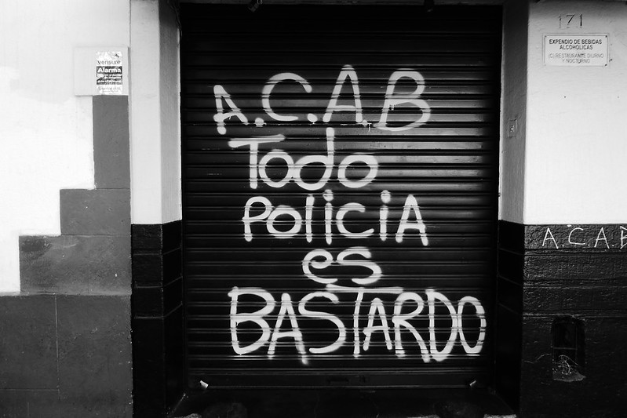
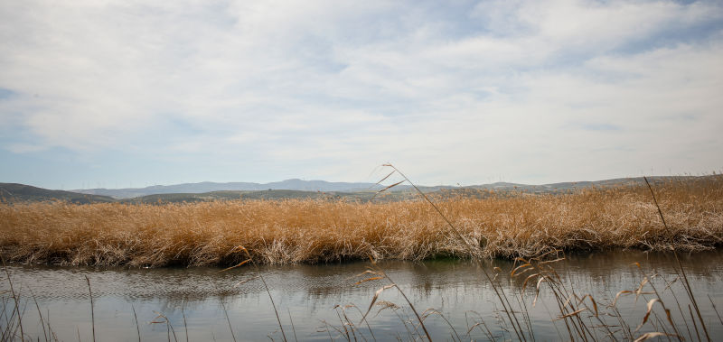
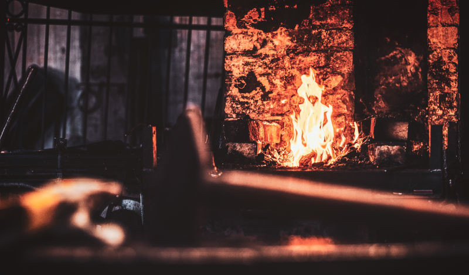
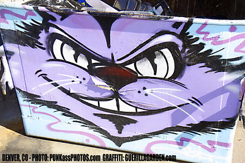
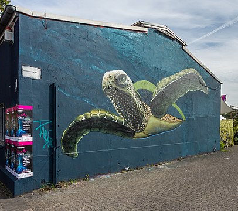
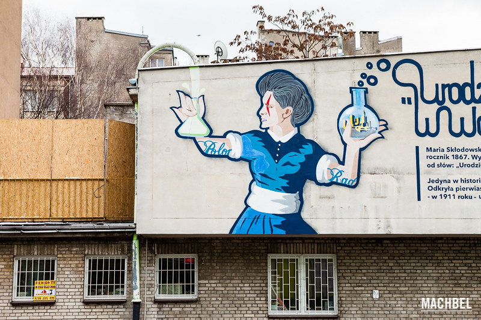

# Buenos días, Sr. Vampiro

\sinc

&nbsp;

Esta es mi historia, de como me convertí en cazavampiros y libré a mi barrio de su amenaza. Tu historia podría ser igual o ser totalmente diferente.

## El gran plan

\conc

Veamos primero cuál era el gran plan contra el que debía luchar.

Lord Ceballos quería montar una ciudad de juego, bebida y descontrol en mi barrio. Le gusta pasear por sus dominios y observar la miseria humana que traería el megalocal que iba a montar, New Las Vegas.

De hecho, se frotaba las manos pensando en como iba a pasear por la capilla de boda llena de símbolos religiosos sin qué le afectarán. 

Para ello tenía que conseguir que le permitieran derribar el campo de fútbol local para construir allí el casino. Además, tendría que construir una gran autopista hasta el casino, pasando por unos humedales donde había una especie de rana protegida. Por último, tenía que desmantelar los grupos vecinales para que no lucharan mientras montaba el casino y la autopista.

### Permisos de construcción 

El tema de los permisos de derribo y construcción iba a conseguirlo proporcionando a algunos concejales sus deseos más sucios y depravados y luego chantajeándolos a cambio de votar a favor de sus proyectos.

Tendrían que conseguir, drogas, menores, bastante dinero y un asesinato que pareciera natural. Nada fuera de lo normal, de lo que hacía siempre.

\sp

### Ecodiversidad

Lord Ceballos pensaba cargarse el humedal a través de una chatarrería/fundición cercana que tendría una fuga de mercurio y destruiría el ecosistema de la rana. Con lo que no habría nada que proteger. Además, así tendría un malo contra el que se manifestarían y lucharían los ecologistas y otros grupos sociales.

### Grupos vecinales

Tenía pensado destruirlos desde dentro. Por un lado, los tenía distraído con la fuga de mercurio, mientras pensaba hinchar a uno de los grupos a donaciones, e infiltrar a agentes con grandes dotes de persuasión y sex-appel, para sembrar la cizaña hacia dentro y hacia fuera.

\sinc

## Resumen [Aviso Spoiler]

\conc

XXX

\sp

\sinc

## Hasta luego, Maricarmen

> Mi profesora de Ciencias Sociales, Maricarmen, había muerto y mi madre se empeñó en ir al tanatorio para su despedida. Gente que no conoces llorando, otra gente que no conoces hablando y riendo y un tipo que no conocía de nada muy cripi. Solo miraba a los presentes, sacaba fotos a escondidas y tecleaba cosas en el móvil, todo muy sospechoso. 

\conc

_DÍA_

Todas las madres, padres o tutores de tus PJ han tenido la misma idea, ir al tanatorio a despedirse de su profesora. Nadie les hace caso, los adultos como siempre están en sus cosas y tus futuras cazadoras están juntas en una esquina. La difunta está de cuerpo presente y ninguna ha visto nunca un muerto.

Pueden _echarle un vistazo al cadáver_ si se quitan de encima las miradas de los adultos Mediocre (+0). El maquillaje es muy bueno y parece que está viva, pero llama la atención que le han puesto unos guantes largos negros y en el cuello tiene dos heriditas, como dos pinchazos.

Si se ponen a _fisgonear entre los adultos_ Mediocre (+0), podrán enterarse de que Maricarmen se debió suicidar en su casa y se preocuparon cuando no apareció por el colegio al día siguiente. Debía estar medicada para la depresión y no debía estar muy bien de salud. Alguna madre recuerda verla muy pálida en las últimas reuniones.

Entre los asistentes hay un _personaje muy cripi_ _sacando fotos a escondidas_ y escribiendo en su móvil. Si se acercan mucho e intentan hablar con él, responderá con monosílabos y huirá a los baños. 

De repente habrá algo de revuelo un concejal del ayuntamiento entrará en el tanatorio, dejará su tarjeta, escribirá en el libro de visitas y se pondrá a hablar con los asistentes. Si se acercan a escuchar Mediocre (+0), será charla política intrascendente. Tanto mirando el libro de visitas como escuchándole verán que es Ernesto Lujua Martínez y por los apellidos debía ser hermano de Maricarmen.

Lo curioso es que no parece nada afectado, igual alguna se acuerda de una serie de CSI Mediocre (+0), los suicidas son normalmente muertes sorpresa que afectan mucho a los familiares y aunque no tuvieras simpatía por el muerto, te afecta la sorpresa y el qué pensaran los demás, cómo no se dieron cuenta, seguro que no se veían, … más siendo un político cuya imagen puede verse comprometida.

Cuando empiece el funeral, les dejarán fuera con algunos adultos. Son las únicas niñas de la misma edad, así que seguramente se juntarán para hablar de las cosas raras. Se habrán visto fisgando por el tanatorio y quizás puedan intercambiar info y cotilleos.

\sp

### El cripi

Este personaje alto delgado y desgarbado que parece que lleva un traje 4 tallas más grandes, no para de moverse nerviosamente y no deja de mirar a todas partes. Es uno de los siervos más incompetentes de Alfonse (ver más adelante). Este vampiro le ha mandado observar qué pasa en el velatorio y comunicárselo.

Si consiguen _robarle el móvil_ (+4) verán que envía fotos mensajes a Máster Alfonse poniendo notas sobre quiénes aparecen en las fotos.

* Siempre nervioso
* **Bueno Bueno (+2) en:** Observando y apuntando cosas, Cavar hoyos
* **Malo (-2) en:** Interacciones sociales, Pasar desapercibido
* **Estrés:** Nada (cae al primer golpe)

\sinc

## Charla especial

> Al día siguiente en el colegio cogieron a todos los alumnos de Maricarmen y los reunieron para una charla sobre el suicidio dado por Samuel, el psicólogo del colegio. Tras la charla Samuel reúne a todas las PJ, ya que las vio en el funeral para hablar sobre el tema.

\conc

_DÍA_

Samuel cree que la sinceridad y no ocultar cosas a los niños es fundamental así que les dirá que pueden preguntarle todo lo que quieran y sabe bastante.

* Se tomó un montón de medicamentos, se cortó las venas por las muñecas y se metió en la bañera.
* Nadie en claustro había percibido nada, de hecho parecía que estaba conociendo a alguien y parecía ilusionada.
* Ha sido incinerada como pedía en su nota de suicidio.
* Eso ya lo sabían ellas, pero lo confirma Samuel, llevaba unas semanas muy débil y anémica. Se dormía en todas partes y estaba muy pálida. Creen que igual tenía un cáncer y había preferido no sufrir.

### Samuel, el psicólogo del colegio

* Psicólogo new age
* **Bueno Bueno (+2) en:** Interpretando a las personas, Charlatanería
* **Malo (-2) en:** Deporte, Conducir
* **Estrés:** Nada (cae al primer golpe)

Después de la reunión con Samuel, ninguna recordará que Maricarmen faltase a clase en el último año y si tienes algo grave pierdes mucho tiempo en médicos.

\sp

### El chat

En este punto quizás quieran intercambiar redes, WhatsApp u otros sistemas de mensajería y empezar a hablar de la muerte de Maricarmen. Hay cosas que no cuadran y todo suena sospechoso.

La idea es que tengan una hoja que simule su chat donde escriban los mensajes uno tras otro poniendo cada cazadora su nombre.

El DJ debería poder mirar esas hojas solo si algún adulto tiene acceso al móvil de la forma que sea. Igual sus padres se lo revisan buscando pruebas de que drogan o quizás un hacker se lo haya pirateado. Si borran el chat, se guarda el papel y se saca uno nuevo, para simular que no hay acceso a las conversaciones anteriores.

Podrías hacerlo también con un chat de WhatsApp o Telegram, pero la hoja de papel evita que cuando cojan el móvil se pongan con otros chats. Además, me gusta el impacto dramático de arrancar la hoja de las manos por sorpresa como si fueras sus padres o un malo y sin miedo a romper el móvil. También permite cotillear la hoja sin que ellos lo sepan que les han hackeado o que han fisgado su móvil.

Como siempre, si todo esto te parece un engorro, puedes hacer que simplemente hablen entre ellas, 

\sinc

## Una gran herencia

> Si Mari Carmen no se había suicidado, quién había sido el asesino, por qué, qué eran esas marcas en su cuello y por qué a nadie le preocupaba. 

\conc

_DÍA_

Pueden empezar a investigar por su cuenta o en conjunto alguno de los flecos que tiene toda esta historía.

* Si busca al cripi, terminarán encontrándolo, trabaja de celador en el IML (Instituto de Medicina Legal), vamos la morgue. Podría haber interferido en la autopsia.
* XXX

Si ves que no están muy por la labor de investigar que paso a Maricarmen, haz saltar la noticia de que los abogados de Ernesto Lujua han pedido a los padres de una de tus PJ que abandonen su casa en 3 meses. ¿Tienen algo que ver la muerte de Maricarmen con este desahucio?

XXX

\sp

\sinc

## Multiple choices

> En este punto de la historia empecé a seguir diferentes pistas y cada pista me fue llevando a una nueva caza y a descubrir una parte del gran plan vampírico. Yo seguí este orden en mis investigaciones, pero tú quizás lo harías en otro orden o de otra manera. Al final lo importante es tener todas las piezas del plan y poder montarlo.

\conc

XXX

\sp

\sinc

## Mientras tanto …

En este punto puedes encontrar eventos o encuentros que pueden pasar en cualquier momento de la aventura y otros que pueden saltar si lo crees necesario y se dan unas condiciones específicas.

Los más sencillos, como las fiestas del barrio, simplemente van a ofrecerte la posibilidad de meter aspectos especiales y temporales al barrio. Los más complicados pueden llevar una o más sesiones terminarlos, tener encuentros y combates y con ello obtener nuevos enemigos y aliados.

### Las fiestas del barrio

> Cada año por estas fechas son las fiestas del barrio y si bien las calles eran un hervidero de gente bebiendo y bailando, 

\conc

Durante las fiestas del barrio puedes dotar al barrio de aspectos nuevos que no tiene de normal, como «lleno de gente» que dificultad seguir a una persona y facilita esconderse y desaparecer entre la multitud. 

Debes pensar como son las fiestas del barrio, quizás son un desfreno de alcohol y música alta, tal vez hay carrozas de floras o pasos religiosos. Piensa en una fiesta que conozcas y te guste y plásmala en algunos aspectos. Veamos algunas ideas:

* **Carnavales:** Gente disfrazada, carrozas y pasacalles que cortan el tráfico, música y alcohol.
* **Sanfermines:** Gente en las calles 24 horas, eventos importantes que atraen a gente de fuera, música y alcohol.
* **Semana Santa:** Grandes concentraciones de gentes a determinadas horas, pasos religiosos que colapsan el tráfico, sobriedad y religiosidad.

Hay otras opciones similares que no impliquen las fiestas del barrio y que puedes meter esporádicamente son:

* El equipo deportivo local ha conseguido __ganar alguna competición__ y la gente lo celebra
* Alguna __celebridad viene al barrio__, desde el papa hasta un o una deportista de élite que salió del barrio.
* Se celebra algún tipo de __festival musical__, __concentración motera__, __concursos populares__, …

\sp

\sinc

### La Pijamada

> Después de los estresantes días anteriores, una de mis compañeras cumplía años y nos invitó a una pijamada en su casa. Además, sus padres iban a estar fuera, con lo que la casa sería para nosotras.

\conc

Esta parte de la aventura puedes hacerla cuando quieras, quizás alguna vez que falte un jugador o ese día que no tienes nada preparado y buscáis algo rápido y divertido.

Tras las cosas normales de una pijamada, cena de chuches, pintar uñas, poner purpurina en ropa, … empezarán a jugar al UNO Vergonzoso, la que pierda cada mano debe contar una historia vergonzosa que haya vivido. Todas van a perder hazle tirar un dado para establecer el orden de las historias.

Es un buen momento para que se pongan motes, si no los tienen ya, basándose en la historia. Luego deberán votar cuál la historia más vergonzosa y nombrar a la reina del ridículo.

Puedes como DJ convertir los motes o las historias en aspectos que pueden ser invocados por todo el mundo también puede aprovechar para cambiar alguno de sus aspectos por uno nuevo de la pijamada.

Imagina que una cazadora cuenta que jugando se quedó atrapada en contenedor de basuras durante horas. La encontraron durmiendo abrazada a una calabaza medio podrida y desde entonces la llaman «Basurilla». Si entran en un lugar con un cadáver medio descompuesto, podrían invocar su mote/aspecto para que lo le afecte el horrible olor. 

\sinc

### La boy band

> Lord Ceballos sabía que había un grupo de adolescentes truncando uno a uno sus planes, pero todavía no sabía quiénes eran. Así que ideo una estrategia para ocultar su próximo golpe, un concierto en el barrio de la boy band de moda.

\conc

De la noche a la mañana cualquier cacho de pared libre se llena de carteles anunciando el mayor concierto que ha conocido el barrio, los NashB, la banda de K-Popers más famosa del mundo y encima con entradas solo en taquilla a precios populares. El concierto será en la plaza del barrio en una semana.

\sp

Este evento se puede usar para _ocultar cualquier tipo de actividad_ que el Grupo Ceballos quiera hacer desapercibidamente como la fuga de mercurio de la fundición o que no quiere que haya oposición como el derribo del campo de fútbol.

Las noticias del concierto serán una semana antes y podrían coincidir con decisiones burocráticas importantes como el permiso de derribo del campo de fútbol o los permisos de construcción en los humedales.

Se hará _en la plaza grande_ del barrio porque la productora de los NashB, no creen que el estadio de fútbol del barrio sea seguro (otro clavo en el ataúd buscando su derribo).

El concierto _será de noche_ y el barrio estará lleno hasta la bandera, coches aparcados en cualquier sitio, buses y metro colapsados, barras sirviendo alcohol en las calles, … 

Es una noche perfecta para un desastre y quizás te interese para tu partida una noche de caos en que un par de vampiros jóvenes random de otras zonas de la ciudad salgan a divertirse. La poli estará sobrepasada, habrá mucho alcohol, las ambulancias no pueden pasar por los coches mal aparcados, un caos total.

También puedes ser una noche en que tus cazadoras planeen un gran golpe a los vampiros y el concierto les dé la cobertura necesaria. Un incendio más no se va a notar.

\sinc

### Psicólogo infantil

> Papá y mamá me miraban con asombro y algo de miedo mientras el director les contaba lo que había en mi mochila y lo que ponía en mi libreta de notas de cazadora. Recuerdo perfectamente como terminó su discurso diciendo «psicólogo infantil».

\conc

Si algún adulto encuentra pruebas de tus actividades extraescolares, muy posiblemente hablará con tus padres y terminarás teniendo que ir al psicólogo infantil.

El psicólogo infantil va a ser un importante obstáculo en tu carrera de cazavampiros. Por lo menos dos sesiones semanales de terapia que no puedes saltarte más diferentes tareas que hacer entre sesiones como escribir sobre tus sentimientos o hacerte un video-diario grabando mensajes diarios.

Todo esto podría cortar tus vigilancias o truncar tus persecuciones de sospechosos. También tienes que esconder tus trastos antes de las sesiones y recuperarlos después.

Puedes usar las estadísticas de Samuel, el psicólogo del colegio, si en algún momento quieren interactuar con él.

\sp

\sinc

### ACAB

> La situación se nos iba de las manos. Era demasiado para un grupito de niñas valientes, pero aun así niñas y sin recursos. Así que decidimos recurrir a la policía … grave error.

\conc

Esta parte de la aventura puede meterse en cualquier parte, pero has de tener en cuenta que si acuden a la policía serán identificadas y el plan vampírico sabrá quién le ha atacado.

Antes de jugar esta escena deberías tratar de jugar con su paranoia de que tal vez la poli es corrupta y está comprada por el Grupo Ceballos.

Solo deberían intentar esta jugada si están muy desesperadas y deberían pensar durante toda la escena que es el mayor error de su vida hasta que aparezca Catalina a salvarlas.

Según entren algún poli se les acercará y les preguntará qué quieren, qué les pasa, … No les harán mucho caso y las tendrán un poco apartadas mientras localizan a sus padres o tutores.

Enseguida un par de polis comprados por Ceballos entrará en acción en cuanto oigan alguna cosa de vampiros, de los Lujua o del Grupo Ceballos. Se harán cargos de tus cazadoras y se las llevarán a una sala de interrogatorio.

\sp

#### La sala de interrogatorio

Lo primero que harán los dos polis será atar las manos a la espalda con unas bridas. No es que crean que pueden con ellos, es para intimidarlas creando el aspecto «retenidas».

Las primeras preguntas parecerán normales, sobre sus nombres, donde viven y quiénes son sus padres, pero rápidamente se centrarán en el plan vampírico y el Grupo Ceballos. Serán preguntas realizadas con un tono más intimidatorio sobre que saben de los últimos acontecimientos, dónde estaban cuando ocurrió tal o cual evento importante. 

Pueden mentir, pero los polis son experto en eso y juegan en casa. También pueden callarse, pero también sabe hacerte hablar.

Amenazarán con meterlas en un reformatorio, en alejarlas de sus padres y amigos y si siguen sin contestar la verdad vendrán gritos, insultos y, por último, bofetadas.

Si consiguen aguantar hasta las bofetadas sin rendirse, llegará la caballería a salvarlas. Aun así estarán marcadas y habrán entrado en el radar del plan vampírico.

* Poli corrupto
* **Bueno Bueno (+2) en:** Interrogar, Ocultar sus actividades
* **Malo (-2) en:** Leyes, Moverse en las calles
* **Estrés:** ◯◯

#### Entra Catalina

Catalina Faroes es una activista de derechos sociales del barrio. Es de origen brasileño y tiene el título de abogada.

Estaba en la comisaría, sacando a una amiga detenida por unos disturbios con un grupo antiabortista, cuando vio a dos polis metiendo a un grupito de niñas en una sala de interrogatorio y uno de ellos llevaba un manojo de bridas de detención en la mano.

Eso hizo saltar todas las alarmas, menores interrogados sin tutores presentes o sin un asistente social y lo de las bridas sonaba a detención ilegal.

Acto seguido se acercó a la zona de seguridad y no quito ojo a las cámaras de la zona de interrogatorio mientras se roneaba al encargado. Al primer tortazo de uno de los detectives, salió hecha un basilisco a la puerta de la sala de interrogatorio y empezó a dar golpes y patadas.

Catalina sacará todo su arsenal para sacar a las niñas: 

* Amenazará con denunciarles por interrogar a menores sin sus tutores o alguien de protección de menores, 
* les dirá que si las han tocado un solo pelo les denunciará por pederastas, 
* que va directa con ellas al hospital a hacerles pruebas de violación y 
* todo a gritos para que se oiga en toda la comisaría.

Se empezará a juntar gente, civiles y policías. Ante esto los polis corruptos dejarán irse a las niñas y Catalina y tratarán de escaquearse.

\sp

#### El centro social

Catalina se las llevará al centro social donde tiene su despacho y allí hablará con ellas. Si intentan irse, las dejará irse sin problemas, ya las encontrará del barrio cuando estén más tranquilas.

Está dispuesta a escuchar, aunque sin pruebas muy muy sólidas todo lo que le digan de los vampiros, serán solo fantasías. Pedirá pizza para comer algo y les dará su tarjeta. Cuando vuelvan a tener problemas con la poli, deben llamarla de inmediato y no decir nada a ningún poli. Recuerden _ACAB All Cops Are Bastards_

> Tu panda ha perdido su anonimato, pero tiene un aliado muy interesante con Catalina. No solo será un importante apoyo mental, sino que puede ser muy útil en situaciones legales y burocráticas y como sortearlas.

\sinc

### Grupo terrorista

> No era conocido en su momento, pero Grupo Ceballos controlaba varios periódicos y televisiones. Con su influencia en la opinión pública, rápidamente los ataques que estábamos haciendo en el barrio empezaron a ser considerados ataques terroristas y se hablaba de alguna célula radical antisistema.

\conc

Puedes hacer saltar este evento como forma de meter más presión a tu mesa. Un nuevo elemento va a obligar a tus cazadoras a tener que ser muy cuidadosas o sus actividades serán descubiertas.

El barrio se va a llenar de furgonetas de TV y de periodistas de investigación buscando pruebas de la célula terrorista. 

Puedes alargar el tema de los periodistas y los terroristas lo que quieras. Cuando se vayan los periodistas «serios», vendrán los «otros» periodistas, conspiranoicos, youtubers, buleros, buscando views y likes.

En general, todo esto hará que haya más ojos vigilando y bocas haciendo preguntas. Personas normales con cámaras y micrófonos ocultos.

Podrías pensar que habría más presencia policial, pero realmente la mayoría de las cosas que hagan tus cazadoras no pasarán de disturbios callejeros. No hay nada de terrorismo, así que la poli pasa del tema.

\sp

\sinc

## Amigos y enemigos

Aquí tienes las bíos de los personajes principales de la aventura para que puedas consultarlos cuando lo necesites.

\conc

\sinc

### Lord Ceballos

Lord Ceballos lleva con nosotros desde hace más de 200 años. Nacido en una familia muy rica de la ciudad, uso sus poderes vampíricos y el dinero familiar para montar una empresa que en pleno siglo XXI es casi una megacorporación muy poderosa, el Grupo Ceballos. Pero Grupo Ceballos es solo una parte (muy importante eso sí) de su gran plan vampírico para controlar toda la ciudad.  

El principal problema hoy en día que tiene el plan vampírico de Lord Ceballos es el propio Lord Ceballos, está demasiado anclado en el pasado e intenta usar trucos muy viejos en un mundo moderno y claramente muchas veces fallan. Aun así sus siervos vampíricos se encargan de modernizar sus trucos al nuevo siglo a escondidas de él. 

Su objetivo principal a día de rol es tu barrio y va a caer como otras zonas de la ciudad, es que no te quepa duda.

\conc

\sc

* **Aspectos**
  * **Concepto principal:** Lord Vampiro de la ciudad
  * **Complicación:** Anclado en el pasado
  * XXX
  * XXX
  * XXX
* **Estilos:** Cauto (X), Furtivo (X), Ingenioso (X), Llamativo (X), Rápido (X), Vigoroso (X) 
* **Proezas**
  * XXX
  * XXX
  * XXX
* **Capacidad de recuperación:** X

\sp

\sinc

**Sugerencia de interpretación:** Eres un ser superior que lleva más de dos siglos entre los simples mortales y si tus planes se cumplen, te convertirás en el amo y señor de toda ciudad, así que es normal que consideres como hormigas a todos los que te rodean. Sus vidas son insignificantes para ti, meras herramientas, y no hay problemas en acabar con las vidas de los que te sirven, si sirve a tu causa. Si alto te irrita es que algo no salga como quieres y, en ese caso, alguien tiene que pagarlo.

\conc

\sinc

### Alfonse

XXX

Alfonse seguramente será el vampiro con el que más se van a relacionar, tanto en combates y persecuciones, como puede que algunos tratos y planes suicidas. Es importante que Alfonse vaya _subiendo de nivel_ con tus cazadoras con lo que deberías subirle los mismos hitos que a tus PJ, principalmente, para que no se quede atrás y pueda ser un digno rival o un socio competente.

Alfonse se suele llevar bien con la gente con calle, con buscavidas como él y puede que incluso llegue a ofrecer a esos PJ convertirles en vampiro como él y apoderarse juntos de la ciudad.

\conc

\sc

* **Aspectos**
  * **Concepto principal:** Vampiro buscavidas
  * **Complicación:** Sed de poder
  * XXX
  * XXX
  * XXX
* **Estilos:** Cauto (+0), Furtivo Bueno (+2), Ingenioso Normal (+1), Llamativo Grande (+3), Rápido Bueno (+2), Vigoroso Normal (+1) 
* **Proezas**
  * XXX
  * XXX
  * XXX
* **Capacidad de recuperación:** 3

\sinc

**Sugerencia de interpretación:** XXX

\conc

\sp

\sinc

### Catalina Faroes

XXX

\conc

\sc

* **Aspectos**
  * **Concepto principal:** Abogada antisistema
  * **Complicación:** Fichada por la policía y detenida bastantes veces
  * XXX
  * XXX
  * XXX
* **Estilos:** Cauto Normal (+1), Furtivo Bueno (+2), Ingenioso Bueno (+2), Llamativo Normal (+1), Rápido Grande (+3), Vigoroso Mediocre (+0) 
* **Proezas**
  * XXX
  * XXX
  * XXX
* **Capacidad de recuperación:** X

\sinc

**Sugerencia de interpretación:** No dejes de sonreír ni en las peores situaciones, porque ya has estado en cosas parecidas y has salido viva. Lo tuyo es el instinto y las decisiones rápidas, antes incluso de que lo hayas pensado ya estás actuando, quizás golpeando un antidisturbios o cantándole la internacional a la cara al nazi que intenta amedrentarte con un bate.

\conc

\sp

\sinc

## Lugares

A continuación he copiado las notas que fui haciendo sobre los distintos lugares donde ocurrió mi aventura para que puedan hacerte una mejor idea. Son, principalmente, guaridas de vampiros, zonas de caza y algún que otro sitio donde hubo encuentros importantes.

### El barrio

\conc

El barrio es una localización especial en esta aventura porque es tu labor definirlo poniéndole unos 4 aspectos. 

Llevas muchos años viviendo en el barrio para que tengas secretos para ti, por lo que el barrio solo tiene aspectos visibles. Los aspectos deben responder a preguntas como:

* ¿Quién vive en el barrio?
* ¿Es rico o es pobre?
* ¿Está en el centro o en las afueras?
* ¿Está bien comunicado?
* ¿Hay mucha delincuencia? ¿Hay mucha policía? ¿Está abandonado por las instituciones?

\sinc

### Guarida de Lord Ceballos

* **Aspectos visibles:** Altísima seguridad, Guarida perfecta de vampiros
* **Aspectos ocultos:** Habitación del pánico, Túnel de escape

\conc

Lord Ceballos vive en el ático de un edificio de viviendas de lujo, que es completamente de su propiedad. En ese edificio solo viven sirvientes suyos tanto humanos como vampiros y encima de ellos con la vivienda más lujosa y segura está Lord Ceballos.

Solo hay dos entradas al edificio, la principal, y, como no, la de servicio para repartidores, vigilantes y demás. Ambas tienen arcos de seguridad y escáner de rayos X para las bolsas. 

El ático solo tiene acceso por ascensor privado en el que siempre hay un vigilante que actúa de ascensorista. Todas las paredes están llenas de grandes ventanales que al amanecer se cubren de persianas metálicas reforzadas que no dejan entrar ni la luz, ni las balas.

El ático tiene varios dormitorios con su propio cuarto de baño y un gran salón donde Ceballos celebra sus fiestas. Tiene barra de bar, cómodos sofás, una chimenea y en el lugar principal una especie de sofá unipersonal como si fuera un trono.

Detrás del trono, tras unas cortinas de terciopelo rojo, tiene la puerta a una habitación del pánico donde puede dormir en una especie de sarcófago metálico anti-cazavampiros.

La chimenea se puede mover, pulsando un botón escondido y da acceso a una especie de tobogán que te lleva a las alcantarillas debajo del edificio.

\sp

La seguridad no tiene armas de fuego, solo porras y tasers. Ceballos quiere saber que está protegido, pero no llamar demasiado la atención llevando más protección que el presidente del gobierno.

\sinc

&nbsp;

### Los humedales

* **Aspectos visibles:** Reserva protegida, Zona pantanosa
* **Aspectos ocultos:** Intereses inmobiliarios, Fácil de deshacerse de cuerpos y pruebas

\conc

En un extremo del barrio hay una zona pantanosa, unos humedales según la asociación ecologista local. Es una zona de charcas y cañaverales donde se supone que descansan diversas aves migratorias. Además, debe haber un par de especies de ranas protegidas.

Los humedales corren serios problemas debido a, primero, la fundición de San Andrés que supone un riesgo muy importante para el ecosistema de los humedales y, segundo, porque hay muchos intereses inmobiliarios, no solo del grupo Ceballos, en secar esos terrenos y edificar urbanizaciones privadas de lujo.

Se cuentan historias raras del humedal, desde luces extrañas hasta ovnis. Pero lo único cierto es que es un lugar estupendo para deshacerte de cadáveres y otras pruebas incriminatorias. 

\sinc

### La fundición

* **Aspectos visibles:** Vieja y destartalada, Peligro ecológico
* **Aspectos ocultos:** Controlada en secreto por el Grupo Ceballos, Aislada y lejos de miradas indiscretas

\conc

\sp

\sinc

&nbsp;

\conc

La fundición y planta de reciclaje de San Andrés fue durante muchos años uno de los motores de la economía del barrio, pero hace años que entró en decadencia y está vieja y destartalada fundición de chatarra es más un peligro ecológico que una fuente de riqueza.

Se encuentra al borde de los humedales y no es la primera vez que tiene «fugas accidentales» de productos peligrosos. Su cierre está siendo luchado por las asociaciones de vecinos y ecologistas, pero también da trabajo a unas cuantas familias. Esto lo convierte en un tema de conversación escabroso en las reuniones familiares del barrio.

La fundición cuenta con un edificio de oficinas, la fundición propiamente dicha, varios almacenes donde se guarda el material recuperado y un extensísimo patio donde se almacena a la intemperie la basura metálica a reciclar.

Cada día llegan camiones que traen basura metálica y se llevan metal preparado para su uso industrial.

Los subproductos contaminantes como plomo o mercurio se guardan en balsas estancas a la espera de ser tratadas en otras fábricas.

Lo que nadie sabe es que el grupo Ceballos la compró a través de una serie de empresas fantasmas, algunas fuera del país.

Por las noches para su producción y como está en los humedales, el lugar se convierte en un sitio aislado y lejos de miradas indiscretas, donde los vampiros pueden hacer sus cosas de vampiros sin ser detectados.

\sp

\sinc

### Campo municipal de fútbol 

* **Aspectos visibles:** Grandes Eventos, No cumple las normativas de seguridad actuales
* **Aspectos ocultos:** Trampa sin escapatoria, Pelotazo inmobiliario

\conc

Este campo de fútbol municipal tiene unos 60 años, construido en los 80 cuando el barrio tuvo un gran crecimiento.

Tiene un aforo de 8.000 personas y es donde juega el equipo local de segunda B.

Uno de sus problemas principales es que no cumple ningún tipo de legislación de espacios públicos, ni accesibilidad, ni seguridad, ni protección civil, … nada de nada. Llevan años con planes de derribarlo y construir un polideportivo que recoja otras actividades deportivas. Sin embargo, todas las administraciones locales por una razón u otra lo han retrasado.

El campo está metido casi en los humedales con lo que solo se puede entrar desde uno de los laterales largos. Si se pone vigilancia en ese lado es muy difícil salir o entrar sin ser visto, ya que no hay accesos de ningún tipo por otros lados.

\sp

\sinc

## Personajes pregenerados

Aquí tienes 4 cazadoras novatas del barrio preparadas para dar guerra a los vampiros. También puedes usarlas de compañeras de clase o de grupo de apoyo y rescate si tus cazadoras principales fallan. No tienen todos sus aspectos rellenados para que puedan rellenarlos en partida.

\sinc

### Amirah Tajdin

_Apodo:_ Gata

\conc

 

La calle corre por tus venas, conoces a todo el mundo, sabes todos los rumores y no te pueden engañar con ningún truco. Estás más tiempo en la calle que en tu casa y nadie te controla. Tus padres murieron hace años y tu abuela está muy mayor para controlarte.

Amirah es la alegría del grupo, es la que da vidilla, la risa en el momento inoportuno, la canción en momentos duros. Si nota que alguna amiga está de bajón, su forma le lleva a sacarte una sonrisa.

\sc

* **Aspectos**
  * **Concepto principal:** Tengo calle
  * **Complicación:** Huérfana que vive con su abuela
  * Entrenamiento de carterista
  * .................................................................................
  * .................................................................................
* **Estilos:** Cauto Normal (+1), Furtivo Bueno (+2), Ingenioso Normal (+1), Llamativo Grande (+3), Rápido Bueno (+2), Vigoroso Mediocre (+0) 
* **Proezas**
  * **Conozco a un tipo:** Debido a que tengo muchos contactos, una vez por partida puedo encontrar un aliado que me ayude en el lugar más oportuno.
  * **Hablar sin parar:** Debido a que soy una charlatana de primera, gano un +2 para Crear una ventaja de modo Furtivo cuando converso con alguien.
  * XXX
* **Capacidad de recuperación:** 3

\sp

\sinc

### Nuria Ramos

_Apodo:_ Greenpeace

\conc

Nuria es la más activista del grupo, se apunta a todas las causas del barrio y las apoya con fervor. Si Nuria apoya una causa, casi casi seguro que es una causa buena que hay que defender.

Nuria es la más sensible de la panda, es su corazón y su brújula moral. Distingue muy bien lo que es legal de lo que es bueno y solo le importa lo que es éticamente justo.

Siempre marcará el objetivo justo, aunque a veces tenga que tomar senderos extraños y dudosos caminos. Es una pequeña Robin Hood, que si tiene que saltarse la ley lo hará.

Quiere ser abogada medioambientalista y de derechos humanos y es por eso que se pasa la vida viendo series de abogados y leyendo sentencias de casos contra grandes corporaciones supercontaminantes.

\sc

* **Aspectos**
  * **Concepto principal:** Activista junior
  * **Complicación:** Demasiado comprometida
  * Le encantan las series y los libros de abogados
  * .................................................................................
  * .................................................................................
* **Estilos:** Cauto Normal (+1), Furtivo Grande (+3), Ingenioso Bueno (+2), Llamativo Bueno (+2), Rápido Normal (+1), Vigoroso Mediocre (+0) 
* **Proezas**
  * **Lenguaje legal:** Debido a que conozco muchos términos y precedentes legales, gano un +2 para Crear una ventaja de modo Cauto cuando converso con alguien.
  * XXX
  * XXX
* **Capacidad de recuperación:** 3

\sp

\sinc

### Ana Isabel «Anais» Duran

_Apodo:_ Tocón

\conc

Anais es la mayor (por unos meses, pero cuando tienes doce años es mucho) y a la vez la líder. Ella escucha a sus compañeras tiene en cuenta los pros y los contras valorando la experiencia de cada una en el tema y toma una decisión, normalmente acertada, pero alguna vez no ha estado centrada y ha supuesto un problema para el grupo.

Anais es la que tiene los pies más en a tierra, el ahora y el aquí son lo importante. Ni sueña con un mundo mejor como Nuria, ni tampoco flipa con la tecnología y sus aplicaciones como Sabina y desde luego no está tan centrada en la calle como Amirah. Para ella los problemas están aquí y ahora y es aquí y ahora donde deben resolverse.

Sus madres son profesionales libres (doctora y arquitecta) y tienen bastante más dinero que el resto de la gente del Barrio. Eso no sería ningún problema si no fuese porque nunca sabe si sus amigos y amigas lo son de verdad o solo por su dinero. Eso le crea bastantes inseguridades que compensa con su carácter de líder fuerte.

\sc

* **Aspectos**
  * **Concepto principal:** Líder natural
  * **Complicación:** Dinero por castigo
  * Nervios de acero
  * .................................................................................
  * .................................................................................
* **Estilos:** Cauto Grande (+3), Furtivo Normal (+1), Ingenioso Bueno (+2), Llamativo Bueno (+2), Rápido Mediocre (+0), Vigoroso Normal (+1) 
* **Proezas**
  * **La VISA de mis padres:** Debido a que tengo una tarjeta de crédito de mis padres para emergencias, una vez por partida puedo pagar lo que sea que necesite, siempre que sea legal y sin pasarme del límite de la tarjeta.
  * XXX
  * XXX
* **Capacidad de recuperación:** 3

\sp

\sinc

### Sabina Castillo

_Apodo:_ Lovelace

\conc

Sabina es introvertida y podría pensarse que con gran dificultad de socialización. Pero en realidad cuando quiere es muy social, solo que normalmente no quiere. Prefiere sus cachorros tecnológicos y sus programas.

Su pensamiento es el más científico de toda la panda y es la que mejor entiende la tecnología. Ese pensamiento científico hace que sea muy poco propensa a creer en lo sobrenatural y el ocultismo.

Su principal problema en la vida son sus padres que son tremendamente protectores y no le dan ninguna cancha. No la dejan solo nunca, revisan sus redes, investigan a sus amistades y tienen el horario más restrictivo de su cuadrilla.

\sc

* **Aspectos**
  * **Concepto principal:** Cerebrito
  * **Complicación:** Padres muy protectores
  * XXX
  * .................................................................................
  * .................................................................................
* **Estilos:** Cauto Bueno (+2), Furtivo Mediocre (+0), Ingenioso Grande (+3), Llamativo Normal (+1), Rápido Bueno (+2), Vigoroso Normal (+1) 
* **Proezas**
  * **La contraseña es 1234:** Debido a mis conocimientos informativos superiores, una vez por partida puedo tener acceso a un dispositivo electrónico con clave, huela, reconocimiento facial, etc.
  * XXX
  * XXX
* **Capacidad de recuperación:** 3

***