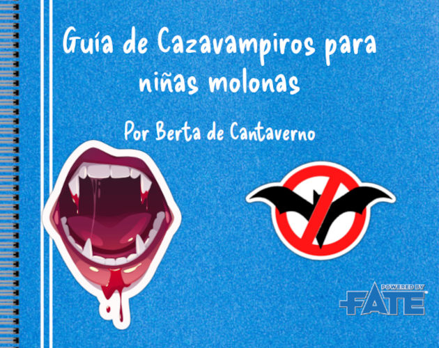
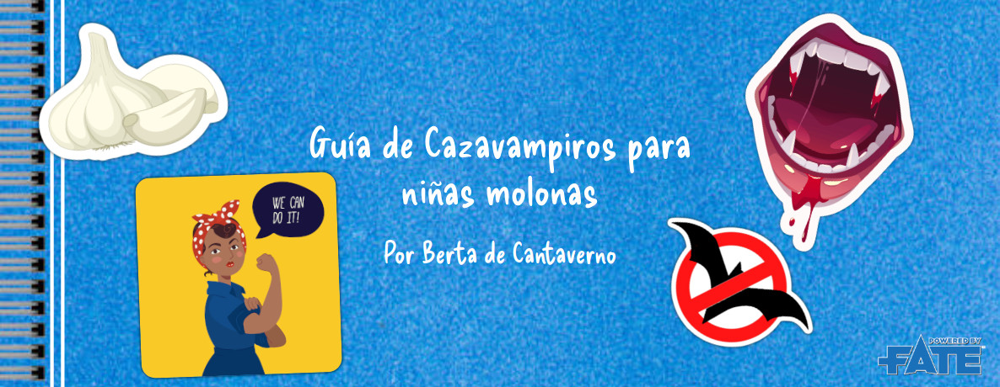
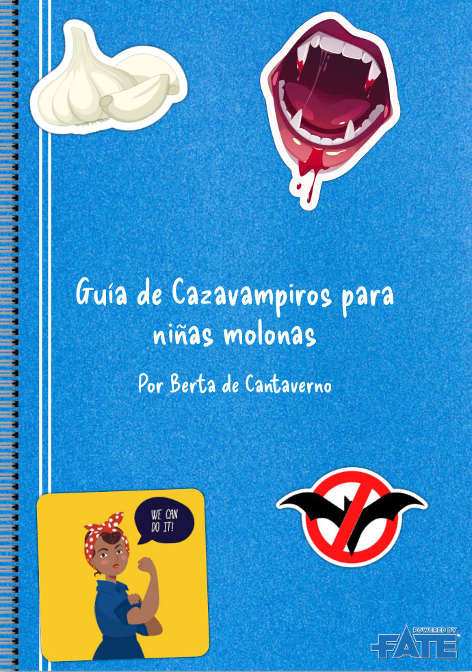
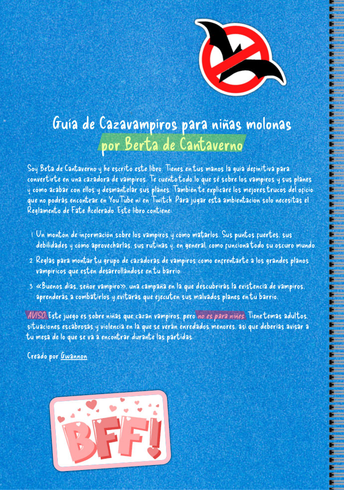
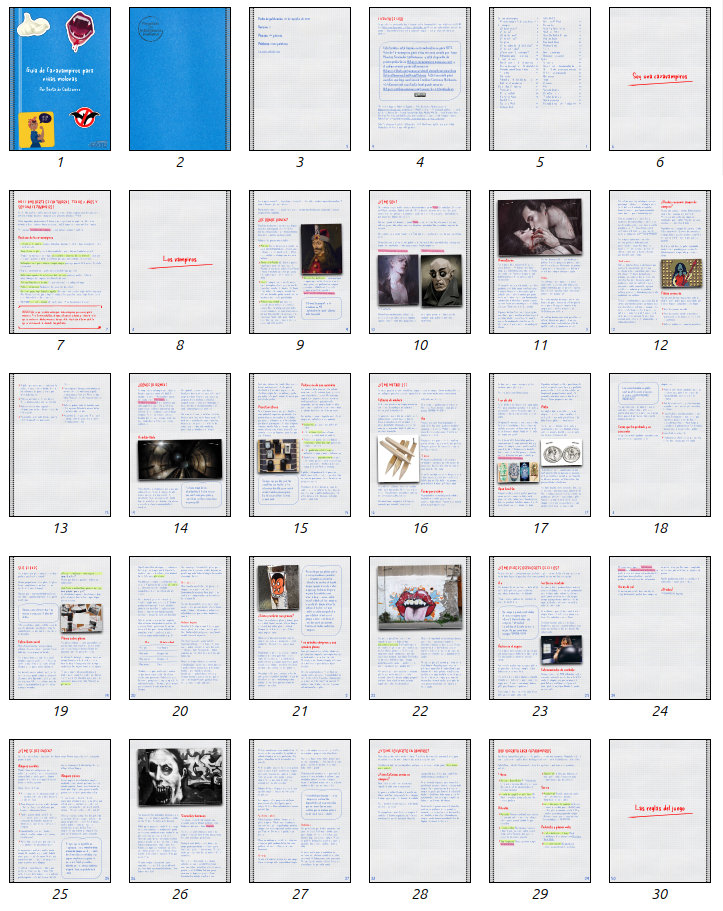
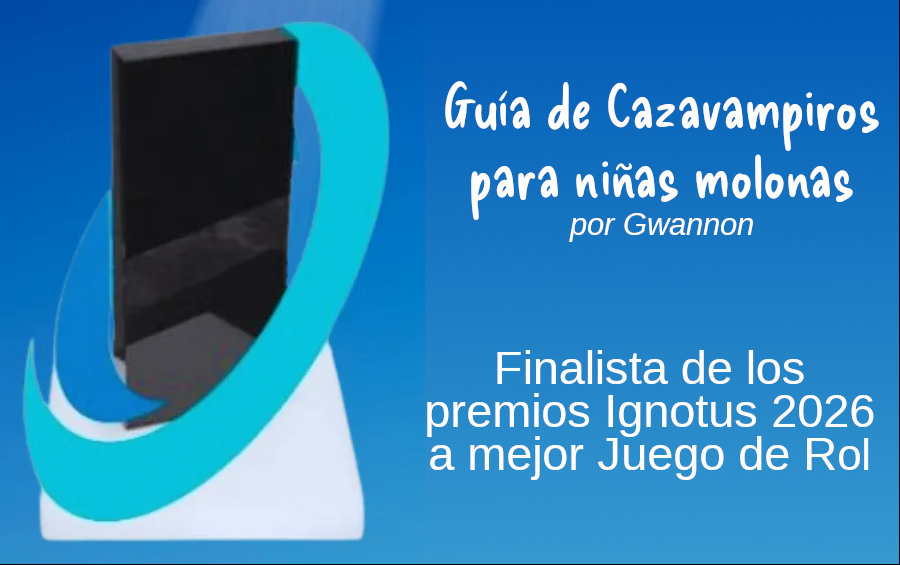

# Dossier de prensa

Este dossier de prensa recoge toda la información que puede necesitar para tu reseña del finalista a mejor juego de rol en los Ignotus 2026, Guia de Cazavampiros para niñas molonas (a partir de ahora GCNM).

## Descripción 

GCNM es una ambientación para FATE Acelerado.

XXX

La ambientación incluye también una campañita que te permite saborear toda la ambientación en su totalidad. Tus cazadoras empezarán investigando la muerte de una de sus profesoras y terminarán salvando a su barrio y derrotando a un poderoso Lord Vampiro, sus siervos vampíricos y humanos y la gran megacorporación que controla.

 XXX
 
 La primera parte contiene ambientación general, donde se explican cómo son los vampiros y sus planes, cómo afectan al barrio y sobre todo como ser una cazavampiros infantil y combatir a los chupasangre.
 
También contiene reglas para la creación de las cazadoras, sus grupos de cazadoras, sus refugios y sus mascotas. Trae ejemplos de armas eficaces contra vampiro como las pistolas de agua cargadas de té de ajo.
 
 XXX

Está maquetado como un cuaderno de anillas escrito a mano con bolígrafo azul y rojo, fluorescente verde y amarillo, fotos grapadas y pegatinas.
 
Está escrito como un manual de combate y supervivencia por una niña llama Berta de Cantaverno (un juego de palabras con Otro van Helsing).
 
Fecha de publicación: 24 de agosto de 2025
 
## Características

* **Formato:** A4 a color
* **Páginas:** 158 páginas
* **Palabras:** 51.208 palabras
* **Fichero:** PDF (14,5 Mb) con índice.

## Conclusiones/críticas que puedes usar en tu reseña.

* **Pero esto es Drácula Dossier con niñas.** Efectivamente es una copia mala y chusca de Drácula Dossier con niñas de barrio, pero es gratis y he tenido la decencia de escribir una campaña para ellos en vez de poner montones de semillas de aventuras y unas reglas para hilarlas.
* **Pero esto es los Goonies contra Drácula.** Pudiera ser, pero he tratado de ser menos racista y gordofobo y no fomentar el bullying. En lo que si se parecen es que ninguna de las dos obras aparecen pulpos gigantes.
* **Pero si ya nadie juega a FATE y mucho menos a FATE Acelerado.** La idea es que como nadie va a jugar a GCNM podré echarle la culpa al sistema y no a qué es un mojón escrito sin talento por tío que se cree autor de rol.
* **Pero si solo puedes jugar con niñas y los niños cazavampiros ¿qué?** Si eso te molesta espera, espera a que leas el primer niñes o el Liege Vampire. Cierra al salir.

## Enlaces

* **Fichero PDF:** [https://cazavampiros.gwannon.com/pdf/](https://cazavampiros.gwannon.com/pdf/)
* **Fichero PDF en blanco y negro, mayor contraste y fuentes más legibles:** [https://cazavampiros.gwannon.com/pdf/?lang=esbw](https://cazavampiros.gwannon.com/pdf/?lang=esbw)
* **Fichero en texto plano para accesibilidad:** [https://cazavampiros.gwannon.com/AccesbilidadGuiaDeCazaVampirosParaNinasMolonas.md](https://cazavampiros.gwannon.com/AccesbilidadGuiaDeCazaVampirosParaNinasMolonas.md)
* **Página web:** [https://cazavampiros.gwannon.com/](https://cazavampiros.gwannon.com/)

## Licencia

GCNM se encuentra bajo la licencia Creative Commons Atribución 4.0 Internacional (CC BY 4.0) (https://creativecommons.org/licenses/by/4.0/deed.es). Puedes usar este contenido en cualquier forma que te permita la licencia incluso comercial, siempre que incluyas un texto atribuyéndome como autor.

Si no lo haces, es que eres **el ser más rastrero del mundo**, peor que Elon Musk. Por favor, que te lo estoy dando gratis y poner una referencia no cuesta nada. Si con ponerlo al final en letra tamaño superpequeña, cumples con la licencia.

## Material gráfico

### Logos

**630x500**

**1186x460**

### Capturas de pantalla

### Banner finalista Ignotus 2026 a mejor juego de rol

## El autor, o sea, yo :) 

Me llamo Jorge Monclús y llevo desde 35 año jugando a rol regularmente y escribiendo mierdas roleras desde hace 5. Me encanta Savage Worlds y FATE y trato de alejarme de D&D todo lo que pueda, aunque con mi mesa es complicado. 

Puedes encontrar más de mis proyectos roleros en [https://gwannon.com/](https://gwannon.com/) y en mis perfiles de [itch.io](https://gwannon.itch.io/) y [rpg-trader.com](https://rpg-trader.com/creator/124/gwannon). 

|HiloCuriosidades.md|