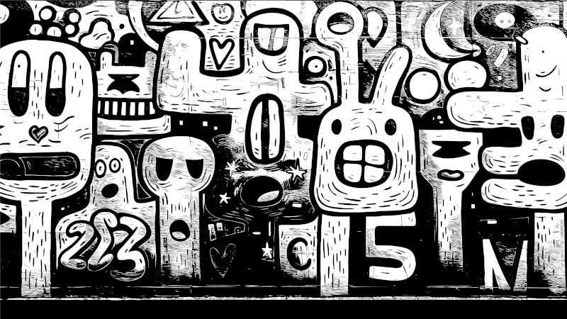
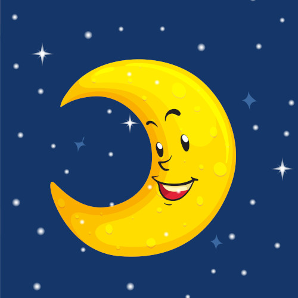
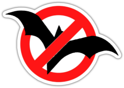
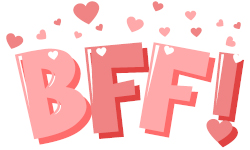

# Soy una cazavampiros

\sinc

## Me llamo Berta de Cantaverno, tengo 12 años y soy una cazavampiros.

En este libro que tienes en tus manos te enseñaré como detectar vampiros, encontrar su guarida y matarlos a tiempo de volver a casa para cenar y hacer tu directo de Twitch.

Si han empezado a pasar cosas en tu barrio como desapariciones sin explicación, ataques de animales extraños, robos en bancos de sangre, … estate segura de que son malditos vampiros.

Y hazme caso, _necesitas este cuaderno_ si quieres salir viva y llegar al instituto.

### Decálogo de la cazavampiros

1. **Acabarás con los vampiros** donde se alimenten y duerman. Caza y mata durante el día, ataca y mata cuando sean más débiles.
2. **Siempre tienen un plan** y si no lo has descubierto es que no has investigado lo suficiente.
3. Si alguien es mordido por un vampiro, **se convertirá en vampiro y deberás eliminarlo**. A veces será duro porque pueden ser amigas o familiares, pero ya no son humanas, solo sanguijuelas.
4. **No tengas un crush por un vampiro, vampira, vampire** por guapo que sea. No te quiere a ti, solo tu sangre fresca.
5. Si puedes ver al vampiro, es que te vio hace mucho tiempo, prepárate.
6. **No te creas ninguna de las explicaciones de los mayores,** son todas mentiras. Están todos manipulados por los vampiros o directamente les sirven.
7. **Te leerás Drácula todos los años**, hay que revisar las bases cada poco tiempo.
8. **No te fíes de las redes.** Pueden ser útiles, pero ellos las controlan.
9. **Organiza y pasa a limpio todos tus apuntes.** Recuerda que se descubrió el plan de Drácula porque Mira Murati organizó y pasó a limpio las notas, cartas y apuntes de sus compis. Además, nadie puede hackearte lo que tengas en papel.
10. ~~Sororidad~~ **Confía en tus amigas**, ellas son tu fuerza. Nunca te separes de tu panda.

```
AVISO: Este juego es sobre niñas que cazan vampiros, pero no es para menores. Tiene temas adultos, drogas, situaciones duras y violencia en la que se verán enredados menores, así que deberías avisar a tu mesa de lo que se va a encontrar durante las partidas.  
```

\conc

***

|LosVampiros.md|

|LasReglasDelJuego.md|

|BuenosDiasSrVampiro.md|

|MientrasTanto.md|

|Lugares.md|

|AmigosYEnemigos.md|

|PersonajesPregenerados.md|

***

# Epílogo

\sinc

## Inspiración

\conc

Como habrás podido ver, este suplemento rolero no es nada original y aventuras de niños y niñas que se enfrentan a monstruos hay muchas y buenas, no solo en el mundo del rol, sino también en libros, películas, series y comics. En cuanto a vampiros y planes tenemos desde los clásicos Tremere con planes dentro de planes de panes hasta famosísimas campañas como Drácula Dossier.

Simplemente, es un divertimento que surgió de un personaje de «Los Greens en la ciudad». Andrómeda, la mejor amiga de Tilly, es una niña friki de las conspiraciones, cree en los hombres lagarto, en los vampiros, etc. Y pensé que si algún día jugaba a la campaña de Drácula Dossier mi PJ sería como Andrómeda. 

A partir de ahí pensé que sería divertido jugar con una niña como Andrómeda y una cosa llevo a otra y aquí tienes esta aventura.

También es un poco MoonGirl de «MoonGirl y Dinosaurio Diabólico» por el rollo de barrio que tiene todo el suplemento y por luchar contra la gentrificación, los machirulos y los políticos corruptos.

\sinc

## Define los velos y herramientas de seguridad

> Antes de iniciar la aventura, todos los miembros de la mesa debéis definir las herramientas de seguridad que queráis utilizar y los temas o escenas que deben evitarse durante la partida para que nadie se sienta incómodo durante la sesión de juego. Podéis escoger los elementos que no queráis incluir durante la partida previamente o podéis utilizar un mecanismo de seguridad cuando estos aparezcan.
> No importa cuál sea la herramienta de seguridad o el tipo de mecanismo utilicéis, pero es importante recordad que el rol es un juego y todos deben pasarlo bien. En caso de que consideréis entre todos que no necesitáis una herramienta de seguridad tampoco pasa nada, pero en ese caso es necesario que el director de juego se asegure de forma más activa de que ningún miembro de la mesa se sienta incómodo o lo esté pasando mal.
> Por [FaustoRolero](https://twitter.com/FaustoRolero)

Aquí tienes algunas otras herramientas de seguridad que puedes usar: [DEVIR](https://devir.es/herramientas-seguridad-rol) y [NetCon](https://www.netconplay.com/guia-de-buenas-practicas/herramientas-en-la-mesa/)

\conc

\sp

\sinc

## Interpretando a personajes menores de edad

En esta aventura vais a jugar con PJ que son niñas cazavampiros, concepto que creo que puede ser muy interesante y divertido, pero hay que ser cuidadoso al tratar ciertos temas que van a aparecer en la trama de la aventura. 

Además de temas como drogas, alcohol y juego + menores, van a aparecer temas más duros como maltrato y abuso infantil. Vuestras cazadoras de vampiros se van a enfrentarse a situaciones muy complicadas como maltrato por parte de policías corruptos, tendrán que enfrentarse a pederastas, peleas a muerte como todo tipo de seres de la más baja estofa donde recibirán daño o incluso podrán morir, torturas para sacarles información, etc.

Todos estos elementos son una fantasía que forma parte de una historia donde el bien ganará al mal. Nunca deben salir de la mesa de juego y deben tratarse con el debido respeto y seriedad. 

Si como director de juego o jugador vas a hacer chistes sobre estas duras situaciones que se plantean, te vas a regodear en ellas o buscas disfrutar de ellas más allá del simple juego de rol, que sepas que era una mierda de persona y que te deseo lo peor. Si ves estos comportamientos en tu mesa y no te repugnan y se lo echas en cara, sino que les sigues el juego, también eres una mierda de persona. Por último, si ves que en tu mesa pasa algo de lo escrito anteriormente, mejor sal corriendo de ahí lo antes que puedas.

### Romanceo y amistad

Por otro lado, el romanceo y relaciones sexuales entre PJ y entre PJ y PNJ debería ser otro tema a tratar de forma sería. Estamos interpretando a menores con todo lo que ello ética, moral y legalmente supone. Está claro que tu PJ puede tener un crush por su actor o actriz favorita, por alguien de su clase, etc. pero no debería ir más allá del simple «el DJ te dé un aspecto divertido cuando tu amor platónico está cerca». 

Creo que en lugar del tema del romance puedes optar por llevar temas de amistad. Un parte importante de la ambientación trabaja el tema de la amistad, de amigas para siempre, BBF y creo que puede ser una idea diferente y alternativa al romanceo y que puede dar mucho juego y diversión.  

## Participar en el proyecto

Si te gusta el proyecto, quieres participar y sabes de Git, puedes hacerlo a través de GitHub en este [proyecto](|GITHUB|). Si no estás familiarizado con Git, pues me mandas un DM en mis redes sociales [@Gwannon](https://linktr.ee/gwannon) y hablamos.

Si juegas la campaña y tienes ideas y posibles mejoras, también puedes enviármelas. Estaré encantado de estudiarlas y poneros como beta-testers en los créditos. 

\conc

\sp

\sinc

## Atribuciones

\conc

* Papel cuadriculado por [kues](https://www.freepik.es/foto-gratis/textura-papel-cuadriculado_932591.htm)
* Canutillo metálico por [upklyak](https://www.freepik.com/free-vector/notebook-spiral-wire-binds_12632847.htm)
* Colmillos de la portada por [vectorpouch](https://www.freepik.com/free-vector/vampire-mouth-with-fangs-set-female-red-lips_6690894.htm)
* Cruz portada por [freepik](https://www.freepik.com/free-vector/flat-ornamental-cross_1631913.htm)
* Nosferatu By [Rachaurux](https://www.deviantart.com/rachaurux/art/Nosferatu-124220759) Creative Commons Attribution-NonCommercial-No Derivatives Works 3.0 License
* Ajo portada por [brgfx](https://www.freepik.com/free-vector/garlic-cartoon-style-isolated_37409150.htm)
* Pegatina portada de «Web can do it» por [freepik](https://www.freepik.es/vector-gratis/composicion-adorable-feminismo_3386686.htm)
* Decálogo de la cazadora de vampiros basado en [esta hilo de rpg.net](https://forum.rpg.net/index.php?threads/rules-of-vampire-hunting.139264/)
* Denarios de plata de la [Wikipedia](https://es.wikipedia.org/wiki/Denario#/media/Archivo:TRAIANUS_RIC_II_291_732081.jpg) Creative Commons Attribution-Share Alike 2.5 Generic 
* [borderize.com](https://borderize.com/)
* Darker Than Tears By [NanFe](https://www.deviantart.com/nanfe/art/Darker-Than-Tears-784728854) Creative Commons Attribution-NonCommercial-No Derivatives Works 3.0 License
* Retrato de Vlad Tepes [Wikipedia](https://es.wikipedia.org/wiki/Vlad_el_Empalador#/media/Archivo:Vlad_Tepes_002.jpg)
* Cuatro modelos de pililla benditera o aguabenditeras de loza popular española [Wikipedia](https://es.wikipedia.org/wiki/Benditera#/media/Archivo:Benditeras_espa%C3%B1olas_(XVIII_al_XX).jpg)
* Pegatina contraportada BFF por [brgfx](https://www.freepik.com/free-vector/bff-best-friend-forever-lettering-white-background_24084900.htm)
* TMNT sewer 1 By [Tonywashingtonart](https://www.deviantart.com/tonywashingtonart/art/TMNT-sewer-1-58169816) Creative Commons Attribution-NonCommercial-No Derivatives Works 3.0 License
* [Pistola agua Xiaomi](https://m.media-amazon.com/images/I/71aOczXzPvL._AC_SX679_.jpg)
* Versatile Red Swiss Army Knife by [brgfx](https://www.freepik.com/free-vector/versatile-red-swiss-army-knife_146612585.htm)
* Foto llama andina [wirestock](https://www.freepik.com/free-photo/beautiful-shot-white-llama-looking-camera-with-blurred-mountains-background_10636706.htm) Creative Commons Attribution-NonCommercial-No Derivatives Works 3.0 License
* Wall mounted combination key safes [by Acabashi](https://commons.wikimedia.org/wiki/File:Key_safe_combination_wall_mounted.jpg) Creative Commons Attribution-ShareAlike 4.0 International
* Vampire Anatomy 1 By [DanielGovar](https://www.freepik.com/free-vector/bff-best-friend-forever-lettering-white-background_24084900.htm) Creative Commons Attribution-NonCommercial-No Derivatives Works 3.0 License
* Young woman boxer training at the gym por [senivpetro](https://www.freepik.com/free-photo/young-woman-boxer-training-gym_6255935.htm)
* vamp it up By [NanFe](https://www.deviantart.com/nanfe/art/vamp-it-up-819073694) Creative Commons Attribution-NonCommercial-No Derivatives Works 3.0 License
* Painting sketch By [ArthurHenri](https://www.deviantart.com/arthurhenri/art/Painting-sketch-775087428) Creative Commons Attribution-NonCommercial-ShareAlike 3.0 License
* Textura de graffiti de pared en blanco y negro por [vector_corp](https://www.freepik.es/vector-gratis/textura-graffiti-pared-blanco-negro_370750953.htm)
* Iconos de día y noche por [brgfx](https://www.freepik.com/free-vector/set-sun-moon_2958644.htm)
* Wide shot of a modern and busy city with dark clouds and orange sky by [wisetock](https://www.freepik.com/free-photo/wide-shot-modern-busy-city-with-dark-clouds-orange-sky_9852971.htm)
* Blue texture by [tirachard](https://www.freepik.com/free-photo/blue-texture_997261.htm)
* Wetlands with marsh vegetation in Mammoth route in Padul, Granada, Andalusia, Spain by [javi_indy](https://www.freepik.com/free-photo/wetlands-with-marsh-vegetation-mammoth-route-padul-granada-andalusia-spain_2788654.htm)
* Stove with fire at blacksmith workshop. There are different tools around by [fxquadro](https://www.freepik.com/free-photo/stove-with-fire-blacksmith-workshop-there-are-different-tools-around_26614049.htm)
* Vampire Street Art Sticker by [Worley Gig](https://worleygig.com/2013/10/01/vampire-street-art-sticker/)
* Vampire lips by [Eric B.](https://www.flickr.com/photos/silverfuture/7533629452/) Creative Commons Attribution-NonCommercial-ShareAlike 2.0 Generic License
* Vampire graffiti in a very remote setting by [Michael Gabelmann](https://www.flickr.com/photos/mgabelmann/27199658215) Creative Commons Attribution-NonCommercial 2.0 Generic License

\sp

* graffiti, Santiago by [duncan cumming](https://www.flickr.com/photos/duncan/49539509723) Creative Commons Attribution-NonCommercial 2.0 Generic License
* Mural en honor a Marie Curie en la facultad de ciencias por [Víctor Gómez](https://www.flickr.com/photos/machbel/11345048516)
Creative Commons Attribution-NonCommercial-NoDerivs 2.0 Generic License
* Wesker By [MonkeyMu](https://www.deviantart.com/monkeymu/art/Wesker-300376367) Creative Commons Attribution-NonCommercial-ShareAlike 3.0 License
* Dorcha By [sokoistrying](https://www.deviantart.com/sokoistrying/art/Dorcha-1002628311) Creative Commons Attribution-NonCommercial-No Derivatives Works 3.0 License
*Che In Dublin Docklands - Street Art And Graffiti por [William Murphy](https://www.flickr.com/photos/infomatique/4673901682) Creative Commons Attribution-ShareAlike 2.0 Generic License
* [Raymond Spekking](https://commons.wikimedia.org/wiki/File:Wandgem%C3%A4lde_Heliosstra%C3%9Fe_37,_K%C3%B6ln-Ehrenfeld-1873.jpg) Creative Commons Attribution-Share Alike 4.0 International license
* Feria del Barrio del Pilar 2017 por [Gordon Dionne](https://www.flickr.com/photos/myprofe/37918844252/) Creative Commons Attribution-NonCommercial-ShareAlike 2.0 Generic license
* Blood By [Mephisto123456789](https://www.deviantart.com/mephisto123456789/art/Blood-880245401) Creative Commons Attribution-NonCommercial-No Derivatives Works 3.0 License
* Vampire —edited— By [Valentinepsycho](https://www.deviantart.com/valentinepsycho/art/Vampire-edited-80281908) Creative Commons Attribution-ShareAlike 3.0 License
* GRAFFITI - DENVER, COLORADO 08 por [Trip & Queball with PUNKassPHOTOS](https://www.flickr.com/photos/punkassphotos/3351954588/) Creative Commons Attribution-NonCommercial-NoDerivs 2.0 Generic License
* Cinderella running by [Elizabeth](https://www.flickr.com/photos/37217398@N02/3737850192) Creative Commons Attribution-NonCommercial 2.0 Generic License

\sp

\sinc

## Jerga

[](https://www.freepik.es/vector-gratis/textura-graffiti-pared-blanco-negro_370750953.htm "Textura de graffiti de pared en blanco y negro por vector_corp")

&nbsp;

\conc

Aquí tienes un listado de jerga más común.

* **Beef:** Tirar beef hace referencia un enfrentamiento o discusión en público.
* **Bro:** De brother (hermano). Es el nuevo “tío”.
* **Buenro:** Abreviatura de buen rollo.
* **Bugeado (Bugueado):** Que falla o tiene errores. Se usa con tecnología. 
* **Calle (Tener o no tener):** Tiene mucha experiencia.
* **Chetao (Chetadísimo):** Que hace trampas o que es tan superior al resto que parece que hace trampas.
* **Cool:** Es el nuevo mola. 
* **Crack:** Alguien muy torpe y matado en algo.
* **Crush:** Se refiere tanto a un amor platónico como a la persona que te gusta.
* **Cringe:** Algo te genera vergüenza ajena o bochorno.
* **Cute:** Mono en referencia a bonito, achuchable, … También puede usarse la versión japonesa kawai.
* **De chill:** Ha sustituido al “de tranqui”.
* **Dejar en leído:** No responderte a los mensajes.
* **Evento canónico (Es canon):** Significa que es un momento de tu vida que no puedes cambiar y que te define para siempre.
* **Exposear:** Alguien exposeado es alguien expuesto, que le han pillado en una situación comprometida.
* **Fachero:** Algo fachero es algo que es chulo o bonito.
* **Funar:** Cancelar por tus opiniones.

\sp

* **Goat (Greatest Of All Time):** El mejor de todos los tiempos.
* **Hater:** De hate, odio en inglés. Persona que odian lo que haces muchas veces por envidia, sobre todo en RRSS.
* **Hostear:** Ser el anfitrión de un evento.
* **Hype:** Expectativas desproporcionadas ante la salida de una película, serie, disco, etc.
* **Lache:** Véase Cringe.
* **Literal:** Forma de decir que estás de acuerdo con algo tipo Ok.
* **Malro:** Abreviatura de mal rollo.
* **Mierder:** Persona indeseable.
* **Mood:** Estado anímico o humor que tienes. Es normal poner un meme + My mood para mostrar tu estado anímico actual.
* **Mucho texto:** Te están llamando pesado y debes callarte. 
* **NPC (Non Playable Character):** Gente que no aporta nada.
* **PEC (Por el culo):** Algo que te gusta muchísimo.
* **POV (Point of view):** Para marcar algo como que es personal, como tú lo ves o como a ti te afecta.
* **Pro:** De profesional. Alguien que es bueno en algo.
* **Random:** Algo es al azar.
* **Rentar:** Si algo te renta o no te renta quiere para decir que algo te compensa o no.
* **Sapo:** Chivato, soplón.
* **Servir coño:** Cuando alguien que ha hecho algo muy bien.
* **Shippeo:** Imaginar y querer que dos personas mantengan una relación amorosa.
* **Siete veinticuatro:** Todo el rato. 24 horas al día, 7 días a la semana.
* **Stalkear:** Revisar de forma obsesiva y oculta los perfiles en redes de otra persona.
* **Traer té:** Tener algo interesante que contar.
* **Tryhardear:** No rendirse.
* **Ubícate:** Si alguien te lo dice, quiere decir que te pongas al día de algo que está pasando ahora mismo.

\sp

## Notas

\sinc

|&nbsp;|
|------|
|&nbsp;|
|&nbsp;|
|&nbsp;|
|&nbsp;|
|&nbsp;|
|&nbsp;|
|&nbsp;|
|&nbsp;|
|&nbsp;|
|&nbsp;|
|&nbsp;|
|&nbsp;|
|&nbsp;|
|&nbsp;|
|&nbsp;|
|&nbsp;|
|&nbsp;|
|&nbsp;|
|&nbsp;|
|&nbsp;|
|&nbsp;|

\conc

\sp

## Esquema del plan

\sinc

|&nbsp;|
|------|
|&nbsp;|
|&nbsp;|
|&nbsp;|
|&nbsp;|
|&nbsp;|
|&nbsp;|
|&nbsp;|
|&nbsp;|
|&nbsp;|
|&nbsp;|
|&nbsp;|
|&nbsp;|
|&nbsp;|
|&nbsp;|
|&nbsp;|
|&nbsp;|
|&nbsp;|
|&nbsp;|
|&nbsp;|
|&nbsp;|
|&nbsp;|

\conc

\sp

## Dramatis personae

\sinc

|Nombre|Descripción|&nbsp;|
|------|-----------|------|
|&nbsp;|&nbsp;|&nbsp;|
|&nbsp;|&nbsp;|&nbsp;|
|&nbsp;|&nbsp;|&nbsp;|
|&nbsp;|&nbsp;|&nbsp;|
|&nbsp;|&nbsp;|&nbsp;|
|&nbsp;|&nbsp;|&nbsp;|
|&nbsp;|&nbsp;|&nbsp;|
|&nbsp;|&nbsp;|&nbsp;|
|&nbsp;|&nbsp;|&nbsp;|
|&nbsp;|&nbsp;|&nbsp;|
|&nbsp;|&nbsp;|&nbsp;|
|&nbsp;|&nbsp;|&nbsp;|
|&nbsp;|&nbsp;|&nbsp;|
|&nbsp;|&nbsp;|&nbsp;|
|&nbsp;|&nbsp;|&nbsp;|
|&nbsp;|&nbsp;|&nbsp;|
|&nbsp;|&nbsp;|&nbsp;|
|&nbsp;|&nbsp;|&nbsp;|
|&nbsp;|&nbsp;|&nbsp;|
|&nbsp;|&nbsp;|&nbsp;|
|&nbsp;|&nbsp;|&nbsp;|

\conc

\sp

\sinc

## Tarjetas de día y noche

&nbsp;

\conc

### Día

[](https://www.freepik.com/free-vector/set-sun-moon_2958644.htm "Token Día")

&nbsp;

### Anochecer

[](https://www.freepik.com/free-vector/set-sun-moon_2958644.htm "Token Día")

&nbsp;

### Noche

[](https://www.freepik.com/free-vector/set-sun-moon_2958644.htm "Token Día")

&nbsp;

### Amanecer

[](https://www.freepik.com/free-vector/set-sun-moon_2958644.htm "Token Día")

&nbsp;

\sp

\sinc

## Hoja de personaje

|hojapersonaje.html|

\conc

\sp

\sinc

## Otros proyectos que te pueden interesar

Si os ha gustado esta campaña podéis probar otros de mis proyectos para Fate. Animaros y dadles un poco de cariño.

&nbsp;

[](https://gwannon.itch.io/doctor-jekyll-y-mister-hyde-investigadores-privados "Doctor Jekyll y Mister Hyde: Investigadores privados")

&nbsp;

[**Doctor Jekyll y Mister Hyde: Investigadores privados**](https://gwannon.itch.io/doctor-jekyll-y-mister-hyde-investigadores-privados) es un suplemento para Fate Acelerado para un director de juego y dos jugadores, pero con solo un jugador en mesa al mismo tiempo. Tras solventar sus diferencias y problemas, el Doctor Jekyll y Mister Hyde han montado una agencia de investigación y se dedican a resolver crímenes en un Londres victoriano.

\conc

***

\conc

&nbsp;

***

Guía de Cazavampiros para niñas molonas __por Berta de Cantaverno__

Soy Beta de Cantaverno y he escrito este libro. Tienes en tus manos la guía definitiva para convertirte en una cazadora de vampiros. Te cuento todo lo que sé sobre los vampiros y sus planes y cómo acabar con ellos y desmantelar sus planes. También te explicaré los mejores trucos del oficio que no podrás encontrar en YouTube ni en Twitch. Para jugar esta ambientación solo necesitas el Reglamento de Fate Acelerado. Este libro contiene:

1. Un montón de información sobre los vampiros y cómo matarlos. Sus puntos fuertes, sus debilidades y cómo aprovecharlas, sus rutinas y en general como funciona todo su oscuro mundo.
2. Reglas para montar tu grupo de cazadoras de vampiros como enfrentarte a los grandes planos vampíricos que estén desarrollándose en tu barrio.
3. «Buenos días, señor vampiro», una campaña en la que descubrirás la existencia de vampiros, aprenderás a combatirlos y evitarás que ejecuten sus malvados planes en tu barrio. 

_AVISO:_ Este juego es sobre niñas que cazan vampiros, pero _no es para niños_. Tiene temas adultos, situaciones escabrosas y violencia en la que se verán enredados menores, así que deberías avisar a tu mesa de lo que se va a encontrar durante las partidas.

Creado por [Gwannon](https://linktr.ee/gwannon)


