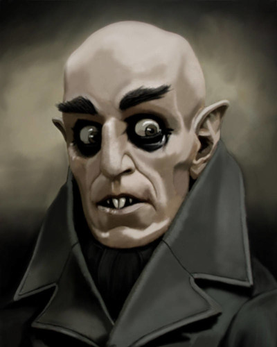
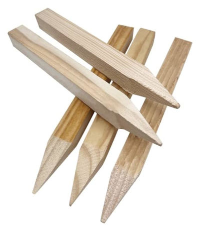

# Introducción

\sinc

## Me llamo Berta de Cantaverno, tengo 12 años y soy una cazavampiros.

En este libro que tienes en tus manos te enseñaré como detectar vampiros, encontrar su guarida y matarlos a tiempo de volver a casa para cenar y hacer tu directo de Twitch.

Si han empezado a pasar cosas en tu barrio como desapariciones sin explicación, ataques de animales extraños, robos en bancos de sangre, ... estate segura de que son malditos vampiros.

Y hazme caso, _necesitas este cuaderno_ si quieres salir viva y llegar al instituto.

&nbsp;

### Decálogo de la cazavampiros

1. **Acabarás con los vampiros** donde cazen y duerman. Caza y mata durante el día, ataca y mata cuando seán más débiles.
2. **Siempre tienen un plan** y si no lo has descubierto es que no has investigado lo suficiente.
3. Si alguien es mordido por un vampiro, **se convertira en vampiro y deberás aliminarlo**. A veces será duro porque pueden ser amigas o familiares, pero ya no son humanas, solo sanguijuelas.
4. **No te enamores de un vampiro, vampira, vampire** por guapo que sea. No te quiere a ti, solo tu sangre fresca.
5. Si puedes ver al vampiro, es que te vio hace mucho tiempo, prepárate.
6. **No te creas ninguna de las explicaciones de los mayores,** son todas mentiras. Están todos manipulados por los vampiros o directamente les sirven.
7. **Te leerás Drácula todos los años**, hay que revisar las bases cada poco tiempo.
8. **No te fies de las redes.** Pueden ser útiles, pero ellos las controlan.
9. **Organiza y pasa a limpio todos tus apuntes.** Recuerda que se descubrió el plan de Drácula porque Mina Murray organizó y pasó a limpio las notas, cartas y apuntes de sus compis. Además nadie puede hackearte lo que tengas en papel.
10. ~~Sororidad~~ **Confía en tus amigas**, ellas son tu fuerza. Nunca te separes de tu panda.

\conc

***

# Los vampiros

\sinc

Los vampiros, nosferatus, chupasangres, sanguijuelas, ... han estado desde siempre entre nosotros. Y siempre tienen un plan de dominación.

xxx

## ¿De dónde vienen?

\conc

Pues tras muchos meses de estudio no he podido encontrar una respuesta clara. Hay tantas teorías como podcasts de fenómenos extraños y hacedme caso que hay muchos podcasts.

Estás son las que veo más probables:

* **Maldición:** hay varias opciónes en cuanto a su epoca, ~~mesopotopomica~~ mesopotámica, egipcía o etrusca y casi siempre tiene toque bíblicos, donde castiga con el vampirismo a un malo malisimo.
* **Aliens:** los vampiros no son de este mundo, vienen del espacio exterior y por eso son tan diferentes a nosotros los humanos. La teoría de los astronuatas vampiros ancestrales está muy de moda y pueden escuchar más en muchos de los podcasts que lo tratan.
* **Mutación/enfermedad:** puede que sean producto de una mutación o enfermedad como en Blade.

Si tienes tu propia teoría mandame un MD explicandomela, igual estamos ante la verdad.

\sc

\sp

\sinc

## ¿Cómo son?

\conc

[](https://www.deviantart.com/rachaurux/art/Nosferatu-124220759 "Nosferatu By Rachaurux")

xxx

### Alimentación

xxx

\sc

\sp

\sinc

## ¿Dónde duermen?

\conc

xxx

\sc

\sp

\sinc

## ¿Cómo matarlos?

xxx

\conc

### Estacas de madera

xxx

Os recuerdo que puedes comprar estacas en Amazon y estarán mañana en casa, pero si puedes, COMPRA EN LOCAL :)

[](https://www.amazon.es/encuestas-pulgadas-construcci%C3%B3n-topograf%C3%ADa-utilidades/dp/B0C6K6YVZ5 "Estacas de Amazon")

xxx

### Ajo

xxx

El ajo picado o en polvo son igual de efectivos que las cabezas de ajo y es mucho más práctico.

#### Te de ajo

Mi mayor descubrimiento en mi carrera de cazavampiros. xxx

### Plata

xxx

> Las cosas bañadas en plata son tan útiles como si fueran de plata y ¡¡¡¡¡MUCHO MÁS BARATAS!!!!!

###  Fuego purificador

xxx

### Luz del día

xxx

La linternas UV (ultravioletas) que todos conocemos como luz negra funcionan de lujo. Puedes quedar de rarita llevando una en la mochila, pero ademas puedes usarlas para detectar fluidos.

### Agua bendita

xxx

El problema del agua bendita es que el sacerdote que la bendija debe creer y tener fe y por tanto puede pasarte que la lances al nosferatu y no tenga efecto porque el cura es un falso.

\sp

### Cosas que he probado y no funcionan

La experiencia me ha ayudado a descubrir cosas que funcionan y no funcionan con los chupasangres. 

* No te fies de tu abuela cuando te diga que su cubertería es de plata, la mayoria son de alpaca plateada y no sirven contra los vampiros.
* Solo las cruces funcionan y solo si eres muy creyente, que no es mi caso, ya que ni estoy bautizada.
* Los petardos no son más efectivos que en un humano. Si consigues uno gordo, puede que algo le haga, pero no es mortal. Aprovecha las fiestas para hacer acopio y recuerda que la polvora caduca. Los hermanos mayores son una buena fuente de petardos.
* Los extintores ni los notan.
* Los tasers solo churruscan un poco su piel y huele a bacón chungo, pero ni lo notan. 
* xxx

\sc

\sp

\sinc

## ¿Cómo frustrar sus planes?

\conc

xxx

\sc

\sp

\sinc

## ¿Cómo se defienden?

\conc

xxx

\sc

\sp

\sinc

## ¿Cómo puedes defenderte de ellos?

xxx

\conc

### Ajo

xxx

> No compres grandes cantidades de ajos en súpers o por internet. Vigilan todas esas compras. La tienda de encurtidos de tu calle es mucho mejor. Así que como digo siempre COMPRA LOCAL.

### Reflejo en el espejo

Los vampiros no se reflejan en los espejos, pero solo en los viejos que debian tener algo de plata. Los modernos tiene aluminio y en esos se reflejan. Una visita a la casa de tus abuelos en el pueblo, al rastro o una antiquaria y puedes conseguir un espejo eficaz. Yo uso uno con mango y baño de plata por si tengo que golpear con él.

xxx

### Invitación a entrar

Las sanguijuelas no pueden entrar en una casa si no son invitados así que mi regla fundamental es no invitar a nadie a entrar. El problema es que tu familia no lo tiene en cuenta, así que siempre soy la primera en abrir la puerta de casa. Así el tonto de mi hermano no invita a entrar a quien no debe.

xxx

### Entrenamiento de combate

xxx

> Mi consejo es que aprendas _autodefensa personal_ con el _grupo feminista de tu barrio_. Lo que te enseñen esas reinas será mucho más util para alguien de nuestro tamaño que lo te puedan enseñar los kunfu-bros del gimnasio. 

### ¿Puedes consumir sangre de vampiro?

Puedes, otra cosa es que debas. Beber sangre de vampiro te dan superpoderes a lo Capitana Marvel, eres más fuerte, más rápida, más resistente y puedes flotar, pero te deja baldado cuando se termina el efecto.

xxx

### ¿Aliados?

TUS AMIGAS. No hay más.

\sp

\sinc

## Sirvientes humanos

\conc

Los siervos, ghouls, thralls, renfields son xxx

xxx

\sc

\sp

\sinc

## Bibliografía para cazavampiros

\conc

Aquí tienes algunos libros, pelis y podcasts que te pueden dar más información.

* **Drácula de Bran Stoker.** PEC El libro texto básico que es recomendable releer cada poco. Recuerda el 7° mandamiento de la cazavampira molona.
* **Carmilla de Joseph Sheridan Le Fanu.** PEC Dificil de encontrar y muy corto, necesito una segunda parte ya.
* **Nosferatu.** Puedes encontrarte dos versiones, una con mala calidad y sin sonido y otra que si tiene sonido y mucha calidad. La que encuentres.
* **Jóvenes ocultos.** Película muy viejuner que pillas a la noche en canales cutres, pero le chifla a mí tio. Fiel reflejo de lo que pasa cuando los mayores no nos creen.
* **Saga Crepúsculo.** Pura propaganda vampira. _NO VER NUNCA_
* **Monster High.** Perfectas para verla con tus amigas y tantear lo que piensan de Vampilaura y los de su calaña.
* **Lo que hacemos en las sombras.** La tendras que ver a escondidas, porque "trata temas adultos y hay referencias sexuales". Muy divertida, pero más propraganda vampira. Quieren que creas que son unos imbeciles trasnochados, pero ES MENTIRA. 

xxx

\sc

***

# Reglas del juego

xxx

\sinc

## Defínete como cazadora de vampiros

\conc

xxx

### Aspectos extras

A parte de los aspectos normales de FAE, tienes una serie de aspectos extras.

* Soy pequeña
* xxx

### No puede faltar una mascota

La pandilla tiene que tener una mascota. No tiene por qué ser siempre un perro o un gato, puede ser un atolondrado y torpe hurón, un viejo y ruidoso canario, un ave rapaz que vive en el barrio al que curaron una ala rota, etc. 

En general, la mascota debes darles un aspecto que puedan usar como poder montarlo, mandar mensajes, tener un vigilante que avisa del peligro, etc. Pero también debe darles un aspecto negativo que se use contra ellos y que les de puntos de destino, como que hace mucho ruido, siempre rompe cosas, etc.

### Ganarse la vida en el barrio

Un elemento definitorio de tu  joven cazavampiros es como se busca la vida en el barrio, no solo va a marcar su forma de vida, sino también su ética y su relación con la ley. Alguno de sus aspectos podría estar relacionado con su forma de ganarse la vida.

**Pides la paga:** Pides a tus padres la paga todas las semanas. Es menos dinero que el resto de formas, pero es dinero muy fácil.

**Robando:** Entras en los supermercados y robas cosas que luego revendes a tu panda o a adultos.

**Mendigando:** Mendigas por las calles apelando a la buena fe y caridad de sus gentes. Puede que tengas una discapacidad o solo lo finjas, pero desde luego has aprendido a fingir pena para aflojar la pasta de los viandantes.

**Haciendo recados:** Te dedicas a hacer recados por una propina. Cargas con paquetes, llevas mensajes, etc. siempre corriendo arriba y abajo de las calles y callejuelas.

**Artista callejero:** Te dedicas a hacer malabarismos, a cantar, a bailar, a recitar poesía, etc. por unas monedas.

**Cuidando animales:** Te dedicas a vigilar y cuidar de mascotas por una pequeña propina.

**Buscando en la basura:** Vives de lo que encuentras en la basura y los vertederos. Las cosas buenas las vendes y las útiles te las quedas.

Si la forma de ganarse la vida de alguien de tu mesa no se ajusta a ninguna de estas opciones, podéis mirar otras opciones, pero no deberías aceptar profesiones que vayan en contra de derechos de la infancia como prostitución infantil.

\sp

\sinc

## Regalos de cumpleaños y Navidad útiles para matar vampiros

\conc

xxx

> Si compras online usa siempre puntos de recogida, mejor si son esos armarios metálicos en los  que metes códigos larguísimos. Será más difícil rastrear un pedido extraño hasta tu casa.

### Pistolas de agua

Tú pistola de agua cargada de te de ajo es tu arma más poderosa contra las sanguijuelas.

xxx

### Walkie-talkie

Esta tecnología retro, como dice mi tío, es la leche. xxx

### Navaja suiza

xxx

Un par de escapadas al monte con el grupo de montaña del barrio y puedes conseguir que te compren una navaja suiza. También sirve de excusa para conseguir cuerdas, ganchos y mosquetones, ... en general material de montaña.

### Protecciones deportivas

Empieza a practicar un deporte de contacto y tendrás la excusa necesaría para que te compren o regalen protecciones, cascos, muñequeras, coderas, rodilleras, ... 

xxx 

### Sudaderas con choto

xxx

### Muñequeras y chokers de pinchos

xxx

Si tu look es un poco alternativo, podras llevar estos complementos sin dar mucho el cante.

\sp

\sinc

## El mundo cuando tienes 12 años

\conc

```
Aquí van una serie de consejos a la hora de jugar partidas con personajes menores de 12 años. Pero recuerda, son consejos, eres muy libre de llevarlo como tú quieras.
```

Tu mundo es diferente al de los adultos y por eso tienes que tener algunos conceptos muy claros.

### Los adultos son tontos

Esta premisa es básica. Las personas adultas no son tontas por sí mismas, son tontas porque nunca harán caso a un niño. Las ideas de las chicas son solo fantasías de sus cerebros sobreexcitados y no perderán un segundo en corroborarlas.

Es importante que tengas muy claro que por ese lado no tendrás la más mínima ayuda. Esto hará que si al final aparece un adulto para ayudarte sea más impactante.

Puede haber adultos que te hagan caso, pero son tan extraños y raros que el resto de adultos les tratan igual que a ti.

### Es un mundo para adultos

Para bien o para mal es un mundo de adultos, todo está pensado para esos gigantes que no escuchan.

La ropa, las armas, las herramientas son tamaño adulto. No puedes hacerte pasar por un adulto poniéndote su ropa, tendrás que subirte una encima de otra o usar zapatos altos o zancos.

Por otro lado, es más fácil librarte de grilletes o reptar por las alcantarillas cuando mides y pesas mucho menos.

### Nunca eres una amenaza

Los adultos nunca te consideran una amenaza, así que hay que aprovecharse de ello. Puedes fingir llorar para que tu captor baje la guardia y cuando se gire golpearle con algo contundente.

Solo un gran número de niñas armadas y con intenciones agresivas podría ser considerado una amenaza.

### Nadie se fija en ti

Puedes entrar en sitios en los que los adultos no pueden o no se atreven, principalmente porque no eres una amenaza. Solo necesitas una buena excusa.

Vete a cualquier bar de tu barrio por chungo que sea vendiendo boletos de una rifa y podrás moverte por el bar aunque lo tengas prohibido y escuchar todas las conversaciones adultas del local.

Si intentas pedir una cerveza se reirán de ti y te echarán a la calle y quizás llamen a tus padres.

\sp

\sinc

## Las sistars

\conc

xxx

### Las reglas de la panda

xxx

1. BBF. Mejores amigas para siempre.
2. Nadie se queda atrás, salimos todas o no salimos ninguna.
3. Ni una más.

***

# Buenas días, Sr. Vampiro

\sinc

Está es mi historia, de como me convertí en cazavampiros y libre a mí barrio de su amenaza. Tú historia podría ser igual o ser totalmente diferente.

## Resumen [Aviso Spoiler]

\conc

xxx

\sinc

## Hasta luego, Maricarmen

> Tú profesora de Ciencias Sociales, Maricarmen, ha muerto y tú madre se ha empeñado en ir a la funeraria. Gente que no conoces llorando, gente que no conoces hablando y riendo y un tipo que no conzco con pinta de pervertido. Solo mira a los presnete, saca fotos a escondidas y teclea cosas en el móvil, todo muy sospechoso. 

\conc

xxx

***

# Epílogo

\sinc

## Define los velos y herramientas de seguridad

> Antes de iniciar la aventura, todos los miembros de la mesa debéis definir las herramientas de seguridad que queráis utilizar y los temas o escenas que deben evitarse durante la partida para que nadie se sienta incómodo durante la sesión de juego. Podéis escoger los elementos que no queráis incluir durante la partida previamente o podéis utilizar un mecanismo de seguridad cuando estos aparezcan.
> No importa cuál sea la herramienta de seguridad o el tipo de mecanismo utilicéis, pero es importante recordad que el rol es un juego y todos deben pasarlo bien. En caso de que consideréis entre todos que no necesitáis una herramienta de seguridad tampoco pasa nada, pero en ese caso es necesario que el director de juego se asegure de forma más activa de que ningún miembro de la mesa se sienta incómodo o lo esté pasando mal.
> Por [FaustoRolero](https://twitter.com/FaustoRolero)

Aquí tienes algunas otras herramientas de seguridad que puedes usar: [DEVIR](https://devir.es/herramientas-seguridad-rol) y [NetCon](https://www.netconplay.com/guia-de-buenas-practicas/herramientas-en-la-mesa/)

\conc

## Participar en el proyecto

Si te gusta el proyecto, quieres participar y sabes de Git, puedes hacerlo a través de GitHub en este [proyecto](|GITHUB|). Si no estás familiarizado con Git, pues me mandas un DM en mis redes sociales [@Gwannon](https://linktr.ee/gwannon) y hablamos.

## Atribuciones

* Papel cuadriculado por [kues](https://www.freepik.es/foto-gratis/textura-papel-cuadriculado_932591.htm)
* Canutillo metálico por [upklyak](https://www.freepik.com/free-vector/notebook-spiral-wire-binds_12632847.htm)
* Colmillos portada por [vectorpouch](https://www.freepik.com/free-vector/vampire-mouth-with-fangs-set-female-red-lips_6690894.htm)
* Cruz portada por [freepik](https://www.freepik.com/free-vector/flat-ornamental-cross_1631913.htm)
* Nosferatu By [Rachaurux](https://www.deviantart.com/rachaurux/art/Nosferatu-124220759) Creative Commons Attribution-NonCommercial-No Derivatives Works 3.0 License
* Ajo portada por [brgfx](https://www.freepik.com/free-vector/garlic-cartoon-style-isolated_37409150.htm)
* Pegatina portada de Web can do it por [freepik](https://www.freepik.es/vector-gratis/composicion-adorable-feminismo_3386686.htm)
* Decálogo de la cazadora de vampiros basado en [esta hilo de rpg.net](https://forum.rpg.net/index.php?threads/rules-of-vampire-hunting.139264/)
* [borderize.com](https://borderize.com/)

\sp

## Notas

\sp

## Esquema del plan

\sp

## Dramatis personae

\sp

\sinc

## Hoja de personaje

\sinc

|HOJAPERSONAJE|

\conc

\sp

\sinc

## Otros proyectos que te pueden interesar

Si os ha gustado esta campaña podéis probar otros de mis proyectos para Savage Worlds. Animaros y dadles un poco de cariño.

&nbsp;

[](https://mundoperdido.gwannon.com/pdf/ "Una campaña donde lucharás contra nazis a lomos de dinosaurios.")

[**OPERACIÓN: Tras el mundo perdido** - Una campaña donde lucharás contra nazis a lomos de dinosaurios.](https://mundoperdido.gwannon.com/pdf/)

&nbsp;

[](https://arrrcthulhu.com/pdf/ "Aventuras de piratas en el Caribe de los Mitos de Cthulhu")

[**¡Arrr! Cthulhu:** Aventuras de piratas en el Caribe de los Mitos de Cthulhu](https://arrrcthulhu.com/pdf/)

\conc

\sp

\sinc

[](https://1001ghules.gwannon.com/pdf/ "Aventuras de horror cósmico en los cuentos de las Mil y Una Noches")

[**Mil y Un Ghūles:** Aventuras de horror cósmico en los cuentos de las Mil y Una Noches](https://1001ghules.gwannon.com/pdf/)

\conc

\sp

&nbsp;

***

&nbsp;

***

Guía de Cazavampiros para niñas molonas __por Beta de Cantaverno__

Soy Beta de Cantaverno y he escrito este libro. Tienes en tus manos la guía definitiva para convertirte en una cazadora de vampiros. Te cuento todo lo que sé sobre los vampiros y sus planes y cómo acabar con ellos y desmantelar sus planes. También te explicaré los mejores trucos del oficio que no podrás encontrar en Youtube ni en Twitch.

Este libro contiene:

1. Un montón de información sobre los vampiros y cómo matarlos. Sus puntos fuertes, sus debilidades y cómo aprovecharlas, sus rutinas y en general como funciona todo su oscuro mundo.
2. Reglas para montar tu grupo de cazadoras de vampiros.
3. "Buenos días, señor vampiro", una campaña en la que descubrirás la existencia de vampiros, aprenderás a combatirlos y evitarás que ejecuten sus malvados planes en tu barrio. 

Para jugar esta ambientación solo necesitas el Reglamento de FATE Acelerado.

Creado por [Gwannon](https://linktr.ee/gwannon)