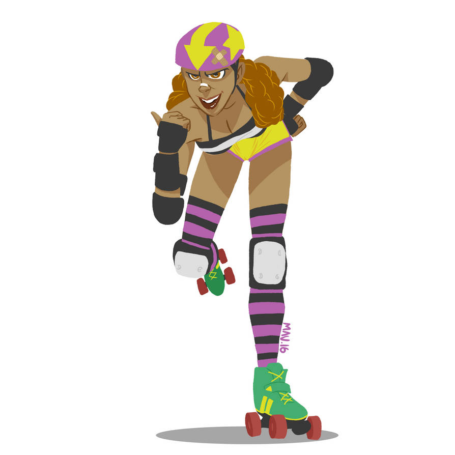
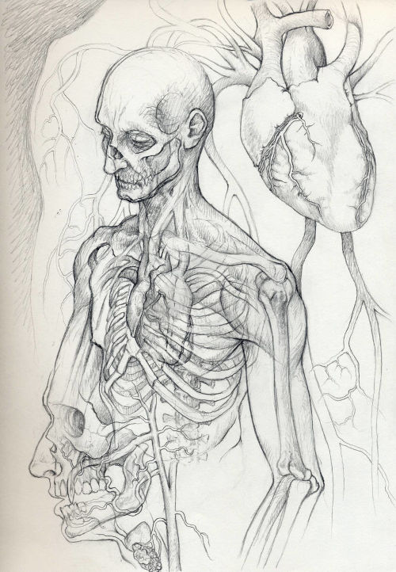
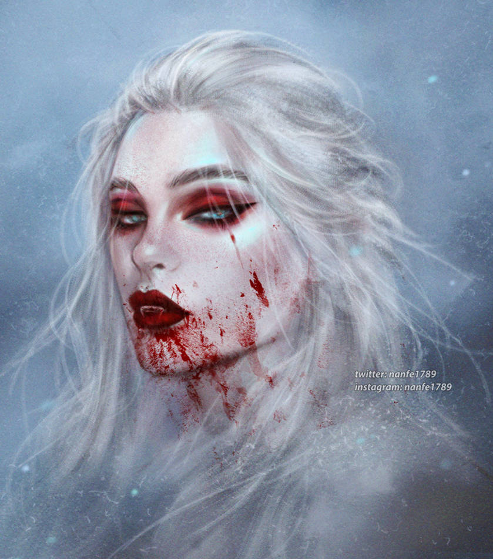

# Las reglas del juego

\sinc

## Defínete como cazadora de vampiros

Saber cuáles son tus puntos fuertes y débiles como cazadora de vampiros te ayuda a saber qué puedes hacer y qué no y a que puedes enfrentarte y a que no.

\conc

### Estilos

Salvo contadas excepciones, como Sara de mi clase, con 12 años no eres muy fuertes con lo que no deberíamos tener un estilo Vigoroso a nivel Grande y si Bueno solo en casos muy especiales. 

### Aspectos

Uno de tus tres aspectos secundarios debería ser _Soy una niña_, que refleja no tienes ni 12 años. Eso supone, entre otras muchas cosas, que no eres ni muy fuerte, ni muy alta, ni corres muy deprisa, pero puedes esconderte más fácilmente y meterte en sitios donde no entran los adultos.

#### Ganarse la vida en el barrio

Un aspecto definitorio de ti como tu joven cazavampiros es como te buscas la vida en el barrio. Todo esto no solo va a marcar tu forma de vida, sino también tu ética y tu relación con la ley.

**Pides la paga:** Pides a tus padres la paga todas las semanas. Es menos dinero que el resto de métodos, pero es dinero muy fácil.

**Haciendo recados:** Te dedicas a hacer recados por una propina. Cargas con paquetes, llevas mensajes, etc. siempre corriendo arriba y abajo de las calles y callejuelas.

**Cuidando animales:** Te dedicas a vigilar y cuidar de mascotas por una pequeña propina.

[](https://www.deviantart.com/mephisto123456789/art/Blood-880245401 "Blood By Mephisto123456789")

**Robando:** Entras en los supermercados y robas cosas que luego revendes a tu panda o a adultos o tal vez tengas habilidades de carterista.

**Mendigando:** Mendigas por las calles apelando a la buena fe y caridad de sus gentes. Puede que tengas una discapacidad o solo lo finjas, pero desde luego has aprendido a fingir pena para aflojar la pasta de los viandantes.

**Trabajo en el negocio familiar.**  Quizás repongas latas en el badulaque de tus padres o recojas mesas en el restaurante de tu abuela. Y todos los findes recibes una propinilla.

**Artista callejero:** Te dedicas a hacer malabarismos, a cantar, a bailar, a recitar poesía, etc. por unas monedas.

**Buscando en la basura:** Vives de lo que encuentras en la basura y los vertederos. Las cosas buenas las vendes y las útiles te las quedas.

\sp

```
Alguno de los aspectos de una cazadora podría estar relacionado con su forma de ganarse la vida. Si la forma de ganarse la vida de alguien de tu mesa no se ajusta a ninguna de estas opciones, puedes evaluarla y decidir si la permites, pero no deberías aceptar aquellas que vayan en contra de los derechos de la infancia como prostitución infantil.
```

#### ¿En qué eres bueno en el cole?

Quizás definir en que eres buena en el colegio te sirva para establecer otro de tus aspectos secundarios.

[](https://www.deviantart.com/valentinepsycho/art/Vampire-edited-80281908 "Vampire -edited- By Valentinepsycho")

Ser buena en matemáticas puede ayudarte a revisar un libro de cuentas y encontrar en que gastan los vampiros su dinero, mientras que ser una máquina en Lengua te permita entender y descifrar el código secreto que usan las sanguijuelas para encriptar sus mensajes. 

#### Apodos

Los apodos son importantes en el barrio, para bien o para mal te definen y tienen aspectos sociales y de cómo te perciben el resto de vecinos. Es por eso que cuando te pongan un apodo tus amigas debe ser por algo grande y espectacular.

\sp

\sinc

## Regalos de cumpleaños y Navidad útiles para matar vampiros

\conc

Hay un montón de cosas útiles cuando cazas vampiros, pero normalmente pocas puedes comprarlas con tu semanada. Así que has de aprovechar cumpleaños y Navidades para pedirlos. 

No puedes pedir cualquier cosa (sueño con unas gafas de visión nocturna) porque no son cosas de niñas (mimimimi), así que aquí tienes cosas que puedes pedir que te regalen y no levantan sospechas en los adultos.

> Si compras online usa siempre puntos de recogida, mejor si son esos armarios metálicos en los que metes códigos larguísimos. Será más difícil rastrear un pedido extraño hasta tu casa.

### Pistolas de agua

¡¡¡Benditas pistolas de agua cargadas de té de ajo o de agua bendita!!! _Son tu arma más poderosa_, además de tu cerebro, contra los vampiros. Encima, cientos de personas de todo el mundo gastan un estúpido número de horas en mejorarlas y hacen tutoriales de ello :)

Hay cientos de vídeos explicando como hacer más efectiva tus pistolas, rifles y cañones de agua sin saber que han ayudado a parar la plaga vampírica que amenaza nuestros barrios y ciudades.

[](https://m.media-amazon.com/images/I/71aOczXzPvL._AC_SX679_.jpg "Pistola agua Xiaomi")

&nbsp;

Puedes pillarte algo normalito durante todo el año, pero en cuanto llega el verano y las tiendas de juguetes se llenan de flotadores, colchonetas y churros de piscina, coge uno de sus catálogos y disfruta pensando cuál vas a comprarte para tu próxima misión.

### Globos de agua

**La versión vampírica de las granadas.** Estos 2 céntimos de plástico son devastadores en esos asquerosos bichejos si consigues impactarles. El problema es que son grandes y pesados y bastante frágiles. 

Si eres lista y hábil, sabrás adaptar tu pistola de agua para recargarla con globos de agua y buscarás la manera llevar un globo con el agua de tu pistola.

\sp

### Walkie-talkie

Esta tecnología retro, como dice mi tío, es la leche. Con 12 años o menos es complicado tener un móvil, pero es fácil tener unos walkie-talkies para comunicarte con tus si&#x2605;s. No deja registros, no es hackeable, funciona en sitios donde no hay cobertura de móvil, las baterías duran un montón, … todo son ventajas.

Si solucionarán lo del cambio y corto (mi tío se puso muy pesado con eso cuando me enseño a usarlo) serían la leche. Pero vamos Es de las primeras cosas que debes conseguir cuando salgas a cazar acompañada de tu panda.

[](https://www.freepik.com/free-vector/versatile-red-swiss-army-knife_146612585.htm "Versatile Red Swiss Army Knife by brgfx")

### Navaja suiza

Esta navaja con multitud de opciones te permite cortar, destornillar, cortar cables, abrir latas y quitar chapas, … recuerdo haber visto en Twitch una navaja de estas con sierra y otra con puntero láser. 

_Cuantas más opciones mejor_, pero las básicas ya son muy útiles y muy escondibles y tampoco es tan raro ver una niña con una pequeña navaja multiusos. 

Un par de escapadas al monte con el grupo de montaña del barrio y puedes conseguir que te compren una navaja suiza. También sirve de excusa para conseguir cuerdas, ganchos y mosquetones, … en general material de montaña.

Me puse a ver todos los programas de MasterChef Junior, a ver si conseguía que me comprarán un juego de cuchillos, pero no funciono. Quizás con unos padres menos responsables puedes conseguirlo.

Si la sacas delante de un adulto, se podrán a tararear un tema de una serie viejuner y alguno pedirá un chicle y un clip. Pase de preguntar, los boomers son raros.

### Protecciones deportivas

Empieza a practicar un deporte de contacto y tendrás la excusa necesaria para que te compren o regalen protecciones, **cascos, muñequeras,** **coderas, rodilleras, …**

Estas protecciones no te protegen de vampiros que siempre van a tus partes blandas, pero son buenas para caídas y golpes y llegar a casa llena de rasguños y morados y no tener que dar excusas a preguntas de tus padres.

[](https://www.deviantart.com/malvarisco21/art/Roller-Derby-Girl-585903000 "Pegatina Roller Derby Girl By malvarisco21")

\sp

### Muñequeras y chokers de pinchos

Como ya te he contado, los vampiros chupan la sangre principalmente de cuello y muñecas, así que unas protecciones de cuero con pinchos metálicos (ojalá fueran de plata las mías) son muy eficaces.

Si tu outfit es un poco alternativo, podrás llevar estos complementos sin dar mucho la nota. 

En las ferias medievales tienen mucha selección, con cuero bueno y pinchos bien afilados. También puedes pedirlo como parte de un disfraz de Halloween o robárselo a tu tío, el heavy trasnochado.

### Sudaderas con choto

Las sudaderas grandes son muy útiles sobre todo anchas. Pasas desapercibidas, ocultas tu cara con el choto y puedes llevar debajo protecciones varias como coderas. Además, sus grandes bolsillos te permiten llevar la pistola de agua sin dar el cante.

Junto al pantalón de chándal y unas deportivas es el outfit perfecto de la cazavampiros.

\sp

\sinc

## El mundo cuando tienes 12 años

\conc

```
Aquí van una serie de consejos a la hora de jugar partidas con personajes menores de 12 años. Pero recuerda, son consejos, eres muy libre de llevarlo como tú quieras.
```

Tu mundo es diferente al de los adultos y por eso tienes que tener algunos conceptos muy claros.

### Los adultos son tontos

Esta premisa es básica. Las personas adultas no son tontas por sí mismas, son tontas porque nunca harán caso a un niño. Las ideas de las chicas son solo fantasías de sus cerebros sobreexcitados y no perderán un segundo en corroborarlas.

Es importante que tengas muy claro que por ese lado no tendrás la más mínima ayuda. Esto hará que si al final aparece un adulto para ayudarte sea más impactante.

Puede haber adultos que te hagan caso, pero son tan extraños y raros que el resto de adultos les tratan igual que a ti.

### Es un mundo para adultos

Para bien o para mal es un mundo de adultos, todo está pensado para esos gigantes que no escuchan.

La ropa, las armas y las herramientas son tamaño adulto. No puedes hacerte pasar por un adulto poniéndote su ropa, tendrás que subirte una encima de otra o usar zapatos altos o zancos.

Por otro lado, es más fácil librarte de grilletes o reptar por las alcantarillas cuando mides y pesas mucho menos.

### Nunca eres una amenaza

Los adultos nunca te consideran una amenaza, así que hay que aprovecharse de ello. Puedes fingir llorar para que tu captor baje la guardia y cuando se gire golpearle con algo contundente.

Solo un gran número de niñas armadas y con intenciones agresivas podría ser considerado una amenaza.

### Nadie se fija en ti

Puedes entrar en sitios en los que los adultos no pueden o no se atreven, principalmente porque no eres una amenaza. Solo necesitas una buena excusa.

Vete a cualquier bar de tu barrio por chungo que sea vendiendo boletos de una rifa y podrás moverte por el bar aunque lo tengas prohibido y escuchar todas las conversaciones adultas del local.

Si intentas pedir una cerveza se reirán de ti y te echarán a la calle y quizás llamen a tus padres.

\sp

\sinc

## Las si&#x2605;s

Es imposible cazar vampiros sola, necesitas a tus amigas, a tus __SI&#x2605;S__, para que te ayuden, te den ánimos y te protejan. Y ellas también te necesitan a ti para que les ayudes, les animes y las cuides. Así pues, nunca never salgas de caza de sola, es un camino directo a la derrota. 

\conc

[](https://www.freepik.com/free-vector/bff-best-friend-forever-lettering-white-background_24084900.htm "Pegatina contraportada BFF por brgfx")

```
La pandilla puede ser otra fuente importante de aspectos secundarios, quizás tengan una relación especial entre ellas o sean familia. Si algún PJ ha dejado algún aspecto sin definir puede que al principio de tus aventuras puedan rellenarlo cuando conozcan a sus sistars más a fondo.
```

### Cómo montar y organizar el grupo

Montar tu propia banda de cazadoras de no es fácil, es cuestión de tener amigas de verdad y el momento adecuado.

Una vez que descubrí que el rollo de los vampiros y sus planes eran algo real, empecé a tantear a mis amigas. Una pijamada fue el momento perfecto para hacer las preguntas adecuadas en el momento adecuado.

Estaba acostumbrada a intentar hablarlo con adultos y siempre recibir las mismas respuestas, desde «vaya imaginación tiene esta niña» hasta «tus padres deberían consultar estos delirios con un especialista».

Sin embargo, esa noche hubo flow y empezamos a contar historias raras que habíamos visto o vivido y poco a poco la conspiración vampírica se hizo muy patente sin todavía darle nombre.

Esa misma noche montamos un Google Maps con las localizaciones de todos esos sucesos y enseguida vimos un patrón. 

A esa pijamada siguieron unas cuantas más donde seguimos investigando el misterio del barrio sin darle el nombre más lógico, VAMPIROS. Hasta que en la última aparecí las pruebas que conseguí de mi primera cacería y les conté todo lo que sabía.

Esa misma noche juramos combatir el vampirismo y formamos nuestra Banda de sistars cazavampiras, hicimos nuestro reglamento y lo juramos por nuestras abuelas.

Que haya amigas íntimas que no estén entre mis sistars no quieren decir que sean menos amigas, simplemente que no están preparados para la caza. Pero son igual de válidas y tan o más amigas que mi panda. Además, son por gente como ellas, por lo que salimos de caza por las noches, protegerlas de esos horrores.

\sp

> Este es el sistema que a mí me funciona con mis si&#x2605;s, pero igual no es el mejor para tu grupo de cazadoras, así que tómalo más como un ejemplo que como una guía que seguir.

#### Cargos

Al principio todo era muy caótico, cada una hacía lo que podía y quería, pero con el tiempo cada una de nosotras encontró su lugar donde hacía las cosas que le gustaban y sabía hacer bien.

```
Los puestos dentro del grupo de cazadoras también pueden ser origen de otros aspectos de tu personaje o por ejemplo que el aspecto de lo que «mejor se te da en clase» evolucione hacia tu puesto en la liga de cazadoras
```

**La reina** es la jefa, la capitana, la mandamás de la banda en una misión. Nosotras elegimos una reina por misión y su palabra durante la misión es sagrada. Pero igual vosotras preferís algo más duradero o más de votar todo.

**Dora** es la que sabe de mapas. Ella busca la ruta de entrada y salida más adecuada y todo lo que ello conlleva, desde bonobús hasta cortacables.

**Geppetto** que es la que se encarga de poner excusas para llegar tarde, urde las mentiras para poder salir de noche y la que le mienten a la poli sobre lo que hacías en ese descampado con unas palas.

**Gossipgirl** se encarga de recabar información y rumores. Filtra los simples shipeos y salseos en info útil para nuestras misiones de caza.

**Coach** se encarga de entrenar a las novatas en las técnicas básicas de la caza. Los vampiros noobs son fáciles de cazar, así que aprovecha estas misiones de caza para entrenar a las nuevas reclutas. 

**Kahlo** se encarga de los grafitis reivindicativos y de denuncia. A veces un grafiti bien hecho a la puerta de un local de apuestas cuya foto corra por los grupos del barrio en RRSS es más efectivo que una intervención nocturna con cócteles molotov.

Por último, **tiritas** que se encarga de las heridas y de la comida y el relax (chuches, chocolate, snacks, …) después de una caza. 

Cómo ya os he dicho, estos y otros puestos que podáis necesitar en vuestra banda se suelen rotar para que todas sepamos de todo.

### Las reglas de la panda

Mi grupo de cazadoras creó estas reglas que todas seguimos y ninguna ha roto.

1. BBF. Mejores amigas para siempre, nada nos puede separar.
2. Nadie se queda atrás, salimos todas o no salimos ninguna.
3. Y no hay más. 

\sp

Creo que es importante que una banda de cazadoras tenga sus propias reglas y las hayan creado ellas mismas. Tampoco tienes que tenerlas desde el principio, pero a medida que corráis aventuras podéis establecerlas o incluso cambiarlas con el tiempo. 

```
Las reglas que se creen puedes dejar que sean invocados como aspectos en momentos críticos. Si tratan de huir de una horda de vampiros, pueden invocar «Nadie se queda atrás, salimos todas o no salimos ninguna» para tratar de salvar a una amiga que se ha roto una pierna.
```

### Un lugar de reunión

Todo grupo de cazavampiros necesita un lugar donde reunirse. Un sitio un poco privado, a cubierto, donde no entre nadie no deseable y donde guardar sus trastos y tener un panel de corcho con el plan vampírico en curso. 

> Hacedme caso, el panel de corcho con chinchetas y lacitos es lo más putoútil que podéis tener.

Al principio tendréis que reuniros en algún soportal cubierto de un patio interior o en un rincón de un Burger King, pero hazme caso con tiempo y trabajo puedes mejorarlo. Veamos opciones:

* Los **trasteros son geniales**, porque son privados y puedes guardar tus mierdas de cazadora. Pero suele levantar sospechas en los vecinos que se terminan chivando a los padres.
* Las **casas de los abuelos** cuando ya no están vivos son buenos lugares mientras los codiciosos adultos deciden si alquilarlo o venderlo.
* Crear una asociación o un grupo cultural puede conseguiros **un local en centros cívicos y casas de cultura**, pero trata de que sea de algo aburrido hasta la muerte, como filatelia y canto tirolés.
* Quizás haya **una casa abandonada** en el barrio. Es una opción, pero aseguraos de que no hay ni drogatas ni vampiros. No son seguras, así que nada de guardar cosas de valor. 

```
Las bases secretas de las cazadoras deberían tener aspectos, que les ayuden a su trabajo, pero también que les dé problemas. Al principio deberían tener un par de ellos y según avancen deberían tener más según vayan consiguiendo equipamiento y otras mejoras. Por ejemplo, la casa abandonada sería «poco segura», pero «lejos de miradas indiscretas».
```

\sp

### No puede faltar una mascota

La pandilla tiene que tener una mascota. No tiene por qué ser siempre un perro o un gato, puede ser un atolondrado y torpe hurón, un viejo y ruidoso canario, un ave rapaz que vive en el barrio al que curaron una ala rota, etc.

Las mascotas no son juguetes, hay que cuidarlas, alimentarlas, vacunarlas y darles muchos mimos. Recuerda __NO COMPRES, ADOPTA__.

[](https://www.freepik.com/free-vector/bff-best-friend-forever-lettering-white-background_24084900.htm "Foto de llama por wisetock")

Necesito una llama, seguro que los vampiros son alérgicos a su lana.

\sc

```
En general, la mascota debes darles un aspecto que puedan usar como poder montarlo, mandar mensajes, tener un vigilante que avisa del peligro, etc. Pero también debe darles un aspecto negativo que se use contra ellos y que les dé puntos de destino, como que hace mucho ruido, siempre rompe cosas, etc.
```

\sp

\sinc

[](https://www.freepik.com/free-photo/wide-shot-modern-busy-city-with-dark-clouds-orange-sky_9852971.htm "Wide shot of a modern and busy city with dark clouds and orange sky by wisetock")

## Día y noche

\conc

Es de día, es de noche, está amaneciendo y está anocheciendo son aspectos muy importantes cuando eres un vampiro o te dedicas a cazar vampiro.

```
El día y la noche, junto a anochecer y amanecer, son aspectos muy importantes que como DJ debes controlar en tu partida y que tus PJ y PNJ debería invocar bastante.
```

Es curioso porque lo que para unos supone malro, para los otros supone buenro.

Es fundamental controlar cuando sale y se pone el sol, así que las apps con esa info son cruciales. Los vampiros no tienen ese problema, saben instintivamente cuando se acerca la mañana o cuando se va a ir el sol.

```
A nivel de juego puedes usar unas tarjetas que encontrarás en el Epílogo para determinar si es noche o de dia. Al principio de cada escena debes poner el que más se adecue a la hora. Recuerda que si pones las tarjetas de amaneciendo o anocheciendo se supone que al final de la escena se hará de día o de noche respectivamente.
```
\sp

\sinc

## Entrada y salida durante las cazas

\conc

[](https://www.flickr.com/photos/37217398@N02/3737850192 "Cinderella running by Elizabeth")

Uno de los grandes problemas cuando eres menor de edad es que no eres totalmente autónoma y estás a expensas de sus padres. Así que muchas veces no vas a poder acudir a las cazas programadas por la panda. El día a día te come, así que si durante alguna ronda de vigilancia una cazavampiros no puede asistir, es una putada, pero es entendible. Todas tenemos nuestros compromisos fuera de la actividad cazavampiros.

No es la primera vez que estando de caza, persiguiendo a un esquivo vampiro, he tenido que desaparecer y dejar colgada a mis amigas porque mis padres me habían puesto un toque de queda. Queda raro mirar el reloj y tener que decirles a mis sistars «Mierda chica, me voy. Llego tarde a la cena de cumpleaños del tonto de mi hermano».

Para que las tengas controladas, estas son muchas de las situaciones en las que te verás obligada a abandonar a tus compañeras:

* Toque de queda de los padres por malas notas, por saltarse clases, por contestar descaradamente, …
* Compromisos familiares entre los que podemos tener abuelos enfermos, entierros, reuniones familiares como bodas, bautizos y comuniones, …
* Actividades familiares como fin de semana en el pueblo, vacaciones, celebraciones de cumpleaños, cenas familiares periódicas como noche de pizza, 
* Actividades religiosas como misas de los domingos oraciones, Ramadán, Semana Santa, catequesis, …

\sp

\sinc

## Anatomía de un vampiro

Ya hemos hablado mucho de los chupasangres, sobre cómo piensan, cómo viven, cómo se relacionan, cómo son sus planes, … Ahora vamos con una clase práctica de anatomía vampírica que te terminará de convertir en cazavampiros en que necesitas convertirte.

\conc

[](https://www.freepik.com/free-vector/bff-best-friend-forever-lettering-white-background_24084900.htm "Vampire Anatomy 1 By DanielGovar")

### Sed de sangre

Los vampiros tienen una condición llamada sed de sangre de 7 casillas. Muchos de sus poderes necesitan gastar sangre para activarse. Además, cada semana de vida supone tachar una casilla de esta condición. Si el vampiro le quedan solo dos casillas sin tachar, está muy hambriento y pasa a su forma más brutal y animal, la forma Trash. No puede volver a ser Crush hasta recuperar algunas casillas.

Si el vampiro tacha todas las casillas, muere simplemente de hambre. Su cuerpo cae al suelo y se convierte en una cáscara vacía.

#### Beber sangre

Para recuperar casillas de sed de sangre deben de beber sangre fresca de humanos. Pueden desde tomar lo justo para sobrevivir ellos y dejar al humano débil, pero no herido, hasta saciarse completamente y matar a su víctima.

* **1 casilla:** La víctima está cansada, pero ha disfrutado del mordisco casi como si hubiera tenido relaciones sexuales consensuadas y placenteras.
* **2 casillas:** La víctima está débil por la falta de sangre y recibe una consecuencia leve por la falta de sangre.
* **4 casillas:** La víctima recibe una condición que representa daño físico, gran anemia, gran debilidad, … La víctima se lleva una consecuencia moderada.
* **7 casillas:** La víctima muere y su cadáver desangrado cae al suelo sin vida y con una gran herida de colmillos en el cuello.

En condiciones normales recordará toda la escena como algo borroso en su memoria, mezcla de relación sexual y algún rollo fetichista de sumisión. Si es forzada, la escena será borrosa, pero tendrá asociadas sensaciones de asco y náusea.

Si están a 2 o menos casillas de morir y beben de una víctima, seguramente la dejarán seca. En ese momento manda su sed y no se preocupan de tener que luego limpiar las pruebas y deshacerse del cadáver.

\sp

Si la víctima es seducida, no podrá evitar la presa y el posterior mordisco. Si es atacada por el vampiro, podrá tratar de resistirse usando un estilo rápido o vigoroso.

### Poderes vampíricos

Los poderes vampíricos son proezas propias de todos los vampíricos que normalmente son alimentadas por la sangre que chupan a sus víctimas.

#### Flotar

Por __un punto de sangre__ el chupasangre puede __flotar por los aires durante una escena__. No es muy rápido flotando, va a velocidad de paseo, pero puede ponerse fuera de alcance y llegar a sitios como ventanas en el segundo o tercer piso. También es una buena manera de escapar de los peligros.

#### Resistencia y velocidad vampírica

La resistencia y velocidad vampírica hace que sean inmunes a cualquier daño que no provenga de algunas de sus debilidades. Las balas las esquivan o les rebotan, las balas de plata se las comen con patatas. 

#### Multiformas

Ya hemos hablado de que los vampiros tienen dos formas que llamo Crush y Trash. 

**Forma Crush:** Obtienen un _+2 a todas las tiradas donde la belleza_ es importante. 

**Forma Trash:** Obtienen un **+2 en aquellas donde el miedo y la intimidación** es útil.

De normal, están en Crush y pasan a Trash automáticamente tras recibir una consecuencia o tener que tachar una casilla de estrés. Pueden volver a Crush al final de la escena, excepto si pasaron a forma Trash por una consecuencia debida a la luz del Sol. Ahí no podrán volver a su forma Crush hasta curar esa consecuencia.

También pasan a Trash cuando se quedan con 2 o menos casillas de Sed de Sangre.

#### Garras y colmillos

Las garras y colmillos de un vampiro son unas poderosas armas, pero salen cuando pasan a su forma Trash. 

En su forma Crush, sus colmillos y sus uñas apenas traspasan la piel, lo justo para hacerte sangrar y alimentarse.

Las garras y colmillos de la forma Trash te dan _+1 a la gravedad del daño_ cuando atacas con estas armas naturales.

#### Regeneración vampírica

Sus increíbles poderes de regeneración hace que __se curen de todo daño tras un día de descanso__ __durmiendo y marcando una casilla de sed__ __de sangre__. El daño por el sol no puede ser curado con la regeneración.

#### Visión en la oscuridad

Los vampiros tienen visión térmica y pueden ver perfectamente independientemente de las condiciones de luz, pueden incluso ver en plena oscuridad sin ninguna fuente de luz.

### Debilidades vampíricas

Pero los vampiros también tienes debilidades que son la única manera de hacerles daño.

\sp

#### Ajo, plata, fuego, luz ultravioleta y agua bendita

Si puedes atacar a un vampiro con alguno de estos objetos, podrás enfrentarse contra el vampiro. Sin alguno de estos objetos es imposible dañarlos y la única opción es huir.

No hay ninguna más dañina que otras, solamente dan unas opciones u otras.

La plata puede convertirse en balas o cuchillos, el fuego es fácil de conseguir, el té de ajo y el agua bendita pueden usarse en pistolas y globos de agua y las linternas UV pueden sentirte como una auténtica jedi con su sable de luz a lo Rey Skywalker.

#### Luz del sol

La luz del sol es tan mortal como las estacas, pero el vampiro puede resistir unos segundos antes de morir.

Cada turno expuesto al sol (más del 50% de su cuerpo), empieza a arder y echar humo. Antes de hacer nada en su turno, debe tachar una casilla de estrés o apuntar en una consecuencia libre «quemado por el sol». Cuando se quede sin casillas libres muere convertido en un montón de cenizas.

Si consigue escapar de la muerte por alergia al sol, podrá curar cada «quemado por el sol» como si fuera una consecuencia grave.

#### Estaca de madera en el corazón

La estaca de madera en el corazón __supone la muerte directa del vampiro__ y solo es posible si está dormida.

Eso del cazavampiros clavando estacas a diestro y siniestro es para series y pelis. Hay una caja torácica de hueso protegiendo el corazón que hay que romper. Solo con ayuda de un martillo se puede atravesar las costillas.

### Aspectos para vampiros

Salvo casos muy especiales, el _rango del vampiro_ debería aparecer en su aspecto principal, rollo «Lord Vampiro|Lady Vampira|Liege Vampire de la ciudad».

Otro aspecto importante puede ser _su forma de ser_, como «sanguinario», «vengativo», «meticuloso y cauto». Como ya hemos visto, su forma de ser también influye en la forma de sus planes y en su ejecución.

[](https://www.deviantart.com/nanfe/art/vamp-it-up-819073694 "vamp it up By NanFe")

Su _método de liderazgo/tiranía_ también puede dar buenos aspectos a tu vampiro, frases como «solo me vas a fallar una vez» o «soy generoso con los que me sirven bien» vendrían al pelo.

Suelen haber vivido muchos años, así que _algo de su pasado_ puede ser interesante, desde «veterano de la Guerra Civil» a «conquistador de la cuenca del Ucayali».

\sp

### Bebiendo sangre de vampiro

Beber sangre de vampiros es una forma rápida de acceder a ciertas proezas vampíricas, como son _flotar_ o _ver en la oscuridad_. También recibes como aspecto la _«fuerza, velocidad y_ _resistencia vampírica»_. Estos poderes duran una escena completa. 

Según acabe la escena y los poderes desaparezcan, recibes hasta el final de esta nueva escena el aspecto «resaca de sangre de vampiro». Te encontrarás fatal, con un dolor de cabeza brutal, náuseas y ganas de vomitar.

Al final de la escena vomitarás los restos de la sangre de vampiro que queda en tu cuerpo y volverás a la normalidad.

### Creando vampiros

Si necesitas crear tu propia némesis vampírica, aquí tienes algunos consejos y sugerencias para su creación.

#### Vampiros noobs

Siguiendo las __reglas normales de creación de__ __personajes y aplicándoles las proezas y__ __debilidades vampíricas__, tendríamos un vampiro newbie muy bueno. 

Desde luego, no tiene contactos ni aliados y solo un amo, un vampiro más viejo que él que le mangonea. Igual está tratando de atraer a algún siervo. 

Podrías incluso hacer que le fallen ciertos poderes como flotar, ya que todavía no sabe usarlos adecuadamente o que no tenga mucho control a la hora de beber sangre y se pase siempre con sus víctimas.

#### Vampiros oldie

Un viejo vampiro es un __nivel intermedio__ entre el newbie y el Lord. Y controla sus poderes, tiene una guarida y un territorio de caza, tienen aliados y seguro que enemigos y tiene un Lord Vampiro al que sirve. 

Al generarlo deberías, mínimo, añadirle __2 Hitos Trascendentes__ y __3 Hitos Relevantes__ para mostrar el poder superior que tiene. Con esto debería poder enfrentarse a problemas tan mundanos como efectivos de la policía y del ejército y no ser una presa fácil para un grupo de 4 o 5 niñas cazavampiros con estacas.

#### Lord Vampiros

Solo debería haber un Lord Vampiro en tu aventura, así que dedícale un tiempo en definirlo. En qué año nació, a qué se dedicaba, cómo se hizo tan poderoso, qué grandes planes ha conseguido ya, cómo es su guarida … Piensa en todo lo que se dice de Drácula en su novela, pues así deberías definirlo.

Al generarlo deberías, mínimo, añadirle __4 Hitos Trascendentes__ y __6 Hitos Relevantes__ para mostrar el poder que ha ido acumulando con los años.

Como es lógico, tiene muchos siervos tanto humanos como vampíricos y contactos poderosos en todas partes. Lord Ceballos te dará pistas de como debería ser tu Lord Vampiro.

***