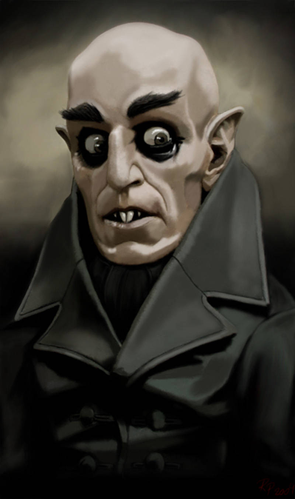
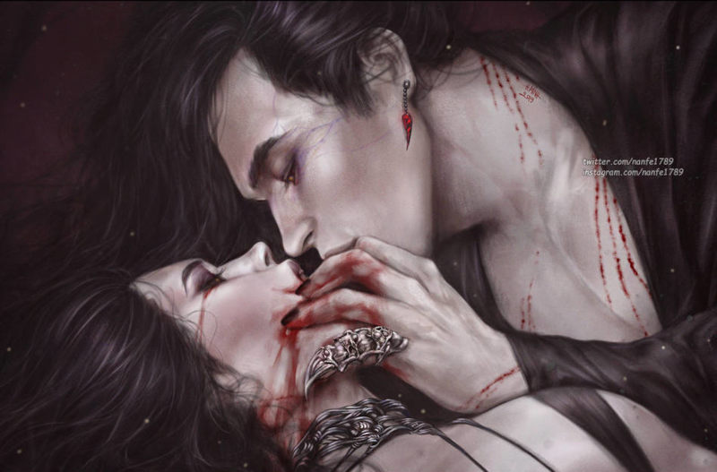
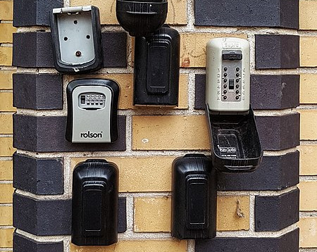
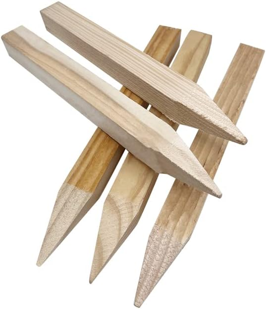
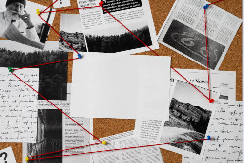

# Los vampiros

\sinc

Los vampiros, nosferatus, chupasangres, sanguijuelas, … han estado desde siempre entre nosotros. Y siempre tienen un plan de dominación.

Ahora veamos como son, de donde vienen y lo que es más importantes como devolverlos al infierno del que salieron reptando.

## De dónde vienen?

\conc

Pues tras muchos meses de estudio no he podido encontrar una respuesta clara. Hay tantas teorías como podcasts de fenómenos extraños y hacedme caso que hay muchos podcasts.

Estas son las que veo más probables:

* **Maldición:** hay varias opciones en cuanto a su época, ~~mesopotopomica~~ mesopotámica, egipcia o etrusca y casi siempre tiene toque bíblico, donde castiga con el vampirismo a un malo malísimo.
* **Siervos de la Muerte:** otra teoría es que son algún tipo de siervos de algún dios de la Muerte y el inframundo, rollo Anubis el Chaval o Hades el-machista-secuestra-persefones. Esto explicaría por qué la luz del día los mata.
* **Aliens:** los vampiros no son de este mundo, vienen del espacio exterior y por eso son tan diferentes a nosotros los humanos. La teoría de los astronautas vampiros ancestrales está muy de moda y pueden escuchar más en muchos de los podcasts que lo tratan.
* **Mutación/enfermedad:** puede que sean producto de una mutación o enfermedad como en Blade. Igual al principio solo bebían sangre humana por vicio, como mis padres con las morcillas del pueblo, y terminaron cogiendo algo chungo. Casarse entre primos también puede hacer esas cosas, o eso dice mi padre cuando sale el Rey en la tele.

* **Descendientes de Drácula:** no es la más lógica, aunque ninguna de las anteriores es mucho mejor, pero puede que todos los vampiros provengan de Vlad Dracul, el supuesto vampiro original. La pregunta es _quién convirtió a Drácula en vampiro._

> Si tienes tu propia teoría mándame un MD explicándomela, igual estamos ante la verdad.

\sp

\sinc

## Cómo son?

De normal son guapos a rabiar en lo que he denominado su forma _Crush_. Son seductores, tienen voz de K-Poper y se mueven también como ellos. Puedes de cualquier forma no hay un patrón, pero siempre están más pálidos de lo normal y no suelen tener casi bello corporal y es fácil detectarlo, porque son muy dados a enseñar cacho.

Pero en su forma real, denominada forma _Trash_, son feos a rabiar. Su piel es gomosa, sus ojos saltones y demasiado juntos y sus dedos alargados y ganchudos. Van encorvados y no paran de moverse.

De normal van en su forma Crush, pero el Trash sale cuando sienten miedo, son heridos o se cabrean mucho. 

Odian esta forma y si bien son más poderosos a nivel físico, también son más tontos y se les puede engañar más fácilmente. Además, sus poderes de Crush desaparecen.

\conc

_CRUSH: Normalmente los vemos así_

No te putopilles

\sc

_TRASH: En realidad son así_

\sinc

\conc

Pueden tener muchas formas, altos, bajos, mazados, fibrosos, rubios, morenos, rapados (que no calvos). La realidad es que pueden ser de cualquier forma, desde ligeros y ágiles cantantes pop a poderosas amazonas racializadas.

\sp

\sinc

\conc

### Alimentación

Los vampiros beben exclusivamente sangre fresca de humanos. No toleran otros tipos de sangre y no debe haber pasado más de 12 horas de su extracción. Con lo que tampoco les vale toda la sangre que hay en un banco, solo la recién extraída.

Un nosferatu medio, si está asentado y no tiene problemas, suele beber sangre unas tres veces a la semana. Pero en casos de necesidad puede subsistir con una vez a la semana, pero pasará mucha sed, hambre, … lo que sea. Normalmente, cuando están hambrientos no pueden acceder a su forma Crush, se guían más por sus instintos y la forma Trash sale a la luz todo el rato.

El proceso de alimentación no suele ser rápido y necesitan un par de minutos mientras chupan a su víctima hasta quedarse llenos. La ventaja es que son tremendamente vulnerables en esta situación, con lo que es un buen momento para atacar.

Son muy buenos ocultando sus mordiscos en público y la verdad que pueden parecer un par de amantes enrollándose. Por lo menos yo, gracias a la profa de Educación sexual, puede distinguir un rollo de un vampiro dándose un festín. 

#### Víctimas

Las víctimas de un vampiro pueden ser de cualquier tipo y condición, sobre todo cuando están hambrientos, pero en general su ego les lleva a escoger a aquellas víctimas masculinas y femeninas muy guapas y fit.

Es un rollo marichulo de «soy un alfa» y mis bros no me pueden ver con una víctima que sea menos que yo. No os podéis imaginar la de vampiro que hay adictos a los vídeos de ShitTubers como el Llados.

Una víctima de vampirismo suele presentar unos síntomas básicos muy parecidos a una gripe chunga, debilidad general, mal color, falta de apetito, vómitos y algunas veces diarrea.

\sp

Si la víctima no se aleja del vampiro, yéndose, por ejemplo, a otra ciudad, o el vampiro muere (cosas de la que tú deberías encargarte), terminará muriendo por alguna enfermedad común agravada por su anemia vampírica. 

Si muere, el vampiro o sus sirvientes se encargarán de dejar pruebas que expliquen su muerte, desde drogas escondidas en su cuarto a pruebas de una TCA. Son extremadamente creativos en esta mierda y sé que disfrutan mucho con esta parte. PUTOS VAMPIROS!!!!

Los vampiros suelen morder en cuello y muñecas, por lo que deberías buscar principalmente en esos sitios marcas de mordiscos. Las muñequeras de pinchos y los chokers de cuero son una buena protección, porque cubren esas 2 zonas.

#### Territorios de caza

Sabiendo todo lo anterior es fácil deducir que sus territorios predilectos de caza son discotecas, salas de conciertos y gimnasios de alto standing. No te fíes de monitores de gimnasio y de camareros de disco, suelen ser sirvientes. Aun así no te confíes, cualquiera puede ser un vampiro y su territorio de caza ser desde un centro comercial a un parque infantil donde seduce a padres y madres solteros y divorciados haciéndose pasar por otra desdichada alma solitaria.

Si es lo suficientemente rico y poderoso, deja de cazar y simplemente espera en su mansión a sus sirvientes le traigan víctimas que desangrar. Aun así cada cierto tiempo, sienten la necesidad de salir a cazar solos. Les gusta la emoción de la caza y perseguir a su presa. Ese es un buen momento para acabar con las sanguijuelas que están más protegidas.

### Puedes consumir sangre de vampiro?

Puedes, otra cosa es que debas. Beber sangre de vampiro te da superpoderes a lo Capitana Marvel, eres más fuerte, más rápida, más resistente y puedes flotar. El efecto dura unos minutos donde te sientes la leche.

El problema es que después te deja muy doblada. Y tras unos minutos terminas devolviendo toda la sangre tomada y vuelves a estar normal. Ya os digo que esa vomitona es de lo peor que puede pasarte.

No lo tengo estudiado (es puto desagradable andar haciendo pruebas), pero seguramente habrá sangres de vampiro más poderosas que otras.

### Falsas creencias

Hay una serie de creencias populares sobre los vampiros que he podido que no son verdad o por lo menos he podido comprobar que las hagan.

* No se transforman en niebla.
* No se transforman en lobos o murciélagos. Igual sí, pero con los locos de caza igual salen escopeteados.
* No tienen sentido radar como los murciélagos.
* Si flotan, pero no son grandes voladores. Lo justo para escapar de una turba y llegar a las ventanas de los pisos superiores para mirar, todo muy cripi.
* No tienen problemas con las vías de agua. Pueden pasar encima de ríos sin problemas.
* No tienen ninguna marca especial, ni estigmas, como mucho no tienen casi nada de bello corporal.

\sp

* No necesitan dormir sobre tierra de su país natal y tampoco tienen que dormir en ataúdes.
* Los vampiros no tienes poderes mágicos, no lanzan hechizos, ni maldiciones, ni portan objetos mágicos. Como dice Marisa, no dan loteo. Tampoco hacen rituales para invocar a sus dioses.
* No tienen poderes sobre los animales, como ratas o perros. De hecho, la mayoría de los animales se alejan de ellos.

\sp

\sinc

## Dónde duermen?

\conc

La imagen clásica del vampiro en un ataúd con tierra de su país de origen está bastante alejada de la realidad. No necesitan ninguna de esas cosas, solo un _sitio seguro_ y donde _no entre la luz del sol_. Puedes dormir en una cama supergótica con doseles y cortinajes supergruesos o dentro de una compleja caja metálica anti-cazavampiros en una habitación del pánico. En caso de necesidad, colgando bocabajo de la viga de un desván o arrebujados en un conducto de ventilación de un garaje subterráneo. 

Principalmente, duermen cerca de sus territorios de caza, muchas veces incluso en el propio territorio. Si caza en una disco de su propiedad, tienen montado en el local un despacho donde duermen, o quizás tengan una tienda alquilada en eternas reformas en el centro comercial por donde se mueven.

Sea como sea, la amenaza de la luz del sol, les hace que no se alejen mucho de sus refugios y el hecho que durante el día sean vulnerables hace que sean muy cuidadosos a la hora de volver a sus guaridas, extremando las precauciones y vigilando que nadie les siga.

\sinc

### Alcantarillado

\conc

&nbsp;

El alcantarillado es el salvavidas más común para estas criaturas. Cuando el amanecer les pilla lejos de su guarida, suelen recurrir a las alcantarillas. Suelen moverse por ellas hasta llegar a un colector donde buscará algún hueco o conducto donde esconderse para pasar el día.

> Un buen mapa de las alcantarillas de tu barrio con sus colectores principales y como llegar a ellos es muy muy muy muy útil.

\sp

Suelo sacar fotos de las alcantarillas y si cuando busco a una sanguijuela detecto que una alcantarilla está movida ya sé por donde ha intentado escapar. No es un método perfecto porque hay gente que las revisa y las mueve, pero es bastante efectivo.

### Pisos turísticos

No es la primera vez que usan pisos turísticos como guaridas temporales o permanentes. Lo primordial es que no necesitan ser invitados porque no son el hogar de nadie. Se contratan por internet y la mayoría de las veces ni aparece el dueño a abrirte. Entra y sale mucha gente variada a horas raras, el ruido y los gritos son normales, así que son tapaderas perfectas para sus actividades.

> Siempre que puedas, jode las casetillas con las llaves. La silicona es barata y funciona de miedo. Cuantos menos pisos turísticos en el barrio, más seguro será.

### Protección de sus guaridas

Las guaridas de los vampiros, salvo extrañas excepciones, son tan grandes, lujosas y seguras como el nivel del chupasangre. Más nivel, más espacio, lujo y seguridad. Así que un vampiro newbie puede tener un pequeño recinto asegurado y un Lord vampiro tendrá un ático que es casi una fortaleza con seguridad armada y sistemas de vigilancia de última generación.

Aun así, hay una serie de aspectos que hasta el vampiro más cutre tiene en sus guaridas.

* __Insonorizado__ para que no oiga gritar a las víctimas.
* Están __aislados del sol__ con cortinones, persianas y directamente sin ventanas.
* Tienen buenas puertas de seguridad con __cerraduras de última tecnología__ que son muy complicadas de abrir.
* Están __protegidas contra el fuego__ con materiales ignífugos y medidas antiincendios.
* Suelen tener una __pequeña armería__ con un par de las armas preferidas de la sanguijuela que pueden ser desde una hacha de guerra o un alfanje hasta una Glock con mira láser.

A partir de ahí puedes meter lo que quieras, habitación de invitados, celdas, diferentes salas de diversión, quirófanos, … lo que tu imaginación se le pueda ocurrir. 

Pasarte por las obras de los pisos como los jubilados y dar un vistazo a las licencias de obra que deben exponer públicamente pueden darte pistas de lo que están haciendo y detectar guaridas vampíricas. 

\sp

\sinc

## Cómo matarlos?

La verdad que para ser seres inmortales y superpoderosos, los vampiros tienen muchas debilidades muy estúpidas que debes aprender a aprovechar si quieres durar muchos años como cazadora.

\conc

### Estacas de madera

La tradición marca que un vampiro muere si su corazón es atravesado por una estaca de madera y es totalmente cierto. 

Lo que pasa es que es algo muy complicado, debe estar dormido o inmovilizado para hacerlo. Bueno, si cae sobre una valla de madera igual alguna de las tablas atraviesa su corazón. Sea como sea, es una medida bastante fiable de que no volverá a molestar.

La combinación estaca en el corazón + cortar cabeza es lo más afectivo. De ahí sí que retorna ninguno. El problema es que cortar un cuello es muy difícil con el cuchillo jamonero.

Quemar el cuerpo después de estarlo puede funcionar, pero se montan unos fuegos artificiales muy chungos.

Os recuerdo que puedes comprar estacas en Amazon y estarán mañana en casa, pero si puedes, COMPRA EN LOCAL :)

### Ajo

El ajo no solo repele a los chupasangres, el contacto les hace daño y puede ser mortal si consigues que lo ingieran. Métele una cabeza de ajo en la boca y verás fuegos artificiales de sesos de sanguijuela.

El ajo picado o en polvo son igual de efectivos que las cabezas de ajo y es mucho más práctico. Pero por experiencia te diré que el pan con ajo del Telepi ni lo huelen. 

#### Té de ajo

Mi mayor descubrimiento en mi carrera de cazavampiros es el té de ajo. Esta infusión de ajo es capaz de dañar a los vampiros como si fuera agua bendita o fuego.

La receta es simple, una cabeza de ajo por cada 2 litros de agua y ponerlo al 5 durante 1 hora. Esto te deja un 1 litro de té de ajo preparado para meter en bombas o pistolas de agua.

###  Fuego purificador

El fuego también es mortal, pero la verdad es bastante ingobernable y puedes acabar quemando todo el barrio. Y encima luego viene la policía a investigar el incendio.

\sp

Lo bueno es que conseguir fuego es fácil, un mechero y gasofa y tienes fuego. 

En serio, úsalo como último recurso.

### Luz del día

La luz del día es mortal para estas sanguijuelas. Unos pocos segundos expuestos a la luz solar y se convierte en cenizas. Así que tus operaciones deberían ser de día, cuando duermen y son más débiles.

Siempre que te muevas por una de sus guaridas trata de abrir ventanas, quitar papeles de los cristales y descorrer cortinas (cómo les gustan los cortinones de abuela). Cuanta más luz entre, más seguro será para ti.

Las linternas UV (ultravioletas) que todos conocemos como luz negra funcionan de lujo y dañan a los vampiros, pero no son tan mortales como la luz del sol. Puedes quedar de rarita llevando una en la mochila, pero es que además de dañar a los vampiros, puedes usarlas para _detectar fluidos como sangre_.

[.jpg "Cuatro modelos de pililla benditera o aguabenditeras de loza popular española. ")](https://es.wikipedia.org/wiki/Benditera#/media/Archivo:Benditeras_espa%C3%B1olas_(XVIII_al_XX).jpg "Cuatro modelos de pililla benditera o aguabenditeras de loza popular española. ")

### Agua bendita

El agua bendita es igual de efectiva que el ajo y encima es fácil de conseguir. Entras en la parroquia de San Julián sin que te vea el padre Ambongo y metes la botella de agua en la fuente de la entrada o en donde bañan a los bebes.

El problema del agua bendita es que el sacerdote que la bendiga debe creer y tener fe y, por tanto, puede pasarte que la lances al nosferatu y no tenga efecto porque el cura es un falso. Si encuentras una iglesia con agua bendita real, tienes un tesoro porque son muy raras.

### Plata

Los objetos dañados en plata dañan a los vampiros, da igual que sea un cuchillo para mantequilla, que un anillo, que la tetera de tu tata. Si es de plata puede hacerles daño. 

Les hace grandes heridas y mucho dolor y normalmente se acobardan bastante si tienen una buena provisión de plata, porque el simple roce es muy peligroso para ellos.

Tengo la teoría que cuanto más vieja más efectiva es la plata, así que comprar monedas de plata en el rastro no es mala opción. Cómprate un álbum de monedas y mételas dentro y tus padres estarán contentísimos.

Las balas de plata serían realmente útiles, pero las menores no tenemos acceso a este material. Por eso, estas vacaciones, igual, tengo tiempo de probar con un tirachinas con cuentas de plata. Seguro que si impacto en la cabeza de unos chupasangres, le dejo inconsciente lo suficiente para trincharle el corazón con una estaca. 

\sp

> Las cosas bañadas en plata son tan útiles como si fueran de plata y MUCHO MÁS BARATAS!!!!!

Las películas viejas de los abus, esas que son como de cine, están hechas de plata y son geniales para inmovilizar vampiros, son como las bridas que usa la policía para detener mucha gente en las manifas.

### Cosas que he probado y no funcionan

La experiencia me ha ayudado a descubrir cosas que funcionan y no funcionan con los chupasangres. 

* No te fíes de tu abuela cuando te diga que su cubertería es de plata, la mayoría son de alpaca plateada y no sirven contra los vampiros.
* Solo las cruces funcionan y solo si eres muy creyente, que no es mi caso, ya que ni estoy bautizada.
* Los petardos no son más efectivos que en un humano. Si consigues uno gordo, puede que algo le haga, pero no es mortal. Aprovecha las fiestas para hacer acopio y recuerda que la pólvora caduca. Los hermanos mayores son una buena fuente de petardos.
* Los extintores ni los notan.
* Los tasers solo churruscan un poco su piel y huele a bacón chungo, pero ni lo notan.

\sp

\sinc

## Sus planes

\conc

Los vampiros y los planes siempre van unidos, es parte de su naturaleza inmortal.

Primero porque lo ven a largo plazo y los planes largos y complicados con muchos pasos se ajustan a esa visión a largo plazo.

Segundo, porque esa inmortalidad les aburre y necesitan un juguete complicado y largo que les dure tiempo.

> Vamos, como diría mi abu: Las manos ociosas son el taller del diablo.

Si te encuentras un vampiro, estaré segura de que está planeando o ejecutando un plan. En cuanto terminan un plan empiezan con otro, ni los disfrutan.

### Estructura social

Para entender los planes de los vampiros debemos entender primero su sociedad. Cuando hablo así parezco mi profa de Sociales.

Los vampiros tienen una estructura social basada en su poder y antigüedad. Estando los newbies o más débiles abajo y arriba el Lord Vampiro, con un par de niveles intermedios.

Los de arriba mandan sobre los de abajo y los de abajo cuando pueden acaban con el de arriba y toman su sitio. Aquí nadie se jubila y se va a vivir a la playa LOL así que la única forma de ascender es cargándote a tu jefe (uno de los sueños de mi madre).

__Puedes asociarte con un vampiro para cargarte a otro?__ Puedes, pero ten claro que la siguiente en su lista serás tú.

__Intentarán comerte el tarro para que los dejes vivos y vayas a por su jefe?__ Lo intentarán siempre y no te extrañe que dejen pistas falsas que lleven a otro vampiro al que quieren cargarse.

### Planes sobre planes

Los planes vampiros son como sus creadores, así que los planes vampíricos tienen muchos niveles con grandes planes que tienen subplanes más pequeños y así hasta planes minúsculos.

Lo interesante de los planes vampiros es que no siempre tienes que ir hacia arriba, puedes ir hacia los lados. Incluso puedes volver a empezar desde abajo. Pero mejor lo vemos con un ejemplo.

Tu madre empieza a tener problemas en el trabajo por los constantes cambios de cita para la diálisis de tu abu. Descubres que es uno de los funcionarios que pone las citas. Esto sería un __plan menor__.

\sp

Según tiras del hilo, oh sorpresa, descubres que trabaja para un vampiro novato al que le han encargado cargarse el centro de salud donde va tu abu. Esto es un __plan inferior__.

Al acabar con el vampiro encuentras mensajes de un señor X que le daba las órdenes (__plan medio__) y de otro vampiro noob que estaba desmantelando la casa de cultura, otro plan inferior.

En ese momento, puede ir hacia arriba e investigar el plan medio y al señor X. También puedes investigar el plan inferior y tratar de salvar la casa de cultura. En este caso igual tienes que empezar investigando los planes menores que se ejecutan en la casa de cultura.

Subir a un nivel superior de plan o explorar otros del mismo nivel pueden ser igual de útiles y eficaces. Si vas a por el señor X y su plan medio, está bien porque ascendientes hacia el gran plan y si acabas con todos sus planes inferiores, seguramente él vendrá a por ti.

|Plan|Quién lo controla|
|---|---|
|Gran plan|Lord Vampiro|
|Plan medio|Vampiro oldie|
|Plan inferior|Vampiro noob|
|Plan menor|Siervo|

También puedes pasar que tengas que volver a un plan menor porque afecta a tu entorno directo, como que cierran el taller donde curra tu hermano para poner una casa de apuestas. En este caso tendrás dos tramas de planes a seguir que seguramente llevarán al mismo Lord Vampiro.

Has de ser rápida al desmantelar planes porque pueden volver a aparecer o cambiar de forma en poco tiempo, sobre todo si el vampiro te descubre y/o escapa a tu caza.

#### Planes mundanos
 
Otro elemento importante de los planes de los chupasangres es que son muy mundanos, tremendamente mundanos. Nada de plagas de zombis, rayos vampirizante o control mental en tu serie favorita.

Son más convertir tu ciudad en una mierda, donde nadie se preocupa de nadie y todos tienen miedo de todos. Es ahí donde sus actos ni son detectados ni son perseguidos y donde viven como reyes.

#### Fantasías de poder

Necesitan tanto el poder como la sangre y por eso sus planes deben influir en muchas personas. Ver a tanta gente bajo el poder de sus planes les encanta, les excita mejor dicho.

Piénsalo así, lo normal un vampiro habría acumulado millones de € a lo largo de los años con sus poderes y tendría a un par de siervos invirtiendo en bolsa. Seguramente se habría comprado una isla y haría traer a víctimas para bebérselas. 

Pero no, un vampiro tiene que cargarse las infraestructuras sociales de un barrio para que la gente del barrio se vaya, luego gentrificarlo y llenarlo de pisos turísticos y bares de borrachera para poder beber de ingleses y alemanes borrachos que volverán a su país con una anemia brutal. Necesita que haya miles de vidas jodidas para estar satisfechos.

\sp

### Cómo frustrar sus planes?

La forma de frustrar sus planes es avanzar poco a poco hasta llegar a su cima y al Lord Vampiro o socavarlo desde abajo para que el Lord Vampiro salga a la luz cuando su castillo de naipes empiece a caerse.

Debes ser rápida porque los planes como los vampiros regeneran y, en pocas semanas, el plan desbaratado ha respawneado con una nueva skin.

Frustrar planes grandes o pequeños no implica acaban con el enemigo que lo llevaba a cabo, implica muchas veces sanar y fortalecer esa parte del barrio y conseguir unos aliados que te ayuden cuando subas de nivel en la estructura de planes y los enemigos sean más poderosos.

Por ejemplo, evitar que se cierre un centro de salud, puede granjearte la amistad de la jefa del laboratorio, que seguramente hará pruebas y análisis a las muestras que envía el anónimo salvador de su centro.

> Recuerda que sus planes suelen ser muy mundanos y muchas veces basados en minar las estructuras sociales de ayuda, así que apoyar a los diferentes grupos que trabajan día para mejorar tu ciudad es una forma de prevención contra las actividades de los vampiros. Ir un día a trabajar al huerto urbano de tu barrio, hacer carteles contra una protesta por la tala de árboles en el parque o servir comida en el comedor social son formas también de luchar contra los vampiros. 

### Los grandes vampiros y sus grandes planes

Como ya hemos aclarado, detrás de todo gran plan vampírico siempre hay un vampiro muy viejo, un Lord, una Lady o une Liege (gracias Macarena por esas horas de lenguaje inclusivo en clase de Lengua, a pesar de lo que dijo el director). 

De hecho, normalmente son Lieges Vampires, cuando eres tan mayor lo de la sexualidad fluida es bastante factible. Si queréis putomosquear a un vampiro-machito-alfa el Liege funciona. El resto se giran y le dan un morreo a la primera víctima/sirviente que pillan.

Los grandes planes tienen una cosa muy importante que nunca debes olvidar, __son como sus creadores__. Si el Lord Vampiro es maquiavélico, los planes serán maquiavélicos con muchas intrigas y traiciones. Si el Lord es sanguinario, muchos obstáculos se arreglarán con violencia, tortura y asesinatos. Si el Lord es un depravado, habrá todo tipo de drogas, parafilias sexuales, juego, … y participarán los personajes más cripis que puedas imaginar.

Una vez que sepas quién es el creador del gran plan, te será mucho más fácil deducir los diferentes elementos de cada subplan, porque al final van a tener el sello de marca del gran arquitecto que ha estructurado todo. 

\sp

Otro punto importante de los grandes planes es que una de sus funciones principales es alimentar el inmenso ego de su creador. Si el plan avanza bien, el ego del Lord crece, pero, si empieza a fallar, su ego se desinfla y dejan de actuar racionalmente y su ego dañado toma el control

Que su gran plan falle es malo para el ego de un Lord Vampiro. Que falle porque 4 niñas con pistolas de agua están haciendo el trabajo que deberían haber hecho policías e investigadores adultos, es un golpe mortal en su orgullo propio. Con el ego herido, un vampiro puede empezar a hacer actos sin mucho sentido y dar palos de ciego, pero se mueve mucho más agresivo y menos cauto.

\sp

\sinc

## Cómo puedes defenderte de ellos?

No solo debes acabar con los vampiros y frustrar sus planes, es importante salir viva y a poder sin recibir daño. Es por ello que debes saber como defenderte de esas malditas sanguijuelas.

\conc

### Ajo

Una buena ristra de ajos alrededor del cuello te da bastante protección, pero si están muy enfadados o hambrientos no les detendrá.

Tampoco sirve de nada con los sirvientes a los que no les afecta el ajo.

> No compres grandes cantidades de ajos en supers o por internet. Vigilan todas esas compras. La tienda de encurtidos de tu calle es mucho mejor. Así que como digo siempre COMPRA LOCAL.

### Reflejo en el espejo

Los vampiros no se reflejan en los espejos, pero solo en los viejos que debían tener algo de plata. Los modernos tienen aluminio y en esos se reflejan.

Eso convierte a estos viejos espejos de plata en los perfectos detectores de vampiros, sobre todo cuando en su modo Crush.
 
Una visita a la casa de tus abuelos en el pueblo, al rastro o una antiquaría y puedes conseguir un espejo eficaz. Yo uso uno con mango y baño de plata por si tengo que golpear con él.

Si se rompen los trozos de cristal, estos tienen plata y pueden usarse como arma.

### Invitación a entrar

Las sanguijuelas no pueden entrar en una casa si no son invitados, así que mi regla fundamental es no invitar a nadie a entrar. El problema es que tu familia no lo tiene en cuenta, así que siempre soy la primera en abrir la puerta de casa. Así el tonto de mi hermano no invita a entrar a quien no debe.

La invitación es personal, así que solo le vale al vampiro al que se la diste, ni sus siervos ni su Lord están cubiertos en esa invitación 

Si el vampiro rompe en tu casa las leyes de hospitalidad se puede revocar la invitación, pero vamos es difícil revocar algo si primero te han roto el cuello.

### Entrenamiento de combate

Puedes pensar que las MMA, el Brazilian Jiujitsu y mierdas similares te vendrán bien en tu batalla contra los chupasangres, pero no merecen la pena. No tienes ni el tiempo, ni el peso, ni la fuerza para ser un peligro. Además, los gimbros se reirán de ti.

\sp

Mi consejo es que aprendas _autodefensa_ _personal_ con el _grupo feminista de tu barrio_. Lo que te enseñen esas reinas será mucho más útil para alguien de nuestro tamaño que lo te puedan enseñar los kungfu-bros del gimnasio. 

### Gafas de sol

La forma más eficiente de no caer bajo el influjo de la mirada hipnótica de un vampiro es no mirarles a los ojos. Pero como es complicado muchas veces para matarlos, unas gafas de sol pueden ayudar.

Aparte, quedas muy fachera y recuerda que el estilo está por encima de la sustance.

### Aliados?

TUS AMIGAS. No hay más.

\sp

\sinc

## Cómo se defienden?

Se defiende de nosotras de dos formas bien diferenciadas. Primero descrédito social y si eso falla pasan a lo físico.

\conc

### Ataques sociales

Mientras te muevas en la periferia de sus actividades, usarán todo su arsenal social para desacreditarte y aislarte, pudiendo llegar a desquiciarte y acabar en un psiquiátrico si no tienes una mente preparada.

Veamos algunas tácticas:

* Pueden convencer a los abusones del patio de que se ceben contigo y te cambies de colegio por otro más lejos.
* Mover hilos para despedir o cambiar de lugar de trabajo a tus padres o tutores y que tengas que abandonar el barrio.
* También pueden intentar quitarte las ayudas sociales que puedas estar recibiendo como forma de obligarte a buscar una forma de conseguir dinero en vez de cazar vampiros.
* Lanzarte hate desde redes, troles de internet, cuentas e imágenes fake, incluso hacerte pornoIA.
* Quizás hagan que te sigan peña cripi, solo para atemorizarte y tenerte en tensión.

La mejor defensa que tienes son tus socias y amigas. Ellas serán tu escudo contra toda la mierda que puede echarte encima. No digo que sea fácil con amigas, digo que sin su apoyo casi seguro sucumbes a sus ataques.

La ventaja de esos ataques sociales es que muchos son hilos desde los que tirar. Si te quitan la ayuda del comedor, puedes ir subiendo por la empinada cuesta de la burocracia hasta dar con el siervo que te ha hecho la putada y de él llegar al Lord Vampiro.

### Ataques físicos

Cuando empiezas a adentrarte en sus planes desbaratándolos y dándole problemas, es decir, cuando empiezas a truncar sus planes medios, suelen pasar al plano físico y periódicamente pueden enviar a alguien para acabar contigo.

Una cosa buena que tiene la naturaleza depredadora del vampiro es que cuando tiene una víctima y se pone en plan físico, se olvida del resto. En ese momento se olvida de tu familia, amigos, … Quieres hacerte daño a ti y solo a ti.

Si has seguido las normas estás bien protegida y preparada y tienes un grupo de sistars que te apoya, así que si mandan sirvientes humanos no son tan poderosos como para no poder derrotarlos o escapar de ellos. Si mandan vampiros, tu casa debería ser impenetrable y fuera de ella tienes armas para defenderte.

> Siempre que sea posible un chupasangre no se ~~manchará las manos de sangre~~ no intervendrá directamente en combates, eso supone muchas veces pasar a su forma Trash y lo odian, además se ven como pensadores maquiavélicos, no picadoras de carne. 

\sp

Casi siempre tratan de trabajar a través de sus chupones o de los vampiros que están por debajo de ellos. No les gusta meter gente de fuera. 

Podéis pensar que podrían contratar a un grupo de supermercenarios para acabar con tu panda de cazadoras, cuando empiezas a desbaratar su plan, pero piensa que eres una niña de 12 años. Sería raro contratar a un mercenario checheno para que ejecute a un grupo de niñas de 12 años. Estos encargos provocan muchas preguntas. Además, que aparezcan 4 cadáveres de 4 niñas de un barrio, puede hacer que el barrio entero se levante y luche por él y eso es lo último que quiere el Lord. 

Un gran vampiro solo recurrirá a fuerzas especiales cuando su status se vea altamente en peligro, hasta ese momento tratarán de llevar todo a modo local.

### Sirvientes humanos

Los siervos, ghouls, thralls, renfields son diferentes nombres a través del tiempo y las tradiciones de lo que yo llamo _chupones_.

Los chupones son humanos que sirven a los vampiros, bien como herramientas de sus planes, bien como sirvientes o protectores.

El vampiro suele darle pequeñas dosis de su sangre para engancharles al subidón y que la resaca de después cada vez sea mejor. Si deja de recibir su dosis, volverá tras un mono brutal a la normalidad. 

Por eso cuando te enfrentes a un chupón deberías usar fuerza no letal. Al final muchas veces son víctimas del sistema y la gran mayoría pueden ser rehabilitadas. Solo unos pocos escogieron su depravado y cripi destino y buscarán otro maestro si no tienen uno.

Muchos sirvientes empezaron siendo víctimas. La mayoría de las veces, mientras las vigilaba y/o seducía, el vampiro vio cosas que le eran útil y paso de alimentarse de ella a convertirla en su sirviente.

No hay un patrón fijo para los chupones, pueden ser de cualquier estrato social, tener cualquier físico, cualquier profesión y cualquier ideología. Cualquiera puede acabar siendo un siervo de vampiro. Son un poco como las sectas, un momento de bajón y te enganchan.

Podemos hablar de 3 tipos de chupones, los que ejecutan sus planes, los que les sirven y los que les protegen.

En vampiros novatos que pueden mantener pocos siervos estos tres tipos se pueden solapar. Un Lord Vampiro tendrá varios siervos por cada tipo.

#### Ejecutores de planes

Estos chupones se dedican a llevar a cabo los planes vampíricos. Muchas veces ni saben que son forma de un plan, ni que trabajan para los chupasangres. Igual simplemente reciben órdenes por Telegram y Bizums con la pasta por su trabajo.

Otros, sin embargo, son adictos a su vampiro o incluso son parte fundamental de plan como políticos de la ciudad, altos funcionarios y banqueros. 

#### Sirvientes

Su vida está dedicada a servir a su amo vampiro al que casi siempre están enganchados. Limpian su guarida, cumplen sus caprichos y sobre todo se encargan de proporcionarles alimentación. 

\sp

Eso supone buscar a las víctimas preferidas de su amo y engañarlas para llevarlas ante su amo para que se alimente de ellas y luego limpiar todo y eliminar pruebas.

Si la sanguijuela es más de cazar por sí solo, le ayuda en la caza, aislando a la víctima de sus amistades, emborrachándola, … Luego se encargará de llevarla a casa o en casos extremos deshacerse del cuerpo sin dejar pruebas.

> La verdad que algunas veces los vampiros se vuelven tan dependientes de sus sirvientes que se convierten en unos inútiles que se mueren solos si les alejas de su servidumbre.

\sc

#### Protectores

Son protectores, pero también funcionan como fuerza de choque. Hablamos de gimbros que se ponían hasta arriba de anabolizantes y que ahora se dopan con sangre de vampiro. No son un portento de las peleas, pero tienen fuerza y aguante y han aprendido cosillas de boxeo y MMA.

La verdad que lo mejor es engañarlos, es muchísimo más fácil que enfrentarse con ellos físicamente. De todas formas, como nos enseñó Mónica del punto morado del barrio, todos caen, si aciertas en los pendientes reales.

\sp

\sinc

## Y si me convierto en vampiro?

Pues estás jodida y no hay mucho que hacer. Tus sistars deberían darte una muerte digna para recordarte cuando todavía no eras una asquerosa sanguijuela asesina.

Si estás sola, antes de caer, búscate un final que esos cabrones no olviden jamás. **Si vas a caer,** **que no sea sola.**

\conc

### Cómo te transformas en vampiro?

Para acabar convertida en un vampiro es importante saber cómo es ese proceso.

Lo primero es estar al borde de la muerte, más allá que acá. Puede ser porque te hayan chupado la sangre o por culpa de las heridas del combate.

En ese momento, el vampiro puede decidir darte de beber de su sangre.

Un cuerpo humano que bebe sangre vampírica la combate y la termina expulsando, de ahí la gran vomitona al de un rato de beberla. Pero si tu cuerpo está muy débil, no puede combatirla y está termina apoderándose de ti.

En ese momento el proceso ya es irreversible, pero todavía no eres un vampiro, solo eres medio vampiro. Según pases los días, la sangre de vampiro irá poco a poco tomando el control de ti hasta que te obligue a beber sangre fresca. En ese momento ya eres un vampiro completo con todas sus fortalezas y debilidades.

Normalmente, la primera vez que te alimentas suele ser un fiestón de sangre y miembros desmembrados, así que los casos de asesinatos más brutales suelen estar relacionados con vampiros noobs, aunque los medios traten de taparlo achacándolo a otras cosas.

\sp

\sinc

## Bibliografía para cazavampiros

Aquí tienes algunos libros, pelis y podcasts que te pueden dar más información. Ninguno tiene toda la verdad, pero cogiendo cositas de uno de ellos puedes tener una visión bastante cercana a la realidad.

Este listado es abierto. Si conoces algún buen libro o peli, mándamelo a mis redes y miraré de meterlo.

\conc

### Libros

* **Drácula de Bram Stoker.** PEC El libro texto básico que es recomendable releer cada poco. Recuerda el 7° mandamiento de la cazavampira molona.
* **Carmilla de Joseph Sheridan Le Fanu.** PEC Difícil de encontrar y muy corto, necesito una segunda parte ya.

### Películas

* **Nosferatu.** Puedes encontrarte dos versiones, una con mala calidad y sin sonido y otra que si tiene sonido y mucha calidad. La que encuentres.
* **Jóvenes ocultos.** Película muy viejuner que pillas a la noche en canales cutres, pero le chifla a mi tío. Fiel reflejo de lo que pasa cuando los mayores no nos creen.
* **Saga Crepúsculo.** Pura propaganda vampira. _NO VER NUNCA_
* **Salem’s Lot.** Hay libro, pero habiendo peli, mejor peli. En esta peli se ve como todo vampiro tiene un plan de dominación.

### Series

* **Monster High.** Perfectas para verla con tus amigas y tantear lo que piensan de Vampilaura y los de su calaña.
* **Lo que hacemos en las sombras.** La tendrás que ver a escondidas, porque «trata temas adultos y hay referencias sexuales». Muy divertida, pero más propaganda vampira. Quieren que creas que son unos imbéciles trasnochados, pero ES MENTIRA. 

### Podcasts y página webs

* **Cuentos de la casa de la bruja.** Muchos audiolibros de libros clásicos como [Drácula de Bram Stoker](https://www.ivoox.com/podcast-cuentos-de-la-casa-de-la-bruja_sq_f1421745_1.html).
* **tododevampiros.com.** [Página web](https://www.tododevampiros.com/) con contenido superinteresante y extraño.

***