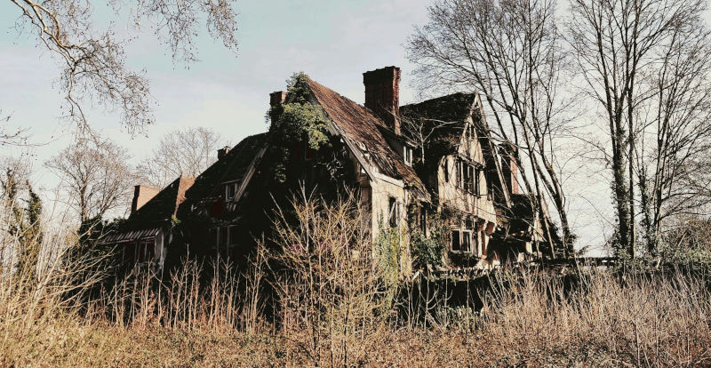

\sinc

## Lugares

A continuación he copiado las notas que fui haciendo sobre los distintos lugares donde ocurrió mi aventura para que puedan hacerte una mejor idea. Son, principalmente, guaridas de vampiros, zonas de caza y algún que otro sitio donde hubo encuentros importantes.

### El barrio

\conc

El barrio es una localización especial en esta aventura porque es tu labor definirlo poniéndole unos 4 aspectos. 

Llevas muchos años viviendo en el barrio para que tengas secretos para ti, por lo que el barrio solo tiene aspectos visibles. Los aspectos deben responder a preguntas como:

* ¿Quién vive en el barrio?
* ¿Es rico o es pobre?
* ¿Está en el centro o en las afueras?
* ¿Está bien comunicado?
* ¿Hay mucha delincuencia? ¿Hay mucha policía? ¿Está abandonado por las instituciones?

\sinc

### Guarida de Lord Ceballos

* **Aspectos visibles:** Altísima seguridad, Guarida perfecta de vampiros
* **Aspectos ocultos:** Habitación del pánico, Túnel de escape

\conc

Lord Ceballos vive en el ático de un edificio de viviendas de lujo, que es completamente de su propiedad. En ese edificio solo viven sirvientes suyos tanto humanos como vampiros y encima de ellos con la vivienda más lujosa y segura está Lord Ceballos.

Solo hay dos entradas al edificio, la principal, y, como no, la de servicio para repartidores, vigilantes y demás. Ambas tienen arcos de seguridad y escáner de rayos X para las bolsas. 

El ático solo tiene acceso por ascensor privado en el que siempre hay un vigilante que actúa de ascensorista. Todas las paredes están llenas de grandes ventanales que al amanecer se cubren de persianas metálicas reforzadas que no dejan entrar ni la luz, ni las balas.

El ático tiene varios dormitorios con su propio cuarto de baño y un gran salón donde Ceballos celebra sus fiestas. Tiene barra de bar, cómodos sofás, una chimenea y en el lugar principal una especie de sofá unipersonal como si fuera un trono.

Detrás del trono, tras unas cortinas de terciopelo rojo, tiene la puerta a una habitación del pánico donde puede dormir en una especie de sarcófago metálico anti-cazavampiros.

La chimenea se puede mover, pulsando un botón escondido y da acceso a una especie de tobogán que te lleva a las alcantarillas debajo del edificio.

\sp

La seguridad no tiene armas de fuego, solo porras y pistolas táser. Ceballos quiere saber que está protegido, pero no llamar demasiado la atención llevando más protección que el presidente del gobierno.

\sinc

&nbsp;

### Los humedales

* **Aspectos visibles:** Reserva protegida, Zona pantanosa
* **Aspectos ocultos:** Intereses inmobiliarios, Fácil de deshacerse de cuerpos y pruebas

\conc

En un extremo del barrio hay una zona pantanosa, unos humedales según la asociación ecologista local. Es una zona de charcas y cañaverales donde se supone que descansan diversas aves migratorias. Además, debe haber un par de especies de ranas protegidas.

Los humedales corren serios problemas debido a, primero, la fundición de San Andrés que supone un riesgo muy importante para el ecosistema de los humedales y, segundo, porque hay muchos intereses inmobiliarios, no solo del grupo Ceballos, en secar esos terrenos y edificar urbanizaciones privadas de lujo.

Se cuentan historias raras del humedal, desde luces extrañas hasta ovnis. Pero lo único cierto es que es un lugar estupendo para deshacerte de cadáveres y otras pruebas incriminatorias. 

\sinc

### La fundición

* **Aspectos visibles:** Vieja y destartalada, Peligro ecológico
* **Aspectos ocultos:** Controlada en secreto por el Grupo Ceballos, Aislada y lejos de miradas indiscretas

\conc

\sp

\sinc

&nbsp;

\conc

La fundición y planta de reciclaje de San Andrés fue durante muchos años uno de los motores de la economía del barrio, pero hace años que entró en decadencia y está vieja y destartalada fundición de chatarra es más un peligro ecológico que una fuente de riqueza.

Se encuentra al borde de los humedales y no es la primera vez que tiene «fugas accidentales» de productos peligrosos. Su cierre está siendo luchado por las asociaciones de vecinos y ecologistas, pero también da trabajo a unas cuantas familias. Esto lo convierte en un tema de conversación escabroso en las reuniones familiares del barrio.

La fundición cuenta con un edificio de oficinas, la fundición propiamente dicha, varios almacenes donde se guarda el material recuperado y un extensísimo patio donde se almacena a la intemperie la basura metálica a reciclar.

Cada día llegan camiones que traen basura metálica y se llevan metal preparado para su uso industrial.

Los subproductos contaminantes como plomo o mercurio se guardan en balsas estancas a la espera de ser tratadas en otras fábricas.

Lo que nadie sabe es que el grupo Ceballos la compró a través de una serie de empresas fantasmas, algunas fuera del país.

Por las noches para su producción y como está en los humedales, el lugar se convierte en un sitio aislado y lejos de miradas indiscretas, donde los vampiros pueden hacer sus cosas de vampiros sin ser detectados.

\sp

\sinc

### Campo municipal de fútbol 

* **Aspectos visibles:** Grandes Eventos, No cumple las normativas de seguridad actuales
* **Aspectos ocultos:** Trampa sin escapatoria, Pelotazo inmobiliario

\conc

Este campo de fútbol municipal tiene unos 60 años, construido en los 80 cuando el barrio tuvo un gran crecimiento.

Tiene un aforo de 8.000 personas y es donde juega el equipo local de segunda B.

Uno de sus problemas principales es que no cumple ningún tipo de legislación de espacios públicos, ni accesibilidad, ni seguridad, ni protección civil, … nada de nada. Llevan años con planes de derribarlo y construir un polideportivo que recoja otras actividades deportivas. Sin embargo, todas las administraciones locales por una razón u otra lo han retrasado.

El campo está metido casi en los humedales con lo que solo se puede entrar desde uno de los laterales largos. Si se pone vigilancia en ese lado es muy difícil salir o entrar sin ser visto, ya que no hay accesos de ningún tipo por otros lados.

\sinc

### Discoteca «Jaula»

* **Aspectos visibles:** Discoteca de moda, Oscura y ruidosa 
* **Aspectos ocultos:** Guarida de vampiros, Tráfico de drogas

\conc

«Jaula» es una discoteca techno situada en un polígono industrial del barrio. Es _-oscura y llena de __zonas reservadas__ fuera de la vista de todos, mientras que la pista es ruidosa, llena de gente bailando frenéticamente y con luces estroboscópicas. 

Las __fiestas de la espuma__ que ocurre en la pista de baile de la planta baja son famosas y fueron una idea de Alfonse como sistema antiincendios y una forma de mojar a todos y a todo el mundo y que sea difícil provocar un incendio. En la segunda planta hay unos __aspersores antiincendios__ para proteger su guarida del fuego.

Todo el polígono se llena los fines de semana de coches con los capós abiertos con su propia música y su propio alcohol para entonarse antes de entrar en «Jaula». Las peleas son normales, pero la seguridad de la discoteca las corta rápido cuando las detecta en sus rondas.

Tiene unas escaleras que dan acceso a una segunda planta con una __zona VIP__, con otra mini pista de baile y un puesto de DJ para sesiones privadas. La pista está rodeada de sofás donde se sientan los invitados VIP mientras toman cócteles que traen del bar del piso interior. 

__Alfonse tiene su guarida__ en una sala anexa, totalmente __insonorizada y aislada__ del exterior. Allí tiene un vestidor y un baño completo donde se prepara todas las noches.

\sp

Las únicas entradas son la puerta principal y otra por detrás que da al almacén del bar. Hay puertas de emergencia pero están alarmadas. La puerta principal tiene a dos gorilas, pero la del almacén no se vigila, pero tiene una cerradura con código y una cámara de vigilancia.

«Jaula» está abierta todos los días y hay seguridad las 24 horas, aunque para clientes solo está de las 20:00 a las 6:00 de la mañana.

\sinc

### Mazmorra de Néstor

* **Aspectos visibles:** Oscura, Da mucho miedo
* **Aspectos ocultos:** Llena de trampas, Segura como una cárcel

\conc

La mazmorra del Néstor es un espacio subterráneo debajo de la fundición de San Andrés. Eran unos túneles de la Guerra Civil que se cegaron y que descubrió hace unos años, mientras investigaba la compra de la vieja fundición para el Grupo Ceballos. Solo Néstor sabe como se accede a su mazmorra, de hecho, nadie sabe de sus actividades en ella.

Es un largo pasillo con habitaciones 3 habitaciones a cada. Cada habitación es usada como celda, donde puede tener a sus víctimas durante días sobreviviendo como pueden, ya que no se preocupa de alimentarles y darles agua.

Cada celda tiene una cámara en el techo para vigilarla y suele pasar largas horas cada noche vigilando a los niños y niñas que tiene encerradas. No tienen ningún tipo de conducto, ni ventana, solo puede salirse por la puerta y están cerradas con llave por fuera. Se podría forzar con una tirada Vigorosa Grande (+3) o Rápida (+3) si se tiene algún tipo de cuerda, cable o así para hacer una ganzúa. Suele dejar en las celdas objetos como ropa o peluches de otras víctimas llenas de suciedad y sangre seca.

Cuando sus víctimas están aterrorizadas y/o desesperadas, cosa que él cree que puede oler, aparece para jugar con ellas antes de chuparles toda la sangre y matarlos. Sus juegos son de un sadismo increíble, 

* Normalmente, se presenta como un salvador (un policía o un bombero) que viene a rescatar a la víctima de su captor. Cuando los libera empieza con tocamientos mientras tratan de huir y va aumentando la intensidad de los tocamientos cada vez más sexuales. Para cuando están a punto de escapar, los inmoviliza y los viola, terminando con sus vidas chupándoles toda la sangre.
* La otra vertiente es presentarse como sí mismo y pedir diferentes favores sexuales que van aumentando de nivel a cambio de pequeños regalos como agua, comida o la promesa de libertad. Los tortura así durante días, hasta que un día deja la celda abierta. En cuanto salen, se dedica a cazarlos hasta que los atrapa y los mata drenándoles la sangre.

Ninguna de sus víctimas tiene ninguna posibilidad ni de escapar, ni de derrotarle, ni de huir de él, pero aun así le excita esa falsa caza. Los únicos modos de salir de su mazmorra es como cadáver o si te traslada a la casa de la «Chejas» para aterrorizarte entre los cañaverales del pantano.

\sp

\sinc

### La casa de las «Chejas»

* **Aspectos visibles:** Aislada, Ruinosa
* **Aspectos ocultos:** Zona de caza de Néstor

\conc

La casa de las «Chejas» es una antigua y ruinosa casa que hay en los humedales y que se llama así porque la habitaban dos viejas solteronas a las que la gente del barrio llamaba las «Chejas».

De siempre han corrido todo tipo de historias sobre la casa, brujas, fantasmas, asesinatos ovnis, etc. Según pasaban unas modas y venían otras cambiaban las historias. Las historias de brujas pasaron a historias de asesinos con garfios oxidados y después a aliens y ovnis.

Hoy en día unos cuantos youtubers con canales de «urbex» (exploración urbana) han visitado la casa y han hecho directos allí.

La mayoría de historias modernas de la casa de las «Chejas» tienen una base de verdad. __Néstor la ha usado para sus macabros juegos__ __homicidas.__

Dejaba a los menores en la casa inconscientes y cuan se despertaban se dedicaba a acosarlos y asustarlos, cuando salían de la casa los cazaba en el pantano, para terminar matándolos y deshaciéndose del cadáver en los propios humedales.

La casa está en ruinas y el techo de la segunda planta está derrumbado con lo que solo se puede estar en la primera planta que era una gran estancia común, la cocina y un baño. Es húmeda, fría y seguramente tendrás que ponerte la vacuna del tétanos tras visitarla, pero nadie la visita. Si tuvieras que deshacerte de alguien o de algo la casa de las Chejas podría ser un buen lugar.

\sp

También puede ser usada como una **guarida secreta por tus cazadoras**, aunque siendo sinceras, atravesar medio kilómetro de un camino de tierra muchas veces embarrado no la hace muy atrayente. Aunque como hemos dicho puede haber visitas inesperadas de curiosos, youtubers y lo peor de todo Néstor.

\sc

\sp
