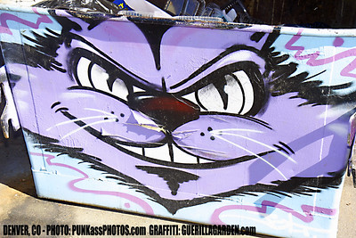

\sinc

## Personajes pregenerados

Aquí tienes 4 cazadoras novatas del barrio preparadas para dar guerra a los vampiros. También puedes usarlas de compañeras de clase o de grupo de apoyo y rescate si tus cazadoras principales fallan. No tienen todos sus aspectos rellenados para que puedan rellenarlos en partida.

### Amirah Tajdin

\conc

_Apodo:_ Gata

 

La calle corre por tus venas, conoces a todo el mundo, sabes todos los rumores y no te pueden engañar con ningún truco. Estás más tiempo en la calle que en tu casa y nadie te controla. Tus padres murieron hace años y tu abuela está muy mayor para controlarte.

Amirah es la alegría del grupo, es la que da vidilla, la risa en el momento inoportuno, la canción en momentos duros. Si nota que alguna amiga está de bajón, su forma le lleva a sacarte una sonrisa.

Amirah adora el barrio, no hay mejor sitio en el mundo. Quiere crecer y vivir en el barrio, disfrutando de sus pequeños placeres. Es donde es más feliz y por nada del mundo permitiría que alguien lo destruyera.

\sc

* **Aspectos**
  * **Concepto principal:** Tengo calle
  * **Complicación:** Huérfana que vive con su abuela
  * Entrenamiento de carterista
  * .................................................................................
  * .................................................................................
* **Estilos:** Cauto Normal (+1), Furtivo Bueno (+2), Ingenioso Normal (+1), Llamativo Grande (+3), Rápido Bueno (+2), Vigoroso Mediocre (+0) 
* **Proezas**
  * **Conozco a un tipo:** Debido a que tengo muchos contactos, una vez por partida puedo encontrar un aliado que me ayude en el lugar más oportuno.
  * **Hablar sin parar:** Debido a que soy una charlatana de primera, gano un +2 para Crear una ventaja de modo Furtivo cuando converso con alguien.
  * **Parkour:** Debido a tus años haciendo parkour en las calles, ganas una +2 a Superar de modo rápido cuando corres para escapar o perseguir a alguien.
* **Capacidad de recuperación:** 3
* **Estrés:** 1 | 2 | 3
* **Consecuencias:** Leve 2 | Moderado 4 | Grave 6

\sp

\sinc

### Nuria Ramos

\conc

_Apodo:_ Greenpeace

Nuria es la más activista del grupo, se apunta a todas las causas del barrio y las apoya con fervor. Si Nuria apoya una causa, casi casi seguro que es una causa buena que hay que defender.

Nuria es la más sensible de la panda, es su corazón y su brújula moral. Distingue muy bien lo que es legal de lo que es bueno y solo le importa lo que es éticamente justo.

Siempre marcará el objetivo justo, aunque a veces tenga que tomar senderos extraños y dudosos caminos. Es una pequeña Robin Hood, que si tiene que saltarse la ley lo hará.

Quiere ser abogada medioambientalista y de derechos humanos y es por eso que se pasa la vida viendo series de abogados y leyendo sentencias de casos contra grandes corporaciones supercontaminantes.

\sc

* **Aspectos**
  * **Concepto principal:** Activista junior
  * **Complicación:** Demasiado comprometida
  * Le encantan las series y los libros de abogados
  * .................................................................................
  * .................................................................................
* **Estilos:** Cauto Normal (+1), Furtivo Grande (+3), Ingenioso Bueno (+1), Llamativo Bueno (+2), Rápido Normal (+2), Vigoroso Mediocre (+0) 
* **Proezas**
  * **Lenguaje legal:** Debido a que conozco muchos términos y precedentes legales, gano un +2 para Crear una ventaja de modo Cauto cuando converso con alguien.
  * **Trabajo en la protectora:** Debido a qué llevo mucho tiempo trabajando en una protectora de animales, una vez por partida puede conseguir que un animal o un grupo de animales no le ataquen o le protejan de un agresor.
  * **Protesta ciudadana:** Debido a su experiencia escapando a la carrera de la policía y los antidisturbios, gano un +2 para Crear una ventaja de modo Rápido cuando escapa de un lugar o persona.  
* **Capacidad de recuperación:** 3
* **Estrés:** 1 | 2 | 3
* **Consecuencias:** Leve 2 | Moderado 4 | Grave 6

\sp

\sinc

### Ana Isabel «Anais» Duran

\conc

_Apodo:_ Tocón

Anais es la mayor (por unos meses, pero cuando tienes doce años es mucho) y a la vez la líder. Ella escucha a sus compañeras tiene en cuenta los pros y los contras valorando la experiencia de cada una en el tema y toma una decisión, normalmente acertada, pero alguna vez no ha estado centrada y ha supuesto un problema para el grupo.

Anais es la que tiene los pies más en a tierra, el ahora y el aquí son lo importante. Ni sueña con un mundo mejor como Nuria, ni tampoco flipa con la tecnología y sus aplicaciones como Sabina y desde luego no está tan centrada en la calle como Amirah. Para ella los problemas están aquí y ahora y es aquí y ahora donde deben resolverse.

Sus madres son profesionales libres (doctora y arquitecta) y tienen bastante más dinero que el resto de la gente del Barrio. Eso no sería ningún problema si no fuese porque nunca sabe si sus amigos y amigas lo son de verdad o solo por su dinero. Eso le crea bastantes inseguridades que compensa con su carácter de líder fuerte.

\sc

* **Aspectos**
  * **Concepto principal:** Líder natural
  * **Complicación:** Dinero por castigo
  * Nervios de acero
  * .................................................................................
  * .................................................................................
* **Estilos:** Cauto Grande (+3), Furtivo Normal (+1), Ingenioso Bueno (+2), Llamativo Bueno (+2), Rápido Mediocre (+0), Vigoroso Normal (+1) 
* **Proezas**
  * **La VISA de mis padres:** Debido a que tengo una tarjeta de crédito de mis padres para emergencias, una vez por partida puedo pagar lo que sea que necesite, siempre que sea legal y sin pasarme del límite de la tarjeta.
  * **Voz de mando:** Debido a mi tono de voz intimidante, gano un +2 para Atacar de modo Llamativo, cuando discuto con otras personas.
  * **La más alta de mi clase:** Debido a qué soy más alta que el resto de mi clase, una vez por partida puede hacerse pasar por mayor de edad, mientras no le pidan un documento de identidad.
* **Capacidad de recuperación:** 3
* **Estrés:** 1 | 2 | 3
* **Consecuencias:** Leve 2 | Moderado 4 | Grave 6

\sp

\sinc

### Sabina Castillo

\conc

_Apodo:_ Lovelace

Sabina es introvertida y podría pensarse que con gran dificultad de socialización. Pero en realidad cuando quiere es muy social, solo que normalmente no quiere. Prefiere sus cachorros tecnológicos y sus programas.

Su pensamiento es el más científico de toda la panda y es la que mejor entiende la tecnología. Ese pensamiento científico hace que sea muy poco propensa a creer en lo sobrenatural y el ocultismo.

Su principal problema en la vida son sus padres que son tremendamente protectores y no le dan ninguna cancha. No la dejan solo nunca, revisan sus redes, investigan a sus amistades y tienen el horario más restrictivo de su cuadrilla.

\sc

* **Aspectos**
  * **Concepto principal:** Cerebrito
  * **Complicación:** Padres muy protectores
  * Muy buena en ciencias
  * .................................................................................
  * .................................................................................
* **Estilos:** Cauto Bueno (+2), Furtivo Mediocre (+0), Ingenioso Grande (+3), Llamativo Normal (+1), Rápido Bueno (+2), Vigoroso Normal (+1) 
* **Proezas**
  * **La contraseña es 1234:** Debido a mis conocimientos informativos superiores, una vez por partida puedo tener acceso a un dispositivo electrónico con clave, huela, reconocimiento facial, etc.
  * **Evadirse del mundo:** Debido a mi capacidad de evadirme del mundo que me rodea, gano un +2 para Defender de modo Cauto cuando tratan de intimidarme o amedrentarme.
  * **Mezclando esto con esto:** Debido a mis conocimientos en química, gano un +2 a para Atacar de modo ingenioso cuando mezclo productos de limpieza, líquidos corrosivos, combustibles, … para crear algún tipo de explosivo o bomba de humo.
* **Capacidad de recuperación:** 3
* **Estrés:** 1 | 2 | 3
* **Consecuencias:** Leve 2 | Moderado 4 | Grave 6