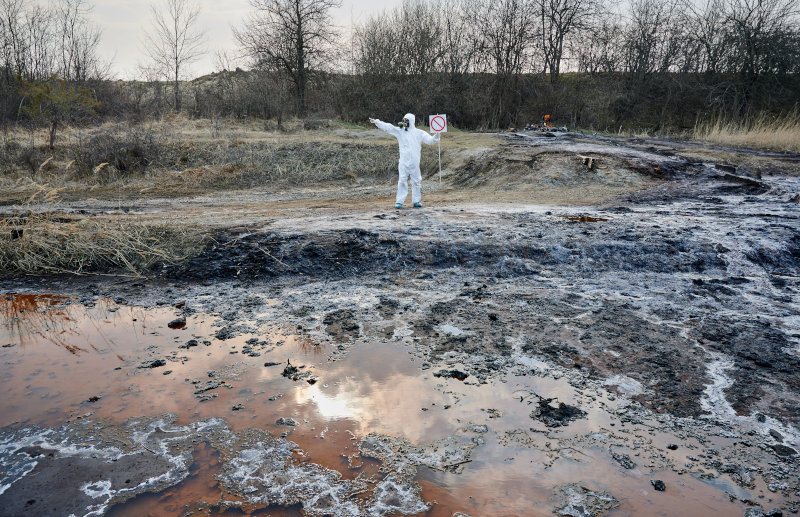

### Vertido tóxico

Mientras que la demolición del campo de futbol puede ser detenida, el vertido tóxico es muy difícil de detener porque tus cazadoras no van a tener ninguna pista de cuando y donde. 

Pueden que ya sepan que la planta de reciclaje de San Andrés, pertenece al Grupo Ceballos, pero no deberían tener pistas de la jugada de Nieve y el grupo Ceballos. Por suerte, el derrame no es algo que va a pasar en una noche, será algo que pasará durante 7 noches. Si bien no van a evitar las primeras noches si podrán evitar que se convierta en un gran desastre si pueden pararlo en las primeras noches.

La idea de Nieve es que con el casino en marcha y los humedales destrozados, será fácil presentar un proyecto de construcción de la autopista de acceso y del parking del casino y que sea aprobado.

#### El plan de Nieve

El casino que el Grupo quiere montar no sirve de nada sin unos buenos terrenos donde montar una autopista de acceso y un buen parking y para ellos hay que coger terrenos de los humadeles. Así que lo mejor es cargarse los humedales y toda la biodiversidad que hay en ellos.

La idea es que tras un desastre ecológico, se presentarán como revitalizadores del barrio y se comprometerán a limpiar todos los humedales a cambio de una parte donde construir las instalaciones que necesitan. 

\sp

\sinc

&nbsp;

\conc

Han comprado a la APCHUM para que cuando salten todo tipo de alarmas o problemas, ellos, como asociación ecologista del barrio, les laven la cara frente a la opinión pública.

Para montar su vertido tóxico hace unos años, cuando Lord Ceballos empezó a dar forma al plan vampírico para quedarse con el barrio, compró la fundición de San Andrés a través de varias empresas pantalla. Han ido probando métodos de hacer vertidos destructivos en los humedales y más o menos tienen un sistema funcional que no puede ser detectado fácilmente y saldrá más como un accidente que como un acto predeterminado.

XXX

#### Los primeros escapes

El primer de la semana las redes de la gente del barrio se llenarán de vídeos de diferente fauna muerta en los humedales, hablamos de ranas y peces. Las muertes no han sido solo por envenenamiento, hay muchos con fuertes quemaduras químicas es decir que estuvieron en contacto directo con los tóxicos cuando fueron vertidos y estos les produjeron las quemaduras.

El equipo municipal de limpieza se encargará de limpiar lo que pueda de fauna muerta y al día siguiente se repetirá la misma situación. Enseguida todos los ojos mirarán a la fundición San Andrés que ya ha tenido problemas parecidos otras veces y serían una de las pocas opciones contaminantes de la zona.

\sp

En cuanto se monte revuelo en las redes, habrá un comunicado de la APCHUM (apoyado por otros grupos ecologistas) desmiento esa posibilidad, ya que los tanques y fosos de almacenamiento de productos tóxicos están lejos de los lugares de donde hubo las muertes masivas de fauna. De haberse roto o haberse hecho filtraciones, los tóxicos habrían afectado a la fauna cercana a la empresa.

Entre este suceso y el derribo del estadio municipal, situación se va a calentar en el barrio. Discusiones a gritos entre vecinos a favor y en contra de ambos eventos, gente recogiendo animales muertos de los humedales, periodistas y curiosos, etc.

XXX

#### Buscando la fuente de los vertidos

__ANOCHECER__

Si tus cazadoras empiezan a investigar la fundición, se toparán con un muro empresas, algunas fueras del país que les harán imposible, llegar hasta la empresa propietaria final. 

Las vigilancias diurnas no van a dar ningún resultado en cuanto a los vertidos, pero si son listas (Moderadamente difícil +2) verán que es mucha casualidad que todas las empresas que dan servicios a la fundición son del Grupo Ceballos. Desde la empresa que trae el material para reciclar, hasta los rellenan las máquinas de refrescos y de sandwiches son parte del Grupo Ceballos. 

XXX

Según pasen noches sin dormir adecuadamente, tus cazadoras __estarán más cansadas__, lo que debería afectar a sus capacidades, sobre todo si están por el día tratando de evitar el derribo del estadio municipal del barrio. A no ser que decidan intentar cosas como llenarse de cafeína y bebidas energéticas, va a ser una semana muy dura. También podrían montar un sistema de turnos de forma que cada noche descanse una de las cazadoras. No participaría en las investigaciones, pero podría pueda dormir y recuperar sueño perdido.

#### Pruebas gráficas

__NOCHE__

XXX

> A pesar del problema del tiempo y el cansancio acumulado, si tus cazadoras ayudan en los trabajos de limpieza del vertido, deberías recompensarlas en la preparación y durante la gran sentada que se montará en capítulos posteriores.