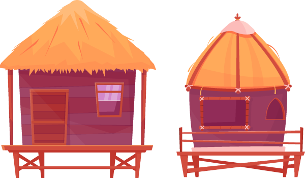
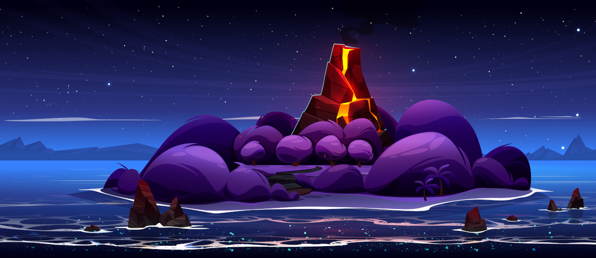
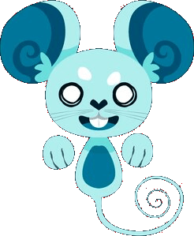
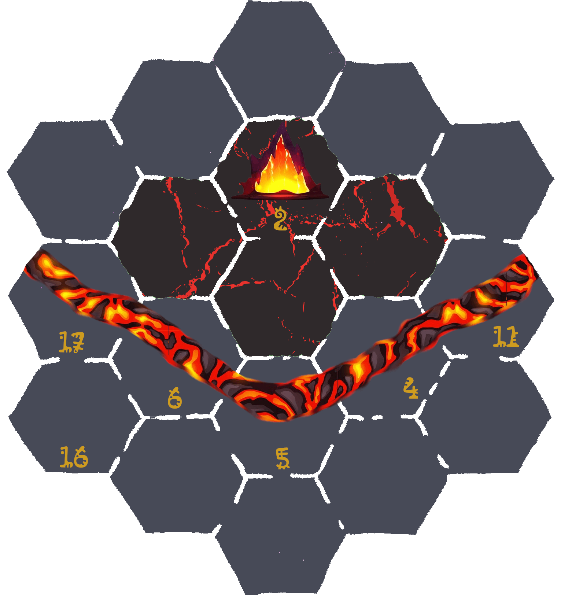
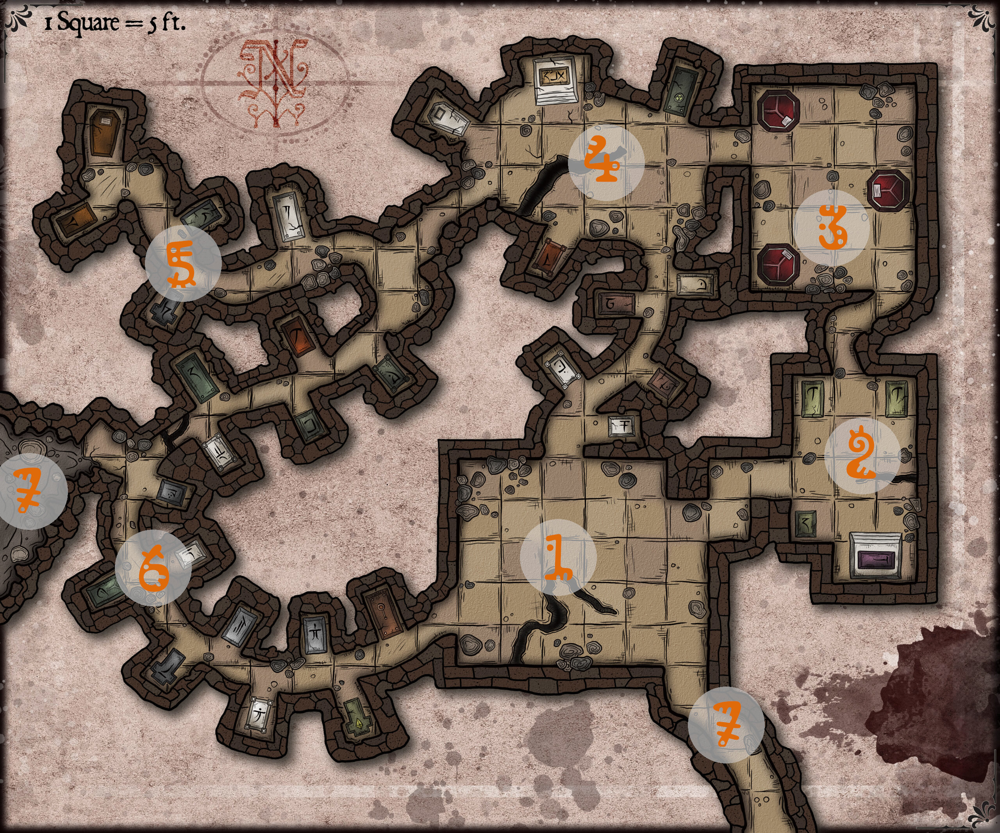
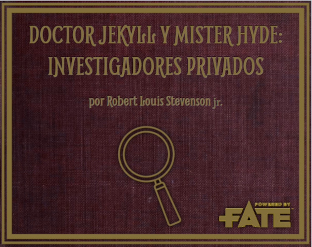

# MausTiki [por Gwannon](https://gwannon.itch.io/maustiki)

**MausTiki** es mini-ambientación para [Mausritter](https://losing-games.itch.io/mausritter) donde se explica como son los roedores de las islas del Pacífico y se describe Kaona Iole, una comunidad de kiores (ratas del Pacífico) situada en una playa de una isla del Pacífico.

Incluye una aventura larga donde tus kiores deberán aplacar la ira de los dioses si quieren que su playa sobreviva a la amenaza del volcán.
## La comunidad de Kaona Iole
En una pequeña isla volcánica del Pacífico existe una pequeña comunidad de roedores llamada Kaona Iole. En el poblado de Kaona Iole está formado kiores o ratas del Pacífico.

### Historia

Estas ratas llegaron hace siglos de otras islas, seguramente en embarcaciones de los humanos, y se establecieron en las cuevas del cabo oeste. Poco a poco colonizaron la isla y prosperaron hasta crear una gran civilización muy avanzada que construyó estructuras y monumentos por toda la isla.

Entonces un gran cataclismo sacudió la isla, probablemente un terremoto y/o una erupción volcánica y acabó con toda esa civilización que ahora es conocida como los ancestros.

Los pocos supervivientes se trasladaron a la playa y como pudieron, fueron prosperando hasta el día de hoy.

Las familias más poderosas de los supervivientes se convirtieron en «matais», la clase dirigente de Kaona Iole y hoy en día siguen dirigiendo esta comunidad.

### Localización 

Kaona Iole está situada en la cara sur de la isla, en la playa más grande de la isla, ya que el norte son acantilados y en la costa este y oeste solo hay pequeñas calas.

En el asentamiento vivirán unas 40 o 50 familias, cada uno con su choza. La comunidad además tiene algunos edificios comunales que se usan de colegio, salas de reuniones, etc. 

Debido al buen tiempo que hay en la isla, la mayoría de las actividades sociales son al aire libre en la playa, bailes hula, comidas, juegos, concursos de surf, etc.

Kaona Iole es un puerto natural muy seguro para todo tipo de embarcaciones si consigues atravesar sus arrecifes. Incluso durante tormentas y tifones, los barcos están bastante seguros, aunque si pueden sufrir daños, pero no ser hundidos.

Aunque a los kiores les puedan parecer una isla inmensa, para los humanos no es más que un islote volcánico sin interés. Es por ello que nunca lo han colonizado. Han pasado cerca con sus catamaranes, pero nunca han desembarcado.### El mapa 

[](https://www.freepik.com/free-vector/tropical-volcano-island-sea-cartoon-landscape_50471227.htm "Tropical volcano island in sea cartoon landscape by upklyak")

#### 1. La playa

La playa es un fantástico arenal de aguas transparentes y azules con unas buenas olas para surfear. La brisa del mar hace que se esté fresco todo el año. La playa ocupa casi toda la cara sur del islote y llegar de una punta a la otra de la playa puede llevarte media jornada de camino.

[](https://www.freepik.com/free-vector/tropic-rest-flat-icons-set-bungalow-equipment-beach-vacation-isolated-vector-illustration_26765555.htm "Tropic rest flat icons set of bungalow and equipment for beach vacation isolated vector illustration by macrovector")

Como tal, el poblado de Kaona Iole se encuentra en la playa y la mayoría de las casas de maderas de los riokes de la isla se encuentran en una pequeña franja de tierra y césped que hay entre la arena de la playa y la selva. A esta franja nunca llega la marea y está lo suficientemente alejado de la selva para que nada pueda salir de ella sin ser visto.

Las estructuras temporales se suelen montar ya en la arena, donde es más fácil fijar estructuras al suelo. Se suelen montar el mercado, los festivales, comidas populares, bodas y demás celebraciones y, aunque normalmente no llega allí el mar, alguna vez ha habido sorpresas con las mareas.

La playa está protegida por dos colinas cubiertas de hierba y palmeras que quitan gran cantidad de viento a la playa. En la colina este es donde se ubica la atalaya (8.).

Al lado este de la playa hay una gran cantidad de palmeras cocoteras donde gran cantidad de kiores van todos los días a recolectar cocos para conseguir comida y materias primas.

#### 2. Los arrecifes

Una red de arrecifes **rodea la playa desde el cabo este al oeste**, de forma que las aguas alrededor de la playa no dan a mar abierto. 

Los arrecifes hacen que el oleaje no entre en la playa con tanta fuerte y que depredadores como tiburones no tengan fácil acercarse al arenal y depredar los riokes que allí estén pescando, recolectando moluscos o simplemente nadando o surfeando. 
Además, sirve de defensa frente a otras tribus de riokes que quieran atacar el poblado.

Pero también tiene sus problemas, ya que es muy difícil salir de la isla con grandes embarcaciones, ya que los puntos de entradas libres de arrecifes son sinuosos y estrechos.

#### 3. El islote de Hāʻupu

Hāʻupu era un gigante que vivía en estas islas que expulsaba a los intrusos lanzando grandes piedras desde la playa. Fue engañado por Mausi para quedarse quieto en la playa y paso tanto tiempo allí que se convirtió en piedra y formo este islote.

El islote no es un lugar tabú, pero casi lo es. Nadie quiere acercarse, ni surfear, ni pescar cerca, ni nada. Se considera que es un lugar de mal agujero, pero nadie conoce ninguna historia que lo verifique, simplemente lo es.

Las crías jóvenes de rioke suelen jugar a ver quién se acerca más al islote nadando y permanece allí más tiempo. Es una especie de prueba de valor y un rito de paso de la niñez a la adolescencia.

Durante las mareas vivas el agua baja tanto que puede llegarse al islote andando, pero como ya hemos dicho nadie se acerca.

#### 4. La selva

El interior de la isla, quitando es volcán, es una densa y oscura selva en la que los riokes no suelen adentrarse. Prefieren ir por la costa si necesitan ir a los cabos o al norte de la isla.

En ella habitan todo tipo de depredadores, que no dudarán en atacar y devorar a nuestros héroes. Pero también es fruto de grandes riquezas, tanto en forma de materias primas de calidad como de reliquias y objetos maravillosos que se pueden encontrar en sus ruinas ancestrales.

Antaño los ancestros construyeron en ella todo tipo de estructuras, pero si sobrevivieron a cataclismo, ahora no son más que montones de piedras ruinosas y cubiertas de vegetación selvática.

> Gran parte de las aventuras en la isla tendrá que explorar partes de la selva y es interesante que sea algo vivo, que cuando vuelvan a adentrarse en ella, aunque sea un sitio conocido, haya cambios. Quizás haya huellas de animales distintos, el vado que usaban para pasar un arroyo haya desaparecido o unas lluvias torrenciales hayan sacado a la luz nuevas ruinas de los ancestros.  

#### 5. El volcán

En el centro se sitúa un gran volcán en activo. El cráter central del volcán es el punto más alto de la isla y se supone que es lugar donde vive la diosa Pele, diosa del fuego y los volcanes. 

Es un sitio cámbiente y peligroso donde tendrás que enfrentarte a calor infernal, fuego, lava, desprendimientos, gases tóxicos y vapores incandescentes.  

En invierno, si no está activo, la cumbre se llena de nieve. Se cuenta que los ancestros subían allí a conseguir hielo.

Las faldas del volcán están rodeadas de praderas y desde sus laderas discurren algunos riachuelos que crean cascadas naturales y que llegan hasta el mar.

#### 6. Atalaya

Al este de la playa hay una gran colina en cuya cima los riokes de Kaona Iole han establecido una atalaya de vigilancia, ya que domina todo el lado este de la isla. 

En esta atalaya se encuentra un pututu, una concha de caracol de mar gigante, que suena en la pleamar y la bajamar.
En caso de ataques enemigos y de depredadores terrestres o marinos, también se hace sonar para avisar a la gente del poblado, la gente que esté en la playa e incluso a los que están en las praderas y selvas cercanas.

#### 7. Cabo oeste

Esta zona de la isla es poco visitada, debido a su nulo interés comercial o de ocio. Solo es visitado por los riokes en situaciones muy específicas y esas no se dan normalmente.

En el macizo de piedra que forma el cabo oeste hay una red de cavidades naturales, llamadas las «cuevas de los ancestros». En caso de desastre se usan de refugio, pero solo las cavidades más externas.

Se suponen que las salas más internas de estas cavernas están habitadas por los espectros de los ancestros, espíritus de ancestros muertos que protegen los secretos y los tesoros de estas cavernas. Así que adentrarse en el interior de las cavernas es tabú, está prohibido. Las leyendas hablan de riquezas y magia poderosa en su interior, pero por ahora nadie ha querido adentrarse o si lo ha hecho, no ha vuelto para contarlo.

#### 8. Cabo este

Como es el cabo oeste tampoco es muy transitado, pero es un lugar muy apreciado por surfistas y pescadores, con lo que hay algo más de movimiento. Al estar más abierto sí puede haber ataques de depredadores marinos.

El cabo este es el mejor lugar de la isla para coger olas gracias al viento del este y los jóvenes surfistas suelen hacer excursiones a esta zona para pillar olas. No es raro si pasas por esta zona encontrarse pequeños campamentos en sus pequeñas calas.

### El mar y la playa

```
Las canoas están seguras en la playa, pero no fue para lo que se crearon.
```

Vivir en una playa de una isla significa que el mar es un elemento fundamental de la sociedad y la cultura de este enclave. El mar siempre debería estar presente en las aventuras. Es una fuente interesante de aventuras tanto por peligroso e inexplorado como por las cosas que puede dejar la marea en la playa. Además, es un entorno cambiante y lo que ayer estaba en una casilla puede haber desaparecido la siguiente vez.

La cercanía del mar hace que la comunidad de Kaona Iole tenga un aire pesquero con redes de pesca por todas partes, embarcaciones en la playa, olor a salitre y pescado, algas secándose al sol y tablas de surf clavadas en la arena.

### El volcán

El volcán de la isla es un volcán activo en constante peligro de erupción. Es una fuente constante de aventuras y de encuentros extremadamente peligrosos, extraños y mágicos. Sin olvidar que como el mar es algo cambiante y dinámico. Cada vez que pasas hay cosas nuevas y hay otras que han desaparecido.

El volcán solo o junto a los ancestros te permiten infinidad de escenarios para tus aventuras.

Quién dice que los ancestros no montaron un motor de energía geotermal para sus cuevas y eso propicio el cataclismo o qué hacían espadas de lava incandescente para sus mejores guerreros y guerreras. O quizás usaban los gases del volcán para hacer artilugios voladores.
Podemos decir que es una mezcla de Mordor, por el mal que puede expandir por la isla y los peligros que encierra, y del Olimpo, por ser el hogar de la diosa Pele y de otros dioses y diosas de su familia que le visitan. De hecho, cuando el volcán está nevado se dice que Poliʻahu está de visita.

Recuerda que, no es solo el hogar de dioses, también hay infinidad de kupuas menores de todas formas y tamaños que viven en sus laderas y cráteres. Esto permite sacar una gran variedad de enemigos para que tus riokes no se aburran.

### Los ancestros

Los ancestros son los antecesores de los actuales pobladores de la isla. Poco se sabe de ellos y lo que se sabe es que vivían en las cuevas del cabo oeste y crearon construcciones de piedra por toda la isla.

Se supone que tenían una tecnología muy avanzada, incluso que la de los kiores de hoy en día.

Un cataclismo acabó con los ancestros y ya solo quedan de ellos sus ruinosas estructuras, sus extraños objetos y algunos espectros que vigilan sus ruinas.

> Los ancestros son la excusa perfecta para meter todo elemento extraño que desees en tus aventuras. Ruinas perdidas, extraños artilugios, espectros guardianes pueden ser fácilmente explicables como parte delito de los ancestros.

### Clima

En Kaona Iole solo existen dos estaciones, verano (kau) e invierno (hooilo). Las temperaturas no varían muchos entre estaciones (de 25 a 30 °C). La única diferencia entre ellas es la cantidad de lluvia.

El problema es que las tormentas pueden convertirse en tifones que pueden arrasar toda la isla, derribando árboles e inundando terrenos secos.

Si la tormenta se convierte en tifón, los riokes empacan lo indispensable y huyen a las «cuevas de los ancestros», una red de cavidades en la roca en la punta oeste donde se refugiaron durante siglos los primeros kiores que llegaron a la isla.

### Mareas 

Las **mareas son una parte muy relevante de la vida del asentamiento** y avisar a sus habitantes de las subidas y bajadas de la marea es una ocupación crucial.

Las mareas marcan cuando salir a pescar, cuando bajar a la playa a recoger algas, etc. y como son cambiantes es muy necesario tenerlas controladas.

En cada luna nueva se eligen 5 grupos de 4 miembros, un grupo por cada fase lunar. Cada grupo tiene la obligación de avisar cuando está alta y cuando está baja la marea haciendo sonar un pututu, un caracol gigante de mar, con unas notas para la pleamar y otras para bajamar.

Cada roedor del grupo suele encargarse de vigilar una de las 4 mareas y cuando hace sonar el pututu, el siguiente roedor viene a sustituirle y este es libre hasta.

> Existe la creencia de que la marea dicta tu destino y si naces mientras suena el pututu de las mareas, están destinados a hacer grandes cosas, tú decidirás si beneficiosas para el asentamiento o terribles.
Tu trabajo no solo es avisar de las mareas, también deben hacer de vigías en una talaya en una palmera cercana. Deben avisar de tiburones que pasen el arrecife, de mantas que se acerquen a los pescadores y de tormentas inesperadas.

### Personalidades

#### Matai Mahuru

Su familia llevan siendo los «matais» (dirigentes) de Kaona Iole por generaciones y, si nada se tuerce, seguirán por muchas más. Mahuru es bastante brusco y malhumorado, pero es bastante sabio y suele tomar la decisión correcta en los momentos oportunos.

Le encantan los cuentos y los relatos épicos y no perderá la oportunidad de escuchar una buena historia, siendo muy generoso con el cuentacuentos.

#### Les 3 hermanes kahunas

Les 3 hermanes son unes trillizes, masculino uno de elles, femenina otra y [māhū](https://es.wikipedia.org/wiki/M%C4%81h%C5%AB) le ultimé. Son les kahunas del poblado. Nadie les llama por sus nombres, solamente les llaman «Kahunas».

Nunca se separan, de hecho siempre llevan sus colas entrelazadas, y normalmente suelen rondar por la playa junto al agua.

Son los únicos que van al islote de Hāʻupu cuando baja mucho la marea y allí hacen sus rituales y sus cosas de kahunas.

## El día a día
El día a día del asentamiento no es fácil, pero el clima, la naturaleza y el mar ayudan mucho a que la vida sea buena y feliz para los riokes.

En general la vida es muy parecida a otros asentamientos de Mausritter, con recolectores, granjeros y pescadores yendo a sus trabajos y diferentes artesanos en sus talleres. Hay mercados diarios en que se venden frutas, pescados, vegetales, etc. todos ellos fresquísimos.

En festividades especiales, como los solsticios y equinoccios, se organizan comidas populares y bailes hula en la playa y se hacen ofrendas a los dioses.

Pero Kaona Iole tiene algunas peculiaridades propias.

### Cocos

```
Del coco se aprovecha todo y si algo sobra es que no era un buen coco.
```

Los cocos recolectados de las palmeras cocoteras de la playa son una fuente muy importante de alimento y materias primas. 

* Su carne se come o se extrae aceite de coco para cocinar.
* Su agua es muy rica en nutrientes.
* Las fibras que lo envuelven son perfectas para hacer cuerdas y tejidos resistentes.
* Su dura cáscara puede usarse para construir casa, embarcaciones, armaduras, etc.

Antiguamente, cada familia se dedicaba a recolectar sus cocos para vivir de ellos, pero según fue creciendo el asentamiento y se instauró el trueque y la producción de derivados del coco, se profesionalizó la recolección de cocos. El poblado tiene una especie de cooperativa que trata los cocos en la que trabajan todo aquel rioke que lo desee y luego recibe una parte de los beneficios de los trueques.[](https://www.freepik.com/free-vector/sea-landscape-with-shallow-with-rocks-clean-water-fluffy-clouds_11685189.htm "Sea landscape with shallow with rocks in clean water under fluffy clouds by upklyak")

### Tatuajes

Los kiores tienden a hacerse tatuajes en el interior de las orejas que tienen muy poco pelo. Los tatuajes tienen formas geométricas y diseños tribales muy simples de diferentes animales cuyas virtudes posee el roedor tatuado. 

Hacer tatuajes es una profesión muy respetada y sus secretos pasan de maestro a aprendiz. Normalmente, cada comunidad tiene un maestro y un aprendiz, pero cuando termina su entrenamiento, los aprendices se lanzan a viajar durante un tiempo ofreciendo sus servicios en aquellos lugares donde no hay tatuadores establecidos.

No cualquiera es tatuado, ese honor solo sé reserva a los roedores que han hecho cosas importantes para la comunidad donde viven.

De normal, los kiores llevan las orejas hacia atrás, pero es bastante común girarlas hacia delante y extenderlas lo máximo para mostrar los tatuajes que hay en ellas, bien como forma de mostrar su importancia y valor o como forma de intimidación. Una buena cantidad de tatuajes podría dar ventaja a la hora de intimidar a otros roedores.

### Surf

```
Tangaloa nos enseñó a construir tablas de surf y a usarlas para surcar las olas y por eso le veneramos. Sin el surf nuestras vidas estarían vacías y sin hopupu.
```

El surf es el deporte más practicado por los riokes. Es tan importante que los y las mejores surfistas son tratados como estrellas y viven simplemente de hacer surf.

Las competiciones son eventos importantes y los premios que se ofrecen pueden permitir a un bien surfista sobrevivir todo el año.

Hay varios spots de surf muy buenos en la isla a donde van grupos de surfistas a practicar sus habilidades. No es extrañar llegar a una cala perdida y encontrarse con un círculo de tablas de surf clavadas en la arena y en su interior a riokes descansando junto al fuego.
> El surf que se representa aquí con trucos, carreras y tablas rápidas es más cercano al surf moderno. Nada tiene que ver con el que practicaban los antiguos polinesios. Nos hemos tomado la licencia de meter esos elementos para darle más importancia y acción y poder hacer escena de tensión sobre tablas de surf. Puedes obviar toda esta parte y dejarlo como un mero divertimento y un medio de transporte.

### Conexión con otros asentamientos

Kaona Iole es el único asentamiento de la isla, pero no es el único del pequeño archipiélago, así que cada cierto tiempo se organizan expediciones que venden a otras islas el excedente comercial o se reciben expediciones comerciales de otros islotes para vender su excedente.

Aparte, pueden también llegar riokes de otras islas buscando nuevas oportunidades o huyendo de problemas y tabús rotos en sus asentamientos originales. La ley es «isla nueva, vida nueva» y mientras no rompas las leyes del asentamiento no habrá problemas.

Tampoco es raro la llegada de riokes de cualquier género de otras islas en busca de pareja, ante la escasez en su lugar de origen.

Por último, la marea puede traer roedores de más allá del mar con sus extrañas vestiduras y herramientas.

### Facciones y depredadores

Una de las ventajas de vivir en una isla es la escasa existencia de depredadores y los que hay están controlados.

El principal depredador de la isla es la serpiente. Las serpientes pueden encontrarlas en la selva y las zonas de hierba de las praderas. Esto hace que sean sitios que los riokes tratan de evitar.

El otro gran depredador es el halcón marino, que de normal pesca, pero en momentos de necesidad puede atacar a los riokes pescadores o que estén en la playa.

Los tiburones serían una gran amenaza si no fuera porque los arrecifes que rodean la playa impiden su entrada en ella. Aun así, cada temporada se ve alguna aleta sobresaliendo del agua.

Los surfistas que van a las calas del cabo oeste si tienen que tener cuidado con ellos y suele ser normal que mientras hacen surf uno de ellos este en un lugar alto vigilando que no se acerque ningún escualo.

#### El colmillo roto

Los cerdos salvajes llegaron a la isla hace tanto tiempo como los riokes, pero a diferencia de ellos llevan comiendo y rebozándose en el barro desde entonces. Viven de lo que recolectan y del pillaje a los riokes y no han desarrollado ningún tipo de agricultura o artesanía.

El colmillo roto es una facción organizada de cerdos salvajes que envidian los logros de los riokes y buscan esclavizarlos y vivir como reyes mientras los roedores trabajan.

#### Fuego Purificador

Los Kupua del Fuego purificador son una facción de kupuas menores que quieren volver a los tiempos anteriores de los ancestros cuando eran dueños y señores de la isla. Casi lo consiguieron al propiciar el gran cataclismo, pero algunos kiores sobrevivieron y prosperaron de nuevo.

Son muy agresivos y atacan a los kiores que se encuentran. Por suerte no suelen salir del volcán donde viven, salvo esporádicamente para crear incendios y dar problemas a los kiores.## Religión y dioses
Los riokes rezan a una infinidad de divinidades y espíritus y estos son los principales y más venerados.

* **Pele.** Diosa del fuego y los volcanes
* **Hiʻiaka.** Diosa del baile hula, la medicina y la magia.
* **Kū.** Dios de la guerra, la política, la agricultura y la pesca.
* **Lono:** Este dios se asocia con la fertilidad, la agricultura, la lluvia, la música y la paz.
* **Nāmaka.** Diosa del mar y las mareas.
* **Hāʻupu.** Es el gigante que vivían en esta isla y que fue transformado en piedra creando el islote al oeste de la isla.
* **Mausi:** Es un semi-dios, mitad divinidad, mitad kiore, protagonista de muchos cuentos donde se dedica a engañar a riokes y dioses.
* **Kupuas:** Espíritus malignos y engañosos.
* **Aumakuas:** Espíritus familiares protectores que se encarnan en animales. Cada familia de riokes reza a sus propios aumakuas.

Las forma de adorar es muy variable, desde pequeñas ceremonias donde se hacen ofrendas hasta complejos bailes hula. No existe una religión organizada con rituales, ceremonias y lugares de culto.

Los kahunas o sacerdotes son reverenciados por su sabiduría y sus capacidades mágicas y curativas. Suelen ser consejeros del jefe del asentamiento.

### Pele, la diosa del fuego

Los roedores del enclave adoran especialmente a Pele, la diosa del fuego que habita el volcán. Periódicamente, les recuerda su poder con alguna erupción explosiva a algún río de lava.

Si algo define a Pele es su ira incontrolable y sus cambios de humor repentinos. Es un ser airado y todas sus actuaciones deberían estar relacionadas con estos rasgos de su personalidad.

A pesar de su divinidad no es un ser omnipotente y omnisciente, realmente es muy humana con sus cambios de humor y sus ataques de ira o sus regalos y dones.

A la hora de intervenir en las aventuras debería hacerlo a través del fuego, tanto quemando cosas como apareciéndose en fogatas para dar consejos.

Físicamente, no debería salir del cráter de su volcán y todos sus grandes actos deberían vincularse al volcán y los grandes peligros que este puede desatar.

Pele puede considerarse una divinidad benévola mientras las adoras adecuadamente y les haces los suficientes sacrificios y ofrendas. Pero también es una divinidad malvada y peligrosa si no la rezas adecuadamente o si alguno de sus familiares la saca de sus casillas, cosa que pasa casi siempre que la visitan.

Les kahunas de la isla creen que el gran cataclismo que acabo con los ancestros fue cosa de Pele, por algo que hicieron y que enfadó a la diosa.

### Mausi, el héroe tramposo

Mausi es el héroe mitológico de todos los relatos fantásticos que narran a la luz de la hoguera los cuentacuentos riokes.

Según versiones, es un semidiós, un kupua mayor, un ancestro, un kahuna o un simple rioke.

A pesar de ser un héroe, no encarna ninguna virtud heroica clásica, solo su amor por sus pequeños riokes. Es un granuja pendenciero, fullero, zalamero, embustero y embaucador que a todos molesta y de todos se ríe, desde el humilde pescador hasta la poderosa Pele.
Entre sus hazañas se cuentan.

* Creó la isla pescándola con su anzuelo mágico y sacándola del agua con su poderosa fuerza o quizás pescó una ballena que se convirtió en una isla o era una tortuga gigante.
* También engaño al gigante Hāʻupu para que se quedara quieto y de ahí se formó su islote. Se dice que jugaban al escondite en el agua y el gigante debía contar hasta diez, pero las olas le distraían y tenía que empezar de nuevo o igual eran los tiburones que le mordían los pies. Como sea, paso tanto tiempo así, que se convirtió en piedra.
* Robo el fuego y se lo dio a los riokes o quizás fue a los ancestros. Igual lo intercambio por algo que la diosa quería y que él no le entregó.
* Las aventuras sexuales de Mausi con todo tipo de seres de todo tipo de géneros también son legendarias, pero se reservan para cuando los niños se van a dormir.

> Las historias de Mausi son incontables y de todo tipo. Si ves a tu grupo parado sin saber qué hacer ante un desafío o enigma puedes darles una pista, recordarles alguna de las hazañas rollo «Recordáis que de pequeño vuestra abuela os contaba que Mausi derrotó a un jabalí monstruoso atiborrándolo de mangos con jugo de kaba».

### Aumakuas, espíritus familiares

Los Aumakuas son una especie de espíritus familiares y del hogar. No están muy bien definidos y son algo entre encarnaciones espirituales de la familia y antepasados muertos. 

Muchas veces son referidos en general como espíritus familiares, pero hay riokes que han interpretado ciertas acciones de estos espíritus como intervenciones directas de familiares cercanos muertos. Quizás porque hizo algo característico del antepasado o porque uso alguno de sus objetos personales. 

Toman formas de animales comunes como pajarillos, insectos, caracoles, pequeños crustáceos, etc. y se aparecen en los lugares más insospechados ayudando a tus riokes con pequeños actos.

Quizás un pajarillo cague en los ojos de la serpiente que está a punto de devorar a tus riokes o simplemente un caracol les haya seguido y haya dejado un rastro de baba hasta la salida del laberinto.

> Los aumakuas pueden llegar a convertirse en auténticos Deus ex machina y debes ser muy cauto a la hora de usarlos. No dejes que tus riokes se metan en líos y esperen que sus familiares les ayuden siempre. Si quieres mecanizarlo, conviértelo en una metamoneda. Cada vez que hagan algo muy valiente, apunta en secreto una metamoneda y vete quitando una cada vez que les ayude un familiar.

### Kupuas, espíritus diabólicos

Los kupuas cubren un amplio espectro de seres mágicos que van desde los simplemente traviesos y burlones, hasta los diabólicos y malvados.

Normalmente, pueden transformarse en algún tipo de animal que les otorga poderes, como nadar muy rápido transformándose en pez espada, cuyo pico puede usar como arma.

También son famosos por ser muy diestros en algún tipo de artesanía, arte u otra actividad. Puede que sea un gran tejedor de hojas de palma, surfista, buscador de agua o escalador.# Reglas

MausTiki modifica ciertas reglas de Mausritter y añade otras nuevas para representar la singularidad del asentamiento de Kaona Iole y de los roedores de las islas del Pacífico.## Cambios rápidos de reglas
Hay pequeños cambios en el reglamento original que te explicamos a continuación.

* Las monedas dejan de ser pepitas y pasan a ser conchas azules (ca).
* El equipo metálico del manual básico pasa a ser de madera o hueso. Puede haber pequeñas cosas de metal como joyas.
* Las armaduras ligeras y pesadas no están disponibles, son sustituidas por la de hoja de palma trenzada, la de placas de coco y la de cáscara de cangrejo y/o conchas.

## Creación de personaje
A la hora de crear tu roedor solo hay dos cambios principales, la tirada en tu signo se cambia por la tirada en la **tabla de la Marea de nacimiento**. Además, hay una **tabla completa de Trasfondos**.

### Marea de nacimiento

En vez de tirar en la tabla de «Signo de nacimiento» debes tirar en la siguiente tabla de mareas.

|1d10|Marea|Destino|
|---|---|---|
|1|Pututu de pleamar|Madera de **héroe/heroína o villano/a**|
|2|Marea subiendo de día|Reputado/a **artesano/a**|
|3|Pleamar de día|Futuro **jefe/a**|
|4|Marea bajando de día|Reconocido/a **explorador/a**|
|5|Bajamar de día|Gran **guerrero/a**|
|6|Marea subiendo de noche|Sabio/a **juez/a**|
|7|Pleamar de noche|Reverenciado/a **artista**|
|8|Marea bajando de noche|Misterioso/a **espía**|
|9|Bajamar de noche|Famoso/a **navegante**|
|10|Pututu de bajamar|Madera de **héroe/heroína o villano/a**|

### Trasfondos

Maustiki dispone de su propia tabla de trasfondos adaptada a la cultura polinesia y las características de las islas del Pacífico, pero puedes usar si deseas las originales del libro básico por ejemplo para roedores venidos del otro lado del mar que llegan a estas costas.|PG+ca|Trasfondo|Objeto A|Objeto B|
|---|---|---|---|
|11|Curandero/a|Máscara Tiki: Bendición de Hiʻiaka|Hojas de platanero|
|12|Tejedor/a de lei de flores|Cesta|Cordel de coco, rollo|
|13|Cestero/a|Tijeras de piedra|Maza de madera|
|14|Jinete de cangrejos|Ayudante: Montura cangrejo|Comida para cangrejos|
|15|Productor/a de kava|Mortero y maja|Cuencos de barro|
|16|Salinero/a|Pala|Cubo de cerámica|
|21|Músico|Tambor Pahu|Baquetas Kälaʻau|
|22|Carpintero/a|Hacha de piedra (mediana, 1d6 / 1d8)|Cuerda de medir con nudos|
|23|Buscador/a de tubérculos|Pala|Cesta|
|24|Pescador/a|Red|Aguja (ligera, 1d6)|
|25|Ebanista|Mazo|Cinceles para madera|
|26|Bailarín/a de Hula|Traje de hula|Pulseras de madera|
|31|Leñador/a|Hacha de piedra (mediana, 1d6 / 1d8)|Mochila de hojas de palma|
|32|Cuidador/a de pulgas de mar|Vara con gancho|Cesto para huevos|
|33|Carpintero/a de ribera|Hacha de piedra (mediana, 1d6 / 1d8)|Cordel de coco, rollo|
|34|Recolector/a de algas|Horca (mediana, 1d6 / 1d8)|Cesta|
|35|Alfarero/a|Hojas afiladas de piedra|Chesca y pedernal|
|36|Tatuador/a|Herramientas de tatuador|Tinta|
|41|Recolector/a de cocos|Cuerda|Taladro|
|42|Recolector/a de moluscos|Pala|Cubo|
|43|Surfero/a|Tabla de surf|Cera|
|44|Picapedrero/a|Maza de piedra (pesada, d10)|Cuñas de madera|
|45|Sombrerero/a|Cuerda de medir con nudos|Plumas de ave|
|46|Tejedor/a de hojas de palma|Aguja (ligera, 1d6)|Cordel de coco, rollo|
|51|Constructor/a de tablas de surf|Hacha de piedra (mediana, 1d6 / 1d8)|Piedra para pulir|
|52|Buceador/a|Tubo de caña para respirar|Horca (mediana, 1d6 / 1d8)|
|53|Tallador/a de piedras|Maza de madera|Cinceles de piedra|
|54|Tragafuegos|Antorchas|Parafina|
|55|Cocinero/a|Gran olla de barro|Cuchara y tenedor de madera|
|56|Mensajero|Saco de dormir|Daga (ligera, d6)|
|61|Cuentacuentos|Ropajes vistosos|Tambor de calabaza Ipu|
|62|Tintorero/a|Mortero y maja|Gran cubo de madera|
|63|Extractor/a de savia|Cubo|Cuñas de madera|
|64|Apicultor/a|Tarro de miel|Red|
|65|Salvavidas|Tabla de surf|Red|
|66|Buhonero/a|Mochila|Cayado|

La madera es un elemento fundamental en la vida de los kiores, es abundante, fácil de trabajar, duradera, resistente y flota. Por eso encontrarás bastantes trasfondos especializados en el trabajo de la madera. 
Lo mismo pasa con la hoja de palma, que también encontramos en varias profesiones que la transforman en diferentes elementos como cestas, velas de barco, sombreros, etc.

De hecho, **a la hora de construir** no hay cavadores y trabajadores, sino **leñadores/tejedores de hoja de palma y carpinteros**.

Sin embargo, desconocen el uso de metales, por lo que trasfondos como herrero u hojalatero, no existen. En su lugar tenemos varios trasfondos basados en el trabajo de la piedra, tanto para construcción como decorativos.

## Nombres
Este listado puede servirte para sacar el nombre de tu personaje o buscar un **nombre al azar (tira 1d10 + 1d6)** para tus PNJ tanto roedores como kupuas, moʻos, tortugas, etc.

Los nombres sirven para personajes femeninos, masculinos y no binarios, como les [māhū](https://es.wikipedia.org/wiki/M%C4%81h%C5%AB), un tercer género típico de las sociedades polinesias, que son personas que encarnan tanto el espíritu masculino como el femenino.  

|1d10/1d6|1|2|3|4|5|6|
|---|---|---|---|---|---|---|
|1|Afa|Ariki|Fangatua|Fuleheu|Kauri|Oroiti|
|2|Afu|Atiu|Fau|Futkefu|Kereteki|Palila|
|3|Ahio|Eloni|Fauiki|Hika|Kiri|Rewa|
|4|Ahohako|Ema|Fautave|Hine|Kohia|Tangaroa|
|5|Ahomana|Emobi|Feilo|Hiriwa|Kupe|Taranga|
|6|Aisake|Fainga|Fekitoa|Hoku|Lulani|Tawhiri|
|7|Akolo|Faipa|Feleti|Hori|Mahuru|Tike|
|8|Alika|Fale|Filimoeika|Ihorangi|Manu|Turi|
|9|Alipate|Faleaka|Folau|Inas|Matareka|Turua|
|10|Amanaki|Fangaloka|Fuanilevu|Kaula|Moeata|Whetu|## Condición «Maldito»
Enfadar a los dioses y a los espíritus tiene un precio y tu roedor puede acabar «Maldito».

Un roedor con la condición **maldito** tiene desventaja en todas las tiradas que haga. Si de normal tuviera ventaja, pierde la ventaja y hace una tirada normal. Las tiradas con desventajas no se modifican.

Para quitarse la condición de «Maldito» debe hacerse un descanso completo y hacer algún tipo de ceremonia para pedir perdón al espíritu. Puede ser cosas como:

* Quemar algo importante en honor a espíritus de fuego.
* Construir algo de madera o piedra y ofrecerlo a espíritu de tierra.
* Bailar el hula para alagar a los espíritus.
* Hacer una peregrinación.
* Cumplir alguna penitencia como andar sobre brasas o hacer y cumplir promesas como no cortarse el pelo durante meses. 
## Inventario
MausTiki tiene sus propios objetos de inventario, adaptados a las características de las islas del Pacífico, a su clima y a los materiales que en ella se puede encontrar.

Como ya hemos dicho en apartados anteriores, puedes hacer uso del equipo del manual básico de Mausritter, sobre todo si metes roedores de más allá del mar en tus aventuras.

Un punto importante del equipo es que el metal no es desconocido para los kiores, pero es escaso y no son hábiles forjando el metal. Sin embargo, sí son buenos trabajando la madera.

> Los precios están en conchas de caracol azul (ca) y si algo no tiene precio considera que no es algo que se compre fácilmente, como las embarcaciones. Seguramente que tendrás que pedir favores para hacerte con unos de esos objetos.

### Armas

Los kiores disponen de una gran variedad de lanzas de todos los tamaños (pequeñas, medidas y pesadas) y tanto de cuerpo a cuerpo como a distancia.

Como curiosidad diremos que son diestros con la onda que es usada como arma de guerra, mientras que el arco y las flechas se reservan normalmente para la caza.

#### Leiomano (50 ca)

Esta arma similar a una pala de jugar a pelota tiene el borde lleno de pequeños dientes de tiburón insertados.

#### Tao (40 ca)

Lanza de madera normalmente con una punta hecha del pincho de un pez espada o de los afilados huesos de la cola de una raya.

#### Horca (15 ca)

Este utensilio perfecto para la pesca de pequeños peces y crustáceos puede usarse como una eficaz arma de combate.

#### Remo (5 ca)

Estas contundentes herramientas de madera tienen lados afilados en la parte de la pala y buenos mangos para asiarlos bien y dar golpes contundentes, así que son unos utensilios muy útiles tanto para navegar como para combatir.

Las armas, sobre todo las grandes de madera, están profusamente decoradas con motivos geométricos y marítimos, convirtiéndolas muchas veces en auténticas obras de arte. También es normal que tengan elementos decorativos como, penachos de plumas u hojas trenzadas de vivos colores.

### Armaduras

Las armaduras están hechas principalmente de materiales naturales de origen animal o vegetal.

En las armaduras siempre ha primado elementos como que sean frescas y se pueda nadar con ellas, frente a que sean duras y resistentes. Es por ello que nos movemos desde hoja de palma hasta conchas y cáscaras de cangrejos, pasando por la dura corteza del coco.

**Todas las armaduras previenen 1 de daño** independientemente de su construcción. Lo que las diferencias son sus ventajas extras.
#### Protecciones de palma trenzada (50 ca)

Estas protecciones están hechas de varias capas de hojas de palma trenzadas. Se crean protecciones para diferentes partes del cuerpo. No son especialmente resistentes, pero son baratas, fáciles de fabricar, ligeras y flexibles.

> Ocupan una casilla de cuerpo. Después de cada combate pierden siempre una casilla de uso. También pierdes un uso si nadas o te sumerges con ella. Durante un descanso largo o completo puedes reafirmar y sustituir las fibras y recuperar 1 uso.

#### Armadura de placas de coco (150 ca)

Esta armadura aprovecha las fibras del coco para crear un camisote robusto sobre el que se cosen láminas de corteza de coco. Viene acompañado de una rodela hecha de media coco.

> Ocupa una casilla de cuerpo y pata secundaria. Flota, debido a sus fibras, pero no puedes sumergirte.

#### Armadura de conchas (400 ca)

Esta armadura está hecha de las conchas que se encuentran en la playa cosidas mediante fibras de coco. Su diseño aprovecha las formas orgánicas y curvas de las conchas para ajustarse al cuerpo del kiore. Las almejas sirven de placas pectorales, los caracoles de protecciones de codos y rodillas y las lapas son perfectas hombreras y cascos.

> Ocupa dos casillas de cuerpo. No puedes nadar con ella, se hunde por el peso, pero puedes sumergirte.

#### Armadura de cangrejo (500 ca)

La armadura hecha con piezas de exoesqueleto de cangrejo es la mejor y más avanzada armadura creada por los roedores del Pacífico.

Es ligera, flexible y altamente resistente. Y lo más importante para unos roedores que pasan mucho tiempo en el mar. Se puede nadar con ellas o si quieres sumergirte sin penalización.

Al igual que la de conchas, se aprovecha las curvas y las juntas de las piezas del exoesqueleto para hacer las diferentes partes de la armadura. Se usa el caparazón central para las placas pectorales y las pinzas y las articulaciones de las patas para brazos y piernas.

> Ocupa dos casillas de cuerpo. Puedes nadar con ella o, si quieres, sumergirte.

### Equipo vario

La alimentación de los kiores se basa más en frutos tropicales que en cereales y raíces, con lo que sus raciones de viaje suelen ser principalmente frutas y tubérculos, así como pescados y crustáceos secos.

#### Kava (5 ca)

La kava es una planta de la que se saca una bebida con efectos psicoactivos. Produce relajación muscular, somnolencia y ganas de hablar. Se ha utilizado tradicionalmente para tratar para aliviar infecciones, dolores, estrés e insomnio. La raíz se muele con un trozo de coral y se le añade agua fría para poder beberla.

#### Konane (15 ca)

El konane es una juego de mesa, muy parecido a las damas o el go. El konane se juega utilizando pequeños trozos de coral blanco y lava negra sobre una gran roca tallada y o un tablón de madera que funcionaba como tablero y mesa. Se considera un juego de roedores inteligentes y las competiciones son de muy alto nivel.
De normal ocupa 1 casilla de inventario, pero los de gran calidad ocupan 2 espacios de inventario, pero pueden ser transportado por dos personajes, uno lleva el tablero y otro las piezas. 

#### Herramientas de tatuaje

Las herramientas de tatuaje consisten en un peine con dientes de hueso o concha de tortuga unidos a un mango de madera. Los dientes estaban empapados en tinta a base de carbón diluido en aceite o agua. El peine se golpean con un palo de madera para pinchar la piel continuamente y meter la tinta en su interior.

Las herramientas de tatuaje ni se compran ni se venden, se pasan de maestro a aprendiz y se aprende a fabricarlas como parte del entrenamiento de tatuador.

#### Tambor de calabaza Ipu (20 ca)

Este tambor hecho con calabazas vaciadas, secadas y juntadas con una cuerda de fibras de coco, sirve para marcar el ritmo de los bailes hula. La superficie se pule con arena y como es muy frágil no se graba nada en su superficie. En su lugar se cubren con una red y se decora la red con coloridos elementos florales.

### Embarcaciones

Los kiores disponen de gran variedad de embarcaciones, pero principalmente usan diferentes variedades de tablas de surf, canoas y catamaranes.

#### Canoa (120 ca)

Esta embarcación tallada del tronco de un árbol, permite una tripulación de 3 kiores, dos remando más un tercer pasajero. 

Puedes ser muy simples o estar profusamente decoradas con motivos vegetales, animales, geométricos o mitológicos. Es el medio de transporte principal y sirve tanto en el mar como en los ríos.

#### Tabla de surf (80 ca)

Estas tablas de madera pulida se deslizan usando la fuerza motriz de su tripulante o la fuerza de las olas. No son fáciles de maniobrar y se necesitan años de práctica poder usarlas y hacer las acrobacias que algunos kiores consiguen hacer. Permite una tripulación de 1 kiore.

#### Catamarán

Estos navíos se caracterizan por tener dos o más cascos paralelos y de la misma longitud. Los cascos están unidos por troncos que también soporta el palo del velamen. La cubierta se crea con redes y tablas sobre los cascos y los troncos.

Es el navío perfecto para viajes largos entre islas y para pesca de altura, ya que son rápidos, estables y de poco calado para evitar los arrecifes de corral. Además, tienen una gran cantidad de espacio habitable donde pueden estar sus tripulantes y su carga.

Según el tamaño, podría permitir desde 4 a 20 roedores con su equipaje y agua y comida para un largo viaje.

De hecho, son los navíos con los que los kiores han ido explorando todas las islas del Pacífico.

|Objeto|Precio|
|---|---|
|Armadura de cangrejo|500 ca|
|Armadura de conchas|400 ca|
|Armadura de placas de coco|150 ca|
|Canoa|120 ca|
|Horca|15 ca|
|Kava|5 ca|
|Konane|15 ca|
|Leiomano|50 ca|
|Protecciones de palma trenzada|50 ca|
|Tao|40 ca|
|Remo|5 ca|
|Tabla de surf|80 ca|
|Tambor de calabaza Ipu|20 ca|
## Magia tiki
En la época de los ancestros, los espíritus vivían entre los roedores, pero cuando ocurrió el cataclismo, se refugiaron dentro de diferentes elementos naturales como árboles, piedras, conchas marinas o incluso lava solidificada.

Los grandes kahunas de los ancestros que sobrevivieron aprendieron a crear con esos materiales unas máscaras tiki que tienen poderes mágicos según los espíritus que habitan dentro, pero ese conocimiento se perdió hace mucho tiempo y ahora solo se pueden conseguir buscando en lugares peligrosos y antiguos.

> Si lo deseas puedes usar las máscaras tiki, como si fueran las tablillas de obsidiana del manual básico de Mausritter o usar las reglas especiales para «MausTiki».### Máscaras espirituales tiki

Las máscaras tienen una forma u otra según su material o sus poderes y no se pueden comprar ni vender, solo se pueden regalar, donar, entregar como dote, etc. 

Se consideran reliquias familiares que pasan de generación en generación.

Su perdida se considera un augurio funesto y encontrar una máscara tiki significa una gran bonanza.

### Usar las máscaras

Para usar los poderes mágicos de los tikis, tu roedor debe ponerse la máscara y decir el nombre de la deidad asociada a la máscara en voz alta.

Cuando usas la magia del tiki, decides el Poder que usas con un máximo del número de usos que le queden a la máscara.

Tira tantos dados d6 como el Poder usado para lanzarlo. Por cada dado que saque 4-6, marca una casilla de uso en el hechizo.

[](https://www.freepik.com/free-vector/tiki-masks-tribal-wooden-totems-hawaiian-polynesian-style-attributes-scary-faces-with-toothy-mouth_12682481.htm "Tiki masks, tribal wooden totems, hawaiian or polynesian style attributes, scary faces with toothy mouth by upklyak")

El hechizo tiene un efecto, que varía dependiendo del número de [DADOS] invertido y la [SUMA] de la tirada.

### Enfadar al espíritu

Los espíritus que habitan las máscaras tikis tienen una serie de leyes llamadas tabús muy antiguas que aún siguen respetando y si las rompes pueden enfadarse contigo. El espíritu te vigila incluso cuando está descargado. 

> Debes tirar una **salvación de VOL y si fallas obtienes la condición «Maldito»**.En la lista de hechizos se da una sugerencia del tabú que impone la máscara, pero puedes variarla, respetando siempre el espíritu de la restricción original, si hay varias máscaras iguales en el grupo o va muy en contra del carácter y personalidad del PJ que la porte.

Si el tabú es encender siempre un fuego cuando descansas, otra opción sería que no puedes apagar un fuego del tipo que sea.

### Identificando la máscara

Las mascarás tienes formas y elementos reconocibles, de forma que su hechizo y el nombre del dios invocador es fácil de averiguar. 
Los tabús y las formas de recargar cada máscara se explican al entregarla y según se te dan el tiki, el espíritu empieza a vigilar que cumplas el tabú.

En caso de encontrarse una tiki en una aventura hay que **tirar VOL para averiguar su tabú y su forma de recarga**.

En caso de fallar pueden usarla sin problemas, pero arriesgándote a enfadar al espíritu y sin poder recargarla adecuadamente. 

Podrán pedir a otra persona que la examine o esperar al siguiente descanso largo para volver a tirar.

El espíritu empezará a vigilar que cumplas con su tabú a partir del siguiente descanso largo o completo, así que tienes algo de margen con el tabú.

### Recargar la máscara

Cuando se marquen todas las casillas de uso de una máscara tiki el espíritu de su interior queda agotado y la máscara pierde sus capacidades mágicas. 

Para restaurar al espíritu de la máscara debes cumplir una condición que devuelve al espíritu todo su poder y a la máscara todas sus casillas de uso.

### Hechizos

Maustiki tiene su propio listado de hechizos. Aunque comparte algunos hechizos con el manual básico, tiene otros nuevos adaptados a la vida cerca del mar, como el **Don de Nāmaka** (Respirar bajo el agua), o en la falda de volcanes, como **Bendición de Pele** (Inmunidad al calor y al fuego).

|2d8|Hechizo|Efecto|Recarga|Tabú|
|---|---|---|---|---|
|2|**Fuego de Pele** (Bola de fuego)|Lanza una bola explosiva hasta 60 cm. Inflige [SUMA] + [DADOS] de daño a todas las criaturas en 15 cm de radio.|Meterlo en lava.|Debes encender siempre fuego durante un descanso largo o completo.|
|3|**Bendición de Hiʻiaka** (Curación)|Cura [SUMA] puntos de FUE y elimina el Estado Herido de una criatura.|Un grupo de danzas hula debe bailar delante de la máscara.|Debes bailar el hula siempre que se celebre algo.|
|4|**Lanza de Kū** (Proyectil mágico)|Inflige [SUMA] + [DADOS] de daño a una criatura a la vista.|Colgar la máscara durante 3 días de un árbol de ulu (árbol de pan)|No puedes huir de un combate.|
|5|**Don de Nāmaka** (Respirar bajo el agua)|Puedes respirar bajo el agua durante [DADOS] turnos.|Tener la máscara 3 días en agua de mar.|Prohibido tocar objetos con forma de anzuelo y usar protecciones de concha.|
|6|**Dureza de Kū** (Endurecer madera)|Un arma CaC de madera añade [DADOS] al daño durante [SUMA] turnos. También hace más resistentes objetos principalmente de madera como barcos o puentes.|Meter la máscara 3 días dentro de una caja de madera.|No puedes quemar madera.|
|7|**Ira de Lono** (Lanzar cocos)|Debajo de un cocotero, puedes hacer caer [DADOS] cocos a uno o más enemigos. Cada coco hace [SUMA] de daño.|Dejarse caer de un cocotero como un coco, 2d6 daño FUE si caes al suelo o 0 si caes al agua.|No usar cosas de hechas de coco, no comer coco, ni beber agua de coco.|

|2d8|Hechizo|Efecto|Recarga|Tabú|
|---|---|---|---|---|
|8|**Don de Papahānaumoku** (Cavar)|Excavas en segundos un túnel en la tierra de [SUMA] x [DADOS] x 2 centímetros de largo|Dejarlo en el lugar más profundo de una madriguera durante 3 días.|No debes sacar de la tierra cosas enterradas, desde tubérculos hasta tesoros.|
|9|**Mirada de Mausi** (Miedo)|Impone el Estado Asustado a [DADOS] criaturas.|Escuchar una historia de miedo de un cuentacuentos profesional durante un descanso largo o completo.|No debes recibir la condición Asustado.|
|10|**Luz de Kane** (Luz cegadora)|Obliga a [DADOS] criaturas a pasar una salvación de VOL o quedar aturdidas. Además, puedes crear una luz que brilla como una antorcha durante [SUMA] turnos.|Presenciar la primera luz del alba y la última del ocaso durante tres días.|No debes usar sombreros, parasoles o similares, ni taparte la cabeza.|
|11|**Bendición de Pele** (Inmunidad calor y fuego)|Eres inmune al fuego y al calor extremo y puedes andar sobre la lava durante [DADOS] turnos.|Hacerte una quemadura de 1d6 de daño de FUE.|Pasar 3 días cubierto de ceniza y sin lavarte. Serás más fácil de rastrear.|
|12|**Favor de los Kupua** (Cambiaformas)|Tomas la apariencia idéntica de cualquier ser vivo (animal, mineral o vegetal) durante [SUMA] x [DADOS+1] minutos. Solo tomas apariencia, no sus capacidades, es solo una ilusión. No puedes tomar una apariencia 5 veces mayor a tu tamaño y no puedes ser más pequeño. Tú sombra sigue siendo de ratón.|Durante 3 días la máscara debe estar en contacto con algo vegetal, mineral y animal que no seas tú.|No hay tabú, pero si se rompe la máscara el kupua se liberará y buscará vengarse de ti.|
|13|**Enredaderas de Papahānaumoku** (Enredar)|Crea un área de [SUMA] cm de radio de enredaderas que reduce a la mitad el movimiento durante [DADOS] turnos.|Ata tus manos o pies con raíces, lianas y enredaderas y mantenlos atados durante toda la noche y el día.|Debes plantar una semilla en cada descanso largo o completo.|
|14|**Forma de Hāʻupu** (Crecimiento)|Hace crecer a una criatura hasta [DADOS +1] veces su tamaño original durante 1 turno.|Subir a la cima de una montaña.|Prohibido lanzar piedras.|
|15|**Fuerza de Mausi** (Superfuerza)|Añade [SUMA] a tu FUE durante [DADOS+1] rondas|Llenar de piedras tu mochila (mínimo 1 espacio lleno de piedras) e ir al límite de carga durante 3 días.|Debes exagerar todas las historias que cuentes poniéndote de héroe en todas.|
|16|**Don de Hāʻupu** (Partir piedra)|Destrozas piedras en un radio máximo de [SUMA] x [DADOS]. Si son más grandes no les afecta.|Meter durante 3 días en una grieta o agujero en la roca.|Debes hacer algún tipo de construcción de piedra como un círculo de piedra o una pila de piedra cada descanso largo o completo y dejarlo ahí.|## Surcar los mares, surfear olas
Mientras que otros roedores han dedicado muchos esfuerzos en aprender a escalar árboles y paredes o cavar madrigueras, los kiores se han convertido en diestros y hábiles marineros para los que las azules aguas del mar no tienen secretos.

### Reglas para nadar y bucear

Desde su nacimiento, los riokes están relacionados con el mar. La matrona tras el parto baña a la cría recién nacida en agua de mar y el hecho de que a los pocos segundos de vida entren en contacto con el mar, marca mucho su vida. Recuerda además que su destino es profetizado a través de las mareas que había durante su nacimiento.

#### Nadar y bucear

Los riokes son fantásticos nadadores, así que en principio nadar y bucear no es una acción arriesgada por lo que no exige ninguna tirada. En caso de tener que nadar durante mal tiempo o resaca podrías tirar una tirada de salvación de FUE. Si caen al agua, en situaciones muy excepcionales, como grandes tormentas o tifones, tendrán que tirar con desventaja. En casa de fallar la tirada de salvación de FUE reciben 1d6 de daño de fuerza.

A la hora de bucear tampoco tienen problemas. Pueden pescar, recoger coral, etc. sin ningún problema y solo deben tirar si quieren hacer algún tipo de proeza como abrir una ostra para sacar una perla o rescatar algún tesoro hundido.  

Recuerda que la armadura puede influir a la hora de nadar y bucear, haciendo que se hundan hasta el fondo o floten sin problemas.

> Si un rioke se queda sin puntos de FUE, como DJ tienes la opción de que, en vez de morir, despierte en una playa desconocida y desierta con la mitad de sus puntos de FUE. Seguramente haya perdido todo su equipo, armas y raciones en el fondo del mar. Puede ser una buena forma de empezar una aventura.

#### Aguantar la respiración bajo el agua

Puedes aguantar bajo el agua sin respirar **tantas rondas como tu FUE**. A partir de ese momento cada turno extra recibes 1d6 de daño de FUE hasta que tu FUE llega a 0 y te ahogas. Si consigues respirar durante una ronda vuelves a poder estar sin respirar tantas rondas como tu FUE, pero el daño que recibiste se mantiene hasta que sea curado.

### Navegar

Si los riokes son diestros nadando, no lo son menos navegando, de hecho, no habrían colonizado todo el Pacífico de no haberlo sido. En principio no hay necesidad de tirar a la hora de usar canoas o catamaranes, a no ser que quieran hacer cosas arriesgadas como esquivar los arrecifes, esquivar remolinos o sortear los rápidos de un río.

La navegación se **tira con desventaja en caso de tormentas y tifones** en las tiradas de clima.

### Competiciones de surf

Cada competición de surf se juega como una eliminatoria y según ganas a contrincantes avanzas en la eliminatoria hasta la gran final. Cada encuentro te enfrentas a otro surfista en 3 rondas. El mejor de las 3 rondas gana y continua.[](https://www.freepik.com/free-vector/night-volcano-island-ocean-cartoon-vector-background-magma-eruption-glow-exotic-tropical-isle-beach-near-palm-tree-beautiful-volcanic-lava-steam-forest-game-design-rock-sea-water_58676039.htm "Night volcano island in ocean cartoon vector background Magma eruption glow on exotic tropical isle beach near palm tree Beautiful volcanic lava steam in forest game design Rock in sea water by upklyak")

Al principio que cada ronda se **tiran un 1d6, con 1-2 la próxima ola es mala (se tira con desventaja), de 3-4 es normal y con 5-6 es buena (se tira con ventaja)**. Los surfistas **deciden en secreto** si se ponen a nadar y la cogen o la dejan pasar. Si ambos intentan cogerla, se la queda el que gane una tirada opuesta de FUE.

Si decidiste dejar pasar la ola y ves que su contrincante va a por ella, puedes ponerte a nadar para pillarla, pero tirando FUE con desventaja.

El que no quiera la primera ola se la juega a tener que coger la siguiente ola sea buena o mala, ya que solo hay 2 olas por ronda. Si ambos rechazan la primera ola, tendrán que luchar por la segunda y ganará la ronda quien la pille y simplemente pase la tirada de DES para hacer sus acrobacias.

Si ninguno consigue una ola o fallan las tiradas de DES, se considera ronda nula y se repite.
 
Cuando ambos **consiguen pillar una ola**, hacen una **tirada opuesta de DES con ventaja o desventaja según su ola**. El que gane la tirada opuesta gana la ronda.

Para decidir si van a por la ola o la dejan pasar pueden guardar en su mano un dado rojo (u otro color) cuando van a por ella y uno blanco cuando pasan. Ambos deberán enseñar su dado al mismo tiempo.

```
Te diviertes con esto, ehhh. Pues has aprobado ... Vamos a hacer surf.
```

### Carreras

Las regatas de embarcaciones son muy comunes entre los riokes y suelen ser largos viajes entre islas o alrededor de una. Gana el que llega antes al destino y suelen durar varios días.

Con estas carreras buscan entrenar a los más jóvenes del poblado en las artes marineras y el trabajo en equipo. Para temas más individualistas, la gente prefiere las competiciones de surf.

No hay reglas ni mecánicas para este tipo de carreras, sino que son propiamente aventuras de exploración y puedes usarlas como semillas de aventura.# Criaturas

Además de las bestias de Mausritter, puedes usar en tus encuentros criaturas específicas de MausTiki. En principio, no existen en las islas del Pacífico las siguientes criaturas: gato, hada y fantasma.

## Moʻo, espíritu acuático cambiaforma

[](https://www.freepik.com/free-vector/hand-drawn-cartoon-chameleon-illustration_41098866.htm "Hand drawn cartoon chameleon illustration by pikisuperstar")

Las moʻos suelen adoptar la forma de reptiles monstruosos, geckos o riokes. Por eso se les considera a veces como kupuas, pero son veneradas como aumakuas (espíritus familiares). Suelen tener poderes sobre el clima y el agua. Son anfibias y suelen frecuentar pequeñas masas de agua dulce como estanques, pozas o remansos de los ríos. 

Cuando una moʻo muere, su cuerpo se petrifica y se convierte en parte del paisaje, lo cual explica las extrañas formas que pueden tomar las piedras.

Según los cuentos, cada moʻos tiene una habilidad excepcional, algo que hacen extraordinariamente bien, quizás sean unas surfistas increíbles, grandes artesanas o excepcionales cantantes. Puede que tus riokes tengan que buscar una moʻo con habilidades especiales que les ayude.

* **PG** 12, **FUE** 14, **DES** 12, **VOL** 12
* **Armadura** 2
* **Ataques:** d8, según su forma actual varía su ataque
* **Forma actual**
  1. **Rioke:** Suele ser alguien conocido, ataque con algún tipo de arma rioke
  2. **Gecko:** Trepa por todas partes, incluso bocabajo, ataque de mordisco
  3. **Camaleón:** Nada escapa de su visión, ataque de lengua
  4. **Lagarto:** Corren a gran velocidad, ataque de mordisco
  5. **Salamandra:** Puede respirar bajo el agua y nadar a gran velocidad, coletazo como ataque
  6. **Dragón (Iguana gigante):** PG 24, armadura de escamas extra 4, ataque d10 de mordisco y de cola## Cangrejo

[](https://www.freepik.es/vector-gratis/cangrejo-raiz-manglar-estilo-dibujos-animados-sobre-fondo-blanco_18987431.htm "Cangrejo de raíz de manglar en estilo de dibujos animados sobre fondo blanco por brgfx")
Tienen muchas formas, pero todos son tozudos y agresivos.

* **PG** 10, **FUE** 12, **DES** 10, **VOL** 9
* **Armadura** 3
* **Ataques:** d8 pinzas
* **Especies de cangrejos**
  1. **De roca:** De pequeño tamaño, pueden convertirse en animales domésticos que criar, FUE 8, d6 pinzas.
  2. **Ermitaño:** Pequeño y sabio, viven en conchas, DES 10.
  3. **Caja:** Buenos cavadores y fuertemente acorazados, armadura 5. Su cáscara es buena para hacer armaduras.
  4. **Araña de mar:** Delgados con largas patas.
  5. **De los manglares:** De buen tamaño, viven entre las raíces de las plantas que forman los manglares.
  6. **Kona:** Fieros luchadores, su carne es muy apreciada para grandes ceremonias.## Tortuga

[](https://www.freepik.com/free-vector/set-turtle-cartoon_20424112.htm "Set of turtle cartoon by brgfx")

Estas amistosas criaturas siempre están dispuestas a ayudar y a transportarte por el mar sobre su caparazón.

Algunas son tan antiguas como las propias islas y son muy sabias, tan sabias que hablan hasta la lengua de los kiores.

* **PG** 11, **FUE** 12, **DES** 6/16*, **VOL** 14
* **Armadura** 6
* **Ataques:** d8 mordisco
* **Áreas de conocimiento**
  1. **Tortuga laúd:** De gran tamaño y muy longevas. Saben mucho de historia y mitología.
  2. **Tortuga carey:** Su precioso caparazón las hace codiciadas. Saben de arte, música, baile, etc.
  3. **Tortuga verde:** su zona de conocimiento es todo lo natural
  4. **Tortuga tora:** La tortuga marina más grande todas. Son buenas escuchando y dando consejos a riokes con problemas.
  5. **Tortuga paslama:** De las más pequeñas del mar, sabe mucho de secretos y de cosas de espionaje y latrocinio.
  6. **Tortuga dragón:** Estas fieras tortugas son perfectos maestros de todo tipo de artes marciales y de combate con armas CaC.
  
_&ast; En tierra/en el agua_

  
## Kupua menor

[](https://www.freepik.com/free-vector/set-scary-tribal-tiki-masks_1227673.htm "Set of scary tribal tiki masks by freepik")

Los kupuas son espíritus normalmente diabólicos y vengativos con poderes de cambiaformas. Se asemejarían a demonios europeos.

No son grandes espíritus, sino menores con ciertas capacidades mágicas relacionadas con su forma alternativa. Si se transforma en ave puede volar y tiene garras terribles, si se transforma en tiburón puede nadar como un pez y tiene terribles dientes.
Suelen ser más embaucadores y tramposos que agresivos y beligerantes, pero si tienen que atacar lo harán sin dudar.

* **PG** 10, **FUE** X, **DES** X, **VOL** X
* **Armadura** 0
* **Ataques:** ataques variados 1d8, según transformación
* **Se transforma**
  1. **Halcón marino:** Vuelo y excelente vista
  2. **Raya:** Nadar y respirar bajo el agua, cola afilada 1d10
  3. **Tiburón:** Nadar y respirar bajo el agua, mordisco 1d10
  4. **Cerdo salvaje:** 20 PG y armadura 2
  5. **Búho:** Vuelo y visión en la oscuridad.
  6. **Fuego:** Produce luz y fuego. Hechizo de Fuego de Pele (Bola de fuego).##  Cerdo salvaje

[](https://www.freepik.es/vector-gratis/conjunto-animales-bosque-dibujos-animados_9509586.htm "Conjunto de animales del bosque de dibujos animados por macrovector")

Los cerdos son animales de pulsiones y cuando tienen una necesidad se ponen a buscar aquello que cubre la necesidad. Si tienen sed, buscan agua, si tienen calor, barro donde remojarse, etc. Su ánimo y actitud dependerá de que están buscando.

* **PG** 15, **FUE** 15, **DES** 12, **VOL** 8
* **Armadura** 2
* **Ataques:** colmillos d6 (d8 si corre y carga) 
* **Está buscando**
  1. **Agua para beber:** Les pedirá su agua (u otros líquidos) o les atacará. Si les dan agua, cada rioke pierde un uso de las raciones.
  2. **Barro para remozarse:** Pasará de largo sin preocuparse de los riokes, lo único que quiere es refrescarse en el barro.
  3. **Árbol adecuado para rascarse:** Solo necesita que le rasquen en ese punto que no llega.
  4. **Frutas:** Si llevan raciones con dibujos de fruta, las olerá y exigirá que se las den o les atacará. Si les dan agua, cada rioke pierde un uso de las raciones.
  5. **Bronca:** Simplemente busca bronca para divertirse, huirá cuando alguna estadística baje de la mitad.
  6. **Colmillo roto:** Es miembro del Colmillo Roto y atacará a los riokes.## Espectro de los ancestros

[](https://www.freepik.com/free-vector/hand-drawn-flat-halloween-ghosts-collection_18953697.htm "Hand drawn flat halloween ghosts collection pikisuperstar")

Los espectros de los ancestros son seres fantasmales que murieron durante el gran cataclismo y que protegen sus cuevas y ruinas. Tienen una vaga apariencia de rioke y de la apariencia y ropajes de cuando estaban vivos.
Son sintientes y puedes hablar con ellos, pero muchas veces sus palabras y acciones no tienen mucho sentido.

Solo puede ser dañado por armas mágicas, hechizos o armas y munición hecha de sal de roca.

* **PG** 8, **FUE** 8, **DES** 10, **VOL** 12
* **Armadura** 0
* **Ataques:** Poderes espectrales/1d8 toque espectral (daña VOL)
* **Poderes espectrales**
  1. **Mirada de terror:** Impone el Estado Asustado a una criatura
  2. **Grito sónico:** 1d8 toque sónico (daña FUE)
  3. **Crioquinesis:** 1d8 toque gélido (daña DES)
  4. **Visiones:** Tienen visiones proféticas
  5. **Vuelo:** No se le puede dañar CaC.
  6. **Incorpóreo:** Flota a través de una pared o suelo, reaparece en otra parte

## Facciones
### Colmillo roto

#### Recursos

* Brutos y fuertes combatientes
* Gran número
* Buenos sentidos

#### Objetivos

◯◯◯ Quedarse con los recursos y las riquezas de los riokes

◯◯◯◯ Esclavizar kiores
### Fuego Purificador

#### Recursos

* Poderosa magia
* Conocimientos secretos

#### Objetivos

◯◯◯◯◯ Acabar con toda la vida en la isla

◯◯◯ Conseguir más poderes mágicos

◯◯ Tener infiltrados entre los kiores# Exploración
MausTiki usa las mismas reglas de exploración que el manual básico de Mausritter, pero tiene sus propias tablas de tipo de hexágono y de puntos de interés. Están adaptadas a la orografía, los elementos geográficos, las construcciones que pudieran encontrarse en una isla del Pacífico. 

Además, hay también tablas adaptadas a la exploración de zonas costeras, como playas, arrecifes, bancos de arena y mar abierto.

Por último, tenemos también tablas de clima para simular la climatología de la zona.

## Exploración terrestre

La exploración terrestre sigue exactamente las reglas de Mausritter con la salvedad de que tiene sus MausTiki tiene sus propios tipos de terreno.

|1d6|Tipo|
|---|---|
|1-2|Selva|
|3-4|Pradera|
|5|Río|
|6|Volcán|

## Exploración marítima

El océano es un elemento fundamental de la vida de los kiores. Es una fuente de recursos y riqueza, pero también un peligro constante y una frontera que explorar. Es por ello que adentrarse en aguas desconocidas debería ser un elemento importante en las aventuras de MausTiki.

La exploración de zonas marítimas exige tener embarcaciones adecuadas. 

* A pie o nadando solo puedes explorar playas.
* Con tablas de surf solo puedes explorar playas y arrecifes.
* Con canoas, solo playas, islotes y arrecifes. 
* Para salir a mar abierto necesitas embarcaciones preparadas como un catamarán.

|1d6|Tipo|
|---|---|
|1-2|Playa|
|3-4|Arrecifes|
|5|Islote|
|6|Mar abierto|

## Clima

En la mayoría de las islas del Pacífico solo existen dos estaciones, verano (kau) e invierno (hooilo). Las temperaturas no varían muchos entre estaciones (de 25 a 30 °C). La única diferencia entre ellas es la cantidad de lluvia.

Las únicas zonas donde las temperaturas son bajas, incluso puede haber nieve, son en las cimas de las montañas donde la temperatura puede bajar a casi 0 °C.

Si viajas con resultados de clima en negrita, cada ratón debe pasar una salvación de FUE o quedará Cansado.
### Kau

El verano va de mayo a octubre y la temperatura promedio durante el día es de 29 °C a nivel del mar.

|2d6|Clima|
|---|---|
|2|Calma total|
|3-7|Suave y refrescante brisa|
|8-9|Día de **sol asfixiante**|
|10-11|**Lluvia**|
|12|**Tormenta** con truenos y relámpagos|

|1d6|Eventos estacionales|
|---|---|
|1|Eclosión de los huevos de tortuga y regreso al mar|
|2|Apareamiento de tortugas marinas en la playa|
|3|Un cadáver de tiburón es arrastrado a la playa|
|4|Tormenta eléctrica incendia un árbol|
|5|Mareas vivas, el agua llega hasta casi el poblado o se retira muchos metros más de lo normal|
|6|Niebla de Pele|

### Hooilo

El invierno (hooilo) va de noviembre a abril. En invierno la temperatura promedio durante el día es de 25 °C.

|2d6|Clima|
|---|---|
|2|Calma total|
|3-6|Día soleado|
|7-9|**Lluvia**|
|10-11|**Tormenta** con truenos y relámpagos|
|12|**Tifón**|

|1d6|Eventos estacionales|
|---|---|
|1|Medusas luminiscentes se acercan a la playa y la iluminan de noche|
|2|La cima del volcán se llena de nieve, quizás Poliʻahu (diosa de la nieve) visite a su hermana Pele|
|3|Florecen muchísimas flores, es perfecto para hacer collares eli|
|4|Ave migratoria perdida aterriza en la playa|
|5|Mareas vivas, el agua llega hasta casi el poblado o se retira muchos metros más de lo normal|
|6|Niebla de Pele|

### La niebla de Pele

```
Ves esa niebla oscura que baja de la montaña sagrada y que hace el aire irrespirable, eso quiere decir que Pele tiene un mal día. Cuando nosotros tenemos un mal día, pues te aguantas y sigues adelante. Cuando una divinidad tiene un mal día, el resto lo sufrimos.
```

Los Volcanes, sobre todo los activos, pueden entre muchas otras cosas expulsar diferentes productos sólidos, líquidos y gaseosos. 

La niebla de Pele son nubes de sulfuro que bajan desde las fumarolas del volcán hacia la falda y pueden acabar llegando a la costa si el viento ayuda.

Estas nieblas son muy tóxicas y los kiores han aprendido a diferenciarlas de las nieblas normales y a evitarlas. El problema se da cuando estás nieblas se acercan a sus asentamientos y deben abandonarlo todo en minutos para no morir asfixiados.

> Al principio de cada turno que pases dentro de la niebla debes hacer una tirada de FUE y si fallas durante ese turno, mientras sigas dentro de la niebla, tendrás desventaja a todas las tiradas.

Tradicionalmente, se cuenta que la diosa del fuego Pele, que vive en el cráter del volcán, lanza estas nubes asesinas cuando está enfadada con los riokes.
Si no la aplacan, su ira crecerá y hará que su volcán lance piroclastos, expulse ríos de lava y emanen nubes de gas.

La vulcanología dice que las nieblas de Pele son normales en los volcanes del pacífico y típicos cuando están activos, con lo que es normal que tarde o temprano entren en erupción.
## Encuentros
Tenemos **4 terrenos terrestres (selva, pradera, rio y volcán) y 4 terrenos marítimos (playa, arrecifes, islote y mar abierto)** al explorar una isla y cada uno tiene su propia tabla de encuentros.

### Encuentros selva

Los riokes no suelen adentrarse en la selva, hay seres que se esconden en el follaje esperando cazarlos y devorarlos. Pero donde hay peligros también hay grandes oportunidades en forma de aliados y tesoros.

|1d6|Encuentro selva|
|---|---|
|1|Frutas silvestres (1 tarjeta de raciones)|
|2|Murciélagos de la fruta durmiendo entre los árboles|
|3|Plantas de kava lista para recolectar sus raíces|
|4|1 cerdo salvaje sale de la espesura|
|5|Huellas de serpiente|
|6|Moʻo con la apariencia de alguien conocido|

### Encuentros pradera

Cerca de las faldas de las montañas y de las playas suele haber praderas que los riokes suelen usar para cultivar tubérculos, criar abejas, etc. La hierba baja y la ausencia de árboles y arbustos hacen que las emboscadas de depredadores sean raras.

|1d6|Encuentro pradera|
|---|---|
|1|Taros y batatas perfectas para cosechar (1 tarjeta de raciones)|
|2|Un nido de mapuches (gallinas salvajes) con huevos|
|3|Ruinas de los ancestros|
|4|Huellas de serpiente|
|5|Un halcón marino sobrevuela la pradera|
|6|Un cerdo salvaje furioso cargando hacia vosotros|

### Encuentros río

Pequeños arroyos y lagos navegables abundan en las islas del Pacífico y son la principal fuente de agua dulce, lo que hace que sea necesario para todo el mundo (depredadores y presas) acudir a estos sitios para conseguir agua dulce. Además, mucho kupuas están asociados con estas masas de agua, lo que hace que visitarlos se vuelva una aventura en sí misma.

|1d6|Encuentro río|
|---|---|
|1|Guijarros adecuados para la honda (1 tarjeta de piedras)|
|2|Ruinas de una presa de los ancestros con extraños mecanismos|
|3|Animales bebiendo en la orilla|
|4|Brillos dorados entre las piedras del fondo del río|
|5|Una cueva secreta detrás de una catarata|
|6|Moʻo en forma de dragón (iguana) toma el sol en una piedra cerca del agua|
### Encuentros volcán

Los volcanes son los lugares más peligrosos de la isla y solo unos kiores desesperados buscando la ayuda de los dioses osarían siquiera acercarse a su falda.

Los encuentros en el volcán tienen siempre un carácter mágico y divino, ya que el volcán es donde viven los dioses y los kupuas.

|1d6|Encuentro volcán|
|---|---|
|1|Una caverna que lleva al interior del volcán|
|2|El terreno sobre vuestros pies salta por los aires, quizás aterrices cerca o puede que acabes en el agua de mar.|
|3|Un géiser de lava surge delante vuestros, salvación de DES o 1d8 de daño|
|4|1d4 kupuas danzando y bailando alrededor de una estatua de un tiki desconocido|
|5|Del suelo sale varios chorros de gas tóxico y corrosivo|
|6|1d4 kupuas discuten con otro grupo de 1d4 kupuas alrededor de un roedor inconsciente|

### Encuentros playa

La playa puede traer cosas sorprendentes con cada pleamar y destapar objetos enterrados con cada bajamar.

|1d6|Encuentro playa|
|---|---|
|1|Algas comestibles (tarjeta de raciones)|
|2|1d4 cangrejos de especies aleatoria|
|3|Un grupo de kiores surfistas|
|4|Almejas de excelente calidad (50 ca)|
|5|2 gaviotas hambrientas peleándose por un pez muerto|
|6|1 objeto extraño traído por la marea (Coge algún objeto raro para los riokes, como una botella de cristal o un espejo, de la lista de equipo)|

### Encuentros arrecifes

Los encuentros en los arrecifes pueden darse tanto cuando están en una ambientación como cuando ha bajado la marea y se mueven entre las rocas.

|1d6|Encuentro arrecifes|
|---|---|
|1|Moluscos frescos (1 tarjeta de raciones)|
|2|1d4 cangrejo de especie al azar|
|3|Aleta de tiburón sobresaliendo de la superficie del mar|
|4|Ostra gigante cerrada|
|5|Una tortuga laúd contando interesantes historias o un grupo de crías de tortugas|
|6|1 roedor/a inconsciente con extraños ropajes entre las rocas|

### Encuentros islote

En estos pequeños islotes que rodean la isla puedes encontrarte lo que sea, pero sobre todo recursos como comida y cosas traídas por el mar.

|1d6|Encuentro islote|
|---|---|
|1|Guijarros adecuados para la honda (1 tarjeta de piedras)|
|2|Tortuga marina buscando algo entre las rocas|
|3|Trozo de madera noble (20 ca)|
|4|Una mantaraya da vueltas alrededor del islote|
|5|Cueva submarina|
|6|Un cofre de madera cerrado y cubierto de algas|

### Encuentros mar abierto

Si estar preparado el mar abierto puede ser tan peligrosa como un volcán. Las tormentas y los tifones son muy peligrosos y tu embarcación es una presa fácil para tiburones. Pero solo podrás llegar a otras islas y vivir grandes aventuras si sales a mar abierto.

|1d6|Encuentro mar abierto|
|---|---|
|1|Ballena|
|2|Tortuga marina|
|3|Embarcación comercial de otra isla|
|4|Embarcación militar de otra isla|
|5|Tiburón|
|6|Restos de una embarcación con alguien encima|## Puntos de interés### Punto de interés en exploraciones terrestres

|1d20|Selva|Pradera|Río|Volcán|
|---|---|---|---|---|---|
|1|Estructura antigua de madera|Muro de piedra|Piedras de gran tamaño que permiten vadear el río|Placas de lava solidificada|
|2|Paso de animales|Sendero|Estanque|Zonas de barro burbujeante|
|3|Claro|Manantial|Cataratas|Aguas termales|
|4|Madriguera|Tocón|Árbol caído que cruza el río|Fumarola de vapor de agua|
|5|Claro con una gran piedra en el centro|Maíz salvaje|Aguas termales|Fisuras en el suelo que emanan calor|
|6|Extrañas marcas en los troncos|[Baiano](https://es.wikipedia.org/wiki/Baniano) solitario|Manglares|Grandes piedras volcánicas con forma de roedor|
|7|Zona embarrada|Aguas termales|Pantano|Cenizas|
|8|Piedras con glifos de los ancestros|Gran grieta|Rápidos|Desfiladero con río de lava abajo|
|9|Árbol derrumbado|Senda de animales|Cauce ancho|Poza de brea|
|10|Pozo de piedra|Desfiladero|Puente de madera en malas condiciones|Fumarola de vapor sulfúrico|
|11|Lianas|Hierba muy alta|Arroyuelo|Placas de lava solidificada|
|12|Aguas termales|Pozo abandonado|Afluente|Río de lava|
|13|Bayas salvajes|Gran piedra plana|Cauce estrecho|Aguas termales|
|14|Cementerio de jabalíes|Círculo de piedras|Remanso|Géiser|
|15|Desfiladero con tronco que lo cruza|Zona embarrada|Juncos y cañas|Placas de lava solidificada|
|16|Madriguera abandonada|Estructura de piedra de los ancestros|Vado|Desfiladero con estrecho puente de lava sólida|
|17|Placas de lava solidificada|[Tamanu](https://es.wikipedia.org/wiki/Calophyllum_inophyllum) solitario|Salto de agua|Fumarola de vapor de agua|
|18|Antiguas lápidas riokes|Arbustos frutales salvajes|Zona pantanosa|Placas sólidas de lava sobre lava liquida|
|19|Alineamiento de piedras|Antiguo cementerio de los ancestros|Presa natural|Campo de lava laberíntico|
|20|Mango lleno de frutos|Placas de lava solidificada|Puente de madera|Río de lava|

### Punto de interés en exploraciones marítimas

|1d20|Playa|Arrecife|Islote|Mar abierto|
|---|---|---|---|---|---|
|1|Cantos rodados|Coral rojo|Pequeño islote|Nueva isla, tira de nuevo en la columna de playa|
|2|Cueva en uno de los extremos de la playa|Coral muerto|Islote alargado y estrecho en forma de media luna|Agua|
|3|Zona de anidación de aves marinas|Restos de catamarán entre las rocas|Islote con una gran cabeza de piedra tallada|Cementerio de barcos|
|4|Dunas bajas|Pecio|Islote de lava solidificada|Agua|
|5|Marisma|Coral verde|Islote con forma de estrella de 4 puntas|Agua|
|6|Algas secas cubren toda la playa|Coral naranja|Islote con forma de calavera|Agua|
|7|Playa con cientos pequeñas medusas|Cueva con agresiva morena dentro|Islote de arena fina|Agua|
|8|Dunas altas|Zona de agujas de piedra|Pequeño atolón|Agua|
|9|Pozas de marea|Conchas gigantescas|Costillas de una gigantesca ballena que sobresalen del agua|Islote, tira de nuevo en la columna de islotes|
|10|Canoa rota para humanos|Coral azul|Islote con forma de tridente|Sargazos|
|11|Redes de pesca abandonadas y enganchadas a las rocas|Pecio de embarcación muy extraña|Islote con forma de escudo|Isla de restos de madera|
|12|Esqueleto de ballena|Banco de arena|Islote que solo aparece con la bajamar|Agua|
|13|Zona de cocoteros|Campo de ostras|Gran atolón con vegetación y palmeras|Zona siempre cubierta de niebla|
|14|[Flysch](https://es.wikipedia.org/wiki/Flysch)|Rocas que sobresalen del agua cubiertas de algas|Islote con forma de cabeza de mono|Agua|
|15|Dunas gigantes|Coral rosa|Zona de agujas de piedra|Agua|
|16|Río de lava solidificada|Pecio de embarcación muy antigua|Islote con forma de ballena|Sargazos|
|17|Riachuelo que da al mar|Banco de arena|Varios pequeños islotes conectados por puentes de cuerda|Agua|
|18|Pequeña cala entre acantilados|Campo de flores|Gran piedra donde anidan aves marinas|Islote, tira de nuevo en la columna de islotes|
|19|Tabla de surf clavada en la arena|Agujero azul|Islote con trozo de selva|Agua|
|20|Sitio para surfear|Coral morado|Islote que se mueve y resulta ser una tortuga cubierta de algas|Remolino|

# Tesoros
Al encontrar un tesoro puedes generarlo aleatoriamente tirando en las siguientes tablas para ver qué hay.

Lanza 1d20 dos veces en la tabla de tesoros, y 1d20 adicional por cada pregunta de las siguientes respondidas con un sí:

* ¿Estás en un antiguo asentamiento ratón, cueva secreta o son restos de un naufragio/pecio?
* ¿Está en la cima de un volcán, es un lugar donde viven los dioses y diosas o es un área con mucha presencia mágica?
* ¿Está defendido por una gran bestia o trampa mortal?
* ¿Has superado los kiores muchas dificultades para encontrarlo?
## Dones divinos

Los dones divinos no tienen usos, tienen sus propias normas de uso.
### Anzuelo de Mausi

Este anzuelo tallado de un hueso, atrapa cualquier cosa que esté en el fondo del mar a distancia de tu sedal. Es lanzarlo y atrapa lo que busques. Otra cuestión es si tienes la fuerza suficiente para tirar de él, porque si no puedes sacar el objeto deseado, este no se desenganchará y tendrás que cortar el sedal.

### Figura de la canoa de Ratonga

Ratonga es un semidiós que construyó la primera canoa. Esta figurilla, que solo ocupa una casilla de equipo, se convierte es una canoa con remos cuando se echa al agua y vuelve a su tamaño original cuando se saca del agua.

### Calabaza de Mausi

Esta calabaza fue usada por Mausi para encerrar a los vientos. Permite encerrar una tormenta o un tifón. Si la calabaza está llena, tendrá que vaciarse antes liberando la tormenta o el tifón para poder volver a meter dentro otra tormenta. Se cuenta que Mausi atrapó un tifón que amenazaba su poblado y luego lo libero sobre una flota de invasores.

### Azuela de Ratʻa

Esta azuela de carpintero, que perteneció al mítico rey Ratʻa, permite construir estructuras de 1 casilla(5 cm) por turno de trabajo y siempre que haya madera cerca. Puedes crear refugios, puentes, escaleras, presas, etc. son construcciones muy básicas pero bien hechas y resistentes. Tras terminar de trabajar, tienes la condición «cansado».

### Sal de Kane

El dios creador Kane, salo el mal para purificarlo y la sal que le quedo la guardo en una bolsa de hojas de palmas. La bolsa nunca se queda sin sal y donde se esparce la sal no puede entrar o pasar kupuas y otros espíritus demoniacos. Tiene 3 usos diarios y cada uso permite purificar 6 casillas (30 cm). La protección dura 1 día hasta la misma marea que ahora.
### Llama de Pele

Esta llama eterna no se puede apagar, te mantiene caliente incluso en la nieve de las montañas y prende cualquier cosa inflamable en una ronda. Si se le pone un mango de algo que no prenda como piedra o metal puede usarse como arma muy eficaz (ligera, 1d10)

|1d20|Tesoro|
|---|---|
|1|Tira en la tabla de **dones divinos**|
|2|Máscara espiritual tiki|
|3|Tira en la tabla de **artefactos mágicos**|
|4|Tira en la tabla de **tesoro valioso**|
|5|Tira en la tabla de **tesoro inusual**|
|6-8|Tira en la tabla de **tesoro grande**|
|9-10|Tira en la tabla de **tesoro útil**|
|11|Caja con 1d6 x 100 ca|
|12-14|Bolsa con 1d6 x 50 ca|
|15-17|Bolsita con 1d6 x 10 ca|
|18-20|1d6 x 5 ca dispersos por el suelo|

|1d6|Artefactos mágicos|
|---|---|
|1|Hacha de piedra que te permite corta madera sin cansarte|
|2|Trozo de lava que no se enfría. Sirve como calefactor o para calentar líquidos|
|3|Tiputa (camiseta de hojas de palma trenzada) que te hace flotar en el agua|
|4|Canicas magnetizadas que se mueven para juntarse no importa lo lejos que estén (0 espacios)|
|5|Calabaza vaciada que siempre tiene aire dentro que respirar|
|6|Vela que revela la verdadera apariencia de un cambiaformas bajo su luz|

|1d6|Tesoro valioso|
|---|---|
|1|Remo de maderas nobles decorativo (100 ca)|
|2|Juego de konane de buena calidad (2 espacios, 500 ca)|
|3|Antiguo juego de herramientas de tatuaje (400 ca)|
|4|Perla negra gigantesca (0 espacios, 1000 ca)|
|5|Pepita de oro (1000 ca)|
|6|Juego de konane de materiales nobles (2 espacios, 1500 ca)|
|1d6|Tesoro grande|
|---|---|
|1|Bastón de mando de jefe/a tribal (2 espacios, 300 ca)|
|2|Tiras de piel de tiburón tratada (4 espacios, 400 ca)|
|3|Calavera de pez espada (4 espacios, 500 ca)|
|4|Reloj solar de piedra de los antiguos kiores (4 espacios, 500 ca)|
|5|Trono de ébano laboriosamente grabado de jefe/a tribal (6 espacios, 1000 ca)|
|6|Canoa ceremonial muy decorada (6 espacios, 1000 ca)|

|1d6|Tesoro inusual|
|---|---|
|1|Una buena cantidad de kava seca (200 ca en un herbolario)|
|2|Figura de alabastro de kupua (200 ca para un kahuna)|
|3|Huesos de kiore antiquísimos, perfectos para hacer armas y herramientas (300 ca para un kahuna)|
|4|Piedra volcánica con un brillo rojizo, quizás pueda tallarse y convertirse en una máscara tiki (2 espacios, 500 ca para un kahuna)|
|5|Vara de zahorí para buscar agua|
|6|Tambor ipu ancestral|

|1d6|Tesoro útil|
|---|---|
|1|1d6 paquetes de raciones de frutas deshidratadas|
|2|1d6 antorchas|
|3|Arma mundana|
|4|Armadura mundana|
|5|Objeto útil mundano|
|6|Kiore perdido, dispuesto a ayudar|

|1d6|Dones divinos|
|---|---|
|1|Anzuelo de Mausi|
|2|Figura de la canoa de Ratonga|
|3|Calabaza de Mausi|
|4|Azuela de Ratʻa|
|5|Sal de Kane|
|6|Llama de Pele|# La ira de la diosa
La diosa Pele que vive en el volcán está enfadada con los habitantes de la isla porque olvidaron poner un tocado de plumas en su última ofrenda.

Pronto recibirá a su hermana Poliʻahu y quiere lucir sus mejores galas durante la estancia de su hermana.

Como diosa del volcán es colérica e irascible y ha decidido mandar sus nieblas a la playa para castigar a sus fieles adoradores de la playa por su altura imperdonable fallo.

## Problemas en Kaona Iole
Tus riokes estarán en su día a día trabajando según dicte su trasfondo, recolectando cocos, pescando, bailando hula, etc.

Sin previo aviso, el pututu de las mareas sonará con el tono de alerta. Desde el volcán desciende la niebla de Pele y parece mucho más grande que otras veces.

Tus aventureros/as pueden ayudar a evacuar el pueblo, traslado ancianos, reuniendo al ganado o recogiendo equipo y víveres para un par días.

Deberían acabar dentro de la niebla y sufrir sus efectos para que empiecen a probar lo que les espera. Si no entran heroicamente a salvar a alguien de los gases tóxicos, quizás se vean atrapados al tratar de salvar su pellejo.

### La decisión de les kahunas

Los riokes se reunirán en la atalaya que quedará por encima de las nieblas. Tras los primeros instantes de desconcierto, matai Mahuru se reunirá con sus consejeres, les 3 kahunas. Tras varias horas de deliberaciones, Mahuru se acercará a su pueblo y les dirá solemnemente:

```
He consultado a los kahunas y hemos deducido que hemos enfadado a la diosa con nuestros actos. Creemos que debemos buscar y consultar a la añeja Lamor para que nos diga que debemos hacer para recuperar el favor de la diosa. Aquellos y aquellas que sean lo suficientemente valientes para intentar esta gesta que den un paso al frente.
```

Matai Mahuru pedirá voluntarios para cumplir esta gran misión. Si no llega al cupo de 4, uno de les 3 kahunas lanzarán sus caracolas de adivinación y elegirá al resto de tus riokes.[](https://www.freepik.com/free-vector/sea-deep-light-underwater-surface-cartoon-vector_50076492.htm "Sea deep light underwater surface cartoon vector by upklyak")## Buscando a la añeja Lamor
Tu grupo de riokes deberá prepararse para el viaje. Les darán víveres para ir y volver al cabo este. Les dirán que la añeja Lamor estará en alguna cala, pero no pueden estar seguro de en cuál.

Deberán explorar cada casilla de playa (amarillas) y arrecifes e islotes (azules) a ver si está Lamor en ellas. Necesitarán tablas de surf para las azules, quizás los surfistas se las dejen o tengan que construirse algo.

La ubicación la añeja Lamor no es fija y tus roedores deberán explorar las playas y calas del cabo este de la isla para encontrarla. Deberán llegar hasta una zona de playa y allí explorar esas zonas y tirar en la tabla de encuentros.

|1d6|Encuentro la añeja Lamor|
|---|---|
|1|Algas comestibles (tarjeta de raciones)|
|2|1d4 cangrejos de especies aleatoria|
|3|Un grupo de kiores surfistas que pueden saber algo, la próxima tirada de encuentro pueden repetirla.|
|4|Almejas de excelente calidad (50 ca)|
|5|Halcón marina se lanza sobre ellos|
|6|La añeja Lamor|
### La añeja Lamor

La añeja Lamor es una gigantesca tortuga laúd de más de 200 años. Ha vivido muchas cosas y sabe muchas cosas, incluso se dice que ya era vieja en tiempos de los ancestros.

Como tortuga ya habla y reacciona muy lentamente, pero es que además está ya muy mayor y cuando se habla con ella habla todavía más lento hasta ser desesperante.

```
Ohhh pequeños riokes, no es la primera ni la última vez que enfadaréis a la diosa Pele y por el cambio de estación creo saber que la ha hecho enfadar. Todos los años entre el kau (verano) y el hooilo (invierno) hacéis una ofrenda a la diosa. Seguramente esa ofrenda la ha ofendido de alguna manera. Seguramente el tocado de plumas no ha sido de su gusto. Deberéis y rápido ascender a su volcán, pedirle perdón y ofrecerle alguna satisfacción.
```

Tras lo cual se sumergerá de nuevo en el agua para seguir con sus cosas de tortugas.## Camino al volcán
El camino al volcán desde el cabo este supone atravesar la espesa selva que separa la playa de la falda del volcán. Hay un riachuelo que viene de la montaña y empieza en una cascada. 

Las casillas vacías (sin número) puedes si quieres rellenarlas con las tablas de puntos de interés y las tablas de encuentros, sabiendo que toda esta zona es selva.

Tus riokes **empezarán en la casilla 14** y deberían llegar hasta la **casilla 8 que es la falda del volcán**.

### El Moʻo del río

La selva es recorrida por un riachuelo que empieza en una cascada de las faldas del volcan. Esa cascada y un remanso más adelante del riachuelo lo frecuenta une Moʻo llamada Iaolone que suele hacerse pasar por une belle rioke que se baña desnude en sus aguas.

Gusta de atraer y seducir a riokes a sus aguas y hacerles perder el tiempo. No tiene malas intenciones, pero es muy vanidose y le gusta tener a roedores alagándole y deleitarles con sus encantos.

Si se la encuentran, no les dejará abandonar la casilla donde se encontraron. Deberán **pasar una tirada enfrentada de VOL para salir**. Si fallan la tirada, se quedarán junto a Iaolone. Deberán elaborar algún plan para distraerla o alejarla y poder volver a tirar VOL y escapar.

[](https://www.freepik.com/free-vector/set-turtle-cartoon_20424112.htm "Hell landscape with lava for fantasy game vector by upklyak")## El suelo es lava
El volcán está en plena actividad, el calor el sofocante y mientras estén en el volcán tendrá el estado Cansado a pesar de los descansos. Este descanso se puede acumular a otros descansos provocados por no descansar lo suficientemente bien.

En las zonas grises del mapa puedes usar la tabla de encuentros en el volcán del capítulo de exploración y en las de grieta con lava del centro esta tabla:
|1d6|Encuentro en la casa de Pele|
|---|---|
|1|Piedras de obsidiana que al tallarse están superafiladas (200 ca)|
|2|Empieza a llover cenizas y no se ve nada|
|3|Un géiser de lava surge delante vuestros, salvación de DES o 1d8 de daño|
|4|El suelo está lleno de agujas de basalto que no permiten correr|
|5|Del suelo sale varios chorros de gas tóxico y corrosivo|
|6|1d4 kupuas rezando a una estatua de un dios desconocido|## La diosa airada
La diosa Pele les esperará con un grupo de sirvientes kupuas sentada en un trono de lava incandescente. Al verlos se levantará claramente airada y atronará:

```
Bien, veo que habéis entendido el mensaje y habéis venido a pedir perdón. ¿Vosotros pensáis que este cutre tocado de plumas es digno de mí, vuestra diosa? ¿Acaso queréis convertirme en el hazmerreír de mi familia?
```

Cogerá el tocado que los kiores le ofrecieron con sus manos y en segundos arderá y se convertirá en cenizas. Continuará con su discurso:

```
Si queréis que os perdone, debéis traerme algo que me fue sustraído hace siglos, mi llama, mi joya más preciada. Ese maldito Mausi me la robo para dársela a vuestros antepasados y ahora quiero recuperarla. Y sabed que si no me lo traéis, mi lava convertirá en cenizas vuestro pueblo y ¡¡¡toda la isla!!!
```

Tras esto, un río de lava desbordará el cráter y empezará a bajar el volcán camino a la playa. Puedes darles a entender que tienen un tiempo límite antes de que la lava arrase Kaona Iole, si quieres meter más presión al grupo.

Si intentan discutirle algo solo conseguirán que todo tiemble por su rabia y que les lance una bola de fuego de 1d6 de daño.

Está claro que si desean calmar a la diosa deberán buscar su fuego y devolvérselo.

### La llama de Pele

Mausi robó la llama de Pele y se la dio a los primeros riokes y estos la escondieron en las cuevas de los ancestros. Los ancestros lo consideraban un don y sus espectros harán lo que sea para protegerla, así que no será una tarea fácil.

Toca, pues, descender del volcán y poner rumbo a cabo oeste a las cuevas de los ancestros. Si desean podrán pasar por el campamento temporal a reponer víveres e informar de cómo va todo. La niebla tóxica sigue sin abandonar su pueblo y no han podido volver a sus hogares.

## Buscando la llama
El cabo oeste es un entorno conocido por tus aventureros, así que viajar hasta allí será fácil.

### Adentrándose en la cueva de los ancestros

Los primeros niveles de las cuevas también son conocidos, allí se refugian cuando pasan tifones por el islote, pero nadie se adentran en las cuevas.

Tus riokes deberán sacar sus antorchas y adentrarse en las cavernas interiores donde un mundo de maravillas les esperan.

Las cuevas de los ancestros están en ruinas, pero aun así siguen siendo impresionantes y hay todavía ciertas cosas que funcionan como parte de la iluminación bioluminiscente por hongos o algunos elementos como elevadores con contrapesos.
Imagina que las ruinas de los ancestros tienen un estilo a como te imaginarías los restos de la Atlántida, altos edificios con un cierto toque entre extraterrestre y griego clásico.

En la fogata del último descanso, se les aparecerá Pele para avisarles de que seguramente su llama esté dentro de la tumba de Mausi o alguno de sus descendientes. Deberían buscar la cripta, el lugar donde los ancestros enteraban a personajes importantes.

### La cripta

Esta parte de las cuevas de los ancestros es fácil de encontrar, en las cuevas encontrarán símbolos de lápidas con flechas que indican que pasillo tomar para llegar hasta la cripta.

Cada vez que abran (salvación de FUE de dos o más riokes) una tumba o un nicho, tira 1d6. 

* Con **1-3 no pasa nada**. 
* Con **4 sale un espectro exigiéndoles algo** para poder dejarles tranquilos (un uso de raciones, un arma, etc.) o les atacará.
* Con **5 sale un espectro y les ataca**.
* Con **6**, si están en la zona 5, encontrarán la **tumba de Mausi con la llama de Pele** entre los restos. Si no están en la zona 5, vuelve a tirar. 

Si son listo, se les ocurrirá tocar las tapas de las tumbas y si notan calor, es que la llama está dentro.

#### 1 Sala principal

_Era la sala principal, donde se reunían los visitantes de la cripta. Hay restos muebles de gran calidad y algunos esqueletos._

Está iluminado por setas luminosas.

#### 2 Capilla

_Aquí se pedía a los dioses que protegieran a los muertos. Hay una extraña figura de una especie de humano escamoso con alas de murciélago con un pulpo por cabeza_

Está iluminado por setas luminosas.

#### 3 Receptoría

_En esta sala se reunían los familiares antes de los entierros._

En las paredes están grabados los nombres de los roedores enterrados en las criptas. No reconocen los nombres, pero por los símbolos podrán ver que hay 3 zonas. Esto puede ayudarles a centrar en el tiro.

#### 4 Tumbas y nichos de matais y kahunas

_Pasadizo con tumbas enclaustradas en los recovecos del camino y nichos excavados en las paredes._

En este pasillo de la cripta se enterraba a matais y kahunas que hicieron historias durante sus reinados.

#### 5 Tumbas y nichos de héroes y heroínas

_Pasadizo con tumbas enclaustradas en los recovecos del camino y nichos excavados en las paredes._

En este pasillo de la cripta se da sepultura a los grandes héroes y heroínas

#### 6 Tumbas y nichos de otras personalidades

_Pasadizo con tumbas enclaustradas en los recovecos del camino y nichos excavados en las paredes._

En este pasillo de la cripta se enterraba a otras personalidades por sus aportes a la sociedad como la inventora del motor de lava.

#### 7 Accesos a las cuevas

_Pasadizos tallados en la roca_

Se puede acceder y escapar de la cripta desde estas dos entradas (7). Elige por donde quieres meterlos.
#### Tesoro

Si han profanado las tumbas cuando salgan quedarán malditos, pero tienen derecho a un tesoro de 4d20. Crea el tesoro antes de que entren y reparte los objetos entre las tumbas. Si el tesoro tiene objetos de Mausi, aprovecha a sacarlos cuando abran su tumba.
## De vuelta al volcán
La ira de Pele ha ido aumentando y con ello la orografía del volcán ha tenido unos cambios drásticos. Si quieres alargar la aventura puedes usar el mapa de la cima del volcán y tirar nuevos puntos de interés en todas las casillas. 

Lo único que no cambiará será el punto de entrada y la casilla donde está la diosa Pele

Si no te interesa puede pasar directamente al siguiente apartado. Como otras veces, pueden pasar por el campamento provisional y aprovisionarse de víveres y dar parte de sus avances. También puede reclutar ayuda, hay riokes jóvenes deseosos de aventuras.

## Apaciguando a la diosa
El final se acerca, solo queda un último paso, entregar la llama a Pele y podrán volver a su pueblo con su familia y amistades.

### ¡Emboscada!

Antes de llegar ante la diosa Pele, un grupo de kupua del Fuego Purificador que quiere ver la isla destruida y convertida en un infierno tenderán una emboscada final a tu grupo de riokes.

Tantos Kupuas como riokes en tu grupo, 

### Los dones de la diosa

Tras recuperar su fuego y ver qué sus adoradores la respetan y temen y harían lo que sea por satisfacerla, se calmará y volverá a ser una diosa racional y tranquila. Se colocará la llama como un colgante y se sentará elegantemente sobre su trono de lava líquida.

La diosa ofrecerá a tus riokes una serie de tesoros por devolverle la llama. Para generar el tesoro deberás tirar un d20 por cada rioke que haya participado en la aventura. Uno de los d20 debes cambiarlo por un 1 directo, de forma que el tesoro tenga un don divino mínimo. Si al tirar el d6 del don divino, sale un 6 (Llama de Pele) vuelve a tirar.

Justo cuando vaya a irse verán como la temperatura baja drásticamente y del cielo descenderá lentamente como la nieve la diosa de las nieves, Poliʻahu.

## Recibimiento como héroes y heroínas
Tus riokes serán recibidos como si fueran el propio Mausi, con collares eli, con ricos manjares, con agua de coco y con bailes de bienvenida hula en los que deberán participar.

Los cuentacuentos estarán ansiosos de escuchar su epopeya para poder añadirlas en su repertorio, añadiendo más épica y magia a los relatos, ya de por sí increíbles.

Puede darles **títulos específicos según sus hazañas** en la aventura, como «mataserpientes» o «buscatesoros», si lo consideras apropiado.
Si lo deseas, podrían otorgarles algún tipo de **licencia para montar su choza de aventureros** donde vivir y guardar su equipo, tanto en la playa como en cualquier de las otras localizaciones de la isla, incluso el cabo oeste, desde donde podrían explorar las cuevas de los ancestros.
> Tus riokes han explotado la parte sur de la isla (la playa y la selva hasta la falda del volcán), el cabo este y el cabo oeste y la cara sur y la cima del volcán. Pero todavía queda la zona norte con su parte del volcán, de la selva y sus acantilados y calas. Además, también tiene el misterioso islote de Hāʻupu que solo visitan les 3 kahunas.
## Mapas

### Mapa Buscando a la añeja Lamor

|Casilla|Descripción|
|---|---|
|16|**Empiezan aquí**|

### Mapa Camino al volcán

|Casilla|Descripción|
|---|---|
|3|**Tronco sobre el río**|
|4|**Remanso del río:** Frecuentado por una Moʻo|
|7|**Claro del bosque con una gran piedra en el centro:** Encima de la piedra hay un grabado de lo que parece un mapa del tesoro.|
|8|***Falda del volcán**|
|9|**Cascada** Frecuentado por una Moʻo|
|12|**Cauce ancho del río**|
|14|**Empiezan aquí**|

### Mapa El suelo es lava

|Casilla|Descripción|
|---|---|
|2|**Trono de Pele**|
|4|**Río de lava**|
|5|**Río de lava**|
|6|**Río de lava**|
|11|**Río de lava**|
|14|**Empiezan aquí**|
|17|**Río de lava**|

### Mapa de la cripta[](https://www.elventower.com/creative-commons-collection-3/ "H168 Ransacked Crypt by elventower.com")

|Localización|Descripción|
|---|---|
|1|**Sala principal**|
|2|**Capilla**|
|3|**Receptoría**|
|4|**Tumbas y nichos de matais y kahunas**|
|5|**Tumbas y nichos de héroes y heroínas**|
|6|**Tumbas y nichos de otras personalidades**|
|7|**Accesos a las cuevas**|

# Recursos## Máscaras Tiki|Hechizos.html|

## Armas y armaduras|Armas.html||Armaduras.html|

## Equipo de viaje|EquipoVario.html|

## Dones de los dioses|DonesDioses.html|## Otros objetos|OtrosObjetos.html|

# Licencia
«MausTiki» es una obra independiente creada por Jorge Monclús (@Gwannon) y no está afiliada ni a Losing Games ni a El Refugio de Ryhope. 
Se publica bajo la «Licencia a Terceros de Mausritter».

Los derechos de Mausritter son propiedad de Losing Games y de El Refugio de Ryhope (para la edición en castellano).

«MausTiki» está hecho bajo licencia [CC BY 4.0](https://creativecommons.org/licenses/by/4.0/legalcode.es). Todo el código fuente puedes encontrarlo en [GitHub/ideasRoleras/LaPlaya](https://github.com/gwannon/ideasRoleras/tree/main/LaPlaya)

[](https://www.elrefugioeditorial.com/mausritter-licencia-a-terceros "Compatible con Masurítter material no oficial")

* Flat maori tattoo pattern by [Freepik](https://www.freepik.com/free-vector/flat-maori-tattoo-pattern_29507321.htm)
* Tiki masks with scary faces and toothy mouth, decorated with leaves isolated by [upklyak](https://www.freepik.com/free-vector/tiki-masks-with-scary-faces-toothy-mouth-decorated-with-leaves-isolated_12900249.htm)
* Tiki masks, tribal wooden totems, hawaiian or polynesian style attributes, scary faces with toothy mouth by [upklyak](https://www.freepik.com/free-vector/tiki-masks-tribal-wooden-totems-hawaiian-polynesian-style-attributes-scary-faces-with-toothy-mouth_12682481.htm)
* Tiki masks with scary faces and toothy mouth, decorated with leaves isolated by [upklyak](https://www.freepik.com/free-vector/tiki-masks-with-scary-faces-toothy-mouth-decorated-with-leaves-isolated_12900249.htm)
* Flat design wood texture illustration by [freepik](https://www.freepik.com/free-vector/flat-design-wood-texture-illustration_22628444.htm)
* Parquet seamless pattern [rawpixel.com](https://www.freepik.com/free-vector/parquet-seamless-pattern_16269492.htm)
* Cangrejo de raíz de manglar en estilo de dibujos animados sobre fondo blanco por [brgfx](https://www.freepik.es/vector-gratis/cangrejo-raiz-manglar-estilo-dibujos-animados-sobre-fondo-blanco_18987431.htm)
* PRIMAL SPELLS FOR MAUSRITTER by [Earthpirate](https://earthpirate.itch.io/primal-spells-for-mausritter)
* Traditional Hawaiian totem tiki mask by [upklyak](https://www.freepik.com/free-vector/traditional-hawaiian-totem-tiki-mask_312702337.htm)
* Tiki mask cartoon vector illustration set Collection of brightly decorated colored wooden face elements of Hawaiian ethnic tribal peoples Totem traditional decorative cultural statues of aborigines by [upklyak](https://www.freepik.com/free-vector/tiki-mask-cartoon-vector-illustration-set-collection-brightly-decorated-colored-wooden-face-elements-hawaiian-ethnic-tribal-peoples-totem-traditional-decorative-cultural-statues-aborigines_84029397.htm)
* [Half Coconut](https://helmet-heroes.fandom.com/wiki/Half_Coconut) y [Coconut armour](https://helmet-heroes.fandom.com/wiki/Coconut_Armor) con licencia [CC BY-NC-SA](https://creativecommons.org/licenses/by-nc-sa/3.0/)
* Tiki masks and burning torches, tribal wooden totems, hawaiian or polynesian attributes by [upklyak](https://www.freepik.com/free-vector/tiki-masks-burning-torches-tribal-wooden-totems-hawaiian-polynesian-attributes_12407819.htm)
* Set of granite stones isolated on white background by [brgfx](https://www.freepik.com/free-vector/set-granite-stones-isolated-white-background_16462226.htm)
* Stylized Rock Vector Illustration Set by [brgfx](https://www.freepik.com/free-vector/stylized-rock-vector-illustration-set_415827202.htm)
* Set of brown stones isolated on white by [brgfx](https://www.freepik.com/free-vector/set-brown-stones-isolated-white_13374383.htm)
* Flat candelaria tamales collection by [freepik](https://www.freepik.com/free-vector/flat-candelaria-tamales-collection_21530497.htm)
* Kayak canoe design illustration set by [pikisuperstar](https://www.freepik.com/free-vector/kayak-canoe-design-illustration-set_18274734.htm)
* Leiomano by [Jen](https://commons.wikimedia.org/wiki/File:Leiomano.jpg) con licencia [CC BY-SA](https://creativecommons.org/licenses/by-sa/3.0/deed.es) 
* Seafood Icons Set by [macrovector](https://www.freepik.com/free-vector/seafood-icons-set_3817370.htm)
* Board game collection by [freepik](https://www.freepik.com/free-vector/board-game-collection_10115170.htm)
* Medieval weapons by [ddraw](https://www.freepik.es/vector-gratis/armas-medievales_1015205.htm)
* Sea deep light underwater surface cartoon vector by [upklyak](https://www.freepik.com/free-vector/sea-deep-light-underwater-surface-cartoon-vector_50076492.htm)
* Vector cartoon sticker crab hand drawn vintage clipart by [rawpixel.com](https://www.freepik.com/free-vector/vector-cartoon-sticker-crab-hand-drawn-vintage-clipart_34100786.htm)
* Sea landscape with shallow with rocks in clean water under fluffy clouds by [upklyak](https://www.freepik.com/free-vector/sea-landscape-with-shallow-with-rocks-clean-water-fluffy-clouds_11685189.htm)
* Model of outrigger canoe from Hawai‘i by [Joel Abroad](https://www.flickr.com/photos/40295335@N00/10010587593) con licencia [CC BY-NC-SA](https://creativecommons.org/licenses/by-nc-sa/2.0/deed.es)
* Hula calabash by [troy mckaskle](https://commons.wikimedia.org/wiki/File:Hula_calabash.jpg) con licencia [CC BY-SA](https://creativecommons.org/licenses/by-sa/2.0/deed.es)
* Tropical volcano island in sea cartoon landscape by [upklyak](https://www.freepik.com/free-vector/tropical-volcano-island-sea-cartoon-landscape_50471227.htm)
* Night volcano island in ocean cartoon vector background Magma eruption glow on exotic tropical isle beach near palm tree Beautiful volcanic lava steam in forest game design Rock in sea water by [upklyak](https://www.freepik.com/free-vector/night-volcano-island-ocean-cartoon-vector-background-magma-eruption-glow-exotic-tropical-isle-beach-near-palm-tree-beautiful-volcanic-lava-steam-forest-game-design-rock-sea-water_58676039.htm)
* Falling space comet icon by [studiogstock](https://www.freepik.com/free-vector/falling-space-comet-icon_136481623.htm)
* Maori fishhook by [Ali Eminov](https://www.flickr.com/photos/aliarda/15824793172) con licencia [CC BY-NC](https://creativecommons.org/licenses/by-nc/2.0/deed.es)
* Flat candelaria tamales collection by [freepik](https://www.freepik.com/free-vector/flat-candelaria-tamales-collection_21530498.htm)
* Polynesian adze (replica), bought 2019 in Yap by [Plenz](https://en.wikipedia.org/wiki/Adze#/media/File:PolynesianAdze.jpg) con licencia [CC 0](https://creativecommons.org/publicdomain/zero/1.0/deed.es)
* Map Book by [Lux Taggart](https://lux-taggart.itch.io/map-book)
* Hand drawn cartoon chameleon illustration by [pikisuperstar)](https://www.freepik.com/free-vector/hand-drawn-cartoon-chameleon-illustration_41098866.htm)
* Set of turtle cartoon by [brgfx](https://www.freepik.com/free-vector/set-turtle-cartoon_20424112.htm)
* Red burning charcoal flat set by [pch.vector](https://www.freepik.com/free-vector/red-burning-charcoal-flat-set_13146632.htm)
* Conjunto de animales del bosque de dibujos animados por [macrovector](https://www.freepik.es/vector-gratis/conjunto-animales-bosque-dibujos-animados_9509586.htm)
* Isolated dry tree cartoon sticker on white background by [brgfx](https://www.freepik.com/free-vector/isolated-dry-tree-cartoon-sticker-white-background_18053366.htm)
* Tropic rest flat icons set of bungalow and equipment for beach vacation isolated vector illustration by [macrovector](https://www.freepik.com/free-vector/tropic-rest-flat-icons-set-bungalow-equipment-beach-vacation-isolated-vector-illustration_26765555.htm)
* Waterfall in mountains cartoon set of decorative elements for video game interface isolated on white background vector illustration by [macrovector](https://www.freepik.com/free-vector/waterfall-mountains-cartoon-set-decorative-elements-video-game-interface-isolated-white-background-vector-illustration_26760591.htm)
* Forest Elements Concept by [macrovector](https://www.freepik.com/free-vector/forest-elements-concept_9457603.htm)
* Hell landscape with lava for fantasy game vector by [upklyak](https://www.freepik.com/free-vector/hell-landscape-with-lava-fantasy-game-vector_365222226.htm)
* Magic game portals set isolated on background  by [upklyak](https://www.freepik.com/free-vector/magic-game-portals-set-isolated-background_133958210.htm)
* Set of scary tribal tiki masks by [freepik](https://www.freepik.com/free-vector/set-scary-tribal-tiki-masks_1227673.htm)
* Hand drawn flat halloween ghosts collection [pikisuperstar](https://www.freepik.com/free-vector/hand-drawn-flat-halloween-ghosts-collection_18953697.htm)
* 168 Ransacked Crypt by [elventower.com](https://www.elventower.com/creative-commons-collection-3/)
# Otros proyectos

Si os ha gustado esta suplemento de Mausritter podéis probar otros de mis proyectos. Animaros y dadles un poco de cariño.

[](https://mundoperdido.gwannon.com/pdf/ "Una campaña donde lucharás contra nazis a lomos de dinosaurios.")

**[OPERACIÓN: Tras el mundo perdido - Una campaña donde lucharás contra nazis a lomos de dinosaurios para SWEA.](https://mundoperdido.gwannon.com/pdf/)**

[](https://arrrcthulhu.com/pdf/ "Aventuras de piratas en el Caribe de los Mitos de Cthulhu")

**[¡Arrr! Cthulhu: Aventuras de piratas en el Caribe de los Mitos de Cthulhu SWEA.](https://arrrcthulhu.com/pdf/)**
[](https://gwannon.itch.io/doctor-jekyll-y-mister-hyde-investigadores-privados "Doctor Jekyll y Mister Hyde: Investigadores privados")

**[Doctor Jekyll y Mister Hyde: Investigadores privados para FATE](https://gwannon.itch.io/doctor-jekyll-y-mister-hyde-investigadores-privados)**
