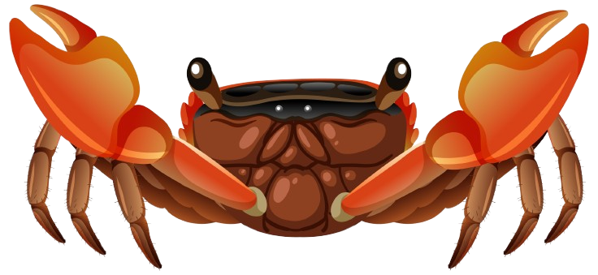

\sinc

# Criaturas

Además de las bestias de Mausritter, puedes usar en tus encuentros criaturas específicas de MausTiki. En principio, no existen en las islas del Pacífico las siguientes criaturas: gato, hada y fantasma.

&nbsp;

\conc

## Mo‘o, lagarto cambiaforma

XXX

* **PG** X, **FUE** X, **DES** X, **VOL** X
* **Armadura** X
* **Ataques:** XXX
* **XXX**
  1. **XXX:** XXX
  2. **XXX:** XXX
  3. **XXX:** XXX
  4. **XXX:** XXX
  5. **XXX:** XXX
  6. **XXX:** XXX

\sc

## Cangrejo

Tienen muchas formas, pero todos son tozudos y agresivos.

* **PG** 10, **FUE** 12, **DES** 10, **VOL** 9
* **Armadura** 3
* **Ataques:** d8 pinzas
* **Especies de cangrejos**
  1. **De roca:** De pequeño tamaño, pueden convertirse en animales domésticos que criar, FUE 8, d6 pinzas.
  2. **Ermitaño:** Pequeño y sabio, viven en conchas, DES 10.
  3. **Caja:** Buenos cavadores y fuertemente acorazados, armadura 5. Su cáscara es buena para hacer armaduras.
  4. **Araña de mar:** Delgados con largas patas.
  5. **De los manglares:** De buen tamaño, viven entre las raíces de las plantas que forman los manglares.
  6. **Kona:** Fieros luchadores, su carne es muy apreciada para grandes ceremonias.

\sp

## Tortuga

Estás amistosas criaturas siempre están dispuestas a ayudar y a transportarte por el mar sobre su caparazón.

Algunas son tan antiguas como las propias islas y son muy sabias, tan sabias que hablan hasta la lengua de los kiores.

* **PG** 11, **FUE** 12, **DES** X6, **VOL** 14
* **Armadura** 6
* **Ataques:** d8 mordisco
* **Especies de tortugas**
  1. **Tortuga laúd:** XXX
  2. **Tortuga carey:** XXX
  3. **Tortuga verde:** XXX
  4. **XXX:** XXX
  5. **XXX:** XXX
  6. **XXX:** XXX
  
  \sc