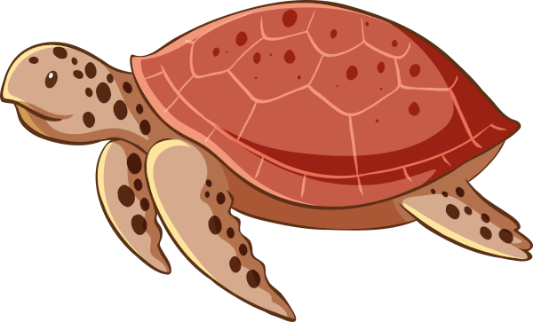
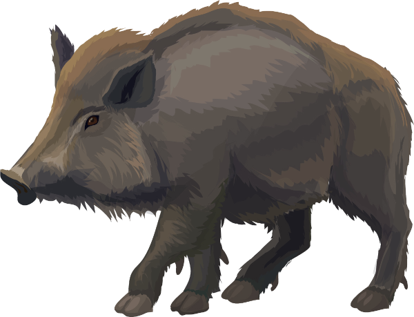

\sinc

# Criaturas

Además de las bestias de Mausritter, puedes usar en tus encuentros criaturas específicas de MausTiki. En principio, no existen en las islas del Pacífico las siguientes criaturas: gato, hada y fantasma.

&nbsp;

\conc

## Moʻo, espíritu acuático cambiaforma

Las moʻos suelen adoptar la forma de reptiles monstruosos, geckos o riokes. Por eso se les considera a veces como kupuas, pero son veneradas como aumakuas (espíritus familiares). Suelen tener poderes sobre el clima y el agua. Son anfibias y suelen frecuentar pequeñas masas de agua dulce como estanques, pozas o remansos de los ríos. 

Cuando una moʻo muere, su cuerpo se petrifica y se convierte en parte del paisaje, lo cual explica las extrañas formas que pueden tomar las piedras.

Según los cuentos, cada moʻos tiene una habilidad excepcional, algo que hacen extraordinariamente bien, quizás sean unas surfistas increíbles, grandes artesanas o excepcionales cantantes. Puede que tus riokes tengan que buscar una moʻo con habilidades especiales que les ayude.

* **PG** 12, **FUE** 14, **DES** 12, **VOL** 12
* **Armadura** 2
* **Ataques:** d8, según su forma actual varía su ataque
* **Forma actual**
  1. **Rioke:** Suele ser alguien conocido, ataque con algún tipo de arma rioke
  2. **Gecko:** Trepa por todas partes, incluso bocabajo, ataque de mordisco
  3. **Camaleón:** Nada escapa de su visión, ataque de lengua
  4. **Lagarto:** Corren a gran velocidad, ataque de mordisco
  5. **Salamandra:** Puede respirar bajo el agua y nadar a gran velocidad, coletazo como ataque
  6. **Dragón (Iguana gigante):** PG 24, armadura de escamas extra 4, ataque d10 de mordisco y de cola
&nbsp;

## Cangrejo

\sp

Tienen muchas formas, pero todos son tozudos y agresivos.

* **PG** 10, **FUE** 12, **DES** 10, **VOL** 9
* **Armadura** 3
* **Ataques:** d8 pinzas
* **Especies de cangrejos**
  1. **De roca:** De pequeño tamaño, pueden convertirse en animales domésticos que criar, FUE 8, d6 pinzas.
  2. **Ermitaño:** Pequeño y sabio, viven en conchas, DES 10.
  3. **Caja:** Buenos cavadores y fuertemente acorazados, armadura 5. Su cáscara es buena para hacer armaduras.
  4. **Araña de mar:** Delgados con largas patas.
  5. **De los manglares:** De buen tamaño, viven entre las raíces de las plantas que forman los manglares.
  6. **Kona:** Fieros luchadores, su carne es muy apreciada para grandes ceremonias.

&nbsp;

## Tortuga

Estas amistosas criaturas siempre están dispuestas a ayudar y a transportarte por el mar sobre su caparazón.

Algunas son tan antiguas como las propias islas y son muy sabias, tan sabias que hablan hasta la lengua de los kiores.

* **PG** 11, **FUE** 12, **DES** 6/16*, **VOL** 14
* **Armadura** 6
* **Ataques:** d8 mordisco
* **Áreas de conocimiento**
  1. **Tortuga laúd:** XXX
  2. **Tortuga carey:** XXX
  3. **Tortuga verde:** XXX
  4. **Tortuga tora:** La tortuga marina más grande todas. XXX
  5. **Tortuga paslama:** XXX
  6. **XXX:** XXX
  
_&ast; En tierra/en el agua_

&nbsp;
  
## Kupua menor

Los kupuas son espíritus normalmente diabólicos y vengativos con poderes de cambiaformas. Se asemejarían a demonios europeos.

No son grandes espíritus, sino menores con ciertas capacidades mágicas relacionadas con su forma alternativa. Si se transforma en ave puede volar y tiene garras terribles, si se transforma en tiburón puede nadar como un pez y tiene terribles dientes.

Suelen ser más embaucadores y tramposos que agresivos y beligerantes, pero si tienen que atacar lo harán sin dudar.

* **PG** X, **FUE** X, **DES** X, **VOL** X
* **Armadura** X
* **Ataques:** XXX
* **Se transforma**
  1. **Halcón marino:** XXX
  2. **Raya:** XXX
  3. **Tiburón:** XXX
  4. **Cerdo salvaje:** XXX
  5. **Búho:** XXX
  6. **Fuego:** XXX

\sp

##  Cerdo salvaje

Los cerdos son animales de pulsiones y cuando tienen una necesidad se ponen a buscar aquello que cubre la necesidad. Si tienen sed, buscan agua, si tienen calor, barro donde remojarse, etc. Su ánimo y actitud dependerá de que están buscando.

* **PG** 15, **FUE** 15, **DES** 12, **VOL** 8
* **Armadura** 2
* **Ataques:** colmillos d6 (d8 si corre y carga) 
* **Está buscando**
  1. **Agua para beber:** Les pedirá su agua (u otros líquidos) o les atacará. Si les dan agua, cada rioke pierde un uso de las raciones.
  2. **Barro para remozarse:** Pasará de largo sin preocuparse de los riokes, lo único que quiere es refrescarse en el barro.
  3. **Árbol adecuado para rascarse:** Solo necesita que le rasquen en ese punto que no llega.
  4. **Frutas:** Si llevan raciones con dibujos de fruta, las olerá y exigirá que se las den o les atacará. Si les dan agua, cada rioke pierde un uso de las raciones.
  5. **Bronca:** Simplemente busca bronca para divertirse, huirá cuando alguna estadística baje de la mitad.
  6. **Colmillo roto:** Es miembro del Colmillo Roto y atacará a los riokes.

\sc

## Espectros de los ancestros

XXX

* **PG** X, **FUE** X, **DES** X, **VOL** X
* **Armadura** X
* **Ataques:** XXX
* **XXX**
  1. **XXX:** XXX
  2. **XXX:** XXX
  3. **XXX:** XXX
  4. **XXX:** XXX
  5. **XXX:** XXX
  6. **XXX:** XXX

&nbsp;

## Facciones

### Colmillo roto

#### Recursos

* XXX
* XXX
* XXX

#### Objetivos

◯◯◯ XXX

◯◯◯ XXX

◯◯◯ XXX

### Fuego Purificador

#### Recursos

* XXX
* XXX
* XXX

#### Objetivos

◯◯◯ XXX

◯◯◯ XXX

◯◯◯ XXX