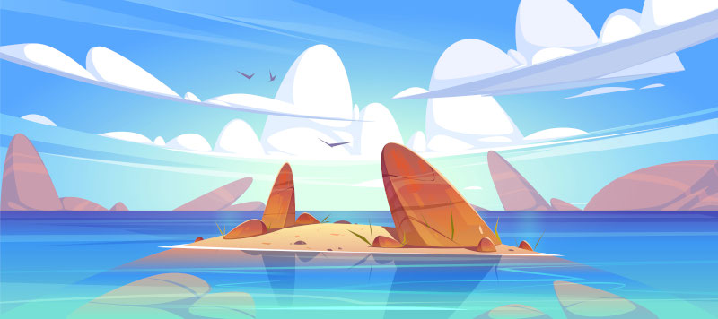

\sinc

# Exploración

\conc

MausTiki usa las mismas reglas de exploración que el manual básico de Mausritter, pero tiene sus propias tablas de tipo de hexágono y de puntos de interés. Están adaptadas a la orografía, los elementos geográficos, las construcciones que pudieran encontrarse en una isla del Pacífico. 

Además, hay también tablas adaptadas a la exploración de zonas costeras, como playas, arrecifes, bancos de arena y mar abierto.

Por último, tenemos también tablas de clima para simular la climatología de la zona.

## Exploración terrestre

La exploración terrestre sigue exactamente las reglas de Mausritter con la salvedad de que tiene sus MausTiki tiene sus propios tipos de terreno.

|1d6|Tipo|
|---|---|
|1-2|Selva|
|3-4|Pradera|
|5|Río|
|6|Volcán|

## Exploración marítima

El océano es un elemento fundamental de la vida de los kiores. Es una fuente de recursos y riqueza, pero también un peligro constante y una frontera que explorar. Es por ello que adentrarse en aguas desconocidas debería ser un elemento importante en las aventuras de MausTiki.

La exploración de zonas marítimas exige tener embarcaciones adecuadas. 

* A pie o nadando solo puedes explorar playas.
* Con tablas de surf solo puedes explorar playas.
* Con canoas solo playas, islotes y arrecifes. 
* Para salir a mar abierto necesitas embarcaciones preparadas como un catamarán.

|1d6|Tipo|
|---|---|
|1-2|Playa|
|3-4|Arrecifes|
|5|Islote|
|6|Mar abierto|

## Clima

En la mayoría de las islas del Pacífico solo existen dos estaciones, verano (kau) e invierno (hooilo). Las temperaturas no varían muchos entre estaciones (de 25 a 30 °C). La única diferencia entre ellas es la cantidad de lluvia.

Las únicas zonas donde las temperaturas son bajas, incluso puede haber nieve, son en las cimas de las montañas donde la temperatura puede bajar a casi 0 °C.

Si viajas con resultados de clima en negrita cada ratón debe pasar una salvación de FUE o quedará Cansado.

\sp

### Kau

El verano va de mayo a octubre y la temperatura promedio durante el día es de 29 °C a nivel del mar.

|2d6|Clima|
|---|---|
|2|Calma total|
|3-7|Suave y refrescante brisa|
|8-9|Día de **sol asfixiante**|
|10-11|**Lluvia**|
|12|**Tormenta** con truenos y relámpagos|

|1d6|Eventos estacionales|
|---|---|
|1|Eclosión de los huevos de tortuga y regreso al mar|
|2|Apareamiento de tortugas marinas en la playa|
|3|Un cadáver de tiburón es arrastrado a la playa|
|4|Tormenta eléctrica incendia un árbol|
|5|Mareas vivas, el agua llega hasta casi el poblado o se retira muchos metros más de lo normal|
|6|Niebla de Pele|

### Hooilo

El invierno (hooilo) va de noviembre a abril. En invierno la temperatura promedio durante el día es de 25 °C.

|2d6|Clima|
|---|---|
|2|Calma total|
|3-6|Día soleado|
|7-9|**Lluvia**|
|10-11|**Tormenta** con truenos y relámpagos|
|12|**Tifón**|

|1d6|Eventos estacionales|
|---|---|
|1|Medusas luminiscentes se acercan a la playa y la iluminan de noche|
|2|La cima del volcán se llena de nieve, quizás Poliʻahu (diosa de la nieve) visite a su hermana Pele|
|3|Florecen muchísimas flores, es perfecto para hacer collares eli|
|4|Ave migratoria perdida aterriza en la playa|
|5|Mareas vivas, el agua llega hasta casi el poblado o se retira muchos metros más de lo normal|
|6|Niebla de Pele|

### La niebla de Pele

```
Ves esa niebla oscura que baja de la montaña sagrada y que hace el aire irrespirable, eso quiere decir que Pele tiene un mal día. Cuando nosotros tenemos un mal día pues te aguantas y sigues adelante. Cuando una divinidad tiene un mal día, el resto lo sufrimos.
```

Los Volcanes, sobre todo los activos, pueden entre muchas otras cosas expulsar diferentes productos sólidos, líquidos y gaseosos. 

La niebla de Pele son nubes de sulfuro que bajan desde las fumarolas del volcán hacia la falda y pueden acabar llegando a la costa si el viento ayuda.

Estas nieblas son muy tóxicas y los kiores han aprendido a diferenciarlas de las nieblas normales y a evitarlas. El problema se da cuando estás nieblas se acercan a sus asentamientos y deben abandonarlo todo en minutos para no morir asfixiados.

> Al principio de cada turno que pases dentro de la niebla debes hacer una tirada de FUE y si fallas durante ese turno, mientras sigas dentro de la niebla, tendrás desventaja a todas las tiradas.

Tradicionalmente, se cuenta que la diosa del fuego Pele, que vive en el cráter del volcán, lanza estas nubes asesinas cuando está enfadada con los riokes.

\sp

Si no la aplacan su ira crecerá y hará que su volcán lance piroclastos, expulse ríos de lava y emanen nubes de gas.

La vulcanología dice que las nieblas de Pele son normales en los volcanes del pacífico y típicos cuando están activos, con lo que es normal que tarde o temprano entren en erupción.

\sinc

## Encuentros

\conc

Tenemos **4 terrenos terrestres (selva, pradera, rio y volcán) y 4 terrenos marítimos (playa, arrecifes, islote y mar abierto)** al explorar una isla y cada uno tiene su propia tabla de encuentros.

### Encuentros selva

Los riokes no suelen adentrarse en la selva, hay seres que se esconden en el follaje esperando cazarlos y devorarlos. Pero donde hay peligros también hay grandes oportunidades en forma de aliados y tesoros.

|1d6|Encuentro selva|
|---|---|
|1|Frutas silvestres (1 tarjeta de raciones)|
|2|Murciélagos de la fruta durmiendo entre los árboles|
|3|Plantas de kava lista para recolectar sus raíces|
|4|1 cerdo salvaje sale de la espesura|
|5|Huellas de serpiente|
|6|Mo'o con la apariencia de alguien conocido|

### Encuentros pradera

Cerca de las faldas de las montañas y de las playas suele haber praderas que los riokes suelen usar para cultivar tubérculos, criar abejas, etc. La hierba baja y la ausencia de árboles y arbustos hacen que las emboscadas de depredadores sean raras.

|1d6|Encuentro pradera|
|---|---|
|1|Taros y batatas perfectas para cosechar (1 tarjeta de raciones)|
|2|XXX|
|3|Ruinas de los ancestros|
|4|Huellas de serpiente|
|5|Una águila marina sobrevuela la pradera|
|6|Un cerdo salvaje furioso cargando hacia vosotros|

### Encuentros río

Pequeños arroyos y lagos navegables abundan en las islas del Pacífico y son la principal fuente de agua dulce, lo que hace que sea necesario para todo el mundo (depredadores y presas) acudir a estos sitios para conseguir agua dulce. Además, mucho kupuas están asociados con estas masas de agua, lo que hace que visitarlos se vuelva una aventura en sí misma.

|1d6|Encuentro río|
|---|---|
|1|Guijarros adecuados para la honda (1 tarjeta de piedras)|
|2|XXX|
|3|XXX|
|4|XXX|
|5|Una cueva secreta detrás de una catarata|
|6|Mo'o en forma de dragón (iguana) toma el sol en una piedra cerca del agua|

\sp

### Encuentros volcán

Los volcanes son los lugares más peligrosos de la isla y solo unos kiores desesperados buscando la ayuda de los dioses osarían siquiera acercarse a su falda.

Los encuentros en el volcán tienen siempre un carácter mágico y divino, ya que el volcán es donde viven los dioses y los kupuas.

|1d6|Encuentro volcán|
|---|---|
|1|Una caverna que lleva al interior del volcán|
|2|El terreno sobre vuestros pies salta por los aires, quizás aterrices cerca o puede que acabes en el agua de mar.|
|3|Un río de lava os corta el camino|
|4|1d4 kupuas danzando y bailando alrededor de una estatua de un tiki desconocido|
|5|Del suelo sale varios chorros de gas tóxico y corrosivo|
|6|1d4 kupuas discuten con otro grupo de 1d4 kupuas alrededor de un roedor inconsciente|

### Encuentros playa

La playa puede traer cosas sorprendentes con cada pleamar y destapar objetos enterrados con cada bajamar.

|1d6|Encuentro playa|
|---|---|
|1|Algas comestibles (tarjeta de raciones)|
|2|1d4 cangrejos de especies aleatoria|
|3|Un grupo de kiores surfistas|
|4|Almejas de excelente calidad (50 ca)|
|5|2 gaviotas hambrientas peleándose por un pez muerto|
|6|1 objeto extraño traído por la marea (Coge algún objeto raro para los riokes, como una botella de cristal o un espejo, de la lista de equipo)|

### Encuentros arrecifes

Los encuentros en los arrecifes pueden darse tanto cuando están en una ambientación como cuando ha bajado la marea y se mueven entre las rocas.

|1d6|Encuentro arrecifes|
|---|---|
|1|Moluscos frescos (1 tarjeta de raciones)|
|2|1d4 cangrejo de especie al azar|
|3|Aleta de tiburón sobresaliendo de la superficie del mar|
|4|Una raya pasa por debajo|
|5|Una tortuga laúd contando interesantes historias o un grupo de crías de tortugas|
|6|1 roedor/a inconsciente con extraños ropajes entre las rocas|

### Encuentros islote

En estos pequeños islotes que rodean la isla puedes encontrarte lo que sea, pero sobre todo recursos como comida y cosas traídas por el mar.

|1d6|Encuentro islote|
|---|---|
|1|Guijarros adecuados para la honda (1 tarjeta de piedras)|
|2|Tortuga marina buscando algo entre las rocas|
|3|Trozo de madera noble (20 ca)|
|4|Una mantaraya da vueltas alrededor del islote|
|5|Cueva submarina|
|6|Un cofre de madera cerrado y cubierto de algas|

### Encuentros mar abierto

Si estar preparado el mar abierto puede ser tan peligrosa como un volcán. Las tormentas y los tifones son muy peligrosos y tu embarcación es una presa facil para tiburones. Pero solo podrás llegar a otras islas y vivir grandes aventuras si sales a mar abierto.

|1d6|Encuentro mar abierto|
|---|---|
|1|Ballena|
|2|Tortuga marina|
|3|Embarcación comercial de otra isla|
|4|Embarcación militar de otra isla|
|5|Tiburón|
|6|Restos de una embarcación con alguien encima|

\sp

\sinc

&nbsp;

### Punto de interés en exploraciones terrestres

|1d20|Selva|Pradera|Río|Volcán|
|---|---|---|---|---|---|
|1|XXX|Muro de piedra|XXX|Placas de lava solidificada|
|2|XXX|Sendero|Estanque|XXX|
|3|Claro|Manantial|Cataratas|Aguas termales|
|4|Madriguera|Tocón|Árbol caído que cruza el río|XXX|
|5|XXX|XXX|XXX|Fisuras en el suelo que emanan calor|
|6|Extrañas marcas en los troncos|[Baiano](https://es.wikipedia.org/wiki/Baniano) solitario|XXX|XXX|
|7|XXX|Arroyo|XXX|XXX|
|8|XXX|XXX|Rápidos|XXX|
|9|Árbol derrumbado|XXX|XXX|XXX|
|10|XXX|XXX|Puente de madera en malas condiciones|Fumarola de vapor sulfúrico|
|11|Lianas|Hierba muy alta|XXX|XXX|
|12|XXX|Pozo abandonado|Afluente|XXX|
|13|Bayas salvajes|Gran piedra plana|XXX|XXX|
|14|XXX|XXX|Remanso|Géiser|
|15|XXX|XXX|Juncos y cañas|XXX|
|16|Madriguera abandonada|XXX|Vado|XXX|
|17|XXX|[Tamanu](https://es.wikipedia.org/wiki/Calophyllum_inophyllum) solitario|XXX|Fumarola de vapor de agua|
|18|Antiguas lápidas riokes|XXX|Zona pantanosa|XXX|
|19|XXX|XXX|Presa natural|XXX|
|20|Mango lleno de frutos|XXX|Puente de madera|Río de lava|

\conc

\sp

\sinc

[](https://www.freepik.com/free-vector/sea-landscape-with-shallow-with-rocks-clean-water-fluffy-clouds_11685189.htm "Sea landscape with shallow with rocks in clean water under fluffy clouds by upklyak")

&nbsp;

### Punto de interés en exploraciones marítimas

|1d20|Playa|Arrecife|Islote|Mar abierto|
|---|---|---|---|---|---|
|1|Cantos rodados|XXX|XXX|Agua|
|2|Moluscos enterrados|XXX|XXX|XXX|
|3|XXX|Restos de catamarán|XXX|Agua|
|4|Dunas bajas|XXX|XXX|XXX|
|5|XXX|XXX|XXX|Agua|
|6|Algas secas|XXX|XXX|XXX|
|7|Cientos de pequeñas medusas|XXX|XXX|Agua|
|8|Dunas altas|XXX|XXX|XXX|
|9|Pozas de marea|Conchas gigantescas|XXX|Agua|
|10|Canoa rota|XXX|XXX|XXX|
|11|Redes de pesca abandonada|XXX|XXX|Agua|
|12|XXX|XXX|XXX|XXX|
|13|Una medusa carabela portuguesa|XXX|XXX|Agua|
|14|XXX|XXX|XXX|XXX|
|15|Dunas gigantes|XXX|XXX|Agua|
|16|Cadáver de tiburón|XXX|XXX|sargazos|
|17|Riachuelo que da al mar|XXX|XXX|Agua|
|18|XXX|Campo de flores|XXX|Aleta de tiburón|
|19|Tabla de surf rota|XXX|XXX|Agua|
|20|XXX|Coral morado|XXX|XXX|

\conc