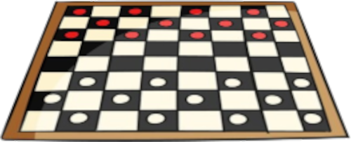

\sinc

&nbsp;

## Inventario

\conc

MausTiki tiene sus propios objetos de inventario, adaptados a las características de las islas del Pacífico, a su clima y a los materiales que en ella se puede encontrar.

Como ya hemos dicho en apartados anteriores puedes hacer uso del equipo del manual básico de Mausritter, sobre todo si metes roedores de más allá del mar en tus aventuras.

Un punto importante del equipo es que el metal no es desconocido para los kiores, pero es escaso y no son hábiles forjando el metal. Sin embargo, sí son buenos trabajando la madera.

> Los precios están en conchas de caracol azul (ca) y si algo no tiene precio considera que no es algo que se compre fácilmente, como las embarcaciones. Seguramente que tendrás que pedir favores para hacerte con unos de esos objetos.

### Armas

Los kiores disponen de una gran variedad de lanzas de todos los tamaños (pequeñas, medidas y pesadas) y tanto de cuerpo a cuerpo como a distancia.

Como curiosidad diremos que son diestros con la onda que es usada como arma de guerra, mientras que el arco y las flechas se reservan normalmente para la caza.

#### Leiomano (50 ca)

Esta arma similar a una pala de jugar a pelota tiene el borde lleno de pequeños dientes de tiburón insertados.

#### Tao (40 ca)

Lanza de madera normalmente con una punta hecha del pincho de un pez espada o de los afilados huesos de la cola de una raya.

#### Tridente (15 ca)

Este utensilio perfecto para la pesca de pequeños peces y crustáceos puede usarse como una eficaz arma de combate.

#### Remo (5 ca)

Estas contundentes herramientas de madera tienen lados afilados en la parte de la pala y buenos mangos para asiarlos bien y dar golpes contundentes, así que son unos utensilios muy útiles tanto para navegar como para combatir.

Las armas, sobre todo las grandes de madera, están profusamente decoradas con motivos geométricos y marítimos, convirtiéndolas muchas veces en auténticas obras de arte. También es normal que tengan elementos decorativos como, penachos de plumas u hojas trenzadas de vivos colores.

\sp

### Armaduras

Las armaduras están hechas principalmente de materiales naturales de origen animal o vegetal.

En las armaduras siempre ha primado elementos como que sean frescas y se pueda nadar con ellas, frente a que sean duras y resistentes. Es por ello que nos movemos desde hoja de palma hasta conchas y cáscaras de cangrejos, pasando por la dura corteza del coco.

Todas las armaduras previenen 1 de daño.

#### Protecciones de palma trenzada (50 ca)

Estas protecciones están hechas de varias capas de hojas de palma trenzadas. Se crean protecciones para diferentes partes del cuerpo. No son especialmente resistentes, pero son baratas, fáciles de fabricar, ligeras y flexibles. Ocupan una casilla de cuerpo.

Después de cada combate pierden siempre una casilla de uso. También pierdes un uso si nadas o te sumerges con ella. Durante un descanso largo o completo puedes reafirmar y sustituir las fibras y recuperar 1 uso.

#### Armadura de placas de coco (150 ca)

Está armadura aprovecha las fibras del coco para crear un camisote robusto sobre el que se cosen láminas de corteza de coco. Viene acompañado de una rodela hecha de media coco. Ocupa una casilla de cuerpo y pata secundaria. Flota, debido a sus fibras, pero no puedes sumergirte.

#### Armadura de conchas (400 ca)

Esta armadura está hecha de las conchas que se encuentran en la playa cosidas mediante fibras de coco. Su diseño aprovecha las formas orgánicas y curvas de las conchas para ajustarse al cuerpo del kiore. Las almejas sirven de placas pectorales, los caracoles de protecciones de codos y rodillas y las lapas son perfectas hombreras y cascos. Ocupa dos casillas de cuerpo. No puedes nadar con ella, se hunde por el peso, pero puedes sumergirte.

#### Armadura de cangrejo (500 ca)

XXX. Ocupa dos casillas de cuerpo. Puedes nadar con ella o, si quieres, sumergirte.

### Equipo vario

La alimentación de los kiores se basa más en frutos tropicales que en cereales y raíces, con lo que sus raciones de viaje suelen ser principalmente frutas y tubérculos, así como pescados y crustáceos secos.

#### Kava (5 ca)

La kava es una planta de la que se saca una bebida con efectos psicoactivos. Produce relajación muscular, somnolencia y ganas de hablar. Se ha utilizado tradicionalmente para tratar para aliviar infecciones, dolores, estrés e insomnio. La raíz se muele con un trozo de coral y se le añade agua fría para poder beberla.

#### Konane (15 ca)

El konane es una juego de mesa, muy parecido a las damas o el go. El konane se juega utilizando pequeños trozos de coral blanco y lava negra sobre una gran roca tallada y o un tablón de madera que funcionaba como tablero y mesa. Se considera un juego de roedores inteligentes y las competiciones son de muy alto nivel.

\sp

#### Herramientas de tatuaje (120 ca)

XXX

#### Tambor de calabaza Ipu (20 ca)

XXX

### Embarcaciones

Mientras que otros roedores han dedicado muchos esfuerzos en aprender a escalar árboles y paredes o cavar madrigueras, los kiores se han convertido en diestros y hábiles marineros para los que las azules aguas del mar no tienen secretos.

#### Canoa (120 ca)

Está embarcación tallada del tronco de un árbol, permite una tripulación de 3 kiores, dos remando más un tercer pasajero. 

Puedes ser muy simples o estar profusamente decoradas con motivos vegetales, animales, geométricos o mitológicos. Es el medio de transporte principal y sirve tanto en el mar como en los ríos.

#### Tabla de surf (80 ca)

XXX. Permite una tripulación de 1 kiore.

#### Catamarán

XXX. Según el tamaño podría permitir desde 4 a 20 roedores con su equipaje y agua y comida para un largo viaje.

