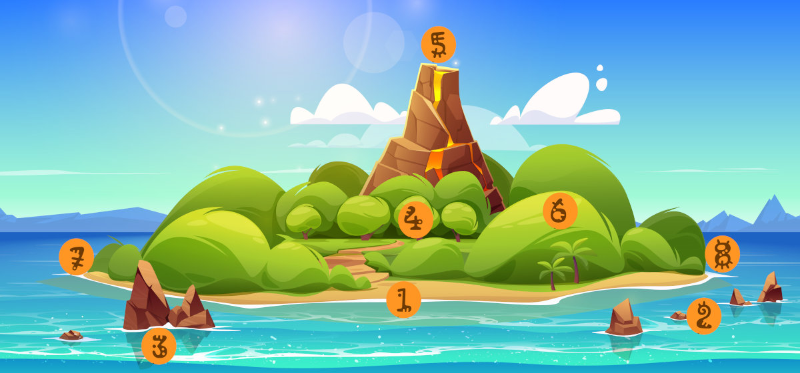

\sinc

## La comunidad de Kaona Iole

\conc

XXX

En la comunidad de Kaona Iole principalmente hay kiores o ratas del Pacífico.

[](https://www.freepik.com/free-vector/tropic-rest-flat-icons-set-bungalow-equipment-beach-vacation-isolated-vector-illustration_26765555.htm "Tropic rest flat icons set of bungalow and equipment for beach vacation isolated vector illustration by macrovector")

### Situación 

Kaona Iole está situada en la cara sur de la isla, en la playa más grande de la isla, ya que el norte son acantilados y en la costa este y oeste solo hay pequeñas calas.

XXX

Aunque a los kiores les puedan parecer una isla inmensa, para los humanos no es más que un islote volcánico sin interés. Es por ello que nunca lo han colonizado. Han pasado cerca con sus catamaranes, pero nunca han desembarcado.

\sp

\sinc

### El mapa 

[](https://www.freepik.com/free-vector/tropical-volcano-island-sea-cartoon-landscape_50471227.htm "Tropical volcano island in sea cartoon landscape by upklyak")

&nbsp;

\conc

#### 1. La playa

XXX

Al lado este de la playa hay una gran cantidad de palmeras cocoteras donde gran cantidad de kiores van todos los días a recolectar cocos para conseguir comida y materias primas.

#### 2. Los arrecifes

Una red de arrecifes rodea la playa desde el cabo este al oeste de forma que las aguas alrededor de la playa no dan a mar abierto. Por otro lado, los arrecifes hacen que el oleaje no entre en la playa con tanta fuerte y que depredadores como tiburones no tengan facil acercarse al arenal y depredar los riokes que allí estén pescando, recolectando moluscos o simplemente nadando o surfeando.

XXX

#### 3. El islote de Hāʻupu

Hāʻupu era un gigante que vivía en estas islas que expulsaba a los intrusos lanzando grandes piedras desde la playa. Fue engañado por Mausi para quedarse quieto en la playa y paso tanto tiempo allí que se convirtió en piedra y formo este islote.

XXX

Durante las mareas vivas el agua baja tanto que puede llegarse al islote andando.

#### 4. La selva

XXX

#### 5. El volcán

XXX

#### 6. Atalaya

Al este de la playa hay una gran colina en cuya cima los riokes de Kaona Iole han establecido una atalaya de vigilancia, ya que domina todo el lado este de la isla. 

En esta atalaya se encuentra un pututu, una concha de caracol de mar gigante, que suena en la pleamar y la bajamar. En caso de ataques enemigos y de depredadores terrestres o marinos también se hace sonar para avisar a la gente del poblado, la gente que esté en la playa e incluso a los que están en las praderas y bosques cercanos.

XXX

\sp

#### 7. Cabo oeste

XXX

En el macizo de piedra que forma el cabo oeste hay una red de cavidades naturales, llamadas las «cuevas de los ancestros». En caso de desastre se usan de refugio pero solo las cavidades más externas.

Se suponen que las salas más internas de estas cavernas están habitadas por aumakuas, espíritus de los ancestros. Así que adentrarse en el interior de las cavernas es tabú, está prohibido. Las leyendas hablan de riquezas y magia poderosa en su interior, pero por ahora nadie ha querido adentrarse o sí lo ha hecho ha vuelto para contarlo.

#### 8. Cabo este

XXX

El cabo este es el mejor lugar de la isla para coger olas gracias al viento del este y los jóvenes surfistas suelen hacer excursiones a esta zona para pillar olas. No es raro si pasas por esta zona encontrarse pequeños campamentos en sus pequeñas calas.

### El mar y la playa

Vivir en una playa de una isla significa que el mar es un elemento fundamental de la sociedad y la cultura de este enclave. Eso hace también que la construcción, uso y reparación de embarcaciones sea también muy importante.

XXX

```
Las canoas están seguras en la playa, pero no fue para lo que se crearon.
```

XXX

### El volcán

XXX

### Los ancestros

XXX

### Clima

En Kaona Iole solo existen dos estaciones, verano (kau) e invierno (hooilo). Las temperaturas no varían muchos entre estaciones (de 25 a 30 °C). La única diferencia entre ellas es la cantidad de lluvia. El problema es que las tormentas pueden convertirse en tifones que pueden arrasar toda la isla, derribando árboles e inundando terrenos secos.

Si la tormenta se convierte en tifón, los riokes empacan lo indispensable y huyen a las «cuevas de los ancestros», una red de cavidades en la roca en la punta oeste donde se refugiaron durante siglos los primeros kiores que llegaron a la isla.

### Mareas 

Las **mareas son una parte muy relevante de la vida del asentamiento** y avisar a sus habitantes de las subidas y bajadas de la marea es una ocupación crucial.

Las mareas marcan cuando salir a pescar, cuando bajar a la playa a recoger algas, etc. y como son cambiantes es muy necesario tenerlas controladas.

En cada luna nueva se eligen 5 grupos de 4 miembros, un grupo por cada fase lunar. Cada grupo tiene la obligación de avisar cuando está alta y cuando está baja la marea haciendo sonar un pututu, un caracol gigante de mar, con unas notas para la pleamar y otras para bajamar.

Cada roedor del grupo suele encargarse de vigilar una de las 4 mareas y cuando hace sonar el pututu, el siguiente roedor viene a sustituirle y este es libre hasta.

> Existe la creencia de que la marea dicta tu destino y si naces mientras suena el pututu de las mareas, están destinados a hacer grandes cosas, tú decidirás si beneficiosas para el asentamiento o terribles.

\sp

Tu trabajo no solo es avisar de las mareas, también deben hacer de vigías en una talaya en una palmera cercana. Deben avisar de tiburones que pasen el arrecife, de mantas que se acerquen a los pescadores y de tormentas inesperadas.

### Personalidades

#### El jefe XXX

XXX

#### Los 3 hermanos kahunas

XXX
