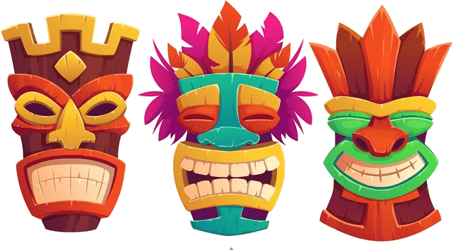

\sinc

# MausTiki [por Gwannon](https://gwannon.itch.io/maustiki)

**MausTiki** es mini-ambientacion para [Mausritter](https://losing-games.itch.io/mausritter) donde se explica como son los roedores de las islas del Pacífico y se describe Kaona Iole, una comunidad de kiores (ratas del Pacífico) situada en una playa de una isla del Pacífico.

Incluye una aventura larga donde tus kiores deberán aplacar la ira de los dioses si quieren que su playa sobreviva a la amenaza del volcán.

&nbsp;

\conc

## La comunidad de Kaona Iole

XXX

En la comunidad de Kaona Iole principalmente hay kiores o ratas del Pacífico.

### Situación 

XXX

### Mapa

XXX

### Clima y mareas 

Xxx

Las **mareas son una parte fundamental de la vida del asentamiento** y avisar a sus habitantes de las subidas y bajadas de la marea es una ocupación muy importante.

Las mareas marcan cuando salir a pescar, cuando bajar a la playa a recoger algas, XXX

En cada luna nueva se eligen 5 grupos de 4 miembros, un grupo por cada fase lunar. Cada grupo tiene la obligación de avisar cuando está alta y cuando está baja la marea haciendo sonar un pututu, un caracol gigante de mar, con unas notas para la pleamar y otras para bajamar.

Cada roedor del grupo suele encargarse de vigilar una de las 4 mareas y cuando hace sonar el pututu, el siguiente roedor viene a sustituirle y este es libre hasta.

> Existe la creencia de que la marea dicta tu destino y si naces mientras suena el XXX de las mareas, están destinados a hacer grandes cosas, tú decidirás si beneficiosas para el asentamiento o terribles.

Tu trabajo no solo es avisar de las mareas, también deben hacer de vigías en una talaya en una palmera cercana. Deben avisar de tiburones que pasen el arrecife, de mantas que se acerquen a los pescadores y de tormentas inesperadas.

### El mar y las embarcaciones

Vivir en una playa de una isla significa que el mar es un elemento fundamental de la sociedad y la cultura de este enclave. Eso hace también que la construcción, uso y reparación de embarcaciones sea también muy importante.

XXX

\sp

### Surf

```
Tangaloa nos enseño a construir tablas de surf y a usarlas para surcar las olas y por eso le veneramos. Sin el surf nuestras vidas estarían vacias y sin hopupu.
```

XXX

## El día a día

XXX

## Dioses 

## Depredadores

XXX

## Religión y dioses

XXX

### Pele, la diosa del fuego

Los roedores del enclave adoran a Pele, la diosa del fuego que habita el volcán. Periódicamente les recuerda su poder con alguna erupción explosiva a algún río de lava.

XXX

### Mausi, el héroe tramposo

XXX

### Aumakuas, espíritus familiares

XXX

### El volcán

XXX

\sp

\sinc

# Reglas

**MausTiki** modifica ciertas reglas de Mausritter y añade otras nuevas para representar la singularidad de asentamiento de Kaona Iole y las islas del Pacífico.

&nbsp;

\conc

### Cambios rápidos de reglas

Hay pequeños cambios en el reglamento original que te explicamos a continuación.

* Las monedas dejan de ser pepitas y pasan a ser conchas azules (ca).
* XXX

\sinc

## Trasfondos

Maustiki dispone de su propia tabla de trasfondos adaptada a la cultura polinesia y las características de las islas del Pacífico, pero puedes usar si deseas las originales del libro básico por ejemplo para roedores venidos del otro lado del mar que llegan a estas costas.

|PG+Conchas|Trasfondo|Objeto A|Objeto B|
|---|---|---|---|
|11|XXX|XXX|XXX|
|12|XXX|XXX|XXX|
|13|Cestero/a|XXX|XXX|
|14|XXX|XXX|XXX|
|15|Productor de kava|Mortero y maja|XXX|
|16|XXX|XXX|XXX|
|21|Recolector/a de cocos|XXX|XXX|
|22|XXX|XXX|XXX|
|23|XXX|XXX|XXX|
|24|Pescador/a|Red|Aguja (ligera, 1d6)|
|25|XXX|XXX|XXX|
|26|Bailarín/a de Hula|Traje de hula|XXX|
|31|Carpintero/a|XXX|XXX|
|32|Pastor/a de pulgas de mar|XXX|XXX|
|33|XXX|XXX|XXX|
|34|Recolector/a de algas|XXX|XXX|
|35|XXX|XXX|XXX|
|36|Tatuador/a|Herramientas de tatuador|Tinta|
|41|XXX|XXX|XXX|
|42|Recolector/a de moluscos|Pala|Cubo|
|43|Surfero/a|Tabla de surf|Cera|
|44|XXX|XXX|XXX|
|45|XXX|XXX|XXX|

\sinc

\sp

\sinc

|PG+Conchas|Trasfondo|Objeto A|Objeto B|
|---|---|---|---|
|46|Tejedor/a de hojas de palma|XXX|XXX|
|51|XXX|XXX|XXX|
|52|Buceador/a|XXX|XXX|
|53|XXX|XXX|XXX|
|54|Tragafuegos|Antorchas|Parafina|
|55|XXX|XXX|XXX|
|56|XXX|XXX|XXX|
|61|Cuentacuentos|XXX|XXX|
|62|XXX|XXX|XXX|
|63|XXX|XXX|XXX|
|64|XXX|XXX|XXX|
|65|XXX|XXX|XXX|
|66|XXX|XXX|XXX|

&nbsp;

## Inventario

\conc

XXX

El metal no es desconocido para los kiores, pero no son buenos herreros, pero sí son buenos carpinteros.

### Armas y armaduras

XXX

#### Armas

XXX

* **Leiomano:** Esta arma similar a una pala de jugar a pelota tiene el borde lleno de dientes de tiburón insertados.

#### Armadura

XXX

* Armadura de palma trenzada
* Armadura de placas de coco
* Armadura de conchas

### Otros

XXX

* **Kava (XXXca):** La kava es una planta de la que se saca una bebida con efectos XXX

### Embarcaciones

XXX

\sp

\sinc

## Magia tiki

\conc

En la época de los sueños los espíritus vivían entre los roedores, pero cuando el sueño se rompió, fueron encerrados dentro de diferentes elementos naturales como árboles, piedras, conchas marinas o incluso lava solidificada.

Los grandes kahunas aprendieron a crear con esos materiales unas máscaras tiki que tienen poderes mágicos según los espíritus que habitan dentro, pero ese conocimiento se perdió hace mucho tiempo y ahora solo se pueden conseguir buscando en lugares peligrosos y antiguos.

> Si lo deseas puedes usar las máscaras tiki, como si fueran las tablillas de obsidiana del manual básico de Mausritter o usar las reglas especiales para «MausTiki».

### Máscaras espirituales tiki

[](https://www.freepik.com/free-vector/tiki-masks-tribal-wooden-totems-hawaiian-polynesian-style-attributes-scary-faces-with-toothy-mouth_12682481.htm "Tiki masks, tribal wooden totems, hawaiian or polynesian style attributes, scary faces with toothy mouth by upklyak")

Las máscaras tienen una forma u otra según su material o sus poderes y no se pueden comprar ni vender, solo se pueden regalar, donar, entregar como dote, etc. Se consideran reliquias familiares que pasan de generación en generación. Su perdida se considera un augurio funesto y encontrar una máscara tiki significa una gran bonanza.

### Usar las máscaras

Para usar los poderes mágicos de los tikis, tu roedor debe ponerse la máscara y decir XXX en voz alta.

Cuando usas la magia del tiki, decides el Poder que usas con un máximo del número de usos que le queden a la máscara.

Tira tantos dados d6 como el Poder usado para lanzarlo. Por cada dado que saque 4-6, marca una casilla de uso en el hechizo.

El hechizo tiene un efecto, que varía dependiendo del número de [DADOS] invertido y la [SUMA] de la tirada.

### Enfadar al espíritu

Los espíritus de los tikis tienen una serie de tabús o leyes muy antiguos que aún siguen respetando y si los rompes pueden enfadarse contigo. Debes tirar una **salvación de VOL y si fallas obtienes la condición «Maldito»**.

### Recargar la máscara

Cuando se marquen todas las casillas de uso de una máscara tiki el espíritu de su interior queda agotado y la máscara pierde sus capacidades mágicas. 

Para restaurar al espíritu de la máscara debes cumplir una condición que devuelve al espíritu todo su poder y a la máscara todas sus casillas de uso.

\sinc

|2d8|Hechizo|Efecto|Recarga|Tabú|
|---|---|---|---|---|
|2|Fuego de Pele|XXX|Meterlo en lava|Debes encender siempre fuego durante un descanso largo o completo.|
|3|XXX|XXX|XXX|XXX|
|4|XXX|XXX|XXX|XXX|
|5|XXX|XXX|XXX|Prohibido tocar un anzuelo|
|6|XXX|XXX|XXX|XXX|

\conc

\sp

\sinc

|2d8|Hechizo|Efecto|Recarga|Tabú|
|---|---|---|---|---|
|7|XXX|XXX|XXX|XXX|
|8|XXX|XXX|XXX|XXX|
|9|XXX|XXX|XXX|XXX|
|10|XXX|XXX|XXX|XXX|
|11|XXX|XXX|XXX|XXX|
|12|XXX|XXX|XXX|XXX|
|13|XXX|XXX|XXX|XXX|
|14|Don de Hāʻupu|XXX|XXX|Prohibido lanzar piedras|
|15|XXX|XXX|XXX|XXX|
|16|XXX|XXX|XXX|XXX|

\conc

\sp

## Condiciones

XXX

### Maldito

XXX

## Surfear olas

XXX

## Criaturas

XXX

\sp

\sinc

# La playa y el volcán

\conc

XXX

\sc

\sp

## Licencia

«MausTiki» es una obra independiente creada por Jorge Monclús (@Gwannon) y no está afiliada ni a Losing Games ni a El Refugio de Ryhope. 
Se publica bajo la «Licencia a Terceros de Mausritter».

Los derechos de Mausritter son propiedad de Losing Games y de El Refugio de Ryhope (para la edición en castellano).

«MausTiki» está hecho bajo licencia [CC BY 4.0](https://creativecommons.org/licenses/by/4.0/legalcode.es). Todo el código fuente puedes encontrarlo en [GitHub/ideasRoleras/LaPlaya](https://github.com/gwannon/ideasRoleras/tree/main/EntregaElPaquete)

* Flat maori tattoo pattern by [Freepik](https://www.freepik.com/free-vector/flat-maori-tattoo-pattern_29507321.htm)
* Tiki masks, tribal wooden totems, hawaiian or polynesian style attributes, scary faces with toothy mouth by [upklyak](https://www.freepik.com/free-vector/tiki-masks-tribal-wooden-totems-hawaiian-polynesian-style-attributes-scary-faces-with-toothy-mouth_12682481.htm)
* Tiki masks with scary faces and toothy mouth, decorated with leaves isolated by [upklyak](https://www.freepik.com/free-vector/tiki-masks-with-scary-faces-toothy-mouth-decorated-with-leaves-isolated_12900249.htm)
* Flat design wood texture illustration by [freepik](https://www.freepik.com/free-vector/flat-design-wood-texture-illustration_22628444.htm)
* Parquet seamless pattern [rawpixel.com](https://www.freepik.com/free-vector/parquet-seamless-pattern_16269492.htm)

[](https://www.elrefugioeditorial.com/mausritter-licencia-a-terceros "Compatible con Masurítter material no oficial")

[Inspiración](https://itch.io/c/1521592/mausritter)

Buscar Mythic Polynesia - Mythras Roleplaying Game

\sp