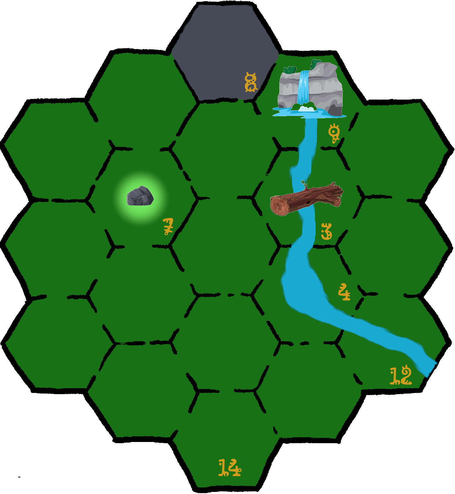

\sinc

## Mapas

### Mapa Buscando a la añeja Lamor

&nbsp;

|Casilla|Descripción|
|---|---|
|16|**Empiezan aquí**|

\conc

\sp

\sinc

### Mapa Camino al volcán

&nbsp;

|Casilla|Descripción|
|---|---|
|3|**Tronco sobre el río**|
|4|**Remanso del río:** Frecuentado por una Moʻo|
|7|**Claro del bosque con una gran piedra en el centro:** Encima de la piedra hay un grabado de lo que parece un mapa del tesoro.|
|8|***Falda del volcán**|
|9|**Cascada** Frecuentado por una Moʻo|
|12|**Cauce ancho del río**|
|14|**Empiezan aquí**|

\conc

\sp

\sinc

### Mapa El suelo es lava

&nbsp;

|Casilla|Descripción|
|---|---|
|2|**Trono de Pele**|
|4|**Río de lava**|
|5|**Río de lava**|
|6|**Río de lava**|
|11|**Río de lava**|
|14|**Empiezan aquí**|
|17|**Río de lava**|

\conc

\sp

\sinc

### Mapa de la cripta

&nbsp;

|Localización|Descripción|
|---|---|
|1|**Sala principal**|
|2|**Capilla**|
|3|**Receptoría**|
|4|**Tumbas y nichos de matais y kahunas**|
|5|**Tumbas y nichos de héroes y heroínas**|
|6|**Tumbas y nichos de otras personalidades**|
|7|**Accesos a las cuevas**|

\conc