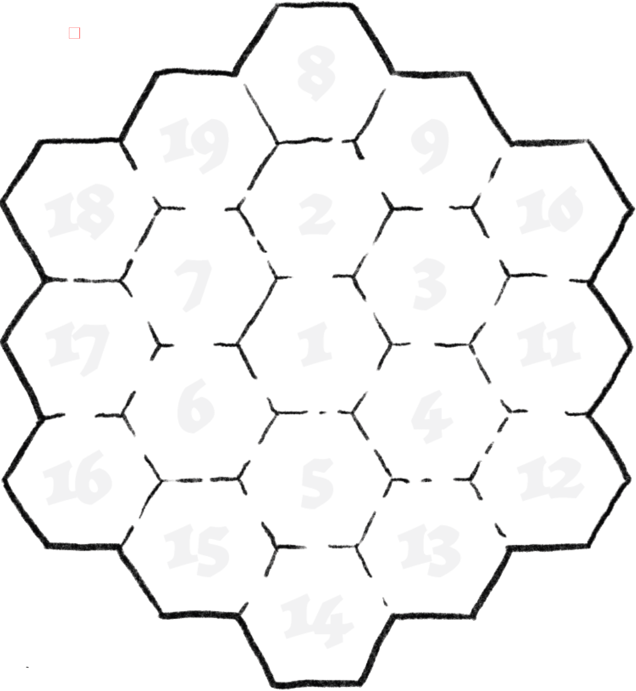
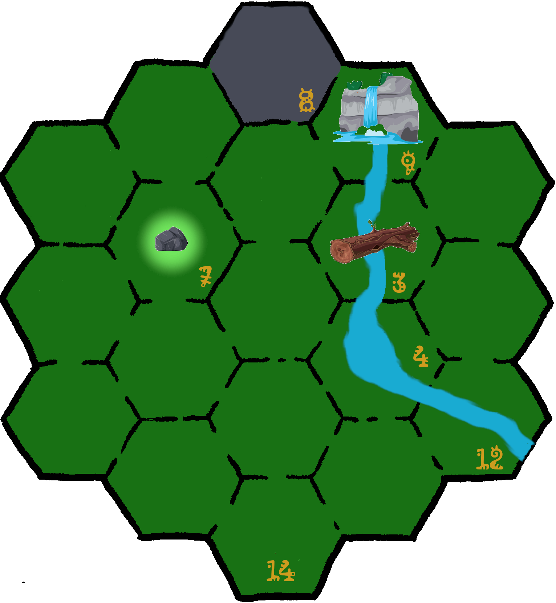

\sinc

# La diosa del volcán

\conc

La diosa Pele que vive en el volcán está enfadada con los habitantes de la isla porque olvidaron poner un tocado de plumas en su última ofrenda.

Como diosa del volcán es colérica e irascible y ya decidido mandar sus nieblas a la playa para castigar a sus XXX fieles.

XXX

\sinc

&nbsp;

## Problemas en Kaona Iole

\conc

Tus riokes estarán en su día a día trabajando según dicte su trasfondo, recolectando cocos, pescando, bailando hula, etc.

Sin previo aviso, el pututu de las mareas sonará con el tono de alerta. Desde el volcán desciende la niebla de Pele y parece mucho más grande que otras veces.

XXX

### La decisión de les kahunas

XXX

El jefe del asentamiento XXX pedirá voluntarios para cumplir esta gran misión. Si no llega al cupo de 4 uno de los kahunas, lanzará sus caracolas de adivinación y elegirá al resto de tus riokes.

\sp

\sinc

&nbsp;

## Buscando a la añeja Lamor

\conc

XXX

La ubicación la añeja Lamor no es fija y tus roedores deberán explorar la costa este de la isla para encontrarla.

\sinc

\conc

XXX

### La añeja Lomar

La añeja Lomar es una gigantesca tortuga laúd de más de 200 años. XXX

XXX

\sp

\sinc

## Camino al volcán

\conc

El camino al volcán supone atravesar la espesa selva que separa la playa de la falda del volcán. Hay un riachuelo que viene de la montaña y empieza en una cascada. Esa cascada y un remanso más adelante del riachuelo lo frecuenta una Moʻo que suele hacerse pasar por une belle rioke que se baña desnude.

\sinc

&nbsp;

\conc

\sp

\sinc

|Casilla|Descripción|
|---|---|
|3|**Tronco sobre el río**|
|4|**Remanso del río:** Frecuentado por una Moʻo|
|7|**Claro del bosque con una gran piedra en el centro:** Encima de la piedra hay un grabado de lo que parece un mapa del tesoro.|
|8 |***Falda del volcán**|
|9|**Cascada** Frecuentado por una Moʻo|
|12|**Cauce ancho del río**|

&nbsp;

\conc

Las casillas vacías (sin número) puedes si quieres rellenarlas con las tablas de puntos de interés y las tablas de encuentros, sabiendo que toda esta zona es selva.

### El Moʻo del río

XXX

\sp

\sinc

&nbsp;

## El suelo es lava

\conc

XXX

\sinc

\conc

XXX

\sp

\sinc

&nbsp;

## La diosa airada

\conc

XXX

### La llama de Pele

Mausi robo la llama de Pele y se la dio a los primeros riokes y estos la escondieron en las cuevas de los ancestros. Los aumakuas harán lo que sea para protegerla, así que no será una tarea fácil.

XXX

\sp

\sinc

&nbsp;

## Buscando la ofrenda perfecta

\conc

XXX

\sinc

\conc

XXX

### Adentrándose en la cueva de los ancestros

XXX

\sp

\sinc

&nbsp;

## De vuelta al volcán

\conc

XXX

\sinc

\conc

XXX

\sp

\sinc

&nbsp;

## Apaciguando a la diosa

\conc

XXX

### Los dones de la diosa

XXX

La diosa ofrecerá a tus riokes una serie de tesoros por devolverle la llama. Para generar el tesoro deberás tirar tantos d20 por cada rioke que haya participado en la aventura. Uno de los d20 debes cambiarlo por un 1 directo de forma que el tesoro tenga un don divino mínimo. Si al tirar el d6 del don divino sale un 6 (Llama de Pele) vuelve a tirar. 

\sinc

&nbsp;

## Recibimiento como héroes y heroínas

\conc

Tus riokes serán recibidos como si fueran el propio Mausi, con collares eli, con ricos manjares, con agua de coco y con bailes de bienvenida hula en los que deberán participar.

Los cuentacuentos estarán ansiosos de escuchar su epopeya para poder añadirlas en su repertorio, añadiendo más épica y magia a los relatos, ya de por sí increíbles.

Puede darles títulos específicos según sus hazañas en la aventura como «mataserpientes» o «buscatesoros», si lo consideras apropiado.

> Tus riokes han explotado la parte sur de la isla (la playa y la selva hasta la falda del volcán), el cabo este y el cabo oeste y la cara sur y la cima del volcán, pero todavía queda la zona norte con su parte del volcán, de la selva y sus acantilados y calas. Además de del Islote de XXX.