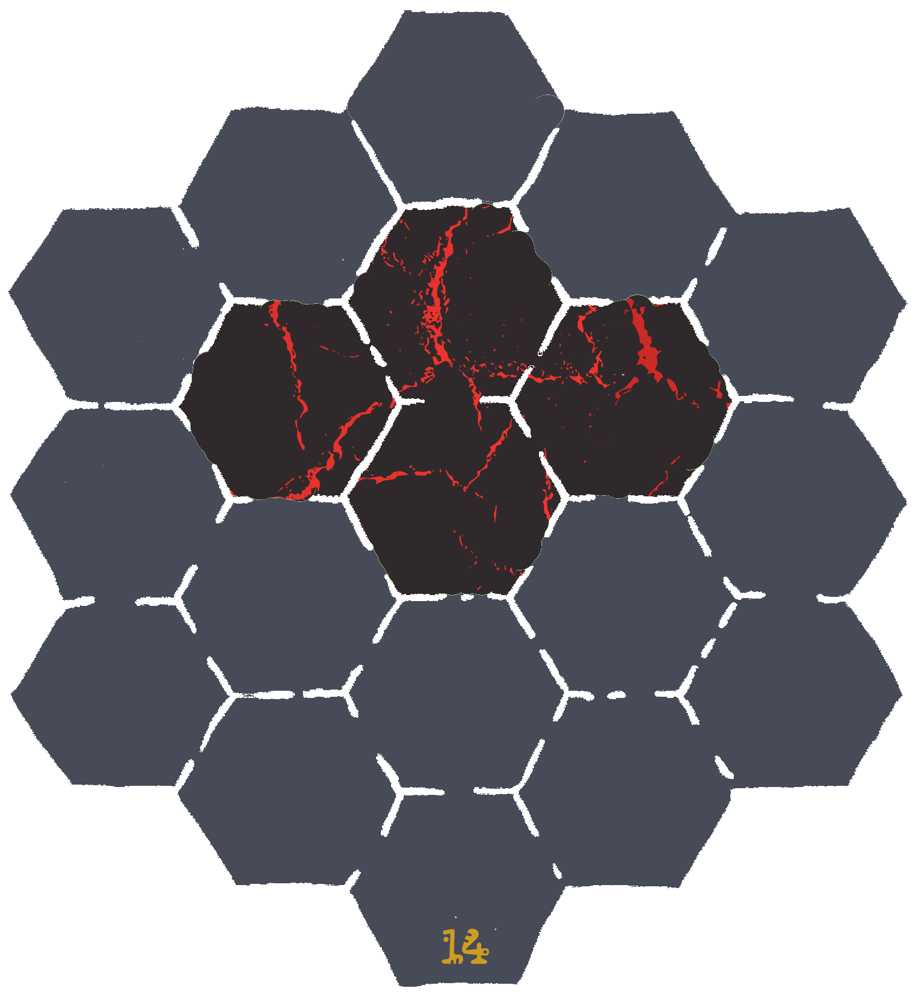

\sinc

# La diosa del volcán

\conc

La diosa Pele que vive en el volcán está enfadada con los habitantes de la isla porque olvidaron poner un tocado de plumas en su última ofrenda.

Pronto recibirá a su hermana Poliʻahu y quiere lucir sus mejores galas durante la estancia de su hermana.

Como diosa del volcán es colérica e irascible y ha decidido mandar sus nieblas a la playa para castigar a sus fieles adoradores de la playa por su altura imperdonable fallo.

\sinc

&nbsp;

## Problemas en Kaona Iole

\conc

Tus riokes estarán en su día a día trabajando según dicte su trasfondo, recolectando cocos, pescando, bailando hula, etc.

Sin previo aviso, el pututu de las mareas sonará con el tono de alerta. Desde el volcán desciende la niebla de Pele y parece mucho más grande que otras veces.

Tus aventureros/as pueden ayudar a evacuar el pueblo, traslado ancianos, reuniendo al ganado o recogiendo equipo y víveres para un par días.

Deberían acabar dentro de la niebla y sufrir sus efectos para que empiecen a probar lo que les espera. Si no entran heroicamente a salvar a alguien de los gases tóxicos, quizás se vean atrapados al tratar de salvar su pellejo.

### La decisión de les kahunas

Los riokes se reunirán en la atalaya que quedará por encima de las nieblas. Tras los primeros instantes de desconcierto, matai Mahuru se reunirá con sus consejeres, les 3 kahunas. Tras varias horas de deliberaciones Mahuru se acercará a su pueblo y les dirá solemnemente:

```
He consultado a los kahunas y hemos deducido que hemos enfadado a la diosa con nuestros actos. Creemos que debemos buscar y consultar a la añeja Lamor para que nos diga que debemos hacer para recuperar el favor de la diosa. Aquellos y aquellas que sean lo suficientemente valientes para intentar esta gesta que den un paso al frente.
```

Matai Mahuru pedirá voluntarios para cumplir esta gran misión. Si no llega al cupo de 4, uno de les 3 kahunas lanzarán sus caracolas de adivinación y elegirá al resto de tus riokes.

\sp

\sinc

## Buscando a la añeja Lamor

&nbsp;

\conc

Tu grupo de riokes deberá prepararse para el viaje. Les darán víveres para ir y volver al cabo este. Les dirán que la añeja Lamor estará en alguna cala, pero no pueden estar seguro de en cuál. Deberán explorar cada casilla a ver si está Lamor en ellas.

La ubicación la añeja Lamor no es fija y tus roedores deberán explorar las calas del cabo este de la isla para encontrarla. Deberán llegar hasta una zona de playa y allí explorar esas zonas y tirar en la tabla de encuentros. 

XXX

|1d6|Encuentro la añeja Lamor|
|---|---|
|1|Algas comestibles (tarjeta de raciones)|
|2|1d4 cangrejos de especies aleatoria|
|3|Un grupo de kiores surfistas que pueden saber algo|
|4|Almejas de excelente calidad (50 ca)|
|5|2 gaviotas hambrientas peleándose por un pez muerto|
|6|La añeja Lamor|

### La añeja Lamor

La añeja Lamor es una gigantesca tortuga laúd de más de 200 años. Ha vivido muchas cosas y sabe muchas cosas, incluso se dice que ya era vieja en tiempos de los ancestros.

Como tortuga ya habla y reacciona muy lentamente, pero es que además está ya muy mayor y cuando se habla con ella habla todavía más lento hasta ser desesperante.

XXX

\sp

\sinc


&nbsp;

|Casilla|Descripción|
|---|---|
|16|**Empiezan aquí**|

\conc

\sp

\sinc

## Camino al volcán

&nbsp;

\conc

El camino al volcán supone atravesar la espesa selva que separa la playa de la falda del volcán. Hay un riachuelo que viene de la montaña y empieza en una cascada. Esa cascada y un remanso más adelante del riachuelo lo frecuenta una Moʻo que suele hacerse pasar por une belle rioke que se baña desnude.

Las casillas vacías (sin número) puedes si quieres rellenarlas con las tablas de puntos de interés y las tablas de encuentros, sabiendo que toda esta zona es selva.

Tus riokes **empezarán en la casilla 14** y deberían llegar hasta la **casilla 8 que es la falda del volcán**.

### El Moʻo del río

XXX

\sp

\sinc


&nbsp;

|Casilla|Descripción|
|---|---|
|3|**Tronco sobre el río**|
|4|**Remanso del río:** Frecuentado por una Moʻo|
|7|**Claro del bosque con una gran piedra en el centro:** Encima de la piedra hay un grabado de lo que parece un mapa del tesoro.|
|8 |***Falda del volcán**|
|9|**Cascada** Frecuentado por una Moʻo|
|12|**Cauce ancho del río**|
|14|**Empiezan aquí**|

\conc

\sp

\sinc

## El suelo es lava

&nbsp;

\conc

XXX

\sp

\sinc


&nbsp;

|Casilla|Descripción|
|---|---|
|14|**Empiezan aquí**|

\conc

\sp

\sinc

## La diosa airada

&nbsp;

\conc

XXX

### La llama de Pele

Mausi robo la llama de Pele y se la dio a los primeros riokes y estos la escondieron en las cuevas de los ancestros. Los aumakuas harán lo que sea para protegerla, así que no será una tarea fácil.

XXX

\sp

\sinc

## Buscando la ofrenda perfecta

&nbsp;

\conc

XXX

### Adentrándose en la cueva de los ancestros

XXX

\sp

\sinc

**MAPA CUEVAS**

\conc

\sp

\sinc

## De vuelta al volcán

&nbsp;

\conc

La ira de Pele ha ido aumentando y con ello la orografía del volcán ha tenido unos cambios drásticos. Si quieres alargar la aventura puedes usar este nuevo mapa de la cima del volcán. Si no te interesa puede pasar directamente al siguiente apartado.

\sp

\sinc



&nbsp;

|Casilla|Descripción|
|---|---|
|14|**Empiezan aquí**|

\conc

\sp

\sinc

## Apaciguando a la diosa

&nbsp;

\conc

XXX

### Los dones de la diosa

XXX

La diosa ofrecerá a tus riokes una serie de tesoros por devolverle la llama. Para generar el tesoro deberás tirar tantos d20 por cada rioke que haya participado en la aventura. Uno de los d20 debes cambiarlo por un 1 directo de forma que el tesoro tenga un don divino mínimo. Si al tirar el d6 del don divino sale un 6 (Llama de Pele) vuelve a tirar. 

\sinc

&nbsp;

## Recibimiento como héroes y heroínas

&nbsp;

\conc

Tus riokes serán recibidos como si fueran el propio Mausi, con collares eli, con ricos manjares, con agua de coco y con bailes de bienvenida hula en los que deberán participar.

Los cuentacuentos estarán ansiosos de escuchar su epopeya para poder añadirlas en su repertorio, añadiendo más épica y magia a los relatos, ya de por sí increíbles.

Puede darles títulos específicos según sus hazañas en la aventura como «mataserpientes» o «buscatesoros», si lo consideras apropiado.

> Tus riokes han explotado la parte sur de la isla (la playa y la selva hasta la falda del volcán), el cabo este y el cabo oeste y la cara sur y la cima del volcán. Pero todavía queda la zona norte con su parte del volcán, de la selva y sus acantilados y calas. Además también tiene el misterioso islote de Hāʻupu que solo vistan les 3 kahunas.
